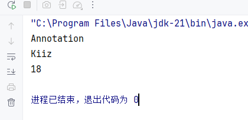
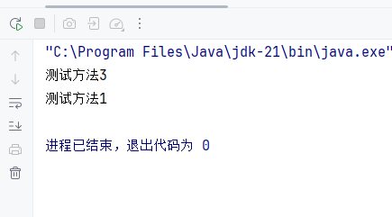
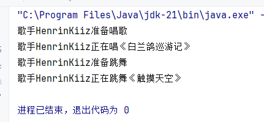
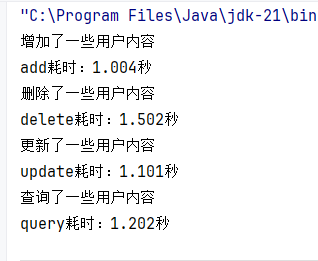

# Java Expert

`更新时间：2026-4-3`

注释解释：

- `<>`必填项，必须在当前位置填写相应数据

- `{}`必选项，必须在当前位置选择一个给出的选项

- `[]`可选项，可以选择填写或忽略

*注：该笔记内的可选项和参数均不完整，如有需要，请查询相关手册*

---

## 反射

反射允许以编程方式访问有关已加载的类的字段，方法和构造器的信息，以及使用反射字段，方法和构造器在封装和安全限制内对其底层对应项进行操作。简单来说，反射可以获取类的信息，例如`JetBrain Intellij IDEA`中，实例化一个类时，会自动补全该类中的所有属性和方法，这就是使用反射实现的

### 反射的步骤

1. 获取`Class`对象

在`Java`中，万物皆对象，即使是类本身，也看作是一个类文件对象。`Java`提供了三种获取`Class`对象的方式

```java
// 直接获取
Class reflectionClass = Reflection.class;
// Class类方法获取
Class reflectionClass2 = Class.forName("com.eiousee.expert.Reflection");
// 对象方法获取
Class reflectionClass3 = new Reflection().getClass();
```

2. 获取类中的信息

`Java`提供了大量获取类有关信息的`API`

**构造器相关**

| 方法                                                         | 说明                         |
| ------------------------------------------------------------ | ---------------------------- |
| `Constructor<?>[] getConstructors()`                         | 获取全部`public`修饰的构造器 |
| `Constructor<?>[] getDeclaredConstructors()`                 | 获取全部构造器               |
| `Constructor<?>[] getConstructor(Class<?>... parameterTypes)` | 获取某个`public`修饰的构造器 |
| `Constructor<?>[] getDeclaredConstructor(Class<?>... parameterTypes)` | 获取某个构造器               |

**示例**

```java
package com.eiousee.expert;

import java.lang.reflect.Constructor;

public class Reflection {
    public static void main(String[] args) throws Exception {
        Class<A> clazz = A.class;
        // 获取所有public构造器
        Constructor[] constructors = clazz.getConstructors();
        for (Constructor constructor : constructors) {
            System.out.println(constructor.getParameterCount());
        }
        // 获取所有构造器
        System.out.println("-------");
        Constructor[] declaredConstructors = clazz.getDeclaredConstructors();
        for (Constructor constructor : declaredConstructors) {
            System.out.println(constructor.getParameterCount());
        }
        // 获取特定构造器
        System.out.println("-------");
        Constructor constructor = clazz.getConstructor(int.class, String.class);
        System.out.println(constructor);

    }
}

class A {
    private int a;
    public String b;

    public A() {}

    private A(int a) {
        this.a = a;
    }

    public A(int a, String b) {
        this.a = a;
        this.b = b;
    }
}
```

> 

**属性相关**

| 方法                                         | 说明                                   |
| -------------------------------------------- | -------------------------------------- |
| `public Field[] getFields()`                 | 获取类中`public`修饰的所有属性         |
| `public Field[] getDeclaredFields()`         | 获取类中的所有属性                     |
| `public Field getField(String name)`         | 获取字段名为`name`，`public`修饰的属性 |
| `public Field getDeclaredField(String name)` | 获取字段名为`name`的属性               |

**示例**

```java
package com.eiousee.expert;

import java.lang.reflect.Constructor;
import java.lang.reflect.Field;

public class Reflection {
    public static void main(String[] args) throws Exception {
        Class<A> clazz = A.class;
        // 获取所有public属性
        Field[] fields = clazz.getFields();
        for (Field field : fields) {
            System.out.println(field.getName());
        }
        // 获取所有属性
        System.out.println("--------------");
        Field[] fields1 = clazz.getDeclaredFields();
        for (Field field : fields1) {
            System.out.println(field.getName());
        }
        // 获取字段名为a的属性
        System.out.println("--------------");
        Field field = clazz.getDeclaredField("a");
        System.out.println(field.getAnnotatedType());
    }
}

class A {
    private int a;
    public String b;

    public A() {}

    private A(int a) {
        this.a = a;
    }

    public A(int a, String b) {
        this.a = a;
        this.b = b;
    }
}
```

> 

**方法相关**

| 方法                                                         | 说明                       |
| ------------------------------------------------------------ | -------------------------- |
| `Method[] getMethods()`                                      | 获取`public`修饰的所有方法 |
| `Method[] getDeclaredMethods()`                              | 获取所有方法               |
| `Method getMethod(String name, Class<?>... parameterTypes)`  | 获取`public`修饰的特定方法 |
| `Method getDeclaredMethod(String name, Class<?>... parameterTypes)` | 获取特定方法               |

### 反射的作用

1. 基本操作，可以得到一个类的全部成分，并进行特定的操作

2. 可以破坏封装性，反射能强制获得`private`权限的属性和方法，或者强制更改`private`属性的内容
3. 可以绕过泛型约束

**示例**

```java
package com.eiousee.expert;

import java.lang.reflect.Method;
import java.util.ArrayList;

public class Reflection {
    public static void main(String[] args) throws Exception {
        // 定义一个ArrayList集合
        ArrayList<String> list = new ArrayList<String>();
        list.add("hello");
        list.add("world");
        // 获取ArrayList集合的Class对象
        Class<?> clazz = list.getClass();
        // 获取add方法
        Method add = clazz.getMethod("add", Object.class);
        // 调用add方法
        add.invoke(list, 123);
        add.invoke(list, true);

        System.out.println(list);
    }
}
```

> 

4. 适合做`Java`框架，如`Spring Framework`、`Hibernate`、`Junit`、`Spring MVC`、`Spring Boot`、`Mybatis`等等

## 注解

注解是`Java`代码中的特殊标记，比如`@Override`、`@Test`等，作用是让其他程序根据注解信息来决定怎么执行程序

### 自定义注解

`Java`允许自定义注解

**标准语法**

```java
public @interface AnnotationName {
    public attributeType attributeName() default value;
}
```

如果注解类中只存在一个属性`value`，或者只有`value`属性没有默认值，那么在使用注解时，可以不写属性名

```java
public @interface MyBook {
    String value();
    int age() default 18;
}

@MyBook(value = "123")
public class Test {}

@MyBook("123")
public class Test {}
```

### 注解原理

注解在经过反编译后，实际是一种特殊的接口。所有的注解都继承自`Annotation`接口

`MyTest1.java`

```java
public @interface MyTest1 {
    String aaa();
    boolean bbb();
}
```

反编译

```java
public interface MyTest1 extends Annotation {
    public abstract String aaa();
    public abstract boolean bbb();
}
```

### 元注解

元注解是指注解注解的注解，如下

```java
@A
public @interface B {}
```

`@A`注解了`@B`，因此`@A`被称为元注解

在`Java`中，常见的元注解有`@Retention`和`@Target`

#### @Target

用于声明被修饰的注解放置的位置，使用`ElementType`枚举类的值来指定

| 值                             | 说明                                                  |
| ------------------------------ | ----------------------------------------------------- |
| `ElementType.TYPE`             | 类、接口                                              |
| `ElementType.FIELD`            | 属性                                                  |
| `ElementType.METHOD`           | 方法                                                  |
| `ElementType.PARAMETER`        | 方法参数                                              |
| `ElementType.CONSTRUCTOR`      | 构造器                                                |
| `ElementType.LOCAL_VARIABLE`   | 局部变量                                              |
| `ElementType.ANNOTATION_TYPE`  | 注解                                                  |
| `ElementType.PACKAGE`          | 包声明文件`package-info.java`                         |
| `ElementType.TYPE_PARAMETER`   | 泛型的类型参数，如`Container<@TypeParamAnnotation T>` |
| `ElementType.TYPE_USE`         | 任何位置                                              |
| `ElementType.MODULE`           | 模块声明文件`module-info.java`                        |
| `ElementType.RECORD_COMPONENT` | 记录类                                                |

#### @Rentention

用户声明注解的保留周期，使用`RetentionPolicy`枚举类的值来指定

| 值                        | 说明                                     |
| ------------------------- | ---------------------------------------- |
| `RetentionPolicy.SOURCE`  | 只作用于源代码阶段，字节码文件中不存在   |
| `RetentionPolicy.CLASS`   | 默认值。保留到字节码阶段，运行阶段不存在 |
| `RetentionPolicy.RUNTIME` | 一直保留到运行阶段                       |

### 注解解析

注解解析是指判断类、方法、属性上是否存在注解，如果存在，则将注解内容解析出来。想要解析某个类、方法、属性上的注解，就必须获取该类、方法、属性。`Class`、`Method`、`Field`、`Constructor`都实现了`AnnotatedElement`接口，因此提供了解析注解的功能

| API                                                          | 说明                         |
| ------------------------------------------------------------ | ---------------------------- |
| `public Annotation[] getDeclaredAnnotations()`               | 获取当前对象的所有注解       |
| `public T getDeclaredAnnotation(Class<T> annotationClass)`   | 获取指定的注解对象           |
| `public boolean isAnnotationPresent(Class<Annotation> annotationClass)` | 判断当前对象是否存在某个注解 |

**示例**

`MyAnnotation.java`

```java
package com.eiousee.expert;

import java.lang.annotation.ElementType;
import java.lang.annotation.Retention;
import java.lang.annotation.RetentionPolicy;
import java.lang.annotation.Target;

@Target(ElementType.TYPE)
@Retention(RetentionPolicy.RUNTIME)
@interface MyAnnotation {
    String value();
    int age() default 18;
    String name();
}
```

`Annotation.java`

```java
package com.eiousee.expert;

@MyAnnotation(value = "Annotation", name = "Kiiz")
public class Annotation {
    public static void main(String[] args) {
        // 获取类对象
        Class clazz = Annotation.class;
        // 获取注解对象
        MyAnnotation annotation = (MyAnnotation) clazz.getDeclaredAnnotation(MyAnnotation.class);
        // 获取注解的属性值
        System.out.println(annotation.value());
        System.out.println(annotation.name());
        System.out.println(annotation.age());
    }
}
```

> 

*注：这里必须设置`@Retention(RetentionPolicy.RUNTIME)`，反射在获取注解对象时，必须保证运行时注解仍然存在，而`RetentionPolicy`的默认值是`CLASS`，在运行时会自动销毁*

### 练习-简易Junit

使用自定义注解，制作一个简易的`Junit`单元测试，注解作用范围限制为`ElementType.METHOD`，要求加上注解的方法可以运行

`MyTest.java`

```java
package com.eiousee.expert;

import java.lang.annotation.ElementType;
import java.lang.annotation.Retention;
import java.lang.annotation.RetentionPolicy;
import java.lang.annotation.Target;

@Target(ElementType.METHOD)
@Retention(RetentionPolicy.RUNTIME)
public @interface MyTest {
}
```

`Test.java`

```java
package com.eiousee.expert;

import java.lang.reflect.Method;

public class Test {
    public static void main(String[] args) throws Exception {
        Test test = new Test();
        Class c = Test.class;
        Method[] methods = c.getDeclaredMethods();
        for (Method m : methods) {
            if (m.isAnnotationPresent(MyTest.class)) {
                m.invoke(test);
            }
        }
    }

    @MyTest
    public void test1() {
        System.out.println("测试方法1");
    }

    public void test2() {
        System.out.println("测试方法2");
    }

    @MyTest
    public void test3() {
        System.out.println("测试方法3");
    }

    public void test4() {
        System.out.println("测试方法4");
    }
}
```

> 

## 动态代理

代理是指通过调用第三方类，来实现调用目标类方法的行为。在`Java`中，通常使用接口来定义代理规范，目标类为父接口，代理类继承目标类接口来实现相同方法，并暴露给外部使用

**标准语法**

```java
public static Object newProxyInstance(ClassLoader loader, Class<?>[] interfaces, InvocationHandler h)
```

- `ClassLoader loader`：指定类加载器，加载生成的代理类
- `Class<?>[] interfaces`：指定目标类接口，也就是代理类需要实现的方法
- `InvocationHandler h`：指定代理对象行为

**示例**

假设某市为完善文艺建设，邀请歌手`HK`开办演唱会，但是，相关人员无法直接联系歌手本人，而是联系其经纪人`MO`，通过`MO`代理来实现`HK`的行为

`Singer.java`

```java
package com.eiousee.expert;

import lombok.AllArgsConstructor;
import lombok.Data;
import lombok.NoArgsConstructor;

@Data
@AllArgsConstructor
@NoArgsConstructor
public class Singer implements SingerBehavior{
    private String name;

    @Override
    public void sing(String song) {
        System.out.println("歌手" + name + "正在唱" + song);
    }

    @Override
    public void dance(String danceName) {
        System.out.println("歌手" + name + "正在跳舞" + danceName);
    }
}
```

`SingerBehavior.java`

```java
package com.eiousee.expert;

public interface SingerBehavior {
    public void sing(String song);
    public void dance(String danceName);
}
```

`Broker.java`

```java
package com.eiousee.expert;

import java.lang.reflect.Proxy;

public class Broker {
    public static SingerBehavior prepareConcert(Singer singer) {
        return (SingerBehavior) Proxy.newProxyInstance(
                singer.getClass().getClassLoader(),
                singer.getClass().getInterfaces(),
                (proxy, method, args) -> {
                    String methodName = method.getName();
                    switch (methodName) {
                        case "sing":
                            System.out.println("歌手" + singer.getName() + "准备唱歌");
                            break;
                        case "dance":
                            System.out.println("歌手" + singer.getName() + "准备跳舞");
                            break;
                    }
                    return method.invoke(singer, args);
                }
        );
    }
}
```

`Concert.java`

```java
package com.eiousee.expert;

public class Concert {
    public static void main(String[] args) {
        Singer singer = new Singer("HenrinKiiz");
        SingerBehavior singerBehavior = Broker.prepareConcert(singer);
        singerBehavior.sing("《白兰鸽巡游记》");
        singerBehavior.dance("《触摸天空》");
    }
}
```

> 

### 练习-方法时长统计

假设`Eiousee`公司新招了一位程序员，他编写了一些增删改查的逻辑，同时为其增加了计算方法执行时长的功能，但是公司领导认为这名程序员的代码水平不佳，希望你予以改进，达到任何新增方法都能随时统计时长的效果

**源代码**

`Main.java`

```java
package com.eiousee.expert.calculation;

public class Main {
    public static void main(String[] args) throws Exception {
        SourceInterface source = new SourceImpl();
        source.add();
        source.delete();
        source.update();
        source.query();
    }
}
```

`SourceInterface.java`

```java
package com.eiousee.expert.calculation;

public interface SourceInterface {
    public void add() throws Exception;
    public void delete() throws Exception;
    public void update() throws Exception;
    public void query() throws Exception;
}
```

`SourceImpl.java`

```java
package com.eiousee.expert.calculation;

public class SourceImpl implements SourceInterface{
    @Override
    public void add() throws Exception {
        long start = System.currentTimeMillis();

        System.out.println("增加了一些用户内容");
        Thread.sleep(1000);

        long end = System.currentTimeMillis();
        System.out.println("耗时：" + (end - start) / 1000.0 + "秒");
    }

    @Override
    public void delete() throws Exception{
        long start = System.currentTimeMillis();

        System.out.println("删除了一些用户内容");
        Thread.sleep(1500);

        long end = System.currentTimeMillis();
        System.out.println("耗时：" + (end - start) / 1000.0 + "秒");
    }

    @Override
    public void update() throws Exception{
        long start = System.currentTimeMillis();

        System.out.println("更新了一些用户内容");
        Thread.sleep(1100);

        long end = System.currentTimeMillis();
        System.out.println("耗时：" + (end - start) / 1000.0 + "秒");
    }

    @Override
    public void query() throws Exception{
        long start = System.currentTimeMillis();

        System.out.println("查询了一些用户内容");
        Thread.sleep(1200);

        long end = System.currentTimeMillis();
        System.out.println("耗时：" + (end - start) / 1000.0 + "秒");
    }
}
```

**改进**

我们可以利用代理的思想，设计一个代理类，通过代理执行相应的方法，并独立计算方法执行时长

`Main.java`

```java
package com.eiousee.expert.calculation;

public class Main {
    public static void main(String[] args) throws Exception {
        SourceInterface source = ProxyUtil.getProxy(new SourceImpl());
        source.add();
        source.delete();
        source.update();
        source.query();
    }
}
```

`ProxyUtil.java`

```java
package com.eiousee.expert.calculation;

import javax.xml.transform.Source;
import java.lang.reflect.Proxy;

public class ProxyUtil {
    public static SourceInterface getProxy(SourceInterface source) {
        return (SourceInterface) Proxy.newProxyInstance(
                SourceImpl.class.getClassLoader(),
                SourceImpl.class.getInterfaces(),
                (proxy, method, args) -> {
                    long start = System.currentTimeMillis();

                    Object result = method.invoke(source, args);

                    long end = System.currentTimeMillis();
                    System.out.println(method.getName() + "耗时：" + (end - start) / 1000.0 + "秒");

                    return result;
                }
        );
     }
}
```

`SourceImpl.java`

```java
package com.eiousee.expert.calculation;

public class SourceImpl implements SourceInterface{
    @Override
    public void add() throws Exception {
        System.out.println("增加了一些用户内容");
        Thread.sleep(1000);
    }

    @Override
    public void delete() throws Exception{
        System.out.println("删除了一些用户内容");
        Thread.sleep(1500);
    }

    @Override
    public void update() throws Exception{
        System.out.println("更新了一些用户内容");
        Thread.sleep(1100);
    }

    @Override
    public void query() throws Exception{
        System.out.println("查询了一些用户内容");
        Thread.sleep(1200);
    }
}
```

> 

相应地，我们也可以用泛型来约束代理类中的数据类型，让代理类实现可以接收任意类型，任意方法的效果

`ProxyUtil.java`

```java
package com.eiousee.expert.calculation;

import java.lang.reflect.Proxy;

public class ProxyUtil {
    public static <T> T getProxy(T obj) {
        return (T) Proxy.newProxyInstance(
                obj.getClass().getClassLoader(),
                obj.getClass().getInterfaces(),
                (proxy, method, args) -> {
                    long start = System.currentTimeMillis();

                    Object result = method.invoke(obj, args);

                    long end = System.currentTimeMillis();
                    System.out.println(method.getName() + "耗时：" + (end - start) / 1000.0 + "秒");

                    return result;
                }
        );
     }
}
```
