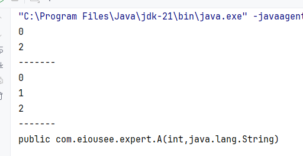
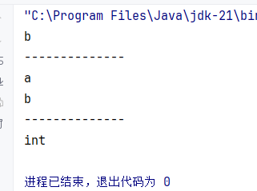
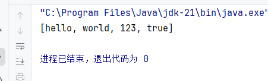

# Java Expert

`更新时间：2026-4-2`

注释解释：

- `<>`必填项，必须在当前位置填写相应数据

- `{}`必选项，必须在当前位置选择一个给出的选项

- `[]`可选项，可以选择填写或忽略

*注：该笔记内的可选项和参数均不完整，如有需要，请查询相关手册*

---

## 反射

反射允许以编程方式访问有关已加载的类的字段，方法和构造器的信息，以及使用反射字段，方法和构造器在封装和安全限制内对其底层对应项进行操作。简单来说，反射可以获取类的信息，例如`JetBrain Intellij IDEA`中，实例化一个类时，会自动补全该类中的所有属性和方法，这就是使用反射实现的

### 反射的步骤

1. 获取`Class`对象

在`Java`中，万物皆对象，即使是类本身，也看作是一个类文件对象。`Java`提供了三种获取`Class`对象的方式

```java
// 直接获取
Class reflectionClass = Reflection.class;
// Class类方法获取
Class reflectionClass2 = Class.forName("com.eiousee.expert.Reflection");
// 对象方法获取
Class reflectionClass3 = new Reflection().getClass();
```

2. 获取类中的信息

`Java`提供了大量获取类有关信息的`API`

**构造器相关**

| 方法                                                         | 说明                         |
| ------------------------------------------------------------ | ---------------------------- |
| `Constructor<?>[] getConstructors()`                         | 获取全部`public`修饰的构造器 |
| `Constructor<?>[] getDeclaredConstructors()`                 | 获取全部构造器               |
| `Constructor<?>[] getConstructor(Class<?>... parameterTypes)` | 获取某个`public`修饰的构造器 |
| `Constructor<?>[] getDeclaredConstructor(Class<?>... parameterTypes)` | 获取某个构造器               |

**示例**

```java
package com.eiousee.expert;

import java.lang.reflect.Constructor;

public class Reflection {
    public static void main(String[] args) throws Exception {
        Class<A> clazz = A.class;
        // 获取所有public构造器
        Constructor[] constructors = clazz.getConstructors();
        for (Constructor constructor : constructors) {
            System.out.println(constructor.getParameterCount());
        }
        // 获取所有构造器
        System.out.println("-------");
        Constructor[] declaredConstructors = clazz.getDeclaredConstructors();
        for (Constructor constructor : declaredConstructors) {
            System.out.println(constructor.getParameterCount());
        }
        // 获取特定构造器
        System.out.println("-------");
        Constructor constructor = clazz.getConstructor(int.class, String.class);
        System.out.println(constructor);

    }
}

class A {
    private int a;
    public String b;

    public A() {}

    private A(int a) {
        this.a = a;
    }

    public A(int a, String b) {
        this.a = a;
        this.b = b;
    }
}
```

> 

**属性相关**

| 方法                                         | 说明                                   |
| -------------------------------------------- | -------------------------------------- |
| `public Field[] getFields()`                 | 获取类中`public`修饰的所有属性         |
| `public Field[] getDeclaredFields()`         | 获取类中的所有属性                     |
| `public Field getField(String name)`         | 获取字段名为`name`，`public`修饰的属性 |
| `public Field getDeclaredField(String name)` | 获取字段名为`name`的属性               |

**示例**

```java
package com.eiousee.expert;

import java.lang.reflect.Constructor;
import java.lang.reflect.Field;

public class Reflection {
    public static void main(String[] args) throws Exception {
        Class<A> clazz = A.class;
        // 获取所有public属性
        Field[] fields = clazz.getFields();
        for (Field field : fields) {
            System.out.println(field.getName());
        }
        // 获取所有属性
        System.out.println("--------------");
        Field[] fields1 = clazz.getDeclaredFields();
        for (Field field : fields1) {
            System.out.println(field.getName());
        }
        // 获取字段名为a的属性
        System.out.println("--------------");
        Field field = clazz.getDeclaredField("a");
        System.out.println(field.getAnnotatedType());
    }
}

class A {
    private int a;
    public String b;

    public A() {}

    private A(int a) {
        this.a = a;
    }

    public A(int a, String b) {
        this.a = a;
        this.b = b;
    }
}
```

> 

**方法相关**

| 方法                                                         | 说明                       |
| ------------------------------------------------------------ | -------------------------- |
| `Method[] getMethods()`                                      | 获取`public`修饰的所有方法 |
| `Method[] getDeclaredMethods()`                              | 获取所有方法               |
| `Method getMethod(String name, Class<?>... parameterTypes)`  | 获取`public`修饰的特定方法 |
| `Method getDeclaredMethod(String name, Class<?>... parameterTypes)` | 获取特定方法               |

### 反射的作用

1. 基本操作，可以得到一个类的全部成分，并进行特定的操作

2. 可以破坏封装性，反射能强制获得`private`权限的属性和方法，或者强制更改`private`属性的内容
3. 可以绕过泛型约束

**示例**

```java
package com.eiousee.expert;

import java.lang.reflect.Method;
import java.util.ArrayList;

public class Reflection {
    public static void main(String[] args) throws Exception {
        // 定义一个ArrayList集合
        ArrayList<String> list = new ArrayList<String>();
        list.add("hello");
        list.add("world");
        // 获取ArrayList集合的Class对象
        Class<?> clazz = list.getClass();
        // 获取add方法
        Method add = clazz.getMethod("add", Object.class);
        // 调用add方法
        add.invoke(list, 123);
        add.invoke(list, true);

        System.out.println(list);
    }
}
```

> 

4. 适合做`Java`框架，如`Spring Framework`、`Hibernate`、`Junit`、`Spring MVC`、`Spring Boot`、`Mybatis`等等

## 注解

注解是`Java`代码中的特殊标记，比如`@Override`、`@Test`等，作用是让其他程序根据注解信息来决定怎么执行程序

### 自定义注解

`Java`允许自定义注解

**标准语法**

```java
public @interface AnnotationName {
    public attributeType attributeName() default value;
}
```

如果注解类中只存在一个属性`value`，或者只有`value`属性没有默认值，那么在使用注解时，可以不写属性名

```java
public @interface MyBook {
    String value();
    int age() default 18;
}

@MyBook(value = "123")
public class Test {}

@MyBook("123")
public class Test {}
```

### 注解原理

注解在经过反编译后，实际是一种特殊的接口。所有的注解都继承自`Annotation`接口

`MyTest1.java`

```java
public @interface MyTest1 {
    String aaa();
    boolean bbb();
}
```

反编译

```java
public interface MyTest1 extends Annotation {
    public abstract String aaa();
    public abstract boolean bbb();
}
```

### 元注解

元注解是指注解注解的注解，如下

```java
@A
public @interface B {}
```

`@A`注解了`@B`，因此`@A`被称为元注解

在`Java`中，常见的元注解有`@Retention`和`@Target`

#### @Target

用于声明被修饰的注解放置的位置，使用`ElementType`枚举类的值来指定

| 值                             | 说明                                                  |
| ------------------------------ | ----------------------------------------------------- |
| `ElementType.TYPE`             | 类、接口                                              |
| `ElementType.FIELD`            | 属性                                                  |
| `ElementType.METHOD`           | 方法                                                  |
| `ElementType.PARAMETER`        | 方法参数                                              |
| `ElementType.CONSTRUCTOR`      | 构造器                                                |
| `ElementType.LOCAL_VARIABLE`   | 局部变量                                              |
| `ElementType.ANNOTATION_TYPE`  | 注解                                                  |
| `ElementType.PACKAGE`          | 包声明文件`package-info.java`                         |
| `ElementType.TYPE_PARAMETER`   | 泛型的类型参数，如`Container<@TypeParamAnnotation T>` |
| `ElementType.TYPE_USE`         | 任何位置                                              |
| `ElementType.MODULE`           | 模块声明文件`module-info.java`                        |
| `ElementType.RECORD_COMPONENT` | 记录类                                                |

#### @Rentention

用户声明注解的保留周期，使用`RetentionPolicy`枚举类的值来指定

| 值                        | 说明                                     |
| ------------------------- | ---------------------------------------- |
| `RetentionPolicy.SOURCE`  | 只作用于源代码阶段，字节码文件中不存在   |
| `RetentionPolicy.CLASS`   | 默认值。保留到字节码阶段，运行阶段不存在 |
| `RetentionPolicy.RUNTIME` | 一直保留到运行阶段                       |

