# Java Web

`更新时间：2026-3-13`

注释解释：

- `<>`必填项，必须在当前位置填写相应数据

- `{}`必选项，必须在当前位置选择一个给出的选项

- `[]`可选项，可以选择填写或忽略

*注：该笔记内的可选项和参数均不完整，如有需要，请查询相关手册*

---

## Vue

`Vue`是一款用于构建用户界面的渐进式`JavaScript`框架

构建用户界面指将后端得到的`json`数据渲染为用户能够看到的界面。渐进式是指`Vue`的设计可以逐步采用，使用分层的核心思想，可以从一个简单的功能开始，然后根据需要逐步引入更多 `Vue`的能力，而不需要一开始就做全盘的重构

### Vue快速入门

通过一个案例来进行`Vue`的快速入门，案例要求是使用`Vue`将一段来自后端的内容`message: "Hello, Vue"`渲染到前端，并进行加粗

- 准备

  - 从官方网站引入`Vue`模块

  ```html
  <script type="module">
  	import {createApp} from "https://unpkg.com/vue@3/dist/vue.esm-browser.js"
  </script>
  ```

  - 创建`Vue`程序的应用实例，控制视图的元素

  ```html
  <script type="module">
  	import {createApp} from "https://unpkg.com/vue@3/dist/vue.esm-browser.js"
  
  	createApp({
          
      })
  </script>
  ```

  - 准备元素`div`，并被`Vue`控制

  ```html
  <div class="app">
  	<!-- 被Vue控制区域 -->  
  </div>
  <script type="module">
  	import {createApp} from "https://unpkg.com/vue@3/dist/vue.esm-browser.js"
  
  	createApp({
          
      }).mount(".app")
  </script>
  ```

- 数据驱动识图

  - 准备数据，重写方法`data()`，返回需要的数据实例，数据类型为`object`，其中包含属性`message`。

  ```html
  <div class="app">
  	<!-- 被Vue控制区域 -->  
  </div>
  <script type="module">
  	import {createApp} from "https://unpkg.com/vue@3/dist/vue.esm-browser.js"
  
  	createApp({
          data() {
              return {
                  message: "Hello, Vue"
              }
          }
      }).mount(".app")
  </script>
  ```

  - 通过插值表达式`{{实例属性}}`渲染页面，注意插值表达式不能出现在标签内部

  ```html
  <div class="app">
  	<h1>{{message}}</h1> 
  </div>
  <script type="module">
  	import {createApp} from "https://unpkg.com/vue@3/dist/vue.esm-browser.js"
  
  	createApp({
          data() {
              return {
                  message: "Hello, Vue"
              }
          }
      }).mount(".app")
  </script>
  ```

> 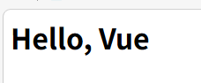

### Vue常用指令

`Vue`常用指令是指`HTML`标签上带有`v-`前缀的特殊属性，不同的指令拥有不用的含义，可以实现不同的功能

| 指令                      | 作用                                             |
| ------------------------- | ------------------------------------------------ |
| v-for                     | 列表渲染，遍历容器的元素或者对象的属性           |
| v-bind                    | 为HTML标签绑定属性值，如设置`href`、`css`样式等  |
| v-if / v-else / v-else-if | 条件性渲染某元素，判定为`true`时渲染，否则不渲染 |
| v-show                    | 根据条件改变标签`css`的`display`属性值           |
| v-model                   | 在表单元素上创建双向数据绑定                     |
| v-on                      | 为`HTML`标签绑定事件                             |

#### v-for

**标准语法**

```vue
<tr v-for="(item, [index]) in items"[ :key="unique key"]>{{item}}</tr>
```

- `items`：需要遍历的数组对象
- `item`：数组对象中的每个元素
- `index`：当前元素的索引值，从0开始
- `key`：给元素添加的唯一标识，用于提升遍历性能，可以填入某个元素属性来作为标识符

**示例**

```js
employeeList: [
    {
        "id": 1,
        "name": "jack",
        "gender": "male"
    },
    {
        "id": 2,
        "name": "tom",
        "gender": "male"
    },
    {
        "id": 3,
        "name": "lucy",
        "gender": "female"
    }
]
```

如上，在员工管理系统中，事先准备好了一些员工数据，现在需要渲染到前端

有多条员工数据，每个员工独占一行，因此在`tr`标签中添加`v-for`属性遍历员工数组，每个`tr`的`td`处使用插值表达式显示相应的员工数据

```vue
<html>
    <div class="app">
        <table>
            <thead>
                <tr>
                    <th>Id</th>
                    <th>Name</th>
                    <th>Gender</th>
                </tr>
            </thead>
            <tbody>
                <tr v-for="employee in employeeList" :key="employee.id">
                    <td>{{employee.id}}</td>
                    <td>{{employee.name}}</td>
                    <td>{{employee.gender}}</td>
                </tr>
            </tbody>
        </table> 
    </div>
    <script type="module">
        import {createApp} from "https://unpkg.com/vue@3/dist/vue.esm-browser.js"
    
        createApp({
            data() {
                return {
                    employeeList: [
                        {
                            "id": 1,
                            "name": "jack",
                            "gender": "male"
                        },
                        {
                            "id": 2,
                            "name": "tom",
                            "gender": "male"
                        },
                        {
                            "id": 3,
                            "name": "lucy",
                            "gender": "female"
                        }
                    ]
                }
            }
        }).mount(".app")
    </script>
</html>
```

> 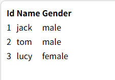

#### v-bind

**标准语法**

```vue

```

其中`v-bind`可以简化省略

**示例**

```vue
employeeList: [
    {
        "id": 1,
        "name": "jack",
        "gender": "male",
		"avatar": "https://img.pconline.com.cn/images/upload/upc/tx/itbbs/1804/23/c23/84211055_1524470634645_mthumb.jpg"
    },
    {
        "id": 2,
        "name": "tom",
        "gender": "male",
		"avatar": ""
    },
    {
        "id": 3,
        "name": "lucy",
        "gender": "female",
		"avatar": ""
    }
]
```

现在我们需要为每位员工添加一个头像，头像链接已经添加到了`employeeList`数组中

添加`img`标签，为`img`标签的`src`属性设置为`v-bind`属性，通过获取`employee.avatar`来获取员工头像链接

```vue
<html>
    <div class="app">
        <table>
            <thead>
                <tr>
                    <th>Id</th>
                    <th>Name</th>
                    <th>Gender</th>
                    <th>Avatar</th>
                </tr>
            </thead>
            <tbody>
                <tr v-for="employee in employeeList" :key="employee.id">
                    <td>{{employee.id}}</td>
                    <td>{{employee.name}}</td>
                    <td>{{employee.gender}}</td>
                    <td></td>
                </tr>
            </tbody>
        </table> 
    </div>
    <script type="module">
        import {createApp} from "https://unpkg.com/vue@3/dist/vue.esm-browser.js"
    
        createApp({
            data() {
                return {
                    employeeList: [
                        {
                            "id": 1,
                            "name": "jack",
                            "gender": "male",
                            "avatar": "https://ts2.tc.mm.bing.net/th/id/OIP-C.0BBEJKqmDN6MoIm11sRSigHaLH?pid=ImgDet&w=60&h=60&c=7&rs=1&o=7&rm=3"
                        },
                        {
                            "id": 2,
                            "name": "tom",
                            "gender": "male",
                            "avatar": "https://ts3.tc.mm.bing.net/th/id/OIP-C.wYmbI_r2a8cDTJUBJ9HRcgHaLH?pid=ImgDet&w=60&h=60&c=7&rs=1&o=7&rm=3"
                        },
                        {
                            "id": 3,
                            "name": "lucy",
                            "gender": "female",
                            "avatar": ""
                        }
                    ]
                }
            }
        }).mount(".app")
    </script>
</html>
```

> 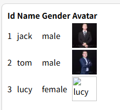

#### v-if

**标准语法**

```vue
<span v-if="conditon1"></span>
<span v-else-if="conditon2"></span>
<span v-else></span>
```

**示例**

```vue
employeeList: [
    {
        "id": 1,
        "name": "jack",
        "gender": "male",
        "avatar": "https://img.pconline.com.cn/images/upload/upc/tx/itbbs/1804/23/c23/84211055_1524470634645_mthumb.jpg",
        "position": 1
    },
    {
        "id": 2,
        "name": "tom",
        "gender": "male",
        "avatar": "https://ts3.tc.mm.bing.net/th/id/OIP-C.wYmbI_r2a8cDTJUBJ9HRcgHaLH?pid=ImgDet&w=60&h=60&c=7&rs=1&o=7&rm=3",
        "position": 2
    },
    {
        "id": 3,
        "name": "lucy",
        "gender": "female",
        "avatar": "",
        "position": 3
    }
]
```

现在每个员工拥有自己的职位，但是在数据库中使用职位号来标识职位，前端需要显示对应的职位名

添加多行`span`，为每个`span`设置一个职位名，通过`v-if`属性来判断当前员工的职位，然后决定是否显示

```vue
<html>
    <div class="app">
        <table>
            <thead>
                <tr>
                    <th>Id</th>
                    <th>Name</th>
                    <th>Gender</th>
                    <th>Avatar</th>
                    <th>Position</th>
                </tr>
            </thead>
            <tbody>
                <tr v-for="employee in employeeList" :key="employee.id">
                    <td>{{employee.id}}</td>
                    <td>{{employee.name}}</td>
                    <td>{{employee.gender}}</td>
                    <td></td>
                    <td>
                        <span v-if="employee.position==1">boss</span>
                        <span v-else-if="employee.position==2">manager</span>
                        <span v-else>other</span>
                    </td>
                </tr>
            </tbody>
        </table> 
    </div>
    <script type="module">
        import {createApp} from "https://unpkg.com/vue@3/dist/vue.esm-browser.js"
    
        createApp({
            data() {
                return {
                    employeeList: [
                        {
                            "id": 1,
                            "name": "jack",
                            "gender": "male",
                            "avatar": "https://img.pconline.com.cn/images/upload/upc/tx/itbbs/1804/23/c23/84211055_1524470634645_mthumb.jpg",
                            "position": 1
                        },
                        {
                            "id": 2,
                            "name": "tom",
                            "gender": "male",
                            "avatar": "https://ts3.tc.mm.bing.net/th/id/OIP-C.wYmbI_r2a8cDTJUBJ9HRcgHaLH?pid=ImgDet&w=60&h=60&c=7&rs=1&o=7&rm=3",
                            "position": 2
                        },
                        {
                            "id": 3,
                            "name": "lucy",
                            "gender": "female",
                            "avatar": "",
                            "position": 3
                        }
                    ]
                }
            }
        }).mount(".app")
    </script>
</html>
```

> 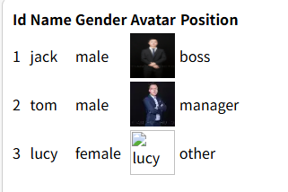

#### v-show

**标准语法**

```vue
<span v-show="condition"></span>
```

`v-show`与`v-if`的区别是元素显示逻辑的区别，`v-show`通过更改元素标签的`display`样式来决定是否显示，而`v-if`则是通过是否渲染标签来决定是否显示，在需要频繁更改显示状态的内容中`v-show`更适合

**示例**

使用`v-show`来达到上文员工职位显示的效果

```vue
<html>
    <div class="app">
        <table>
            <thead>
                <tr>
                    <th>Id</th>
                    <th>Name</th>
                    <th>Gender</th>
                    <th>Avatar</th>
                    <th>Position</th>
                </tr>
            </thead>
            <tbody>
                <tr v-for="employee in employeeList" :key="employee.id">
                    <td>{{employee.id}}</td>
                    <td>{{employee.name}}</td>
                    <td>{{employee.gender}}</td>
                    <td></td>
                    <td>
                        <span v-show="employee.position==1">boss</span>
                        <span v-show="employee.position==2">manager</span>
                        <span v-show="employee.position==3">other</span>
                    </td>
                </tr>
            </tbody>
        </table> 
    </div>
    <script type="module">
        import {createApp} from "https://unpkg.com/vue@3/dist/vue.esm-browser.js"
    
        createApp({
            data() {
                return {
                    employeeList: [
                        {
                            "id": 1,
                            "name": "jack",
                            "gender": "male",
                            "avatar": "https://img.pconline.com.cn/images/upload/upc/tx/itbbs/1804/23/c23/84211055_1524470634645_mthumb.jpg",
                            "position": 1
                        },
                        {
                            "id": 2,
                            "name": "tom",
                            "gender": "male",
                            "avatar": "https://ts3.tc.mm.bing.net/th/id/OIP-C.wYmbI_r2a8cDTJUBJ9HRcgHaLH?pid=ImgDet&w=60&h=60&c=7&rs=1&o=7&rm=3",
                            "position": 2
                        },
                        {
                            "id": 3,
                            "name": "lucy",
                            "gender": "female",
                            "avatar": "",
                            "position": 3
                        }
                    ]
                }
            }
        }).mount(".app")
    </script>
</html>
```


#### v-model

 **标准语法**

```vue
<input type="text" id="name" v-model="object.attribute">
```

将用户输入与`object`对象的`attribute`属性绑定

**示例**

```vue
searchForm: {
	name: "",
	gender: "",
	position: ""
}
```

现在需要能够通过员工信息来搜索相应的元素，搜索表单格式如上

新建`form`表单，在表单中创建输入框`input`和选择框`select`，分别设置对应的`v-model`，与`searchForm`对象绑定

```vue
<html>
    <div class="app">
        {{searchForm}}
        <form>
            <label for="name">Name: </label>
            <input type="text" id="name" v-model="searchForm.name">
            &nbsp;&nbsp;
            <label for="gender">Gender: </label>
            <select name="gender" id="gender" v-model="searchForm.gender">
                <option value="">All</option>
                <option value="male">Male</option>
                <option value="female">Female</option>
            </select>
            &nbsp;&nbsp;
            <label for="position">Position: </label>
            <select name="position" id="position" v-model="searchForm.position">
                <option value="">All</option>
                <option value="1">Boss</option>
                <option value="2">Manager</option>
                <option value="3">Other</option>
            </select>
            &nbsp;&nbsp;
            <button type="button">Search</button>
        </form>
        <table>
            <thead>
                <tr>
                    <th>Id</th>
                    <th>Name</th>
                    <th>Gender</th>
                    <th>Avatar</th>
                    <th>Position</th>
                </tr>
            </thead>
            <tbody>
                <tr v-for="employee in employeeList" :key="employee.id">
                    <td>{{employee.id}}</td>
                    <td>{{employee.name}}</td>
                    <td>{{employee.gender}}</td>
                    <td></td>
                    <td>
                        <span v-if="employee.position==1">boss</span>
                        <span v-else-if="employee.position==2">manager</span>
                        <span v-else-if="employee.position==3">other</span>
                    </td>
                </tr>
            </tbody>
        </table> 
    </div>
    <script type="module">
        import {createApp} from "https://unpkg.com/vue@3/dist/vue.esm-browser.js"
    
        createApp({
            data() {
                return {
                    employeeList: [
                        {
                            "id": 1,
                            "name": "jack",
                            "gender": "male",
                            "avatar": "https://img.pconline.com.cn/images/upload/upc/tx/itbbs/1804/23/c23/84211055_1524470634645_mthumb.jpg",
                            "position": 1
                        },
                        {
                            "id": 2,
                            "name": "tom",
                            "gender": "male",
                            "avatar": "https://ts3.tc.mm.bing.net/th/id/OIP-C.wYmbI_r2a8cDTJUBJ9HRcgHaLH?pid=ImgDet&w=60&h=60&c=7&rs=1&o=7&rm=3",
                            "position": 2
                        },
                        {
                            "id": 3,
                            "name": "lucy",
                            "gender": "female",
                            "avatar": "",
                            "position": 3
                        }
                    ],
                    searchForm: {
                        name: "",
                        gender: "",
                        position: ""
                    }
                }
            }
        }).mount(".app")
    </script>
</html>
```

> 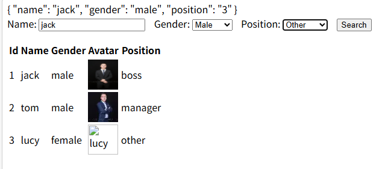

#### v-on

**标准语法**

```vue
<button type="button" v-on:click="click">click</button>

const app = createApp({
	// 方法对象
	methods: {
		// 具体方法
		click() {
			// 方法体
		}
	}
})
```

可以简写为

```vue
<button type="button" @click="click">click</button>
```

**示例**

现在新建一个重置按钮，为两个按钮绑定事件

使用`v-on`为两个按钮分别绑定`search`和`reset`事件，并在`methods`属性中定义这两个方法

```vue
<html>
    <div class="app">
        <form>
            <label for="name">Name: </label>
            <input type="text" id="name" v-model="searchForm.name">
            &nbsp;&nbsp;
            <label for="gender">Gender: </label>
            <select name="gender" id="gender" v-model="searchForm.gender">
                <option value="">All</option>
                <option value="male">Male</option>
                <option value="female">Female</option>
            </select>
            &nbsp;&nbsp;
            <label for="position">Position: </label>
            <select name="position" id="position" v-model="searchForm.position">
                <option value="">All</option>
                <option value="1">Boss</option>
                <option value="2">Manager</option>
                <option value="3">Other</option>
            </select>
            &nbsp;&nbsp;
            <button type="button" @click="search">Search</button>
            &nbsp;&nbsp;
            <button type="reset">Reset</button>
        </form>
        <table>
            <thead>
                <tr>
                    <th>Id</th>
                    <th>Name</th>
                    <th>Gender</th>
                    <th>Avatar</th>
                    <th>Position</th>
                </tr>
            </thead>
            <tbody>
                <tr v-for="employee in employeeList" :key="employee.id">
                    <td>{{employee.id}}</td>
                    <td>{{employee.name}}</td>
                    <td>{{employee.gender}}</td>
                    <td></td>
                    <td>
                        <span v-if="employee.position==1">boss</span>
                        <span v-else-if="employee.position==2">manager</span>
                        <span v-else-if="employee.position==3">other</span>
                    </td>
                </tr>
            </tbody>
        </table> 
    </div>
    <script type="module">
        import {createApp} from "https://unpkg.com/vue@3/dist/vue.esm-browser.js"
    
        createApp({
            data() {
                return {
                    employeeList: [
                        {
                            "id": 1,
                            "name": "jack",
                            "gender": "male",
                            "avatar": "https://img.pconline.com.cn/images/upload/upc/tx/itbbs/1804/23/c23/84211055_1524470634645_mthumb.jpg",
                            "position": 1
                        },
                        {
                            "id": 2,
                            "name": "tom",
                            "gender": "male",
                            "avatar": "https://ts3.tc.mm.bing.net/th/id/OIP-C.wYmbI_r2a8cDTJUBJ9HRcgHaLH?pid=ImgDet&w=60&h=60&c=7&rs=1&o=7&rm=3",
                            "position": 2
                        },
                        {
                            "id": 3,
                            "name": "lucy",
                            "gender": "female",
                            "avatar": "",
                            "position": 3
                        }
                    ],
                    searchForm: {
                        name: "",
                        gender: "",
                        position: ""
                    }
                }
            },
            methods: {
                reset() {
                    this.searchForm = {
                        name: "",
                        gender: "",
                        position: ""
                    }
                },
                search() {
                    console.log(this.searchForm)
                }
            }
        }).mount(".app")
    </script>
</html>
```

> 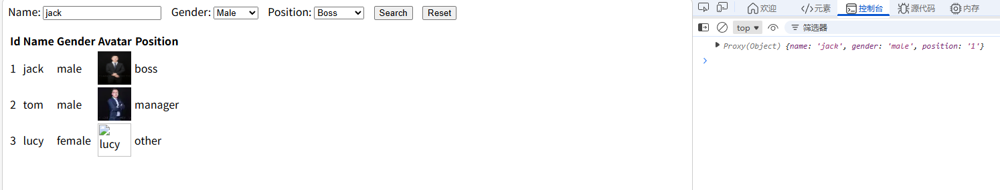

### Ajax

`Ajax`全称`Asynchronous JavaScript And XML`，主要作用于数据交换和异步交互，通过`Ajax`可以给服务器发送请求，并获取服务器响应的数据，同时也可以在不刷新整个页面的情况下，与服务器交换数据并更新部分网页

#### Axios

`Axios`是一个基于`Promise`的用于浏览器和`Node.js`的`HTTP`客户端，主要用于`JavaScript`中发送`HTTP`请求，`Axios`对原生的`Ajax`进行了封装，简化书写，可以进行快速开发

#### Axios快速入门

- 从官方网站导入文件

```vue
<script src="https://unpkg.com/axios/dist/axios.min.js"></script>
```

- 使用`Axios`发送请求并获取响应结果

```vue
<script src="https://unpkg.com/axios/dist/axios.min.js">
    axios({
        method: "{GET | POST}",
        url: "<URL>",
        [data: "<POST DATA>"]
    }).then((response) => {
        console.log(response)
    }).catch((error) => {
        console.log(error)
    })
</script>
```

- `method`：请求方法，常见的如`POST`、`GET`
- `url`：请求路径
- `data`：当请求方法为`POST`时，可以通过`data`来指定携带的参数
- `then()`：成功回调函数，当请求成功后，自动回调`then()`
- `catch()`：异常捕获函数，当请求失败后，通过`catch()`进行捕获，可以省略

**示例**

为两个按钮各自绑定一个请求事件，一个通过`GET`，另一个通过`POST`

使用`v-on`为按钮绑定点击事件，然后通过`Axios`发送请求

```vue
<html>
    <head>
        <meta charset="utf-8">
    </head>
    <body>
        <div id="app">
            <button class="get-request" @click="getRequest">点击进行GET请求</button>
            <button class="post-request" @click="postRequest">点击进行POST请求</button>
        </div>
    </body>

    <script src="https://unpkg.com/axios/dist/axios.min.js"></script>
    <script type="module">
        import {createApp} from "https://unpkg.com/vue@3/dist/vue.esm-browser.js"

        createApp({
            methods: {
                getRequest() {
                    axios({
                        method: "get",
                        url: "http://localhost/?submit=1",
                    }).then(function(response) {
                        console.log(response)
                    }).catch(function(error) {
                        alert(error)
                    })
                },
                postRequest() {
                    axios({
                        method: "post",
                        url: "http://localhost/",
                        data: "submit=1"
                    }).then(function(response) {
                        console.log(response)
                    }).catch(function(error) {
                        alert(error)
                    })
                }
            }
        }).mount("#app")
    </script>
</html>
```

> 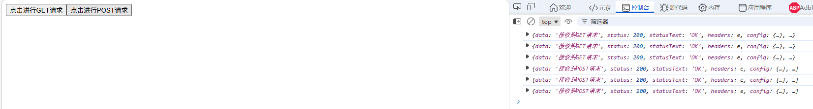

**response.data**

`Axios`请求得到的`response`实际是一个响应对象，如果仅需要数据部分，可以使用`response.data`属性

```vue
<html>
    <head>
        <meta charset="utf-8">
    </head>
    <body>
        <div id="app">
            <h1>返回的数据体：{{responseData}}</h1>
            <button class="get-request" @click="getRequest">点击进行GET请求</button>
            <button class="post-request" @click="postRequest">点击进行POST请求</button>
        </div>
    </body>

    <script src="https://unpkg.com/axios/dist/axios.min.js"></script>
    <script type="module">
        import {createApp} from "https://unpkg.com/vue@3/dist/vue.esm-browser.js"

        createApp({
            data() {
                return {
                   responseData: ""
                }
            },
            methods: {
                getRequest() {
                    axios({
                        method: "get",
                        url: "http://localhost/?submit=1",
                    }).then((response) => {
                        this.responseData = response.data
                    }).catch((error) => {
                        alert(error)
                    })
                },
                postRequest() {
                    axios({
                        method: "post",
                        url: "http://localhost/",
                        data: "submit=1"
                    }).then((response) => {
                        console.log(response)
                    }).catch((error) => {
                        alert(error)
                    })
                }
            }
        }).mount("#app")
    </script>
</html>
```

> 

*注：这里的`.then()`回调函数必须使用箭头形式`.then((param) => {})`，而不是`.then(function(param) {})`，因为`.then()`的调用并不是作为对象方法调用，而是单独调用的。因此`.then()`不能继承父对象，默认的`function`形式无法找到父对象，所以导致报错`undefined`，而箭头形式默认没有`this`，在箭头函数中的所有`this`只能通过外层作用域来继承，此处即`app`对象*

**.get()和.post()**

在`Axios`中，提供了`.get()`和`.post()`两类更加简洁的请求方法

```vue
axios.get("url").then().catch()
axios.post("url", "data").then().catch()
```

因此对刚才的程序进行简写，并删除不必要的`catch`

```vue
createApp({
    data() {
        return {
           responseData: ""
        }
    },
    methods: {
        getRequest() {
            axios.get("http://localhost/?submit=1").then((response) => {
                this.responseData = response.data
            })
        },
        postRequest() {
            axios.post("http://localhost/", "submit=1").then((response) => {
                this.responseData = response.data
            })
        }
    }
}).mount("#app")
```

#### Axios综合案例

使用`Axios`将先前的员工管理系统进行完善，不考虑后端，已知的后端响应格式如下

```json
{
    "code": "0",
    "status": "",
    "data": [
        {
            "id": 1,
            "name": "name",
            "gender": "gender",
            "avatar": "avatar"
        },
        ...
    ]
}
```

首先准备好后端的数据以及筛选功能，这里我使用`php`

```php
<?php
$employeeList = [
    [
        "id" => 1,
        "name" => "jack",
        "gender" => "male",
        "avatar" => "https://img.pconline.com.cn/images/upload/upc/tx/itbbs/1804/23/c23/84211055_1524470634645_mthumb.jpg",
        "position" => 1
    ],
    [
        "id" => 2,
        "name" => "tom",
        "gender" => "male",
        "avatar" => "https://ts3.tc.mm.bing.net/th/id/OIP-C.wYmbI_r2a8cDTJUBJ9HRcgHaLH?pid=ImgDet&w=60&h=60&c=7&rs=1&o=7&rm=3",
        "position" => 2
    ],
    [
        "id" => 3,
        "name" => "lucy",
        "gender" => "female",
        "avatar" => "",
        "position" => 3
    ]
];

$response = [
    "code" => 0,
    "message" => "",
    "data" => []
];

$jsonData = file_get_contents('php://input');
$data = json_decode($jsonData, true);

$name = $data['name'] ? $data['name'] : '';
$gender = $data['gender'] ? $data['gender'] : '';
$position = $data['position'] ? $data['position'] : '';

function getEmployeeList($name, $gender, $position) {
    global $employeeList;
    $list = [];
    foreach ($employeeList as $employee) {
        if ($name && $employee['name'] != $name) {
            continue;
        }
        if ($gender && $employee['gender'] != $gender) {
            continue;
        }
        if ($position && $employee['position'] != $position) {
            continue;
        }
        $list[] = $employee;
    }
    return $list;
}

// 如果搜索条件为空，则返回所有员工
if (!$name && !$gender && !$position) {
    $response['data'] = $employeeList;
    $response['message'] = 'success';
    $response['code'] = 1;
} else {
    $response['data'] = getEmployeeList($name, $gender, $position);
    if (empty($response['data'])) {
        $response['message'] = 'no data';
        $response['code'] = 0;
    } else {
        $response['message'] = 'success';
        $response['code'] = 1;
    }
}
echo json_encode($response);
```

回到`Vue`上来，先前已经写好了前端展示逻辑，我们将前端数据都进行删除

```vue
<html>
    <div class="app">
        <form>
            <label for="name">Name: </label>
            <input type="text" id="name" v-model="searchForm.name">
            &nbsp;&nbsp;
            <label for="gender">Gender: </label>
            <select name="gender" id="gender" v-model="searchForm.gender">
                <option value="">All</option>
                <option value="male">Male</option>
                <option value="female">Female</option>
            </select>
            &nbsp;&nbsp;
            <label for="position">Position: </label>
            <select name="position" id="position" v-model="searchForm.position">
                <option value="">All</option>
                <option value="1">Boss</option>
                <option value="2">Manager</option>
                <option value="3">Other</option>
            </select>
            &nbsp;&nbsp;
            <button type="button" @click="search">Search</button>
            &nbsp;&nbsp;
            <button type="reset">Reset</button>
        </form>
        <table>
            <thead>
                <tr>
                    <th>Id</th>
                    <th>Name</th>
                    <th>Gender</th>
                    <th>Avatar</th>
                    <th>Position</th>
                </tr>
            </thead>
            <tbody>
                <tr v-for="employee in employeeList" :key="employee.id">
                    <td>{{employee.id}}</td>
                    <td>{{employee.name}}</td>
                    <td>{{employee.gender}}</td>
                    <td></td>
                    <td>
                        <span v-if="employee.position==1">boss</span>
                        <span v-else-if="employee.position==2">manager</span>
                        <span v-else-if="employee.position==3">other</span>
                    </td>
                </tr>
            </tbody>
        </table> 
    </div>
    <script type="module">
        import {createApp} from "https://unpkg.com/vue@3/dist/vue.esm-browser.js"
    
        createApp({
            data() {
                return {
                    employeeList: [],
                    searchForm: {
                        name: "",
                        gender: "",
                        position: ""
                    }
                }
            },
            methods: {
                reset() {
                    this.searchForm = {
                        name: "",
                        gender: "",
                        position: ""
                    }
                },
                search() {
                    console.log(this.searchForm)
                }
            }
        }).mount(".app")
    </script>
</html>
```

先添加一些用户友好型提示信息，新建一个对象`statusCode`，用于判断后端传来的数据中是否包含员工信息，如果不包含，则显示`暂无数据`。在`<tbody>`中新建一个`<tr>`和`<td>`，在`<tr>`中添加`v-if`属性来进行判断，判断条件为`statusCode`，我们设定0表示无数据，1表示有数据

```vue
<tbody>
    <tr v-if="statusCode == 0">
        <td>暂无数据</td>
    </tr>
</tbody>

data() {
    return {
        employeeList: [],
        searchForm: {
            name: "",
            gender: "",
            position: ""
        },
		statusCode: 0,
    }
},
```

然后开始完善`search()`方法，这里使用`Axios`向后端发送请求，将收到的后端响应覆盖原始值

```vue
search() {
    axios.post("http://localhost/index.php", this.searchForm).then((res) => {
        this.statusCode = res.data.code
        this.employeeList = res.data.data
    })
}
```

以下是所有代码

```vue
<html>
    <head>
        <meta charset="UTF-8">
    </head>

    <div class="app">
        <form>
            <label for="name">Name: </label>
            <input type="text" id="name" v-model="searchForm.name">
            &nbsp;&nbsp;
            <label for="gender">Gender: </label>
            <select name="gender" id="gender" v-model="searchForm.gender">
                <option value="">All</option>
                <option value="male">Male</option>
                <option value="female">Female</option>
            </select>
            &nbsp;&nbsp;
            <label for="position">Position: </label>
            <select name="position" id="position" v-model="searchForm.position">
                <option value="">All</option>
                <option value="1">Boss</option>
                <option value="2">Manager</option>
                <option value="3">Other</option>
            </select>
            &nbsp;&nbsp;
            <button type="button" @click="search">Search</button>
            &nbsp;&nbsp;
            <button type="reset">Reset</button>
        </form>
        <table>
            <thead>
                <tr>
                    <th>Id</th>
                    <th>Name</th>
                    <th>Gender</th>
                    <th>Avatar</th>
                    <th>Position</th>
                </tr>
            </thead>
            <tbody>
                <tr v-if="statusCode == 0">
                    <td>暂无数据</td>
                </tr>
                <tr v-for="employee in employeeList" :key="employee.id">
                    <td>{{employee.id}}</td>
                    <td>{{employee.name}}</td>
                    <td>{{employee.gender}}</td>
                    <td></td>
                    <td>
                        <span v-if="employee.position==1">boss</span>
                        <span v-else-if="employee.position==2">manager</span>
                        <span v-else-if="employee.position==3">other</span>
                    </td>
                </tr>
            </tbody>
        </table> 
    </div>
    <script src="https://unpkg.com/axios/dist/axios.min.js"></script>
    <script type="module">
        import {createApp} from "https://unpkg.com/vue@3/dist/vue.esm-browser.js"
    
        createApp({
            data() {
                return {
                    employeeList: [],
                    searchForm: {
                        name: "",
                        gender: "",
                        position: ""
                    },
                    statusCode: 0,
                }
            },
            methods: {
                reset() {
                    this.searchForm = {
                        name: "",
                        gender: "",
                        position: ""
                    }
                },
                search() {
                    axios.post("http://localhost/index.php", this.searchForm).then((res) => {
                        this.statusCode = res.data.code
                        this.employeeList = res.data.data
                    })
                }
            }
        }).mount(".app")
    </script>
</html>
```

> 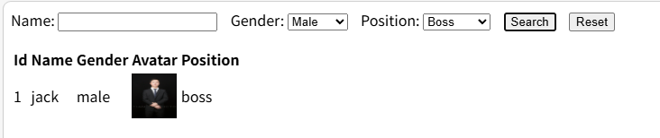

#### async & await

在`Ajax`中可以使用`async`关键字来声明一个异步方法，并使用`await`来等待异步任务执行。`await`关键字必须在`async`声明的方法中使用

**示例**

程序运行逻辑一般是从上到下，但异步方法可以让程序先执行下方的代码，再执行上方的代码。比如下面这个程序，通过`Axios`获取一条数据，并在下方用另一条数据覆盖

`PHP`

```php
<?php
echo '这是第一条数据';
```

`HTML`

```vue
<meta charset="UTF-8">
<div id="app">
    <button @click="click">Click me</button>
    <div>{{ message }}</div>

</div>

<script src="https://cdn.jsdelivr.net/npm/axios/dist/axios.min.js"></script>

<script type="module">
    import { createApp } from 'https://unpkg.com/vue@3/dist/vue.esm-browser.js'

    createApp({
        data() {
            return {
                message: ''
            }
        },
        methods: {
            click() {
                axios.get("http://localhost/add.php").then((res) => {
                    this.message = res.data
                })
                this.message = "这是第二条数据"
            }
        } 
    }).mount('#app')
</script>
```

实际的结果却显示`这是第一条数据`

> 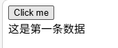

因此我们加入`await`，让异步交互变为同步

```vue
methods: {
    async click() {
        await axios.get("http://localhost/add.php").then((res) => {
            this.message = res.data
        })
        this.message = "这是第二条数据"
    }
} 
```

> 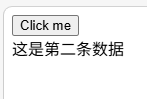

`await`关键字可以一定程度上取代`.then()`回调函数，因为`axios.get()`方法本身也会返回响应对象

```vue
methods: {
    async click() {
        let res = await axios.get("http://localhost/add.php")
        this.message = res.data
    }
} 
```


*注：`let res = axios.get("http://localhost/add.php")`是无效的，由于异步执行的原因，会先执行`this.message = res.data`，再执行`let res = await axios.get("http://localhost/add.php")`，所以此时`this.message`的值为null*

### Vue生命周期

生命周期是指一个对象从创建到销毁的整个过程，`Vue`生命周期共有八个阶段，每触发一个生命周期事件，会自动执行一个生命周期方法
$$
beforeCreate \rightarrow created \rightarrow beforeMount \rightarrow mounted \rightarrow beforeUpdate \rightarrow updated \rightarrow beforeUnmount \rightarrow unmounted
$$
**标准语法**

```vue
createApp({
	data() {
		
	},
	mounted() {
		// 钩子方法
	},
	......
}).mount()
```

**示例**

在上文的员工搜索页面中，添加初次访问页面时自动搜索的功能

这里可以使用`mounted()`方法，调用一次`search()`来实现

```vue
createApp({
    data() {
        return {
            employeeList: [],
            searchForm: {
                name: "",
                gender: "",
                position: ""
            },
            statusCode: 0,
        }
    },
    methods: {
        reset() {
            this.searchForm = {
                name: "",
                gender: "",
                position: ""
            }
        },
        search() {
            axios.post("http://localhost/index.php", this.searchForm).then((res) => {
                this.statusCode = res.data.code
                this.employeeList = res.data.data
            })
        }
    },
    mounted() {
        this.search()
    }
}).mount(".app")
```

## Maven

`Maven`是一款用于管理和构建`Java`项目的工具，是`apache`旗下的一个开源项目。`Maven`可以方便快捷地管理项目的依赖资源，提供标准化的跨平台的自动化项目构建方式，提供标准、统一的项目结构

### Maven坐标

`Maven`中的坐标是资源的唯一标识，通过该坐标可以唯一定位资源位置

**标准语法**

```xml
<groupId></groupId>
<artifactId></artifactId>
<version></version>
```

- `groupId`：定义当前`Maven`项目隶属的组织名称，通常是域名反写，如`com.eiousee`
- `arifactId`：定义当前`Maven`项目名称
- `version`：定义当前`Maven`项目版本号

### Maven依赖管理

#### 依赖安装

在`pom.xml`中指定需要安装的依赖的坐标，然后刷新`pom.xml`

```xml
<dependencies>
<!--         导入commons-io -->
    <dependency>
        <groupId>commons-io</groupId>
        <artifactId>commons-io</artifactId>
        <version>2.11.0</version>
    </dependency>
<!--        导入spring-context-->
    <dependency>
        <groupId>org.springframework</groupId>
        <artifactId>spring-context</artifactId>
        <version>6.1.4</version>
    </dependency>
</dependencies>
```

> 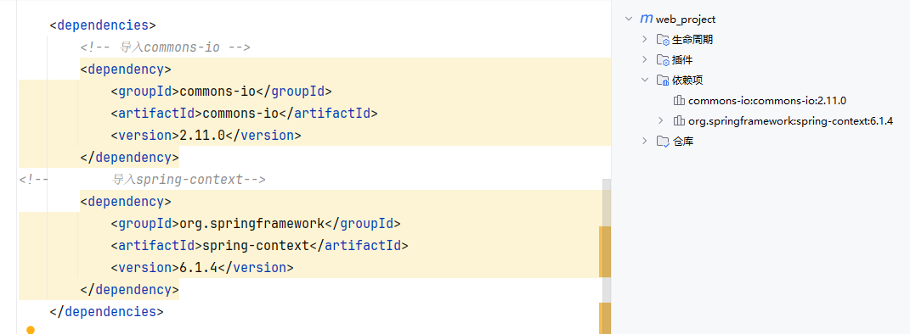

#### 排除依赖

排除依赖指主动断开依赖的资源，被排除的依赖无需指定版本号。排除依赖使用`<exclusions>`标签，该标签必须位于某个依赖的`<dependency>`标签中

**标准语法**

```xml
<dependency>
    <exclusions>
        <exclusion>
            <groupId>needless jar</groupId>
            <artifactId>needless jar</artifactId>
        </exclusion>
    </exclusions>
</dependency>
```

**示例**

在刚才配置的`spring-context`依赖中，我们不需要``，因此将其排除

```xml
<dependency>
    <groupId>org.springframework</groupId>
    <artifactId>spring-context</artifactId>
    <version>6.1.4</version>

    <exclusions>
        <exclusion>
            <groupId>io.micrometer</groupId>
            <artifactId>micrometer-observation</artifactId>
        </exclusion>
    </exclusions>
</dependency>
```

> 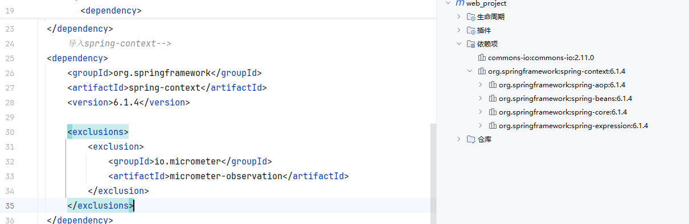

### Maven生命周期

`Maven`生命周期就是对所有的`Maven`项目构建过程进行了抽象和统一。`Maven`共有三套独立的生命周期，`clean`、`default`和`site`。`clean`执行清理工作，如上一次编译产生的文件，打包产生的文件等；`default`负责核心工作内容，如编译、测试、打包、安装、部署等等；`site`负责生成报告，发布站点等工作

#### 常见生命周期阶段

- `clean`：移除上一次构建生成的文件
- `compile`：编译项目源代码
- `test`：使用合适的单元测试框架运行测试
- `package`：将编译后的文件打包，生成`jar`、`war`等文件
- `install`：安装项目到本地`Maven`仓库

### 单元测试

测试是一种用来促进鉴定软件的正确性、完整新、安全性和质量的过程。软件开发阶段划分，测试可以分为`单元测试`、`集成测试`、`系统测试`、`验收测试`四类

单元测试是指对软件的基本组成单元进行测试，是最小的测试单位，目的是验证软件基本组成单位的正确性，测试人员一般为开发人员

集成测试是指将已分别通过测试的单元，按设计要求组合成系统或子系统，再进行的测试，目的是检查单元之间的协作是否正确，测试人员一般为开发人员

系统测试是对集成好的软件系统进行彻底的测试，目的是验证软件系统的正确性，性能是否满足指定的要求，测试人员一般为专业测试工程师

验收测试又称交付测试， 是针对用户需求，业务流程进行的正式的测试，目的是验证软件系统是否满足验收标准，测试人员一般为客户和需求方

#### 测试方法

根据暴露信息的不同，一般有三类测试方法，`白盒测试`、`黑盒测试`、`灰盒测试`

白盒测试中，测试人员清楚软件内部结构、代码逻辑，一般用于验证代码、逻辑的正确性

黑盒测试中，测试人员不清楚软件内部结构、代码逻辑，一般用于验证软件的功能、兼容性等方面

灰盒测试结合了白盒测试和黑盒测试的特点，即关注软件的内部结构，又考虑软件外部表现

| 测试方法 | 采用此方法的测试类型 |
| -------- | -------------------- |
| 白盒测试 | 单元测试             |
| 黑盒测试 | 系统测试、验收测试   |
| 灰盒测试 | 集成测试             |

#### 单元测试快速入门

`Java`单元测试就是针对最小的功能单元，即方法，编写测试代码对其正确性进行测试。目前`JUnit`是最流行的`Java`测试框架之一，提供了一些功能，方便程序进行单元测试

**main方法测试的缺陷**

1. 测试代码与源代码未分开，难维护
2. 一个方法测试失败，影响后续方法的测试
3. 无法自动化测试，得到测试报告

**案例**

使用`Junit`，对已经定义好的`UserService`类中的业务方法进行单元测试

```java
import java.time.LocalDate;
import java.time.format.DateTimeFormatter;

public class UserService {
//     给定用户身份证号，计算用户年龄
//     @param idCard
//     @return Integer
    public Integer getAge(String idCard) {
        if (idCard == null || idCard.length() != 18) {
            throw new IllegalArgumentException("请输入正确的身份证号");
        }
        String birth = idCard.substring(6, 14);
        LocalDate parse = LocalDate.parse(birth, DateTimeFormatter.ofPattern("yyyyMMdd"));
        return LocalDate.now().getYear() - parse.getYear();
    }

//    给定用户身份证号，计算用户性别
//    @param idCard
//    @return String
    public String getGender(String idCard) {
        if (idCard == null || idCard.length() != 18) {
            throw new IllegalArgumentException("请输入正确的身份证号");
        }
        String gender = idCard.substring(16, 17);
        return gender.endsWith("0") ? "女" : "男";
    }
}
```

1. 在`pom.xml`引入`Junit`依赖

```xml
<!--        导入Junit-->
<dependency>
    <groupId>org.junit.jupiter</groupId>
    <artifactId>junit-jupiter</artifactId>
    <version>5.9.2</version>
</dependency>
```

2. 在`test/java`目录下创建测试类，并编写对应的测试方法，并在方法上声明`@Test`注解

测试类命名一般为`被测试类名 + Test`，测试方法为`test + 被测试方法()`，测试方法权限修饰符必须为`public`，返回值类型必须为`void`

```java
import org.junit.jupiter.api.Test;

public class UserServiceTest {

    @Test
    public void testGetAge() {
        Integer age = new UserService().getAge("");
        System.out.println(age);
    }

    @Test
    public void testGetGender() {
        String gender = new UserService().getGender("100000200201230000");
        System.out.println(gender);
    }
}
```

3. 然后运行测试，测试失败的方法不会影响后续方法测试

> 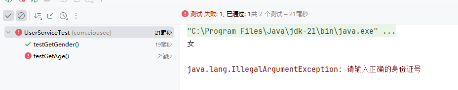

#### 断言

单元测试通过仅代表语法正确，并不代表逻辑正确，如上文的`UserService`类中的`getGender()`方法，假设我们传入的身份证号为`100000200201230020`，理论上应该是女性，但实际输出为男

> 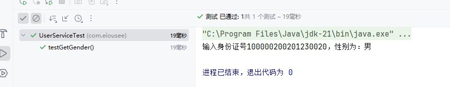

因此`Junit`提供了一些辅助方法，用来帮我们确定被测试的方法是否按照预期的效果正常工作，这种方式被称为`断言`

| 断言方法                                                     | 描述                            |
| ------------------------------------------------------------ | ------------------------------- |
| `Assertions.assertEquals(Object exp, Object act, [String msg])` | 检查`exp`、`act`是否相等        |
| `Assertions.assertNotEquals(Object unexp, Object act, [String msg])` | 检查`unexp`、`act`是否不等      |
| `Assertions.assertNull(Object act, [String msg])`            | 检查`act`是否为空               |
| `Assertions.assertNotNull(Object act, [String msg])`         | 检查`act`是否不为空             |
| `Assertions.assertTrue(boolean condition, [String msg])`     | 检查`condition`是否为`True`     |
| `Assertions.assertFalse(boolean condition, [String msg])`    | 检查`condition`是否为`False`    |
| `Assertions.assertThrow(Class expType, Executable exec, [String msg])` | 检查`exec`是否抛出`expType`异常 |

**示例**

现在我们对`getGender()`方法添加断言

```java
@Test
public void testGetGender() {
    String idCard = "100000200201230020";
    String gender = new UserService().getGender(idCard);
    Assertions.assertEquals("女", gender);
    System.out.println("输入身份证号" + idCard + "，性别为：" + gender);
}
```

> 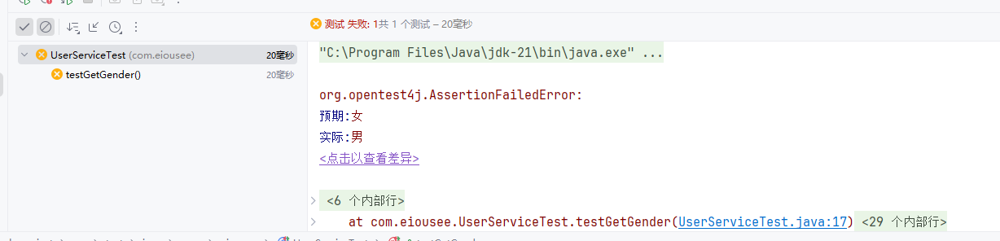

同样地，可以测试`getAge()`中抛出的异常是否符合要求

```java
@Test
public void testGetAge() {
    Assertions.assertThrows(IllegalArgumentException.class, () -> {
        new UserService().getAge("");
    });
}
```

> 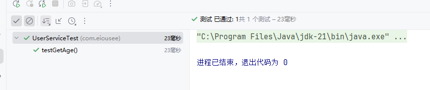

#### 常见注解

| 注解                 | 说明                                                         | 备注                                                      |
| -------------------- | ------------------------------------------------------------ | --------------------------------------------------------- |
| `@Test`              | 注解一个测试方法，只有用`@Test`修饰的方法才能在单元测试中执行 |                                                           |
| `@ParameterizedTest` | 参数化测试注解                                               | 可以让单元测试运行多次，每次运行仅参数不同，与`@Test`互斥 |
| `@ValueSource`       | 参数化测试的参数来源                                         |                                                           |
| `@DisplayName`       | 指定测试类、测试方法显示的名字                               |                                                           |
| `@BeforeEach`        | 用来修饰一个实例方法，该方法会在每一个测试方法执行之前执行一次 |                                                           |
| `@AfterEach`         | 用来修饰一个实例方法，该方法会在每一个测试方法执行之后执行一次 |                                                           |
| `@BeforeAll`         | 用来修饰一个静态方法，该方法会在所有测试方法之前执行一次     |                                                           |
| `@AfterAll`          | 用来修饰一个静态方法，该方法会在所有测试方法之后执行一次     |                                                           |

**示例**

```java
package com.eiousee;
import org.junit.jupiter.api.*;
import org.junit.jupiter.params.ParameterizedTest;
import org.junit.jupiter.params.provider.ValueSource;

public class UserServiceTest {
    @BeforeAll
    static void beforeAll() {
        System.out.println("测试类开始");
    }

    @AfterAll
    static void afterAll() {
        System.out.println("测试类结束");
    }

    @BeforeEach
    void beforeEach() {
        System.out.println("测试方法开始");
    }

    @AfterEach
    void afterEach() {
        System.out.println("测试方法结束");
    }

    @ParameterizedTest
    @ValueSource(strings = {"100000200101010011", "100000200101010012"})
    void testGetGender(String idCard) {
        String gender = new UserService().getGender(idCard);
        System.out.println("用户性别：" + gender);
    }
}
```

> 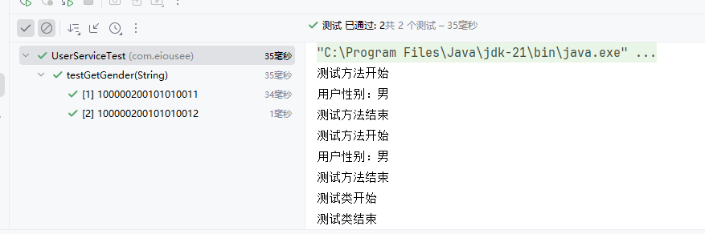

#### 覆盖率

对于单元测试的效果，可以通过覆盖率来描述，覆盖率越高，单元测试的效果越好

**示例**

以上文的测试类举例，其覆盖率如下

| 类          | 方法覆盖率 | 行覆盖率  | 分支覆盖率 |
| ----------- | ---------- | --------- | ---------- |
| UserService | 50% (1/2)  | 33% (3/9) | 30% (3/10) |

我们添加更多的测试数据，尽量覆盖所有的测试结果

```java
package com.eiousee;
import org.junit.jupiter.api.*;
import org.junit.jupiter.params.ParameterizedTest;
import org.junit.jupiter.params.provider.ValueSource;

@DisplayName("用户服务测试类")
public class UserServiceTest {

    @ParameterizedTest
    @ValueSource(strings = {"100000200101010011", "100000200101010012"})
    void testGetGender(String idCard) {
        String gender = new UserService().getGender(idCard);
        System.out.println("用户性别：" + gender);
    }

    // 测试异常情况
    @Test
    void testGetGenderException() {
        Assertions.assertThrows(IllegalArgumentException.class, () -> {
            new UserService().getGender("");
        });
    }

}
```

修改后覆盖率显著提升

| 类          | 方法覆盖率 | 行覆盖率  | 分支覆盖率 |
| ----------- | ---------- | --------- | ---------- |
| UserService | 50% (1/2)  | 44% (4/9) | 40% (4/10) |

因此在企业开发中，一般地，核心代码应满足100%的完全单元测试覆盖率，非核心代码应满足至少70%的单元测试覆盖率

### Maven依赖范围

在`Maven`中，可以设定某个依然的作用范围。假设没有对`Junit`设定依赖范围，那么`@Test`注解甚至可以出现在`main`主目录中，这是绝对需要避免的。因此，可以使用`<scope>`标签来设置依赖的作用范围

**示例**

先不设置`Junit`的依赖范围

```xml
<dependency>
    <groupId>org.junit.jupiter</groupId>
    <artifactId>junit-jupiter</artifactId>
    <version>5.9.2</version>
</dependency>
```

然后在`Hello`定义测试方法`test()`

```java
package com.eiousee;

import org.junit.jupiter.api.Test;

public class Hello {
    public static void main(String[] args) {
        System.out.println("Hello World!");
    }

    @Test
    public void test() {
        System.out.println("Hello World!");
    }
}
```

执行测试

> 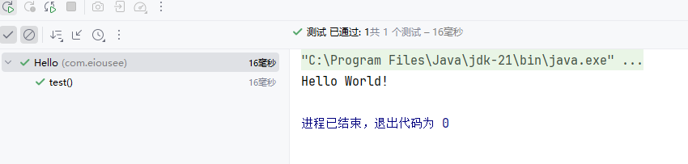

接着我们为`Junit`设置依赖范围

```xml
<dependency>
    <groupId>org.junit.jupiter</groupId>
    <artifactId>junit-jupiter</artifactId>
    <version>5.9.2</version>
    <scope>test</scope>
</dependency>
```

然后再次执行

> 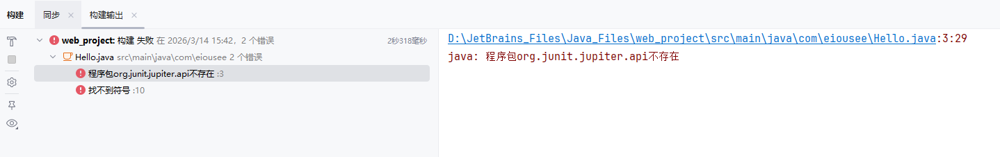

#### scope标签

`<scope>`标签可以设置依赖的作用范围，但是`<scope>`本身的值不能随意设置

| 属性值   | 主程序 | 测试程序 | 打包 | 举例        |
| -------- | ------ | -------- | ---- | ----------- |
| compile  | Y      | Y        | Y    | Log4j       |
| test     | N      | Y        | N    | Junit       |
| provided | Y      | Y        | N    | Servlet-api |
| runtime  | N      | Y        | Y    | jdbc        |

## Java Spring

`Java Spring` 是一个开源的应用程序框架，提供了全面的基础设施支持，用于构建企业级 Java 应用程序。它通过依赖注入和控制反转等核心功能，简化了开发过程，降低了模块间的耦合度。`Spring` 框架包含多个模块，如 `Spring Boot`、`Spring MVC`、`Spring Data`和 `Spring Security`等，使得开发者能够灵活、高效地开发各种规模的 Java 项目。

### Spring Boot

Spring Boot 是 Spring 框架的一个关键子项目，旨在简化 Spring 应用的初始搭建和开发过程。它通过“约定大于配置”的理念，提供了自动配置、起步依赖和内置Web服务器等核心特性，让开发者无需编写大量样板配置，就能快速创建独立、可执行的、生产级的 Spring 应用程序。通常只需编写少量代码，即可启动一个功能完备的Web服务，极大地提升了开发效率。

#### Spring Boot快速入门

基于`Spring Boot`开发一个`Web`应用，浏览器发送请求，并携带一个参数，然后服务器返回该参数值

- 创建`Spring Boot`项目

> 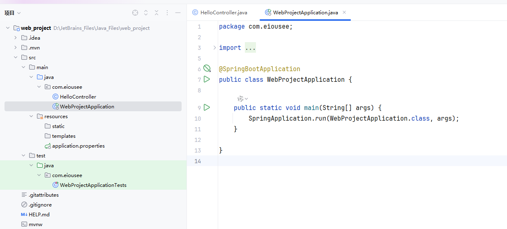

- 创建请求处理类`HelloController`并编写相关逻辑

```java
package com.eiousee;

import org.springframework.web.bind.annotation.RequestMapping;
import org.springframework.web.bind.annotation.RestController;

@RestController	// 声明请求处理类
public class HelloController {

    @RequestMapping("/")	// 声明请求路径
    public String hello(String name) {
        return "Hello " + name + "!";
    }
}
```

- 访问`localhost/?name=123`

> 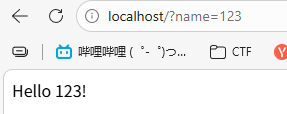
