# Java Web Advanced

`更新时间：2026-6-7`

注释解释：

- `<>`必填项，必须在当前位置填写相应数据

- `{}`必选项，必须在当前位置选择一个给出的选项

- `[]`可选项，可以选择填写或忽略

*注：该笔记内的可选项和参数均不完整，如有需要，请查询相关手册*

---

从`Java Web Advance`开始，我们将尝试构建一个真正能够实际上线的大型项目

## 项目介绍

我们将制作一个外卖点餐项目，包含用户和商家两个用户层级，普通用户层我们使用微信小程序作为前端界面，商家层面我们使用桌面浏览器作为前端。

**技术选型**

在该项目中，我们会使用以下的技术栈

用户层：`node.js`、`vue.js`、`ElementUI`、`WeChat`、`Apache echarts`

网关层：`Nginx`

应用层：`Spring Boot`、`Spring MVC`、`Spring Task` 、`Httpclient`、`Spring Cache`、`JWT`、`阿里云OSS2`、`Swagger`、`POI`、`WebSocket`

数据层：`MySQL`、`Redis`、`MyBatis`、`Pagehelper`、`Spring Data Redis`

工具类：`Git`、`Maven`、`Junit`、`Postman`

为了注重于后端开发，我们将直接跳过前端开发，使用现有的前端项目[skyTakeout](./projects/skyTakeout_frontEnd/html/sky/index.html)。

## 环境搭建

为了便于开发，我们也直接导入一个初始工程，从初始工程入手来完善项目

### 后端环境

拿到一个新的项目，我们应该对项目有一个基本的认识

> 

初始项目由四部分构成

| 模块名         | 说明                                               |
| -------------- | -------------------------------------------------- |
| `sky-take-out` | 父工程，统一管理依赖版本，聚合其他子模块           |
| `sky-common`   | 子模块，存放公共类，如工具类、常量类、异常类等等   |
| `sky-pojo`     | 子模块，存放实体类、`VO`、`DTO`等等                |
| `sky-server`   | 子模块，后端服务主模块，存放配置文件，逻辑文件等等 |

**sky-common**

> 

`sky-common`中包含了常量、上下文相关、枚举类、异常、`JSON`处理、配置、结果封装、工具类

**sky-pojo**

> 

`sky-pojo`中存放所有实体类，一般包括

| 类别     | 说明                                               |
| -------- | -------------------------------------------------- |
| `Entity` | 实体，通常和数据库中的表直接对应                   |
| `DTO`    | 数据传输对象，通常用户程序中各层之间传递数据       |
| `VO`     | 视图对象，为前端展示数据提供的对象                 |
| `POJO`   | 普通`Java`对象，只有属性和对应的`getter`和`setter` |

**sky-server**

> 

`sky-server`才是实质上的主目录，`SpringBoot`的配置文件，启动类也位于`sky-server`中

### 数据库搭建

数据库也直接使用已经设计好的`sql`文件，相关设计文档查阅[数据库文档](./skyTakeout_backEnd/database.md)

> 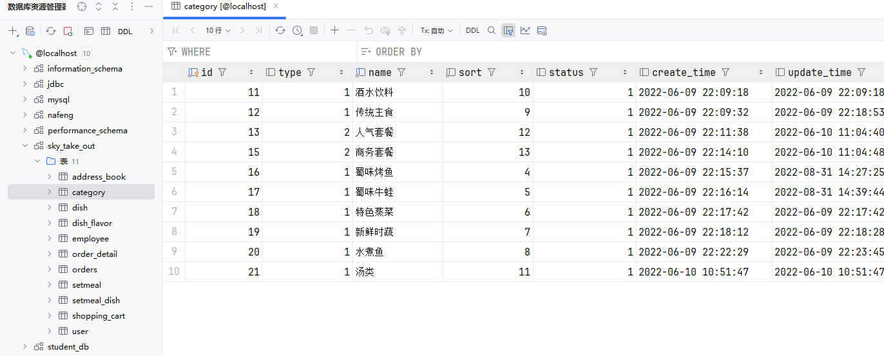

### 前后端联调测试

在前后端与数据库环境准备完成后，我们进行初始的前后端联调测试，项目中已经完成了基础的登录功能，通过验证登录功能可以确保前后端和数据库项目的正常运行

> 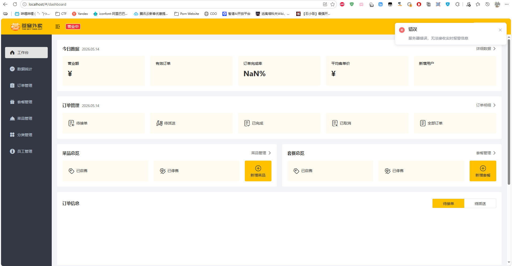

我们按照后端源代码，推导一下目前的登录逻辑是如何实现的

1. 首先查看`config`中有关添加拦截器的配置

```java
@Override
protected void addInterceptors(InterceptorRegistry registry) {
    log.info("开始注册自定义拦截器...");
    registry.addInterceptor(jwtTokenAdminInterceptor)
            .addPathPatterns("/admin/**")
            .excludePathPatterns("/admin/employee/login");
}
```

定义了一个`jwtTokenAdminInterceptor`拦截器，拦截的路径为`/admin/**`，但是排除了`/admin/employee/login`

2. 查看`JwtTokenAdminInterceptor`的定义

```java
package com.sky.interceptor;

import com.sky.constant.JwtClaimsConstant;
import com.sky.properties.JwtProperties;
import com.sky.utils.JwtUtil;
import io.jsonwebtoken.Claims;
import lombok.extern.slf4j.Slf4j;
import org.springframework.beans.factory.annotation.Autowired;
import org.springframework.stereotype.Component;
import org.springframework.web.method.HandlerMethod;
import org.springframework.web.servlet.HandlerInterceptor;
import javax.servlet.http.HttpServletRequest;
import javax.servlet.http.HttpServletResponse;

/**
 * jwt令牌校验的拦截器
 */
@Component
@Slf4j
public class JwtTokenAdminInterceptor implements HandlerInterceptor {

    @Autowired
    private JwtProperties jwtProperties;

    /**
     * 校验jwt
     *
     * @param request
     * @param response
     * @param handler
     * @return
     * @throws Exception
     */
    public boolean preHandle(HttpServletRequest request, HttpServletResponse response, Object handler) throws Exception {
        //判断当前拦截到的是Controller的方法还是其他资源
        if (!(handler instanceof HandlerMethod)) {
            //当前拦截到的不是动态方法，直接放行
            return true;
        }

        //1、从请求头中获取令牌
        String token = request.getHeader(jwtProperties.getAdminTokenName());

        //2、校验令牌
        try {
            log.info("jwt校验:{}", token);
            Claims claims = JwtUtil.parseJWT(jwtProperties.getAdminSecretKey(), token);
            Long empId = Long.valueOf(claims.get(JwtClaimsConstant.EMP_ID).toString());
            log.info("当前员工id：", empId);
            //3、通过，放行
            return true;
        } catch (Exception ex) {
            //4、不通过，响应401状态码
            response.setStatus(401);
            return false;
        }
    }
}
```

`JwtTokenAdminInterceptor`先从请求头中获取`token`，然后通过工具类`JwtUtil`的`parseJWT()`方法来校验令牌，令牌的密钥通过`jwtProperties`这个`Bean`的`adminSecretKey`属性获取，最后根据结果决定是否放行。

3. 查看`JwtProperties`

```java
package com.sky.properties;

import lombok.Data;
import org.springframework.boot.context.properties.ConfigurationProperties;
import org.springframework.stereotype.Component;

@Component
@ConfigurationProperties(prefix = "sky.jwt")
@Data
public class JwtProperties {

    /**
     * 管理端员工生成jwt令牌相关配置
     */
    private String adminSecretKey;
    private long adminTtl;
    private String adminTokenName;

    /**
     * 用户端微信用户生成jwt令牌相关配置
     */
    private String userSecretKey;
    private long userTtl;
    private String userTokenName;

}
```

`JwtProperties`配置类通过配置文件中的`sky.jwt`来为其属性赋值，我们再去查看`application.yml`文件

```yml
sky:
  jwt:
    # 设置jwt签名加密时使用的秘钥
    admin-secret-key: eiousee
    # 设置jwt过期时间
    admin-ttl: 7200000
    # 设置前端传递过来的令牌名称
    admin-token-name: token
```

4. 查看`Controller`中有关登录的定义

```java
/**
 * 登录
 *
 * @param employeeLoginDTO
 * @return
 */
@PostMapping("/login")
public Result<EmployeeLoginVO> login(@RequestBody EmployeeLoginDTO employeeLoginDTO) {
    log.info("员工登录：{}", employeeLoginDTO);

    Employee employee = employeeService.login(employeeLoginDTO);

    //登录成功后，生成jwt令牌
    Map<String, Object> claims = new HashMap<>();
    claims.put(JwtClaimsConstant.EMP_ID, employee.getId());
    String token = JwtUtil.createJWT(
            jwtProperties.getAdminSecretKey(),
            jwtProperties.getAdminTtl(),
            claims);

    EmployeeLoginVO employeeLoginVO = EmployeeLoginVO.builder()
            .id(employee.getId())
            .userName(employee.getUsername())
            .name(employee.getName())
            .token(token)
            .build();

    return Result.success(employeeLoginVO);
}
```

在`controller`通过`EmployeeLoginDTO`来接受前端数据

```java
package com.sky.dto;

import io.swagger.annotations.ApiModel;
import io.swagger.annotations.ApiModelProperty;
import lombok.Data;

import java.io.Serializable;

@Data
@ApiModel(description = "员工登录时传递的数据模型")
public class EmployeeLoginDTO implements Serializable {

    @ApiModelProperty("用户名")
    private String username;

    @ApiModelProperty("密码")
    private String password;

}
```

`EmployeeLoginDTO`是一个标准的`JavaBean`，仅包含属性及其`getter`、`setter`，并且实现了`Serializable`接口

接着调用`EmployeeService`的`login()`方法，在登陆成功后创建一个用户数据`Map`，将用户`id`填入到`Map`中，并调用`JwtUtil`的`createJWT()`方法，调用`jwtProperties`从配置文件中读取`jwt`加密的`key`及其生存周期，最后通过`EmployeeLoginVO`返回到前端

```java
package com.sky.vo;

import io.swagger.annotations.ApiModel;
import io.swagger.annotations.ApiModelProperty;
import lombok.AllArgsConstructor;
import lombok.Builder;
import lombok.Data;
import lombok.NoArgsConstructor;

import java.io.Serializable;

@Data
@Builder
@NoArgsConstructor
@AllArgsConstructor
@ApiModel(description = "员工登录返回的数据格式")
public class EmployeeLoginVO implements Serializable {

    @ApiModelProperty("主键值")
    private Long id;

    @ApiModelProperty("用户名")
    private String userName;

    @ApiModelProperty("姓名")
    private String name;

    @ApiModelProperty("jwt令牌")
    private String token;

}
```

`EmployeeLoginVO`也是一个标准的`JavaBean`，并且添加了`@Builder`注解，使其可以使用`builder()`方法来创建示例，而不需要`new`

5. 查看`Service`定义

```java
package com.sky.service.impl;

import com.sky.constant.MessageConstant;
import com.sky.constant.StatusConstant;
import com.sky.dto.EmployeeLoginDTO;
import com.sky.entity.Employee;
import com.sky.exception.AccountLockedException;
import com.sky.exception.AccountNotFoundException;
import com.sky.exception.PasswordErrorException;
import com.sky.mapper.EmployeeMapper;
import com.sky.service.EmployeeService;
import org.springframework.beans.factory.annotation.Autowired;
import org.springframework.stereotype.Service;
import org.springframework.util.DigestUtils;

@Service
public class EmployeeServiceImpl implements EmployeeService {

    @Autowired
    private EmployeeMapper employeeMapper;

    /**
     * 员工登录
     *
     * @param employeeLoginDTO
     * @return
     */
    public Employee login(EmployeeLoginDTO employeeLoginDTO) {
        String username = employeeLoginDTO.getUsername();
        String password = employeeLoginDTO.getPassword();

        //1、根据用户名查询数据库中的数据
        Employee employee = employeeMapper.getByUsername(username);

        //2、处理各种异常情况（用户名不存在、密码不对、账号被锁定）
        if (employee == null) {
            //账号不存在
            throw new AccountNotFoundException(MessageConstant.ACCOUNT_NOT_FOUND);
        }

        //密码比对
        // TODO 后期需要进行md5加密，然后再进行比对
        if (!password.equals(employee.getPassword())) {
            //密码错误
            throw new PasswordErrorException(MessageConstant.PASSWORD_ERROR);
        }

        if (employee.getStatus() == StatusConstant.DISABLE) {
            //账号被锁定
            throw new AccountLockedException(MessageConstant.ACCOUNT_LOCKED);
        }

        //3、返回实体对象
        return employee;
    }

}
```

`EmployeeServiceImpl`中进行了简单的密码验证，根据不同的验证结果抛出了`AccountNotFoundException`、`PasswordErrorException`、`AccountLockedException`三种异常，这是为了能够让全局异常处理器`GlobalExceptionHandler`精确地捕获，并根据不同的异常类型返回不同的提示信息

6. 查看`Mapper`定义

```java
package com.sky.mapper;

import com.sky.entity.Employee;
import org.apache.ibatis.annotations.Mapper;
import org.apache.ibatis.annotations.Select;

@Mapper
public interface EmployeeMapper {

    /**
     * 根据用户名查询员工
     * @param username
     * @return
     */
    @Select("select * from employee where username = #{username}")
    Employee getByUsername(String username);

}
```

`EmployeeMapper`中通过`username`在`employee`表中查询用户数据并返回

### Nginx反向代理

在先前的`Vue`工程化的学习中，我们简单认识了`Nginx`服务器，现在我们来了解一下，`Nginx`服务器究竟是如何将前端请求转发到后端的

在浏览器默认的安全策略中，只允许同源通信，并不允许跨域通信。举个例子，假设前端`Nginx`服务器为`https://www.eiousee.com`，而后端`Tomcat`服务器为`https://api.eiousee.com`，那么前端的`axios`请求是无法直接访问后端的，浏览器会直接报错提示被`CROS`同源策略阻止。在浏览器中，一般把一个`URL`拆分为`协议`、`主机`、`端口`、`URI`四个部分，而同源策略要求，前三个部分必须相同，否则视为不属于同一个域。例如`https://www.eiousee.com`与`https://api.eiousee.com`的主机名不同，视为不同域；`https://www.eiousee.com`与`https://www.eiousee.com:8080`端口号不同，视为不同域；`https://www.eiousee.com`与`https://www.eiousee.com/api/`前三个部分相同，视为相同域

为此，`Nginx`提供了反向代理的功能，即将前端发送到后端的请求由`Nginx`进行中转，开发人员在`Nginx`中配置反向代理的服务器，例如设置所有`/api/`的`URI`视为向后端发送的请求，然后由`Nginx`代理转发到后端服务器，并接收后端服务器返回的数据，再返回给前端

#### 配置Nginx反向代理

`Nginx`的反向代理在配置文件`nginx.conf`中进行

```conf
server {
	location /api/ {
		proxy_pass http://localhost:8080/;
	}
}
```

`/api/`表示路由所有`URI`为`/api/`前缀的请求，然后转发请求到`http://localhost:8080/`中，这里需要注意，`/api/`这个前缀不会转发，只作为标识符出现。例如，前端请求为`http://localhost/api/stu`，转发到后端的请求为`http://localhost:8080/stu`

#### 配置负载均衡

`Nginx`的负载均衡同样在`nginx.conf`中进行

```conf
upstream servers {
	server 192.168.100.128:8080;
	server 192.168.100.129:8080
}

server {
	location /api/ {
		proxy_pass http://servers:8080/;
	}
}
```

通过`upstream`关键字声明一个服务器群组，命名为`servers`，然后在群组中定义各个服务器的`ip`地址，在反向代理时使用服务器群组的名称，`Nginx`就会根据负载均衡策略自动选择对应的服务器

| 策略         | 说明                                                  |
| ------------ | ----------------------------------------------------- |
| 轮询         | 默认方式，所有请求顺序地分配给每个服务器              |
| `weight`     | 权重分配，默认为1，权重越高，被分配地客户端请求就越多 |
| `ip_hash`    | 根据`ip`分配，每个访客可以固定访问同一个后端服务器    |
| `least_conn` | 最少连接分配，请求会优先分配给连接数最少的服务器      |
| `url_hash`   | `url`分配，相同的`url`会被分配到同一个服务器          |
| `fair`       | 响应时间分配，服务器响应时间越短，被分配的连接数越多  |

## 项目实战

### 完善登录功能

在目前的初始项目中，登录功能实际上并不够完善，员工表中的密码目前仍然通过明文存储，安全性较低，因此我们将对登录逻辑进行改造，使用`md5`加密算法来加密数据库中的密码字段

`Spring`框架中其实默认提供了`md5`的加密方法，通过`DigestUtils`工具类的`md5DigestAsHex()`，接收的数据类型为`byte[]`，返回值类型为`String`

```java
// TODO 后期需要进行md5加密，然后再进行比对
password = DigestUtils.md5DigestAsHex(password.getBytes());
if (!password.equals(employee.getPassword())) {
    //密码错误
    throw new PasswordErrorException(MessageConstant.PASSWORD_ERROR);
}
```

这样，登陆加密功能就简单完成了

### Swagger

`Swagger` 是一套用于设计、构建、文档化和测试 `RESTful API` 的开源工具集。`Swagger` 提供了一种标准化的方式来描述 `API` 的结构、请求参数、响应格式等信息，使得前后端开发人员能够更高效地协作。`Swagger` 是由 `SmartBear Software` 提供的一套 `API` 开发工具集，最初是独立的 `API` 规范，现在已成为 `OpenAPI Specification` 的基础

简单来说，`Swagger`可以快捷生成接口文档，并进行在线测试

#### knife4j

`knife4j`是一个基于`Spring`的`Swagger`项目，可以通过`maven`导入到`Spring`项目中，使用`Swagger`的功能

1. 导入依赖

```xml
<dependency>
    <groupId>com.github.xiaoymin</groupId>
    <artifactId>knife4j-spring-boot-starter</artifactId>
</dependency>
```

2. 在配置类中加入`knife4j`的相关配置

```java
/**
 * 通过knife4j生成接口文档
 * @return
 */
@Bean
public Docket docket() {
    ApiInfo apiInfo = new ApiInfoBuilder()
            .title("苍穹外卖项目接口文档")
            .version("2.0")
            .description("苍穹外卖项目接口文档")
            .build();
    Docket docket = new Docket(DocumentationType.SWAGGER_2)
            .apiInfo(apiInfo)
            .select()
            .apis(RequestHandlerSelectors.basePackage("com.sky.controller"))
            .paths(PathSelectors.any())
            .build();
    return docket;
}
```

3. 设置静态资源映射

静态资源映射的为了让`Tomcat`服务器能够正确解析接口文档生成的位置，让我们能够通过`/doc.html`来访问接口文档。如果不设置静态资源映射，访问`/doc.html`时就会认为我们在访问某个`Controller`，从而报错`404`

```java
/**
 * 设置静态资源映射
 * @param registry
 */
protected void addResourceHandlers(ResourceHandlerRegistry registry) {
    registry.addResourceHandler("/doc.html").addResourceLocations("classpath:/META-INF/resources/");
    registry.addResourceHandler("/webjars/**").addResourceLocations("classpath:/META-INF/resources/webjars/");
}
```

4. 访问后端`api`文档

> 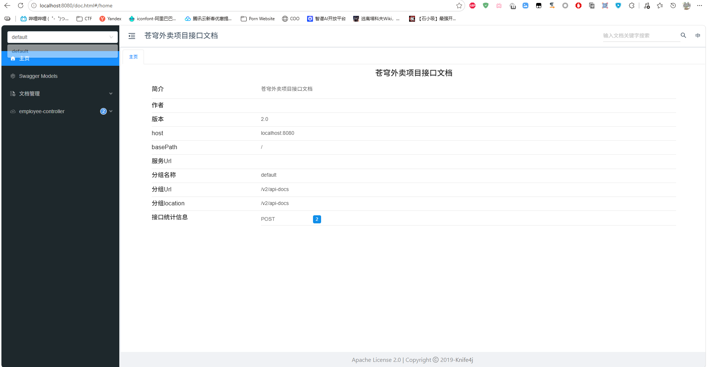

#### 常用注解

| 注解                | 属性值        | 说明                       |
| ------------------- | ------------- | -------------------------- |
| `@Api`              | `tags`        | 业务类说明                 |
| `@ApiModel`         | `description` | 实体类说明                 |
| `@ApiModelProperty` | `value`       | 属性说明，用于描述属性信息 |
| `@ApiOperation`     | `value`       | 方法说明，用于说明方法用途 |

**示例**

```java
@RestController
@Api(tags = "员工操作接口")
public class EmployeeController {
    
    @PostMapping("/login")
    @ApiOperation("员工登录")
    Result login() {}
}

@Data
@ApiModel(description = "员工登录时传递的数据模型")
public class EmployeeLoginDTO implements Serializable {

    @ApiModelProperty("用户名")
    private String username;
}
```

### 新增员工

在`Java Web Medium`的学习中，我们已经掌握了基础的`CRUD`操作，为了提高效率，从`Java Web Advance`开始，将不会对已经学过的知识点做过多解释，如有不懂得地方，请查阅[JavaWebMedium](./JavaWebMedium.md)的相关内容

这个项目我们不再全套使用一个实体类，而是为不同的功能设计不同用处的特定实例类

`EmployeeDTO`

用于接收前端请求参数

```java
package com.sky.dto;

import io.swagger.annotations.ApiModel;
import io.swagger.annotations.ApiModelProperty;
import lombok.Data;

import java.io.Serializable;

@Data
@ApiModel(description = "新增员工时传递的数据模型")
public class EmployeeDTO implements Serializable {

    @ApiModelProperty("员工id")
    private Long id;

    @ApiModelProperty("员工登录用户名")
    private String username;

    @ApiModelProperty("员工姓名")
    private String name;

    @ApiModelProperty("员工手机号")
    private String phone;

    @ApiModelProperty("员工性别")
    private String sex;

    @ApiModelProperty("员工身份证号")
    private String idNumber;

}
```

`Employee`

用于封装为数据库对象

```java
package com.sky.entity;

import lombok.AllArgsConstructor;
import lombok.Builder;
import lombok.Data;
import lombok.NoArgsConstructor;

import java.io.Serializable;
import java.time.LocalDateTime;

@Data
@Builder
@NoArgsConstructor
@AllArgsConstructor
public class Employee implements Serializable {

    private static final long serialVersionUID = 1L;

    private Long id;

    private String username;

    private String name;

    private String password;

    private String phone;

    private String sex;

    private String idNumber;

    private Integer status;

    //@JsonFormat(pattern = "yyyy-MM-dd HH:mm:ss")
    private LocalDateTime createTime;

    //@JsonFormat(pattern = "yyyy-MM-dd HH:mm:ss")
    private LocalDateTime updateTime;

    private Long createUser;

    private Long updateUser;

}
```

`Controller`

```java
@PostMapping
@ApiOperation("新增员工")
public Result<String> add(@RequestBody EmployeeDTO employeeDTO) {
    log.info("新增员工，员工数据：{}", employeeDTO);
    employeeService.add(employeeDTO);
    return Result.success();
}
```

`Service`

在数据校验模块，我们为不同的错误类型抛出不同的自定义异常类，所有的自定义异常类都继承自`BaseException`异常类，通过全局异常处理器捕获。所有的报错信息由`MessageConstant`常量类定义。创建人`ID`和修改人`ID`使用`ThreadLocal`封装而成的`BaseContext`上下文工具类设置和获取

```java
@Override
public void add(EmployeeDTO employeeDTO) {
    String username = employeeDTO.getUsername();
    String name = employeeDTO.getName();
    String phone = employeeDTO.getPhone();
    String sex = employeeDTO.getSex();
    String idNumber = employeeDTO.getIdNumber();

    // 数据校验
    // 用户名校验
    if (username == null || username.isEmpty())
        throw new FormValueIsNullException(MessageConstant.USERNAME_IS_NULL);
    else if (username.length() < 4 || username.length() > 32)
        throw new UsernameLengthWrongException(MessageConstant.USERNAME_LENGTH_WRONG);
    Employee employee = employeeMapper.getByUsername(username);
    // 已经注册
    if (employee != null) throw new UsernameExistsException(MessageConstant.USERNAME_EXISTS);

    // 姓名校验
    if (name == null || name.isEmpty())
        throw new FormValueIsNullException(MessageConstant.NAME_IS_NULL);
    else if (name.length() < 2 || name.length() > 32)
        throw new NameLengthWrongException(MessageConstant.NAME_LENGTH_WRONG);

    // 手机号校验
    if (phone == null || phone.isEmpty())
        throw new FormValueIsNullException(MessageConstant.PHONE_NUMBER_IS_NULL);
    else if (!phone.matches("^1[3-9]\\d{9}$"))
        throw new PhoneNumberIllegalException(MessageConstant.PHONE_NUMBER_ILLEGAL);

    // 性别校验
    if (!Objects.equals(sex, "1") && !Objects.equals(sex, "2")) throw new SexNotExistException(MessageConstant.SEX_NOT_EXIST);

    // 身份证号码校验
    if (idNumber == null || idNumber.isEmpty())
        throw new FormValueIsNullException(MessageConstant.ID_NUMBER_IS_NULL);
    else if (!idNumber.matches("^[1-9]\\d{5}(18|19|20)\\d{2}((0[1-9])|(10|11|12))(([0-2][1-9])|10|20|30|31)\\d{3}[0-9Xx]$"))
        throw new IdNumberIllegalException(MessageConstant.ID_NUMBER_ILLEGAL);

    employee = new Employee();
    // 复制属性
    BeanUtils.copyProperties(employeeDTO, employee);
    // 设置默认密码123456
    employee.setPassword(DigestUtils.md5DigestAsHex("123456".getBytes()));
    // 设置账号状态
    employee.setStatus(StatusConstant.ENABLE);
    // 设置创建时间和更新时间
    employee.setCreateTime(LocalDateTime.now());
    employee.setUpdateTime(LocalDateTime.now());

    // 设置创建人ID和修改人ID
    Long id = BaseContext.getCurrentId();
    employee.setCreateUser(id);
    employee.setUpdateUser(id);

    // 插入数据
    employeeMapper.insert(employee);
}
```

`Mapper.xml`

```xml
<insert id="insert">
    INSERT INTO
        employee(username,name,password,phone,sex,id_number,status,create_time,update_time,create_user,update_user)
    VALUES
        (#{username},#{name},#{password},#{phone},#{sex},#{idNumber},#{status},#{createTime},#{updateTime},#{createUser},#{updateUser})
</insert>
```

> 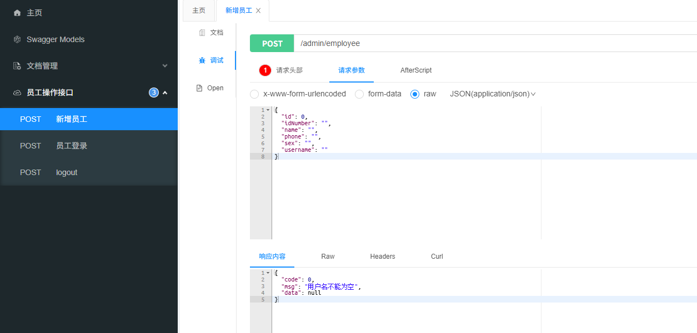

### 员工分页查询

分页查询的功能我们在艾欧希后台管理系统中已经实现过了，简单概述一下，就是使用`MyBatis`的`PageHelper`插件，根据`MyBatis`的拦截器拦截数据库连接请求，然后构建动态`SQL`语句，最后使用`PageHepler`的返回值`Page<>`获取数据即可

`Controller`

```java
@GetMapping("/page")
@ApiOperation("员工分页查询")
public Result<EmployeePageVO> pageQuery(EmployeePageQueryDTO employeePageQueryDTO) {
    log.info("员工分页查询：{}", employeePageQueryDTO);
    EmployeePageVO employeePageVO = employeeService.pageQuery(employeePageQueryDTO);
    return employeePageVO == null ? Result.error(MessageConstant.UNKNOWN_ERROR) : Result.success(employeePageVO);
}
```

`Service`

```java
@Override
public EmployeePageVO pageQuery(EmployeePageQueryDTO employeePageQueryDTO) {
    try (Page<Employee> page = PageHelper.startPage(employeePageQueryDTO.getPage(), employeePageQueryDTO.getPageSize())) {
        employeeMapper.pageQuery(employeePageQueryDTO);
        return new EmployeePageVO(page.getTotal(), page.getResult());
    }
}
```

`Mapper.xml`

```xml
<!--    分页查询查询员工-->
<select id="pageQuery" resultType="com.sky.entity.Employee">
    SELECT
        id,username,name,phone,sex,id_number,status,create_time,update_time,create_user,update_user
    FROM
        employee
    <if test="name != null and name != ''">
        WHERE name LIKE CONCAT('%',#{name},'%')
    </if>
</select>
```

#### 消息转换器

在上文的代码中，`Employee`实体类被注释了两个注解

```java
//@JsonFormat(pattern = "yyyy-MM-dd HH:mm:ss")
private LocalDateTime createTime;

//@JsonFormat(pattern = "yyyy-MM-dd HH:mm:ss")
private LocalDateTime updateTime;
```

这两行注解是设置`Employee`对象从后台接收数据的数据格式，在不加注解的情况下，日期数据格式实质是一个数组

```json
{
    "id": 1,
    "username": "admin",
    "name": "管理员",
    "password": null,
    "phone": "13812312312",
    "sex": "1",
    "idNumber": "110101199001010047",
    "status": 1,
    "createTime": [
      2022,
      2,
      15,
      15,
      51,
      20
    ],
    "updateTime": [
      2022,
      2,
      17,
      9,
      16,
      20
    ],
    "createUser": 10,
    "updateUser": 1
}
```

所以需要这两个注解来转换数据格式

```json
{
    "id": 1,
    "username": "admin",
    "name": "管理员",
    "password": null,
    "phone": "13812312312",
    "sex": "1",
    "idNumber": "110101199001010047",
    "status": 1,
    "createTime": "2022-02-15 15:51:20",
    "updateTime": "2022-02-17 09:16:20",
    "createUser": 10,
    "updateUser": 1
}
```

但是实际上，`Spring MVC`也可以通过扩展消息转换器来实现对日期类型数据格式的统一管理

首先创建一个配置类，继承`WebMvcConfigurationSupport`

```java
@Configuration
public class WebMvcConfiguration extends WebMvcConfigurationSupport {}
```

然后重写`extendMessageConverters`方法

```java
protected void extendMessageConverters(List<HttpMessageConverter<?>> converters) {}
```

定义一个消息转换器类`JacksonObjectMapper`，继承`ObjectMapper`。在`JacksonObjectMapper`中定义一些日期格式的常量

```java
    public static final String DEFAULT_DATE_FORMAT = "yyyy-MM-dd";
    public static final String DEFAULT_DATE_TIME_FORMAT = "yyyy-MM-dd HH:mm:ss";
//    public static final String DEFAULT_DATE_TIME_FORMAT = "yyyy-MM-dd HH:mm";
    public static final String DEFAULT_TIME_FORMAT = "HH:mm:ss";
```

定义`JacksonObjectMapper`的构造器，在构造器中调用父类构造器，然后调用自身的方法`configure()`忽略报错信息，再调用`getDeserializationConfig()`定义对象属性不存在时的应对策略

```java
public JacksonObjectMapper() {
    super();
    //收到未知属性时不报异常
    this.configure(FAIL_ON_UNKNOWN_PROPERTIES, false);

    //反序列化时，属性不存在的兼容处理
    this.getDeserializationConfig().withoutFeatures(DeserializationFeature.FAIL_ON_UNKNOWN_PROPERTIES);
}
```

接着实例化一个`SimpleModule`对象，使用`addDeserializer()`、`addSerializer()`方法设置转换映射，最后调用`registerModule()`方法注册功能模块

```java
package com.sky.json;

import com.fasterxml.jackson.databind.DeserializationFeature;
import com.fasterxml.jackson.databind.ObjectMapper;
import com.fasterxml.jackson.databind.module.SimpleModule;
import com.fasterxml.jackson.datatype.jsr310.deser.LocalDateDeserializer;
import com.fasterxml.jackson.datatype.jsr310.deser.LocalDateTimeDeserializer;
import com.fasterxml.jackson.datatype.jsr310.deser.LocalTimeDeserializer;
import com.fasterxml.jackson.datatype.jsr310.ser.LocalDateSerializer;
import com.fasterxml.jackson.datatype.jsr310.ser.LocalDateTimeSerializer;
import com.fasterxml.jackson.datatype.jsr310.ser.LocalTimeSerializer;

import java.time.LocalDate;
import java.time.LocalDateTime;
import java.time.LocalTime;
import java.time.format.DateTimeFormatter;

import static com.fasterxml.jackson.databind.DeserializationFeature.FAIL_ON_UNKNOWN_PROPERTIES;

/**
 * 对象映射器:基于jackson将Java对象转为json，或者将json转为Java对象
 * 将JSON解析为Java对象的过程称为 [从JSON反序列化Java对象]
 * 从Java对象生成JSON的过程称为 [序列化Java对象到JSON]
 */
public class JacksonObjectMapper extends ObjectMapper {

    public static final String DEFAULT_DATE_FORMAT = "yyyy-MM-dd";
    public static final String DEFAULT_DATE_TIME_FORMAT = "yyyy-MM-dd HH:mm:ss";
//    public static final String DEFAULT_DATE_TIME_FORMAT = "yyyy-MM-dd HH:mm";
    public static final String DEFAULT_TIME_FORMAT = "HH:mm:ss";

    public JacksonObjectMapper() {
        super();
        //收到未知属性时不报异常
        this.configure(FAIL_ON_UNKNOWN_PROPERTIES, false);

        //反序列化时，属性不存在的兼容处理
        this.getDeserializationConfig().withoutFeatures(DeserializationFeature.FAIL_ON_UNKNOWN_PROPERTIES);

        SimpleModule simpleModule = new SimpleModule()
                .addDeserializer(LocalDateTime.class, new LocalDateTimeDeserializer(DateTimeFormatter.ofPattern(DEFAULT_DATE_TIME_FORMAT)))
                .addDeserializer(LocalDate.class, new LocalDateDeserializer(DateTimeFormatter.ofPattern(DEFAULT_DATE_FORMAT)))
                .addDeserializer(LocalTime.class, new LocalTimeDeserializer(DateTimeFormatter.ofPattern(DEFAULT_TIME_FORMAT)))
                .addSerializer(LocalDateTime.class, new LocalDateTimeSerializer(DateTimeFormatter.ofPattern(DEFAULT_DATE_TIME_FORMAT)))
                .addSerializer(LocalDate.class, new LocalDateSerializer(DateTimeFormatter.ofPattern(DEFAULT_DATE_FORMAT)))
                .addSerializer(LocalTime.class, new LocalTimeSerializer(DateTimeFormatter.ofPattern(DEFAULT_TIME_FORMAT)));

        //注册功能模块 例如，可以添加自定义序列化器和反序列化器
        this.registerModule(simpleModule);
    }
}
```

回到`extendMessageConverters()`中，我们先创建一个消息转换器对象，为消息转换器设置对象转换器，即`JacksonObjectMapper`，最后将消息转换器添加到`converters`数组中，注意需要添加到第一个

```java
@Override
protected void extendMessageConverters(List<HttpMessageConverter<?>> converters) {
    log.info("扩展消息转换器...");
    // 创建消息转换器对象
    MappingJackson2HttpMessageConverter converter = new MappingJackson2HttpMessageConverter();
    // 添加对象转换器
    converter.setObjectMapper(new JacksonObjectMapper());
    // 将消息转换器对象追加到converters中
    converters.add(0, converter);
}
```

### 员工账号状态更改

`Controller`

```java
@PostMapping("/status/{status}")
@ApiOperation("更改员工账号状态")
public Result<String> changeStatus(@PathVariable Integer status, Long id) {
    log.info("更改员工账号状态：{}", id);
    employeeService.changeStatus(status, id);
    return Result.success();
}
```

`Service`

```java
@Override
public void changeStatus(Integer status, Long id) {
    if (!Objects.equals(status, StatusConstant.ENABLE) && !Objects.equals(status, StatusConstant.DISABLE))
        throw new FormValueIsNullException(MessageConstant.STATUS_IS_NOT_DEFINED);
    if (id == null || id <= 0)
        throw new FormValueIsNullException(MessageConstant.EMPLOYEE_NOT_FOUND);
    Integer count = employeeMapper.changeStatus(status, id);
    if (count != 1)
        throw new EmployeeStatusChangeFailedException(MessageConstant.EMPLOYEE_STATUS_CHANGE_FAILED);
}
```

`Mapper`

```java
@Update("update employee set status = #{status} where id = #{id}")
Integer changeStatus(Integer status, Long id);
```

### 根据ID查询员工

`Controller`

```java
@GetMapping("/{id}")
@ApiOperation("根据id查询员工信息")
public Result<Employee> getById(@PathVariable Long id) {
    log.info("根据id查询员工信息：{}", id);
    Employee employee = employeeService.getById(id);
    return Result.success(employee);
}
```

`Service`

```java
@Override
public Employee getById(Long id) {
    if (id == null || id <= 0)
        throw new FormValueIsNullException(MessageConstant.EMPLOYEE_NOT_FOUND);
    Employee employee = employeeMapper.getById(id);
    if (employee == null)
        throw new EmployeeNotFoundException(MessageConstant.EMPLOYEE_NOT_FOUND);
    return employee;
}
```

`Mapper`

```java
@Select("select id, name, username, phone, sex, id_number, status, create_time, update_time, create_user, update_user" +
        " from employee where id = #{id}")
Employee getById(Long id);
```

### 编辑员工

`Controller`

```java
@PutMapping
@ApiOperation("编辑员工信息")
public Result<String> update(@RequestBody EmployeeDTO employeeDTO) {
    log.info("编辑员工信息：{}", employeeDTO);
    employeeService.update(employeeDTO);
    return Result.success();
}
```

`Service`

数据校验逻辑与新增员工类似，但是在检测用户名是否被占用时，不能直接检测数据库中是否存在当前用户，因为查询的结果中包含用户本身，所以我们用用户输入的新用户名来查询用户，然后判断用户`id`是否相同

```java
@Override
public void update(EmployeeDTO employeeDTO) {
    String username = employeeDTO.getUsername();
    String name = employeeDTO.getName();
    String phone = employeeDTO.getPhone();
    String sex = employeeDTO.getSex();
    String idNumber = employeeDTO.getIdNumber();

    // 数据校验
    // 用户名校验
    if (username == null || username.isEmpty())
        throw new FormValueIsNullException(MessageConstant.USERNAME_IS_NULL);
    else if (username.length() < 4 || username.length() > 32)
        throw new UsernameLengthWrongException(MessageConstant.USERNAME_LENGTH_WRONG);
    Employee employee = employeeMapper.getByUsername(username);
    // 用户名已经被占用
    if (employee != null && !Objects.equals(employee.getId(), employeeDTO.getId())) throw new UsernameExistsException(MessageConstant.USERNAME_EXISTS);

    // 姓名校验
    if (name == null || name.isEmpty())
        throw new FormValueIsNullException(MessageConstant.NAME_IS_NULL);
    else if (name.length() < 2 || name.length() > 32)
        throw new NameLengthWrongException(MessageConstant.NAME_LENGTH_WRONG);

    // 手机号校验
    if (phone == null || phone.isEmpty())
        throw new FormValueIsNullException(MessageConstant.PHONE_NUMBER_IS_NULL);
    else if (!phone.matches("^1[3-9]\\d{9}$"))
        throw new PhoneNumberIllegalException(MessageConstant.PHONE_NUMBER_ILLEGAL);

    // 性别校验
    if (!Objects.equals(sex, "0") && !Objects.equals(sex, "1")) throw new SexNotExistException(MessageConstant.SEX_NOT_EXIST);

    // 身份证号码校验
    if (idNumber == null || idNumber.isEmpty())
        throw new FormValueIsNullException(MessageConstant.ID_NUMBER_IS_NULL);
    else if (!idNumber.matches("^[1-9]\\d{5}(18|19|20)\\d{2}((0[1-9])|(10|11|12))(([0-2][1-9])|10|20|30|31)\\d{3}[0-9Xx]$"))
        throw new IdNumberIllegalException(MessageConstant.ID_NUMBER_ILLEGAL);

    // 封装对象
    employee = new Employee();
    BeanUtils.copyProperties(employeeDTO, employee);
    // 设置更新时间
    employee.setUpdateTime(LocalDateTime.now());
    // 设置更新人ID
    employee.setUpdateUser(BaseContext.getCurrentId());
    // 更新数据
    Integer count = employeeMapper.update(employee);
    if (count != 1) throw new EmplyeeUpdateFailedException(MessageConstant.EMPLOYEE_UPDATE_FAILED);
}
```

`Mapper.xml`

```xml
<!--    更新员工信息-->
<update id="update" parameterType="com.sky.entity.Employee">
    UPDATE employee
    <set>
        <if test="username != null and username != ''">username = #{username},</if>
        <if test="name != null and name != ''">name = #{name},</if>
        <if test="password != null and password != ''">password = #{password},</if>
        <if test="phone != null and phone != ''">phone = #{phone},</if>
        <if test="sex != null">sex = #{sex},</if>
        <if test="idNumber != null and idNumber != ''">id_number = #{idNumber},</if>
        <if test="status != null">status = #{status},</if>
        <if test="createTime != null">create_time = #{createTime},</if>
        <if test="updateTime != null">update_time = #{updateTime},</if>
        <if test="createUser != null and createUser != ''">create_user = #{createUser},</if>
        <if test="updateUser != null and updateUser != ''">update_user = #{updateUser},</if>
    </set>
    WHERE id = #{id}
</update>
```

### 分类相关接口

分类相关接口的逻辑大致与员工操作相当，所以这里仅展示代码

`Controller`

```java
package com.sky.controller.admin;

import com.sky.dto.CategoryDTO;
import com.sky.dto.CategoryPageQueryDTO;
import com.sky.entity.Category;
import com.sky.result.PageResult;
import com.sky.result.Result;
import com.sky.service.impl.CategoryServiceImpl;
import io.swagger.annotations.Api;
import io.swagger.annotations.ApiOperation;
import lombok.extern.slf4j.Slf4j;
import org.springframework.beans.factory.annotation.Autowired;
import org.springframework.web.bind.annotation.*;

import java.util.List;

/**
 * 分类管理
 */
@RestController
@RequestMapping("/admin/category")
@Slf4j
@Api(tags = "分类管理接口")
public class CategoryController {

    @Autowired
    private CategoryServiceImpl categoryService;

    /**
     * 分类分页查询
     * @param categoryPageQueryDTO
     * @return
     */
    @GetMapping("/page")
    @ApiOperation("分类分页查询")
    public Result<PageResult<Category>> pageQuery(CategoryPageQueryDTO categoryPageQueryDTO) {
        log.info("分页查询：{}", categoryPageQueryDTO);
        PageResult<Category> pageResult = categoryService.pageQuery(categoryPageQueryDTO);
        return Result.success(pageResult);
    }

    /**
     * 新增分类
     * @param categoryDTO
     * @return
     */
    @PutMapping
    @ApiOperation("修改分类")
    public Result<String> update(@RequestBody CategoryDTO categoryDTO) {
        log.info("修改分类：{}", categoryDTO);
        categoryService.update(categoryDTO);
        return Result.success();
    }

    /**
     * 修改分类状态
     * @param status
     * @param id
     * @return
     */
    @PostMapping("/status/{status}")
    @ApiOperation("更改分类状态")
    public Result<String> changeStatus(@PathVariable Integer status, Long id) {
        log.info("更改分类状态：{}", status);
        categoryService.changeStatus(status, id);
        return Result.success();
    }

    /**
     * 新增分类
     * @param categoryDTO
     * @return
     */
    @PostMapping
    @ApiOperation("新增分类")
    public Result<String> add(@RequestBody CategoryDTO categoryDTO) {
        log.info("新增分类：{}", categoryDTO);
        categoryService.add(categoryDTO);
        return Result.success();
    }

    /**
     * 删除分类
     * @param id
     * @return
     */
    @DeleteMapping
    @ApiOperation("删除分类")
    public Result<String> delete(Long id) {
        log.info("删除分类：{}", id);
        categoryService.delete(id);
        return Result.success();
    }

    /**
     * 根据类型查询
     * @param type
     * @return
     */
    @GetMapping("/list")
    @ApiOperation("根据类型查询分类")
    public Result<List<Category>> list(Integer type) {
        log.info("根据类型查询分类：{}", type);
        List<Category> list = categoryService.list(type);
        return Result.success(list);
    }
}
```

`Service`

```java
package com.sky.service.impl;

import com.github.pagehelper.Page;
import com.github.pagehelper.PageHelper;
import com.sky.constant.MessageConstant;
import com.sky.constant.StatusConstant;
import com.sky.context.BaseContext;
import com.sky.dto.CategoryDTO;
import com.sky.dto.CategoryPageQueryDTO;
import com.sky.entity.Category;
import com.sky.exception.*;
import com.sky.mapper.CategoryMapper;
import com.sky.result.PageResult;
import com.sky.service.CategoryService;
import org.springframework.beans.BeanUtils;
import org.springframework.beans.factory.annotation.Autowired;
import org.springframework.stereotype.Service;

import java.time.LocalDateTime;
import java.util.List;

@Service
public class CategoryServiceImpl implements CategoryService {

    @Autowired
    private CategoryMapper categoryMapper;

    /**
     * 分类分页查询
     * @param categoryPageQueryDTO
     * @return
     */
    @Override
    public PageResult<Category> pageQuery(CategoryPageQueryDTO categoryPageQueryDTO) {
        Page<Category> page = PageHelper.startPage(categoryPageQueryDTO.getPage(), categoryPageQueryDTO.getPageSize());
        categoryMapper.pageQuery(categoryPageQueryDTO);
        return new PageResult<>(page.getTotal(), page.getResult());
    }

    /**
     * 修改分类
     * @param categoryDTO
     */
    @Override
    public void update(CategoryDTO categoryDTO) {
        Long id = categoryDTO.getId();
        String name = categoryDTO.getName();
        Integer sort = categoryDTO.getSort();

        // 参数校验
        if (id == null)
            throw new FormValueIsNullException(MessageConstant.CANNOT_FOUND_CATEGORY);
        if (name == null || name.length() > 20 || name.length() < 2)
            throw new CategoryNameIllegalException(MessageConstant.CATEGORY_NAME_LENGTH_WRONG);
        Category category = categoryMapper.getByName(name);
        if (category != null && !category.getId().equals(id))
            throw new CategoryNameIllegalException(MessageConstant.CATEGORY_NAME_EXISTS);
        if (sort == null || sort < 0)
            throw new CategorySortIllegalException(MessageConstant.CATEGORY_SORT_ILLEGAL);

        category = new Category();
        BeanUtils.copyProperties(categoryDTO, category);
        category.setUpdateTime(LocalDateTime.now());
        category.setUpdateUser(BaseContext.getCurrentId());

        Integer result = categoryMapper.update(category);
        if (result != 1)
            throw new CategoryUpdateFailedException(MessageConstant.CATEGORY_UPDATE_FAILED);
    }

    /**
     * 修改分类状态
     * @param status
     * @param id
     */
    @Override
    public void changeStatus(Integer status, Long id) {
        if (id == null)
            throw new FormValueIsNullException(MessageConstant.CANNOT_FOUND_CATEGORY);
        if (status == null || !status.equals(0) && !status.equals(1))
            throw new CategoryStatusIllegalException(MessageConstant.CATEGORY_STATUS_ILLEGAL);
        Integer count = categoryMapper.changeStatus(status, id);
        if (count != 1)
            throw new CategoryUpdateFailedException(MessageConstant.CATEGORY_STATUS_UPDATE_FAILED);
    }

    /**
     * 新增分类
     * @param categoryDTO
     */
    @Override
    public void add(CategoryDTO categoryDTO) {
        String name = categoryDTO.getName();
        Integer sort = categoryDTO.getSort();
        Integer type = categoryDTO.getType();

        // 参数校验
        if (name == null || name.length() > 20 || name.length() < 2)
            throw new CategoryNameIllegalException(MessageConstant.CATEGORY_NAME_LENGTH_WRONG);
        Category category = categoryMapper.getByName(name);
        if (category != null)
            throw new CategoryNameIllegalException(MessageConstant.CATEGORY_NAME_EXISTS);
        if (sort == null || sort < 0)
            throw new CategorySortIllegalException(MessageConstant.CATEGORY_SORT_ILLEGAL);
        if (type == null || !type.equals(1) && !type.equals(2))
            throw new CategoryTypeIllegalException(MessageConstant.CATEGORY_TYPE_ILLEGAL);

        category = new Category();
        BeanUtils.copyProperties(categoryDTO, category);
        category.setUpdateTime(LocalDateTime.now());
        category.setUpdateUser(BaseContext.getCurrentId());
        category.setCreateTime(LocalDateTime.now());
        category.setCreateUser(BaseContext.getCurrentId());
        category.setStatus(StatusConstant.ENABLE);

        Integer result = categoryMapper.add(category);
        if (result != 1)
            throw new CategoryInsertFailedException(MessageConstant.CATEGORY_INSERT_FAILED);
    }

    /**
     * 删除分类
     * @param id
     */
    @Override
    public void delete(Long id) {
       if (id == null)
           throw new FormValueIsNullException(MessageConstant.CANNOT_FOUND_CATEGORY);
       Integer count = categoryMapper.delete(id);
       if (count != 1)
           throw new CategoryDeleteFailedException(MessageConstant.CATEGORY_DELETE_FAILED);
    }

    /**
     * 根据类型查询
     * @param type
     * @return
     */
    @Override
    public List<Category> list(Integer type) {
        if (type == null || !type.equals(1) && !type.equals(2))
            throw new CategoryTypeIllegalException(MessageConstant.CATEGORY_TYPE_ILLEGAL);
        return categoryMapper.list(type);
    }
}
```

`Mapper`

```java
package com.sky.mapper;

import com.sky.dto.CategoryDTO;
import com.sky.dto.CategoryPageQueryDTO;
import com.sky.entity.Category;
import io.swagger.models.auth.In;
import org.apache.ibatis.annotations.Delete;
import org.apache.ibatis.annotations.Mapper;
import org.apache.ibatis.annotations.Select;
import org.apache.ibatis.annotations.Update;

import java.util.List;

@Mapper
public interface CategoryMapper {
    /**
     * 分页查询
     * @param categoryPageQueryDTO
     * @return
     */
    List<Category> pageQuery(CategoryPageQueryDTO categoryPageQueryDTO);

    /**
     * 根据名称查询
     * @param name
     * @return
     */
    @Select("select id, type, name, sort, status, create_time, update_time, create_user, update_user from category where name = #{name}")
    Category getByName(String name);

    /**
     * 修改分类
     * @param category
     */
    Integer update(Category category);

    /**
     * 修改分类状态
     * @param status
     * @param id
     * @return
     */
    @Update("update category set status = #{status} where id = #{id}")
    Integer changeStatus(Integer status, Long id);

    /**
     * 新增分类
     * @param category
     * @return
     */
    Integer add(Category category);

    /**
     * 删除分类
     * @param id
     * @return
     */
    @Delete("delete from category where id = #{id}")
    Integer delete(Long id);

    /**
     * 根据类型查询
     * @param type
     * @return
     */
    @Select("select id, type, name, sort, status, create_time, update_time, create_user, update_user " +
            "from category where type = #{type} order by sort")
    List<Category> list(Integer type);
}
```

`Mapper.xml`

```xml
<?xml version="1.0" encoding="UTF-8" ?>
<!DOCTYPE mapper PUBLIC "-//mybatis.org//DTD Mapper 3.0//EN"
        "http://mybatis.org/dtd/mybatis-3-mapper.dtd" >
<mapper namespace="com.sky.mapper.CategoryMapper">
<!--    新增分类-->
    <insert id="add" parameterType="com.sky.entity.Category">
        INSERT INTO
        category(type, name, sort, status, create_time, update_time, create_user, update_user)
        VALUES
        (#{type}, #{name}, #{sort}, #{status}, #{createTime}, #{updateTime}, #{createUser}, #{updateUser})
    </insert>
    <!--    修改分类-->
    <update id="update" parameterType="com.sky.entity.Category">
        UPDATE category
        <set>
            <if test="name != null">
                name = #{name},
            </if>
            <if test="sort != null">
                sort = #{sort},
            </if>
            <if test="status != null">
                status = #{status},
            </if>
            <if test="updateTime != null">
                update_time = #{updateTime},
            </if>
            <if test="updateUser != null">
                update_user = #{updateUser},
            </if>
        </set>
        WHERE id = #{id}
    </update>
    <!-- 分页查询-->
    <select id="pageQuery" resultType="com.sky.entity.Category">
        SELECT
            id, type, name, sort, status, create_time, update_time, create_user, update_user
        FROM
            category
        <where>
            <if test="type != null">
                type = #{type}
            </if>
            <if test="name != null and name != ''">
                AND name LIKE '%${name}%'
            </if>
        </where>
        ORDER BY sort
    </select>
</mapper>
```

*注：在进行数据校验时，建议使用`Objects.equals()`，因为`Objects.equals()`中进行了空值判断，直接调用属性的`equals()`方法可能导致空指针异常*

```java
public static boolean equals(Object a, Object b) {
    return (a == b) || (a != null && a.equals(b));
}
```

### 公共字段自动填充

在上文的项目实战中，不难发现在执行更新或插入操作时，我们需要为实体类的更新时间、操作员工`id`、创建人、创建时间进行单独的赋值，如下

```java
category.setUpdateTime(LocalDateTime.now());
category.setUpdateUser(BaseContext.getCurrentId());
category.setCreateTime(LocalDateTime.now());
category.setCreateUser(BaseContext.getCurrentId());
```

如果项目中有几十上百个类似的实体类及其字段，很可能导致某一个实体类的信息被漏掉，而且也不便于项目维护。因此我们可以利用`Spring AOP`来切分一个切面，在数据库事务操作之前通过切面类为相关字段赋值

1. 逻辑概述

通过`Spring AOP`定义一个切面类，切入点为所有的`Mapper`操作，但是必须是所有的插入和更新操作，这一步可以由方法名约束，但我们的方法命名比较随意，所以需要通过自定义注解来约束。在自定义注解中，我们再使用枚举类来区分更新和插入操作，因为通知中需要对更新和插入执行不同的字段填充，更新操作不能填充创建人和创建时间字段

2. 定义`AutoFill`注解和枚举类`OperationType`

`AutoFill`

```java
package com.sky.annotation;

import com.sky.enumeration.OperationType;

import java.lang.annotation.ElementType;
import java.lang.annotation.Retention;
import java.lang.annotation.RetentionPolicy;
import java.lang.annotation.Target;

@Target(ElementType.METHOD)
@Retention(RetentionPolicy.RUNTIME)
public @interface AutoFill {
    OperationType value();
}
```

`OperationType`

```java
package com.sky.enumeration;

/**
 * 数据库操作类型
 */
public enum OperationType {

    /**
     * 更新操作
     */
    UPDATE,

    /**
     * 插入操作
     */
    INSERT

}
```

2. 定义切面类`FieldAutoFillAspect`

```java
package com.sky.aspect;

import com.sky.annotation.AutoFill;
import com.sky.constant.AutoFillConstant;
import com.sky.context.BaseContext;
import com.sky.enumeration.OperationType;
import lombok.extern.slf4j.Slf4j;
import org.aspectj.lang.JoinPoint;
import org.aspectj.lang.annotation.Aspect;
import org.aspectj.lang.annotation.Before;
import org.aspectj.lang.annotation.Pointcut;
import org.aspectj.lang.reflect.MethodSignature;
import org.springframework.stereotype.Component;

import java.lang.reflect.Method;
import java.time.LocalDateTime;

@Aspect
@Component
@Slf4j
public class FieldAutoFillAspect {

}
```

3. 定义切入点，需要切入所有带有`AutoFill`注解的`Mapper`方法

```java
@Pointcut("execution(* com.sky.mapper.*.*(..)) && @annotation(com.sky.annotation.AutoFill)")
public void autoFill() {}
```

4. 定义通知方法，通知类型为前置通知，必须在`Mapper`方法执行之前完成字段填充，否则会数据插入数据库时会造成数据缺失

```java
@Before("autoFill()")
public void autoFill(JoinPoint joinPoint) {}
```

5. 定义自动填充逻辑

首先截取到传递给数据库的实例，然后获取当前操作用户和系统时间，从方法的注解中获取操作类型，最后根据不同的操作类型，通过`Java`反射为实例赋值。赋值的逻辑则是获取实例的`Class`对象，通过`Class`对象获取其`setter`方法，然后利用`setter`方法赋值，而不是通过`Java`直接修改其访问权限并赋值，保证逻辑的安全性

```java
@Before("autoFill()")
public void autoFill(JoinPoint joinPoint) {
    log.info("开始进行数据填充");
    // 获取更新或新增的实例
    Object[] args = joinPoint.getArgs();
    if (args == null || args.length == 0) {
        return;
    }
    Object object = args[0];
    // 获取当前时间与操作用户
    LocalDateTime now = LocalDateTime.now();
    Long currentId = BaseContext.getCurrentId();
    // 获取操作类型
    MethodSignature signature = (MethodSignature) joinPoint.getSignature();
    AutoFill annotation = signature.getMethod().getAnnotation(AutoFill.class);

    if (annotation == null) {
        return;
    }
    // 根据操作类型执行不同的操作逻辑
    if (annotation.value() == OperationType.INSERT) {
        setFieldValue(object, AutoFillConstant.SET_CREATE_TIME, now);
        setFieldValue(object, AutoFillConstant.SET_UPDATE_TIME, now);
        setFieldValue(object, AutoFillConstant.SET_CREATE_USER, currentId);
        setFieldValue(object, AutoFillConstant.SET_UPDATE_USER, currentId);
    } else if (annotation.value() == OperationType.UPDATE) {
        setFieldValue(object, AutoFillConstant.SET_UPDATE_TIME, now);
        setFieldValue(object, AutoFillConstant.SET_UPDATE_USER, currentId);
    }
}

private void setFieldValue(Object object, String fieldName, Object param) {
    try {
        // 获取object的Class对象
        Class<?> clazz = object.getClass();
        // 获取object的fieldName字段的setter方法
        Method setter = clazz.getDeclaredMethod(fieldName, param.getClass());
        // 调用setter方法，为字段赋值
        setter.invoke(object, param);
    } catch (Exception e) {
        e.printStackTrace();
    }
}
```

这里的`fieldName`参数使用了常量类`AutoFillConstant`，以保证所有的相关字段名称是相同的，避免拼写错误。

```java
package com.sky.constant;

/**
 * 公共字段自动填充相关常量
 */
public class AutoFillConstant {
    /**
     * 实体类中的方法名称
     */
    public static final String SET_CREATE_TIME = "setCreateTime";
    public static final String SET_UPDATE_TIME = "setUpdateTime";
    public static final String SET_CREATE_USER = "setCreateUser";
    public static final String SET_UPDATE_USER = "setUpdateUser";
}
```

### Mybatis参数解析

在编写`Mybatis`的`XML`映射文件时，我们通常使用`#{}`来表示一个实例属性，例如

```xml
<insert id="add" parameterType="com.sky.entity.Dish">
    INSERT INTO
        dish(name, category_id, price, image, description, status, create_time, update_time, create_user, update_user)
    VALUES (
            #{name},
            #{categoryId},
            #{price},
            #{image},
            #{description},
            #{status},
            #{createTime},
            #{updateTime},
            #{createUser},
            #{updateUser}
        )
</insert>
```

在实体类`Category`中只要包含这些属性，就能够直接访问

```java
package com.sky.entity;

import lombok.AllArgsConstructor;
import lombok.Builder;
import lombok.Data;
import lombok.NoArgsConstructor;
import java.io.Serializable;
import java.math.BigDecimal;
import java.time.LocalDateTime;

/**
 * 菜品
 */
@Data
@Builder
@NoArgsConstructor
@AllArgsConstructor
public class Dish implements Serializable {

    private static final long serialVersionUID = 1L;

    private Long id;

    //菜品名称
    private String name;

    //菜品分类id
    private Long categoryId;

    //菜品价格
    private BigDecimal price;

    //图片
    private String image;

    //描述信息
    private String description;

    //0 停售 1 起售
    private Integer status;

    private LocalDateTime createTime;

    private LocalDateTime updateTime;

    private Long createUser;

    private Long updateUser;

}
```

但其实有一个问题，当`Mapper`中使用了`@Param`注解的时候，`XML`文件中必须使用`@Param`指定的参数名来访问属性，否则会报错

```java
org.apache.ibatis.binding.BindingException: Parameter 'name' not found. Available parameters are [dish, param1]
```

#### 单参数

当参数列表只有一个参数，并且没有使用`@Param`注解时，`Mybatis`会将这个参数作为根参数，`XML`中编写的如`#{name}`这样的表达式都是通过访问对象的`getter`方法获取的，相当于`dish.getName()`。也就是说，即使定义了一个没有属性的实体，但是提供了一个假的`getter`

```java
public class fakeEntity {
    public String getName() {
        return "fake";
    }
}
```

你仍然可以在`XML`文件中通过`#{name}`来得到字符串`"fake"`。

如果是基本数据类型，如`int`、`Integer`、`String`等等，`XML`中无论定义怎样的`#{aaa}`、`#{bbb}`，都可以访问到对应数据，因为这里只需要一个参数，不需要考虑参数名。

#### 多参数

而当参数列表中使用`@Param`注解，或者有多个参数时，`Mybatis`会自动生成一个参数`Map`，这个`Map`记录了参数名与参数值之间的对应关系

```java
{
    "Dish" -> Dish对象;
    "param1" -> Dish对象;
}
```

如果使用了`@Param`注解，`Map`中会自动添加一个参数名与对象的映射，同时添加一个`param1`到对象的映射。如果是多个参数，也会添加对应的映射

```java
{
    "Dish" -> Dish对象;
    "Category" -> Category对象;
    "param1" -> Dish对象;
    "param2" -> Category对象;
}
```

此时如果在`XML`文件中使用`#{name}`就会自动在`Map`中寻找对应的映射，如果没有这个映射，就会导致报错

```log
org.apache.ibatis.binding.BindingException: Parameter 'name' not found. Available parameters are [dish, param1]
```

因此如果想要访问对象属性，则必须使用对象的参数名称来访问，如`dish.name`或者`param1.name`。`param1`和`param2`是`Mybatis`为每个参数设置的默认名称，作为兜底策略，如果不指定`@Param`，开发人员就必须使用`paramX`来访问对应的对象，如果指定了`@Param`，这些默认的名称也并不会被删除。

上文提到，在单参数情况中，如果是基本数据类型，`Mybatis`会忽略参数名，因为只有一个参数可用。但如果同时存在多个基本参数类型

```java
@Update("update category set status = #{status} where id = #{id}")
Integer changeStatus(Integer status, Long id);
```

理论上来说，`status`和`id`的参数名不会被记录，默认是`param1`和`param2`，但查询语句`"update category set status = #{status} where id = #{id}"`仍然可以生效。这是因为`SpringBoot2.x+`版本中，默认使用了`-parameters`参数，让编译器在进行编译时能够保留参数名

```java
/**
 * 测试
 * @return
 */
@Select("select concat(#{c},#{b},#{a})")
String test(String a, String b, String c);
```

> 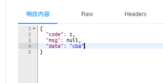

而去除`-parameters`后，参数名不作保留，就会导致报错

```log
org.apache.ibatis.binding.BindingException: Parameter 'c' not found. Available parameters are [arg2, arg1, arg0, param3, param1, param2]
```

#### 源码追踪

你有没有考虑过，默认的`[arg2, arg1, arg0]`从何而来？

我们来查看`Mybatis`的源码，位于`org.apache.ibatis.reflection.ParamNameResolver`

```java
public static final String GENERIC_NAME_PREFIX = "param";
private final SortedMap<Integer, String> names;
```

可以看到，在`ParamNameResolver`中定义了两个关键属性，参数名前缀和参数名称列表

```java
public ParamNameResolver(Configuration config, Method method) {
  this.useActualParamName = config.isUseActualParamName();
  final Class<?>[] paramTypes = method.getParameterTypes();
  final Annotation[][] paramAnnotations = method.getParameterAnnotations();
  final SortedMap<Integer, String> map = new TreeMap<>();
  int paramCount = paramAnnotations.length;
  // get names from @Param annotations
  for (int paramIndex = 0; paramIndex < paramCount; paramIndex++) {
    if (isSpecialParameter(paramTypes[paramIndex])) {
      // skip special parameters
      continue;
    }
    String name = null;
    for (Annotation annotation : paramAnnotations[paramIndex]) {
      if (annotation instanceof Param) {
        hasParamAnnotation = true;
        name = ((Param) annotation).value();
        break;
      }
    }
    if (name == null) {
      // @Param was not specified.
      if (useActualParamName) {
        name = getActualParamName(method, paramIndex);
      }
      if (name == null) {
        // use the parameter index as the name ("0", "1", ...)
        // gcode issue #71
        name = String.valueOf(map.size());
      }
    }
    map.put(paramIndex, name);
  }
  names = Collections.unmodifiableSortedMap(map);
}
```

在构造器中，首先获取参数中的`@Param`注解，接着调用`getActualParamName()`来获取参数的参数名称，最后使用`String.valueOf(map.size())`来作为兜底参数名。

`arg0`、`arg1`来源于`Java`反射获取的默认名称，如果在编译时不使用`-parameters`参数，虽然不会保留参数名称，但是`name = getActualParamName(method, paramIndex);`可以获得一个名称，这个名称便源自于`Java`反射中`Executable`类的`synthesizeAllParams()`方法

我们先来看`getActualParamName()`方法

```java
private String getActualParamName(Method method, int paramIndex) {
  return ParamNameUtil.getParamNames(method).get(paramIndex);
}
```

追踪到`ParamNameUtil.getParamNames()`

```java
private static List<String> getParameterNames(Executable executable) {
  return Arrays.stream(executable.getParameters()).map(Parameter::getName).collect(Collectors.toList());
}
```

这里使用了`Java`反射`API`中的`executable.getParameters()`方法

```java
public Parameter[] getParameters() {
    // TODO: This may eventually need to be guarded by security
    // mechanisms similar to those in Field, Method, etc.
    //
    // Need to copy the cached array to prevent users from messing
    // with it.  Since parameters are immutable, we can
    // shallow-copy.
    return parameterData().parameters.clone();
}
```

查看`parameterData()`

```java
private ParameterData parameterData() {
    ParameterData parameterData = this.parameterData;
    if (parameterData != null) {
        return parameterData;
    }

    Parameter[] tmp;
    // Go to the JVM to get them
    try {
        tmp = getParameters0();
    } catch (IllegalArgumentException e) {
        // Rethrow ClassFormatErrors
        throw new MalformedParametersException("Invalid constant pool index");
    }

    // If we get back nothing, then synthesize parameters
    if (tmp == null) {
        tmp = synthesizeAllParams();
        parameterData = new ParameterData(tmp, false);
    } else {
        verifyParameters(tmp);
        parameterData = new ParameterData(tmp, true);
    }
    return this.parameterData = parameterData;
}
```

首先调用`tmp = getParameters0()`从`class`文件中读取所有的参数，由于编译时没有使用`-parameters`，因此`tmp`为`null`，执行`tmp = synthesizeAllParams();`

```java
private Parameter[] synthesizeAllParams() {
    final int realparams = getParameterCount();
    final Parameter[] out = new Parameter[realparams];
    for (int i = 0; i < realparams; i++)
        // TODO: is there a way to synthetically derive the
        // modifiers?  Probably not in the general case, since
        // we'd have no way of knowing about them, but there
        // may be specific cases.
        out[i] = new Parameter("arg" + i, 0, this, i);
    return out;
}
```

在这里，参数才真正被命名为`"arg" + i`

*注：`arg0`的来源常被误解为`Parameter`实体类的`getName()`方法*

### 菜品相关接口

菜品相关接口中，主要的难点就是新增和修改菜品中涉及到的多表操作，以及文件上传操作，这里着重概述一些容易踩坑的知识点

**分页查询的每页记录数量不足**

如果在`Mapper`定义的分页查询`SQL`中使用了`JOIN`关键字连接查询`flavor`表中的内容，就会导致第一分页中查询数量少于指定数量，其根本原因在于，使用`JOIN`关键字后，如果一个菜品在`flavor`表中有多条数据，`JOIN`会为每个口味生成一条数据，如下

```mysql
SELECT
    d.id AS id,
    d.name AS name,
    df.value AS flavor
FROM dish AS d
    LEFT JOIN dish_flavor AS df ON d.id = df.dish_id
ORDER BY
    d.id
LIMIT
    0, 10;
```

> 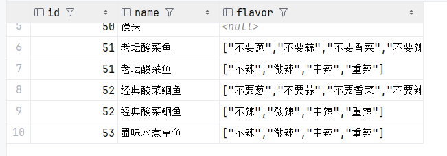

而`PageHelper`的分页本质就是使用`LIMIT`关键字，`PageHelper`并不知道前`10`行数据中有多行数据属于同一个实体，因此会造成实际显示的查询数量少于指定的每页数量

最直接的解决方法便是在分页查询中不使用`JOIN`关键字查询口味，而是分为两次查询，第一次使用分页查询在`dish`表中查询对应的基本信息，第二次查询不使用分页查询而是使用第一次查询获取的所有`dish.id`，在`dish_flavor`表中查询所有的口味数据，最后将两个记录组合在一起，再返回给前端

**主键返回失效**

`Mybatis`的主键返回有两种常用的方式，一种是使用`@Options`注解，另一种是在`XML`文件中使用对应的属性，但是这两种方式不能混用。假设你在`Mapper`定义了

```java
/**
 * 插入数据
 * @param test
 */
@Options(useGeneratedKeys = true, keyColumn = "id", keyProperty = "test.id")
void insertTest(@Param("test") Test test);
```

这里的`@options`是无法在`XML`文件中生效的，`@Options`只能配合注解查询`@Insert`使用，而`XML`文件中的查询语句则只能使用属性关键字来定义

```xml
<insert id="insertTest" parameterType="com.sky.entity.Test" keyProperty="id" useGeneratedKeys="true">
    insert into test(name) values(#{name})
</insert>
```

## Redis

`REmote DIctionary Server`，即`Redis` 是一个由 `Salvatore Sanfilippo` 写的 `key-value`键值对存储系统，是跨平台的非关系型数据库

`Redis`的最大优点就是通过内存存储数据，读写性能极高。由于`Redis`基于内存，从容量上也极大地限制了`Redis`的使用，`Redis`一般只用于存储访问数量极高的数据，如热点商品、咨询、新闻等等

### Redis快速入门

#### 连接

`Redis`的客户端连接命令与`MySQL`类似，使用`-h`指定主机，`-p`指定端口号

```cmd
redis-cli.exe -h localhost -p 6379
```

#### 身份认证

`Redis`默认不设置任何的身份认证，如果要设置密码，需要更改`redis.conf`文件中新增一行

```conf
requirepass <password>
```

然后使用`-a`使用密码登录

```
redis-cli.exe -h localhost -p 6379 -a <password>
```

在`Redis6`之前，并没有登录用户的概念，`Redis`的身份验证仅通过密码来实施，而在`Redis6`之后引入了多用户认证技术`ACL`，支持设置不同的用户名与密码。但是本项目中仅使用单因素认证

#### 数据类型

在`Redis`中，常用的数据类型有5种，分别是`string`、`hash`、`list`、`set`和`zset`

- `string`：字符串，最简单的数据类型
- `hash`：哈希，类似于`Java`中的`HashMap`，存储的是一个由多个键值对组成的数据结构，一般用于存储对象
- `list`：有序列表，类似于`Java`中的`LinkedList`，可以有重复元素，按照插入顺序排序
- `set`：集合，类似于`Java`中的`HashSet`，不允许重复元素，无序
- `zset`：有序集合，又称为`sorted set`，在`Redis`中有序集合每个元素对应一个分数，分数越小， 排序越靠前

### Redis常用命令

与`SQL`不同，`Redis`对不同的数据类型的操作命令也不同

#### 字符串操作

| 命令                            | 说明                                 |
| ------------------------------- | ------------------------------------ |
| `SET <key> <value>`             | 设置指定`key`的值                    |
| `GET <key>`                     | 获取指定`key`的值                    |
| `SETEX <key> <seconds> <value>` | 设置`key`的值，并设置`key`的存活时长 |
| `SETNX <key> <value>`           | 只有当`key`不存在时才设置`key`的值   |

#### 哈希操作

| 命令                         | 说明                             |
| ---------------------------- | -------------------------------- |
| `HSET <key> <field> <value>` | 设置哈希表`key`中字段`field`的值 |
| `HGET <key> <field>`         | 获取`key`中字段`field`的值       |
| `HDEL <key> <field>`         | 删除`key`中的指定字段            |
| `HKEYS <key>`                | 获取`key`中所有字段名            |
| `HVALS <key>`                | 获取`key`中所有字段值            |

#### 列表操作

| 命令                                 | 说明                         |
| ------------------------------------ | ---------------------------- |
| `LPUSH <key> <value1> [<value2>...]` | 将一个或多个值插入到列表头部 |
| `LRANGE <key> <start> <top>`         | 获取列表指定范围内的元素     |
| `RPOP <key>`                         | 移除并获取最后一个元素       |
| `LLEN <key>`                         | 获取列表长度                 |

#### 集合操作

| 命令                                  | 说明                       |
| ------------------------------------- | -------------------------- |
| `SADD <key> <member1> [<member2>...]` | 向集合中添加一个或多个成员 |
| `SEMEMBERS <key>`                     | 返回集合中所有的成员       |
| `SCARD <key>`                         | 获取集合中的成员数量       |
| `SINTER <key1> [<key2>...]`           | 返回给定所有集合的交集     |
| `SUNION <key1> [<key2>...]`           | 返回给定所有集合的并集     |
| `SREM <key> <member1> [<member2>...]` | 删除集合中一个或多个成员   |

#### 有序集合操作

| 命令                                                    | 说明                                                     |
| ------------------------------------------------------- | -------------------------------------------------------- |
| `ZADD <key> <score1> <member1> [<score2> <member2>...]` | 向有序集合中添加一个或多个成员                           |
| `ZRANGE <key> <start> <stop> [WITHSCORES]`              | 通过索引区间返回有序集合中指定区间内的成员，可选附带分数 |
| `ZINCRBY <key> <increment> <member>`                    | 对有序集合中指定成员的分数增加增量                       |
| `ZREM <key> <member1> [<member2>...]`                   | 移除有序集合中的一个或多个成员                           |

#### 通用命令

| 命令             | 说明                        |
| ---------------- | --------------------------- |
| `KEYS <pattern>` | 查找所有符合给定模式的`key` |
| `EXISTS <key>`   | 检查`key`是否存在           |
| `TYPE <key>`     | 返回`key`存储的数据类型     |
| `DEL <key>`      | 删除`key`                   |

### Spring Data Redis

在`Java`中，有三种常用的`Redis`客户端，`Jedis`、`Lettuce`和`Spring Data Redis`

`Spring Data Redis`是`Spring`提供的，封装了`Jedis`以及`Lettuce`的客户端，相比前两者开发效率更高，与`SpringBoot`框架融合度也更高，因此我们使用`Spring Data Redis`

#### 快速入门

1. 导入依赖

```xml
<dependency>
    <groupId>org.springframework.boot</groupId>
    <artifactId>spring-boot-starter-data-redis</artifactId>
</dependency>
```

2. 在`application.yml`配置文件中配置`Redis`数据源

```
spring:
  redis:
    host: localhost
    port: 6379
    password: root
```

3. 编写配置类，创建`RedisTemplate`对象

```java
package com.sky.config;

import lombok.extern.slf4j.Slf4j;
import org.springframework.boot.autoconfigure.condition.ConditionalOnMissingBean;
import org.springframework.context.annotation.Bean;
import org.springframework.context.annotation.Configuration;
import org.springframework.data.redis.connection.RedisConnectionFactory;
import org.springframework.data.redis.core.RedisTemplate;
import org.springframework.data.redis.serializer.StringRedisSerializer;

@Configuration
@Slf4j
public class RedisConfiguration {

    @Bean
    @ConditionalOnMissingBean
    public RedisTemplate redisTemplate(RedisConnectionFactory redisConnectionFactory) {
        log.info("开始创建RedisTemplate对象...");
        RedisTemplate redisTemplate = new RedisTemplate();
        // 设置RedisConnectionFactory
        redisTemplate.setConnectionFactory(redisConnectionFactory);
        // 设置key序列化器
        redisTemplate.setKeySerializer(new StringRedisSerializer());

        return redisTemplate;
    }
}
```

4. 通过`RedisTemplate`对象来操作`Redis`

```java
package com.sky.test;

import lombok.AllArgsConstructor;
import org.junit.jupiter.api.Test;
import org.springframework.beans.factory.annotation.Autowired;
import org.springframework.boot.test.context.SpringBootTest;
import org.springframework.data.redis.core.RedisTemplate;

@SpringBootTest
public class SpringDataRedisTest {

    @Autowired
    private RedisTemplate redisTemplate;

    @Test
    public void testRedisTemplate() {
        redisTemplate.opsForValue().set("name", "张三");
        System.out.println(redisTemplate.opsForValue().get("name"));
    }
}
```

> 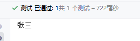

由于我们使用的是`Java`客户端来存储数据，因此`Redis`数据库中存储的实际数据并不一定是可见字符

> 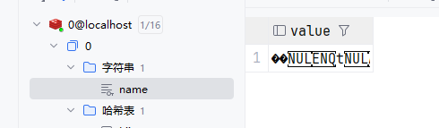

其本质原因是`Java`客户端在插入数据时会进行序列化来保留一定的数据信息，这些不可见字符就是数据的序列化属性，如果缺少这些信息，`Java`客户端就不能正常解析`Redis`数据库中的数据

> 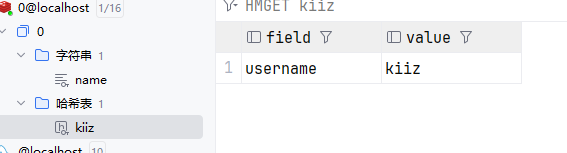

如上，我们在`Redis`中存储了一个`Hash`，键名为`username`，值为`kiiz`，然后在`Java`中尝试获取这个数据

```java
@Test
public void testRedisTemplate() {
    System.out.println("尝试获取kiiz -> username");
    System.out.println(redisTemplate.opsForHash().get("kiiz", "username"));
}
```

> 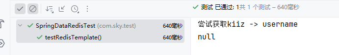

实际上`Java`获取的并不是`key`为`username`的值，而是`��username`的值，因此结果为`null`

### 店铺营业状态设置

依据`Redis`，我们就可以来实现店铺营业状态的设置逻辑，如果使用传统关系型数据库，用一张表存储一个营业状态字段会非常浪费资源，因此我们可以仅使用`Redis`中的一个字符串字段来存储

在`SpringBoot`项目中，`Redis`操作使用`Repository`类来操作，`Repository`类与`Service`相似，需要设计单独的接口类与实现类方便维护

`Controller`

```java
package com.sky.controller.admin;

import com.sky.result.Result;
import com.sky.service.ShopService;
import io.swagger.annotations.Api;
import io.swagger.annotations.ApiOperation;
import lombok.extern.slf4j.Slf4j;
import org.springframework.beans.factory.annotation.Autowired;
import org.springframework.web.bind.annotation.*;

@RestController
@RequestMapping("/admin/shop")
@Slf4j
@Api(tags = "店铺相关接口")
public class ShopController {

    @Autowired
    private ShopService shopService;

    /**
     * 修改店铺状态
     * @param status
     * @return
     */
    @PutMapping("/{status}")
    @ApiOperation("修改店铺状态")
    public Result<String> changeStatus(@PathVariable Integer status) {
        log.info("修改店铺状态：{}", status);
        shopService.changeStatus(status);
        return Result.success();
    }

    @GetMapping("/status")
    @ApiOperation("获取店铺状态")
    public Result<Integer> getStatus() {
        Integer status = shopService.getStatus();
        log.info("获取店铺状态：{}", status);
        return Result.success(status);
    }
}
```

`Service`

```java
package com.sky.service.impl;

import com.sky.constant.StatusConstant;
import com.sky.exception.BaseException;
import com.sky.exception.FormValueIsNullException;
import com.sky.exception.ShopStatusChangeFailedException;
import com.sky.exception.ShopStatusGetFailedException;
import com.sky.repository.ShopRepository;
import com.sky.service.ShopService;
import org.springframework.beans.factory.annotation.Autowired;
import org.springframework.stereotype.Service;
import com.sky.constant.MessageConstant;
import org.springframework.transaction.annotation.Transactional;

import java.util.Objects;

@Service
public class ShopServiceImpl implements ShopService {

    @Autowired
    private ShopRepository shopRepository;

    /**
     * 改变店铺状态
     *
     * @param status
     */
    @Override
    public void changeStatus(Integer status) {
        if (status == null || !Objects.equals(status, StatusConstant.ENABLE) && !Objects.equals(status, StatusConstant.DISABLE))
            throw new FormValueIsNullException(MessageConstant.STATUS_IS_NOT_DEFINED);
        Integer count = shopRepository.changeStatus(status);
        if (count == 0)
            throw new ShopStatusChangeFailedException(MessageConstant.SHOP_STATUS_CHANGE_FAILED);
    }

    /**
     * 获取店铺状态
     *
     * @return
     */
    @Override
    public Integer getStatus() {
        Integer status = shopRepository.getStatus();
        if (status == null || !Objects.equals(status, StatusConstant.ENABLE) && !Objects.equals(status, StatusConstant.DISABLE))
            throw new ShopStatusGetFailedException(MessageConstant.STATUS_IS_NOT_DEFINED);

        return status;
    }
}
```

`Repository`

```java
package com.sky.repository.impl;

import com.sky.repository.ShopRepository;
import org.springframework.beans.factory.annotation.Autowired;
import org.springframework.data.redis.core.RedisTemplate;
import org.springframework.data.redis.core.ValueOperations;
import org.springframework.stereotype.Repository;

import java.util.Objects;

@Repository
public class ShopRepositoryImpl implements ShopRepository {

    @Autowired
    private RedisTemplate redisTemplate;

    private static final String KEY_SHOP_STATUS = "SHOP:STATUS";

    /**
     * 改变店铺状态
     * @param status
     * @return
     */
    @Override
    public Integer changeStatus(Integer status) {
        ValueOperations ops = redisTemplate.opsForValue();
        ops.set(KEY_SHOP_STATUS, status);
        return Objects.equals(ops.get(KEY_SHOP_STATUS), status) ? 1 : 0;
    }

    /**
     * 获取店铺状态
     * @return
     */
    @Override
    public Integer getStatus() {
        ValueOperations ops = redisTemplate.opsForValue();
        return (Integer) ops.get(KEY_SHOP_STATUS);
    }
}
```

## HttpClient

`HttpClient`是`Apache Jakarta Common`下的子项目，可以用来提供高效的，最新的，功能丰富的支持`HTTP`协议的客户端编程工具包，并且支持`HTTP`协议最新版本和建议

### 快速入门

1. 引入依赖

```xml
<dependency>
    <groupId>org.apache.httpcomponents.client5</groupId>
    <artifactId>httpclient5</artifactId>
    <version>5.3</version>
</dependency>
```

2. 创建`HttpClient`实例

```java
package com.sky.test;

import org.apache.hc.client5.http.impl.classic.CloseableHttpClient;
import org.apache.hc.client5.http.impl.classic.HttpClients;
import org.junit.jupiter.api.Test;
import org.springframework.boot.test.context.SpringBootTest;

@SpringBootTest
public class HttpClientTest {

    @Test
    public void test1() {
        // 创建HttpClient对象
        CloseableHttpClient httpClient = HttpClients.createDefault();
    }
}
```

3. 在`HttpClient`中，每个请求类型对应不同的请求对象类型，这里我们创建一个`GET`请求

```java
package com.sky.test;

import org.apache.hc.client5.http.classic.methods.HttpGet;
import org.apache.hc.client5.http.impl.classic.CloseableHttpClient;
import org.apache.hc.client5.http.impl.classic.HttpClients;
import org.junit.jupiter.api.Test;
import org.springframework.boot.test.context.SpringBootTest;

@SpringBootTest
public class HttpClientTest {

    @Test
    public void test1() {
        // 创建HttpClient对象
        CloseableHttpClient httpClient = HttpClients.createDefault();
        // 创建GET请求对象
        HttpGet httpGet = new HttpGet("http://localhost:8080/user/shop/status");
    }
}
```

4. 调用`execute`方法发送请求，并接收响应

```java
package com.sky.test;

import org.apache.hc.client5.http.classic.methods.HttpGet;
import org.apache.hc.client5.http.impl.classic.CloseableHttpClient;
import org.apache.hc.client5.http.impl.classic.CloseableHttpResponse;
import org.apache.hc.client5.http.impl.classic.HttpClients;
import org.apache.hc.core5.http.HttpEntity;
import org.apache.hc.core5.http.io.entity.EntityUtils;
import org.junit.jupiter.api.Test;
import org.springframework.boot.test.context.SpringBootTest;

import java.io.IOException;

@SpringBootTest
public class HttpClientTest {

    @Test
    public void test1() throws Exception {
        // 创建HttpClient对象
        CloseableHttpClient httpClient = HttpClients.createDefault();
        // 创建GET请求对象
        HttpGet httpGet = new HttpGet("http://localhost:8080/user/shop/status");
        // 发送GET请求，并获取响应
        CloseableHttpResponse response = httpClient.execute(httpGet);
        HttpEntity entity = response.getEntity();
        System.out.println(EntityUtils.toString(entity));
    }
}
```

5. 最后释放所有资源

```java
package com.sky.test;

import org.apache.hc.client5.http.classic.methods.HttpGet;
import org.apache.hc.client5.http.impl.classic.CloseableHttpClient;
import org.apache.hc.client5.http.impl.classic.CloseableHttpResponse;
import org.apache.hc.client5.http.impl.classic.HttpClients;
import org.apache.hc.core5.http.HttpEntity;
import org.apache.hc.core5.http.io.entity.EntityUtils;
import org.junit.jupiter.api.Test;
import org.springframework.boot.test.context.SpringBootTest;

import java.io.IOException;

@SpringBootTest
public class HttpClientTest {

    @Test
    public void test1() throws Exception {
        // 创建HttpClient对象
        CloseableHttpClient httpClient = HttpClients.createDefault();
        // 创建GET请求对象
        HttpGet httpGet = new HttpGet("http://localhost:8080/user/shop/status");
        // 发送GET请求，并获取响应
        CloseableHttpResponse response = httpClient.execute(httpGet);
        HttpEntity entity = response.getEntity();
        System.out.println(EntityUtils.toString(entity));

        // 释放资源
        response.close();
        httpClient.close();
    }
}
```

> 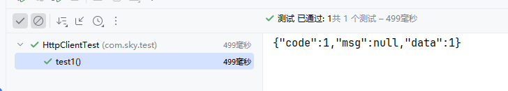

### 微信登录功能

微信官方提供了小程序登录的时序图

> 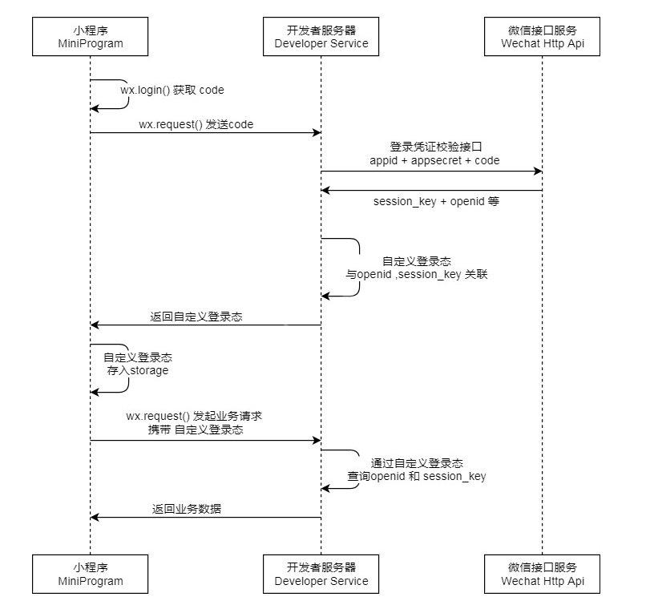

开发者服务器即是我们自己的后端服务器，从图中可以看出，后端需要实现的逻辑是接收小程序发来的`code`，然后转发到微信接口服务，后端从接口服务得到`session_key`和`openid`，再返回到小程序中，最后小程序携带自定义的登录状态请求后端服务器，后端根据自定义登录态进行确认即可

接着我们来测试微信接口服务，在`Postman`中输入官方接口`https://api.weixin.qq.com/sns/jscode2session`，然后填入必要的参数

| 参数名       | 类型     | 必填 | 说明                                            |
| :----------- | :------- | :--- | :---------------------------------------------- |
| `appid`      | `string` | 是   | 小程序 `appId`                                  |
| `secret`     | `string` | 是   | 小程序 `appSecret`                              |
| `js_code`    | `string` | 是   | 登录时获取的 `code`，可通过`wx.login()`方法获取 |
| `grant_type` | `string` | 是   | 授权类型，此处只需填写 `authorization_code`     |

然后我们使用自己的信息发送请求

> 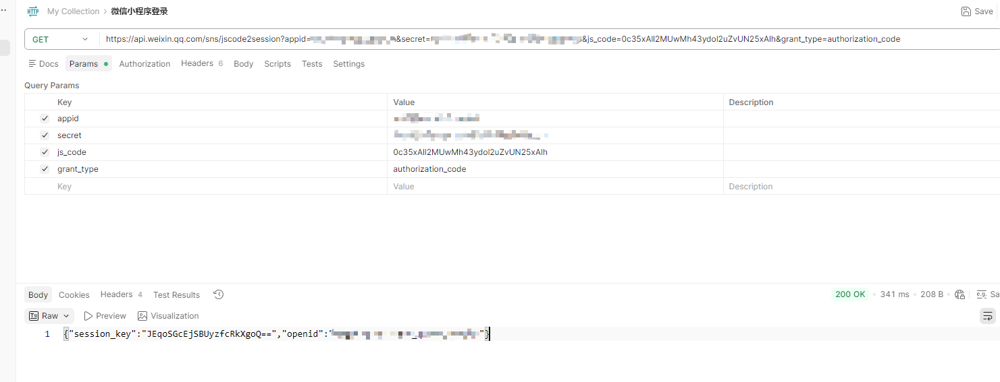

可以看到，成功返回了`session_key`和`openid`

接着我们就可以根据开发文档来编写小程序登录的逻辑，首先定义`Controller`，请求路径为`/user/user`

```java
package com.sky.controller.user;

import com.sky.dto.UserLoginDTO;
import com.sky.result.Result;
import com.sky.service.UserService;
import com.sky.vo.UserLoginVO;
import io.swagger.annotations.Api;
import io.swagger.annotations.ApiOperation;
import lombok.extern.slf4j.Slf4j;
import org.springframework.beans.factory.annotation.Autowired;
import org.springframework.web.bind.annotation.PostMapping;
import org.springframework.web.bind.annotation.RequestBody;
import org.springframework.web.bind.annotation.RequestMapping;
import org.springframework.web.bind.annotation.RestController;

@RestController
@RequestMapping("/user/user")
@Slf4j
@Api(tags = "C端用户接口")
public class UserController {

    @Autowired
    private UserService userService;

    /**
     * 登录
     *
     * @param userLoginDTO
     * @return
     */
    @PostMapping("/login")
    @ApiOperation("C端用户登录")
    public Result<UserLoginVO> login(@RequestBody UserLoginDTO userLoginDTO) {
        log.info("用户登录，微信授权码:{}", userLoginDTO);
        UserLoginVO userLoginVO = userService.login(userLoginDTO);
        return Result.success(userLoginVO);
    }
}
```

然后在`Service`中，首先进行参数校验，接着通过`WeChatLoginUtil`向微信开放平台的登录接口发送请求，在接收到数据后进行校验，如果为空则表示登录失败。然后在数据库中查询`openid`所属的用户是否存在，不存在则创建一个新账户。最后根据用户`id`以及`openid`生成`jwt`令牌，返回给微信小程序

```java
package com.sky.service.impl;

import com.sky.constant.JwtClaimsConstant;
import com.sky.constant.MessageConstant;
import com.sky.dto.UserLoginDTO;
import com.sky.entity.User;
import com.sky.exception.BaseException;
import com.sky.exception.CannotGetOpenIdException;
import com.sky.exception.FormValueIsNullException;
import com.sky.exception.LoginFailedException;
import com.sky.mapper.UserMapper;
import com.sky.properties.JwtProperties;
import com.sky.service.UserService;
import com.sky.utils.JwtUtil;
import com.sky.utils.WeChatLoginUtil;
import com.sky.vo.UserLoginVO;
import org.springframework.beans.factory.annotation.Autowired;
import org.springframework.stereotype.Service;
import org.springframework.transaction.annotation.Transactional;

import java.time.LocalDateTime;
import java.util.HashMap;
import java.util.Map;

@Service
public class UserServiceImpl implements UserService {

    @Autowired
    private UserMapper userMapper;

    @Autowired
    private WeChatLoginUtil weChatLoginUtil;

    @Autowired
    private JwtProperties jwtProperties;

    /**
     * 用户登录
     * @param userLoginDTO
     * @return
     */
    @Override
    @Transactional(rollbackFor = BaseException.class)
    public UserLoginVO login(UserLoginDTO userLoginDTO) {
        // 参数校验
        String code = userLoginDTO.getCode();
        if (code == null)
            throw new FormValueIsNullException(MessageConstant.LOGIN_CODE_IS_NULL);
        if (code.length() != 32 && !code.startsWith("0"))
            throw new FormValueIsNullException(MessageConstant.LOGIN_CODE_FORMATE_ERROR);

        // 获取openid
        String openid = weChatLoginUtil.getOpenId(code);
        if (openid == null)
            throw new LoginFailedException(MessageConstant.LOGIN_FAILED);

        // 判断是否为新用户
        User user = userMapper.getByOpenid(openid);
        // 新用户完成自动注册
        if (user == null) {
            user = User.builder()
                    .openid(openid)
                    .createTime(LocalDateTime.now())
                    .build();
            Integer count = userMapper.add(user);
            if (count <= 0)
                throw new LoginFailedException(MessageConstant.LOGIN_FAILED);
        }

        // 创建jwt令牌
        Map<String, Object> userClaim = new HashMap<>();
        userClaim.put(JwtClaimsConstant.USER_ID, user.getId());
        userClaim.put(jwtProperties.getUserTokenName(), openid);
        String token = JwtUtil.createJWT(
                jwtProperties.getUserSecretKey(),
                jwtProperties.getUserTtl(),
                userClaim);

        return UserLoginVO.builder()
                .id(user.getId())
                .openid(openid)
                .token(token)
                .build();
    }
}
```

## 缓存

现在我们已经完成了用户端和管理端的基础功能实现，但是目前仍然存在一定的问题，当请求人数过多时，`MySQL`数据库的每次请求都会造成大量的性能开销，可能会导致用户在点击页面后，后台执行两三秒才返回数据，对于用户而言，这样的体验是灾难级的，因此我们需要利用缓存来改善用户体验

根据我们目前的程序设计，用户通过小程序登陆后，首先需要加载所有的分类信息

我们来改造`Service`，在数据库查询之前首先查询缓存，然后判断缓存中是否存在数据，如果不存在，再查询数据库，并将数据添加到缓存中

`Service`

```java
@Override
public List<Category> list(Integer type) {
    // 查询缓存
    List<Category> list = categoryRepository.getCategoryCache(type);
    // 缓存中存在数据，直接返回
    if (list != null && !list.isEmpty()) {
        log.info("查询缓存成功：{}", list);
        return list;
    }
    // 缓存中没有数据，查询数据库
    list =  categoryMapper.list(type);
    // 缓存数据
    categoryRepository.addCategoryCache(list);
    return list;
}
```

新建一个`CategoryRepository`，用户操作`Redis`

```java
package com.sky.repository.impl;

import com.sky.entity.Category;
import com.sky.repository.CategoryRepository;
import org.springframework.beans.factory.annotation.Autowired;
import org.springframework.data.redis.core.RedisTemplate;
import org.springframework.data.redis.core.ValueOperations;
import org.springframework.stereotype.Repository;

import java.util.List;
import java.util.Objects;

@Repository
public class CategoryRepositoryImpl implements CategoryRepository {

    @Autowired
    private RedisTemplate redisTemplate;

    private static final String KEY_CATEGORY_LIST = "CATEGORY:LIST";

    /**
     * 查询分类缓存
     * @param type
     * @return
     */
    @Override
    public List<Category> getCategoryCache(Integer type) {
        ValueOperations ops = redisTemplate.opsForValue();
        // 查询所有缓存
        List<Category> list = (List<Category>) ops.get(KEY_CATEGORY_LIST);
        // 筛选指定类型的缓存
        if (type != null) {
            list.removeIf(category -> !Objects.equals(category.getType(), type));
        }
        return list;
    }


    /**
     * 添加分类缓存
     * @param list
     */
    @Override
    public void addCategoryCache(List<Category> list) {
        ValueOperations ops = redisTemplate.opsForValue();
        // 添加缓存
        ops.set(KEY_CATEGORY_LIST, list);
    }
}
```

现在来进行实际测试，第二次查询中可以看到已经从缓存中获取了数据

> 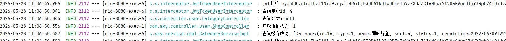

但是现在会存在一个问题，假设我们在后台对分类进行更改，例如禁用`蜀味烤鱼`分类

> 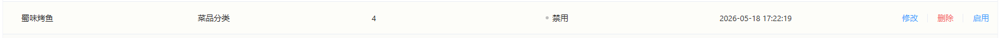

但是用户端仍然能够访问，并且获取其中的内容

> 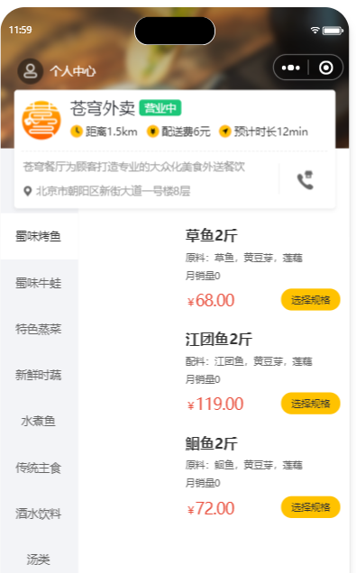

本质原因在于缓存中的数据与数据库中的数据不同步，我们更新了数据库中的数据，但是缓存数据并没有更新。最直接的解决方法就是在每次数据库操作后，同步删除对应的缓存数据，只有当用户再进行一次查询时，才生成新的缓存数据

这里我们定义了一个切面类，专门用于缓存操作，同时定义了缓存操作方法枚举类，用于指定缓存操作类型

`CacheOperationType`

```java
package com.sky.enumeration;

public enum CacheOperationType {
    /**
     * 新增缓存
     */
    INSERT,
    /**
     * 删除缓存
     */
    DELETE
}
```

`CacheOperationAspect`

```java
package com.sky.aspect;

import com.sky.annotation.Cache;
import com.sky.enumeration.CacheOperationType;
import lombok.extern.slf4j.Slf4j;
import org.aspectj.lang.JoinPoint;
import org.aspectj.lang.annotation.After;
import org.aspectj.lang.annotation.AfterReturning;
import org.aspectj.lang.annotation.Aspect;
import org.aspectj.lang.annotation.Pointcut;
import org.aspectj.lang.reflect.MethodSignature;
import org.springframework.beans.factory.annotation.Autowired;
import org.springframework.data.redis.core.RedisTemplate;
import org.springframework.stereotype.Component;

import java.util.Objects;

@Aspect
@Slf4j
@Component
public class CacheOperationAspect {

    @Autowired
    private RedisTemplate redisTemplate;

    @Pointcut("execution(* com.sky.service.impl.*.*(..)) && @annotation(com.sky.annotation.Cache)")
    public void cacheOperation() {}

    @AfterReturning(pointcut = "cacheOperation()", returning = "result")
    public void cacheOperation(JoinPoint joinPoint, Object result) {
        log.info("开始进行缓存操作");
        // 获取缓存操作类型
        MethodSignature signature = (MethodSignature) joinPoint.getSignature();
        Cache annotation = signature.getMethod().getAnnotation(Cache.class);
        if (annotation == null) {
            return;
        }
        CacheOperationType cacheOperationType = annotation.cacheOperationType();
        // 获取缓存的key
        String cacheKey = annotation.cacheKey();
        log.info("缓存操作类型：{}，缓存的key：{}", cacheOperationType, cacheKey);

        if (Objects.equals(cacheOperationType, CacheOperationType.INSERT)) {
            log.info("缓存新增数据：{}", result.toString());
            // 缓存数据
            redisTemplate.opsForValue().set(cacheKey, result);
        } else if (Objects.equals(cacheOperationType, CacheOperationType.DELETE)) {
            log.info("缓存删除数据");
            // 删除缓存
            redisTemplate.delete(cacheKey);
        }
    }
}
```

简单解释一下切面类，切入点设置为所有`Service`中带有`@Cache`注解的方法，这里不能切入`Mapper`，因为`Mapper`返回的数据可能在`Service`中还会进行一些处理。通知类型为后置通知，而且是增强的`@AfterReturning`，在成功方法返回后才更新缓存，保证`Service`中抛出异常时，缓存不会继续更新

接着就是通知逻辑，首先获取缓存的操作类型，第一次查询操作时应当增加缓存，数据库变动时应当删除缓存。从`@Cache`注解中获取缓存`key`，然后调用`RedisTemplate`进行缓存操作

### Spring Cache

`Spring Cache`是`Spring`框架中提供的一套缓存框架，可以让开发者通过注解的方式来简化缓存操作，提高开发效率

`Spring Cache`提供了一层抽象，底层可以切换不同的缓存实现，兼容主流缓存方案，如`EHCache`、`Caffeine`、`Redis`等

### Spring Cache 快速入门

1. 引入依赖

`Spring Cache`会自动识别当前项目中使用的缓存方案，无需手动配置

```xml
<dependency>
    <groupId>org.springframework.boot</groupId>
    <artifactId>spring-boot-starter-cache</artifactId>
</dependency>
```

2. 常用注解

| 注解             | 说明                                                         |
| ---------------- | ------------------------------------------------------------ |
| `@EnableCaching` | 开启缓存注解功能，通常注解在启动类上                         |
| `@Cacheable`     | 在方法执行前自动查询缓存中是否有数据，如果有，则直接返回缓存数据；如果没有，则调用方法，并将方法返回值添加到缓存中 |
| `@CachePut`      | 将方法返回值增加到缓存中                                     |
| `@CacheEvict`    | 将一条或多条数据从缓存中删除                                 |

**@CachePut**

`@CachePut`注解可以将方法的返回值添加到缓存中，通过`cacheNames`来设置缓存名称，`key`来设置键名。注意，存储在`Redis`中的键名并不是`key`，而是`cacheNames::key`，例如

```java
@CachePut(cacheNames = "userCache", key = "1")
```

`Redis`中保存的实际键名为`userCache::1`。`key`不仅可以是字符串，还可以是`SpEL`表达式，`Spring Expression Language`，简称`SpEL`，是`Spring`框架提供的一种表达式，支持属性访问、方法调用、运算符、条件判断等等，在这里可以用于获取方法返回值对象中的某些属性，用于构建`key`

```java
@CachePut(cacheNames = "userCache", key = "#user.id")
```

`SpEL`表达式以井号`#`开头，可以拼接一个参数名，如上，使用`.`来访问对象属性，同时支持`?`安全导航操作符来确保不会抛出空指针异常。`SpEL`还支持使用使用关键字来访问特定元素，如`#result`可以直接访问方法返回值，`#p0`、`#a0`访问参数列表，`#root`访问注解操作对象，例如在方法上则是指方法本身，使用`#root.args[0]`来访问第一个参数

**@Cacheable**

`@Cacheable`与`@CachePut`类似，但是在表达式中无法使用`#result`来获取返回值，因为`@Cacheable`会在缓存查询失败后自动将方法返回值存入缓存中

```java
@Override
@Cacheable(cacheNames = "CATEGORY", key = "'LIST'")
public List<Category> list(Integer type) {
    return categoryMapper.list(type);
}
```

上文的代码中，我们为`CategoryService`的`list`方法添加了`@Cacheable`注解，当用户请求分类列表时，就会优先在`Redis`中查找，然后再调用数据库。需要注意，如果缓存中存在对应的数据，`list`方法根本不会执行，因为`Spring Cache`底层使用了动态代理技术，创建一个代理类先执行`Redis`缓存查询操作，只有当结果为空时，才会调用`list`方法，否则代理类就会直接返回数据

### 菜品和套餐缓存

现在我们来利用`Spring Cache`实现分类、套餐和菜品的缓存逻辑，但是需要注意并不是所有的方法都需要添加注解，我们只对用户端调用的查询方法新增缓存，仅管理端调用的方法无需缓存，因为需要确保管理端对数据的精确控制。在所有的数据库操作方法上添加删除缓存的注解，根据接收的参数类型来决定是否能够使用约束，当参数无法约束指定缓存数据时，直接删除整个缓存键

因为代码量太多，这里仅展示哪些方法需要添加注解

`CategoryServiceImpl`

```java
/**
 * 修改分类
 * @param categoryDTO
 */
@Override
@CacheEvict(cacheNames = "categoryCache", key = "'list'")
public void update(CategoryDTO categoryDTO) {}

/**
 * 修改分类状态
 * @param status
 * @param id
 */
@Override
@CacheEvict(cacheNames = "categoryCache", key = "'list'")
public void changeStatus(Integer status, Long id) {}
    
/**
 * 新增分类
 * @param categoryDTO
 */
@Override
@CacheEvict(cacheNames = "categoryCache", key = "'list'")
public void add(CategoryDTO categoryDTO) {}

/**
 * 删除分类
 * @param id
 */
@Override
@CacheEvict(cacheNames = "categoryCache", key = "'list'")
public void delete(Long id) {}

 /**
 * 根据类型查询
 * @param type
 * @return
 */
@Override
@Cacheable(cacheNames = "categoryCache", key = "'list'")
public List<Category> list(Integer type) {}
```

`DishServiceImpl`

```java
/**
 * 根据分类id查询菜品
 * @param categoryId
 * @return
 */
@Override
@Cacheable(cacheNames = "dishCache", key = "'categoryId:' + #categoryId")
public List<DishVO> list(Long categoryId) {}

/**
 * 菜品状态更改
 * @param status
 * @param id
 * @return
 */
@Override
@CacheEvict(cacheNames = "dishCache", allEntries = true)
public void changeStatus(Integer status, Long id) {}

/**
 * 新增菜品
 * @param dishDTO
 */
@Override
@Transactional(rollbackFor = BaseException.class)
@CacheEvict(cacheNames = "dishCache", key = "'categoryId:' + #dishDTO.categoryId")
public void add(DishDTO dishDTO) {}

/**
 * 批量删除菜品
 * @param ids
 */
@Override
@Transactional(rollbackFor = BaseException.class)
@CacheEvict(cacheNames = "dishCache", allEntries = true)
public void delete(Long[] ids) {}

 /**
 * 修改菜品
 * @param dishDTO
 */
@Override
@Transactional(rollbackFor = BaseException.class)
@CacheEvict(cacheNames = "dishCache", key = "'categoryId:' + #dishDTO.categoryId")
public void update(DishDTO dishDTO) {}
```

`SetMealServiceImpl`

```java
/**
 * 新增套餐，同时需要保存套餐和菜品的关联关系
 * @param setmealDTO
 */
@Override
@Transactional
@CacheEvict(value = "setmealCache", allEntries = true)
public void saveWithDish(SetmealDTO setmealDTO) {}

/**
 * 批量删除套餐
 * @param ids
 */
@Override
@Transactional
@CacheEvict(value = "setmealCache", allEntries = true)
public void deleteBatch(List<Long> ids) {}

/**
 * 修改套餐
 *
 * @param setmealDTO
 */
@Override
@Transactional
@CacheEvict(value = "setmealCache", allEntries = true)
public void update(SetmealDTO setmealDTO) {}

 /**
 * 套餐起售、停售
 * @param status
 * @param id
 */
@Override
@CacheEvict(value = "setmealCache", allEntries = true)
public void startOrStop(Integer status, Long id) {}

 /**
 * 根据分类id查询套餐
 * @param categoryId
 * @return
 */
@Override
@Cacheable(cacheNames = "setmealCache", key = "'categoryId:' + #categoryId")
public List<SetmealVO> getByCategoryId(Long categoryId) {}

/**
 * 根据套餐id查询套餐菜品关系
 * @param id
 * @return
 */
@Override
@Cacheable(cacheNames = "setmealCache", key = "'setMealId:' + #id")
public List<SetmealDish> getSetmealDishList(Long id) {}
```

## 购物车

购物车的实现逻辑不需要新的技术，最主要的难点是业务逻辑，安插在此处作为`Spring`基本功的练习

`Controller`

```java
package com.sky.controller.user;

import com.sky.dto.ShoppingCartDTO;
import com.sky.entity.ShoppingCart;
import com.sky.result.Result;
import com.sky.service.ShoppingCartService;
import io.swagger.annotations.Api;
import io.swagger.annotations.ApiOperation;
import lombok.extern.slf4j.Slf4j;
import org.springframework.beans.factory.annotation.Autowired;
import org.springframework.web.bind.annotation.*;

import java.util.List;

@RestController
@RequestMapping("/user/shoppingCart")
@Api(tags = "C端-购物车接口")
@Slf4j
public class ShoppingCartController {

    @Autowired
    private ShoppingCartService shoppingCartService;

    /**
     * 添加购物车
     *
     * @param shoppingCartDTO
     * @return
     */
    @PostMapping("/add")
    @ApiOperation("添加购物车")
    public Result<String> add(@RequestBody ShoppingCartDTO shoppingCartDTO) {
        log.info("添加购物车：{}", shoppingCartDTO);
        shoppingCartService.add(shoppingCartDTO);
        return Result.success();
    }

    /**
     * 查看购物车
     *
     * @return 购物车数据
     */
    @GetMapping("/list")
    @ApiOperation("查看购物车")
    public Result<List<ShoppingCart>> list() {
        log.info("查看购物车");
        List<ShoppingCart> list = shoppingCartService.list();
        return Result.success(list);
    }

    /**
     * 删除一个购物车中的数据
     *
     * @param shoppingCartDTO
     * @return
     */
    @PostMapping("/sub")
    @ApiOperation("删除一个购物车中的数据")
    public Result<String> sub(@RequestBody ShoppingCartDTO shoppingCartDTO) {
        log.info("删除购物车数据：{}", shoppingCartDTO);
        shoppingCartService.sub(shoppingCartDTO);
        return Result.success();
    }

    @DeleteMapping("/clean")
    @ApiOperation("清空购物车")
    public Result<String> clean() {
        log.info("清空购物车");
        shoppingCartService.clean();
        return Result.success();
    }
}
```

`Service`

```java
package com.sky.service.impl;

import com.sky.context.BaseContext;
import com.sky.dto.ShoppingCartDTO;
import com.sky.entity.ShoppingCart;
import com.sky.exception.*;
import com.sky.mapper.ShoppingCartMapper;
import com.sky.service.DishService;
import com.sky.service.SetMealService;
import com.sky.service.ShoppingCartService;
import com.sky.vo.DishVO;
import com.sky.vo.SetmealVO;
import org.springframework.beans.factory.annotation.Autowired;
import org.springframework.stereotype.Service;
import com.sky.constant.MessageConstant;
import org.springframework.transaction.annotation.Transactional;

import java.math.BigDecimal;
import java.time.LocalDateTime;
import java.util.List;

@Service
public class ShoppingCartServiceImpl implements ShoppingCartService {

    @Autowired
    private ShoppingCartMapper shoppingCartMapper;
    @Autowired
    private DishService dishService;
    @Autowired
    private SetMealService setMalService;

    /**
     * 添加购物车
     * @param shoppingCartDTO
     */
    @Override
    @Transactional(rollbackFor = BaseException.class)
    public void add(ShoppingCartDTO shoppingCartDTO) {
        Long dishId = shoppingCartDTO.getDishId();
        Long setMealId = shoppingCartDTO.getSetmealId();
        String dishFlavor = shoppingCartDTO.getDishFlavor();

        if (dishId == null && setMealId == null && dishFlavor == null)
            throw new FormValueIsNullException(MessageConstant.SHOPPING_CART_FORM_IS_NULL);
        if (dishId != null && setMealId != null)
            throw new ShoppingCartFormCollisionException(MessageConstant.SHOPPING_CART_FORM_IS_COLLISION);

        Long userId = BaseContext.getCurrentId();
        if (userId == null)
            throw new UserRecognitionFailedException(MessageConstant.CANNOT_RECOGNIZE_USER);

        ShoppingCart cart = ShoppingCart
                .builder()
                .userId(userId)
                .dishId(dishId)
                .setmealId(setMealId)
                .dishFlavor(dishFlavor)
                .build();

        // 判断该菜品是否在购物车中
        cart = shoppingCartMapper.getByIdAndFlavor(cart);
        if (cart != null) {
            // 如果在当前购物车中，则添加数量
            cart.setNumber(cart.getNumber() + 1);
            Integer count = shoppingCartMapper.update(cart);
            if (count == 0)
                throw new ShoppingCartUpdateFailedException(MessageConstant.SHOPPING_CART_UPDATE_FAILED);
        } else {
            // 如果不在当前购物车中，则添加购物车
            // 判断是否为菜品
            if (dishId != null) {
                // 如果为菜品
                DishVO dish = dishService.getById(dishId);
                cart = ShoppingCart.builder()
                        .userId(userId)
                        .name(dish.getName())
                        .image(dish.getImage())
                        .dishId(dishId)
                        .dishFlavor(dishFlavor)
                        .number(1)
                        .amount(dish.getPrice())
                        .createTime(LocalDateTime.now())
                        .build();
                Integer count = shoppingCartMapper.add(cart);
                if (count == 0)
                    throw new ShoppingCartAddFailedException(MessageConstant.SHOPPING_CART_ADD_FAILED);
            } else {
                // 如果为套餐
                SetmealVO setMeal = setMalService.getByIdWithDish(setMealId);
                cart = ShoppingCart.builder()
                        .userId(userId)
                        .name(setMeal.getName())
                        .image(setMeal.getImage())
                        .setmealId(setMealId)
                        .number(1)
                        .amount(setMeal.getPrice())
                        .createTime(LocalDateTime.now())
                        .build();
                Integer count = shoppingCartMapper.add(cart);
                if (count == 0)
                    throw new ShoppingCartAddFailedException(MessageConstant.SHOPPING_CART_ADD_FAILED);
            }
        }
    }

    /**
     * 查看购物车
     * @return
     */
    @Override
    public List<ShoppingCart> list() {
        Long userId = BaseContext.getCurrentId();
        if (userId == null)
            throw new UserRecognitionFailedException(MessageConstant.CANNOT_RECOGNIZE_USER);

        return shoppingCartMapper.getByUserId(userId);
    }

    /**
     * 删除一个购物车中的数据
     * @param shoppingCartDTO
     */
    @Override
    @Transactional(rollbackFor = BaseException.class)
    public void sub(ShoppingCartDTO shoppingCartDTO) {
        Long dishId = shoppingCartDTO.getDishId();
        Long setMealId = shoppingCartDTO.getSetmealId();
        String dishFlavor = shoppingCartDTO.getDishFlavor();

        if (dishId == null && setMealId == null && dishFlavor == null)
            throw new FormValueIsNullException(MessageConstant.SHOPPING_CART_FORM_IS_NULL);
        if (dishId != null && setMealId != null)
            throw new ShoppingCartFormCollisionException(MessageConstant.SHOPPING_CART_FORM_IS_COLLISION);

        Long userId = BaseContext.getCurrentId();
        if (userId == null)
            throw new UserRecognitionFailedException(MessageConstant.CANNOT_RECOGNIZE_USER);

        ShoppingCart cart = ShoppingCart
                .builder()
                .userId(userId)
                .dishId(dishId)
                .setmealId(setMealId)
                .dishFlavor(dishFlavor)
                .build();

        cart = shoppingCartMapper.getByIdAndFlavor(cart);

        if (cart == null || cart.getId() == null)
            throw new ShoppingCartNotFoundException(MessageConstant.SHOPPING_CART_NOT_FOUND);

        // 如果只有一个商品，则删除
        if (cart.getNumber() == 1) {
            Integer count = shoppingCartMapper.sub(cart);
            if (count == 0)
                throw new ShoppingCartUpdateFailedException(MessageConstant.SHOPPING_CART_UPDATE_FAILED);
            return;
        }
        // 如果有多个商品，则减1
        cart.setNumber(cart.getNumber() - 1);
        Integer count = shoppingCartMapper.update(cart);
        if (count == 0)
            throw new ShoppingCartUpdateFailedException(MessageConstant.SHOPPING_CART_UPDATE_FAILED);
    }

    /**
     * 清空购物车
     */
    @Override
    @Transactional(rollbackFor = BaseException.class)
    public void clean() {
        Long userId = BaseContext.getCurrentId();
        if (userId == null)
            throw new UserRecognitionFailedException(MessageConstant.CANNOT_RECOGNIZE_USER);

        Integer count = shoppingCartMapper.clean(userId);
        if (count == 0)
            throw new ShoppingCartCleanFailedException(MessageConstant.SHOPPING_CART_CLEAN_FAILED);
    }
}
```

`Mapper`

```java
package com.sky.mapper;

import com.sky.entity.ShoppingCart;
import org.apache.ibatis.annotations.Delete;
import org.apache.ibatis.annotations.Mapper;
import org.apache.ibatis.annotations.Select;

import java.util.List;

@Mapper
public interface ShoppingCartMapper {

    /**
     * 更新购物车数据
     * @param cart
     */
    Integer update(ShoppingCart cart);

    /**
     * 根据菜品id、套餐id、口味、用户id查询购物车数据
     * @param cart
     * @return
     */
    ShoppingCart getByIdAndFlavor(ShoppingCart cart);

    /**
     * 添加购物车数据
     * @param cart
     * @return
     */
    Integer add(ShoppingCart cart);

    /**
     * 根据用户id查询购物车数据
     * @param userId
     * @return
     */
    List<ShoppingCart> getByUserId(Long userId);

    /**
     * 删除一个购物车数据
     * @param cart
     * @return
     */
    Integer sub(ShoppingCart cart);

    /**
     * 清空购物车
     * @param userId
     * @return
     */
    @Delete("delete from shopping_cart where user_id = #{userId}")
    Integer clean(Long userId);
}
```

`Mapper.xml`

```xml
<?xml version="1.0" encoding="UTF-8" ?>
<!DOCTYPE mapper
        PUBLIC "-//mybatis.org//DTD Mapper 3.0//EN"
        "http://mybatis.org/dtd/mybatis-3-mapper.dtd">
<mapper namespace="com.sky.mapper.ShoppingCartMapper">
<!--   添加购物车-->
    <insert id="add">
        INSERT INTO
            shopping_cart(name, image, user_id, dish_id, setmeal_id, dish_flavor, number, amount, create_time)
        VALUES (#{name}, #{image}, #{userId}, #{dishId}, #{setmealId}, #{dishFlavor}, #{number}, #{amount}, #{createTime})
    </insert>
    <!--    更新购物车数据-->
    <update id="update">
        UPDATE shopping_cart
        <set>
            <if test="number != null">
                number = #{number},
            </if>
            <if test="amount != null">
                amount = #{amount},
            </if>
            <if test="name != null">
                name = #{name},
            </if>
            <if test="image != null">
                image = #{image},
            </if>
        </set>
        WHERE id = #{id}
    </update>
<!--    删除一个购物车数据-->
    <delete id="sub">
        DELETE FROM
            shopping_cart
        WHERE
            id = #{id}
    </delete>
    <!--    根据菜品id、套餐id、口味、用户id查询购物车数据-->
    <select id="getByIdAndFlavor" resultType="com.sky.entity.ShoppingCart">
        SELECT
            *
        FROM
            shopping_cart
        <where>
            <if test="dishId != null">
                AND dish_id = #{dishId}
            </if>
            <if test="setmealId != null">
                AND setmeal_id = #{setmealId}
            </if>
            <if test="dishFlavor != null">
                AND dish_flavor = #{dishFlavor}
            </if>
            <if test="userId != null">
                AND user_id = #{userId}
            </if>
        </where>
        LIMIT 1
    </select>
<!--    根据用户id查询购物车数据-->
    <select id="getByUserId" resultType="com.sky.entity.ShoppingCart">
        SELECT
            *
        FROM
            shopping_cart
        WHERE
            user_id = #{userId}
    </select>

</mapper>
```

## 用户下单

用户下单是一个比较复杂的逻辑，我们先来根据用户行为，模拟一次用户下单行为。

首先，用户将选择好的商品添加到购物车中，这部分的代码在上文中已经实现，接着用户点击`去结算`按钮，跳转到提交订单页面，在提交订单页面，用户可以操作的行为有`选择地址`、`选择配送时间`、`添加备注`、`选择餐具数量`，这部分的代码我们暂未实现，然后用户点击`去支付`跳转到支付页面，这里实际上已经完成了下单操作，支付状态并不属于订单逻辑范围。

`选择地址`接口已经编写完成，我们直接导入即可

`AddressBookController`

```java
package com.sky.controller.user;

import com.sky.context.BaseContext;
import com.sky.entity.AddressBook;
import com.sky.result.Result;
import com.sky.service.AddressBookService;
import io.swagger.annotations.Api;
import io.swagger.annotations.ApiOperation;
import org.springframework.beans.factory.annotation.Autowired;
import org.springframework.web.bind.annotation.*;
import java.util.List;

@RestController
@RequestMapping("/user/addressBook")
@Api(tags = "C端地址簿接口")
public class AddressBookController {

    @Autowired
    private AddressBookService addressBookService;

    /**
     * 查询当前登录用户的所有地址信息
     *
     * @return
     */
    @GetMapping("/list")
    @ApiOperation("查询当前登录用户的所有地址信息")
    public Result<List<AddressBook>> list() {
        AddressBook addressBook = new AddressBook();
        addressBook.setUserId(BaseContext.getCurrentId());
        List<AddressBook> list = addressBookService.list(addressBook);
        return Result.success(list);
    }

    /**
     * 新增地址
     *
     * @param addressBook
     * @return
     */
    @PostMapping
    @ApiOperation("新增地址")
    public Result save(@RequestBody AddressBook addressBook) {
        addressBookService.save(addressBook);
        return Result.success();
    }

    @GetMapping("/{id}")
    @ApiOperation("根据id查询地址")
    public Result<AddressBook> getById(@PathVariable Long id) {
        AddressBook addressBook = addressBookService.getById(id);
        return Result.success(addressBook);
    }

    /**
     * 根据id修改地址
     *
     * @param addressBook
     * @return
     */
    @PutMapping
    @ApiOperation("根据id修改地址")
    public Result update(@RequestBody AddressBook addressBook) {
        addressBookService.update(addressBook);
        return Result.success();
    }

    /**
     * 设置默认地址
     *
     * @param addressBook
     * @return
     */
    @PutMapping("/default")
    @ApiOperation("设置默认地址")
    public Result setDefault(@RequestBody AddressBook addressBook) {
        addressBookService.setDefault(addressBook);
        return Result.success();
    }

    /**
     * 根据id删除地址
     *
     * @param id
     * @return
     */
    @DeleteMapping
    @ApiOperation("根据id删除地址")
    public Result deleteById(Long id) {
        addressBookService.deleteById(id);
        return Result.success();
    }

    /**
     * 查询默认地址
     */
    @GetMapping("default")
    @ApiOperation("查询默认地址")
    public Result<AddressBook> getDefault() {
        //SQL:select * from address_book where user_id = ? and is_default = 1
        AddressBook addressBook = new AddressBook();
        addressBook.setIsDefault(1);
        addressBook.setUserId(BaseContext.getCurrentId());
        List<AddressBook> list = addressBookService.list(addressBook);

        if (list != null && list.size() == 1) {
            return Result.success(list.get(0));
        }

        return Result.error("没有查询到默认地址");
    }

}
```

`AddressBookService`

```java
package com.sky.service;

import com.sky.entity.AddressBook;
import java.util.List;

public interface AddressBookService {

    List<AddressBook> list(AddressBook addressBook);

    void save(AddressBook addressBook);

    AddressBook getById(Long id);

    void update(AddressBook addressBook);

    void setDefault(AddressBook addressBook);

    void deleteById(Long id);

}
```

`AddressBookServiceImpl`

```java
package com.sky.service.impl;

import com.sky.context.BaseContext;
import com.sky.entity.AddressBook;
import com.sky.mapper.AddressBookMapper;
import com.sky.service.AddressBookService;
import lombok.extern.slf4j.Slf4j;
import org.springframework.beans.factory.annotation.Autowired;
import org.springframework.stereotype.Service;
import org.springframework.transaction.annotation.Transactional;
import java.util.List;

@Service
@Slf4j
public class AddressBookServiceImpl implements AddressBookService {
    @Autowired
    private AddressBookMapper addressBookMapper;

    /**
     * 条件查询
     *
     * @param addressBook
     * @return
     */
    public List<AddressBook> list(AddressBook addressBook) {
        return addressBookMapper.list(addressBook);
    }

    /**
     * 新增地址
     *
     * @param addressBook
     */
    public void save(AddressBook addressBook) {
        addressBook.setUserId(BaseContext.getCurrentId());
        addressBook.setIsDefault(0);
        addressBookMapper.insert(addressBook);
    }

    /**
     * 根据id查询
     *
     * @param id
     * @return
     */
    public AddressBook getById(Long id) {
        AddressBook addressBook = addressBookMapper.getById(id);
        return addressBook;
    }

    /**
     * 根据id修改地址
     *
     * @param addressBook
     */
    public void update(AddressBook addressBook) {
        addressBookMapper.update(addressBook);
    }

    /**
     * 设置默认地址
     *
     * @param addressBook
     */
    @Transactional
    public void setDefault(AddressBook addressBook) {
        //1、将当前用户的所有地址修改为非默认地址 update address_book set is_default = ? where user_id = ?
        addressBook.setIsDefault(0);
        addressBook.setUserId(BaseContext.getCurrentId());
        addressBookMapper.updateIsDefaultByUserId(addressBook);

        //2、将当前地址改为默认地址 update address_book set is_default = ? where id = ?
        addressBook.setIsDefault(1);
        addressBookMapper.update(addressBook);
    }

    /**
     * 根据id删除地址
     *
     * @param id
     */
    public void deleteById(Long id) {
        addressBookMapper.deleteById(id);
    }

}
```

`AddressBookMapper`

```java
package com.sky.mapper;

import com.sky.entity.AddressBook;
import org.apache.ibatis.annotations.*;
import java.util.List;

@Mapper
public interface AddressBookMapper {

    /**
     * 条件查询
     * @param addressBook
     * @return
     */
    List<AddressBook> list(AddressBook addressBook);

    /**
     * 新增
     * @param addressBook
     */
    @Insert("insert into address_book" +
            "        (user_id, consignee, phone, sex, province_code, province_name, city_code, city_name, district_code," +
            "         district_name, detail, label, is_default)" +
            "        values (#{userId}, #{consignee}, #{phone}, #{sex}, #{provinceCode}, #{provinceName}, #{cityCode}, #{cityName}," +
            "                #{districtCode}, #{districtName}, #{detail}, #{label}, #{isDefault})")
    void insert(AddressBook addressBook);

    /**
     * 根据id查询
     * @param id
     * @return
     */
    @Select("select * from address_book where id = #{id}")
    AddressBook getById(Long id);

    /**
     * 根据id修改
     * @param addressBook
     */
    void update(AddressBook addressBook);

    /**
     * 根据 用户id修改 是否默认地址
     * @param addressBook
     */
    @Update("update address_book set is_default = #{isDefault} where user_id = #{userId}")
    void updateIsDefaultByUserId(AddressBook addressBook);

    /**
     * 根据id删除地址
     * @param id
     */
    @Delete("delete from address_book where id = #{id}")
    void deleteById(Long id);

}
```

`AddressBookMapper.xml`

```java
<?xml version="1.0" encoding="UTF-8" ?>
<!DOCTYPE mapper PUBLIC "-//mybatis.org//DTD Mapper 3.0//EN" "http://mybatis.org/dtd/mybatis-3-mapper.dtd" >
<mapper namespace="com.sky.mapper.AddressBookMapper">

    <select id="list" parameterType="AddressBook" resultType="AddressBook">
        select * from address_book
        <where>
            <if test="userId != null">
                and user_id = #{userId}
            </if>
            <if test="phone != null">
                and phone = #{phone}
            </if>
            <if test="isDefault != null">
                and is_default = #{isDefault}
            </if>
        </where>
    </select>

    <update id="update" parameterType="addressBook">
        update address_book
        <set>
            <if test="consignee != null">
                consignee = #{consignee},
            </if>
            <if test="sex != null">
                sex = #{sex},
            </if>
            <if test="phone != null">
                phone = #{phone},
            </if>
            <if test="detail != null">
                detail = #{detail},
            </if>
            <if test="label != null">
                label = #{label},
            </if>
            <if test="isDefault != null">
                is_default = #{isDefault},
            </if>
        </set>
        where id = #{id}
    </update>

</mapper>
```

### 实现

`选择配送时间`、`添加备注`、`选择餐具数量`均由前端完成具体实现，后端负责接收这些数据。接着是最重要的下单逻辑，通过`Controller`接收来自前端的请求

```java
/**
 * 用户下单
 * @param ordersSubmitDTO
 * @return
 */
@PostMapping("/submit")
@ApiOperation("用户下单")
public Result<OrderSubmitVO> submitOrder(@RequestBody OrdersSubmitDTO ordersSubmitDTO) {
    log.info("用户下单：{}", ordersSubmitDTO);
    OrderSubmitVO orderSubmitVO = orderService.submitOrder(ordersSubmitDTO);
    return Result.success(orderSubmitVO);
}
```

然后在`Service`中，首先完成表单各项参数的校验，校验通过后生成一个订单号，再从地址簿中获取用户地址进行拼接，最后插入到订单表。接着获取返回的订单表`id`，将购物车中的所有商品添加到订单明细表中，并清空购物车，返回前端订单`id`、订单号、订单金额以及下单时间

```java
/**
 * 用户下单
 * @param ordersSubmitDTO
 * @return
 */
@Override
@Transactional(rollbackFor = BaseException.class)
public OrderSubmitVO submitOrder(OrdersSubmitDTO ordersSubmitDTO) {
    Long addressBookId = ordersSubmitDTO.getAddressBookId();
    Integer payMethod = ordersSubmitDTO.getPayMethod();
    LocalDateTime estimatedDeliveryTime = ordersSubmitDTO.getEstimatedDeliveryTime();
    Integer deliveryStatus = ordersSubmitDTO.getDeliveryStatus();
    Integer tablewareNumber = ordersSubmitDTO.getTablewareNumber();
    Integer tablewareStatus = ordersSubmitDTO.getTablewareStatus();
    Integer packAmount = ordersSubmitDTO.getPackAmount();
    BigDecimal amount = ordersSubmitDTO.getAmount();

    // 参数校验
    // 地址簿
    AddressBook addressBook = addressBookService.getById(addressBookId);
    if (addressBookId == null ||  addressBook == null)
        throw new FormValueIsNullException(MessageConstant.UNKNOWN_ADDRESS);
    // 支付方式
    // 1为微信，2为支付宝
    if (!Objects.equals(payMethod, 1) && !Objects.equals(payMethod, 2))
        throw new FormValueIsNullException(MessageConstant.UNKNOWN_PAY_METHOD);
    // 预计送达时间
    if (estimatedDeliveryTime == null)
        throw new FormValueIsNullException(MessageConstant.INCORRECT_ESTIMATED_DELIVERY_TIME);
    // 配送状态
    if (!Objects.equals(deliveryStatus, 1) && !Objects.equals(deliveryStatus, 0))
        throw new FormValueIsNullException(MessageConstant.UNKNOWN_DELIVERY_STATUS);
    // 餐具数量
    if (tablewareNumber == null || tablewareNumber < 0)
        throw new FormValueIsNullException(MessageConstant.INCORRECT_TABLEWARE_NUMBER);
    // 餐具数量状态
    if (!Objects.equals(tablewareStatus, 1) && !Objects.equals(tablewareStatus, 0))
        throw new FormValueIsNullException(MessageConstant.UNKNOWN_TABLEWARE_STATUS);
    // 打包费
    if (packAmount == null || packAmount < 0)
        throw new FormValueIsNullException(MessageConstant.INCORRECT_PACK_AMOUNT);
    // 总金额
    if (amount == null || amount.compareTo(BigDecimal.ZERO) <= 0)
        throw new FormValueIsNullException(MessageConstant.INCORRECT_AMOUNT);
    // 购物车
    Long userId = BaseContext.getCurrentId();
    if (userId == null)
        throw new FormValueIsNullException(MessageConstant.CANNOT_RECOGNIZE_USER);
    List<ShoppingCart> shoppingCartList = shoppingCartService.getByUserId(userId);
    if (shoppingCartList == null || shoppingCartList.isEmpty())
        throw new FormValueIsNullException(MessageConstant.SHOPPING_CART_IS_EMPTY);

    // 插入数据到订单表和订单明细表
    // 订单表
    // 生成订单号 订单号生成规则：时间戳+用户id
    String number = System.currentTimeMillis() + "" + userId;
    // 获取用户数据
    User user = userService.getById(userId);
    // 获取地址
    String address = addressBook.getProvinceName() + addressBook.getCityName() + addressBook.getDistrictName() + addressBook.getDetail();
    if (user == null)
        throw new FormValueIsNullException(MessageConstant.CANNOT_RECOGNIZE_USER);
    Orders orders = Orders.builder()
            .number(number)
            .status(Orders.PENDING_PAYMENT)
            .userId(userId)
            .addressBookId(addressBookId)
            .orderTime(LocalDateTime.now())
            .payMethod(payMethod)
            .payStatus(Orders.UN_PAID)
            .amount(amount)
            .remark(ordersSubmitDTO.getRemark())
            .userName(user.getName())
            .phone(user.getPhone())
            .address(address)
            .consignee(addressBook.getConsignee())
            .estimatedDeliveryTime(estimatedDeliveryTime)
            .deliveryStatus(deliveryStatus)
            .packAmount(packAmount)
            .tablewareNumber(tablewareNumber)
            .tablewareStatus(tablewareStatus)
            .build();
    // 插入订单表
    Integer count = orderMapper.insert(orders);
    if (count <= 0)
        throw new OrderBusinessException(MessageConstant.ORDER_SUBMIT_FAILED);

    // 订单明细表
    // 获取订单id
    Long orderId = orders.getId();
    if (orderId == null)
        throw new OrderBusinessException(MessageConstant.ORDER_SUBMIT_FAILED);
    // 将购物车数据转为订单明细数据
    List<OrderDetail> orderDetails = new ArrayList<>();
    for (ShoppingCart cart : shoppingCartList) {
        OrderDetail orderDetail = new OrderDetail();
        BeanUtils.copyProperties(cart, orderDetail);
        orderDetail.setOrderId(orderId);
        orderDetails.add(orderDetail);
    }
    // 批量插入订单明细表
    count = orderMapper.insertDetails(orderDetails);
    if (!Objects.equals(count, orderDetails.size()))
        throw new OrderBusinessException(MessageConstant.ORDER_SUBMIT_FAILED);

    // 清空购物车
    shoppingCartService.clean();

    return OrderSubmitVO.builder()
            .id(orders.getId())
            .orderNumber(orders.getNumber())
            .orderAmount(orders.getAmount())
            .orderTime(orders.getOrderTime())
            .build();
}
```

`OrderMapper`

```java
package com.sky.mapper;

import com.sky.entity.OrderDetail;
import com.sky.entity.Orders;
import org.apache.ibatis.annotations.Mapper;

import java.util.List;

@Mapper
public interface OrderMapper {
    /**
     * 插入订单数据
     * @param orders
     * @return
     */
    Integer insert(Orders orders);

    /**
     * 插入订单明细数据
     * @param orderDetails
     * @return
     */
    Integer insertDetails(List<OrderDetail> orderDetails);
}
```

`OrderMapper.xml`

```xml
<?xml version="1.0" encoding="UTF-8" ?>
<!DOCTYPE mapper
        PUBLIC "-//mybatis.org//DTD Mapper 3.0//EN"
        "http://mybatis.org/dtd/mybatis-3-mapper.dtd">
<mapper namespace="com.sky.mapper.OrderMapper">
<!--    新建订单-->
    <insert id="insert" useGeneratedKeys="true" keyProperty="id">
        INSERT INTO orders(
               number,
               status,
               user_id,
               address_book_id,
               order_time,
               checkout_time,
               pay_method,
               pay_status,
               amount,
               remark,
               phone,
               address,
               user_name,
               consignee,
               cancel_reason,
               rejection_reason,
               cancel_time,
               estimated_delivery_time,
               delivery_status,
               delivery_time,
               pack_amount,
               tableware_number,
               tableware_status
        )
        VALUES (
                #{number},
                #{status},
                #{userId},
                #{addressBookId},
                #{orderTime},
                #{checkoutTime},
                #{payMethod},
                #{payStatus},
                #{amount},
                #{remark},
                #{phone},
                #{address},
                #{userName},
                #{consignee},
                #{cancelReason},
                #{rejectionReason},
                #{cancelTime},
                #{estimatedDeliveryTime},
                #{deliveryStatus},
                #{deliveryTime},
                #{packAmount},
                #{tablewareNumber},
                #{tablewareStatus}
        )
    </insert>
<!--    插入订单明细-->
    <insert id="insertDetails">
        INSERT INTO order_detail(
            order_id,
            dish_id,
            setmeal_id,
            name,
            image,
            dish_flavor,
            number,
            amount
        )
        VALUES
        <foreach collection="orderDetails" item="orderDetail" separator=",">
            (
                #{orderDetail.orderId},
                #{orderDetail.dishId},
                #{orderDetail.setmealId},
                #{orderDetail.name},
                #{orderDetail.image},
                #{orderDetail.dishFlavor},
                #{orderDetail.number},
                #{orderDetail.amount}
            )
        </foreach>
    </insert>
</mapper>
```

## 订单相关

订单相关的逻辑也几乎都是简单的`CRUD`，因此这里直接跳过

### 高德开放平台

在用户下单逻辑中，我们需要添加一个距离限制，直线距离超过5千米则视为不在配送范围内，所以这里就需要使用第三方地图平台来计算店铺与用户下单地址之间的距离。

这里我们使用高德开放平台，高德是国内最大的地图服务提供商，其`基础LBS服务`就提供了`地理编码`以及`距离测量`这两个我们需要的功能。

首先我们注册高德开放平台，创建一个应用并获取`Key`，应用服务类型设置为`Web服务`

> 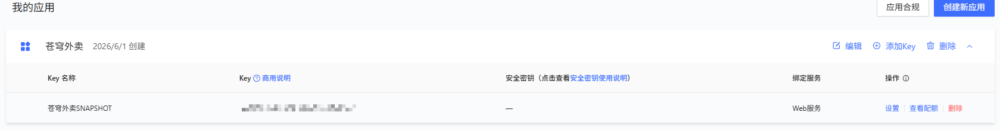

高德所有的`API`均可在[概述-Web服务 API | 高德地图API](https://lbs.amap.com/api/webservice/summary)进行查看，这里我只对我们需要使用的两个`API`进行介绍

不过在此之前，我们先对我们的外卖项目进行一些准备，在配置文件中定义对应的地址和高德`Key`配置

```yml
sky:  
  shop:
    location:
      address: "青岛市崂山区沙子口街道九水东路605号-66号"
      longitude: 120.506629
      latitude: 36.161922
      key: xxxxxxxxxxxxxxxxxxxxx
```

然后定义配置类

```java
package com.sky.properties;

import lombok.Data;
import org.springframework.boot.context.properties.ConfigurationProperties;
import org.springframework.stereotype.Component;

@Component
@ConfigurationProperties(prefix = "sky.shop.location")
@Data
public class ShopLocationProperties {
    // 纬度
    private String latitude;
    // 经度
    private String longitude;
    // 精确地址
    private String address;

    // 高德api key
    private String key;
}
```

#### 地理编码

因为高德开放平台中只能使用坐标来计算距离，因此我们需要首先将地址转换为坐标

```URL
https://restapi.amap.com/v3/geocode/geo
```

请求方式为`GET`，参数如下

| **参数名** | **含义**       | **规则说明**                                                 | **是否必须** |
| ---------- | -------------- | ------------------------------------------------------------ | ------------ |
| `key`      | 高德`Key`      | 用户在高德地图官网申请的`Key`                                | 必填         |
| `address`  | 结构化地址信息 | 规则遵循：国家、省份、城市、区县、城镇、乡村、街道、门牌号码、屋邨、大厦，如：北京市朝阳区阜通东大街6号。 | 必填         |
| `city`     | 指定查询的城市 | 可选输入内容包括：指定城市的中文（如北京）、指定城市的中文全拼`beijing`、`citycode`: `010`、`adcode`: `110000`，不支持县级市。当指定城市查询内容为空时，会进行全国范围内的地址转换检索。 | 可选         |

返回值如下

| **名称**            | **含义**         | **规则说明**                                                 |
| ------------------- | ---------------- | ------------------------------------------------------------ |
| `status`            | 返回结果状态值   | 返回值为 `0` 或 `1`，`0` 表示请求失败；`1` 表示请求成功。    |
| `count`             | 返回结果数目     | 返回结果的个数。                                             |
| `info`              | 返回状态说明     | 当 `status` 为 `0` 时，`info` 会返回具体错误原因，否则返回“OK” |
| `geocodes`          | 地理编码信息列表 | 结果对象列表，包括下述字段                                   |
| `geocodes-country`  | 国家             | 国内地址默认返回中国                                         |
| `geocodes-province` | 地址所在的省份名 | 例如：北京市。此处需要注意的是，中国的四大直辖市也算作省级单位。 |
| `geocodes-city`     | 地址所在的城市名 | 例如：北京市                                                 |
| `geocodes-citycode` | 城市编码         | 例如：`010`                                                  |
| `geocodes-district` | 地址所在的区     | 例如：朝阳区                                                 |
| `geocodes-street`   | 街道             | 例如：阜通东大街                                             |
| `geocodes-number`   | 门牌             | 例如：`6`号                                                  |
| `geocodes-adcode`   | 区域编码         | 例如：`110101`                                               |
| `geocodes-location` | 坐标点           | 经度，纬度                                                   |
| `geocodes-level`    | 匹配级别         | 参见下方的地理编码匹配级别列表                               |

例如我们查询`中国海洋大学崂山校区`

```url
https://restapi.amap.com/v3/geocode/geo?key=<key>&address=中国海洋大学崂山校区
```

```json
{
    "status": "1",
    "info": "OK",
    "infocode": "10000",
    "count": "1",
    "geocodes": [
        {
            "formatted_address": "山东省青岛市崂山区中国海洋大学崂山校区",
            "country": "中国",
            "province": "山东省",
            "citycode": "0532",
            "city": "青岛市",
            "district": "崂山区",
            "township": [],
            "neighborhood": {
                "name": [],
                "type": []
            },
            "building": {
                "name": [],
                "type": []
            },
            "adcode": "370212",
            "street": [],
            "number": [],
            "location": "120.499037,36.161293",
            "level": "兴趣点"
        }
    ]
}
```

这里的`"location": "120.499037,36.161293"`就是我们需要的经纬度坐标

#### 距离测量

```https
https://restapi.amap.com/v3/distance
```

请求方式为`GET`，请求参数如下

| **参数名**    | **含义**             | **规则说明**                                                 | **是否必须** |
| ------------- | -------------------- | ------------------------------------------------------------ | ------------ |
| `key`         | 请求服务权限标识     | 用户在高德地图官网申请的`Key`                                | 必填         |
| `origins`     | 出发点               | 格式为`经度,纬度`，支持100个坐标对，坐标对用`|`分割          | 必填         |
| `destination` | 目的地               | 经纬度小数点不超过6位                                        | 必填         |
| `type`        | 路径计算的方式和方法 | 0表示直线距离，1表示驾车距离，3表示步行距离，步行距离只支持5公里以内 | 可选         |

返回值如下

| **名称**           | **说明**                                                     |
| ------------------ | ------------------------------------------------------------ |
| `status`           | 返回结果状态值，值为0或1，0表示请求失败；1表示请求成功       |
| `info`             | 返回状态说明，status 为0时，info 返回错误原因；否则返回“OK”  |
| `results`          | 距离信息列表                                                 |
| `results-result`   | 距离信息                                                     |
| `result-origin_id` | 起点坐标，起点坐标序列号（从１开始）                         |
| `result-dest_id`   | 终点坐标，终点坐标序列号（从１开始）                         |
| `result-distance`  | 路径距离，单位：米                                           |
| `result-duration`  | 预计行驶时间，单位：秒                                       |
| `result-info`      | 仅在出错的时候显示该字段。大部分显示“未知错误”               |
| `result-code`      | 仅在出错的时候显示此字段。在驾车模式下，1表示指定地点之间没有可以行车的道路，2表示起点/终点距离所有道路均距离过远，3表示起点/终点不在中国境内 |

我们查询中国海洋大学崂山校区到电子科技大学清水河校区的直线距离

```url
{
    "status": "1",
    "info": "OK",
    "infocode": "10000",
    "count": "1",
    "results": [
        {
            "origin_id": "1",
            "dest_id": "1",
            "distance": "1649749",
            "duration": "0"
        }
    ]
}
```

得到的`"distance": "1649749"`即是两地直线距离

### 用户下单距离限制

我们已经初步了解高德地图`API`的使用，现在来完善我们的项目

在项目中定义一个工具类`LocationUtil`，用户获取用户坐标以及计算距离。两个`API`的调用都可以通过`HttpCilent`实现

```java
package com.sky.utils;

import com.alibaba.fastjson.JSONObject;
import com.sky.properties.ShopLocationProperties;
import lombok.AllArgsConstructor;
import lombok.extern.slf4j.Slf4j;
import org.springframework.stereotype.Component;

import java.util.HashMap;
import java.util.Map;

@Component
@Slf4j
@AllArgsConstructor
public class LocationUtil {

    private final ShopLocationProperties shopLocationProperties;

    // 高德api
    // 获取地址api
    private static final String GET_COORDINATE_URL = "https://restapi.amap.com/v3/geocode/geo";
    // 计算距离api
    private static final String GET_DISTANCE_URL = "https://restapi.amap.com/v3/distance";

    /**
     * 根据地址获取经纬度
     *
     * @param address
     * @return
     */
    public String getCoordinateByAddress(String address) {
        String key = shopLocationProperties.getKey();
        Map<String, String> urlMap = new HashMap<>();
        urlMap.put("key", key);
        urlMap.put("address", address);
        // 发送请求
        String json = HttpClientUtil.doGet(GET_COORDINATE_URL, urlMap);
        // 解析结果
        JSONObject jsonObject = JSONObject.parseObject(json);
        if (jsonObject.getInteger("status") != 1) {
            // 获取失败
            return null;
        }
        // 获取地址名称
        String formattedAddress = jsonObject.getJSONArray("geocodes").getJSONObject(0).getString("formatted_address");
        log.info("获取到的地址名称：{}", formattedAddress);
        // 获取经纬度
        String coordinate = jsonObject.getJSONArray("geocodes").getJSONObject(0).getString("location");
        log.info("获取到的经纬度：{}", coordinate);
        return coordinate;
    }

    /**
     * 计算两个经纬度之间的距离
     *
     * @param targetCoordinate
     * @return
     */
    public Long getDistance(String targetCoordinate) {
        String key = shopLocationProperties.getKey();
        // 获取店铺经纬度
        String coordinate = shopLocationProperties.getLongitude() + "," + shopLocationProperties.getLatitude();
        Map<String, String> urlMap = new HashMap<>();
        urlMap.put("key", key);
        urlMap.put("origins", coordinate);
        urlMap.put("destination", targetCoordinate);
        urlMap.put("type", "0");
        // 发送请求
        String json = HttpClientUtil.doGet(GET_DISTANCE_URL, urlMap);
        // 解析结果
        JSONObject jsonObject = JSONObject.parseObject(json);
        if (jsonObject.getInteger("status") != 1) {
            // 获取失败
            return null;
        }
        String distance = jsonObject.getJSONArray("results").getJSONObject(0).getString("distance");
        log.info("获取的距离：{}米", distance);
        return Long.valueOf(distance);
    }
}
```

然后在`Service`中使用

```java
// 距离校验
String address = addressBook.getProvinceName() + addressBook.getCityName() + addressBook.getDistrictName() + addressBook.getDetail();
String coordinate = locationUtil.getCoordinateByAddress(address);
if (coordinate == null)
    throw new FormValueIsNullException(MessageConstant.UNKNOWN_ADDRESS);
Long distance = locationUtil.getDistance(coordinate);
if (distance > 5000)
    throw new OrderBusinessException(MessageConstant.ADDRESS_IS_TOO_FAR);
```

进行测试，我们将店铺地址设置为`OUC`附近，但是下单地址设置为`UESTC`

> 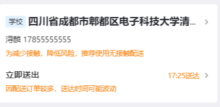

点击下单，后端报错地址太远

> 

将地址更改为`OUC`下单，校验通过

> 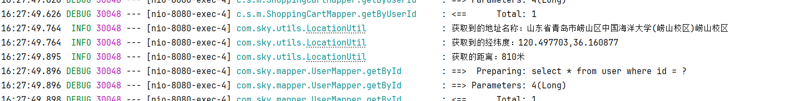

*注：高德地理编码返回的结果可能有多个，一般使用第一个即可*

## Spring Task

在我们开发的项目中，用户下达订单后长时间不支付导致订单超时，或者订单派送完成后长时间不点击完成，都没有做对应的解决策略

`SpringTask`是`Spring`框架提供的一套定时任务框架，通过`SpringTask`，可以按照指定时间，自动执行某个代码逻辑

### Cron表达式

`Cron`表达式是`SpringTask`用于定义任务触发条件的表达式，本质是一个字符串

`Cron`表达式使用七个域来表示时间，分别为`秒`、`分`、`时`、`日`、`月`、`周`、`年`，每个域之间用空格分隔，`日`与`周`无法共存，因为周可以对应多个日，每个月相同日对应的周数也不同，当存在一者时，另一者需要使用`?`作为占位符，年可以省略。例如需要描述`2026年6月2日下午14点55分28秒`

```cron
28 55 14 2 6 ? 2026
```

同时，`Cron`表达式也可以使用一些特殊符号来表达特殊含义

| 符号 | 含义                                             | 示例                 | 示例说明                                    |
| ---- | ------------------------------------------------ | -------------------- | ------------------------------------------- |
| `*`  | 通配符，表示对应域的任意时间                     | `0 0 14 * * ?`       | 每天下午14点                                |
| `-`  | 区间，表示连续时间段                             | `0 0 10-14 * * ?`    | 每天上午10点到下午14点                      |
| `,`  | 列表，表示多个时间点                             | `0 0 10,14,18 * * ?` | 每天上午10点、下午14点、晚上18点            |
| `/`  | 间隔，表示每隔指定时间                           | `0 0/30 10-14 * * ?` | 每天上午10点到下午14点，从0分开始每隔30分钟 |
| `L`  | 最后一天，只能用在`日`和`周`，用于表示域最后一天 | `0 0 23 L 9 ?`       | 9月最后一天23点                             |
| `W`  | 最近工作日，只能用在`日`                         | `0 0 14 5L * ?`      | 离每月5日最近的工作日的14点                 |
| `#`  | 当月的第几个星期几，只能用在`周`                 | `0 0 14 ? * FRI#3`   | 每月第三个周五的14点                        |

`Cron`表达式支持使用三字符简写来表达周和月份，包括`JAN`、`FEB`、`MAR`或者`SUN`、`MON`、`TUE`等等

### 快速入门

1. 在启动类上添加`@EnableScheduling`开启任务调度

```java
package com.sky;

import lombok.extern.slf4j.Slf4j;
import org.springframework.boot.SpringApplication;
import org.springframework.boot.autoconfigure.SpringBootApplication;
import org.springframework.cache.annotation.EnableCaching;
import org.springframework.scheduling.annotation.EnableScheduling;
import org.springframework.transaction.annotation.EnableTransactionManagement;

@SpringBootApplication
@EnableTransactionManagement //开启注解方式的事务管理
@Slf4j
@EnableCaching // 开启缓存功能
@EnableScheduling // 开启定时任务功能
public class SkyApplication {
    public static void main(String[] args) {
        SpringApplication.run(SkyApplication.class, args);
        log.info("server started");
    }
}
```

2. 自定义定时任务类，任务类需要添加`@Component`注解

```java
package com.sky.task;

import lombok.extern.slf4j.Slf4j;
import org.springframework.stereotype.Component;

@Component
@Slf4j
public class OrderTask {
}
```

3. 自定义定时任务，添加`@Scheduled`注解，并使用`Cron`表达式声明任务执行时间。定时任务方法返回值必须为`void`

```java
package com.sky.task;

import lombok.extern.slf4j.Slf4j;
import org.springframework.scheduling.annotation.Scheduled;
import org.springframework.stereotype.Component;

import java.time.LocalDateTime;

@Component
@Slf4j
public class OrderTask {

    @Scheduled(cron = "0/5 * * * * ? ")
    public void testTask(){
        log.info("开始执行定时任务，当前系统时间: {}", LocalDateTime.now());
    }
}
```

> 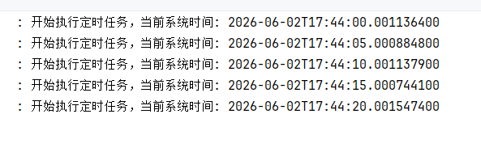

## WebSocket

`WebSocket`是基于`TCP`的一种新的网络协议，它实现了浏览器与服务器之间的全双工通信，浏览器和服务器只需要完成一次握手，两者之间就可以创建持久性的连接，并进行双向数据传输

基于`WebSocket`，可以实现服务器主动向客户端发送数据，例如视频弹幕、网页聊天、实况更新等不需要客户端进行请求操作的情况

### 快速入门

1. 引入依赖

```xml
<dependency>
    <groupId>org.springframework.boot</groupId>
    <artifactId>spring-boot-starter-websocket</artifactId>
</dependency>
```

2. 创建`WebSocketServer`，`ws`服务端需要添加`@ServerEndpoint`来设置握手请求路径

```java
package com.sky.websocket;

import lombok.extern.slf4j.Slf4j;
import org.springframework.stereotype.Component;

import javax.websocket.Session;
import javax.websocket.server.ServerEndpoint;
import java.util.HashMap;
import java.util.Map;

@ServerEndpoint("/ws/{sid}")
@Slf4j
@Component
public class WebSocketServer {
}
```

3. 定义回调方法

```java
package com.sky.websocket;

import lombok.extern.slf4j.Slf4j;
import org.springframework.stereotype.Component;
import org.springframework.web.bind.annotation.PathVariable;

import javax.websocket.OnClose;
import javax.websocket.OnMessage;
import javax.websocket.OnOpen;
import javax.websocket.Session;
import javax.websocket.server.PathParam;
import javax.websocket.server.ServerEndpoint;
import java.util.HashMap;
import java.util.Map;

@ServerEndpoint("/ws/{sid}")
@Slf4j
@Component
public class WebSocketServer {
    // 存放所有会话
    private static Map<String, Session> sessionMap = new HashMap<>();

    /**
     * 会话开启回调
     * @param session
     * @param sid
     */
    @OnOpen
    public void onOpen(Session session, @PathParam("sid") String sid) {
        log.info("WS: 客户端 {} 建立连接", sid);
        sessionMap.put(sid, session);
    }

    /**
     * 接收消息回调
     * @param message
     * @param sid
     */
    @OnMessage
    public void onMessage(String message, @PathParam("sid") String sid) {
        log.info("WS: 收到客户端 {} 的消息: {}", sid, message);
    }

    /**
     * 会话关闭回调
     * @param sid
     */
    @OnClose
    public void onClose(@PathParam("sid") String sid) {
        log.info("WS: 断开连接 {}", sid);
        sessionMap.remove(sid);
    }

    /**
     * 给所有会话发送消息
     * @param message
     */
    public void sendToAll(String message) {
        sessionMap.forEach((sid, session) -> {
            try {
                session.getBasicRemote().sendText(message);
            } catch (Exception e) {
                e.printStackTrace();
            }
        });
    }
}
```

4. 定义`WebSocketConfiguration`，声明一个`ServerEndpointExporter`为`Bean`

```java
package com.sky.config;

import org.springframework.boot.autoconfigure.condition.ConditionalOnMissingBean;
import org.springframework.context.annotation.Bean;
import org.springframework.context.annotation.Configuration;
import org.springframework.web.socket.server.standard.ServerEndpointExporter;

@Configuration
public class WebSocketConfiguration {

    @Bean
    @ConditionalOnMissingBean
    public ServerEndpointExporter serverEndpointExporter() {
        return new ServerEndpointExporter();
    }
}
```

5. 设置一个定时任务，每隔5秒向客户端发送消息

```java
package com.sky.task;

import com.sky.websocket.WebSocketServer;
import lombok.extern.slf4j.Slf4j;
import org.springframework.beans.factory.annotation.Autowired;
import org.springframework.scheduling.annotation.Scheduled;
import org.springframework.stereotype.Component;

import java.time.LocalDateTime;

@Component
@Slf4j
public class WebSocketTask {

    @Autowired
    private WebSocketServer webSocketServer;

    @Scheduled(cron = "0/5 * * * * ?")
    public void sendMessageTask() {
        webSocketServer.sendToAll("测试定时消息: " + LocalDateTime.now());
    }
}
```

6. 用`AI`编写一个简单客户端，测试`WebSocket`

```html
<!DOCTYPE html>
<html lang="zh-CN">
<head>
    <meta charset="UTF-8">
    <meta name="viewport" content="width=device-width, initial-scale=1.0">
    <title>WebSocket 简易调试器 · 元宝</title>
    <style>
        * {
            box-sizing: border-box;
            font-family: system-ui, -apple-system, 'Segoe UI', Roboto, 'Helvetica Neue', sans-serif;
        }
        body {
            background: #f5f7fb;
            margin: 20px;
            display: flex;
            justify-content: center;
            align-items: center;
            min-height: calc(100vh - 40px);
        }
        .card {
            max-width: 780px;
            width: 100%;
            background: white;
            border-radius: 28px;
            padding: 30px 32px 38px;
            box-shadow: 0 12px 35px rgba(0, 10, 25, 0.08);
            transition: all 0.2s ease;
        }
        h1 {
            font-size: 24px;
            font-weight: 600;
            margin-top: 4px;
            margin-bottom: 16px;
            color: #0b1a33;
            display: flex;
            align-items: center;
            gap: 10px;
        }
        h1 small {
            font-size: 14px;
            font-weight: 400;
            color: #3d5775;
            background: #eef3fa;
            padding: 2px 12px;
            border-radius: 50px;
            letter-spacing: 0.3px;
        }
        .connection-area {
            background: #f0f4fe;
            border-radius: 18px;
            padding: 18px 22px;
            margin-bottom: 28px;
            display: flex;
            flex-wrap: wrap;
            align-items: center;
            justify-content: space-between;
            gap: 15px;
        }
        .status-badge {
            display: flex;
            align-items: center;
            gap: 12px;
            flex-wrap: wrap;
        }
        .indicator {
            display: inline-flex;
            align-items: center;
            gap: 8px;
            background: white;
            padding: 6px 16px 6px 12px;
            border-radius: 60px;
            box-shadow: 0 2px 6px rgba(0,0,0,0.02);
            font-size: 14px;
        }
        .dot {
            width: 12px;
            height: 12px;
            border-radius: 50%;
            background: #9aaec5;
            transition: 0.15s;
        }
        .dot.connected {
            background: #19bc6c;
            box-shadow: 0 0 0 3px rgba(25, 188, 108, 0.18);
        }
        .dot.disconnected {
            background: #cdd9e9;
        }
        .btn-group {
            display: flex;
            gap: 10px;
            flex-wrap: wrap;
        }
        button {
            background: white;
            border: none;
            padding: 8px 20px;
            border-radius: 48px;
            font-weight: 500;
            font-size: 14px;
            cursor: pointer;
            transition: all 0.15s;
            box-shadow: 0 2px 4px rgba(0, 0, 0, 0.02);
            border: 1px solid #dce3ed;
            color: #1f2b44;
            display: inline-flex;
            align-items: center;
            gap: 6px;
        }
        button.primary {
            background: #146ef5;
            border-color: #146ef5;
            color: white;
            box-shadow: 0 4px 10px rgba(20, 110, 245, 0.20);
        }
        button.primary:hover {
            background: #0f5ad6;
            transform: scale(1.01);
        }
        button.danger {
            background: #f43f5e;
            border-color: #f43f5e;
            color: white;
        }
        button.danger:hover {
            background: #da2f4c;
        }
        button:active {
            transform: scale(0.96);
        }
        button:disabled {
            opacity: 0.45;
            pointer-events: none;
            filter: grayscale(0.3);
        }
        .input-row {
            display: flex;
            gap: 12px;
            margin: 18px 0 22px;
            flex-wrap: wrap;
        }
        .input-row input {
            flex: 1;
            min-width: 180px;
            padding: 12px 18px;
            border-radius: 54px;
            border: 1px solid #dde3ed;
            background: #ffffff;
            font-size: 15px;
            outline: none;
            transition: 0.15s;
        }
        .input-row input:focus {
            border-color: #146ef5;
            box-shadow: 0 0 0 3px rgba(20, 110, 245, 0.15);
        }
        .input-row button {
            padding: 12px 34px;
            white-space: nowrap;
        }
        .messages-box {
            background: #fafcff;
            border: 1px solid #eaeef5;
            border-radius: 22px;
            padding: 6px 0;
            margin-top: 8px;
            height: 320px;
            overflow-y: auto;
            display: flex;
            flex-direction: column;
        }
        .message-item {
            padding: 12px 22px;
            border-bottom: 1px solid #eff2f9;
            font-size: 14.5px;
            line-height: 1.5;
            color: #14273e;
            word-break: break-word;
        }
        .message-item:last-child {
            border-bottom: none;
        }
        .message-empty {
            color: #889bb3;
            text-align: center;
            padding: 40px 20px;
            font-style: italic;
        }
        .timestamp {
            color: #667f9e;
            font-size: 11.5px;
            font-weight: 450;
            margin-right: 12px;
            letter-spacing: 0.2px;
        }
        .badge-sys {
            background: #eaf0fa;
            border-radius: 36px;
            padding: 2px 12px;
            font-size: 12px;
            color: #28598b;
            margin-left: 8px;
        }
        .footer-note {
            margin-top: 18px;
            font-size: 13px;
            color: #657e9e;
            text-align: right;
            border-top: 1px solid #ebf0f7;
            padding-top: 16px;
        }
        .sid-label {
            background: white;
            padding: 5px 14px;
            border-radius: 80px;
            font-size: 13px;
            border: 1px solid #dce3ed;
            color: #203a5a;
        }
        code {
            background: #ecf2fc;
            padding: 2px 8px;
            border-radius: 26px;
            font-size: 13px;
            color: #16437e;
        }
    </style>
</head>
<body>
<div class="card">
    <h1>
        ⚡ WebSocket 面板
        <small>sid 随机拼接</small>
    </h1>

    <!-- 连接区域 -->
    <div class="connection-area">
        <div class="status-badge">
            <span class="indicator">
                <span class="dot disconnected" id="statusDot"></span>
                <span id="statusText">未连接</span>
            </span>
            <span class="sid-label" id="currentSidDisplay">sid: —</span>
        </div>
        <div class="btn-group">
            <button id="connectBtn" class="primary">🔗 连接</button>
            <button id="disconnectBtn" class="danger">⛔ 断开</button>
        </div>
    </div>

    <!-- 消息发送行 -->
    <div class="input-row">
        <input type="text" id="msgInput" placeholder="输入要发送的消息..." autocomplete="off">
        <button id="sendBtn" disabled>📤 发送</button>
    </div>

    <!-- 服务端消息展示框 -->
    <div style="display: flex; justify-content: space-between; align-items: baseline; margin-bottom: 6px;">
        <span style="font-weight: 550; color: #13273f;">📋 服务端消息</span>
        <span style="font-size: 13px; color: #617b9a;">共 <span id="msgCount">0</span> 条</span>
    </div>
    <div class="messages-box" id="messageBox">
        <div class="message-empty" id="emptyPlaceholder">💬 暂无消息，连接后将显示服务端推送</div>
    </div>
    <div class="footer-note">
        <code>ws://localhost:8080/ws/&lt;随机sid&gt;</code>  ·  每次连接生成新sid
    </div>
</div>

<script>
    (function() {
        // DOM 元素
        const connectBtn = document.getElementById('connectBtn');
        const disconnectBtn = document.getElementById('disconnectBtn');
        const sendBtn = document.getElementById('sendBtn');
        const msgInput = document.getElementById('msgInput');
        const messageBox = document.getElementById('messageBox');
        const emptyPlaceholder = document.getElementById('emptyPlaceholder');
        const msgCountSpan = document.getElementById('msgCount');
        const statusDot = document.getElementById('statusDot');
        const statusText = document.getElementById('statusText');
        const currentSidDisplay = document.getElementById('currentSidDisplay');

        // 状态变量
        let ws = null;
        let currentSid = '';          // 当前连接的sid (不含随机串)
        let messageCounter = 0;

        // ---- 辅助函数 ----
        function generateRandomSid(length = 6) {
            const chars = 'abcdefghijklmnopqrstuvwxyz0123456789';
            let result = '';
            for (let i = 0; i < length; i++) {
                result += chars.charAt(Math.floor(Math.random() * chars.length));
            }
            return result;
        }

        // 更新UI连接状态
        function updateConnectionStatus(isConnected) {
            if (isConnected) {
                statusDot.className = 'dot connected';
                statusText.textContent = '已连接';
                sendBtn.disabled = false;
                disconnectBtn.disabled = false;
                connectBtn.disabled = true;
                // 显示当前sid
                currentSidDisplay.textContent = `sid: ${currentSid || '—'}`;
            } else {
                statusDot.className = 'dot disconnected';
                statusText.textContent = '未连接';
                sendBtn.disabled = true;
                disconnectBtn.disabled = true;
                connectBtn.disabled = false;
                // 保留sid显示但不展示随机值 (可展示上次sid)
                if (currentSid) {
                    currentSidDisplay.textContent = `sid: ${currentSid} (已断)`;
                } else {
                    currentSidDisplay.textContent = `sid: —`;
                }
            }
        }

        // 添加一条消息到展示框 (服务端消息)
        function addServerMessage(data) {
            // 移除空占位
            if (emptyPlaceholder && emptyPlaceholder.parentNode) {
                emptyPlaceholder.remove();
            }

            const item = document.createElement('div');
            item.className = 'message-item';

            const timestamp = new Date().toLocaleTimeString('zh-CN', { hour12: false });
            const timeSpan = document.createElement('span');
            timeSpan.className = 'timestamp';
            timeSpan.textContent = `[${timestamp}]`;

            const badge = document.createElement('span');
            badge.className = 'badge-sys';
            badge.textContent = 'server';

            const contentSpan = document.createElement('span');
            contentSpan.style.marginLeft = '6px';
            // 尝试解析JSON或直接显示文本
            try {
                // 如果是json字符串就美化一下显示
                if (typeof data === 'string' && (data.startsWith('{') || data.startsWith('['))) {
                    const parsed = JSON.parse(data);
                    contentSpan.textContent = JSON.stringify(parsed, null, 1);
                } else {
                    contentSpan.textContent = data;
                }
            } catch (e) {
                contentSpan.textContent = data;
            }

            item.appendChild(timeSpan);
            item.appendChild(badge);
            item.appendChild(contentSpan);

            messageBox.appendChild(item);
            // 滚动到底部
            messageBox.scrollTop = messageBox.scrollHeight;

            // 更新计数
            messageCounter++;
            msgCountSpan.textContent = messageCounter;
        }

        // 清空消息列表 (重置计数器)
        function clearMessages() {
            messageBox.innerHTML = '';
            // 重新放回占位符
            const placeholder = document.createElement('div');
            placeholder.className = 'message-empty';
            placeholder.id = 'emptyPlaceholder';
            placeholder.textContent = '💬 暂无消息，连接后将显示服务端推送';
            messageBox.appendChild(placeholder);
            messageCounter = 0;
            msgCountSpan.textContent = '0';
        }

        // 建立WebSocket连接
        function connectWebSocket() {
            // 如果已有连接先关闭
            if (ws && (ws.readyState === WebSocket.OPEN || ws.readyState === WebSocket.CONNECTING)) {
                ws.close();
                ws = null;
            }

            // 生成随机sid (6位字母数字)
            const randomPart = generateRandomSid(6);
            currentSid = randomPart;
            const url = `ws://localhost:8080/ws/${randomPart}`;

            try {
                ws = new WebSocket(url);
            } catch (err) {
                addServerMessage(`❌ 创建WebSocket失败: ${err.message}`);
                updateConnectionStatus(false);
                return;
            }

            // 更新显示 (连接中)
            statusDot.className = 'dot disconnected';
            statusText.textContent = '连接中...';
            currentSidDisplay.textContent = `sid: ${randomPart}`;
            connectBtn.disabled = true;
            disconnectBtn.disabled = true;
            sendBtn.disabled = true;

            // --- 事件绑定 ---
            ws.onopen = () => {
                console.log('[WS] 连接打开');
                updateConnectionStatus(true);
                addServerMessage(`✅ 连接成功 | sid = ${randomPart}`);
            };

            ws.onmessage = (event) => {
                const data = event.data;
                addServerMessage(data);
            };

            ws.onerror = (err) => {
                console.error('[WS] 错误:', err);
                addServerMessage(`⚠️ WebSocket 错误 (请确认服务端已启动)`);
                // 不立即关闭，让onclose处理
            };

            ws.onclose = (event) => {
                console.log('[WS] 连接关闭', event.code, event.reason);
                // 避免重复清理
                if (ws && ws.readyState === WebSocket.CLOSED) {
                    updateConnectionStatus(false);
                    // 如果是有意关闭，code可能是1000
                    let closeMsg = `🔌 连接已关闭 (code: ${event.code})`;
                    if (event.reason) closeMsg += ` reason: ${event.reason}`;
                    addServerMessage(closeMsg);
                    ws = null;
                } else {
                    // 某些异常情况
                    updateConnectionStatus(false);
                    addServerMessage(`🔌 连接异常关闭`);
                    ws = null;
                }
                // 确保按钮状态
                updateConnectionStatus(false);
            };
        }

        // 断开连接
        function disconnectWebSocket() {
            if (ws) {
                // 移除onclose避免重复触发消息 (但保留onclose用于正常关闭提示)
                // 我们只是手动关闭，会触发onclose
                ws.close(1000, '用户主动断开');
                // 但onclose里会置空ws，不必额外操作
            } else {
                addServerMessage(`⚡ 当前没有活跃连接`);
            }
        }

        // 发送消息
        function sendMessage() {
            if (!ws || ws.readyState !== WebSocket.OPEN) {
                addServerMessage(`⚠️ 无法发送：WebSocket 未连接`);
                return;
            }
            const rawMsg = msgInput.value.trim();
            if (rawMsg === '') {
                addServerMessage(`📭 不能发送空消息`);
                return;
            }

            try {
                ws.send(rawMsg);
                // 可选：在本地也显示发送日志（但题目只要求显示服务端消息，为了友好增加一条“已发送”记录）
                // 但为了纯粹展示服务端消息，这里只做发送，不追加到服务端消息框。
                // 不过为了交互反馈，可以在服务端消息框加一条本地提示？ 根据需求“显示所有服务端发来的消息”，
                // 所以不把客户端发送的消息当作服务端消息。但为了易用，我在这里悄悄加一条灰底提示（非服务端消息）。
                // 更严谨：完全不加。但是容易让用户以为没发送成功。加一条淡灰色本地提示，但标记为 [local]
                const localIndicator = document.createElement('div');
                localIndicator.className = 'message-item';
                localIndicator.style.backgroundColor = '#f8faff';
                localIndicator.style.color = '#386581';
                localIndicator.style.fontSize = '13px';
                const time = new Date().toLocaleTimeString('zh-CN', { hour12: false });
                localIndicator.innerHTML = `<span class="timestamp">[${time}]</span><span style="background:#e3ecf9;border-radius:30px;padding:0 12px;font-size:12px;">📨 已发送</span><span style="margin-left:10px;color:#204666;">${rawMsg}</span>`;
                // 插入到消息框最后，但不清除占位
                if (emptyPlaceholder && emptyPlaceholder.parentNode) {
                    emptyPlaceholder.remove();
                }
                messageBox.appendChild(localIndicator);
                messageBox.scrollTop = messageBox.scrollHeight;
                // 不增加服务端计数
                msgInput.value = '';
            } catch (e) {
                addServerMessage(`❌ 发送失败: ${e.message}`);
            }
        }

        // ---- 初始化与事件绑定 ----
        function init() {
            // 默认状态
            updateConnectionStatus(false);
            clearMessages();

            // 连接按钮
            connectBtn.addEventListener('click', connectWebSocket);

            // 断开按钮
            disconnectBtn.addEventListener('click', disconnectWebSocket);

            // 发送按钮
            sendBtn.addEventListener('click', sendMessage);

            // 回车发送
            msgInput.addEventListener('keypress', (e) => {
                if (e.key === 'Enter' && !sendBtn.disabled) {
                    e.preventDefault();
                    sendMessage();
                }
            });

            // 页面卸载时关闭连接
            window.addEventListener('beforeunload', () => {
                if (ws && (ws.readyState === WebSocket.OPEN || ws.readyState === WebSocket.CONNECTING)) {
                    ws.close(1000, '页面关闭');
                }
            });
        }

        // 启动
        init();
    })();
</script>
</body>
</html>
```

> 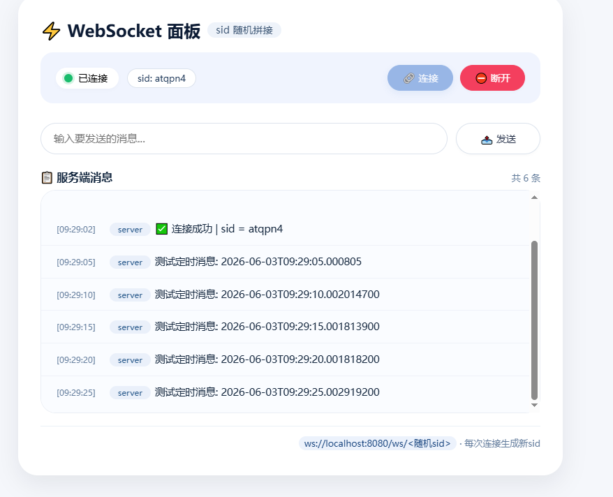

> 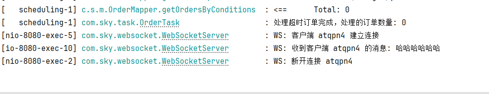

### 来单提醒

在实现逻辑之前，我们首先来概述一下来单提醒的设计思路。首先需要管理端与后端使用`WebSocket`建立一个长连接，保证后端能够随时向管理端发送消息，接着后端在用户支付完成后，调用`WebSocket`向管理端发送消息，这里我们需要定义一个消息规范，消息格式为`JSON`，设置三个字段`type`、`orderId`和`content`，分别代表消息类型、订单号以及消息内容。消息类型中1表示来单提醒，2表示客户催单

根据上文已经定义好的`WebSocketServer`类，我们可以直接注入到`Service`中，然后改造方法。改造的方法应该是支付方法`public LocalDateTime payment(OrdersPaymentDTO ordersPaymentDTO)`，在清除购物车后构造一个`HashMap`，插入`type`、`orderId`以及`content`，使用`JSON.toJSONString()`转换为`JSON`，最后将消息发送到管理端

```java
// 向管理端发送来单提醒
// 构造消息
Map<String, Object> message = new HashMap<>();
message.put("type", 1);
message.put("orderId", orders.getId());
message.put("content", "订单号: " + orders.getNumber());
// 发送消息
webSocketServer.sendToAll(JSON.toJSONString(message));
```

> 

### 客户催单

用户在商家长时间未接单时可以选择催单，催单的逻辑与来单提醒基本相同，由后端向管理端发送通知消息。

`Controller`

```java
/**
 * 催单
 * @param id
 * @return
 */
@GetMapping("/reminder/{id}")
@ApiOperation("催单")
public Result<String> reminder(@PathVariable Long id) {
    log.info("催单：{}", id);
    orderService.reminder(id);
    return Result.success();
}
```

`Service`

```java
/**
 * 催单
 * @param id
 */
@Override
public void reminder(Long id) {
    if (id == null)
        throw new FormValueIsNullException(MessageConstant.ORDER_NOT_FOUND);
    // 获取订单信息
    Orders orders = orderMapper.getById(id);
    if (orders == null)
        throw new OrderBusinessException(MessageConstant.ORDER_NOT_FOUND);
    // 判断订单状态是否为待接单和待派单
    if (!Objects.equals(orders.getStatus(), Orders.TO_BE_CONFIRMED) && !Objects.equals(orders.getStatus(), Orders.CONFIRMED))
        throw new OrderBusinessException(MessageConstant.ORDER_STATUS_ERROR);
    // 构造消息
    Map<String, Object> msg = new HashMap<>();
    msg.put("type", 2);
    msg.put("orderId", id);
    msg.put("content", "订单号：" + orders.getNumber());
    // 发送消息
    webSocketServer.sendToAll(JSON.toJSONString(msg));
}
```

> 

## 数据统计

数据统计方面，我们使用`Apache ECharts`来快捷生成报表，有关`Apache ECharts`的使用，已经在艾欧希后台管理系统中介绍过了，我们需要完成的只是向前端提交指定格式的数据而已。

### 销量Top10

前端请求的数据格式如下

| 参数名称 | 是否必须 | 示例       | 备注     |
| -------- | -------- | ---------- | -------- |
| begin    | 是       | 2022-05-01 | 开始日期 |
| end      | 是       | 2022-05-31 | 结束日期 |

响应格式

| 名称          | 类型    | 是否必须 | 默认值 | 备注                     | 其他信息      |
| ------------- | ------- | -------- | ------ | ------------------------ | ------------- |
| code          | integer | 必须     |        |                          | format: int32 |
| data          | object  | 必须     |        |                          |               |
| ├─ nameList   | string  | 必须     |        | 商品名称列表，以逗号分隔 |               |
| ├─ numberList | string  | 必须     |        | 销量列表，以逗号分隔     |               |
| msg           | string  | 非必须   |        |                          |               |

简单分析一下，我们需要通过`begin`和`end`的约束来获取指定日期内的菜品销量数据，同时返回的两个字段都必须为`String`，这完全可以利用`SQL`语句来实现

首先查询所有的指定时间段内的销量数据，按照销量降序排序。主表为`order_detail`表，因为菜品的销量数据和菜品名称存储在`order_detail`表中；联合一张`orders`子表，因为`order_detail`表中并没有存储订单时间，需要`orders`表中的`order_time`作为约束条件；使用`GROUP BY`子句将所有分开的同一菜品聚合在一条记录中，并使用`SUM(number)`来统计销量数据，最后按照销量降序排序，并限制最多10条查询记录

```mysql
SELECT
    od.name,
    SUM(od.number) AS total
FROM order_detail od
    JOIN orders o ON od.order_id = o.id
WHERE o.order_time BETWEEN '2026-05-05' AND '2026-06-05'
GROUP BY od.name
ORDER BY total DESC
LIMIT 10
```

> 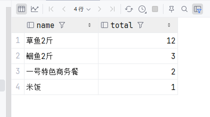

接着我们将多条查询语句拼接为一条，在`MySQL`中使用`GROUP_CONCAT()`函数；将上文整条查询语句作为子表，`name`和`total`作为两个字段进行拼接，为了提升查询性能，我们将`ORDER BY`移动到`GROUP_CONCAT()`内部，最后为两个新的字段设置别名。

```mysql
SELECT
    GROUP_CONCAT(t.name ORDER BY t.total DESC) AS nameList,
    GROUP_CONCAT(t.total ORDER BY t.total DESC) AS numberList
FROM (
         SELECT
             od.name,
             SUM(od.number) AS total
         FROM order_detail od
                  JOIN orders o ON od.order_id = o.id
         WHERE o.order_time BETWEEN '2026-05-05' AND '2026-06-05'
         GROUP BY od.name
         LIMIT 10
     ) AS t;
```

> 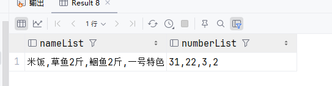

最后将`Controller`、`Service`和`Mapper`补充完整

`Controller`

```java
/**
 * 统计销量Top10
 * @return 销量Top10
 */
@GetMapping("/top10")
@ApiOperation("销量前十")
public Result<SalesTop10ReportVO> getSalesTop10(String begin, String end) {
    SalesTop10ReportVO report = reportService.getSalesTop10(LocalDate.parse(begin), LocalDate.parse(end));
    log.info("查询销量前十数据：{}", report);
    return Result.success(report);
}
```

`Service`

```java
/**
 * 统计销量Top10
 * @return 销量Top10
 */
@Override
public SalesTop10ReportVO getSalesTop10(LocalDate begin, LocalDate end) {
    if (begin == null || end == null)
        throw new FormValueIsNullException(MessageConstant.DATE_ARE_REQUIRED);
    return reportMapper.getSalesTop10(begin, end);
}
```

`Mapper`

```java
/**
 * 统计销量Top10
 * @return 销量Top10
 */
SalesTop10ReportVO getSalesTop10(LocalDate begin, LocalDate end);
```

`Mapper.xml`

```xml
<!--    统计销量Top10-->
<select id="getSalesTop10" resultType="com.sky.vo.SalesTop10ReportVO">
    SELECT
        GROUP_CONCAT(t.name ORDER BY t.total DESC) AS nameList,
        GROUP_CONCAT(t.total ORDER BY t.total DESC) AS numberList
    FROM (
             SELECT
                 od.name,
                 SUM(od.number) AS total
             FROM order_detail od
                      JOIN orders o ON od.order_id = o.id
             WHERE o.order_time BETWEEN #{begin} AND #{end}
             GROUP BY od.name
             LIMIT 10
         ) AS t;
</select>
```

> 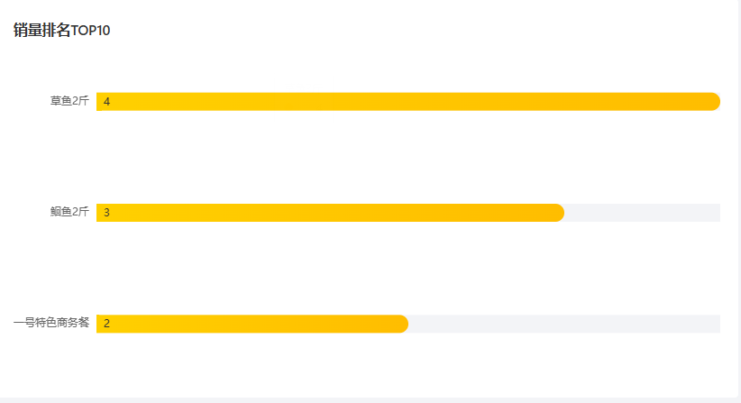

### 用户统计

根据接口文档，我们先来分析一下用户统计的逻辑。接口文档要求三个字段，`dateList`日期列表，`newUserList`新增用户列表以及`totalUserList`总用户列表。很显然仅用`MySQL`无法完成整个逻辑，我们的思路是，在数据库中查询所有指定日期的用户数据，再获取`begin`之前的用户总量，然后在后端生成指定日期之间的所有日期，形成一个日期列表`dateList`。接着将所有用户信息按照创建日期分组，即`Map<LocalDate, List<User>>`，遍历整个`dateList`，判断`Map`中是否包含对应的时间键，包含则表示当天存在新增用户，再获取`Map`中对应日期的值，也就是`List<User>`的长度，即代表当天新增用户数量

涉及的`SQL`语句都是简单查询语句

`Mapper`

```java
/**
 * 获取指定日期内的所有用户
 * @param begin
 * @param end
 * @return 用户统计数据
 */
@Select("select * from user where create_time between #{begin} and #{end}")
List<User> getUsersByCreateTime(LocalDate begin, LocalDate end);

/**
 * 根据日期统计用户总量
 * @param begin
 * @return
 */
@Select("select count(*) from user where create_time < #{begin}")
Integer getTotalBeforeBeginDate(LocalDate begin);
```

`Controller`

```java
/**
 * 用户统计
 * @param begin
 * @param end
 * @return 用户统计数据
 */
@GetMapping("/userStatistics")
@ApiOperation("用户统计")
public Result<UserReportVO> userStatistics(String begin, String end) {
    UserReportVO report = reportService.getUserStatistics(LocalDate.parse(begin), LocalDate.parse(end));
    log.info("查询用户统计数据：{}", report);
    return Result.success(report);
}
```

最后的`Service`仔细讲解一下

在通过`getUsersByCreateTime()`获取用户数据后，封装为了一个`List<User>`，我们利用`Stream`流并结合`Collectors.groupingBy()`方法，`Collectors.groupingBy()`方法可以将`Stream`流按照指定的键自动组合为一个`Map<Key, List<OriginalObject>>`，此处设置的键就是用户的创建时间`LocalDate`，由于数据库中存储的是`LocalDateTime`，需要利用`.toLocalDate()`转换一下。然后调用一个日期生成方法`getBetweenDates()`，这个方法的逻辑很简单，利用`LocalDate`的`plusDays()`方法，使用`while`循环一直添加，直到`end`为止。然后再使用`foreach`遍历`dateList`，每次遍历时判断`userMap`中是否包含对应的`date`，如果包含，则表示当天存在新增的用户，于是将`Map`中对应的值的长度添加到`newUser`和`total`中，并更新`newUserList`和`totalUserList`。在返回前端之前我们还需要进行一次转换，将`List`转换为逗号分隔的`String`，这里不能直接调用`List`的`toString`方法，`toString`方法返回的结果中会包含`[`和`]`符号，最简单的处理办法是直接使用`String`的`substring`方法，如`substring(1, Object.length() - 1)`，但是这里我们使用`Stream`流来保证数据可以正确转换为指定格式

```java
/**
 * 用户统计
 * @param begin
 * @param end
 * @return
 */
@Override
public UserReportVO getUserStatistics(LocalDate begin, LocalDate end) {
    if (begin == null || end == null)
        throw new FormValueIsNullException(MessageConstant.DATE_ARE_REQUIRED);
    // 获取指定日期之间的用户数据
    List<User> users = reportMapper.getUsersByCreateTime(begin, end);
    // 将用户数据按照日期为键，生成一个Map<LocalDate, List<User>>
    Map<LocalDate, List<User>> userMap = users.stream()
            .collect(Collectors.groupingBy(
                    user -> user.getCreateTime().toLocalDate()
            ));
    // 获取begin之前的用户总量
    Integer total = reportMapper.getTotalBeforeBeginDate(begin);
    // 获取所有日期
    List<LocalDate> dateList = getBetweenDates(begin, end);
    List<Integer> newUserList = new ArrayList<>();
    List<Integer> totalUserList = new ArrayList<>();
    // 遍历日期
    for (LocalDate date : dateList) {
        Integer newUser = 0;
        // 判断当前日期是否包含用户数据
        if (userMap.containsKey(date)) {
            // 包含，则表示是新增用户，对应List<User>的长度即代表新增用户数量
            newUser = userMap.get(date).size();
            total += newUser;
        }
        // 将数据添加到对应的列表中
        newUserList.add(newUser);
        totalUserList.add(total);
    }
    // 转换为VO对象并返回
    return UserReportVO.builder()
            .dateList(
                    dateList.stream()
                            .map(LocalDate::toString)
                            .collect(Collectors.joining(","))
            )
            .newUserList(
                    newUserList.stream()
                            .map(String::valueOf)
                            .collect(Collectors.joining(","))
            )
            .totalUserList(
                    totalUserList.stream()
                            .map(String::valueOf)
                            .collect(Collectors.joining(","))
            )
            .build();
}

/**
 * 获取两个日期之间的所有日期，包括begin和end
 * @param begin
 * @param end
 * @return
 */
private List<LocalDate> getBetweenDates(LocalDate begin, LocalDate end) {
    List<LocalDate> result = new ArrayList<>();
    result.add(begin);
    LocalDate temp = begin;
    while (!temp.equals(end)) {
        temp = temp.plusDays(1);
        result.add(temp);
    }
    return result;
}
```

> 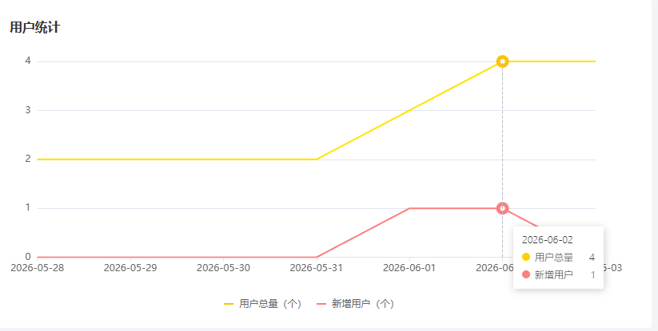

### 营业额统计

营业额统计相对比较简单，营业数据直接对应`orders`表中的`amount`，而且每个订单只对应一个`amount`，查询每天的营业数据只需要按日期分组，然后利用`SUM`聚合函数计算金额即可

```mysql
SELECT
    DATE(order_time) AS date,
    SUM(amount) AS turnover
FROM
    orders
<where>
    <if test="begin != null and end != null">
        <if test="begin != end">
            DATE(order_time) BETWEEN #{begin} AND #{end}
        </if>
        <if test="begin == end">
            DATE(order_time) = #{begin}
        </if>
    </if>
</where>
GROUP BY
    DATE(order_time)
```

这里不需要使用`GROUP_CONCAT()`聚合，因为营业额可以为0，但不会体现在数据库中。所以我们使用一个`List<TurnoverDTO>`接收这些记录，每条记录对应一个`TurnoverDTO`，然后遍历所有日期，将有数据的插入即可

`Controller`

```java
/**
 * 营业额统计
 * @param begin
 * @param end
 * @return
 */
@GetMapping("/turnoverStatistics")
@ApiOperation("营业额统计")
public Result<TurnoverReportVO> turnoverStatistics(String begin, String end) {
    TurnoverReportVO report = reportService.getTurnoverStatistics(LocalDate.parse(begin), LocalDate.parse(end));
    log.info("营业额数据：{}", report);
    return Result.success(report);
}
```

`Mapper`

```java
/**
 * 营业额统计
 * @param begin
 * @param end
 * @return
 */
List<TurnoverDTO> getTurnoverStatistics(LocalDate begin, LocalDate end);
```

同样讲解一下`Service`

这里的遍历与上文略有不同，日期与营业额是一对一关系，`date`与`turnoverDTOS.get(0).getDate()`最多只有一条匹配记录，因此在`turnoverDTOS.get(0).getDate().equals(date)`匹配成功后，可以唯一确定当日的营业额数据，然后执行`turnoverDTOS.remove(0)`以便匹配后续的日期。在执行`turnoverDTOS.get(0).getDate().equals(date)`比较前需要先判断`turnoverDTOS`是否为空，否则会导致空指针异常

```java
/**
 * 营业额统计
 * @param begin
 * @param end
 * @return
 */
@Override
public TurnoverReportVO getTurnoverStatistics(LocalDate begin, LocalDate end) {
    // 获取指定日期的营业额数据
    List<TurnoverDTO> turnoverDTOS = reportMapper.getTurnoverStatistics(begin, end);
    // 获取所有日期
    List<LocalDate> dateList = getBetweenDates(begin, end);
    List<BigDecimal> turnoverList = new ArrayList<>();
    for (LocalDate date : dateList) {
        if (!turnoverDTOS.isEmpty() && turnoverDTOS.get(0).getDate().equals(date)) {
            turnoverList.add(turnoverDTOS.get(0).getTurnover());
            turnoverDTOS.remove(0);
        } else {
            turnoverList.add(BigDecimal.ZERO);
        }
    }
    // 封装VO对象并返回
    return TurnoverReportVO.builder()
            .dateList(
                    dateList.stream()
                            .map(LocalDate::toString)
                            .collect(Collectors.joining(","))
            )
            .turnoverList(
                    turnoverList.stream()
                            .map(String::valueOf)
                            .collect(Collectors.joining(","))
            )
            .build();
}
```

> 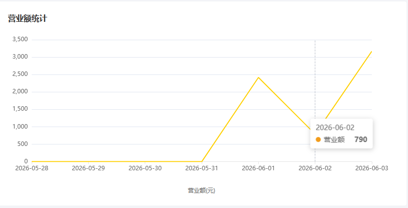

### 订单统计

最后，也是最复杂的订单统计。接口文档中要求，每天的订单统计数据必须同时拥有`订单总数`和`有效订单数`，有效订单是指所有已完成的订单，处于其他状态的订单都视为无效订单。

先来构造`SQL`语句，这里介绍两种查询方式

1. 查询所有状态以及对应的数量

```mysql
SELECT
    DATE(order_time) AS date,
    status,
    COUNT(status) AS count
FROM
    orders
GROUP BY
    date , status;
```

2. 直接查询当天订单总数以及有效订单数量

```java
SELECT
    DATE(order_time) AS order_date,
    COUNT(*) AS total_orders,
    SUM(CASE WHEN status = 5 THEN 1 ELSE 0 END) AS valid_orders
FROM
    orders
GROUP BY
    DATE(order_time)
ORDER BY
    order_date;
```

第二种方式可以后续逻辑与营业额统计相似，这里用第一种方式来举例

`Controller`

```java
/**
 * 订单统计
 * @param begin
 * @param end
 * @return
 */
@GetMapping("/ordersStatistics")
@ApiOperation("订单统计")
public Result<OrderReportVO> orderStatistics(String begin, String end) {
    OrderReportVO report = reportService.getOrderStatistics(LocalDate.parse(begin), LocalDate.parse(end));
    log.info("订单数据：{}", report);
    return Result.success(report);
}
```

`Mapper`

```java
/**
 * 获取指定日期的订单
 * @param begin
 * @param end
 * @return
 */
List<OrderReportDTO> getOrdersByDate(LocalDate begin, LocalDate end);
```

`Service`

在接收到来自数据库的订单数据后，照例生成所有日期，然后将订单数据同用户数据一样按照日期进行分组，构建为一个`Map`，再遍历`dateList`，判断是`Map`中是否包含对应的`Key`，包含则表示当天存在订单，获取`Map`中`date`对应的`List<OrderReportDTO>`，利用`Stream`计算总订单数以及有效订单数，有效的判断条件为`Objects.equals(order.getStatus(), Orders.COMPLETED)`，再更新`orderCountList`、`validOrderCountList`、`totalOrderCount`以及`totalValidOrderCount`。最后计算订单完成率，并封装为`OrderReportVO`

```java
/**
 * 订单统计
 * @param begin
 * @param end
 * @return
 */
@Override
public OrderReportVO getOrderStatistics(LocalDate begin, LocalDate end) {
    // 获取指定日期的订单数据
    List<OrderReportDTO> orderList = reportMapper.getOrdersByDate(begin, end);
    // 生成所有日期
    List<LocalDate> dateList = getBetweenDates(begin, end);
    // 将订单数据按日期分组
    Map<LocalDate, List<OrderReportDTO>> orderMap = orderList.stream()
            .collect(Collectors.groupingBy(OrderReportDTO::getDate));
    // 初始化结果列表和总计变量
    List<Integer> orderCountList = new ArrayList<>();
    List<Integer> validOrderCountList = new ArrayList<>();
    Integer totalOrderCount = 0;
    Integer totalValidOrderCount = 0;
    // 遍历日期，直接从 Map 中获取当天的订单数据
    for (LocalDate date : dateList) {
       Integer dailyOrderCount = 0;
        Integer dailyValidOrderCount = 0;

        if (orderMap.containsKey(date) && !orderMap.get(date).isEmpty()) {
            List<OrderReportDTO> dailyOrders = orderMap.get(date);
            // 计算当天的总订单数
            dailyOrderCount = dailyOrders.stream()
                    .mapToInt(OrderReportDTO::getCount)
                    .sum();
            // 计算当天的有效订单数（状态为 COMPLETED）
            dailyValidOrderCount = dailyOrders.stream()
                    .filter(order -> Objects.equals(order.getStatus(), Orders.COMPLETED))
                    .mapToInt(OrderReportDTO::getCount)
                    .sum();
        }
        orderCountList.add(dailyOrderCount);
        validOrderCountList.add(dailyValidOrderCount);
        // 累加总计
        totalOrderCount += dailyOrderCount;
        totalValidOrderCount += dailyValidOrderCount;
    }
    // 计算订单完成率
    Double orderCompletionRate = totalValidOrderCount.doubleValue() / totalOrderCount;
    // 封装VO对象并返回
    return OrderReportVO.builder()
            .dateList(
                    dateList.stream()
                            .map(LocalDate::toString)
                            .collect(Collectors.joining(","))
            )
            .orderCountList(
                    orderCountList.stream()
                            .map(String::valueOf)
                            .collect(Collectors.joining(","))
            )
            .validOrderCountList(
                    validOrderCountList.stream()
                            .map(String::valueOf)
                            .collect(Collectors.joining(","))
            )
            .totalOrderCount(totalOrderCount)
            .validOrderCount(totalValidOrderCount)
            .orderCompletionRate(orderCompletionRate)
            .build();
}
```

> 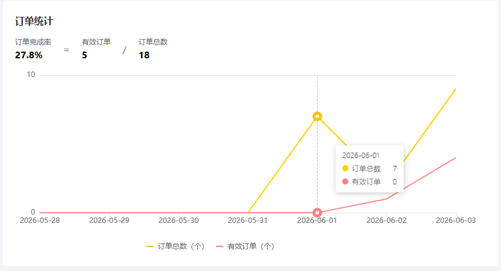

## Apcache POI

`Apache POI`是一个专门用于处理`Microsoft Office`相关文件格式的开源项目，简单来说，我们可以利用`POI`在`Java`程序中对`Microsoft Office`的文件进行读写操作。一般情况下，`POI`都用于操作`Excel`文件

### 快速入门

1. 引入依赖

```xml
<!-- poi -->
<dependency>
    <groupId>org.apache.poi</groupId>
    <artifactId>poi</artifactId>
</dependency>
<dependency>
    <groupId>org.apache.poi</groupId>
    <artifactId>poi-ooxml</artifactId>
</dependency>
```

2. `POI`代码的的可读性非常高，使用方式与我们正常使用`Excel`的方式相同，首先创建一个文件

```java
// 创建一个Excel工作簿
XSSFWorkbook workbook = new XSSFWorkbook();
```

3. 创建一个工作表

```java
// 创建一个工作表
Sheet sheet = workbook.createSheet("TestSheet");
```

4. 在工作表中创建行，在`POI`中，行与列的下标从0开始

```java
// 创建一个行
Row row = sheet.createRow(0);
```

5. 创建一个单元格

```java
// 创建一个单元格
Cell cell = row.createCell(0);
```

6. 为单元格设置字段值

```java
// 设置单元格的值
cell.setCellValue("Hello, World!");
```

7. 保存`Excel`文件

```java
// 保存Excel文件
try {
    workbook.write(Files.newOutputStream(Paths.get("D:\\test.xlsx")));
} catch (Exception e) {
    e.printStackTrace();
}
```

> 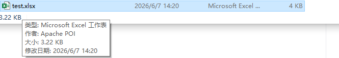

然后是文件读取操作

1. 读取文件

```java
// 读取文件
FileInputStream excel = new FileInputStream("D:\\test.xlsx");
XSSFWorkbook workbook = new XSSFWorkbook(excel);
```

2. 获取第一张工作表

```java
// 获取第一张工作表
Sheet sheet = workbook.getSheetAt(0);
```

3. 读取最后一行的行号，然后遍历行，获取每行数据

```java
// 获取最后一行行号
Integer lastRowNum = sheet.getLastRowNum();
// 遍历每一行
for (int i = 0; i <= lastRowNum; i++) {
    Row row = sheet.getRow(i);
}
```

4. 获取最后一个单元格列号，遍历所有单元格，获取单元格数据。需要注意，`poi`并没有提供统一接收单元格数据的方法，而是为不同数据类型的单元格设置了不同的接收方法，`STRING`类型使用`getStringCellValue()`，`NUMERIC`使用`getNumericCellValue()`，类型不匹配会报错，因此需要在接收之前先判断单元格数据类型

```java
// 获取最后一列列号
Short lastCellNum = row.getLastCellNum();
// 遍历每一列
for (int j = 0; j < lastCellNum; j++) {
    Cell cell = row.getCell(j);
    // 获取单元格的值
    String type = cell.getCellType().toString();
    System.out.print(type + "\t");
    switch (type) {
        case "NUMERIC":
            System.out.print(cell.getNumericCellValue() + "\t");
            break;
        case "STRING":
            System.out.print(cell.getStringCellValue() + "\t");
    }
}
```

> 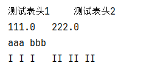

### 营业数据导出

`Controller`

数据下载功能可以直接利用`HttpServletResponse`的输出流，所以这里添加参数`HttpServletResponse response`

```java
/**
 * 数据导出
 * @param response
 */
@GetMapping("/export")
@ApiOperation("导出数据")
public void export(HttpServletResponse response) {
    reportService.export(response);
}
```

`Service`

逻辑相对有些复杂，我们来详细解析一下。首先从类目录下加载模板文件，因为报表文件的格式相对比较复杂，纯`POI`无法实现单元格合并，单元格样式调整等共功能，所以一般的解决方案是提供一个模板文件，每次导出时填充数据即可。然后设置导出数据的时间段，目前只设置一个月前的数据。接着使用`Mapper`中现有的各个接口调取数据库中的数据，使用`StreamAPI`进行统计，并插入`Excel`文件中。再调用先前提供的`getBetweenDates()`方法生成日期列表，转换为`Map<date, BusinessDataVO>`，这一步是因为`BusinessDataVO`并没有日期字段。然后遍历`map`，利用`StreamAPI`将对应日期的数据填充到`BusinessDataVO`中，最后将数据写入`Excel`文件。

```java
/**
 * 导出数据
 * @param response
 */
@Override
public void export(HttpServletResponse response) {
    // 加载模板
    ClassPathResource template = new ClassPathResource("/template/运营数据报表模板.xlsx");
    try {
        Workbook workbook = new XSSFWorkbook(template.getInputStream());
        Sheet sheet = workbook.getSheet("Sheet1");
        // 设置时间段
        LocalDate begin = LocalDate.now().minusDays(30);
        LocalDate end = LocalDate.now().minusDays(1);
        sheet.getRow(1).getCell(1).setCellValue(begin + "至" + end);
        // 设置概览数据
        List<TurnoverDTO> turnoverDTOS = reportMapper.getTurnoverStatistics(begin, end);
        // 营业额
        Double totalTurnover = turnoverDTOS.stream()
                // 获取营业额
                .map(TurnoverDTO::getTurnover)
                // BigDecimal转换为Double
                .mapToDouble(BigDecimal::doubleValue)
                .sum();
        sheet.getRow(3).getCell(2).setCellValue(totalTurnover);
        // 订单完成率
        // 获取指定日期的订单数据
        List<OrderReportDTO> orderList = reportMapper.getOrdersByDate(begin, end);
        // 统计总订单数量
        Integer totalOrderCount = orderList.stream()
                .mapToInt(OrderReportDTO::getCount)
                .sum();
        // 统计有效订单数量
        Integer validOrderCount = orderList.stream()
                .filter(order -> Objects.equals(order.getStatus(), Orders.COMPLETED))
                .mapToInt(OrderReportDTO::getCount)
                .sum();
        Double orderCompletionRate = validOrderCount.doubleValue() / totalOrderCount;
        // 保留2位小数
        String orderCompletionRateStr = String.format("%.2f", orderCompletionRate * 100);
        sheet.getRow(3).getCell(4).setCellValue(orderCompletionRateStr + "%");
        // 新增用户数量
        List<User> userList = reportMapper.getUsersByCreateTime(begin, end);
        Integer newUserCount = userList.size();
        sheet.getRow(3).getCell(6).setCellValue(newUserCount);
        // 有效订单数量
        sheet.getRow(4).getCell(2).setCellValue(validOrderCount);
        // 平均客单价
        Double avgOrderPrice = totalTurnover / validOrderCount;
        String avgOrderPriceStr = String.format("%.2f", avgOrderPrice);
        sheet.getRow(4).getCell(4).setCellValue(avgOrderPriceStr);

        // 明细数据
        // 日期列表
        List<LocalDate> dateList = getBetweenDates(begin, end);
        // 生成一个Map<date, BusinessDataVO>
        Map<LocalDate, BusinessDataVO> map = dateList.stream()
                .collect(Collectors.toMap(
                        key -> key,
                        value -> new BusinessDataVO()
                ));
        // 遍历map，将对应日期的数据填充到BusinessDataVO中
        for (Map.Entry<LocalDate, BusinessDataVO> entry : map.entrySet()) {
            LocalDate date = entry.getKey();
            BusinessDataVO businessDataVO = entry.getValue();
            // 获取指定日期的营业额
            Double turnover = turnoverDTOS.stream()
                    .filter(turnoverDTO -> Objects.equals(turnoverDTO.getDate(), date))
                    .map(TurnoverDTO::getTurnover)
                    .findFirst()
                    .orElse(BigDecimal.ZERO)
                    .doubleValue();
            businessDataVO.setTurnover(turnover);
            // 获取指定日期的订单数据
            totalOrderCount = orderList.stream()
                    .filter(order -> Objects.equals(order.getDate(), date))
                    .mapToInt(OrderReportDTO::getCount)
                    .sum();
            validOrderCount = orderList.stream()
                    .filter(order -> Objects.equals(order.getDate(), date) && Objects.equals(order.getStatus(), Orders.COMPLETED))
                    .mapToInt(OrderReportDTO::getCount)
                    .sum();
            orderCompletionRate = validOrderCount.doubleValue() / totalOrderCount;
            businessDataVO.setOrderCompletionRate(orderCompletionRate.isNaN() ? 0.0 : orderCompletionRate);
            businessDataVO.setValidOrderCount(validOrderCount);
            // 获取指定日期的新增用户数量
            newUserCount = (int) userList.stream()
                    .filter(user -> user.getCreateTime().toLocalDate().equals(date))
                    .count();
            businessDataVO.setNewUsers(newUserCount);
            // 平均客单价
            avgOrderPrice = turnover / validOrderCount;
            businessDataVO.setUnitPrice(avgOrderPrice.isNaN() ? 0.0 : avgOrderPrice);
        }
        // 填充数据到sheet中，工作区域是B8到G37
        for (int i = 0; i < 30; i++) {
            // 日期
            sheet.getRow(i + 7).getCell(1).setCellValue(dateList.get(i).toString());
            // 营业额
            sheet.getRow(i + 7).getCell(2).setCellValue(map.get(dateList.get(i)).getTurnover());
            // 有效订单数量
            sheet.getRow(i + 7).getCell(3).setCellValue(map.get(dateList.get(i)).getValidOrderCount());
            // 订单完成率
            sheet.getRow(i + 7).getCell(4).setCellValue(map.get(dateList.get(i)).getOrderCompletionRate());
            // 平均客单价
            sheet.getRow(i + 7).getCell(5).setCellValue(map.get(dateList.get(i)).getUnitPrice());
            // 新增用户数量
            sheet.getRow(i + 7).getCell(6).setCellValue(map.get(dateList.get(i)).getNewUsers());
        }

        // 输出流
        OutputStream outputStream = response.getOutputStream();
        workbook.write(outputStream);
        // 关闭流
        outputStream.close();
        workbook.close();
    } catch (IOException e) {
        throw new ExportFailedException(MessageConstant.EXPORT_EXCEL_FAILED);
    }
}
```

> 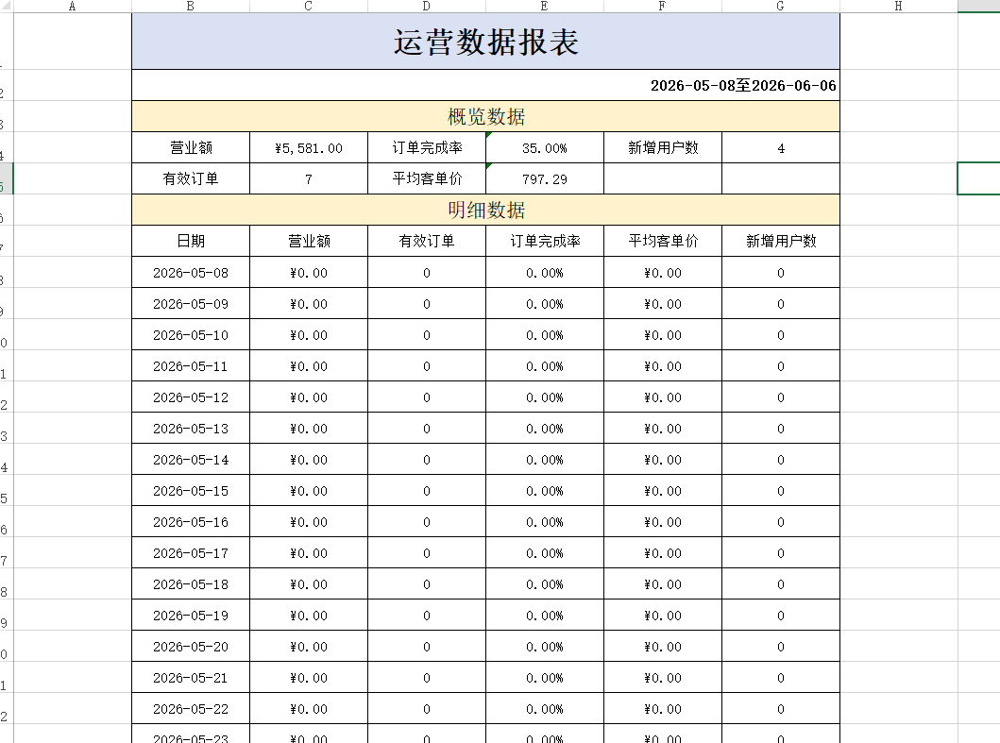

到此，苍穹外卖项目完结
