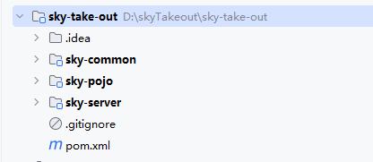
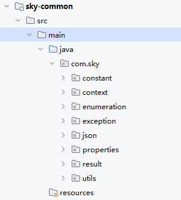
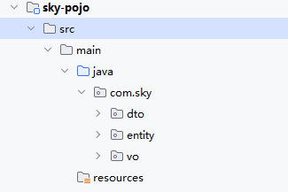
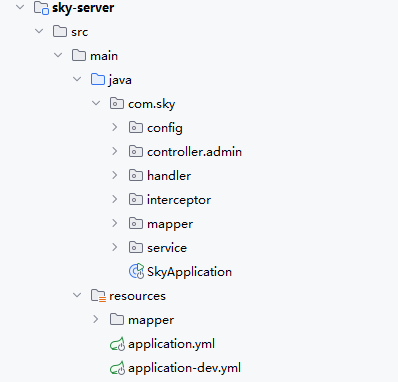

# Java Web Advance

`更新时间：2026-5-13`

注释解释：

- `<>`必填项，必须在当前位置填写相应数据

- `{}`必选项，必须在当前位置选择一个给出的选项

- `[]`可选项，可以选择填写或忽略

*注：该笔记内的可选项和参数均不完整，如有需要，请查询相关手册*

---

从`Java Web Advance`开始，我们将尝试构建一个真正能够实际上线的大型项目

## 项目介绍

我们将制作一个外卖点餐项目，包含用户和商家两个用户层级，普通用户层我们使用微信小程序作为前端界面，商家层面我们使用桌面浏览器作为前端。

**技术选型**

在该项目中，我们会使用以下的技术栈

用户层：`node.js`、`vue.js`、`ElementUI`、`WeChat`、`Apache echarts`

网关层：`Nginx`

应用层：`Spring Boot`、`Spring MVC`、`Spring Task` 、`Httpclient`、`Spring Cache`、`JWT`、`阿里云OSS2`、`Swagger`、`POI`、`WebSocket`

数据层：`MySQL`、`Redis`、`MyBatis`、`Pagehelper`、`Spring Data Redis`

工具类：`Git`、`Maven`、`Junit`、`Postman`

为了注重于后端开发，我们将直接跳过前端开发，使用现有的前端项目[skyTakeout](./projects/skyTakeout_frontEnd/html/sky/index.html)。

## 后端环境搭建

为了便于开发，我们也直接导入一个初始工程，从初始工程入手来完善项目

### 项目初识

拿到一个新的项目，我们应该对项目有一个基本的认识

> 

初始项目由四部分构成

| 模块名         | 说明                                               |
| -------------- | -------------------------------------------------- |
| `sky-take-out` | 父工程，统一管理依赖版本，聚合其他子模块           |
| `sky-common`   | 子模块，存放公共类，如工具类、常量类、异常类等等   |
| `sky-pojo`     | 子模块，存放实体类、`VO`、`DTO`等等                |
| `sky-server`   | 子模块，后端服务主模块，存放配置文件，逻辑文件等等 |

**sky-common**

> 

`sky-common`中包含了常量、上下文相关、枚举类、异常、`JSON`处理、配置、结果封装、工具类

**sky-pojo**

> 

`sky-pojo`中存放所有实体类，一般包括

| 类别     | 说明                                               |
| -------- | -------------------------------------------------- |
| `Entity` | 实体，通常和数据库中的表直接对应                   |
| `DTO`    | 数据传输对象，通常用户程序中各层之间传递数据       |
| `VO`     | 视图对象，为前端展示数据提供的对象                 |
| `POJO`   | 普通`Java`对象，只有属性和对应的`getter`和`setter` |

**sky-server**

> 

`sky-server`才是实质上的主目录，`SpringBoot`的配置文件，启动类也位于`sky-server`中