# Java Web Enhance

`更新时间：2026-7-17`

注释解释：

- `<>`必填项，必须在当前位置填写相应数据

- `{}`必选项，必须在当前位置选择一个给出的选项

- `[]`可选项，可以选择填写或忽略

*注：该笔记内的可选项和参数均不完整，如有需要，请查询相关手册*

---

## Redis主从集群

单节点Redis的并发能力是有上限的，因此要进一步提高Redis的并发能力，就需要搭建主从集群，实现读写分离。而主从集群是指，一台Web服务器连接Redis时，可以提供由多个Redis服务器组成的集群，而在这个集群中每个Redis服务器的角色是不同的， 分为master和slave/replica，master一般负责写，布置较少，slave/replic负责读，布置较多，这样可以大大提升Redis的读性能

而为了保证数据一致，需要master节点将数据同步给slave节点，以保证在任何slave节点都能够读取到正确的数据

### 建立主从集群

建立Redis主从集群有两种方式，第一种是在Redis命令台中输入命令来配置主从关系，这种方式是临时生效的

```bash
# Redis 5.x之前
slaveof <masterIp> <masterPort>
# Redis 5.x之后
replicaof <masterIp> <masterPort>
```

*注：slaveof在5.x之后同样可用，master节点不需要命令，默认所有节点均为master*

第二种则是在配置文件redis.conf中使用slaveof指定master节点，注册为其slave节点，这种方式是永久生效的

```conf
slaveof <masterIp> <masterPort>
```

*注：一般不采用配置方式，因为主从关系很可能会变动*

在启用Redis后，可以通过命令info replication来查看当前服务的主从关系

> 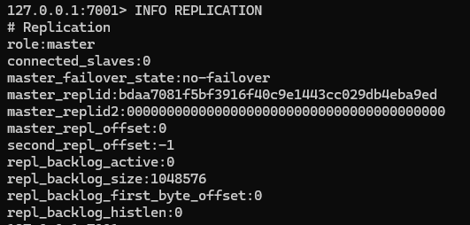

现在我们准备三个Redis服务，端口分别为7001、7002、7003，7001为master，其余的为slave。需要注意的是，不要使用windows的Redis5.x版本，windows的Redis5.x版本存在已知问题，主从集群无法正确连接

> 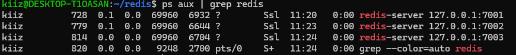

在7002中输入

```bash
SLAVEOF localhost 7001
```

然后检查关系状态，确认role为slave，并且master_link_status为up，保证主从连接成功

> 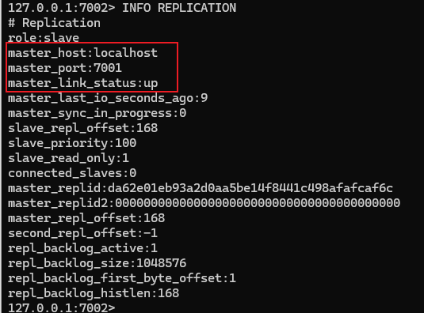

7003执行同样的步骤

> 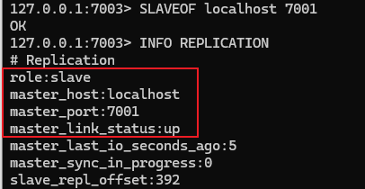

登录7001，查看7001的slave状态

> 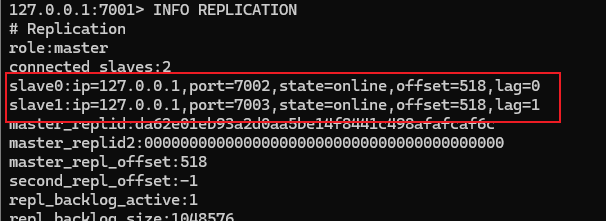

Redis主从集群默认是同步的，而且仅有master节点拥有写权限。我们先尝试在7002中写数据

> 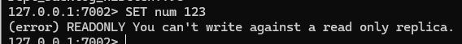

提示仅有读权限，然后我们在7001中写入一个num，再使用7002读取

> 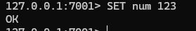
>
> 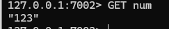

### 主从同步原理

当主从第一次同步连接，或者由于某些原因断开重连时，从节点都会发送一个psync请求，尝试数据同步。主节点在接收到psync请求后，先判断从节点是否为第一次同步，如果是第一次同步，则向从节点发送自己的全部数据，这种同步被称为全量同步；如果从节点不是第一次同步，而是断开重连，则主节点没必要进行全量同步，而是将从节点缺少的数据发送给从节点，这种同步被称为增量同步。在连接保持时，每当主节点写数据，都会将命令发送给所有从节点，保持实时同步

> 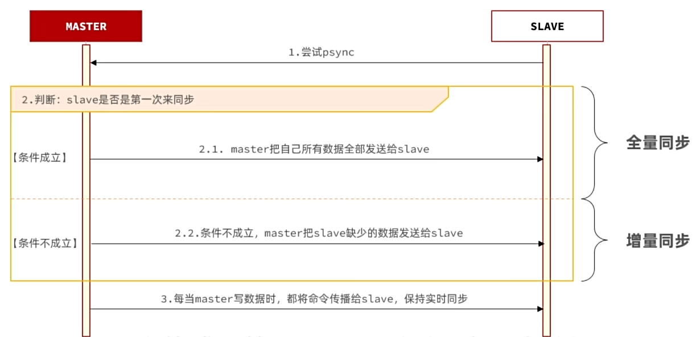

#### 首次连接判断

在建立主从集群之前，每个Redis服务都有一个属于自己的replicationID，简称replid，并且每个服务的id都不同

> 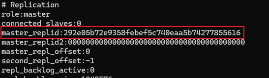

而在主从集群建立之后，master节点会重新生成一个replid，并将自己的id分享给所有的slave节点，简单来说，主从集群中所有的redis服务共用一个replid

> 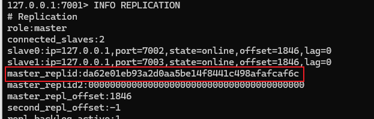
>
> 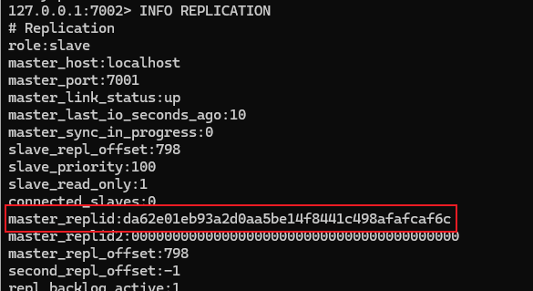

而判断是否为第一次同步就是依据replid，如果replid与当前主从集群的id一致，则说明该节点先前与master有过同步记录，因此下一步进行增量同步；而如果replid与当前主从集群的id不一致，则说明是第一次同步，需要全量同步

#### 同步机制

##### 全量同步

Redis为了保证数据安全，会定期将内存中的数据写入磁盘，保存为一份rdb文件，这被称为bgsave，当从节点需要全量同步时，主节点直接将这份rdb文件发送给从节点，从而完成数据同步

> 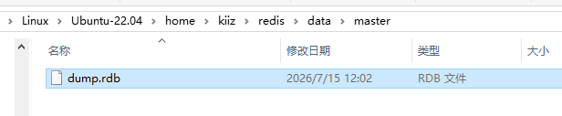

##### 增量同步

假设从节点因为网络故障异常断开，网络恢复后又重新连接，这时就需要进行增量同步。但检查数据增量是非常麻烦的，所以Redis在进行增量同步时并不是发送数据增量，而是从节点缺失的命令增量。在Redis中，有一个repl_backlog文件，用于记录master执行的命令，repl_backlog的创建时机是第一个从节点连接成功的时刻立即创建，然后开始记录命令，这样当任意从节点在任意时刻断开连接，主节点都能拥有完整的命令记录。而增量同步的核心思想是利用一个offset偏移值，offset记录了repl_backlog文件的长度，保持连接时，主节点与从节点的offset保持一致，而断开连接后，主节点offset继续增大，从节点offset保持不变。一旦从节点重新连接，只要获取了从节点的offset值，就可以得知从节点是何时断开连接，并且也能得知从节点缺少哪些命令，然后主节点再将缺失的命令发送给从节点

> 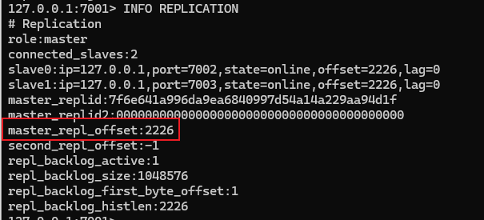
>
> 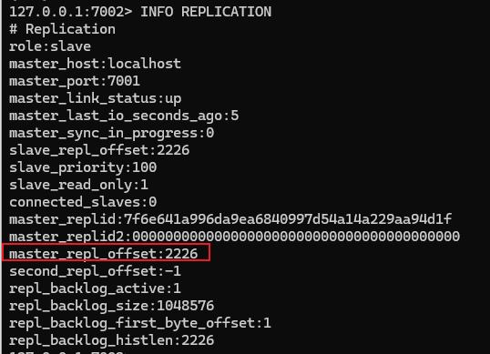

#### 同步优化

上文我们提到，增量同步的重点在于repl_backlog文件记录主节点命令，但是当主节点命令越来越多，repl_backlog文件也越来越大，repl_backlog默认位于内存中，如果容量太大，会直接影响Redis的运行安全，因此Redis针对repl_backlog文件的大小进行了限制，默认最大仅为1Mib。而一旦对repl_backlog文件容量进行限制，就又会出现新的问题，假设repl_backlog文件被写满，又该如何记录命令？这里Redis为repl_backlog设计了一个特殊的数据结构，repl_backlog是一个环形数组，当数组填满时，新的数据会从0开始覆盖旧的数据，避免repl_backlog被写满。

但这又会引出新的问题，假设环形数据的下标最大值为1000，目前主从节点的offset位于127，此时某个从节点因为网络原因断开连接，而主节点继续执行命令，由于命令较多，repl_backlog文件被写满，只能从0下标开始覆盖，直到超过127。一段时间后，网络恢复，从节点重新连接主节点，但此时从节点的offset已经被新的值覆盖，增量同步完全失效，所以就只能进行全量同步。

而全量同步应当尽量避免，因为dump.rdb文件在长期使用后可能达到Gib级别，从内存写入磁盘，再从磁盘由网络发送到从节点会非常消耗主节点服务器资源，导致严重的性能问题

针对以上问题，我们可以实施下列的几种优化方案：

- 在master中配置repl-diskless-sync yes启用无磁盘复制，在全量同步时直接从内存中传输数据，避免磁盘IO
- 设置Redis单节点内存占用限制，减少rdb文件导致的过多磁盘IO
- 适当提高repl_backlog文件大小，尽快修复从节点故障，避免从节点offset被覆盖，从而避免全量同步
- 限制一个master上的从节点数量，或是采用主从从链式结构，减少master压力

### 哨兵

上文我们提到的问题都是基于从节点故障的情况，但如果是主节点故障，就会产生非常严重的影响。因此Redis提供了哨兵机制来实现主从集群的自动故障恢复。

哨兵是独立于Redis主从集群之外的服务，并且为了避免哨兵本身存在异常，通常会布置多个哨兵服务形成哨兵集群。哨兵的主要工作内容是监控主从集群中各个节点的运行情况，如果此时主节点发生异常断开连接，哨兵也能将某个从节点提升为新主节点，从而保持业务的正常运行。当原来的主节点恢复后，原来的主节点将会被降级为从节点。当主从集群发生故障时，哨兵也需要将新的主节点与从节点的信息推送到Redis客户端

#### 服务监控

哨兵的服务状态监控基于心跳机制，即每隔1秒向集群的所有节点发送一个PING命令，Redis默认在接收到PING命令后会返回一个PONG

> 

如果某个哨兵发现某个节点在规定时间内未响应PONG，则该实例对于哨兵主观下线。当超过指定数量 quorum 的哨兵都认为某节点主观下线时，则认为该实例客观下线，从而认定服务失效。quorum的值应当超过哨兵数量的一半

#### master选举

一旦master故障，哨兵就需要在slave中重新挑选一个新的master，选择依据如下：

- 判断slave节点与master节点断开时间长短，如果超过指定值，则会排除该slave节点。这个值由 down-after-millisecondes \* 10来得到
- 判断slave节点的slave-priority值，也就是优先级，值越小优先级越高，如果值为0则表示永不参与选举。默认值为1
- 判断slave节点的offset值，越大说明数值越新，优先级越高
- 判断slave节点的运行id，id越小优先级越高。但实际上运行id是随机生成的，也就等同于随机选举

这四条选举规则是顺序进行的，只有先满足上面的，再对下一条进行匹配

当新的master选举成功后，哨兵会向其发送一条SLAVEOF NO ONE命令，让该节点提升为master，然后向其他所有节点发送SLAVEOF \<NEW MASTER HOST\> \<NEW PORT\>命令，让其余的所有节点成为新master的slave节点，开始从新的master节点中同步数据。而旧master会被标记为slave，当节点修复后，自动成为新的master的slave节点

#### 哨兵集群

##### 搭建哨兵集群

首先需要关闭当前的主从集群

> 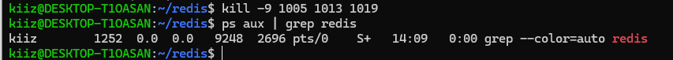

然后编写sentinel.conf配置文件，这里提供了一份最小可用文件

在哨兵的配置文件中，只需要指定master节点的ip以及端口即可，从节点的相关数据能够通过主节点获取

```conf
port 27001
daemonize yes
pidfile "/home/kiiz/redis/sentinel/s1.pid"
logfile "/home/kiiz/redis/sentinel/s1.log"
dir "/home/kiiz/redis/sentinel/data/s1"

# 监控主节点 IP 端口 以及法定票数(quorum)
sentinel monitor mymaster 127.0.0.1 7001 2

# 判定主节点下线的时间阈值（毫秒）
sentinel down-after-milliseconds mymaster 5000

# 故障转移超时时间
sentinel failover-timeout mymaster 60000
```

然后复制多个配置文件，修改端口以及pidfile、logfile和dir位置，启动哨兵集群

哨兵可以通过redis-server和redis-sentinel两种方式来启动，如果通过redis-server，则需要添加参数--mode=sentinel，而redis-sentinel则需要单独安装

> 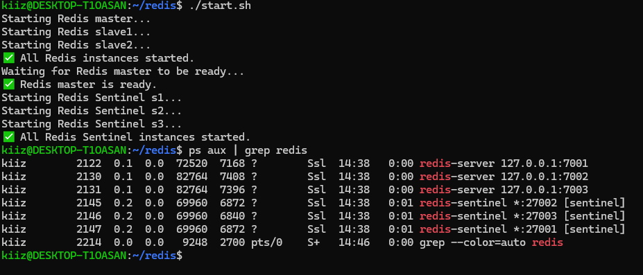

通过redis-cli连接其中一个哨兵，输入命令INFO SENTINEL来查看哨兵集群情况

> 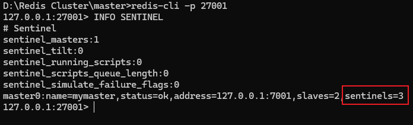

##### 哨兵集群工作流程

现在我们停止master，模拟主节点宕机

> 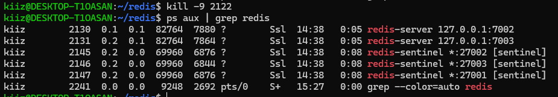

在master断开后，s2首先检测到，然后发送了一条`+sdown master mymaster 127.0.0.1 7001`主观下线通知，而后s1检测到，也发送了一条+sdown主观下线通知，最后是s3

> 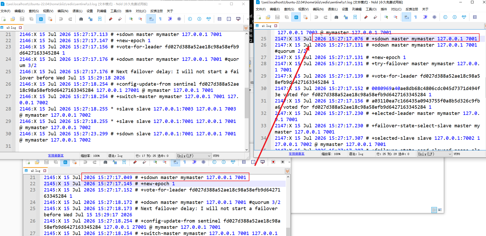

我们设置的quorum为2，因此在s1中，当quorum满足2/2时，发送了一条`+odown master mymaster 127.0.0.1 7001 #quorum 2/2`客观下线通知

> 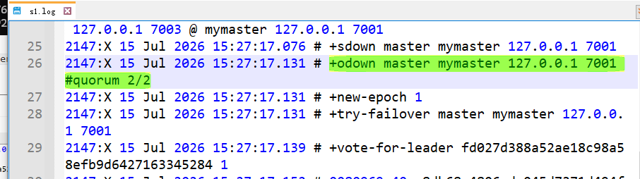

然后哨兵集群协商故障转移主导，也就是`+vote-for-leader`，一般来说，谁最先发送+odown通知，谁主导故障转移，因此s1为自己投了一票

> 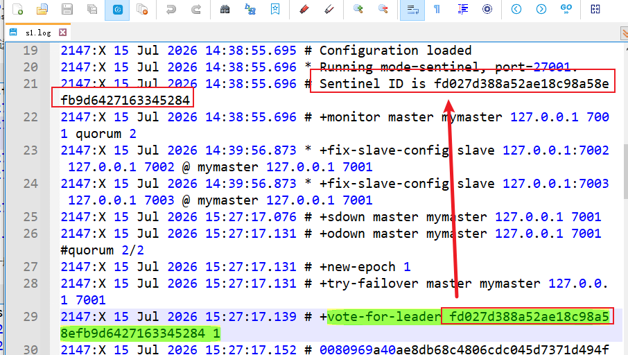

然后s2和s3也都为s1投票

> 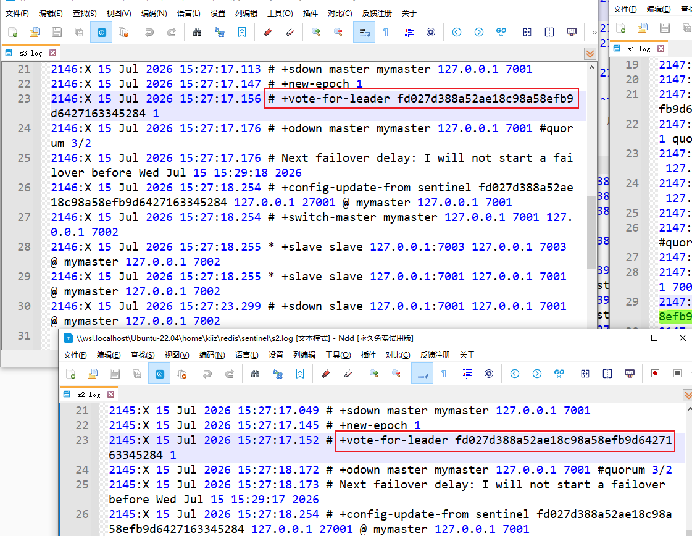

现在确认由s1主导，因此s1发布了`+elected-leader`担任通知

> 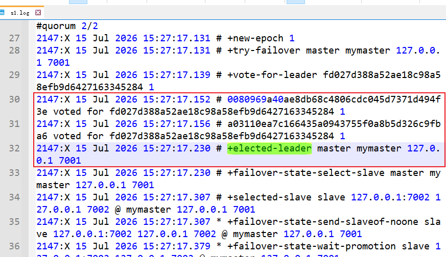

然后s1开始进行故障转移，首先选举新的master，这里选中了7002

> 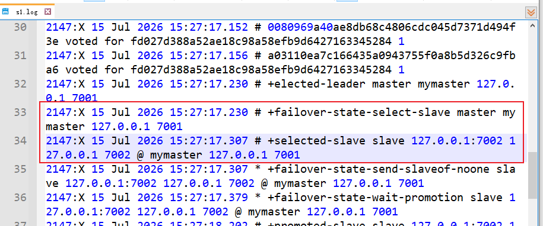

选中7002后，s1下发SLAVEOF ON ONE命令，将7002提升为master

> 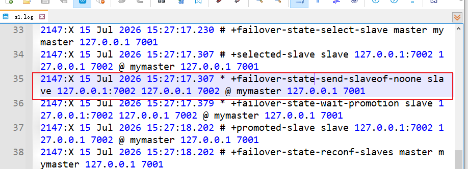

新的master被选举后，s1向其他节点发送通知，告知新的master，以及旧的master被降级

> 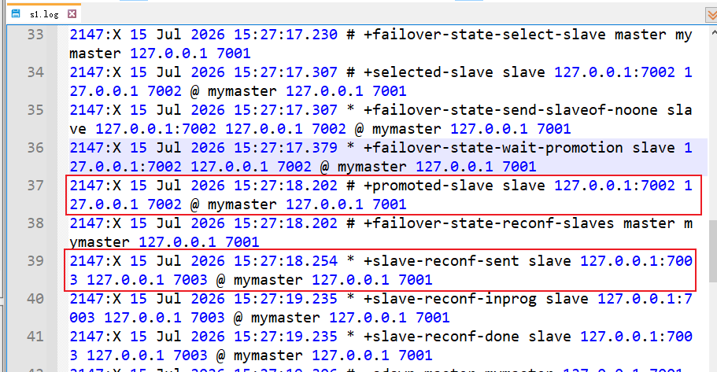

故障转移后，s1随即下发-odown，宣布事实下线事件结束，同时切换master，然后宣布子节点主观下线

> 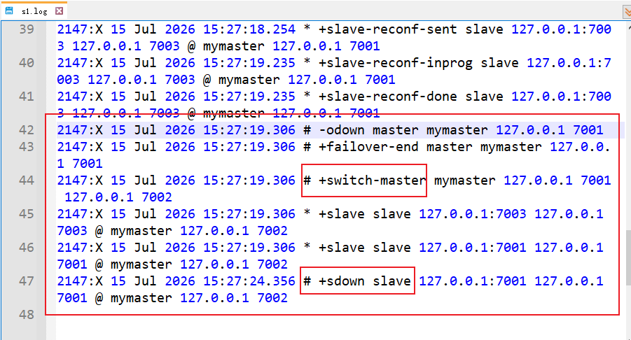

此时我们再重启旧master

> 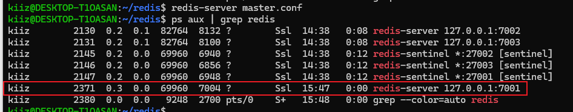

s1检测到7001上线后，关闭slave sdown主观下线，并将其降级为slave

> 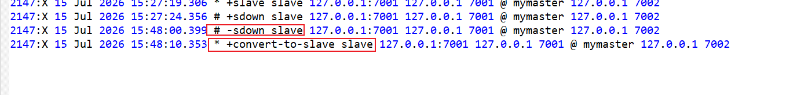

最后我们通过redis-cli来检查7001是否被降级

> 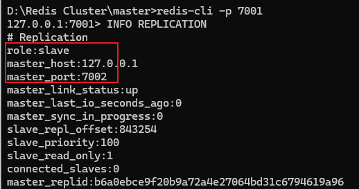

## Redis分片集群

主从和哨兵集群可以解决高可用，高并发读的问题，但是依然无法解决海量数据存储以及高并发写的问题。而分片集群则可以解决这些问题，分片集群的特征是集群中有多个master，每个master保存不同的数据，每个master都可以有多个slave节点，而master之间都可以进行类似sentinel的健康状态检测，当检测到某一个master不可用时，也能够从slave中选举出新的master

### 搭建分片集群

我们部署一个简单的分片集群，准备三个master，每个master只拥有一个slave。首先创建对应的配置项，分片集群的配置项中必须添加cluster相关的配置，以下是一个最小可用配置

```conf
# ========== 网络绑定 ==========
bind 127.0.0.1
port 7001
protected-mode yes

# ========== 后台运行 ==========
daemonize yes
pidfile /home/kiiz/redis/data/r1/r1.pid

# ========== 日志 ==========
loglevel notice
logfile /home/kiiz/redis/data/r1/r1.log

# ========== 持久化（最小 RDB） ==========
save 900 1
save 300 10
save 60 10000
dir /home/kiiz/redis/data/r1/
dbfilename dump.rdb

# ========== 内存控制（推荐） ==========
maxmemory 256mb
maxmemory-policy allkeys-lru

# ========== 关闭 AOF ==========
appendonly no

# ========== Cluster 必须项 ==========
cluster-enabled yes
cluster-config-file nodes.conf
cluster-node-timeout 5000
```

然后依据这个模板，我们创建r2-r6，同时注意data中应包含r1-r6的目录用于存放数据文件

> 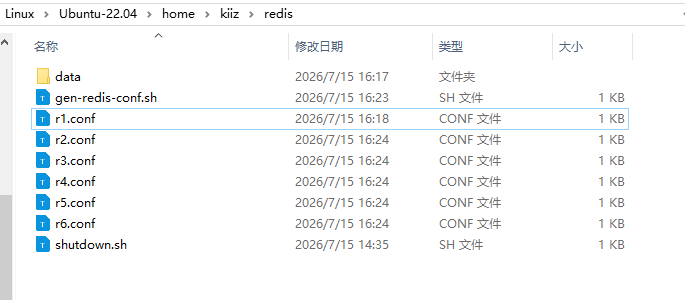

接着启动所有的redis-server，同时创建一个集群，设置三主三从，然后将所有redis-server添加到集群中。这里集群会自动选择主从归属，不需要我们手动指定，默认情况下，会先分配master，再分配slave

```bash
#!/bin/bash

BASE_DIR="/home/kiiz/redis"

# ========== 1. 启动所有 Redis 实例 ==========
echo "🚀 启动 Redis 实例..."

for i in {1..6}; do
  CONF="${BASE_DIR}/r${i}.conf"
  if [ -f "${CONF}" ]; then
    redis-server "${CONF}"
    echo "✅ r${i} 启动成功 (port 700${i})"
  else
    echo "❌ 配置文件不存在: ${CONF}"
    exit 1
  fi
done

# ========== 2. 等待节点就绪 ==========
echo "⏳ 等待 Redis 节点就绪..."
sleep 2

# ========== 3. 创建集群 ==========
echo "🔧 创建 Redis Cluster (replicas = 1)..."

yes yes | redis-cli --cluster create \
  127.0.0.1:7001 \
  127.0.0.1:7002 \
  127.0.0.1:7003 \
  127.0.0.1:7004 \
  127.0.0.1:7005 \
  127.0.0.1:7006 \
  --cluster-replicas 1

echo "✅ Redis Cluster 创建完成"
```

> 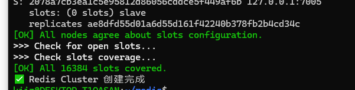

同时也能观察到集群自动选择了master及其对应的slave，如预期所料，r1-r3被选为了master，而r4-r6为slave

> 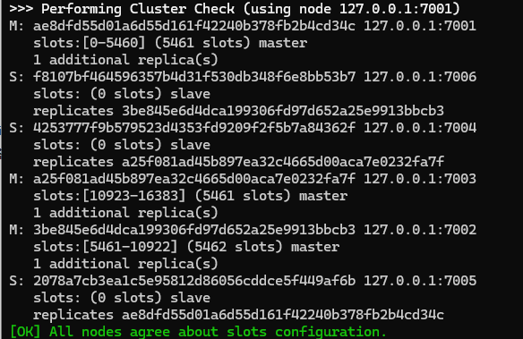

然后我们访问r1，从r1处获取集群信息

```bash
kiiz@DESKTOP-T1OASAN:~/redis$ redis-cli -p 7001 cluster nodes
f8107bf464596357b4d31f530db348f6e8bb53b7 127.0.0.1:7006@17006 slave 3be845e6d4dca199306fd97d652a25e9913bbcb3 0 1784105425000 2 connected
ae8dfd55d01a6d55d161f42240b378fb2b4cd34c 127.0.0.1:7001@17001 myself,master - 0 1784105426000 1 connected 0-5460
4253777f9b579523d4353fd9209f2f5b7a84362f 127.0.0.1:7004@17004 slave a25f081ad45b897ea32c4665d00aca7e0232fa7f 0 1784105425529 3 connected
a25f081ad45b897ea32c4665d00aca7e0232fa7f 127.0.0.1:7003@17003 master - 0 1784105425027 3 connected 10923-16383
3be845e6d4dca199306fd97d652a25e9913bbcb3 127.0.0.1:7002@17002 master - 0 1784105426000 2 connected 5461-10922
2078a7cb3ea1c5e95812d86056cddce5f449af6b 127.0.0.1:7005@17005 slave ae8dfd55d01a6d55d161f42240b378fb2b4cd34c 0 1784105426330 1 connected
```

从左往右看，第一列为NodeID，节点唯一标识，用于标识集群中的节点；第二列是节点地址，127.0.0.1:7006是节点所在网络地址，@17006是集群总线端口，这个端口由port + 10000得来，用于节点间gossip通信，因此防火墙必须放行该端口；第三列是集群角色，一般为master和slave，当前节点用myself标识；第四列是主节点NodeID，仅有slave节点才有这个属性，因此所有的master节点第四列为-；第五列为Redis内部的flag位编码，0标识正常，非零值标识可能存在某些异常；第六列为最近一次集群状态变更时间戳，单位毫秒；第七列为集群逻辑时钟，这里暂不做介绍；第八列为链路状态，connected标识正常连接，其余状态还有disconnected不可达，fail?意思下线，fail确认下线；master节点还有第九行slot分配范围，这里也暂不做介绍

### 散列插槽

master节点的第九行的slot全程为Hash Slot散列插槽，Redis中共有16384个插槽，在分片集群中，会将所有的插槽分配给集群中的每一个master节点。Redis数据并不与节点绑定，而是与插槽Slot绑定。当需要读写数据时，Redis基于CRC16算法对key进行hash运算，得到的结果与16384模运算，从而得到这个key的slot值，然后到插槽对应的Redis节点进行读写操作

Redis的Hash运算相较常规运算有些不同，当key中包含大括号`{}`时，Redis会取大括号中的字符串来计算hash slot，如果不包含大括号，则会按照原始字符串来进行计算。大括号的一个重要作用是将数据存储在同一个节点上

**示例**

假设我们需要存储用户ocean的信息，先连接7001，然后执行命令SET user ocean

> 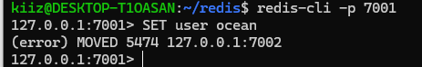

这时却出现了报错，因为定义的key为user，而user在进行slot运算后得到的结果为5474，插槽5474位于7002上，因此Redis不允许我们在7001上插入数据。这里需要在redis-cli后添加一个-c参数，启用cluster模式，这样redis-cli就可以帮我们自动跳转

> 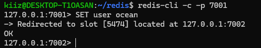

然后我们再设置用户年龄22，执行命令SET age 22，结果又跳转回了7001

> 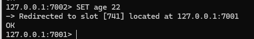

如果此时想要获取用户名GET user，又得跳转到7002，这样就显得非常麻烦，因此可以使用大括号来为key添加一个前缀，例如{user}:name设置用户名，{user}:age设置用户年龄，以保证用户信息存储在一个节点中

> 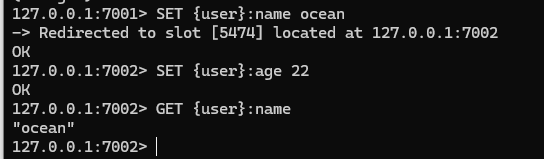

## Redis数据结构

### RedisObject

Redis中的任意数据类型的键和值都会封装为一个RedisObject，又称为Redis对象，其C语言源码如下

使用struct关键字定义了一个结构体redisObject，并使用typedef为其设置了一个别名为robj

```c
typedef struct redisObject {
    unsigned type:4;
    unsigned encoding:4;
    unsigned lru:LRU_BITS; // LRU_BITS为24
    int refcount;
    void *prt;
} robj;
```

- type：unsigned无符号整型，type:4表示占用4个bit，仅二分之一字节，type用于表示Redis数据类型，即string、list、set、zset、hash。而其他的扩展数据类型，如Bitmap、HyperLogLog、GeoSpatial等都是基于普通数据类型来实现的，因此不需要专属的type

```c
#define OBJ_STRING 0
#define OBJ_LIST 1
#define OBJ_SET 2
#define OBJ_ZSET 3
#define OBJ_HASH 4
```

- encoding：unsigned无符号整型，占4个bit，用于表示数据编码方式，例如对于string类型的数据，长度小于20的会设置为int，长度大于20会设置为embstr，而对于字符串，长度小于44的使用embstr，大于44则使用raw。Redis针对不同的数据类型，根据其不同的特征使用不同的编码方式，这样可以提升Redis性能，并减少资源消耗

> 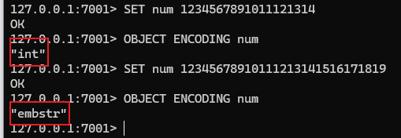
>
> 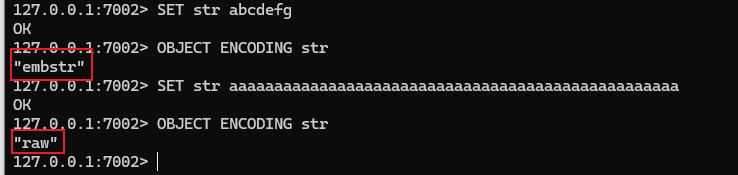

编码方式总共有12种，如下：

| 编号 | 编码方式   | 说明                   |
| ---- | ---------- | ---------------------- |
| 0    | RAW        | raw编码动态字符串      |
| 1    | INT        | long类型的整数字符串   |
| 2    | HT         | 哈希表                 |
| 3    | ~~ZIPMAP~~ | 早期哈希实现，现已废弃 |
| 4    | LINKEDLIST | 双向链表               |
| 5    | ZIPLIST    | 压缩列表               |
| 6    | INTSET     | 整数集合               |
| 7    | SKIPLIST   | 跳表                   |
| 8    | EMBSTR     | 动态字符串             |
| 9    | QUICKLIST  | 快速列表               |
| 10   | STREAM     | Stream流               |
| 11   | LISTPACK   | 紧凑列表               |

数据类型对应编码方式如下：

| 数据类型 | 编码方式                                         |
| -------- | ------------------------------------------------ |
| STRING   | INT、EMBSTR、RAW                                 |
| LIST     | LINKEDLIST和ZIPLIST（<3.2）、QUICKLIST（>=3.2）  |
| SET      | INTSET、HT                                       |
| ZSET     | ZIPLIST（<7.0）、LISTPACK（>=7.0）、HT、SKIPLIST |
| HASH     | ZIPLIST（<7.0）、LISTPACK（>=7.0）、HT           |

- lru：unsigned无符号整型，默认长度是常量LRU_BITS，24bit，也就是三字节，用于记录该对象最后一次被访问时间
- refcount，int整型，默认长度一般为四字节32bit，用于表示对象引用计数，计数器为0表示没有对象引用，可以被回收以释放内存
- \*ptr：指针，指向真实数据的保存地址，一般为八字节   

### SkipList 

跳表是一种双向链表，但与传统的链表结构有所不同。传统链表结构中，中间位数据的索引是一大难题，假设需要访问一个中间位数据，则需要从头或者从尾部开始遍历，每次遍历一个元素，直到访问目标数据

而跳表将数据升序进行排列，并且允许每个节点存在多个指针，指针的跨度可以大于1。举个例子，假设存在一个跳表，跳表中存储了1-20的数据

> 

在普通链表中，如果要查询第10号元素，无论首尾开始，时间复杂度均为O(n)，也就是需要遍历10次才能访问到目标元素。而跳表则是加入一些跳跃指针，例如直接在元素1中添加一个指向元素10的指针，元素10再指向元素20，这时如果想要查询10，时间复杂度就变成了O(1)

> 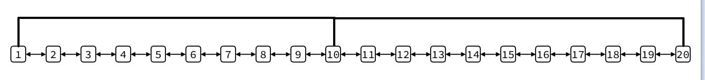

但如果想要查询第15号元素，这时的时间复杂度又变成了O(6)，所以我们可以再设定一级跳跃指针，由1指向7，7指向15，15再指向20，此时的时间复杂度缩短为了O(2)

> 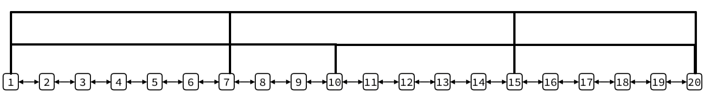

在跳表中，原始的跨度为1的指针被称为一级指针，跨度大于的1的指针，根据定义跨度分级的不同可以成为二级、三级指针等等。跳表允许的最大指针分级为32级，因此在大长度链表中，可以定义多级多跨度指针，以求最佳的查询效率。假设我们定义每级指针的跨度是上级的二倍，那么跳表就可以支持最大$2^{32}$个元素，查询时的时间复杂度为O(log n)，这表示长度越长，跳表查询效率越高

而且即使跳表最高支持32级指针，占用的实际内存相比普通链表也并非爆炸式增长。同样使用上文中的例子，假设定义一个长度为1000的跳表，计算机指针大小为8字节，设置的跨度通常为2倍
$$
首先选择最佳层数，对于跳表，一般最佳层数为：\\
\\
L \approx [log_2n] \\
\\
因此当n=1000：\\
\\
log_21000 \approx 9.97 \Rightarrow 10\\
\\
因此我们选择最高10级，此时的每级跨度如下：\\
$$

| 层级 | 跨度 | 增加的节点数量 |
| ---- | ---- | -------------- |
| L1   | 1    | 0              |
| L2   | 2    | 500            |
| L3   | 4    | 250            |
| L4   | 8    | 125            |
| L5   | 16   | 63             |
| L6   | 32   | 32             |
| L7   | 64   | 16             |
| L8   | 128  | 8              |
| L9   | 256  | 4              |
| L10  | 512  | 2              |

$$
然后来计算相比普通链表增加的内存容量 \\
\\
8B * (500 + 250 + 125 + 63 + 32 + 16 + 8 + 4 + 2) = 8000B = 8KB
$$

其实在计算时不难发现，增加的节点数量刚好等于一级节点数量，而且这只是最粗略的计算，不考虑其他优化方案。因此，Redis选择了跳表这一数据结构，极大优化查询效率

### SortedSet

SortedSet数据结构的特点是每组数据都包含score和member，member是唯一的，并且可以通过score进行排序。从宏观上来看，SortedSet可以看作是一个键值对，member为键，score为值。因此，SortedSet既符合哈希表的特征，又符合跳表的特征，Redis便将二者进行了组合

在SortedSet的RedisObject中，可以看作如下结构

| RedisObject | -                     |
| ----------- | --------------------- |
| type        | OBJ_ZSET              |
| encoding    | OBJ_ENCODING_SKIPLIST |
| lru         | -                     |
| refcount    | -                     |
| ptr         | ZSET                  |

这里的ptr指向的并不是数据本身的位置，而是一个ZSET结构体

| ZSET   | 说明                            |
| ------ | ------------------------------- |
| \*dict | 数据存储指针，指向一个HashTable |
| \*zsl  | 排序指针，指向一个SkipList      |

\*dict指向的哈希表中，每个节点都存储了一个键值对结构，键为member，值为score，因此当使用ZSCORE命令查询分数的时候，能够通过哈希表快速查找到指定的成员，然后返回其分数值。而\*zsl指向的跳表中存储的也是同组数据，但是并没有键值对映射。跳表按照分数从小到大排序，当需要获取某个元素的排序时，Redis首先从哈希表中通过member键值获取出分数，然后将该分数在跳表中查询位置，并确定其对应的member。这样将两者组合使用，实现最优查询效率

## Redis内存回收

### 过期KEY处理

Redis提供了一个EXPIRE命令，可以为KEY设置一个存活时间TTL，当TTL到期后，Redis会释放KEY中的数据，此时访问KEY得到的结果为(nil)

> 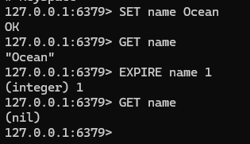

Redis本身是键值对型数据库，所有的数据都存储在一个redisDB结构体中，这个结构体包含了两个哈希表

- dict：保存Redis中所有的键值对数据
- expires：保存了Redis中所有设置了过期时间的KEY及其TTL

但Redis并不是实时监测KEY过期时间，在KEY过期后马上删除，而是采用两种延迟删除的策略。第一，当有命令需要操作一个KEY时，Redis才会检查该KEY的存活时间，如果已经过期才执行删除，这被称为惰性删除；第二，通过一个定时任务，周期性抽样部分设置有TTL的KEY，如果已经货期则执行删除，这被称为周期删除

而Redis的周期删除有两种执行模式。SLOW模式，默认执行频率为每秒10次，但每次执行时长不能超过25ms，SLOW模式的执行周期收server.hz参数影响；FAST模式，执行频率不固定，跟随Redis内部IO事件循环执行，两次任务之间的间隔不能低于2ms，执行时长不能超过1ms

### 内存淘汰策略

内存淘汰是指当Redis内存使用达到设置的阈值时，Redis会主动挑选部分KEY进行删除，以释放更多内存的流程。Redis会在每次处理客户端命令时对内存使用情况进行判断，如果内存已经用尽，则触发内存淘汰策略

| 淘汰策略        | 说明                                                    |
| --------------- | ------------------------------------------------------- |
| noeviction      | 不淘汰任何KEY，但是内存写满时不允许写入新数据，默认策略 |
| volatile-ttl    | 在设置了TTL的KEY中，比较KEY剩余TTL，TTL越少的先被淘汰   |
| allkeys-random  | 对全体KEY随机淘汰                                       |
| volatile-random | 设置了TTL的KEY随机淘汰                                  |
| allkeys-lru     | 对全体KEY基于LRU算法进行淘汰                            |
| volatile-lru    | 对设置了TTL的KEY基于LRU算法进行淘汰                     |
| allkeys-lfu     | 对全体KEY基于LFU算法进行淘汰                            |
| volatile-lfu    | 对设置了TTL的KEY基于LFU算法进行淘汰                     |

- LRU：Least Recently Used 最近最少使用，在Redis中使用当前时间减去最后一次访问时间，值越大淘汰优先级越高
- LFU：Least Frequently Used 最少频率使用，Redis会统计每个KEY的访问频率，值越小淘汰优先级越高

在上文提到的RedisObject结构体中，定义了一个unsigned lru:LRU_BITS来存储最近一次访问时间。这个变量先前是为LRU算法准备的，但是在较新版本的Redis中引入了LFU算法，因此也需要使用lru来记录访问次数。LRU_BITS默认有24为，一般使用前16位，以分钟为单位记录访问时间，后8位记录访问次数。但是如果单纯用8位记录真实访问次数是完全不够用的，因此Redis为其设计了一个逻辑访问次数算法
$$
首先生成一个随机数R \\
\\
R \in [0,1) \\
\\
然后计算P\\
\\
P = 1 / (当前访问次数 \times lfu\_log\_factor + 1)\\
\\
其中 lfu\_log\_factor 默认为10。然后进行判断，如果R<P，则计数器加一\\
同时逻辑访问次数随时间衰减，距离上一次访问时间每隔 lfu\_decay\_time 分钟，计数器减一，lfu\_decay\_time默认为1
$$
现在我们来模拟访问，先进行第一次访问，生成随机数R = 0.5，计算P = 1 / (0 x 10 + 1) = 1，R < P，因此计数器加一；然后第二次访问，生成随机数R=0.3，计算P = 1 / (1 x 10 + 1) = 0.09，R > P，计数器不变；进行第三次访问，R = 0.05，R < P，计数器加一

如此反复，只要访问频率足够多，计数器就能一直加一，而且访问次数越多，越难加一，通过数学计算可以得到从0-255的访问次数数学期望
$$
E \approx \sum_{c=0}^{c}{(10c+1)}，c \in [0, 255]
$$
当c=2时，E约等于32，当c=20时，E约等于2120，而8位的最大值c=255时，E约等于326655，这几乎不可能用完，因为还有lfu\_decay\_time衰减，因此Redis LFU是一套非常优秀的淘汰算法，能够更加精确地反映出KEY的重要性

## Redis缓存问题

### 缓存一致性

缓存一致性是指保证数据库中的数据和Redis中的缓存数据的一致性，避免Redis因为数据更新不及时造成的业务问题

Redis中常用的缓存一致性解决方案有三种：

- Cahce Aside Pattern

由业务开发者设计，在更新数据库的同时更新缓存，保证数据一致性。缺点是存在一些业务入侵

- Read/Write Through Pattern

缓存与数据库整合为一个服务，由服务来统一维护数据一致性，业务开发人员无需关心数据一致性问题。缺点是成本较高，需要先开发一套DAO服务

- Write Behind Caching Pattern

增删改查业务直接基于缓存，由其他线程异步调用，将缓存数据持久化到数据库，最终保证数据一致性。缺点时一致性较弱，只能保证最终一致性

对于一般的业务，都会选择Cahce Aside Pattern的模式，以保证数据强一致性。但在业务实践中还有需要注意的细节。第一，数据更新操作，包括插入、修改、删除，都必须先更新数据库，再更新缓存。若先更新缓存，可能会存在严重的数据一致性问题。第二，当数据库更新时，缓存应该选择惰性更新原则，即直接删除对应缓存，而非更新缓存，因为更新的缓存可能长时间内不再被访问，直接删除可以节省内存空间，只有在查询时再将数据添加到缓存中

### 缓存穿透

缓存穿透是指客户端中请求的数据在数据库中根本不存在，从而导致请求经过缓存，直接到达数据库的情况。缓存穿透本来是非常常见的现象，但是可能会有攻击者利用缓存穿透对数据库服务进行恶意攻击，构造大量的请求，这些请求的数据均不存在，从而形成缓存穿透绕过缓存，直接攻击数据库

目前缓存穿透有两种常见解决方案

- 缓存空对象

缓存空对象是数据库将不存在的请求也生成一份缓存存储在Redis中，当请求再次访问时就会被Redis拦截，从而避免缓存穿透到数据库。缓存空对象利用了Redis的高性能优势，实现简单，维护也非常方便。但缺点也很明显，这些空对象会占用额外的内存消耗，如果攻击者发送了大量不同的请求，就会在短时间内生成大量的空对象，但这个问题可以通过设置较短的TTL在一定程度上缓解。缓存空对象最大的缺点是，假设攻击者精心构造了完全不同的攻击请求，这会导致所有的请求仍无法被Redis拦截，因为Redis中并没有相应的缓存，从而继续发往数据库本身

- 布隆过滤

布隆过滤器利用了一个额外的过滤器，部署在请求到达Redis之前，布隆过滤器可以得知所有的数据情况，如果是缓存和数据库中均不存在的数据，布隆过滤器可以直接拒绝请求，从而避免缓存穿透

但是布隆过滤器并不是数据验证方案，而是算法验证方案，布隆过滤器不需要得到准确的数据，以下是布隆过滤器的基本算法：

- 定义一个极长的二进制数，默认每一位数都是0
- 然后定义N个不同算法的哈希函数
- 将集合中的元素根据N个哈希函数进行运算，得到N个数字，然后将每个数字对应的bit位标记为1
- 此时有请求进入，继续根据N个哈希函数进行运算，然后得到N个数字，判断这些数据对应的标记位是否为1即可

**示例**

假设定义了一个10位二进制数，首先初始化为全0

```binary
0000000000
```

此时集合中存在两个数据Java和Python，首先对Java进行运算得到结果为2、8，对Python进行运算，得到结果为2、5。现在将对应的比特位置1

```BIN
0100100100
```

现在有请求进入，请求的内容为Java，对Java进行运算，得到2、8。此时二进制数中2、8位置已经被置1，因此可以确定Java存在，布隆过滤器放行。又进行一次请求，请求内容为C++，运算结果为1、5，而二进制数中仅有5被置1，1的位置仍为0，因此可以确定C++不存在，布隆过滤器拒绝请求

但是布隆过滤器仍存在一定的缺陷，不同的请求参数计算得到的比特位可能是相同的，假设又进入一个请求PHP，运算结果为5、8，而此时5、8的比特位均为1，所以布隆过滤器会误认为PHP存在，于是放行请求

不过在实际业务实现中，布隆过滤器的比特位长度通常非常长，Redis为其设定了$2^{32}$位，可以极大避免哈希碰撞的产生。同时即使有碰撞，也只是小规模甚至个位数的请求，不会对业务产生影响

### 缓存雪崩

缓存雪崩是指在同一时间段内，大量的缓存KEY同时失效，或者Redis服务器宕机，从而导致大量请求直达数据库，为数据库造成极大的压力，甚至可能导致数据库服务器宕机

以下是几种常见的应对措施：

- 给不同的KEY设置随机TTL，避免同一时间大量失效
- 建立Redis集群，提高服务可用性
- 给缓存业务i添加降级限流策略，增加服务限流、服务熔断等机制
- 给业务添加多级缓存，不仅仅在于Redis缓存，还可以设置NGINX缓存、JVM本地缓存等等

### 缓存击穿

缓存击穿又称为热点KEY问题，指一个被高并发访问并且缓存重建业务较复杂的KEY突然失效或者过期了，大量的请求访问会在瞬间到达数据库，从而给数据库带来巨大冲击

缓存击穿的核心问题在于热点KEY失效以及长时间的缓存重建时间，以下是两种常见应为解决方案：

- 互斥锁

现在线程1查询某个缓存，但是发现缓存过期，于是线程1先获取互斥锁，并查询数据库开始进行缓存重建；此时线程2又来查询缓存，发现缓存过滤，因此也尝试获取互斥锁，但是互斥锁位于线程1中，因此获取失败，线程2开始阻塞等待，直到线程1完成线程重建

互斥锁的核心优势在于数据强一致性，只有在数据重建完成后才会将新数据返回，而且实现简单；而互斥锁的缺点在于性能较低，锁释放时间完全取决于重建耗时，同时可能导致严重的死锁问题

对于死锁问题，举个例子，现在有两个线程，分别查询a、b两个缓存，此时a、b两个缓存都过期了，于是线程1首先查询，发现缓存a过期，于是获取互斥锁，然后查询缓存b。而恰好此时线程2查询缓存b，发现缓存b过期，获取互斥锁，然后又查询缓存a。这时线程1等待线程2完成b的重建，而线程2又等待线程1完成a的重建，就形成了死锁

- 逻辑过期

缓存穿透的一大原因是热点KEY过期，因此可以直接不为热点KEY设置TTL，而是将逻辑TTL包含在数据体中，保证缓存永远能被查询。线程1查询某个缓存，发现其逻辑TTL过期，于是获取互斥锁，但是线程1并不自己执行重建任务，而是开启或者交由另外一个线程进行重建工作，而线程1直接返回旧数据。此时线程2查询缓存，发现缓存过期，获取互斥锁也失败，也不再等待，而是直接返回旧数据。互斥锁的释放由单独的线程决定

逻辑过期的有点是线程无需等待，性能较好；缺点也很明显，不保证数据一致性，只能在一致性要求不高的业务中实行，而且有额外的内存消耗，实现也比较复杂

## 分布式事务

### CAP和BASE

CAP定理是加州大学的计算机科学家Eric Brewer于1998年提出的针对分布式系统的三个指标，即一致性Consistency、可用性Availablity和分区容错性Partition tolerance。Eric Brewer直出，分布式系统无法同时满足这三个指标，这个结论就被称为CAP定理

> 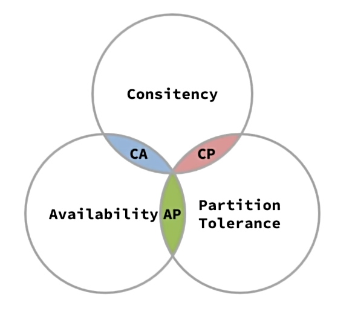

BASE理论是针对CAP定理的一种解决思路，包含三个思想：

- Basically Available基本可用：分布式系统在出现故障时，允许损失部分可用性，即保证核心可用
- Soft State软状态：在一定时间内，允许出现中间状态，比如临时的不一致状态
- Eventually Consistent最终一致性：虽然无法保证强一致性，但是在软状态结束后，最终达到数据一致

分布式事务最大的问题是各个子事务的一致性问题，因此可以借鉴CAP定理和BASE理论，例如我们先前使用的Seata，Seata提供的XA模式，就是CP模式，各个子事务执行后互相等待，同时提交，同时回滚，达成强一致性。但在事务等待过程中，处于弱可用状态；而AT模式属于AP模式，各个子事务分别执行和提交,允许结果出现不一致,然后采取弥补措施恢复数据即可，强调最终一致性

### AT脏写

在先前的学习中，我们知道AT模式分为两个阶段，第一阶段子事务负责执行自己的SQL命令并立即提交事务，第二阶段由TC统一通知事务结束或者事务回滚。这个过程中，就可能存在严重的数据一致性问题

假设现在有两个事务操作同一个数据money=100，事务1首先操作，对数据进行更新，因此事务1首先获取数据库DB锁，然后更新money=50。此时事务2执行更新操作，尝试获取数据库DB锁，但此时事务1正在操作，因此阻塞等待。事务1完成更新后，释放DB锁，提交事务报告，并进入第二阶段等待TC通知。事务2获得DB锁，开始执行更新money=80，更新完成后释放DB锁，并且由于事务2流程较短，事务2率先完成。而此时事务1的TC报告有事务异常，执行回滚，然后事务1随即将数据恢复为money=100，然后结束事务

这样来看，事务2的操作就相当于完全没有发生一样，这造成了严重的数据一致性问题，违反事务ACID原则。因此Seata提供了一个全局锁，全局锁可以限制只有一个事务能操作当前数据行

再来模拟一次，这次加入全局锁。事务1先获取DB锁，然后执行SQL更新money=50，在提交之前获取一个全局锁，获得全局锁之后执行更新，进入第二阶段等待。此时事务2前来更新，先获取DB锁，此时事务1更新已经完成，所以正常获取DB锁，然后执行SQL更新money=80，在提交之前获取全局锁。但是全局锁由事务1持有，事务2必须等待事务1释放全局锁。事务1接收到TC消息，其他事务异常需要回滚，事务1又尝试获取DB锁进行事务回滚更新，但是事务2持有DB锁，所以事务1必须等待事务2释放全局锁。这就导致了死锁问题，不过Seata默认为等待全局锁的事务设定了重试次数，最多30次，每次间隔10ms，总共300ms后，如果还没有获取全局锁，则直接报告错误回滚事务

全局锁可以从一定程度上解决脏写问题，但不能完全避免，因为全局锁仅对于Seata管理的事务生效，假设事务2不是Seata管理，那么事务2就不需要获取全局锁，事务1就能获取到DB锁然后执行更新，造成数据一致性问题。对于这种情况，Seata也有应对方案，Seata在生成数据快照时，不仅会生成数据库更新之前的快照，还会生成数据库更新之后的快照。在事务1进行事务回滚时，事务1会将当前数据库中的数据与数据库更新后的快照进行对比，一旦发现数据不一致，则表明数据在事务1更新后被其他事务更改过，此时TC将不会执行回滚，而是记录严重错误报告，通知人工处理

不过这种情况可能性极低，一般不作考虑

### TCC模式

TCC模式与AT模式非常类似，每阶段都是独立事务，但不同于AT模式的是TCC通过人工编码来实现数据恢复，因此需要开发人员实现三个方法：

- Try：资源的检测和预留
- Confirm：完成资源操作业务；要求Try成功后，Confirm也必须成功
- Cancel：预留资源释放，也就是Try的逆向操作

**示例**

假设现在用户账户里有100元，需要扣减30元。在先前的XA或者AT模式中，首先需要获取DB锁，然后对数据进行更新。这里更新的是数据体本身，而TCC模式则是在Try阶段将需要扣减的30元进行冻结，然后进入第二阶段，如果要确定，进入Confirm阶段扣减冻结余额；如果要回滚，则进入Cancel阶段恢复冻结余额。TCC模式将数据本身进行了事务划分，每个事务只能操作属于自己的数据，无法影响其他事务的数据，因此无需加锁，性能相较于AT模式也提升很大

**完整运行时**

首先由TM开启全局事务，然后TM调用各RM执行分支事务，RM注册分支事务，并执行资源预留Try，接着直接提交。因为Try属于单独事务，所以RM向TC报告事务状态，然后进入二阶段。TC开始检查事务状态，判断资源预留是否足够，如果资源充足，则执行Confirm并完成全局事务，如果资源不足，则执行Cancel进行回滚

TCC并不是完全不需要锁，如果TCC作用于关系型数据库仍需要DB锁，但是TCC也可以作用于NoSQL数据库，例如Redis，事务回滚只需要在Cancel阶段执行DEL命令即可。TCC的缺陷是需要开发人员自己编写三个接口，有较严重的代码侵入，事务一致性较弱，属于最终一致性，而且还需要考虑Confirm和Cancel失败的情况，并准备应对策略

### 最大努力通知

最大努力通知是一种最终一致性的分布式事务解决方案。最大努力通知是通过消息通知的方式来通知事务参与者完成业务执行，如果执行失败会多次通知。最大努力通知无需任何分布式事务组件介入

最大努力通知的可靠性依赖于消息中间件的可靠性，一般使用的消息中间件RabbitMQ拥有完善的消息确认与消息重发机制，可以尽量避免消息丢失，同时开发人员也可以定义消息丢失的兜底方案进一步增强可靠性。或者可以直接省去消息中间件，由被调服务返回一个执行状态，手动模拟事务

 综上，其实解决分布式事务问题的最佳方案就是尽量不要产生分布式事务，因为一旦产生分布式事务，就不可避免地会引入一系列的问题，所以应当尽量在拆分之前规划好事务逻辑，以求最小服务间调用

## 注册中心

### 环境隔离

企业实际开发中，往往会搭建多个运行环境，例如开发环境、测试环境、发布环境等等。不同环境之间需要进行隔离，或者不同项目间使用了同一套Nacos，不同项目间也需要做环境隔离

Nacos本身自带了严格的环境隔离，例如Namespace、Group、Service/DataId分级。一般来说，Namespace就是用于进行环境隔离使用的，

### 分级模型

上文提到，Nacos使用Namespace、Group将各个实例进行了环境隔离，但实际上在Service之下还有一个分级Cluster。一些较大的企业会在全国各地的机房部署同一个服务的不同实例，这些不同的地域的机房就成为一个集群。因此Nacos的分级模型可以概述为Namespace、Group、Service、Cluster、Instance。而在Nacos源码中，存储这些信息的数据结构是一个Map\<String, Map\<String, Service\>\>，第一个String表示命名空间，内含所有的分组，所以Group也是一个Map，而Group的Map\<String, Serivce\>的String是分组名称，Service则是服务，Service可能包含多个集群，因此也是Map\<String, Cluster\>，String是服务名称，Cluster是集群，而Cluster不需要键值对结构，因此Cluster采用了Set\<Instance\>来保证实例的唯一性

### Eureka与Nacos

Eureka是Netflix网飞开源的一个注册中心组件，目前被集成在SpringCloudNetflix模块下，工作原理与Nacos类似

Eureka支持集群，Eureka集群内所有的服务数据互通，一旦有任何Eureka服务宕机，都可以随时切换到另外的Eureka注册中心，保证可用性。而针对于分布式事务的CAP定理，Eureka选择了AP模式，即如果产生局部网络，保证服务注册可用，允许出现一定的数据不一致。因为此时服务发现可能仍旧可用

Nacos也支持集群，同样选择AP模式，保证注册可用性，而Nacos与Eureka的区别在于其健康状态监测机制，Nacos的服务默认每5秒向注册中心发送一次心跳包，如果Nacos在15秒内仍未检测到心跳包，则认为该服务下线。而Eureka服务默认每30秒发送一次心跳包，最多超时3次，也就是90秒后未收到心跳包，则认为服务下线。而且Nacos提供了一种主动检测方式，默认关闭状态，可以在配置文件中开启。Nacos主动检测开启后，服务会更改为永久服务，即使服务下线，服务也存在于服务列表中，所以一般不会启用。Nacos还有主动推送服务变更的功能，如果某个服务中某台实例上线或者下线，Nacos会通过UDP主动将新的服务列表推送到订阅者服务，无需订阅者主动拉取

### 远程调用

#### 负载均衡远程调用原理

自SpringCloud2020版本开始，SpringCloud弃用Ribbon，改用Spring自己开源的SpringCloudLoadBalancer，我们通常使用的OpenFeign、Gateway也已经与其进行了整合。而OpenFeign在整合SpringCloudLoadBalancer时，与我们手动服务发现、负载均衡的流程类似。总体来说，可以分为基本四步

- 获取ServiceId服务名称
- 根据ServiceId拉取服务列表
- 利用负载均衡算法选择一个服务
- 重构请求URL，发起远程调用

我们来跟踪Feign的远程调用，查看Feign的源码实现是否与预期的一致

Feign在执行远程调用后，会使用一个动态代理类，而需要执行动态代理方法则需要动态代理类的InvocationHandler来执行，所以我们定义到Feign的InvocationHandler，也就是ReflectiveFeign中的内部类FeignInvocationHandler

```java
static class FeignInvocationHandler implements InvocationHandler {

  private final Target target;
  private final Map<Method, MethodHandler> dispatch;

  FeignInvocationHandler(Target target, Map<Method, MethodHandler> dispatch) {
    this.target = checkNotNull(target, "target");
    this.dispatch = checkNotNull(dispatch, "dispatch for %s", target);
  }

  @Override
  public Object invoke(Object proxy, Method method, Object[] args) throws Throwable {
    if ("equals".equals(method.getName())) {
      try {
        Object otherHandler =
            args.length > 0 && args[0] != null ? Proxy.getInvocationHandler(args[0]) : null;
        return equals(otherHandler);
      } catch (IllegalArgumentException e) {
        return false;
      }
    } else if ("hashCode".equals(method.getName())) {
      return hashCode();
    } else if ("toString".equals(method.getName())) {
      return toString();
    }

    return dispatch.get(method).invoke(args);
  }

  @Override
  public boolean equals(Object obj) {
    if (obj instanceof FeignInvocationHandler) {
      FeignInvocationHandler other = (FeignInvocationHandler) obj;
      return target.equals(other.target);
    }
    return false;
  }

  @Override
  public int hashCode() {
    return target.hashCode();
  }

  @Override
  public String toString() {
    return target.toString();
  }
}
```

在invoke方法中，最后执行方法调用了dispatch.get(method).invoke(args)，这里并不是FeignInvocationHandler直接执行方法，而是通过了private final Map<Method, MethodHandler> dispatch来执行调用，dispatch保存了方法和方法执行器，因为这里是远程调用。然后进入dispatch的invoke方法，转到SynchronousMethodHandler

```java
@Override
public Object invoke(Object[] argv) throws Throwable {
  RequestTemplate template = buildTemplateFromArgs.create(argv);
  Options options = findOptions(argv);
  Retryer retryer = this.retryer.clone();
  while (true) {
    try {
      return executeAndDecode(template, options);
    } catch (RetryableException e) {
      try {
        retryer.continueOrPropagate(e);
      } catch (RetryableException th) {
        Throwable cause = th.getCause();
        if (propagationPolicy == UNWRAP && cause != null) {
          throw cause;
        } else {
          throw th;
        }
      }
      if (logLevel != Logger.Level.NONE) {
        logger.logRetry(metadata.configKey(), logLevel);
      }
      continue;
    }
  }
}
```

在SynchronousMethodHandler的invoke方法中，首先通过RequestTemplate构建了一个请求，然后由executeAndDecode(template, options)执行

```java
Object executeAndDecode(RequestTemplate template, Options options) throws Throwable {
  Request request = targetRequest(template);

  if (logLevel != Logger.Level.NONE) {
    logger.logRequest(metadata.configKey(), logLevel, request);
  }

  Response response;
  long start = System.nanoTime();
  try {
    response = client.execute(request, options);
    // ensure the request is set. TODO: remove in Feign 12
    response = response.toBuilder()
        .request(request)
        .requestTemplate(template)
        .build();
  } catch (IOException e) {
    if (logLevel != Logger.Level.NONE) {
      logger.logIOException(metadata.configKey(), logLevel, e, elapsedTime(start));
    }
    throw errorExecuting(request, e);
  }
  long elapsedTime = TimeUnit.NANOSECONDS.toMillis(System.nanoTime() - start);


  if (decoder != null)
    return decoder.decode(response, metadata.returnType());

  CompletableFuture<Object> resultFuture = new CompletableFuture<>();
  asyncResponseHandler.handleResponse(resultFuture, metadata.configKey(), response,
      metadata.returnType(),
      elapsedTime);

  try {
    if (!resultFuture.isDone())
      throw new IllegalStateException("Response handling not done");

    return resultFuture.join();
  } catch (CompletionException e) {
    Throwable cause = e.getCause();
    if (cause != null)
      throw cause;
    throw e;
  }
}
```

在executeAndDecode中，先获取请求，然后通过response = client.execute(request, options)直接执行请求，这里会继续调用FeignBlockingLoadBalancerClient的execute方法

```java
@Override
public Response execute(Request request, Request.Options options) throws IOException {
    final URI originalUri = URI.create(request.url());
    String serviceId = originalUri.getHost();
    Assert.state(serviceId != null, "Request URI does not contain a valid hostname: " + originalUri);
    String hint = getHint(serviceId);
    DefaultRequest<RequestDataContext> lbRequest = new DefaultRequest<>(
          new RequestDataContext(buildRequestData(request), hint));
    Set<LoadBalancerLifecycle> supportedLifecycleProcessors = LoadBalancerLifecycleValidator
          .getSupportedLifecycleProcessors(
                loadBalancerClientFactory.getInstances(serviceId, LoadBalancerLifecycle.class),
                RequestDataContext.class, ResponseData.class, ServiceInstance.class);
    supportedLifecycleProcessors.forEach(lifecycle -> lifecycle.onStart(lbRequest));
    ServiceInstance instance = loadBalancerClient.choose(serviceId, lbRequest);
    org.springframework.cloud.client.loadbalancer.Response<ServiceInstance> lbResponse = new DefaultResponse(
          instance);
    if (instance == null) {
       String message = "Load balancer does not contain an instance for the service " + serviceId;
       if (LOG.isWarnEnabled()) {
          LOG.warn(message);
       }
       supportedLifecycleProcessors.forEach(lifecycle -> lifecycle
             .onComplete(new CompletionContext<ResponseData, ServiceInstance, RequestDataContext>(
                   CompletionContext.Status.DISCARD, lbRequest, lbResponse)));
       return Response.builder().request(request).status(HttpStatus.SERVICE_UNAVAILABLE.value())
             .body(message, StandardCharsets.UTF_8).build();
    }
    String reconstructedUrl = loadBalancerClient.reconstructURI(instance, originalUri).toString();
    Request newRequest = buildRequest(request, reconstructedUrl);
    LoadBalancerProperties loadBalancerProperties = loadBalancerClientFactory.getProperties(serviceId);
    return executeWithLoadBalancerLifecycleProcessing(delegate, options, newRequest, lbRequest, lbResponse,
          supportedLifecycleProcessors, loadBalancerProperties.isUseRawStatusCodeInResponseData());
}
```

首先由final URI originalUri = URI.create(request.url())获取请求URL，类似于`http://item-service/item?ids=100001`，但是这个请求肯定无法直接发送，因为item-service时服务名。下一步String serviceId = originalUri.getHost()便从请求路径中获取到了服务名`item-service`，第一步完成；下方的ServiceInstance instance = loadBalancerClient.choose(serviceId, lbRequest)就开始挑选服务，第二步与第三步完成；然后由String reconstructedUrl = loadBalancerClient.reconstructURI(instance, originalUri).toString()完成URL重构，第四步完成。

不过我们仍不知道负载均衡的具体实现，因此继续深入loadBalancerClient的choose方法。LoadBalancerClient是一个接口，仅有一个实现类BlockingLoadBalancerClient，于是我们查看BlockingLoadBalancerClient的choose方法

```java
@Override
public <T> ServiceInstance choose(String serviceId, Request<T> request) {
    ReactiveLoadBalancer<ServiceInstance> loadBalancer = loadBalancerClientFactory.getInstance(serviceId);
    if (loadBalancer == null) {
       return null;
    }
    Response<ServiceInstance> loadBalancerResponse = Mono.from(loadBalancer.choose(request)).block();
    if (loadBalancerResponse == null) {
       return null;
    }
    return loadBalancerResponse.getServer();
}
```

从源码中看出，BlockingLoadBalancerClient也并不是负载均衡的实现类，而是一个调用类，实际的负载均衡器为ReactiveLoadBalancer，ReactiveLoadBalancer是交互式负载均衡器接口，其下有三个实现类NacosLoadBalancer、RandomLoadBalancer、RoundRobinLoadBalancer

> 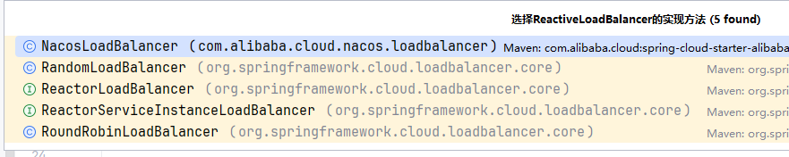

默认选择的是RoundRobinLoadBalancer轮询负载均衡器，而BlockingLoadBalancerClient中调用了ReactiveLoadBalancer的choose方法，所以我们继续跟入RoundRobinLoadBalancer的choose方法

```java
@SuppressWarnings("rawtypes")
@Override
// see original
// https://github.com/Netflix/ocelli/blob/master/ocelli-core/
// src/main/java/netflix/ocelli/loadbalancer/RoundRobinLoadBalancer.java
public Mono<Response<ServiceInstance>> choose(Request request) {
    ServiceInstanceListSupplier supplier = serviceInstanceListSupplierProvider
          .getIfAvailable(NoopServiceInstanceListSupplier::new);
    return supplier.get(request).next()
          .map(serviceInstances -> processInstanceResponse(supplier, serviceInstances));
}
```

在RoundRobinLoadBalancer的choose中，服务拉取通过ServiceInstanceListSupplier，底层就是通过DiscoveryClient来实现的，而服务的选取继续调用processInstanceResponse

```java
private Response<ServiceInstance> processInstanceResponse(ServiceInstanceListSupplier supplier,
       List<ServiceInstance> serviceInstances) {
    Response<ServiceInstance> serviceInstanceResponse = getInstanceResponse(serviceInstances);
    if (supplier instanceof SelectedInstanceCallback && serviceInstanceResponse.hasServer()) {
       ((SelectedInstanceCallback) supplier).selectedServiceInstance(serviceInstanceResponse.getServer());
    }
    return serviceInstanceResponse;
}
```

在processInstanceResponse中继续调用getInstanceResponse

```java
private Response<ServiceInstance> getInstanceResponse(List<ServiceInstance> instances) {
    if (instances.isEmpty()) {
       if (log.isWarnEnabled()) {
          log.warn("No servers available for service: " + serviceId);
       }
       return new EmptyResponse();
    }

    // Ignore the sign bit, this allows pos to loop sequentially from 0 to
    // Integer.MAX_VALUE
    int pos = this.position.incrementAndGet() & Integer.MAX_VALUE;

    ServiceInstance instance = instances.get(pos % instances.size());

    return new DefaultResponse(instance);
}
```

在getInstanceResponse中，编写了轮询算法的核心代码，其实也非常简单。Feign维护了一个position，这个position是AtomicInteger类型，AtomicInteger位于java.util.concurrent.atomic包下，用于在多线程环境中对int进行原子操作。简单来说，就是一个线程安全的计数器。this.position.incrementAndGet()进行自增操作，但AtomicInteger基于int，因此存在一个上限，也就是int的最大值，所以这里与Integer.MAX_VALUE进行逻辑与，保证计数器不为负数。举个例子，假设int为8位，第一位作为符号位，那么int最大值为01111111，此时如果再进行自增，就变成了10000000，负数的最小值，因此需要与最大值逻辑与，10000000 & 01111111 = 00000000，重置为0。然后通过pos与拉取到的实例数量进行取模，即得到的索引永远不会超过实例数量最大值，而且随着计数器增加，余数也会增加，因此实现了轮询算法

#### 切换负载均衡算法

在分析负载均衡原理的时候我们发现ReactiveLoadBalancer有三个实现类，分别是NacosLoadBalancer、RandomLoadBalancer、RoundRobinLoadBalancer，其中RandomLoadBalancer和RoundRobinLoadBalancer由Spring-Cloud-Loadbalancer模块提供，而NacosLoadBalancer则由Nacos-Discovery提供

ReactiveLoadBalancer由SpringBoot自动装配实现，我们可以查看spring-cloud-loadbalancer包，观察其Config类

```java
@Bean
@ConditionalOnMissingBean
public ReactorLoadBalancer<ServiceInstance> reactorServiceInstanceLoadBalancer(Environment environment,
       LoadBalancerClientFactory loadBalancerClientFactory) {
    String name = environment.getProperty(LoadBalancerClientFactory.PROPERTY_NAME);
    return new RoundRobinLoadBalancer(
          loadBalancerClientFactory.getLazyProvider(name, ServiceInstanceListSupplier.class), name);
}
```

定位到LoadBalancerClientConfiguration，第一个方法便是reactorServiceInstanceLoadBalancer，用于创建一个ReactiveLoadBalancer的Bean，而且reactorServiceInstanceLoadBalancer方法上有@ConditionalOnMissingBean注解，因此我们可以自己创建一个ReactiveLoadBalancer的Bean，返回需要的负载均衡器，或者甚至可以自定义一个负载均衡器，然后通过reactorServiceInstanceLoadBalancer方法注入

但是自定义LoadBalancerClientConfiguration类不要添加@Configuration注解，一旦添加，这个配置会对整个服务生效，而负载均衡仅限于Feign的远程调用，所以要保持最小职责原则，应该在启动类上使用@LoadBalanceClients注解，再传入配置类的类文件。例如我们返回一个Nacos的负载均衡器

```java
@Bean
public ReactorLoadBalancer<ServiceInstance> reactorServiceInstanceLoadBalancer(
    Environment environment,
    LoadBalancerClientFactory loadBalancerClientFactory,
    NacosDiscoveryProperties properties
) {
    String name = environment.getProperty(LoadBalancerClientFactory.PROPERTY_NAME);
    return new NacosLoadBalancer(
          loadBalancerClientFactory.getLazyProvider(name, ServiceInstanceListSupplier.class), name, properties);
}
```

Nacos负载均衡器的算法是集群优先，在相同集群的情况下基于权重进行随机选择

## 服务保护

### 线程隔离

一般来说，线程隔离有两种实现方案，线程池隔离和信号量隔离。线程池隔离在SpringCloudAlibaba中由早期的Hystix采用，而现在的Sentinel采用信号量隔离

线程池隔离一般是为各个服务调用单独设置一个线程池，每次请求到达时，需要从线程池中申请线程，然后再发往对应服务。线程池大小小于服务器总逻辑可用线程数量，因此当一个服务被高频访问时，仅有对应服务的线程池被占满，而其他服务的线程池可以正常使用，避免雪崩。其优势为隔离效果显著，每个远程调用都有自己的线程池，不存在资源共享问题，而且线程池可以直接控制其中的线程，如果线程出现问题或者慢调用，可以直接中断线程；线程池隔离的缺点是，一旦一个服务中存在大量的远程调用，就需要准备同等规模的线程池，而每个线程池都会消耗一部分服务器资源，因此远程调用越多，额外资源消耗越多

信号量隔离机制并不直接隔离线程，而是通过一个信号量计数器，在请求被远程调用前进行计数，一旦信号量达到上限，则拒绝后续请求。信号量隔离的优点是没有额外的资源消耗，性能更好；相对地，缺点就是隔离性较弱

### 滑动窗口算法

**固定窗口计数器算法**

在了解滑动窗口算法之前，需要先了解固定窗口计数器算法，因为滑动窗口算法基于固定窗口计数器算法改进而来

固定窗口计数器算法将时间划分为多个窗口，也就是多个时间段，窗口时间的跨度称为Interval。每个窗口分别计数统计，每有一次请求就将计数器加一，限流就是设置计数器阈值，如果计数器超过了阈值，那么超出阈值的请求都会被拒绝

而固定窗口计数器算法存在一定的缺陷，假设窗口设置为1000ms，阈值设置为3，在第1500ms时有三个请求到达，1000到2000ms内阈值为3，所以放行；而2500ms又有三个请求到达，2000到3000ms内阈值为3，因此也放行。如果观察1500ms到2500ms这一个窗口，就有6个请求到达，严重超出了设置的阈值

**滑动窗口计数器算法**

滑动窗口计数器算法正是为了解决这个问题，我们可以将一个窗口跨度拆分为更小的跨度，例如窗口设置为1000ms，子窗口设置为500ms。在计数时，也按照子窗口来进行计数，例如当2500ms有请求到达时，以1500ms为窗口起始位置，计算1500到2500ms窗口内的请求数量，这样就可以尽量避免请求时间位于其他窗口。这里需要注意，滑动窗口计数器算法的计数是基于请求到达时的子窗口及其上一个子窗口，而固定窗口计数器算法的计数是基于请求当前窗口。滑动窗口算法并不能从根本上解决请求位于其他窗口的情况，但是可以通过设置更高的子窗口数量来扩大精度

从数学上来看，滑动窗口计数器的子窗口，也就是桶的数量及其限流精度的关系可以用以下表达式概括
$$
\epsilon \approx 1 / N
$$
ε表示限流误差，N表示桶数量。如果要求误差小于10%，则应该选择N大于等于10，若要求误差小于等于1%，则应该选择N大于等于100

### 漏桶算法

在滑动窗口算法拒绝请求后，默认遵循快速失败原则，直接放弃该请求。但是如果是一些比较重要的业务请求，就不能轻易放弃，而应该将其保存在某个位置，等待并发放缓后继续执行。这里就需要用到漏桶算法

漏桶算法是指将每个请求视作水滴，存入漏桶中进行存储，漏桶会按照固定的速率向外漏出请求执行，如果漏桶为空，则停止漏水；但漏桶也有容量上限，一旦漏桶被装满，其余的请求也应当拒绝

Sentinel的排队等待控流就是基于漏桶算法进行的，同时在Sentinel中也可以设置请求超时时间，超过TTL的请求会直接从桶中被移除

### 令牌桶算法

令牌桶算法是准备一个桶，但是这个桶不存储任何数据，而是系统生成的令牌，系统以固定速率生成令牌，达到桶容量上限后停止生成。每当请求到达时，必须先尝试从令牌桶中申请一个令牌，然后才能继续执行，若请求没能获取令牌，则阻塞或直接拒绝。令牌桶可以解决请求积压的问题，但是令牌桶在请求速率波动较大的场景容易出现限流失败的问题

举个例子，假设系统生成令牌的速率是每秒十个，令牌桶的容量为十个，现在一瞬间有二十个请求进入，前十个请求会立即消耗桶中的所有令牌，然后系统再生成十个令牌供后十个请求消耗，这样QPS就增长为了20，严重超出限流阈值

而在SpringCloudGateway中，限流也是基于Redis实现的令牌桶算法

