# Java Web Medium

`更新时间：2026-6-26`

注释解释：

- `<>`必填项，必须在当前位置填写相应数据

- `{}`必选项，必须在当前位置选择一个给出的选项

- `[]`可选项，可以选择填写或忽略

*注：该笔记内的可选项和参数均不完整，如有需要，请查询相关手册*

---

## MyBatis-Plus

MyBatis-Plus是一个 MyBatis的增强工具，在 MyBatis 的基础上只做增强不做改变，为简化开发、提高效率而生。MyBatis-Plus只做增强不做改变，引入它不会对现有工程产生影响，如丝般顺滑。启动即会自动注入基本 CURD，性能基本无损耗，直接面向对象操作。内置通用 Mapper、通用 Service，仅仅通过少量配置即可实现单表大部分 CRUD 操作，更有强大的条件构造器，满足各类使用需求。支持 MySQL、MariaDB、Oracle、DB2、H2、HSQL、SQLite、Postgre、SQLServer 等多种数据库

### 快速入门

我们准备了一个传统MyBatis项目，项目中已经编写好了基础CRUD查询逻辑

```java
package com.itheima.mp.mapper;

import com.itheima.mp.domain.po.User;
import org.apache.ibatis.annotations.Param;

import java.util.List;

public interface UserMapper{

    void saveUser(User user);

    void deleteUser(Long id);

    void updateUser(User user);

    User queryUserById(@Param("id") Long id);

    List<User> queryUserByIds(@Param("ids") List<Long> ids);
}
```

1. 引入依赖

```xml
<!--        mybatis-plus-->
        <dependency>
            <groupId>com.baomidou</groupId>
            <artifactId>mybatis-plus-boot-starter</artifactId>
            <version>3.5.3.1</version>
        </dependency>
```

2. 将Mapper继承BaseMapper\<T>

```java
package com.itheima.mp.mapper;

import com.baomidou.mybatisplus.core.mapper.BaseMapper;
import com.itheima.mp.domain.po.User;
import org.apache.ibatis.annotations.Param;

import java.util.List;

public interface UserMapper extends BaseMapper<User> {

    void saveUser(User user);

    void deleteUser(Long id);

    void updateUser(User user);

    User queryUserById(@Param("id") Long id);

    List<User> queryUserByIds(@Param("ids") List<Long> ids);
}
```

3. 删除原Mapper中的所有方法，让其全部继承自父类

```java
package com.itheima.mp.mapper;

import com.baomidou.mybatisplus.core.mapper.BaseMapper;
import com.itheima.mp.domain.po.User;
import org.apache.ibatis.annotations.Param;

import java.util.List;

public interface UserMapper extends BaseMapper<User> {
}
```

4. 使用测试类进行测试

```java
@Test
void testInsert() {
    User user = new User();
    user.setId(5L);
    user.setUsername("Lucy");
    user.setPassword("123");
    user.setPhone("18688990011");
    user.setBalance(200);
    user.setInfo("{\"age\": 24, \"intro\": \"英文老师\", \"gender\": \"female\"}");
    user.setCreateTime(LocalDateTime.now());
    user.setUpdateTime(LocalDateTime.now());
    userMapper.insert(user);
}
```

> 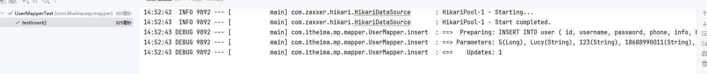

### 常见注解

MyBatis-Plus通过扫描实体类，并基于反射获取实体类信息作为数据库表信息，然后在`BaseMapper`中实现针对某个实体类的CRUD操作。但是MyBatis-Plus的解析是存在一定规范的

- 类名驼峰转换为下划线作为表名
- 实体类中属性名为id的属性作为主键
- 其他属性名驼峰转下划线作为字段名
- 不符合规范的类或者属性需要使用注解来显式声明

| 注解        | 说明             |
| ----------- | ---------------- |
| @TableName  | 指定表名         |
| @TableId    | 指定主键         |
| @TableField | 指定其他普通字段 |

**示例**

```java
@TableName("stu_users")
public class User {
    
    @TableId("stu_id")
    private Long id;
    
    @TableField("stu_age")
    private Integer age;
}
```

@TableId字段相对比较特殊，可以通过`type`属性来设置主键类型，使用IdType枚举类的值来表示

| 枚举值           | 说明                                                         |
| ---------------- | ------------------------------------------------------------ |
| IdType.AUTO      | 数据库自增长                                                 |
| IdType.INPUT     | 通过setter自行填入                                           |
| IdType.ASSIGN_ID | 通过接口IdentifierGenerator的nextId方法来生成id，默认实现类为雪花算法。未设置@TableId(IdType.AUTO)，且未传递id值的时候，默认会通过IdentifierGenerator生成一个id |

当属性名为is开头的字符串，MyBatis-Plus在转换时会去掉is前缀，例如属性名isMarried，转换后的字段名为married，导致字段名与数据库不一致，因此也需要使用@TableField注解；当属性名为SQL关键字时，也需要使用@TableField注解添加转义符，如@TableField("\`order\`")避免SQL识别为ORDER关键字；当数据库不存在对应字段时，需要使用@TableField(exist = false)来声明，否则MyBatis-Plus会尝试在数据库中寻找该字段，但找不到而导致报错

### 常见配置

MyBatis-Plus的配置项继承了MyBatis原生配置和一些自己特有的配置

```yml
mybatis-plus:
  # 配置实体类包
  type-aliases-package: com.itheima.mp.domain.po
  # XML文件地址
  mapper-locations: classpath*:mapper/**/*.xml
  configuration:
    # 是否开启驼峰命名
    map-underscore-to-camel-case: true
    # 是否启用二级缓存
    cache-enabled: false
  global-config:
    db-config:
      # 默认主键策略
      id-type: assign_id
      # 默认更新策略
      update-strategy: not_null
```

### 条件构造器

MyBatis-Plus默认提供了很多参数类型为`Wrapper`类型接口

```java
int delete(@Param("ew") Wrapper<T> queryWrapper);
int update(@Param("et") T entity, @Param("ew") Wrapper<T> updateWrapper);
default T selectOne(@Param("ew") Wrapper<T> queryWrapper) {};
default boolean exists(Wrapper<T> queryWrapper) {};
Long selectCount(@Param("ew") Wrapper<T> queryWrapper);
List<T> selectList(@Param("ew") Wrapper<T> queryWrapper);
List<Map<String, Object>> selectMaps(@Param("ew") Wrapper<T> queryWrapper);
List<Object> selectObjs(@Param("ew") Wrapper<T> queryWrapper);
<P extends IPage<T>> P selectPage(P page, @Param("ew") Wrapper<T> queryWrapper);
<P extends IPage<Map<String, Object>>> P selectMapsPage(P page, @Param("ew") Wrapper<T> queryWrapper);
```

这里的Wrapper就是条件构造器，用于构造复杂的SQL语句，Wrapper类有很多的子类，例如UpdateWrapper、QueryWrapper等等，通过方法的形式实现了SQL中所有的查询语句，例如eq()等于，like()匹配，between()范围等

**示例**

我们用几个案例来展示条件构造器如何使用

1.　查询出名字中带o，存款大于等于1000元的人的id、username、info以及balance字段

`mysql`

```mysql
# MySQL
SELECT
	id, username, info, balance
FROM
	user
WHERE
	balance >= 1000
	AND username LIKE '%o%'
```

`mybatis-plus`

```java
@Test
void testQueryByWrapper() {
    // 创建查询条件
    QueryWrapper<User> wrapper = new QueryWrapper<User>()
            .select("id", "username", "info", "balance")
            .like("username", "o")
            .ge("balance", 1000);
    // 使用查询条件查询
    List<User> users = userMapper.selectList(wrapper);
    users.forEach(System.out::println);
}
```

2. 更新用户名为jack的用户的余额为2000

`mysql`

```mysql
#MySQL
UPDATE
	user
SET 
	balance = 2000
WHERE
	username = 'jack';
```

`mybatis-plus`

```java
@Test
void testUpdateByWrapper() {
    // 创建更新条件
    UpdateWrapper<User> wrapper = new UpdateWrapper<User>()
            .set("balance", 2000)
            .eq("username", "jack");
    // 使用更新条件更新
    userMapper.update(null, wrapper);
}
```

需要注意，在更新Wrapper中，set()方法与update()方法中的实体参数并不冲突，如果只指定了某一个，则会使用指定的值，如果两者都指定，Wrapper中的方法优先级更高，如下

```java
// 创建更新条件
UpdateWrapper<User> wrapper = new UpdateWrapper<User>()
    .set("balance", 2000)
    .eq("username", "jack");
// 构建更新实体
User user = User.builder()
    .balance(3000)
    .build();
// 使用更新条件更新
userMapper.update(user, wrapper);
```

这种情况下，我们同时指定了更新实体user，查询Wrapper中的set方法，最后更新的结果仍为set方法中的值

**setSql()**

如果更新逻辑中要求对数据进行基于自身的变动，就必须使用UpdateWrapper，实体类无法实现

例如需要更新1、2、4号用户的余额，在其基础上减去200

`mysql`

```mysql
UPDATE
	user
SET
	balance = balance - 200
WHERE
	id IN (1, 2, 4);
```

`mybatis-plus`

```java
// 创建更新条件
UpdateWrapper<User> wrapper = new UpdateWrapper<User>()
        .setSql("balance = balance - 200")
        .in("id", 1L, 2L, 4L);
// 使用更新条件更新
userMapper.update(null, wrapper);
```

#### LambdaWrapper

在上文构造Wrapper的时候，有关字段名的编写都是基于字符串的形式，实际上这是一种非常不安全的行为，如果字符串误写，漏写，或者是存在两个相似的字段名，就及其容易导致程序报错。因此MyBatis-Plus提供了基于Lambda表达式的LambdaWrapper，使用反射获取实体类get方法中的属性对应的@TableField注解值来编写SQL语句

如下

```java
@Test
void testQueryByLambdaWrapper() {
    // 创建查询条件
    LambdaQueryWrapper<User> wrapper = new LambdaQueryWrapper<User>()
            .select(User::getId, User::getUsername, User::getInfo, User::getBalance)
            .like(User::getUsername, "o")
            .ge(User::getBalance, 1000);
    // 使用查询条件查询
    List<User> users = userMapper.selectList(wrapper);
}
```

我们在实体类的username字段中添加@TableField注解

```java
/**
 * 用户名
 */
@TableField("`username`")
private String username;
```

指定方法，并观察构建的查询语句，证实了我们的说法是正确的

> 

### 自定义SQL

在MyBatis-Plus的使用过程中，我们不难发现其对于一些查询语句的构建存在一定的困难，例如我们提到的数据进行基于自身的变动，或者查询时需要使用聚合函数，起别名等等，这些地方难免会需要我们手动构建一些SQL语句，但由于Wrapper的定义是在Service中，一般来说Service中不允许出现SQL语句，这会违反我们的开发规范，因此我们可以利用Wrapper的优点，使用Wrapper构建WHERE字段，然后将Wrapper传递到Mapper层，再在Mapper中为Wrapper拼接剩余部分，这就是自定义SQL

1. 在Service中基于Wrapper构建WHERE字段

```java
List<Long> ids = List.of(1L, 2L, 4L);
Integer amount = 200;

// 构建查询条件
LambdaUpdateWrapper<User> wrapper = new LambdaUpdateWrapper<User>()
    .in(User::getId, ids);
// 自定义SQL方法调用
userMapper.updateBalanceByIds(wrapper, amount);
```

2. 在Mapper中定义自定义SQL方法

```java
Integer updateBalanceByIds(@Param(Constants.WRAPPER) LambdaUpdateWrapper<User> wrapper, @Param("amount") Integer amount);
```

3. 在Mapper或者Mapper.xml中定义SQL语句，使用`ew.customSqlSegment`获取mybatis-plus自动构建的sql语句

```xml
<update id="updateBalanceByIds">
    UPDATE user SET balance = balance - #{amount} ${ew.customSqlSegment}
</update>
```

### IService

如同BaseMapper，MyBatis-Plus其实也提供了现有的Service层解决方案IService，并且为了避免开发人员需要额外实现所有的接口，IService也提供了一个实现类IServiceImpl，只需要我们的Service继承IService，ServiceImpl继承IServiceImpl，即可直接在Controller中调用IService提供的所有方法

`Service`

```java
package com.itheima.mp.service;

import com.baomidou.mybatisplus.extension.service.IService;
import com.itheima.mp.domain.po.User;

public interface IUserService extends IService<User> {
}
```

`ServiceImpl`

```java
package com.itheima.mp.service.impl;

import com.baomidou.mybatisplus.extension.service.impl.ServiceImpl;
import com.itheima.mp.domain.po.User;
import com.itheima.mp.mapper.UserMapper;
import com.itheima.mp.service.IUserService;

@Service
public class IUserServiceImpl extends ServiceImpl<UserMapper, User> implements IUserService {
}
```

然后直接在测试类中调用查询方法，查询所有的用户信息

```java
package com.itheima.mp.mapper;

import com.itheima.mp.domain.po.User;
import com.itheima.mp.service.IUserService;
import org.junit.jupiter.api.Test;
import org.springframework.beans.factory.annotation.Autowired;
import org.springframework.boot.test.context.SpringBootTest;

import java.sql.Wrapper;
import java.time.LocalDateTime;
import java.util.List;

@SpringBootTest
class UserMapperTest {

    @Autowired
    private IUserService userService;

    @Test
    void testSelect() {
        List<User> list = userService.list();
        list.forEach(System.out::println);
    }
}
```

> 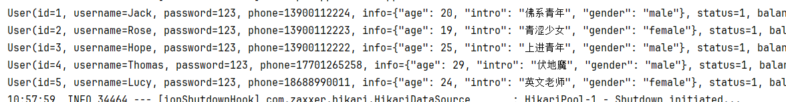

可以看到，我们根本没在Service层编写任何代码，仅使用IService就能够查询出所有的用户信息

IService提供的方法包括但不限于save、saveBatch、saveOrUpdate、removeById、updateById、update、list、listById、getById、count、page等等，覆盖可能需要的大量方法

#### 基础业务接口

基于Restful风格实现下列接口

| 编号 | 接口               | 请求方式 | 请求路径                      | 请求参数         | 返回值     |
| ---- | ------------------ | -------- | ----------------------------- | ---------------- | ---------- |
| 1    | 新增用户           | POST     | /users                        | 用户表单实体     | 无         |
| 2    | 删除用户           | DELETE   | /users/{id}                   | 用户id           | 无         |
| 3    | 根据id查询用户     | GET      | /users/{id}                   | 用户id           | 用户VO     |
| 4    | 根据id批量删除用户 | GET      | /users                        | 用户id集合       | 用户VO集合 |
| 5    | 根据id扣减余额     | PUT      | /users/{id}/deduction/{money} | 用户id，扣减金额 | 无         |

```java
package com.itheima.mp.controller;

import com.itheima.mp.domain.dto.UserFormDTO;
import com.itheima.mp.domain.po.User;
import com.itheima.mp.domain.vo.UserVO;
import com.itheima.mp.service.IUserService;
import io.swagger.annotations.Api;
import io.swagger.annotations.ApiOperation;
import lombok.AllArgsConstructor;
import lombok.RequiredArgsConstructor;
import lombok.extern.slf4j.Slf4j;
import org.springframework.beans.BeanUtils;
import org.springframework.web.bind.annotation.*;

import java.util.List;

@RestController
@RequestMapping("/users")
@Slf4j
@Api(tags = "用户管理接口")
@RequiredArgsConstructor
public class UserController {

    private final IUserService userService;

    /**
     * 新增用户接口
     * @param userFormDTO 用户信息
     */
    @PostMapping
    @ApiOperation("新增用户接口")
    public void save(@RequestBody UserFormDTO userFormDTO) {
        log.info("保存用户信息：{}", userFormDTO);
        User user = new User();
        BeanUtils.copyProperties(userFormDTO, user);
        userService.save(user);
    }

    /**
     * 删除用户接口
     * @param id 用户id
     */
    @DeleteMapping("/{id}")
    @ApiOperation("删除用户接口")
    public void delete(@PathVariable Long id) {
        log.info("删除用户信息：{}", id);
        userService.removeById(id);
    }

    /**
     * 根据id查询用户接口
     * @param id 用户id
     * @return 用户信息
     */
    @GetMapping("/{id}")
    @ApiOperation("根据id查询用户接口")
    public UserVO getById(@PathVariable Long id) {
        log.info("查询用户信息：{}", id);
        UserVO userVO = new UserVO();
        BeanUtils.copyProperties(userService.getById(id), userVO);
        return userVO;
    }

    /**
     * id批量查询用户接口
     * @param ids 用户id列表
     * @return 用户信息列表
     */
    @GetMapping
    @ApiOperation("查询id批量查询用户接口")
    public List<UserVO> listByIds(@RequestParam List<Long> ids) {
        log.info("查询id批量查询用户信息：{}", ids);
        return userService.listByIds(ids).stream().map(user -> {
            UserVO userVO = new UserVO();
            BeanUtils.copyProperties(user, userVO);
            return userVO;
        }).toList();
    }
}
```

对于已经熟练掌握CRUD的我们来说，这些内容简直易如反掌

#### 复杂业务接口

上文中第五个接口不能直接调用现有的IService方法实现，因此仍需我们自己定义方法

```java
package com.itheima.mp.service.impl;

import com.baomidou.mybatisplus.extension.service.impl.ServiceImpl;
import com.itheima.mp.domain.po.User;
import com.itheima.mp.mapper.UserMapper;
import com.itheima.mp.service.IUserService;
import org.springframework.stereotype.Service;

@Service
public class IUserServiceImpl extends ServiceImpl<UserMapper, User> implements IUserService {

    /**
     * 根据用户id扣减余额
     * @param id   用户id
     * @param money 扣减金额
     */
    @Override
    public void deductById(Long id, Integer money) {
        // 获取用户信息
        User user = this.getById(id);
        // 判断账户是否存在
        if (user == null)
            throw new RuntimeException("用户不存在");
        // 判断账户余额是否充足
        if (user.getBalance() >= money)
            user.setBalance(user.getBalance() - money);
        else
            throw new RuntimeException("账户余额不足");
        // 更新用户信息
        this.updateById(user);
    }
}
```

当然，也可以选择使用自定义Mapper

Service

```java
package com.itheima.mp.service.impl;

import com.baomidou.mybatisplus.extension.service.impl.ServiceImpl;
import com.itheima.mp.domain.po.User;
import com.itheima.mp.mapper.UserMapper;
import com.itheima.mp.service.IUserService;
import org.springframework.stereotype.Service;

@Service
public class IUserServiceImpl extends ServiceImpl<UserMapper, User> implements IUserService {

    /**
     * 根据用户id扣减余额
     * @param id   用户id
     * @param money 扣减金额
     */
    @Override
    public void deductById(Long id, Integer money) {
        // 获取用户信息
        User user = this.getById(id);
        // 判断账户是否存在
        if (user == null)
            throw new RuntimeException("用户不存在");
        // 判断账户余额是否充足
        if (user.getBalance() >= money)
            user.setBalance(user.getBalance() - money);
        else
            throw new RuntimeException("账户余额不足");
        // 更新用户信息
        baseMapper.deductById(id, money);
    }
}
```

Mapper

```java
package com.itheima.mp.mapper;

import com.baomidou.mybatisplus.core.conditions.update.LambdaUpdateWrapper;
import com.baomidou.mybatisplus.core.mapper.BaseMapper;
import com.baomidou.mybatisplus.core.toolkit.Constants;
import com.itheima.mp.domain.po.User;
import org.apache.ibatis.annotations.Mapper;
import org.apache.ibatis.annotations.Param;
import org.apache.ibatis.annotations.Update;

import java.util.List;

@Mapper
public interface UserMapper extends BaseMapper<User> {

    /**
     * 根据id扣减余额
     * @param id 用户id
     * @param money 扣减金额
     */
    @Update("update user set balance = balance - #{money} where id = #{id}")
    void deductById(Long id, Integer money);
}
```

### IService Lambda

IService除了提供基本的查询方法外，也提供了基于Lambda表达式的查询方法，如LambdaQueryChainWrapper和LambdaUpdateChainWrapper

现在我们需要完成一个接口，根据复杂条件查询用户，条件为name、status、minBalance以及maxBalance，使用LambdaQueryChainWrapper完成

```java
/**
 * 复杂查询
 * @param userQuery 查询条件
 * @return 用户信息列表
 */
@Override
public List<UserVO> complexQuery(UserQuery userQuery) {
    return lambdaQuery()
            .like(userQuery.getName() != null, User::getUsername, userQuery.getName())
            .eq(userQuery.getStatus() != null, User::getStatus, userQuery.getStatus())
            .ge(userQuery.getMinBalance() != null, User::getBalance, userQuery.getMinBalance())
            .le(userQuery.getMaxBalance() != null, User::getBalance, userQuery.getMaxBalance())
            .list()
            .stream()
            .map(user -> {
                UserVO userVO = new UserVO();
                BeanUtils.copyProperties(user, userVO);
                return userVO;
            })
            .toList();
}
```

简单解释一下lambdaQuery()的使用，lambdaQuery()支持链式编程，使用sql关键字作为方法名，如like()、eq()等，当需要构造查询条件时，使用对应实体类的getter获取对应字段名，然后传入需要比较的值。每个关键字方法都存在一个重写方法，重写方法新增了一个参数condition用于在构造动态sql，避免因为参数值为null而导致查询时报错。在条件构造完成后，需要使用one()、list()、count()等执行方法才能真正进行执行，执行完成后通过StreamAPI转换为List\<UserVO\>返回前端

> 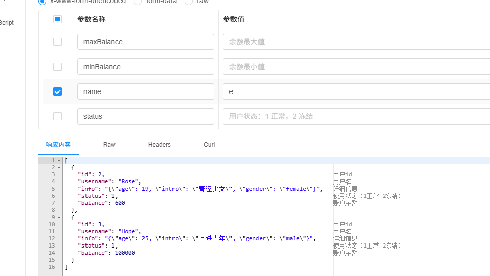

lambdaUpdate()用法与lambdaQuery()类似，set()方法也有一个重写方法的第一个参数为condition

```java
// 更新用户信息
lambdaUpdate()
        .eq(User::getId, id)
        .set(User::getBalance, user.getBalance() - money)
        .set(Objects.equals(user.getBalance(), 0), User::getStatus, 2)
        .update();
```

如上，只有当用户余额为0的时候，才会将用户状态进行变更，相当于XML中的\<if test="balance == 0"\>status = #{status}\</if\>

### IService批处理

IService拥有自己的批处理逻辑，比传统for循环直接插入的性能要更好。我们使用一个例子来展示

将五万条数据插入表中

1. 直接插入

```java
@Test
void testSave() {
    Long begin = System.currentTimeMillis();
    for (int i = 0; i < 50000; i++) {
        save(i);
    }
    Long end = System.currentTimeMillis();
    System.out.println("耗时：" + (end - begin));
}
```

> 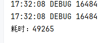


2. 批处理插入

因为saveBatch()的容量有限，因此需要将五万条数据拆分为多次插入，这里我们规定每5000条插入一次，共计插入10次

```java
@Test
void testSaveBatch() {
    Long begin = System.currentTimeMillis();
    List<User> userList = new ArrayList<>(5000);
    for (int i = 1; i <= 50000; i++) {
        userList.add(userBuilder(i));
        if (i % 5000 == 0) {
            userService.saveBatch(userList);
            userList.clear();
        }
    }
    Long end = System.currentTimeMillis();
    System.out.println("耗时：" + (end - begin));
}
```

> 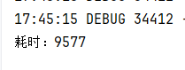

可以看到，仅用了9577毫秒就完成了所有数据的插入，相较于直接插入的49265毫秒，速度提升了5.1倍

同时，如果在jdbc的url中使用了rewriteBatchedStatements=true，性能可以进一步提升

```yml
spring:
  datasource:
    url: jdbc:mysql://localhost:3306/mp?useUnicode=true&characterEncoding=UTF-8&autoReconnect=true&serverTimezone=Asia/Shanghai&rewriteBatchedStatements=true
    driver-class-name: com.mysql.cj.jdbc.Driver
    username: root
    password: root
```

> 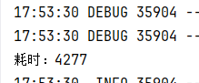

### DB静态工具

MyBatis-Plus提供了一些静态工具类，这些静态工具类通过传入实体类的class对象，通过反射获取实体类信息，然后构建对应的IService，就不需要我们再重复构建，或者注入对应的IService类。举个例子，假设存在两个Service，分别是用户Service和地址Service，用户Service中需要注入地址Service来查询用户对应的地址，地址Service也需要注入用户Service查询地址对应的用户，这就会出现循环依赖的问题，以往我们是通过@Lazy注解，通过动态代理来解决这个问题，在MyBatis-Plus中则可以通过DB静态工具，直接调用静态方法，而非注入Service，从根本上解决问题。但是需要注意，DB静态工具的实质是将已有的Mapper生成表信息缓存，所以在使用时必须保证对应实体类拥有自己的Mapper

**示例**

1. 改造根据id查询用户的接口，查询用户的同时，查询出用户对应的所有地址

`Controller`

```java
@GetMapping("/{id}")
@ApiOperation("根据id查询用户接口")
public UserVO getById(@PathVariable Long id) {
    log.info("查询用户信息：{}", id);;
    return userService.getWithAddressesById(id);
}
```

`Service`

```java
@Override
public UserVO getWithAddressesById(Long id) {
    // 获取用户信息
    User user = this.getById(id);
    // 获取用户地址信息
    List<Address> addresses = Db.lambdaQuery(Address.class)
            .eq(Address::getUserId, id)
            .list();
    // 封装用户信息
    UserVO userVO = new UserVO();
    BeanUtils.copyProperties(user, userVO);
    userVO.setAddresses(addresses.stream().map(address -> {
        AddressVO addressVO = new AddressVO();
        BeanUtils.copyProperties(address, addressVO);
        return addressVO;
    }).toList());
    return userVO;
}
```

2. 改造根据id批量查询用户接口，查询用户的同时，查询出用户对应的所有地址

`Controller`

```java
@GetMapping
@ApiOperation("查询id批量查询用户接口")
public List<UserVO> listByIds(@RequestParam List<Long> ids) {
    log.info("查询id批量查询用户信息：{}", ids);
    return userService.getWithAddressesByIds(ids);
}
```

`Service`

```java
@Override
public List<UserVO> getWithAddressesByIds(List<Long> ids) {
    // 查询所有用户
    List<User> users = this.listByIds(ids);
    // 转换为UserVO
    List<UserVO> userVOS = users.stream()
            .map(user -> {
                UserVO userVO = new UserVO();
                BeanUtils.copyProperties(user, userVO);
                return userVO;
            })
            .toList();
    // 获取用户地址信息
    List<Address> addresses = Db.lambdaQuery(Address.class)
            .in(Address::getUserId, ids)
            .list();
    // 转换为AddressVO
    List<AddressVO> addressVOS = addresses.stream()
            .map(address -> {
                AddressVO addressVO = new AddressVO();
                BeanUtils.copyProperties(address, addressVO);
                return addressVO;
            })
            .toList();
    // 将addressVOS分组为Map<Long, List<AddressVO>>
    Map<Long, List<AddressVO>> addressMap = addressVOS.stream().collect(Collectors.groupingBy(AddressVO::getUserId));
    // 封装用户信息
    userVOS.forEach(userVO -> userVO.setAddresses(addressMap.get(userVO.getId())));
    return userVOS;
}
```

第二小题会涉及一些程序优化问题，比如需要尽量减少数据库的连接调用，数据库连接需要耗费大量的系统资源，如果是遍历每个用户，然后获取每个用户的id，再对每个id分别查询其地址信息，性能表现相比两次查询，然后再单独分组就要差得多

### 逻辑删除

逻辑删除是指基于代码逻辑模拟删除效果，但并不会真正删除数据，一般的思路是在表中添加一个是否被逻辑删除的字段，当字段值为1时表示被逻辑删除，而查询时只查询逻辑删除字段值为0的数据

MyBatis-Plus提供了全局逻辑删除的配置，只要设置了逻辑字段和默认值，就能够自动在所有需要的SQL语句中自动添加逻辑删除的约束

```yml
mybatis-plus:
  global-config:
    db-config:
      logic-delete-field: flag
      logic-delete-value: 1
      logic-not-delete-value: 0
```

显而易见的，逻辑删除的缺陷也很明显，开启逻辑删除会导致数据库中的垃圾数据越来越多，影响查询效率，SQL中也全部都需要进行一次逻辑删除约束判断，所以一般不会启动逻辑删除，而是可以将删除的数据转移到其他表中

### 数据处理器

#### 枚举处理器

在定义实体类的时候，我们可能会定义一些表示状态的字段，如支付状态，订单状态，用户状态等等，这些状态在数据库中可能会用数字来表示。但如果在实体类中同样使用数字表示，可能会导致可读性比较差，例如`private Integer status`，在没有备注的情况下，开发人员并不知道每个数字所对应的意义。有的会使用枚举类来表示这些常量，比如定义一个用户状态枚举类UserStatus，在枚举类中定义用户状态常量NORMAL、FREEZE。可是此时由会出现实体类数据类型与数据库字段类型不一致的问题。

为了应对这种情况，我们可以定义一个特殊的用户状态枚举类，在枚举类中定义特殊枚举值，每个枚举值包含两个值，一个值代表数据库中对应的数字，另一个值代表对应含义，而在Java程序中，我们直接使用枚举值本身即可

**示例**

更改User实体的status类型为枚举类型，并使用MyBatis-Plus提供的枚举处理器来处理数据库操作逻辑

1. 设置默认枚举处理器

```yml
mybatis-plus:
  configuration:
    # 默认枚举处理器
    default-enum-type-handler: com.baomidou.mybatisplus.core.handlers.MybatisEnumTypeHandler
```

2. 定义枚举类，注意需要提供Getter供其他类调用

```java
package com.itheima.mp.enums;

import lombok.Getter;

@Getter
public enum UserStatus {
    NORMAL(1, "正常"),
    FREEZE(2, "冻结");

    private final Integer code;
    private final String message;

    UserStatus(Integer code, String message) {
        this.code = code;
        this.message = message;
    }
}
```

3. 更改实体类与VO的数据类型，并为数据库中存储的字段添加@EnumValue注解，告知MyBatis-Plus对应字段类型与数据库字段类型相同

```java
package com.itheima.mp.enums;

import lombok.Getter;

@Getter
public enum UserStatus {
    NORMAL(1, "正常"),
    FREEZE(2, "冻结");
	
    @EnumValue
    private final Integer code;
    private final String message;

    UserStatus(Integer code, String message) {
        this.code = code;
        this.message = message;
    }
}
```

4. 为了让前端显示message的内容，我们也需要告知SpringMVC前端需要的值，所以添加@JsonValue注解

```java
package com.itheima.mp.enums;

import lombok.Getter;

@Getter
public enum UserStatus {
    NORMAL(1, "正常"),
    FREEZE(2, "冻结");
	
    @EnumValue
    private final Integer code;
    @JsonValue
    private final String message;

    UserStatus(Integer code, String message) {
        this.code = code;
        this.message = message;
    }
}
```

5. 测试效果

> 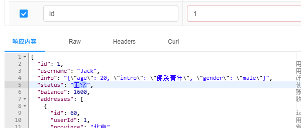

#### JSON处理器

同样地，当数据库中需要的数据为JSON格式时，MyBatis并没有能力直接将Java实体转换为JSON，每次操作数据时我们自己来转换也非常麻烦，因此MyBatis-Plus提供了JSON处理器来处理实体与JSON的转换问题

**示例**

将User实体类中的userInfo字段类型提升为一个UserInfo实体类，通过实体类来表示用户信息

1. 创建UserInfo实体类

```java
package com.itheima.mp.domain.po;

import lombok.AllArgsConstructor;
import lombok.Builder;
import lombok.Data;
import lombok.NoArgsConstructor;

@Data
@AllArgsConstructor
@NoArgsConstructor
@Builder
public class UserInfo {

    private Integer age;
    private String intro;
    private String sex;
}
```

2. 在User实体类中为userInfo字段添加@TableField(typeHandler = JacksonTypeHandler.class)注解以启用JSON处理器

```java
@TableField(typeHandler = JacksonTypeHandler.class)
private UserInfo info;
```

3. 在User实体类上添加@TableName(autoResultMap = true)以启动自动ResultMap，保证查询时能够自动创建自定义结果集

```java
@Data
@Builder
@AllArgsConstructor
@NoArgsConstructor
@TableName(autoResultMap = true)
public class User {
	...
}
```

4. 测试效果

> 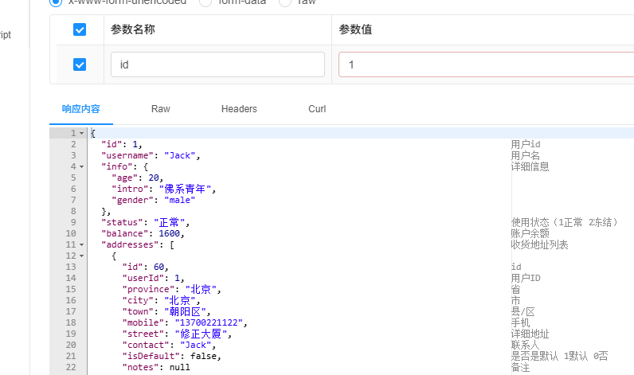

### 分页插件

MyBatis-Plus也提供了分页功能，可以避免项目中使用过多的依赖导致的兼容性或者性能问题

#### 快速入门

1. 创建MyBatis-Plus拦截器，并启用分页插件

```java
package com.itheima.mp.config;

import com.baomidou.mybatisplus.annotation.DbType;
import com.baomidou.mybatisplus.extension.plugins.MybatisPlusInterceptor;
import com.baomidou.mybatisplus.extension.plugins.inner.PaginationInnerInterceptor;
import org.springframework.context.annotation.Bean;
import org.springframework.context.annotation.Configuration;

@Configuration
public class MyBatisPlusConfiguration {

    @Bean
    public MybatisPlusInterceptor mybatisPlusInterceptor() {
        // 创建拦截器
        MybatisPlusInterceptor interceptor = new MybatisPlusInterceptor();
        // 声明分页拦截器，并设置后台数据库类型为MYSQL
        PaginationInnerInterceptor paginationInnerInterceptor = new PaginationInnerInterceptor(DbType.MYSQL);
        // 设置最大分页长度
        paginationInnerInterceptor.setMaxLimit(5000L);
        // 添加拦截器
        interceptor.addInnerInterceptor(paginationInnerInterceptor);
        return interceptor;
    }
}
```

2. 在Service中使用分页

```java
@Override
public List<UserVO> pageQuery(Integer pageNum, Integer pageSize) {
    pageNum = pageNum == null ? 1 : pageNum;
    pageSize = pageSize == null ? 10 : pageSize;

    // 定义分页实体
    Page<User> page = new Page<>(pageNum, pageSize);
    // 设置分页排序条件
    page.addOrder(new OrderItem("id", true));
    // 执行分页查询
    this.page(page);
    // 获取分页结果
    List<User> records = page.getRecords();
    return records.stream()
            .map(user -> {
                UserVO userVO = new UserVO();
                BeanUtils.copyProperties(user, userVO);
                return userVO;
            })
            .toList();
}
```

> 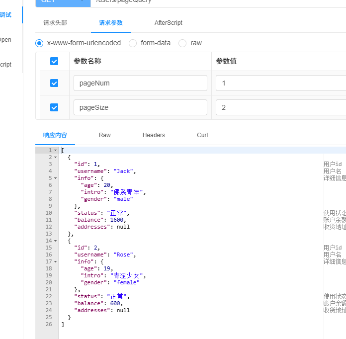

#### 通用分页实体

在分页功能实际使用过程中，经常会出现需要自定义排序条件的情况，如果每次都由开发人员构造一个Page对象并设置相关的排序条件，就会显得非常麻烦，因此我们可以定义一个通用分页实体，分页实体接收通用属性pageNum、pageSize、sortBy、isAsc，然后由子类接收专有属性，如name、status、minBalance等等，再在通用分页实体中完成对Page对象的转换

**示例**

改造现有的分页查询接口，添加一些查询条件

1. 创建通用分页实体

```java
package com.itheima.mp.domain.query;

import lombok.Data;

@Data
public class PageQuery {
    private Integer pageNo;
    private Integer pageSize;
    private String sortBy;
    private Boolean isAsc;
}
```

2. 将用户查询实体继承分页实体

```java
package com.itheima.mp.domain.query;

import io.swagger.annotations.ApiModel;
import io.swagger.annotations.ApiModelProperty;
import lombok.Data;
import lombok.EqualsAndHashCode;

@EqualsAndHashCode(callSuper = true)
@Data
@ApiModel(description = "用户查询条件实体")
public class UserQuery extends PageQuery{
    @ApiModelProperty("用户名关键字")
    private String name;
    @ApiModelProperty("用户状态：1-正常，2-冻结")
    private Integer status;
    @ApiModelProperty("余额最小值")
    private Integer minBalance;
    @ApiModelProperty("余额最大值")
    private Integer maxBalance;
}
```

3. 在通用分页实体中完成分页实体对mp分页实体Page的转换

定义一个方法，声明方法泛型\<T\>，参数为OrderItem可变参数，因为addOrder()方法支持接收可变参数。然后创建mp的page实体，根据PageQuery的属性值与toPage()方法的参数列表来添加排序条件，否则使用默认排序。并且为了方便使用，我们又定义了两个重写方法，支持无参数与简易参数

```java
package com.itheima.mp.domain.query;

import com.baomidou.mybatisplus.core.metadata.OrderItem;
import com.baomidou.mybatisplus.extension.plugins.pagination.Page;
import lombok.Data;

@Data
public class PageQuery {
    private Integer pageNo = 1;
    private Integer pageSize = 10;
    private String sortBy;
    private Boolean isAsc = true;

    /**
     * 转换为mp分页对象
     * @param items 排序条件
     * @return mp分页对象
     */
    public <T> Page<T> toPage(OrderItem ... items) {
        // 创建mp分页对象
        Page<T> page = new Page<>(pageNo, pageSize);
        // 设置排序条件
        if (sortBy != null && !sortBy.isEmpty()) {
            // 如果sortBy不为空，则设置排序条件
            page.addOrder(new OrderItem(sortBy, isAsc));
        } else if (items != null && items.length > 0) {
            // 如果items不为空，则设置排序条件
            page.addOrder(items);
        } else {
            // 默认排序
            page.addOrder(OrderItem.desc("id"));
        }
        return page;
    }

    /**
     * 创建mp分页对象
     * @return mp分页对象
     * 默认id降序
     */
    public <T> Page<T> toPage() {
        return toPage(new OrderItem[0]);
    }

    /**
     * 创建mp分页对象
     * @param sortBy 排序字段
     * @param isAsc 是否升序
     * @return mp分页对象
     */
    public <T> Page<T> toPage(String sortBy, Boolean isAsc) {
        return toPage(new OrderItem(sortBy, isAsc));
    }
}
```

## 微服务

### 单体架构

单体架构是指将业务的所有功能集中在一个项目中开发，打成一个包部署，其优点为架构简单，部署成本低，缺点也很明显，团队协作成本高，系统发布效率低，系统可用性差

### 微服务架构

微服务是一种软件架构风格，是服务化思想指导下的一套最佳实践架构的解决方案。它以专注于单一职责的很多小项目为基础，组合出复杂的大型应用

微服务架构要求粒度小，团队自洽，服务自洽

微服务架构同样会遇到很多问题，包括但不限于服务拆分、远程调用、服务治理、请求路由、身份认证、配置管理、服务保护、分布式事务、异步通信、消息可靠性、延迟消息、分布式搜索、倒排索引、数据聚合等等

### Spring Cloud

SpringCloud是目前业界使用最广泛的微服务框架，集成了各种微服务功能组件，并基于SpringBoot实现了这些组件的自动装配，从而提供了良好的开箱即用体验

### 拆分原则

**项目架构选择**

1. 创业型项目：先采用单体架构，快速开发，快速试错。随着规模扩大，再逐渐拆分
2. 确定的大型项目：资金充足，目标明确，可以直接选择微服务架构，避免后续拆分的麻烦

**已有项目拆分**

1. 高内聚：每个微服务的职责尽量单一，包含的业务相互关联度高，完整度高
2. 低耦合：每个微服务的功能要求相对独立，尽量减少对其他服务的依赖

从拆分方式来说，一般包含两种拆分模式，横向拆分是指按照业务模块来拆分，纵向拆分是指抽取公共服务，提高复用性

#### 实践-商品模块拆分

现在要求对商品模块进行拆分，拆分完成后，商品模块需要能够独立完成自己的所有逻辑

1. 创建模块

> 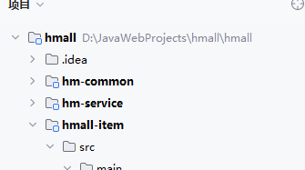

2. 创建com.hmall.item包，并定义需要的controller、service、mapper和domain

> 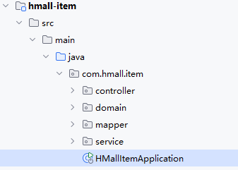

3. 复制配置文件，并修改端口为8081防止冲突，修改spring.appilcation.name，以及修改knife4j的扫描包

```yml
server:
  port: 8081
spring:
  application:
    name: hmall-item
  profiles:
    active: local
  datasource:
    url: jdbc:mysql://${hm.db.host}:3306/hmall?useUnicode=true&characterEncoding=UTF-8&autoReconnect=true&serverTimezone=Asia/Shanghai
    driver-class-name: com.mysql.cj.jdbc.Driver
    username: root
    password: ${hm.db.pw}
mybatis-plus:
  configuration:
    default-enum-type-handler: com.baomidou.mybatisplus.core.handlers.MybatisEnumTypeHandler
  global-config:
    db-config:
      update-strategy: not_null
      id-type: auto
logging:
  level:
    com.hmall: debug
  pattern:
    dateformat: HH:mm:ss:SSS
  file:
    path: "logs/${spring.application.name}"
knife4j:
  enable: true
  openapi:
    title: 黑马商城接口文档
    description: "黑马商城接口文档"
    email: zhanghuyi@itcast.cn
    concat: 虎哥
    url: https://www.itcast.cn
    version: v1.0.0
    group:
      default:
        group-name: default
        api-rule: package
        api-rule-resources:
          - com.hmall.item.controller
```

4. 复制所有需要的类到包中，并创建启动类

> 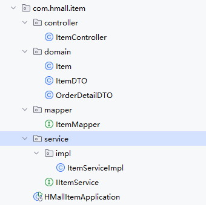

5. 启动项目，访问localhost:8081/doc.html

> 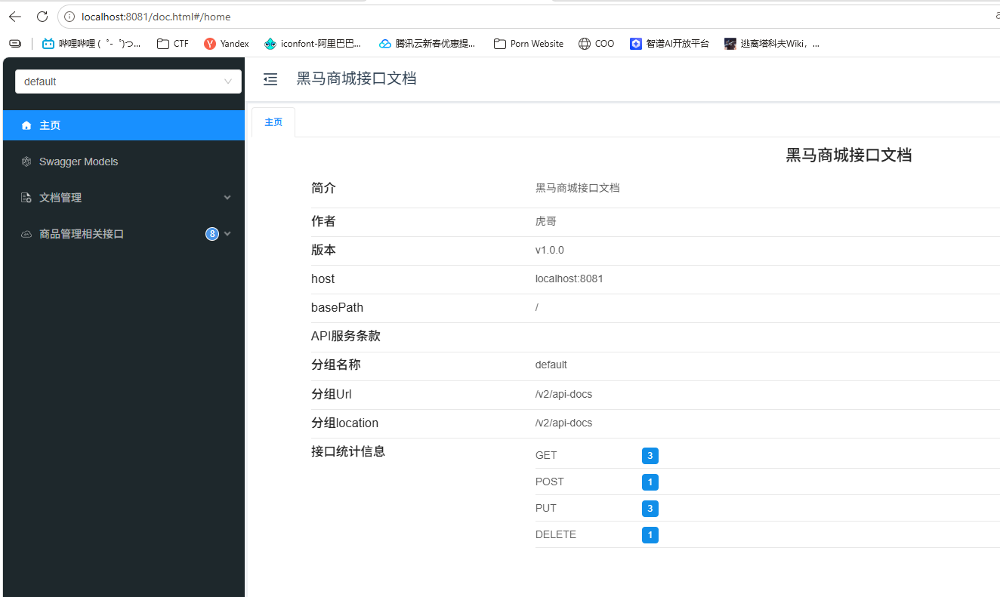

这样我们就拆好了商品模块

### 远程调用

在对购物车模块进行拆分时，我们发现其需要商品模块的服务

```java
// 2.查询商品
List<ItemDTO> items = itemService.queryItemByIds(itemIds);
```

但是微服务架构要求每个服务职责单一，因此我们只能通过在微服务中通过网络通信来访问对应的服务，即远程调用

远程调用不是一个插件或功能，而是一种解决方案，任何可以发送并接收HTTP请求的工具都可以进行远程调用，这里我们使用Spring WebClient，当然也可以选择之前苍穹外卖的HttpClient

HTTP客户端的基本用法都是一样的，需要请求路径、请求方法和请求参数三个条件

1. 创建WebClient，并设置请求路径

```java
// 创建WebClient
WebClient webClient = WebClient.create("http://localhost:8081/items");
```

2. 设置请求方法为GET，请求参数为ids，webclient可以自动帮我们将响应内容转换为指定的实体类，并且使用collectList()方法转换为一个List集合

```java
// 2.发送请求
List<ItemDTO> items = webClient.get()
        .uri(uriBuilder -> uriBuilder.queryParam("ids", itemIds).build())
        .retrieve()
        .bodyToFlux(ItemDTO.class)
        .collectList()
        .block();
```

### 服务注册

在上文的远程调用实现中，不难发现，当我们需要调用外部服务时，必须直接指定对应服务的固定ip与端口，假设某个服务负载相比其他服务更高，因此需要部署多个服务，但此时其他服务就不能同时指定多个ip地址，或者无法按照指定要求去自动选择ip地址

因此Spring Cloud提供了服务注册这样的解决方案，所有的服务需要在一个服务中心注册自己的服务，然后提供持续的心跳包，以表示服务在线状态，当第三方服务需要远程调用时，直接在服务中心请求对应的服务，由服务中心提供目前拥有的所有对应服务，第三方服务再从中选择一个服务，并获取服务的基本信息，如ip、端口等等，最后进行远程调用获取数据

#### NACOS

Nacos是Spring Cloud Alibaba提供的的一个动态服务发现、配置管理和服务管理平台，旨在帮助用户更轻松地构建和管理微服务架构，Nacos 支持基于 DNS 和 RPC 的服务发现，允许服务提供者注册服务，服务消费者可以通过 DNS 或 API 查找和发现服务。Nacos 还提供实时健康检查，确保请求不会发送到不健康的服务实例

##### 快速入门

1. 下载并启动nacos

> 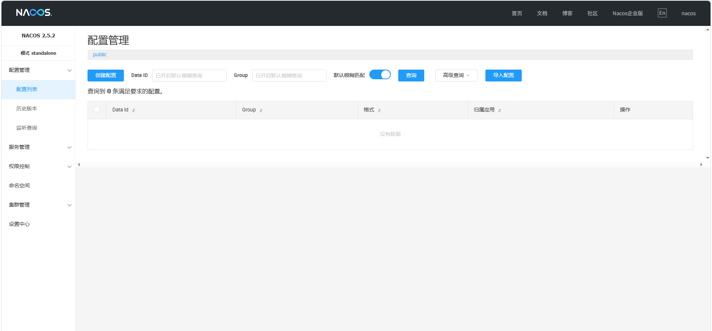

2. 在项目中引入nacos依赖

```xml
<!--nacos-->
<dependency>
    <groupId>com.alibaba.cloud</groupId>
    <artifactId>spring-cloud-starter-alibaba-nacos-discovery</artifactId>
</dependency>
```

3. 在配置文件中添加nacos服务地址

```yml
spring:
  cloud:
    nacos:
      discovery:
        server-addr: localhost:8848
```

如果开启了权限管理，还需要配置用户名与密码

```yml
spring:
  cloud:
    nacos:
      discovery:
        server-addr: localhost:8848
        username: kiiz
        password: kiiz
```

4. 重启服务，在nacos中已经能够看到注册的服务

> 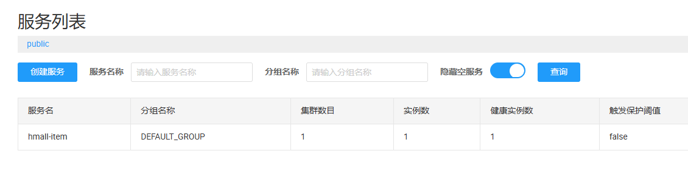

5. 在hmall-cart中注入DiscoveryClient

```java
private final DiscoveryClient discoveryClient;
```

6. 获取服务列表，选取服务，并发送请求

```java
// 获取服务列表
List<ServiceInstance> serviceInstances = discoveryClient.getInstances("hmall-item");
// 选取服务实例
ServiceInstance serviceInstance = serviceInstances.get(0);
// 获取服务uri
URI uri = serviceInstance.getUri();
// 创建WebClient
WebClient webClient = WebClient.create(uri.toString());
// 2.发送请求
List<ItemDTO> items = webClient.get()
        .uri(uriBuilder -> uriBuilder
                .path("/items")
                .queryParam("ids", itemIds)
                .build()
        )
        .retrieve()
        .bodyToFlux(ItemDTO.class)
        .collectList()
        .block();
```

#### OpenFeign

Spring Cloud OpenFeign是一种基于Spring Cloud的声明式REST客户端，它简化了与HTTP服务交互的过程。它将REST客户端的定义转化为Java接口，并且可以通过注解的方式来声明请求参数、请求方式、请求头等信息，从而使得客户端的使用更加方便和简洁。同时，它还提供了负载均衡和服务发现等功能，可以与Eureka、Consul等注册中心集成使用。Spring Cloud OpenFeign能够提高应用程序的可靠性、可扩展性和可维护性，是构建微服务架构的重要工具之一

简单来说，OpenFeign就是一个HTTP客户端，支持开发人员使用SpringMVC注解快捷访问注册中心的服务

##### 快速入门

1. 引入依赖

```xml
<!--openfeign-->
<dependency>
    <groupId>org.springframework.cloud</groupId>
    <artifactId>spring-cloud-starter-openfeign</artifactId>
</dependency>
<!--负载均衡-->
<dependency>
    <groupId>org.springframework.cloud</groupId>
    <artifactId>spring-cloud-starter-loadbalancer</artifactId>
</dependency>
```

2. 使用@EnableFeignClients注解开启feign

```java
package com.hmall.cart;

import org.mybatis.spring.annotation.MapperScan;
import org.springframework.boot.SpringApplication;
import org.springframework.boot.autoconfigure.SpringBootApplication;
import org.springframework.cloud.openfeign.EnableFeignClients;
import org.springframework.cloud.openfeign.FeignClient;

@MapperScan("com.hmall.cart.mapper")
@SpringBootApplication
@EnableFeignClients
public class HMallCartApplication {
    public static void main(String[] args) {
        SpringApplication.run(HMallCartApplication.class, args);
    }
}
```

3. 定义FeignClient接口，添加@FeignClient()注解用于表明需要的服务名称

```java
package com.hmall.cart.client;

import com.hmall.cart.domain.ItemDTO;
import org.springframework.cloud.openfeign.FeignClient;
import org.springframework.web.bind.annotation.GetMapping;

import java.util.Collection;
import java.util.List;

@FeignClient("hmall-item")
public interface ItemClient {

}
```

4. 定义请求方法，直接使用SpringMVC的注解即可，方法参数为请求参数，方法返回值类型为响应体解析的数据类型。注意这里的参数需要添加@RequestParam注解以标明请求参数

```java
package com.hmall.cart.client;

import com.hmall.cart.domain.ItemDTO;
import org.springframework.cloud.openfeign.FeignClient;
import org.springframework.web.bind.annotation.GetMapping;
import org.springframework.web.bind.annotation.RequestParam;

import java.util.Collection;
import java.util.List;

@FeignClient("hmall-item")
public interface ItemClient {

    @GetMapping("/items")
    List<ItemDTO> queryItemByIds(@RequestParam Collection<Long> ids);
}
```

5. 在Service中注入FeignClient，并调用方法获取数据

```java
private final ItemClient itemClient;
```

```java
// 1.获取商品id
Set<Long> itemIds = vos.stream().map(CartVO::getItemId).collect(Collectors.toSet());
// 2.调用商品服务，查询商品信息
List<ItemDTO> items = itemClient.queryItemByIds(itemIds);
// 3.转为 id 到 item的map
Map<Long, ItemDTO> itemMap = items.stream().collect(Collectors.toMap(ItemDTO::getId, Function.identity()));
```

6. 实际测试

> 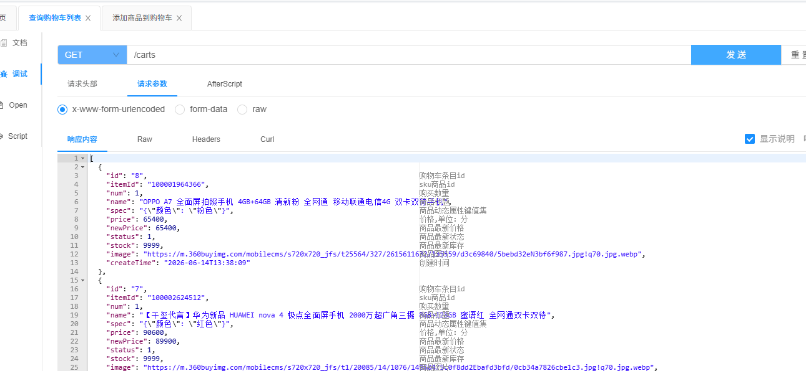

##### 连接池

Feign默认使用的HttpURLConnection是不支持连接池的，每次发送请求都会经历一次连接与释放，在负载严重的情况下效率非常低，但Feign支持使用Apache HttpClient或者OKHttp，而后两者支持连接池

1. 引入依赖，注意是引入`feign-httpclient`，而不是真正的`httpclient`

```java
<!--feign-httpClient -->
<dependency>
    <groupId>io.github.openfeign</groupId>
    <artifactId>feign-httpclient</artifactId>
</dependency>
```

2. 在配置文件中启用

```yml
feign:
  httpclient:
    enabled: true
```

##### 最佳实践

- 主动暴露

上文中我们在编写FeignClient时是直接将其定义在子服务中的，但假设这是实际的两个开发团队在进行编写，一个团队很可能并不清楚另一个团队的开发细节，因此我们可以让服务的开发者，也就是实现服务细节的开发人员在自己的模块中编写FeignClient，然后暴露给外部，外部直接引用即可，不需要关注实现细节

一般来说，主动暴露是将子微服务再拆分为DTO、API和BIZ三个模块，DTO是用于微服务之间传输的数据实体，API是暴露的接口，即FeignClient，BIZ则是微服务自己的逻辑实现

- 公共管理

同样的，我们也可以定义一个公共API模块，存储所有的接口和DTO，其他微服务想要获取数据与DTO，直接导入API模块即可

这里我们以第二种举例

1. 创建新模块，创建文件目录

> 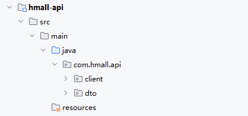

2. 在pom.xml中导入相关依赖

这里需要导入Swagger用于标注DTO，所以直接用hm-common依赖传递，同样地，利用依赖传递，直接在api中导入feign和httpclient，其他微服务就不需要二次导入

```xml
<dependencies>
    <!--common-->
    <dependency>
        <groupId>com.heima</groupId>
        <artifactId>hm-common</artifactId>
        <version>1.0.0</version>
    </dependency>
    <!--openfeign-->
    <dependency>
        <groupId>org.springframework.cloud</groupId>
        <artifactId>spring-cloud-starter-openfeign</artifactId>
    </dependency>
    <!--负载均衡-->
    <dependency>
        <groupId>org.springframework.cloud</groupId>
        <artifactId>spring-cloud-starter-loadbalancer</artifactId>
    </dependency>
    <!--feign-httpClient -->
    <dependency>
        <groupId>io.github.openfeign</groupId>
        <artifactId>feign-httpclient</artifactId>
    </dependency>
</dependencies>
```

3. 将ItemDTO和ItemClient复制到api模块中

> 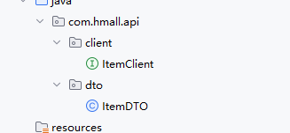

4. 在启动类中添加对api模块的包扫描

```java
package com.hmall.cart;

import org.mybatis.spring.annotation.MapperScan;
import org.springframework.boot.SpringApplication;
import org.springframework.boot.autoconfigure.SpringBootApplication;
import org.springframework.cloud.openfeign.EnableFeignClients;

@MapperScan("com.hmall.cart.mapper")
@SpringBootApplication
@EnableFeignClients(basePackages = "com.hmall.api.client")
public class HMallCartApplication {
    public static void main(String[] args) {
        SpringApplication.run(HMallCartApplication.class, args);
    }
}
```

##### 日志输出

Feign默认是没有日志输出的，想要开启Feign的日志输出，必须要开发人员自己进行相关配置

1. 定义FeignConfig类

定义一个Bean，返回值类型为Logger.Level，但是类上不能添加@Configuration注解，因为这会导致Spring将其作为全局配置，只要是调用了api模块的微服务，这个配置就都会生效，造成配置污染

```java
package com.hmall.api.config;

import feign.Logger;
import org.springframework.context.annotation.Bean;

public class FeignLogConfig {

    @Bean
    public Logger.Level feignLoggerLevel() {
        return Logger.Level.FULL;
    }
}
```

2. 在希望开启日志的微服务启动类的@EnableFeignClients注解中添加defaultConfiguration字段

```java
package com.hmall.cart;

import com.hmall.api.config.FeignLogConfig;
import org.mybatis.spring.annotation.MapperScan;
import org.springframework.boot.SpringApplication;
import org.springframework.boot.autoconfigure.SpringBootApplication;
import org.springframework.cloud.openfeign.EnableFeignClients;

@MapperScan("com.hmall.cart.mapper")
@SpringBootApplication
@EnableFeignClients(basePackages = "com.hmall.api.client", defaultConfiguration = FeignLogConfig.class)
public class HMallCartApplication {
    public static void main(String[] args) {
        SpringApplication.run(HMallCartApplication.class, args);
    }
}
```

如果希望配置只是局部生效，可以选择在@FeignClient注解上添加configuration注解

```java
package com.hmall.api.client;

import com.hmall.api.dto.ItemDTO;
import org.springframework.cloud.openfeign.FeignClient;
import org.springframework.stereotype.Component;
import org.springframework.web.bind.annotation.GetMapping;
import org.springframework.web.bind.annotation.RequestParam;

import java.util.Collection;
import java.util.List;

@FeignClient(value = "hmall-item", configuration = FeignConfig.class)
public interface ItemClient {

    @GetMapping("/items")
    List<ItemDTO> queryItemByIds(@RequestParam Collection<Long> ids);
}
```

### 网关

在服务拆分的过程中，不难发现我们无法获取用户的登录信息。在传统单体架构中，用户每次发起的请求都是通过前端发起的，而前端请求中会携带token信息，通过拦截器拦截请求即可得到token中的用户信息。而微服务架构中，很多请求是微服务间相互调用得到的，微服务间调用并不会传递token，而且我们在进行服务拆分时也并未给每个服务都设置拦截器。而且从前端来看，我们在nginx中只设置了一个服务器地址，如果我们将其拆分为多个微服务地址，假设这些微服务地址需要变化，或者一个微服务需要部署多个实例，实施起来都非常麻烦

所以，我们可以利用网关的思想。在计算机网络中，网关是连接两个使用不同协议的网络的设备。它通常位于网络边界，负责数据接收、解析、协议转换和转发，能够跨越不同的协议体系。而在微服务架构中，网关也是一个微服务，负责接收前端请求，验证用户身份，然后再通过注册中心访问其他服务

#### Spring Cloud Gateway

Spring Cloud Gateway 是 Spring Cloud 生态的微服务网关，基于 WebFlux 响应式编程模型，替代了老旧的 Zuul 网关。它的核心价值是：统一入口、路由转发、业务增强，是微服务架构中不可或缺的中间件。相较于Netfilx Zuul，Zuul基于Servlet的阻塞式编程，需要调优才能获得与SpringCloudGateway相当的性能

#### 快速入门

1. 创建gateway模块

> 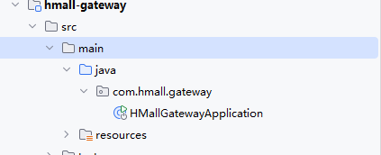

2. 引入依赖

```xml
<dependencies>
    <!--common-->
    <dependency>
        <groupId>com.heima</groupId>
        <artifactId>hm-common</artifactId>
        <version>1.0.0</version>
    </dependency>
    <!--nacos-->
    <dependency>
        <groupId>com.alibaba.cloud</groupId>
        <artifactId>spring-cloud-starter-alibaba-nacos-discovery</artifactId>
    </dependency>
    <!--负载均衡-->
    <dependency>
        <groupId>org.springframework.cloud</groupId>
        <artifactId>spring-cloud-starter-loadbalancer</artifactId>
    </dependency>
    <!--gateway-->
    <dependency>
        <groupId>org.springframework.cloud</groupId>
        <artifactId>spring-cloud-starter-gateway</artifactId>
    </dependency>
</dependencies>
```

3. 定义启动类

```java
package com.hmall.gateway;

import org.springframework.boot.SpringApplication;
import org.springframework.boot.autoconfigure.SpringBootApplication;

@SpringBootApplication
public class HMallGatewayApplication {
    public static void main(String[] args) {
        SpringApplication.run(HMallGatewayApplication.class, args);
    }
}
```

4. 在配置文件中定义路由

通过spring.cloud.gateway.routes记录路由表，每个表由id、uri、predicates三个字段构成，id是路由表中的唯一标识符， uri是路由服务ID，lb://表示负载均衡协议，predicates则表示路由断言

```yml
server:
  port: 8080
spring:
  application:
    name: hmall-gateway
  cloud:
    nacos:
      discovery:
        server-addr: localhost:8848
        username: kiiz
        password: kiiz
    gateway:
      routes:
        - id: hmall-item
          uri: lb://hmall-item
          predicates:
            - Path=/items/**,/search/**
        - id: hmall-cart
          uri: lb://hmall-cart
          predicates:
            - Path=/carts/**
        - id: hmall-order
          uri: lb://hmall-order
          predicates:
            - Path=/orders/**
        - id: hmall-pay
          uri: lb://hmall-pay
          predicates:
            - Path=/pay-orders/**
        - id: hmall-user
          uri: lb://hmall-user
          predicates:
            - Path=/addresses/**,/users/**
```

5. 访问localhost:8080/items/page测试路由效果

> 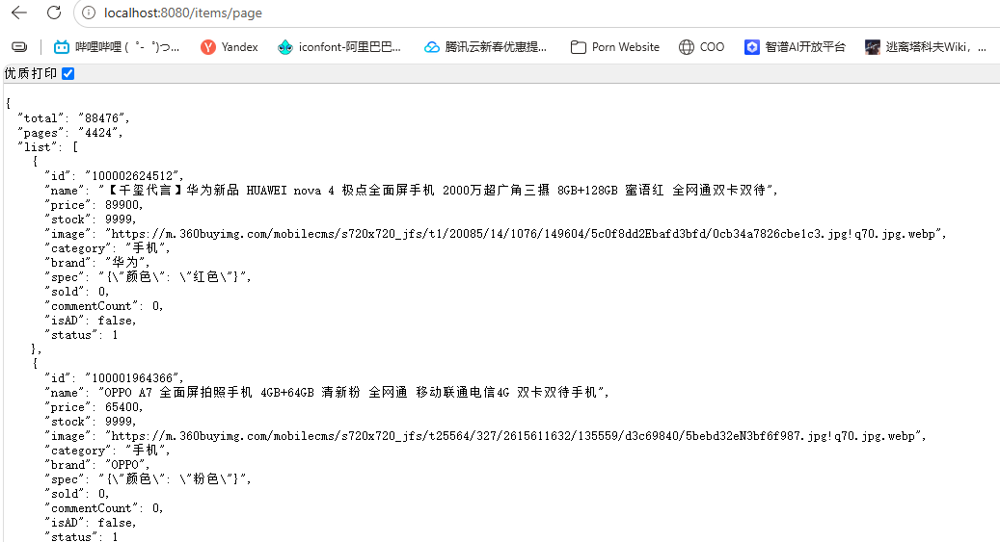

#### 路由属性

路由配置在Spring中通过RouteDefinition类解析，其常见属性有id、uri、predicates和filters

**路由断言**

predicates路由断言由RoutePredicateFactory实现，提供了12种基本的路由断言

| 名称                   | 说明                          | 示例                                                         |
| ---------------------- | ----------------------------- | ------------------------------------------------------------ |
| After                  | 某个时间点之后的请求          | - After=2037-01-20T17:00:00.000-07:00[America/Denver]        |
| Before                 | 某个时间点之前的请求          | - Before=2031-04-13T15:14:47.433+08:00[Asia/Shanghai]        |
| Between                | 两个时间点之间的请求          | - Between=2037-01-20T17:00:00.000-07:00[America/Denver], 2031-04-13T15:14:47.433+08:00[Asia/Shanghai] |
| Cookie                 | 请求必须包含某些Cookie        | - Cookie=chocolate, ch.p                                     |
| Header                 | 请求必须包含某些Header        | - Header=X-Request-Id, \d+                                   |
| Host                   | 限制请求域名                  | - Host=\*\*.host.org, \*\*.anotherhost.org                   |
| Method                 | 限制请求方式                  | - Method=GET, POST                                           |
| Path                   | 限制请求路径                  | - Path=/red/{segment}, /blue/\*\*                            |
| Query                  | 限制请求参数                  | - Query=name, Jack                                           |
| RemoteAddr             | 请求者真实ip必须符合指定规则  | - RemoteAddr=192.168.1.1/24                                  |
| Weight                 | 按权重处理                    | - Weight=group1,2                                            |
| XForwarded Remote Addr | 请求X-Forward必须符合指定规则 | - XForwardedRemoteAddr=192.168.1.1/24                        |

 **路由过滤器**

Spring Gateway种提供了高达33种路由过滤器，每种过滤器都可以过滤指定的内容

| 名称                 | 说明                       | 示例                                                         |
| -------------------- | -------------------------- | ------------------------------------------------------------ |
| AddRequestHeader     | 给请求中添加一个请求头     | AddRequestHeader=headerName, headerValue                     |
| RemoveRequestHeader  | 移除当前请求中的一个请求头 | RemoveRequestHeader=headerName                               |
| AddResponseHeader    | 给响应结果中添加一个响应头 | AddResponseHeader=headerName, headerValue                    |
| RemoveResponseHeader | 从响应结果中移除一个响应头 | RemoveResponseHeader=headerName                              |
| RewritePath          | 请求路径重写               | RewritePath=/red/?(?\<segment\>.\*), /\$\\{segment}          |
| StripPrefix          | 去除请求路径中的前缀段数   | StripPrefix=1,则路径/a/b转发时只保留/b，StripPrefix=2，则路径/a/b/c转发时只保留/c |
| ...                  |                            |                                                              |

如果想要设置全局过滤器，可以在配置文件中定义spring.cloud.default-filters一项

```
spring:
  cloud:
      default-filters:
        - StripPrefix=1
        - AddResponseHeader=X-Response-Default-Foo, Default-Bar
```

#### 登录校验

##### 思路解析

在传统单体架构项目中，登录校验是通过拦截器拦截所有的请求，然后进行jwt令牌校验。同样地，在微服务项目中，也需要在项目入口处，也就是网关位置拦截用户请求，然后进行jwt令牌校验。但是微服务项目只能在网关处进行校验，如果在每个微服务处都进行一次jwt校验会非常浪性能，也没有必要；同时网关需要在验证用户身份后，将用户信息向下传递，微服务间的传递同样需要携带用户信息

在Spring Cloud Gateway中，客户端发送请求，首先由HandlerMapping接收，HandlerMapping根据请求找到匹配的路由，然后将其存入上下文中；接着进入WebHandler，WebHandler的默认实现是FilteringWebHandler，它将自动加载网关配置中的所有过滤器，然后放入集合中排序，形成过滤器链，并依次执行这些过滤器，直到最后一个过滤器NettyRoutingFilter，负责将请求转发到对应的微服务，然后接收微服务返回的结果，最后返回给客户端

从Spring Cloud Gateway的生命周期来看，登录校验的最佳实践是在FilteringWebHandler中注册一个自定义的过滤器，然后插入NettyRoutingFilter的前面，在转发之前进行jwt校验，校验完成后，再根据检验结果决定是否抛出异常，或者进行转发

##### 自定义过滤器

网关过滤器分为两种，GatewayFilter和GlobalFilter，GatewayFilter默认不生效，需要配置到网关的filter属性中才会生效，上文提到的默认33种过滤器就属于GatewayFilter；GlobalFilter是全局过滤器，作用范围是所有路由，一旦声明自动生效

###### GlobalFilter

```java
/*
 * Copyright 2013-2020 the original author or authors.
 *
 * Licensed under the Apache License, Version 2.0 (the "License");
 * you may not use this file except in compliance with the License.
 * You may obtain a copy of the License at
 *
 *      https://www.apache.org/licenses/LICENSE-2.0
 *
 * Unless required by applicable law or agreed to in writing, software
 * distributed under the License is distributed on an "AS IS" BASIS,
 * WITHOUT WARRANTIES OR CONDITIONS OF ANY KIND, either express or implied.
 * See the License for the specific language governing permissions and
 * limitations under the License.
 */

package org.springframework.cloud.gateway.filter;

import reactor.core.publisher.Mono;

import org.springframework.web.server.ServerWebExchange;

/**
 * Contract for interception-style, chained processing of Web requests that may be used to
 * implement cross-cutting, application-agnostic requirements such as security, timeouts,
 * and others.
 *
 * @author Rossen Stoyanchev
 * @since 5.0
 */
public interface GlobalFilter {

    /**
     * Process the Web request and (optionally) delegate to the next {@code WebFilter}
     * through the given {@link GatewayFilterChain}.
     * @param exchange the current server exchange
     * @param chain provides a way to delegate to the next filter
     * @return {@code Mono<Void>} to indicate when request processing is complete
     */
    Mono<Void> filter(ServerWebExchange exchange, GatewayFilterChain chain);

}
```

- ServerWebExchange exchange：请求上下文，包含整个过滤器链内的所有共享数据，包括Request对象、Response等等
- GatewayFilterChain chain：过滤器链，指定下一个过滤器

GlobalFilter是一个接口，想要自定义一个GlobalFilter，很显然需要实现这个接口。自定义过滤器MyGlobalFilter也需要添加@Component注解，注册为Bean，同时放行时需要调用GatewayFilterChain的filter方法，并传递ServerWebExchange

```java
package com.hmall.gateway.filter;

import org.springframework.cloud.gateway.filter.GatewayFilterChain;
import org.springframework.cloud.gateway.filter.GlobalFilter;
import org.springframework.http.HttpHeaders;
import org.springframework.http.server.reactive.ServerHttpRequest;
import org.springframework.stereotype.Component;
import org.springframework.web.server.ServerWebExchange;
import reactor.core.publisher.Mono;

@Component
public class MyGlobalFilter implements GlobalFilter {
    @Override
    public Mono<Void> filter(ServerWebExchange exchange, GatewayFilterChain chain) {
        // 获取HTTP请求
        ServerHttpRequest request = exchange.getRequest();
        // 获取请求头
        HttpHeaders headers = request.getHeaders();
        // 获取Authorization
        System.out.println(headers.get("Authorization"));
        // 放行
        return chain.filter(exchange);
    }
}
```

但是此时并没有实现排序功能，Spring中通常通过实现Ordered接口来实现排序功能，重写getOrder方法，返回一个int，数值越小优先级越高

```java
package com.hmall.gateway.filter;

import org.springframework.cloud.gateway.filter.GatewayFilterChain;
import org.springframework.cloud.gateway.filter.GlobalFilter;
import org.springframework.core.Ordered;
import org.springframework.http.HttpHeaders;
import org.springframework.http.server.reactive.ServerHttpRequest;
import org.springframework.stereotype.Component;
import org.springframework.web.server.ServerWebExchange;
import reactor.core.publisher.Mono;

@Component
public class MyGlobalFilter implements GlobalFilter, Ordered {
    @Override
    public int getOrder() {
        return 0;
    }

    @Override
    public Mono<Void> filter(ServerWebExchange exchange, GatewayFilterChain chain) {
        // 获取HTTP请求
        ServerHttpRequest request = exchange.getRequest();
        // 获取请求头
        HttpHeaders headers = request.getHeaders();
        // 获取Authorization
        System.out.println(headers.get("Authorization"));
        // 放行
        return chain.filter(exchange);
    }
}
```

而刚才我们提到的NettyRoutingFilter的默认排序为Ordered中的常量LOWEST_PRECEDENCE，即int的最大值0x7fffffff

```java
int LOWEST_PRECEDENCE = Integer.MAX_VALUE;
```

因此NettyRoutingFilter的优先级是最低的

> 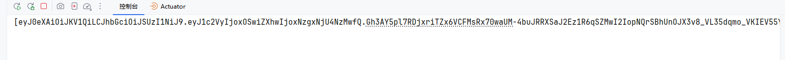

*注：需要访问网关发送请求，而不是微服务端口*

###### GatewayFilter

自定义GatewayFilter相较于GlobalFilter更难，因为自定义GatewayFIlter实际上是在自定义一个GatewayFilterFactory

1. 继承AbstractGatewayFilterFactory类

在Spring Cloud Gateway中，官方更推荐继承AbstractGatewayFilterFactory，而不是直接实现GatewayFilterFactory，因为AbstractGatewayFilterFactory可以通过泛型config处理配置文件中的参数，而且AbstractGatewayFilterFactory中可以重写shortcutFieldOrder()方法来简化键值对配置

```java
package com.hmall.gateway.filter;

import org.springframework.cloud.gateway.filter.GatewayFilter;
import org.springframework.cloud.gateway.filter.factory.AbstractGatewayFilterFactory;
import org.springframework.stereotype.Component;

@Component
public class TestGatewayFilterFactory extends AbstractGatewayFilterFactory<Object> {

}
```

2. 重写apply()方法

apply()一般返回一个匿名方法，这里使用包装类OrderedGatewayFilter，而不是直接返回GatewayFilter，因为OrderedGatewayFilter中可以通过第二个参数指定Ordered值，而GatewayFilter默认不支持排序

```java
package com.hmall.gateway.filter;

import org.springframework.cloud.gateway.filter.GatewayFilter;
import org.springframework.cloud.gateway.filter.GatewayFilterChain;
import org.springframework.cloud.gateway.filter.OrderedGatewayFilter;
import org.springframework.cloud.gateway.filter.factory.AbstractGatewayFilterFactory;
import org.springframework.http.HttpHeaders;
import org.springframework.http.server.reactive.ServerHttpRequest;
import org.springframework.stereotype.Component;
import org.springframework.web.server.ServerWebExchange;
import reactor.core.publisher.Mono;

@Component
public class TestGatewayFilterFactory extends AbstractGatewayFilterFactory<Object> {
    @Override
    public GatewayFilter apply(Object config) {
        return new OrderedGatewayFilter((exchange, chain) -> {
            // 获取HTTP请求
            ServerHttpRequest request = exchange.getRequest();
            // 获取请求头
            HttpHeaders headers = request.getHeaders();
            // 获取Authorization
            System.out.println(headers.get("Authorization"));
            // 放行
            return chain.filter(exchange);
        }, 0);
    }
}
```

但是同样可以创建一个单独的自定义GatewayFilter，然后实现Ordered

```java
package com.hmall.gateway.filter;

import org.springframework.cloud.gateway.filter.GatewayFilter;
import org.springframework.cloud.gateway.filter.GatewayFilterChain;
import org.springframework.cloud.gateway.filter.OrderedGatewayFilter;
import org.springframework.cloud.gateway.filter.factory.AbstractGatewayFilterFactory;
import org.springframework.core.Ordered;
import org.springframework.http.HttpHeaders;
import org.springframework.http.server.reactive.ServerHttpRequest;
import org.springframework.stereotype.Component;
import org.springframework.web.server.ServerWebExchange;
import reactor.core.publisher.Mono;

@Component
public class TestGatewayFilterFactory extends AbstractGatewayFilterFactory<Object> {
    @Override
    public GatewayFilter apply(Object config) {
        return new TestGatewayFilter();
    }
}

class TestGatewayFilter implements GatewayFilter, Ordered {
    @Override
    public Mono<Void> filter(ServerWebExchange exchange, GatewayFilterChain chain) {
        // 获取HTTP请求
        ServerHttpRequest request = exchange.getRequest();
        // 获取请求头
        HttpHeaders headers = request.getHeaders();
        // 获取Authorization
        System.out.println(headers.get("Authorization"));
        // 放行
        return chain.filter(exchange);
    }

    @Override
    public int getOrder() {
        return 0;
    }
}
```

3. 加载到yml中，默认GatewayFilter名称为TestGatewayFilterFactory去掉GatewayFilterFactory，即Test

```yml
spring:
  cloud:
    gateway:
      default-filters:
        - Test
```

4. 发送请求

> 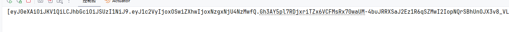

当然，GatewayFilterFactory也支持读取配置文件中的参数

1. 定义静态内部类，定义属性来保存配置参数

```java
@Data
public static class Config {
    private String headerName;
    private String message;
}
```

2. 修改AbstractGatewayFilterFactory泛型为内部类Config，apply()方法的参数也改为Config

```java
public class TestGatewayFilterFactory extends AbstractGatewayFilterFactory<TestGatewayFilterFactory.Config> {
     @Override
    public GatewayFilter apply(Config config) {}
}
```

3. 重写shortcutFieldOrder()方法，方法返回一个List\<String\>，字符串顺序即代表参数顺序

```java
@Override
public List<String> shortcutFieldOrder() {
    return List.of("headerName", "message");
}
```

4. 定义构造器，返回Config类，将Config交由父类，用于构造指定的GatewayFilter

```java
public TestGatewayFilterFactory() {
    super(Config.class);
}
```

5. 修改配置文件，获取请求头Authorization，并设置message为testMessage

```yml
spring:
  cloud:
    gateway:
      default-filters:
        - Test=Authorization,testMessage
```

> 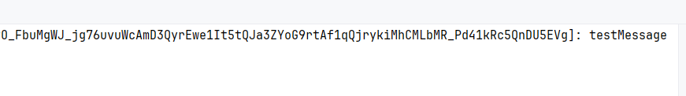

##### 网关拦截校验

1. 首先将需要的配置类、工具类复制到网关模块中

> 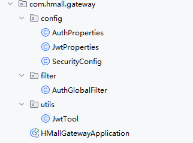

2. 定义AuthGlobalFilter，实现GlobalFilter和Ordered接口

```java
package com.hmall.gateway.filter;

import com.hmall.common.exception.UnauthorizedException;
import com.hmall.gateway.config.AuthProperties;
import com.hmall.gateway.utils.JwtTool;
import lombok.RequiredArgsConstructor;
import lombok.extern.slf4j.Slf4j;
import org.springframework.cloud.gateway.filter.GatewayFilterChain;
import org.springframework.cloud.gateway.filter.GlobalFilter;
import org.springframework.core.Ordered;
import org.springframework.http.HttpStatus;
import org.springframework.http.server.reactive.ServerHttpRequest;
import org.springframework.stereotype.Component;
import org.springframework.util.AntPathMatcher;
import org.springframework.web.server.ServerWebExchange;
import reactor.core.publisher.Mono;

import java.util.List;

@Component
@RequiredArgsConstructor
@Slf4j
public class AuthGlobalFilter implements GlobalFilter, Ordered {

}
```

3. 注入AuthProperties和JwtTool，我们需要AuthProperties中的排除路径以及JwtTool中解析token的方法

```
package com.hmall.gateway.filter;

import com.hmall.common.exception.UnauthorizedException;
import com.hmall.gateway.config.AuthProperties;
import com.hmall.gateway.utils.JwtTool;
import lombok.RequiredArgsConstructor;
import lombok.extern.slf4j.Slf4j;
import org.springframework.cloud.gateway.filter.GatewayFilterChain;
import org.springframework.cloud.gateway.filter.GlobalFilter;
import org.springframework.core.Ordered;
import org.springframework.http.HttpStatus;
import org.springframework.http.server.reactive.ServerHttpRequest;
import org.springframework.stereotype.Component;
import org.springframework.util.AntPathMatcher;
import org.springframework.web.server.ServerWebExchange;
import reactor.core.publisher.Mono;

import java.util.List;

@Component
@RequiredArgsConstructor
@Slf4j
public class AuthGlobalFilter implements GlobalFilter, Ordered {

    private final AuthProperties authProperties;
    private final JwtTool jwtTool;
    
}
```

4. 实现getOrder()方法，设置排序顺序

```
package com.hmall.gateway.filter;

import com.hmall.common.exception.UnauthorizedException;
import com.hmall.gateway.config.AuthProperties;
import com.hmall.gateway.utils.JwtTool;
import lombok.RequiredArgsConstructor;
import lombok.extern.slf4j.Slf4j;
import org.springframework.cloud.gateway.filter.GatewayFilterChain;
import org.springframework.cloud.gateway.filter.GlobalFilter;
import org.springframework.core.Ordered;
import org.springframework.http.HttpStatus;
import org.springframework.http.server.reactive.ServerHttpRequest;
import org.springframework.stereotype.Component;
import org.springframework.util.AntPathMatcher;
import org.springframework.web.server.ServerWebExchange;
import reactor.core.publisher.Mono;

import java.util.List;

@Component
@RequiredArgsConstructor
@Slf4j
public class AuthGlobalFilter implements GlobalFilter, Ordered {

    private final AuthProperties authProperties;
    private final JwtTool jwtTool;

    @Override
    public int getOrder() {
        return 0;
    }
}
```

5. 实现filter()方法，定义验证逻辑

首先通过exchange获取原始请求，然后获取请求中的请求路径，如果请求路径是authProperties中的排除路径，则直接放行。这里需要注意，我们在配置文件中配置的排除路径都是AntPath，而不是正则表达式，需要用Spring提供的AntPathMatcher来判断是否匹配。然后获取请求头中的Authorization头，如果头为空或者不存在头，则返回401，利用exchange获取响应，并直接调用响应的setComplete()方法完成请求，不再向下传递。然后解析token，根据JwtTool是否报错来判断解析是否通过，最后将解析成功得到的UserId保存在请求头中并向下传递。

```java
package com.hmall.gateway.filter;

import com.hmall.common.exception.UnauthorizedException;
import com.hmall.gateway.config.AuthProperties;
import com.hmall.gateway.utils.JwtTool;
import lombok.RequiredArgsConstructor;
import lombok.extern.slf4j.Slf4j;
import org.springframework.cloud.gateway.filter.GatewayFilterChain;
import org.springframework.cloud.gateway.filter.GlobalFilter;
import org.springframework.core.Ordered;
import org.springframework.http.HttpStatus;
import org.springframework.http.server.reactive.ServerHttpRequest;
import org.springframework.stereotype.Component;
import org.springframework.util.AntPathMatcher;
import org.springframework.web.server.ServerWebExchange;
import reactor.core.publisher.Mono;

import java.util.List;

@Component
@RequiredArgsConstructor
@Slf4j
public class AuthGlobalFilter implements GlobalFilter, Ordered {

    private final AuthProperties authProperties;
    private final JwtTool jwtTool;
    private final AntPathMatcher antPathMatcher = new AntPathMatcher();

    @Override
    public Mono<Void> filter(ServerWebExchange exchange, GatewayFilterChain chain) {
        // 获取请求
        ServerHttpRequest request = exchange.getRequest();
        // 获取请求路径
        String path = request.getPath().toString();
        // 如果路径在排除路径中，则放行
        List<String> excludePaths = authProperties.getExcludePaths();
        if (excludePaths.stream().anyMatch(p -> antPathMatcher.match(p, path))) {
            return chain.filter(exchange);
        }
        // 获取请求头
        List<String> authorization = request.getHeaders().get("Authorization");
        if (authorization == null || authorization.isEmpty()) {
            // 如果请求头中没有token，则返回401
            exchange.getResponse().setStatusCode(HttpStatus.UNAUTHORIZED);
            return exchange.getResponse().setComplete();
        }
        // 获取token
        String token = authorization.get(0);
        // 解析token
        Long userId;
        try {
            userId = jwtTool.parseToken(token);
        } catch (UnauthorizedException e) {
            // 如果解析失败，则返回401
            exchange.getResponse().setStatusCode(HttpStatus.UNAUTHORIZED);
            return exchange.getResponse().setComplete();
        }
        // 如果解析成功，则将用户ID添加到请求头中
        log.info("用户ID: {}", userId);
        exchange.getRequest()
                .mutate()
                .header("userId", userId.toString())
                .build();

        // 放行
        return chain.filter(exchange);
    }

    @Override
    public int getOrder() {
        return 0;
    }
}
```

##### 微服务获取网关下发数据

网关处登录校验通过后，登录校验的步骤并没有完成，而是还需要微服务接收来自网关下发的用户数据。已知用户数据存储在请求头中，我们可以利用拦截器在请求到达Controller之前获取请求头中UserId请求，然后将UserId存储在上下文，即ThreadLocal中，供Service调用。如果在每个微服务中都编写一次Interceptor，会非常麻烦，因此可以在通用模块common中定义一个Interceptor，然后在微服务中启用这个配置

1. 定义UserIdInterceptor

实现HandlerInterceptor接口，这里只需要实现preHandle()和afterCompletion()，在preHandle()中获取userId并添加到ThreadLocal中，然后在afterCompletion()中删除userId

```java
package com.hmall.common.Interceptor;

import com.hmall.common.utils.UserContext;
import org.springframework.stereotype.Component;
import org.springframework.web.servlet.HandlerInterceptor;

import javax.servlet.http.HttpServletRequest;
import javax.servlet.http.HttpServletResponse;

@Component
public class UserIdInterceptor implements HandlerInterceptor {
    @Override
    public boolean preHandle(HttpServletRequest request, HttpServletResponse response, Object handler) throws Exception {
        // 获取header
        String userId = request.getHeader("userId");
        // 添加到UserContext
        if (userId != null)
            UserContext.setUser(Long.parseLong(userId));
        // 放行
        return true;
    }

    @Override
    public void afterCompletion(HttpServletRequest request, HttpServletResponse response, Object handler, Exception ex) throws Exception {
        // 移除UserContext
        UserContext.removeUser();
    }
}
```

2. 定义MvcConfig，注册Interceptor

```java
package com.hmall.common.config;

import com.hmall.common.Interceptor.UserIdInterceptor;
import org.springframework.boot.autoconfigure.condition.ConditionalOnClass;
import org.springframework.context.annotation.Configuration;
import org.springframework.web.servlet.config.annotation.InterceptorRegistry;
import org.springframework.web.servlet.config.annotation.WebMvcConfigurer;

@Configuration
public class MvcConfig implements WebMvcConfigurer {

    @Override
    public void addInterceptors(InterceptorRegistry registry) {
        registry.addInterceptor(new UserIdInterceptor());
    }
}
```

3. 在 spring.factories 中添加MvcConfig

因为Spring默认的包扫描是不包含com.hmall.common的，其他的微服务无法扫描到MvcConfig，也就无法注册UserIdInterceptor。这里涉及Spring自动配置的原理，我们其实已经在[JavaWebMedium](./JavaWebMedium.md)中就已经解释过了，这里再次提及一下。SpringBoot项目默认的组件扫描路径是启动类所在包及其子包，所以微服务默认不会扫描com.hmall.common。解决办法有多种，第一，为启动类添加@ComponentScan注解，并指定com.hmall.common；第二，利用@Import注解导入；第三，则是利用Spring的自动配置原理，Spring会自动配置spring.factories中的所有类，Spring3.x+的版本中将文件名改为了org.springframework.boot.autoconfigure.AutoConfiguration.imports，并且位于META-INF的spring包下

```java
org.springframework.boot.autoconfigure.EnableAutoConfiguration=\
  com.hmall.common.config.MyBatisConfig,\
  com.hmall.common.config.JsonConfig,\
  com.hmall.common.config.MvcConfig
```

4. 在MvcConfig类上添加@ConditionalOnClass注解

Interceptor需要SpringMVC的核心包，其他微服务都有，但是Gateway微服务却没有，所以直接启动会导致Gateway无法找到WebMvcConfigurer类而报错。因此需要为MvcConfig添加@@ConditionalOnClass(WebMvcConfigurer.class)，只有拥有SpringMVC的微服务才启用拦截器

```java
package com.hmall.common.config;

import com.hmall.common.Interceptor.UserIdInterceptor;
import org.springframework.boot.autoconfigure.condition.ConditionalOnClass;
import org.springframework.context.annotation.Configuration;
import org.springframework.web.servlet.config.annotation.InterceptorRegistry;
import org.springframework.web.servlet.config.annotation.WebMvcConfigurer;

@Configuration
@ConditionalOnClass(WebMvcConfigurer.class)
public class MvcConfig implements WebMvcConfigurer {

    @Override
    public void addInterceptors(InterceptorRegistry registry) {
        registry.addInterceptor(new UserIdInterceptor());
    }
}
```

##### 微服务间传递数据

微服务间的数据传递相对就比较简单。微服务间的请求原本是通过Feign发送的，而请求头的修改也就需要基于Feign。Feign提供了RequestInterceptor用于拦截Feign的请求，开发人员可以对其请求进行更改

为了方便注册为Bean，我们不再定义一个单独的Filter，而是直接在FeignClientConfig中定义一个Bean，返回RequestInterceptor。只要是@EnableFeignClients中配置了defaultConfiguration = FeignClientConfig.class的微服务，拦截器就可以直接生效，而不需要做其他配置

```java
package com.hmall.api.config;

import com.hmall.common.utils.UserContext;
import feign.Logger;
import feign.RequestInterceptor;
import org.springframework.context.annotation.Bean;

public class FeignClientConfig {

    /**
     * feign日志级别
     * @return 日志级别
     */
    @Bean
    public Logger.Level feignLoggerLevel() {
        return Logger.Level.FULL;
    }

    @Bean
    public RequestInterceptor userIdInterceptor() {
        return requestTemplate -> requestTemplate.header("userId", String.valueOf(UserContext.getUser()));
    }
}
```

> 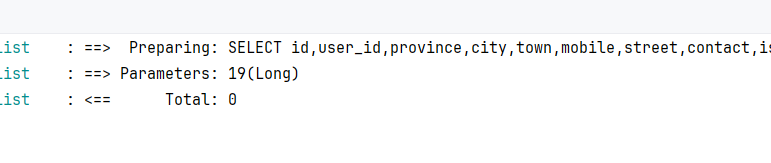

### 配置管理

在上文的微服务开发中不难发现，像nacos地址、mybatis-plus配置、日志配置等等的配置项，几乎所有的微服务都需要使用，但内容却基本相同。当微服务数量达到一定级别后，针对每个微服务都进行单独配置就会显得非常麻烦。

而Nacos不仅提供了注册中心的功能，也提供了配置管理的功能，利用Nacos，可以快捷、方便地管理微服务的各项配置信息，提高开发效率

#### 配置共享

1. 在Nacos中创建共享配置

将常用的公共配置，如数据库、Slf4j配置、Swagger配置等等移动到hm-common.yml中，使用占位符，如\${hm.swagger.title}来预留每个微服务的不同子配置项

```yml
spring:
  datasource:
    url: jdbc:mysql://localhost:3306/hmall?useUnicode=true&characterEncoding=UTF-8&autoReconnect=true&serverTimezone=Asia/Shanghai
    driver-class-name: com.mysql.cj.jdbc.Driver
    username: root
    password: root
mybatis-plus:
  configuration:
    default-enum-type-handler: com.baomidou.mybatisplus.core.handlers.MybatisEnumTypeHandler
  global-config:
    db-config:
      update-strategy: not_null
      id-type: auto
logging:
  level:
    com.hmall: debug
  pattern:
    dateformat: HH:mm:ss:SSS
  file:
    path: "logs/${spring.application.name}"
knife4j:
  enable: true
  openapi:
    title: ${hm.swagger.title}
    description: ${hm.swagger.description}
    email: kiiz@eiousee.com
    concat: Ki1z
    url: www.eiousee.com
    version: v1.0.0
    group:
      default:
        group-name: default
        api-rule: package
        api-rule-resources:
          - ${hm.swagger.package}
```

> 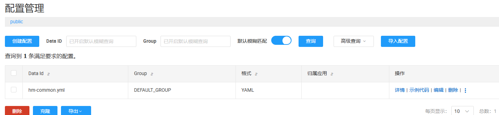

2. 在微服务中引入依赖

```xml
<dependency>
    <groupId>com.alibaba.cloud</groupId>
    <artifactId>spring-cloud-starter-alibaba-nacos-config</artifactId>
</dependency>
```

3. 在微服务的application.yml中进行改写，删除不必要的公共配置，并添加占位符配置

这里使用了spring.config.import项，这一项使用List\<String\>存储，所以可以使用`-`引入多个公共配置

```yml
server:
  port: 8083
spring:
  application:
    name: hmall-user
  config:
    import: optional:nacos:hm-common.yml
  profiles:
    active: dev
  cloud:
    nacos:
      server-addr: localhost:8848
      username: kiiz
      password: kiiz
      config:
        file-extension: yaml
feign:
  httpclient:
    # 开启httpclient连接池
    enabled: true
hm:
  jwt:
    location: classpath:hmall.jks
    alias: hmall
    password: hmall123
    tokenTTL: 30m
  swagger:
    title: 黑马商城用户服务接口
    description: 黑马商城用户服务接口
    package: com.hmall.user.controller
```

> 

#### 配置热更新

配置热更新是指在修改微服务的配置后，无需重启微服务，即可让新配置生效。这对于时效敏感型服务非常重要，服务不可用即代表直接损失

在Nacos中，启用配置共享后，会自动从注册中心加载一份名为 `<spring.application.name>[-spring.profile.active].<spring.cloud.nacos.config.file-extension>`的配置文件，这份配置文件就是热更新配置文件

举个例子，我们的购物车微服务名为hmall-cart，如果注册中心存在任何hmall-cart.yaml、hmall-cart-dev.yaml、hmall-cart-local.yaml，那么都可以作为热更新配置文件

而如果使用spring.config.import，那么默认就属于热更新配置，如上图中的Listening config，表示是监听配置，而不是单纯加载配置

**示例**

1. 在nacos创建hmall-cart.yaml配置，配置项为购物车最大数量

> 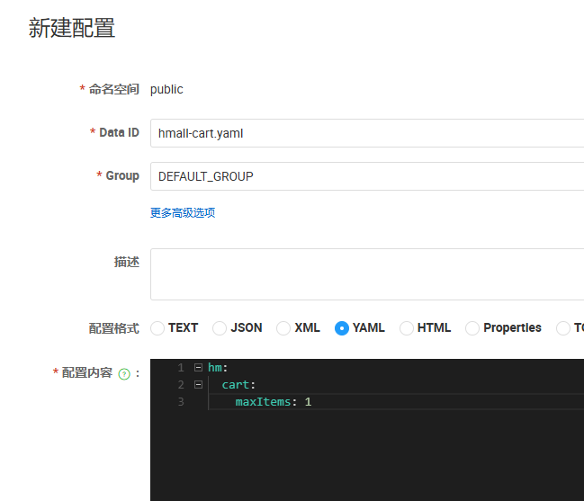

2. 在购物车微服务中定义一个configProperty类，用于解析热更新配置

```java
package com.hmall.cart.config;

import lombok.Data;
import org.springframework.boot.context.properties.ConfigurationProperties;
import org.springframework.stereotype.Component;

@Data
@Component
@ConfigurationProperties(prefix = "hm.cart")
public class CartConfigProperty {
    private Integer maxItems;
}
```

3. 在CartService中修改checkCartsFull()方法，将最大值修改为配置类中的属性

```java
private void checkCartsFull(Long userId) {
    Long count = lambdaQuery().eq(Cart::getUserId, userId).count();
    if (count >= cartConfigProperty.getMaxItems()) {
        throw new BizIllegalException(StrUtil.format("用户购物车课程不能超过{}", cartConfigProperty.getMaxItems()));
    }
}
```

4. 修改购物车微服务配置

```yml
server:
  port: 8082
spring:
  application:
    name: hmall-cart
  config:
    import:
      - optional:nacos:hm-common.yml
      - optional:nacos:hmall-cart.yaml
  profiles:
    active: dev
  cloud:
    nacos:
      server-addr: localhost:8848
      username: kiiz
      password: kiiz
      config:
        file-extension: yaml
feign:
  httpclient:
    # 开启httpclient连接池
    enabled: true
hm:
  swagger:
    title: 黑马商城购物车模块接口文档
    description: 黑马商城购物车模块接口文档
    package: com.hmall.cart.controller
```

5. 修改最大数量为1，尝试添加商品失败

> 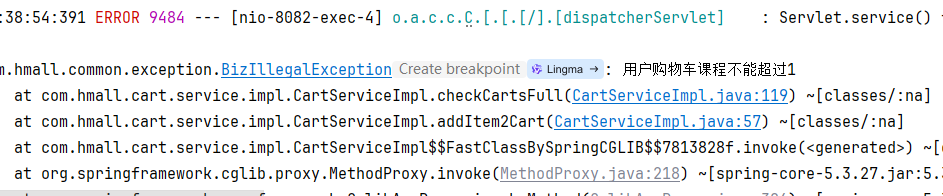

6. 修改最大数量为10，尝试添加商品成功

> 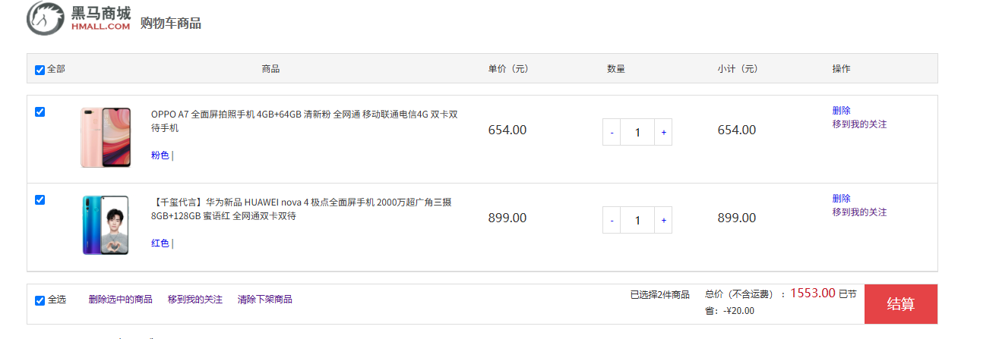

可以看到，在修改配置后，nacos会自动将新配置推送到微服务中

> 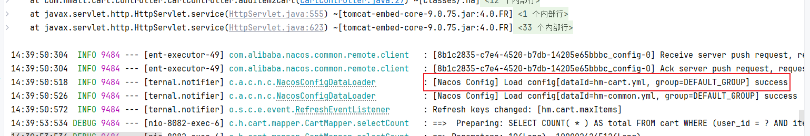

#### 动态路由

先前在配置网关的时候，我们对路由表的配置是直接写死在微服务配置文件中的。刚才我们了解了配置热更新，假设我们能够利用配置热更新，在配置变动时获取配置信息，再更新路由表，就能实现动态路由配置

**示例**

1. 在注册中心配置路由表

> 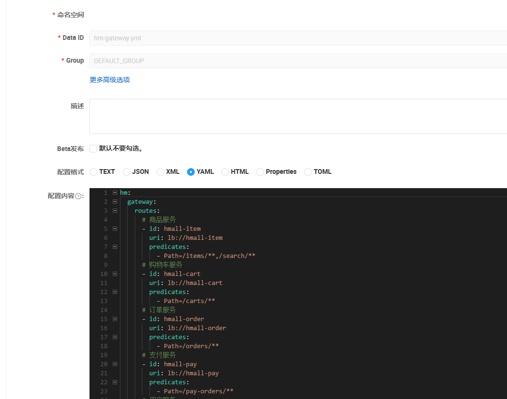

2. 在网关中删除所有的路由表，并使用import引入注册中心配置

```yml
server:
  port: 8080
spring:
  application:
    name: hmall-gateway
  config:
    import: optional:nacos:hm-gateway.yml
  cloud:
    nacos:
      server-addr: localhost:8848
      username: kiiz
      password: kiiz
      config:
        file-extension: yaml
hm:
  jwt:
    location: classpath:hmall.jks
    alias: hmall
    password: hmall123
    tokenTTL: 30m
  auth:
    excludePaths:
      - /search/**
      - /users/login
      - /items/page
      - /hi
```

3. 定义RouteProperty类，用于解析hm-gateway.yml

在RouteProperty中，直接声明一个List\<RouteDefinition\>，因为路由更新时使用的就是List\<RouteDefinition\>，不需要作类型变更，而且RouteDefinition能够直接解析routes下所有的配置项，不需要我们再定义一个实体类存储routes

```java
package com.hmall.gateway.config;

import lombok.Data;
import org.springframework.boot.context.properties.ConfigurationProperties;
import org.springframework.cloud.gateway.route.RouteDefinition;
import org.springframework.stereotype.Component;

import java.util.List;

@Data
@Component
@ConfigurationProperties(prefix = "hm.gateway")
public class RouteProperty {
    private List<RouteDefinition> routes;
}
```

4. 定义RouteLoader类

RouteLoader是路由更新的逻辑实现类，主要功能就是监听配置更新并发布更新。有关监听配置更新，可以利用@EventListener注解，@EventListener注解是Spring提供的监听注解，默认参数是一个事件类，只要事件类触发，对应@EventListener的方法就会同步触发。而在配置更新时，会发布一个RefreshScopeRefreshedEvent，只要我们在方法上添加@EventListener(RefreshScopeRefreshedEvent.class)注解，只要路由配置发生变更，方法就会执行，这个方法就成为了监听器方法。但是RefreshScopeRefreshedEvent只会在配置发生变更时触发，第一次启动网关时不会触发，所以还需要一个@EventListener(ApplicationReadyEvent.class)，在Spring项目启动完成后触发一次，实现路由初始化。接着是路由更新逻辑，路由更新需要利用RouteDefinitionWriter类，其下有save和delete两个更新方法，但是save只会新增，不会删除，所以在每次更新路由的时候，必须要先删除当前所有的路由配置，才能保证路由完全更新。而delete必须按照路由ID删除，所以还需要一个Set\<String\>来保存当前所有的路由ID，以便下次路由更新时，能够删除当前的所有路由。在RouteDefinitionWriter更新完成后，还需要ApplicationEventPublisher发布一个RefreshRoutesEvent事件，告知网关路由表需要更新

```java
package com.hmall.gateway.router;

import com.hmall.gateway.config.RouteProperty;
import lombok.RequiredArgsConstructor;
import lombok.extern.slf4j.Slf4j;
import org.springframework.boot.context.event.ApplicationReadyEvent;
import org.springframework.cloud.context.scope.refresh.RefreshScopeRefreshedEvent;
import org.springframework.cloud.gateway.event.RefreshRoutesEvent;
import org.springframework.cloud.gateway.route.RouteDefinition;
import org.springframework.cloud.gateway.route.RouteDefinitionWriter;
import org.springframework.context.ApplicationEventPublisher;
import org.springframework.context.event.EventListener;
import org.springframework.stereotype.Component;
import reactor.core.publisher.Mono;

import javax.annotation.PostConstruct;
import java.util.HashSet;
import java.util.List;
import java.util.Set;

@Slf4j
@RequiredArgsConstructor
@Component
public class RouteLoader {

    private final RouteProperty routeProperty;
    private final RouteDefinitionWriter routeDefinitionWriter;
    private final ApplicationEventPublisher applicationEventPublisher;

    private final Set<String> routeIds = new HashSet<>();

    @EventListener(ApplicationReadyEvent.class)
    public void initRoutes() {
        log.info("初始化路由信息: {}", routeProperty.getRoutes());
        refreshRouter();
    }

    @EventListener(RefreshScopeRefreshedEvent.class)
    public void onConfigChange() {
        log.info("刷新路由信息: {}", routeProperty.getRoutes());
        refreshRouter();
    }

    private void refreshRouter() {
        // 删除所有路由
        if (!routeIds.isEmpty()) {
            routeIds.forEach(routeId ->
                    routeDefinitionWriter.
                            delete(Mono.just(routeId)).
                            subscribe()
            );
            routeIds.clear();
        }
        // 添加所有路由
        List<RouteDefinition> routes = routeProperty.getRoutes();
        if (routes != null && !routes.isEmpty()) {
            routes.forEach(route -> {
                routeDefinitionWriter.save(Mono.just(route)).subscribe();
                routeIds.add(route.getId());
            });
        }
        // 发布事件
        applicationEventPublisher.publishEvent(new RefreshRoutesEvent(this));
        log.info("刷新路由完成");
    }
}
```

> 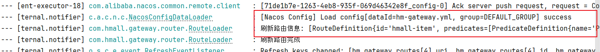

### 微服务保护

#### 雪崩问题

雪崩问题是指当某个微服务不可用时，从而引发的其他微服务也不可用，最后导致整个微服务链都不可用的连锁问题。雪崩问题是微服务的常见问题，也是对微服务项目损害极大的问题。

##### 解决方案

###### 请求限流

请求限流是针对服务提供者的解决方案，在请求到达微服务前设置一个限流器，设置最大的请求数量。一旦请求超过最大请求数量，限流器就可以执行相应的应对措施，如让请求排队，或者直接拒绝请求等等。

###### 线程隔离

线程隔离又称舱壁模式，模拟船舱隔板的防水原理。通过限定每个业务能够使用的线程数量而将故障业务隔离，避免故障扩散。

###### 服务熔断

服务熔断是由断路器统计请求的异常比例或者慢调用比例，如果超出阈值则直接熔断该业务，拦截该接口的请求。进一步地，可以在调用服务中设置一个被调用服务的熔断冗余，当被调用服务不可用时，所有向被调用服务的请求直接发送到熔断冗余，而不再发送到被调用服务。

#### Sentinel

Sentinel 是阿里巴巴提供的，面向分布式、多语言异构化服务架构的流量治理组件，主要以流量为切入点，从流量控制、流量路由、熔断降级、系统自适应保护等多个维度来帮助用户保障微服务的稳定性

##### 快速入门

1. 引入依赖

```xml
<!--sentinel-->
<dependency>
    <groupId>com.alibaba.cloud</groupId>
    <artifactId>spring-cloud-starter-alibaba-sentinel</artifactId>
</dependency>
```

2. 配置仪表盘地址

可以配置在nacos中，方便针对每个微服务生效

```yml
spring:
  cloud:
    sentinel:
      transport:
        dashboard: localhost:8090
```

3. 访问Sentinel仪表盘，并访问几次接口，就能在仪表盘中看到对应服务

> 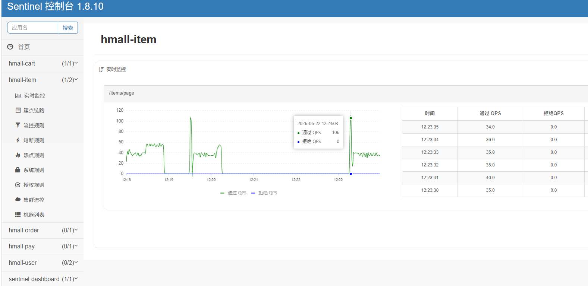

Sentinel默认只会监控微服务中的所有Endpoint，也就是HTTP接口

> 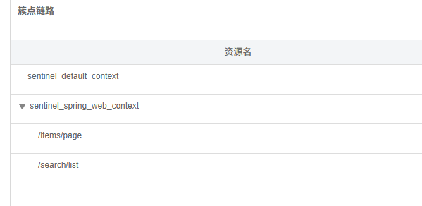

但这也会导致相同路径中不同请求方式的接口被划分到同一个接口中，因此需要在配置中添加

```yml
spring:
  cloud:
    sentinel:
      http-method-specify: true
```

这样Sentinel就会将请求方式和路径一并作为资源名

> 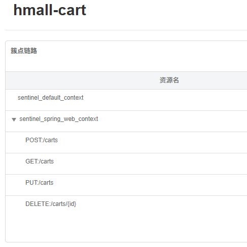

##### 请求限流

在簇点链路处点击流控

> 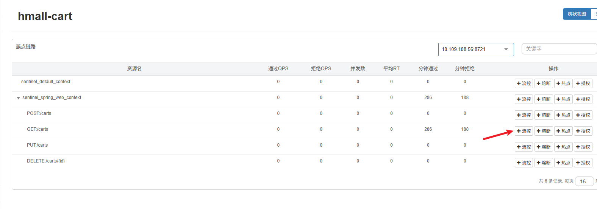

配置最高QPS为6，即最多每秒6个请求

> 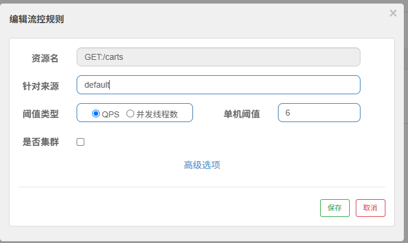

然后进行并发测试

> 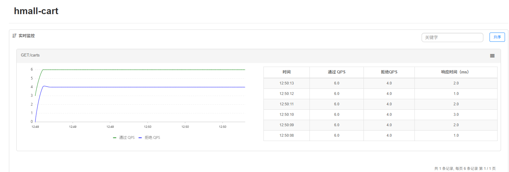

##### 线程隔离

同样地在簇点链路处点击流控，但是这次配置的阈值类型为并发线程数，设置为5个

> 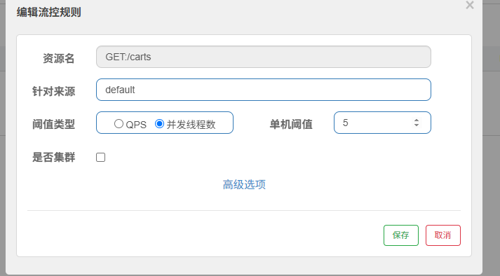

我们先来看没有设置线程隔离的情况，在购物车微服务中，调整购物车中商品数量后，会调用一次查询商品信息的服务，我们让查询商品信息接口变慢，以模拟微服务中某个服务执行缓慢的问题

```java
@ApiOperation("根据id批量查询商品")
@GetMapping
public List<ItemDTO> queryItemByIds(@RequestParam("ids") List<Long> ids){
    try {
        Thread.sleep(500);
    } catch (InterruptedException e) {
        throw new RuntimeException(e);
    }
    return itemService.queryItemByIds(ids);
}
```

然后设置购物车服务的最大tomcat线程数为50，等待队列为10，最大连接数80，否则tomcat会尝试接收所有连接，无法达到某个服务不可用的目的

```yml
server:
  tomcat:
    threads:
      max: 50
    accept-count: 10
    max-connections: 80
```

先来看正常情况，查询购物车列表

38ms和19ms是修改购物车服务时间，而大于500ms的是查询购物车服务时间

> 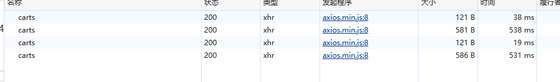

现在我们对查询购物车服务进行并发测试，模拟购物车请求人数很多的情况

可以看到，由于查询购物车服务变慢，修改购物车服务直接不可用

> 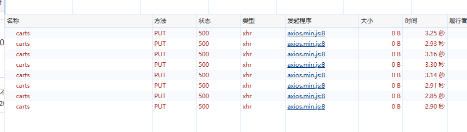

所以我们在Sentinel中启用线程隔离，无论查询购物车服务的可用性如何，更新购物车服务始终可用

> 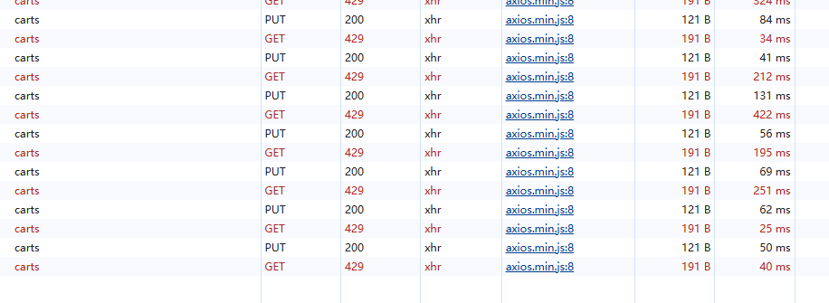

##### Fallback

Fallback是指在接口调用失败，或者是接口忙时，可以提供的一种冗余方案，基于Fallback可以向用户提供友好信息，来避免请求失败造成的糟糕体验。Feign客户端也提供了Fallback解决方案

首先开启Feign资源簇点，这一配置可以在nacos配置中进行

```yml
feign:
  sentinel:
    enabled: true
```

然后在Sentinel中就可以看到Feign接口簇点

> 

然后我们对Feign接口设置线程隔离，而不对cart设置，以此来保证cart可用

> 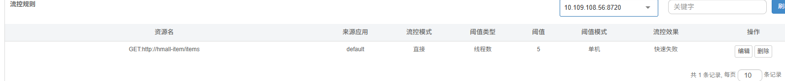

然后定义ItemClientFallbackFactory，实现FallbackFactory，泛型为ItemClient。接着实现create()方法，方法返回一个ItemClient实例，这个返回的实例就是Fallback实例，然后实现ItemClient接口中的所有方法，定义实际的Fallback逻辑

```java
package com.hmall.api.fallback;

import com.hmall.api.client.ItemClient;
import com.hmall.api.dto.ItemDTO;
import com.hmall.api.dto.OrderDetailDTO;
import lombok.extern.slf4j.Slf4j;
import org.springframework.cloud.openfeign.FallbackFactory;
import org.springframework.stereotype.Component;

import java.util.ArrayList;
import java.util.Collection;
import java.util.List;

@Slf4j
public class ItemClientFallbackFactory implements FallbackFactory<ItemClient> {
    @Override
    public ItemClient create(Throwable cause) {
        return new ItemClient() {
            @Override
            public List<ItemDTO> queryItemByIds(Collection<Long> ids) {
                log.error("查询商品异常", cause);
                return new ArrayList<>();
            }

            @Override
            public void deductStock(List<OrderDetailDTO> items) {
                log.error("扣减库存异常", cause);
            }
        };
    }
}
```

在Config类中将ItemClientFallbackFactory注册为Bean，因为hmall-cart无法扫描到`com.hmall.api`的Bean，不能添加@Component

```java
@Bean
public ItemClientFallbackFactory itemClientFallbackFactory() {
    return new ItemClientFallbackFactory();
}
```

在ItemClient上指定fallbackFactory

```java
package com.hmall.api.client;

import com.hmall.api.dto.ItemDTO;
import com.hmall.api.dto.OrderDetailDTO;
import com.hmall.api.fallback.ItemClientFallbackFactory;
import org.springframework.cloud.openfeign.FeignClient;
import org.springframework.stereotype.Component;
import org.springframework.web.bind.annotation.GetMapping;
import org.springframework.web.bind.annotation.PutMapping;
import org.springframework.web.bind.annotation.RequestBody;
import org.springframework.web.bind.annotation.RequestParam;

import java.util.Collection;
import java.util.List;

@FeignClient(value = "hmall-item", fallbackFactory = ItemClientFallbackFactory.class)
public interface ItemClient {

    @GetMapping("/items")
    List<ItemDTO> queryItemByIds(@RequestParam Collection<Long> ids);

    @PutMapping("/items/stock/deduct")
    void deductStock(@RequestBody List<OrderDetailDTO> items);
}
```

然后进行并发测试，可以看到异常率为0，表明Fallback生效，后端并没有直接拒绝连接

> 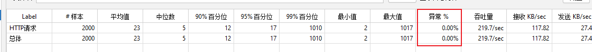

##### 服务熔断

在应用Fallback后，不难发现P99，也就是99%百分位的数值依然比较大，这是因为后端仍会尝试放行一些请求。而在实际业务中，这些个位数的放行数量是没有意义的，后端甚至还会因为这些请求进一步增加响应时长。因此比较妥善的办法是直接中止服务，也就是服务熔断。在服务熔断后，会直接拒绝所有的请求，保证没有任何请求能够通过，如果配置了fallback，则直接重定向到fallback

Sentinel中的服务熔断配置相对比较简单，点击簇点链路中的熔断

> 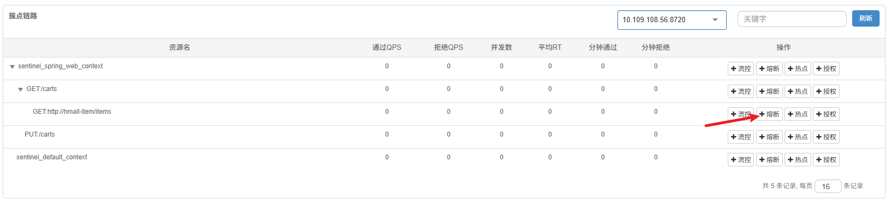

熔断规则如下

> 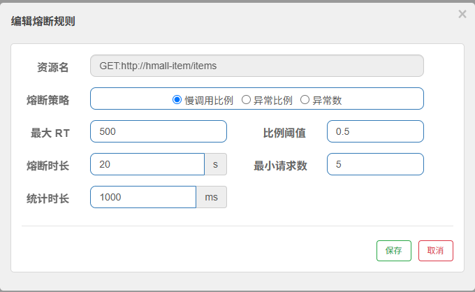

- 最大RT：最大慢调用阈值，超过阈值的视为异常
- 比例阈值：在最小请求数中最大RT数量占比超过比例阈值，则触发服务熔断
- 熔断时长：服务终止的时长
- 最小请求数：采集样本的最小数量
- 统计时长：采集样本的周期

然后再执行一次并发测试

> 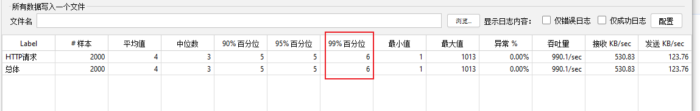

可以看到，在触发一次慢调用后，服务立即熔断，P99直接缩短到6ms

### 分布式事务

之前我们提到过事务，事务是一组操作的集合，它时一个不可分割的工作单位。事务会把所有的操作作为一个整体一起向系统提交或撤销操作请求，即这些操作要么同时成功，要么同时失败。而在微服务中，事务也同样存在，例如用户下单操作中，首先在OrderService创建订单，然后在CartService清除购物车，然后在ItemService扣减库存。而这种在不同的微服务间执行的同一事务就是分布式事务

分布式事务面临的最大问题就是事务的ACID，即原子性、一致性、隔离性和持久性。假设同时有两个用户下同一个商品，同时创建订单，清除购物车，但是此时库存仅剩一件商品，那么在ItemService中必定会抛出一次异常。但是OrderService和CartService对此次异常并不知情，这就破坏了事务的ACID原则

#### Apache Seata

Apache Seata是阿里巴巴与蚂蚁金服合作开发的一款分布式事务解决方案，致力于在微服务架构下提供高性能和简单易用的分布式事务服务

在seata中，对分布式事务设计了三个重要角色

- TC (Transaction Coordinator) 事务协调者：维护全局和分支事务的状态，协调全局事务提交或回滚
- TM (Transaction Manager) 事务管理器：定义全局事务的范围，开始全局事务，提交或回滚全局事务
- RM (Resource Manager) 资源管理器：管理分支事务，与TC交谈以注册分支事务和报告分支事务状态

简单来说，分布式事务的步骤大致如下
$$
TM \xrightarrow{通知全局事务} TC \xrightarrow{创建事务} RM \xrightarrow{申请并报告分支事务} TC \xrightarrow{注册并维护分支事务} TM \xrightarrow{结束全局事务} TC
$$

#### 微服务集成Seata

首先引入依赖

```xml
<!--seata-->
<dependency>
    <groupId>com.alibaba.cloud</groupId>
    <artifactId>spring-cloud-starter-alibaba-seata</artifactId>
</dependency>
```

然后编写配置，可以使用nacos共享配置

```yml
seata:
  registry:
    nacos:
      server-addr: localhost:8848
      namespace: 
      group: DEFAULT_GROUP
      application: seata-server
      username: kizz
      password: kiiz
  tx-service-group: hmall
  service:
    vgroup-mapping:
      hmall: default
```

tx-service-group是事务组，vgroup-mapping是事务组与TC集群的映射

然后重启微服务

> 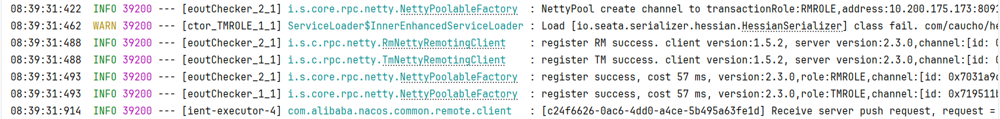

可以看到RM和TM已经注册成功，如果报错`can not get cluster name in registry config 'service.vgroupMapping.hmall', please make sure registry config correct`，则需要在nacos中添加一条配置

> 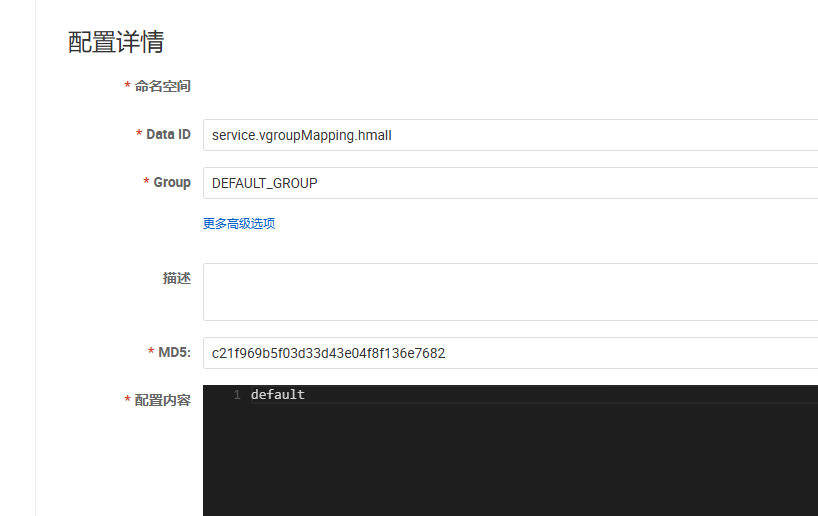

DataID设置为service.vgroupMapping.hmall，内容为default，格式为text。在设置配置为nacos管理后，seata默认只会读取nacos中的配置，不会读取客户端本地配置

#### XA模式

XA规范是X/Open组织定义的分布式事务处理(DTP, Distributed Transaction Processing)标准，XA规范描述了全局的TM与局部RM之间的接口，几乎所有主流关系型数据库都对XA规范提供了支持

在Seata中，XA模式的过程如下。首先由TM开启全局事务，然后TM调用各微服务的分支事务，RM此时向TC注册分支事务，接着才执行sql语句。但是这里的sql事务不能提交，因为事务还没有结束。然后RM报告事务完成状态，当TM处理完所有事务后，才会告知TC结束全局事务。TC会检查所有分支事务状态，如果都执行成功，则向所有分支发送提交指令，这时候RM才提交sql事务，释放锁；若存在至少一个分支事务失败，则向所有分支发送回滚指令，所有RM回滚事务

XA模式的优点是事务的强一致性，满足ACID原则，而且常用数据库都支持，实现简单，没有代码侵入。但缺点也很明显，一阶段需要锁定数据库资源，等待二阶段释放，性能较差，如果多个分支事物中存在一个慢分支，将会导致所有分支事物对应的数据库都无法释放资源，导致资源浪费；同时XA模式依赖关系型数据库实现事务，无法在NoSQL数据库中使用

##### 快速入门

在Seata中启用XA模式非常地简单

1. 修改application.yml配置，开启XA模式

```yml
seata:
  data-source-proxy-mode: XA
```

2. 给全局事务的入口添加方法添加@GlobalTransactional注解，启用全局事务控制

```java
@Override
@GlobalTransactional
public Long createOrder(OrderFormDTO order) {
    itemService.removeByItemIds();
    ...
}
```

3. 为了保证事务回滚，分支方法上也应该加上@Transactional注解

```java
@Override
@Transactional
public void removeByItemIds() {
    ...
}
```

#### AT模式

AT模式同样是分阶段提交的事务模型，但是AT模式弥补了XA模型中资源锁定周期过长的缺陷

AT模式的工作流程如下。首先由TM开启全局事务，然后TM调用各微服务的分支事务，RM此时向TC注册分支事务。这之前与XA模式相同，但是在SQL语句执行之前，AT模式会先生成一个数据表快照，然后执行SQL语句，并立即提交事务。此时其实已经破坏了ACID原则，但由于快照的存在，逻辑上如果需要回滚事务，则可以将数据表还原为快照状态，实现回滚效果

AT模式的使用方式与XA模式相同，只是在配置中将XA修改为AT，或者直接删除，默认使用AT模式

```yml
seata:
  data-source-proxy-mode: AT
```

然后在客户端数据库中添加一个undo_log表

```mysql
-- for AT mode you must to init this sql for you business database. the seata server not need it.
CREATE TABLE IF NOT EXISTS `undo_log`
(
    `branch_id`     BIGINT       NOT NULL COMMENT 'branch transaction id',
    `xid`           VARCHAR(128) NOT NULL COMMENT 'global transaction id',
    `context`       VARCHAR(128) NOT NULL COMMENT 'undo_log context,such as serialization',
    `rollback_info` LONGBLOB     NOT NULL COMMENT 'rollback info',
    `log_status`    INT(11)      NOT NULL COMMENT '0:normal status,1:defense status',
    `log_created`   DATETIME(6)  NOT NULL COMMENT 'create datetime',
    `log_modified`  DATETIME(6)  NOT NULL COMMENT 'modify datetime',
    UNIQUE KEY `ux_undo_log` (`xid`, `branch_id`)
) ENGINE = InnoDB
  AUTO_INCREMENT = 1
  DEFAULT CHARSET = utf8mb4 COMMENT ='AT transaction mode undo table';
```

注意，如果之前配置了ItemClient的Fallback，记得在FallBackFactory中抛出异常，否则ItemService抛出异常后，会直接进入FallBack，但FallBack不会抛出异常，导致分布式事务失败

```java
@Override
public void deductStock(List<OrderDetailDTO> items) {
    log.error("扣减库存异常", cause);
    throw new RuntimeException("扣减库存异常");
}
```

> 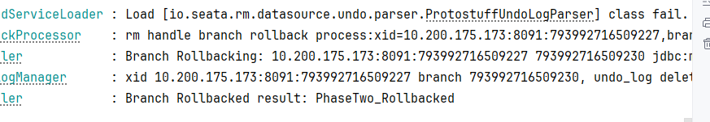

## 消息队列

### 同步调用与异步调用

之前的项目中，微服务间的调用是基于Feign的HTTP请求，实际也就是TCP请求。而TCP请求必须完成三次握手与四次挥手，也就是必须等待对方响应结果，连接才能断开，这就是同步调用。在微服务调用中，大多数的调用都是需要返回结果的，即使是抛出的异常也是一种返回结果，所以大多数微服务调用都是同步调用

举个例子，支付服务完成后，需要即时更新用户余额，所以需要调用用户服务，但是如果用户服务更新失败的话，支付服务需要进行退款，所以这里就必须是同步调用。但如果支付服务完成后，需要推送一个支付成功的消息到用户，而这个行为是不需要返回结果的；同样地，支付成功后需要为用户增加积分，或者记录用户购买偏好，对于支付服务本身而言，不是必须要返回结果，所以也就不需要同步调用。因为同步调用是阻塞式调用，一旦连接开始，就必须等待连接结束后，程序才会进行下一步了。假设用户积分服务出现异常，发生慢调用，而因为同步调用的阻塞问题，导致整个支付服务也出现慢调用，就会导致微服务雪崩问题。所以，这里就需要引入异步调用

异步调用与同步调用相斥，也就是收发双方不需要知道准确的发送和接收时机，而只是根据消息状态执行对应的处理逻辑。例如支付完成后，用户积分服务出现异常，发生慢调用，如果积分服务调用属于异步调用，支付服务无需知道调用的结果，只是作为消息告知方，就可以避免雪崩的发生

异步调用一般基于消息转发机制，也就是提供一个消息代理，发送方只负责将消息发送到消息代理中，不需要准确知道接收方的身份，也不需要确认接收方接收。而且基于消息代理，发送方可以进一步解耦，只需要发送服务消息，而不是主动发送调用请求。接收方也不再被动接收请求，而是主动在消息代理中查询消息，如果有属于自己的消息，则执行对应逻辑

### RabbitMQ

MQ，MessageQueue，也就是消息队列，是指异步调用中用于存放消息的容器，即上文提到的消息代理，又被称为Broker。目前市面上有多种MQ产品

| 产品     | 开发者  | 开发语言     | 协议支持                          | 可用性 | 单机吞吐量 | 消息延迟 | 消息可靠性 |
| -------- | ------- | ------------ | --------------------------------- | ------ | ---------- | -------- | ---------- |
| RabbitMQ | Rabbit  | Erlang       | AMQP、XMPP、SMTP、STOMP           | HIGN   | NORMAL     | μs       | HIGN       |
| ActiveMQ | Apache  | Java         | OpenWire、STOMP、REST、XMPP、AMQP | NORMAL | LOW        | ms       | NORMAL     |
| RocketMQ | Alibaba | Java         | Custom                            | HIGN   | HIGN       | ms       | HIGH       |
| Kafka    | Apache  | Scala & Java | Custom                            | HIGN   | VERY HIGN  | ms       | NORMAL     |

国内企业MQ产品使用中，RabbitMQ使用较多，所以我们选择RabbitMQ

#### 快速入门

在RabbitMQ数据模型中，划分了四个关键角色，首先是Publisher生产者，负责发布消息到消息队列中，对应微服务中发起请求的服务接口；接着是exchange交换机，生产者发送的消息在消息队列中首先到达交换机，交换机根据路由规则来决定消息如何继续下发；然后是queue消息队列，一个交换机对应多个消息队列，消息的接收也是在队列中进行的；最后Consumer消费者，也就是被调用服务，负责监听消息队列，并将消息从消息队列中取出消费

1. 首先创建两个队列

> 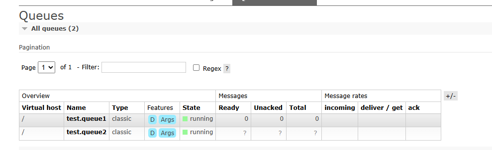

2. 在默认交换机amq.fanout中绑定两个队列

> 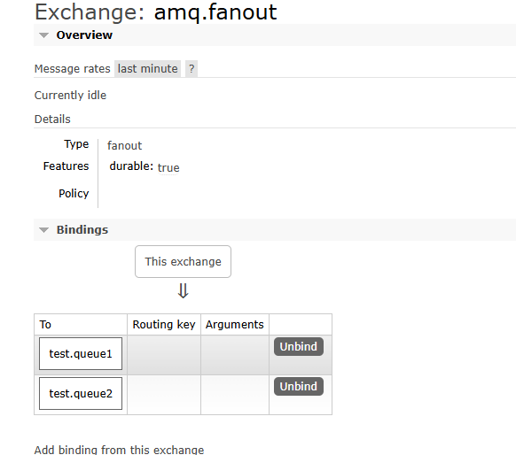

3. 在amq.fanout中发送测试消息

> 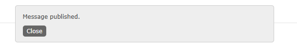

4. 在队列中查看消息

> 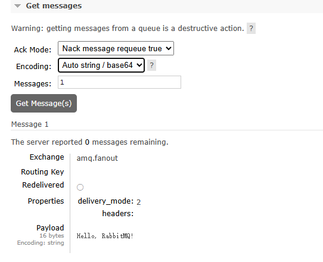

### Spring AMQP

Spring AMQP是一个基于AMQP协议的消息中间件框架，它提供了一个简单的API来发送和接收异步、可靠的消息。它是Spring框架的一部分，可以与Spring Boot和其他Spring项目一起使用。Spring AMQP支持多种消息协议，包括RabbitMQ、Apache ActiveMQ和Qpid等。它提供了一个高级的消息模型，包括消息确认、事务和消息监听器等功能，使得开发者可以轻松地编写可靠的消息应用程序。Spring AMQP还提供了一些高级特性，如消息转换器、消息路由、消息过滤和消息拦截等。这些特性可以帮助开发者更加灵活地处理不同类型的消息，同时也提高了应用程序的性能和可靠性。总之，Spring AMQP是一个强大的消息中间件框架，它可以帮助开发者轻松地构建可靠的消息应用程序，并提供了许多高级特性来满足不同的需求

#### 快速入门

1. 引入依赖

```xml
<!--spring amqp-->
<dependency>
    <groupId>org.springframework.boot</groupId>
    <artifactId>spring-boot-starter-amqp</artifactId>
</dependency>
```

2. 添加rabbitmq配置

```yml
spring:
  rabbitmq:
    host: localhost
    port: 5672
    virtual-host: /
    username: kiiz
    password: kiiz
```

3. 创建生产者

我们直接将消息发往消息队列，不经过路由器。在Spring AMQP中，提供了RabbitTemplate类来操作RabbitMQ

```java
package com.hmall.cart;

import lombok.extern.slf4j.Slf4j;
import org.junit.jupiter.api.Test;
import org.springframework.amqp.rabbit.core.RabbitTemplate;
import org.springframework.boot.test.context.SpringBootTest;

@Slf4j
@SpringBootTest
public class MQTest {

    RabbitTemplate rabbitTemplate;

    @Test
    public void testPublisher() {
        // 创建消息
        String message = "Hello Spring AMQP";
        // 指定队列
        String queue = "test.queue1";
        // 发送消息
        rabbitTemplate.convertAndSend(queue, message);
    }
}
```

4. 创建消费者

创建消费者使用@RabbitListener注解，queues属性表示监听的队列

```java
package com.hmall.cart.queue;

import lombok.extern.slf4j.Slf4j;
import org.springframework.amqp.rabbit.annotation.RabbitListener;
import org.springframework.stereotype.Component;

@Slf4j
@Component
public class TestListener {

    @RabbitListener(queues = "test.queue1")
    public void onMessage(String message) {
        log.info("收到消息: {}", message);
    }
}
```

5. 发送消息，在消费者端观察日志

> 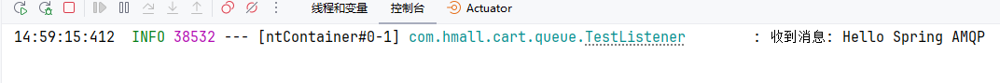

#### Work Queues

work queues又称任务模型，是指让多个消费者绑定一个队列，共同消费队列中的消息

在work queues模型中，默认的消息分发规则是轮询模式。因为默认消息队列中的消息会直接被消费者消费，而不是引用，所以在没有作为缓存的情况下，消息队列中的消息数量应当保持为0

**效率优先**

假设存在两台性能不一致的服务器，因为rabbitmq默认的轮询机制，可能会导致其中一台已经消费完成，而另一台仍在继续消费的情况，这会导致不必要的资源浪费。因此可以在配置中启用prefetch项，prefetch项会限制消息队列投递到消费者的数量，如果设置为1，则表示每次投递最多1条消息，这条消息消费完成后，才能继续投递下一条消息

```yml
spring:
  rabbitmq:
    listener:
      simple:
        prefecth: 1
```

#### 交换机

##### Fanout

Fanout exchange，广播交换机，会将每一条接收的消息都路由到所有与其绑定的消息队列中，所有的消费者都能够接收到消息

例如先前提到的支付案例，如果是纯消息队列实现，就需要保证消息队列中的消息数量等于消费者数量，而且需要保证每个消费者都能够收到一份消息。而利用Fanout交换机，只需要为每个消费者设置一个单独的消息队列，然后绑定到Fanout交换机上，生产者只需要发送一条消息，所有的消费者都能收到，并且直接杜绝了一个消费者收到多条消息的可能

> 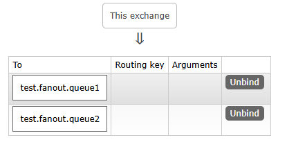

> 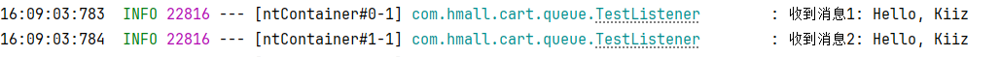

##### Direct

Direct exchange，定向路由交换机，会将接收到的消息按照指定规则路由到指定消息队列中，具体规则如下

每一个消息队列都需要与交换机设置一个BindingKey，发布者发布消息时，需要指定消息的BindingKey，然后Direct交换机就会将消息路由到BindingKey对应的队列中去

> 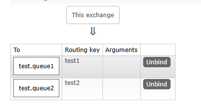

然后发送一个Key为test2的消息

> 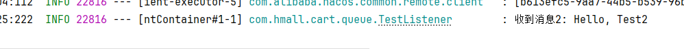

而且一个队列可以绑定多个Key，一个Key允许被多个队列绑定，所以Direct实际上也可以实现Fanout的功能

> 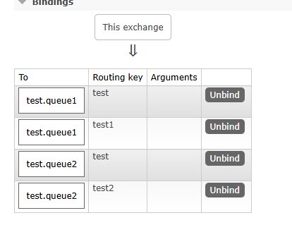

然后向test发送消息

> 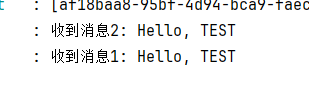

##### Topic

Topic exchange，主题交换机，与Direct类似，使用路由Key来区分消息队列，但是Topic的路由Key是一串用点号`.`分隔的多个域组成的字符串，如`formula.one.news`、`formula.two.race`等

topic key允许使用通配符来匹配路由，#表示多个域，\*表示一个域，如`formula.#`匹配任意以`formula`开头的key，而`formula.*`则匹配任意以`formula`开头，但是只能有两个域的key

需要注意，通配符应该使用在交换机匹配规则上

> 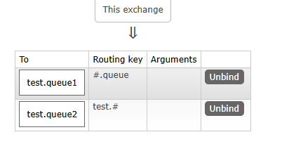

然后我们发送一个消息，key设置为test.queue

> 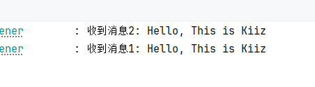

再发送一个消息，key设置为test.kiiz

> 

#### Java声明队列和交换机

Spring AMQP提供了几个类，用于声明队列、交换机及其绑定关系

- Queue: 用于声明消息队列，可以用工厂类QueueBuilder构建
- Exchange: 用于声明交换机，可以用工厂类ExchangeBuilder构建
- Binding: 用于声明队列和交换机之间的绑定关系，可以用工厂类BindingBuilder构建

##### 基于Bean创建

**示例**

创建一个config类，定义Bean返回交换机、消息队列以及绑定关系

```java
package com.hmall.cart.config;

import org.springframework.amqp.core.*;
import org.springframework.context.annotation.Bean;
import org.springframework.context.annotation.Configuration;

@Configuration
public class RabbitMQConfig {

    // 创建交换机
    @Bean
    public TopicExchange topicExchange() {
        return new TopicExchange("test.topic");
    }

    // 创建队列
    @Bean
    public Queue queue1() {
        return new Queue("test.queue1");
    }

    // 绑定队列与交换机
    @Bean
    public Binding bindingQueue1() {
        return BindingBuilder.bind(queue1())
                .to(topicExchange())
                .with("test.#");
    }
}
```

##### 基于注解创建

Spring AMQP还提供了基于@RabbitListener注解的声明方式

**示例**

```java
package com.hmall.cart.queue;

import lombok.extern.slf4j.Slf4j;
import org.springframework.amqp.core.ExchangeTypes;
import org.springframework.amqp.rabbit.annotation.Exchange;
import org.springframework.amqp.rabbit.annotation.Queue;
import org.springframework.amqp.rabbit.annotation.QueueBinding;
import org.springframework.amqp.rabbit.annotation.RabbitListener;
import org.springframework.stereotype.Component;

@Slf4j
@Component
public class TestListener {

    @RabbitListener(bindings = @QueueBinding(
            value = @Queue(name = "test.queue1"),
            exchange = @Exchange(name = "test.topic", type = ExchangeTypes.TOPIC),
            key = "test.#"
    ))
    public void onMessage(String message) {
        log.info("监听到消息：{}", message);
    }
}
```

这里的key是一个String[]数组，因此可以为一个队列添加多个key

> 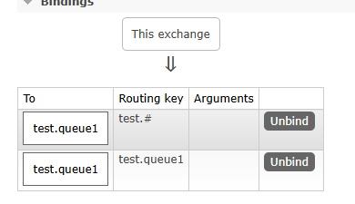

#### 消息转换器

Spring AMQP在发送消息的时候需要使用一个消息转换器，将Java对象转换为能够发送的数据，也就是序列化。Spring AMQP默认使用的是JDK自己的序列化工具，但JDK原生序列化工具存在诸多问题，如性能低下、数据膨胀，以及严重的安全漏洞问题，如CVE-2017-5638，甚至可以利用反序列化执行RCE漏洞

所以，我们需要将其更改为性能更好，更加安全的消息转换器，这里我们使用Jackson

1. 引入Jackson依赖

```xml
<!--jackson-->
<dependency>
    <groupId>com.fasterxml.jackson.core</groupId>
    <artifactId>jackson-databind</artifactId>
</dependency>
```

2. 在config类中定义Bean，返回一个MessageConverter

```java
package com.hmall.cart.config;

import org.springframework.amqp.support.converter.Jackson2JsonMessageConverter;
import org.springframework.amqp.support.converter.MessageConverter;
import org.springframework.context.annotation.Bean;
import org.springframework.context.annotation.Configuration;

@Configuration
public class RabbitMQConfig {

    @Bean
    public MessageConverter messageConverter() {
        return new Jackson2JsonMessageConverter();
    }
}
```

3. 然后重启测试类，发送一个Map集合，查看消息队列中是否为JSON格式

> 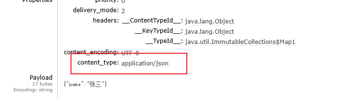

#### 实践-订单支付成功后的订单状态修改

在先前的学习中，订单支付成功后，我们对支付状态的修改是使用Feign调用Order服务接口实现的，这是一种同步调用。现在我们发现，这种同步调用是不必要的，因为对于支付服务来说，订单服务属于边缘业务，支付服务不需要知道订单服务的实现结果与返回值，所以我们将其改造为异步调用

1. 定义消费者

先有需求才有生产，所以先定义消费者，而且消费者注解中才能定义交换机、队列等细节。在订单服务中，定义mq.consumer包，定义OrderConsumer类，注入orderService，因为需要通过OrderConsumer操作orderService，记住添加@Component注解。然后定义一个handlerPaySuccess方法，用于监听消息队列，在方法上添加@RabbitListener注解，设置绑定队列为order.pay.success.queue，命名规则即为 `服务名.业务.queue`，交换机为direct交换机，因为Spring AMQP默认为DIRECT，所以无需添加type属性；最后绑定一个Key为pay.success。在handlerPaySuccess方法内部，调用orderService的markOrderPaySuccess()方法即可将订单标记为已支付

```java
package com.hmall.order.mq.consumer;

import com.hmall.order.domain.Order;
import com.hmall.order.service.IOrderService;
import lombok.RequiredArgsConstructor;
import lombok.extern.slf4j.Slf4j;
import org.springframework.amqp.core.ExchangeTypes;
import org.springframework.amqp.rabbit.annotation.Exchange;
import org.springframework.amqp.rabbit.annotation.Queue;
import org.springframework.amqp.rabbit.annotation.QueueBinding;
import org.springframework.amqp.rabbit.annotation.RabbitListener;
import org.springframework.stereotype.Component;

@Component
@RequiredArgsConstructor
@Slf4j
public class OrderConsumer {

    private final IOrderService orderService;

    @RabbitListener(bindings = @QueueBinding(
            value = @Queue(name = "order.pay.success.queue"),
            exchange = @Exchange(name = "hmall.pay.direct"),
            key = "pay.success"
    ))
    public void handlerPaySuccess(Long orderId) {
        log.info("订单支付成功：{}", orderId);
        orderService.markOrderPaySuccess(orderId);
    }
}
```

2. 定义生产者

创建包mq.producer，定义生产者类PayProducer，定义方法sendPaySuccessWithOrderId来发送消息。这里的命名规范需要注意，支付服务无需知道消息的接收者是谁，所以命名方面不应使用sendToOrder或者UpdateOrder，而是描述发送行为即可。接着注入RabbitTemplate，调用rabbitTemplate向hmall.pay.direct交换机发送消息，路由Key随即设置为pay.success，消息内容为订单id

```java
package com.hmall.pay.mq.producer;

import lombok.RequiredArgsConstructor;
import lombok.extern.slf4j.Slf4j;
import org.springframework.amqp.rabbit.core.RabbitTemplate;
import org.springframework.stereotype.Component;

@Component
@Slf4j
@RequiredArgsConstructor
public class PayProducer {

    private final RabbitTemplate rabbitTemplate;

    public void sendPaySuccessWithOrderId(Long orderId) {
        log.info("支付成功：{}", orderId);
        rabbitTemplate.convertAndSend("hmall.pay.direct", "pay.success", orderId);
    }
}
```

*注：在发送消息之前别忘了配置消息转换器*

### 消息可靠性

消息可靠性是指消息在从生产者生产开始，到消费者消费完毕这个过程中消息的可用性，也就是消息的安全性。消息的可靠性可以从三个方面去考虑，分别是发送者可靠性、MQ可靠性与消费者可靠性。生产者出现异常无法正常生产，MQ服务器异常，传输网络异常，消费者自身异常导致消息无法被消费，都会影响消息的可靠性

#### 发送者可靠性

RabbitMQ默认提供了两种方式来确保发送者可靠性，分别是发送者重连和发送者确认

##### 发送者重连

由于网络波动问题，可能会出现发送者连接MQ失败的情况，导致消息无法正确发送。通过配置我们可以开启连接失败后重连

```yml
spring:
  rabbitmq:
    # 设置MQ连接超时时间
    connection-timeout: 1s
    template:
      retry:
        # 开启超时重连
        enable: true
        # 重连等待时间
        initial-interval: 1000ms
        # 下次重连等待时间倍数
        multiplier: 2
        # 最大重连次数
        max-attempts: 3
```

##### 发送者确认

发送者重连解决的是发送者与MQ的连接问题，而发送者确认则是解决消息发送的问题。Spring AMQP提供了Publisher Confirm和Publisher Return两种确认机制，开启发送者确认后，当发送者发送消息给MQ后，MQ会返回确认结果给发送者

