# Java Web Medium

`更新时间：2026-4-29`

注释解释：

- `<>`必填项，必须在当前位置填写相应数据

- `{}`必选项，必须在当前位置选择一个给出的选项

- `[]`可选项，可以选择填写或忽略

*注：该笔记内的可选项和参数均不完整，如有需要，请查询相关手册*

---

## AOP

`AOP`全称`Aspect Oriented Programming`，面向切面编程，是`OOP`面向对象编程的进阶思想。简单来说，就是面向特定方法编程，例如某些业务方法的运行速度较慢，需要定位执行耗时较长的方法，因此首先就需要统计每一个业务方法的耗时。`AOP`可以减少重复代码，对原来的代码没有任何侵入，可以提高开发效率，并且便于维护，任何更改都在单独的`AOP`中进行

### 快速入门

统计所有`Service`业务层方法的耗时

1. 引入`Spring AOP`依赖

```xml
<!--       Spring AOP-->
<dependency>
    <groupId>org.springframework.boot</groupId>
    <artifactId>spring-boot-starter-aop</artifactId>
    <version>3.5.13</version>
</dependency>
```

2. 编写`AOP`类，添加`@Aspect`和`@Component`注解，注册为`Bean`，然后编写`AOP`方法，在方法上使用注解`@Around`来指定需要切入的方法

```java
package com.eiousee.aspect;

import lombok.extern.slf4j.Slf4j;
import org.aspectj.lang.ProceedingJoinPoint;
import org.aspectj.lang.annotation.Around;
import org.aspectj.lang.annotation.Aspect;
import org.springframework.stereotype.Component;

@Aspect
@Slf4j
@Component
public class RecordTimeAspect {

    @Around("execution(* com.eiousee.service.impl.*.*(..))")
    public Object recordTime(ProceedingJoinPoint joinPoint) throws Throwable {
        long start = System.currentTimeMillis();
        Object result = joinPoint.proceed();
        long end = System.currentTimeMillis();
        log.info("方法 {} 耗时：{}ms", joinPoint.getSignature(), end - start);

        return result;
    }
}
```

> 

### 核心概念

**连接点**

`JoinPoint`，连接点，是指可以被`AOP`控制的方法，也包括方法执行时的相关信息

**通知**

`Advice`，通知，指可以重复的逻辑，即共性功能，比如在上文中编写的统计执行时间的方法

**切入点**

`PointCut`，所有满足切入点规则的连接点才能被`AOP`控制

**切面**

`Aspect`，描述通知与切入点的对应关系，简单来说，即是通过通知与切入点的约束，可以完整地描述哪些类、哪些方法需要执行哪些额外操作

**目标对象**

`Target`，通知所应用的对象

`SpringAOP`底层基于动态代理技术，实际是创建了一个切入类的代理类，然后交予`IOC`管理，在执行匹配方法时，调用代理类的对应方法，也就是通知方法

### AOP进阶

#### 通知类型

`SpringAOP`提供了多种通知类型注解，用于标注不同的通知方法

| 注解              | 备注                                                         |
| ----------------- | ------------------------------------------------------------ |
| `@Around`         | 环绕通知，通知方法在切入方法前后都被执行                     |
| `@Before`         | 前置通知，通知方法在切入方法前被执行                         |
| `@After`          | 后置通知，通知方法在切入方法后被执行                         |
| `@AfterReturning` | 后置通知，通知方法在切入方法后被执行，但切入方法不能抛出异常 |
| `@AfterThrowing`  | 异常后置通知，通知方法在切入方法抛出异常后被执行             |

*注：环绕通知方法需要手动调用`ProceedingJoinPoint`参数的`proceed()`方法来调用匹配方法，并且环绕通知方法返回值类型必须为`Object`*

#### 公共切入点表达式

在编写`Aspect`类时，如果每个方法都需要编写切入点表达式会非常麻烦，因此`SpringAOP`提供了`@PointCut`注解来记录切入点表达式

**标准语法**

```java
public class SomeAspect {
    @Pointcut("execution(* com.eiousee.service.impl.*.*(..))")
    public void pointcut() {}
    
    @Around("pointcut()")
    public Object recordTime(ProceedingJoinPoint joinPoint) throws Throwable {}
    
    @Before("pointcut()")
    public void before() {}
}
```

#### 通知顺序

默认情况下，在不同的切面类中，按照类名首字母顺序排序，如果不希望使用默认排序，`SpringAOP`也提供了`@Order()`注解来进行排序，括号内数字越小，次序越靠前

**示例**

```java
@Aspect
@Component
@Order(1)
public class FirstAspect {}

@Aspect
@Component
@Order(2)
public class SecondAspect {}
```

#### 切入点表达式

切入点表达式是描述切入点方法的表达式，用来决定项目中哪些方法需要加入通知，即用切入点表达式来匹配连接点，被匹配的连接点即为切入点

常见的切入点表达式类型有`execution()`和`@annotation`

- `execution()`：根据方法签名匹配
- `@annotation`：根据注解匹配

**execution**

**标准语法**

```java
execution([Accessbility] ReturnedValueType [PackageName.ClassName.]MethodName(ParamType) [throws ExceptionName])
```

切入点表达式中也可以使用通配符

- `*`：一级通配符，可以匹配一级任意字段，如包名、类名、方法名等

**示例**

```java
execution(* com.eiousee.*.get*(*))
```

表示匹配任意返回值，位于`com.eiousee`包下的所有类中，任何方法签名前缀为`get`，只有一个参数的方法，注意这里无法匹配`com.eiousee`子包中的类，例如`com.eiousee.controller.DeptController`，因为星号只能作为一级匹配

- `..`：多级匹配，可以匹配多个层级或数量

**示例**

```java
execution(* com.eiousee..*.get*(..))
```

表示匹配任意返回值，位于`com.eiousee`包及其所有子包类中，任何方法签名前缀为`get`，且参数数量任意的方法

`execution`也可以使用逻辑运算符，例如想要匹配特定的两个方法

```java
execution(* com.eiousee.controller.DeptController.list(..)) || execution(* com.eiousee.controller.DeptController.delete(..))
```

**@annotation**

**标准语法**

```java
@annotaion(AnnotationPackageName)
```

**示例**

匹配所有使用`@Eiousee`注解的类

```java
@annotation(com.eiousee.annotation.Eiousee)
```

#### 连接点

在`SpringAOP`中使用`JoinPoint`抽象了连接点，用它可以获得方法执行时的相关信息，比如目标类名、方法名、方法参数等等，对于环绕通知，只能使用`ProceedingJoinPoint`，其他四种通知类型只能使用`JoinPoint`

**常用API**

| 方法名           | 返回值类型 | 说明                                                         |
| ---------------- | ---------- | ------------------------------------------------------------ |
| `getTarget()`    | Object     | 获取匹配对象                                                 |
| `getClass()`     | Class      | 获取匹配类                                                   |
| `getSignature()` | Signature  | 获取匹配方法签名                                             |
| `getName()`      | String     | 获取对应的字符串名称，如`getTarget().getName()`、`getSignature().getName()` |
| `getArgs()`      | Object[]   | 获取匹配方法的参数列表                                       |

### 案例-日志记录功能

为学习管理项目增加一个日志记录功能，每条日志数据需要保存在数据库中

首先定义一个数据表来存储日志

```sql
CREATE TABLE IF NOT EXISTS `operation_log` (
    id INT AUTO_INCREMENT PRIMARY KEY COMMENT '编号',
    user_id INT COMMENT '员工编号',
    operation_time DATETIME COMMENT '操作时间',
    operation_class VARCHAR(255) COMMENT '操作类名',
    operation_method VARCHAR(255) COMMENT '操作方法名',
    operation_params TEXT COMMENT '操作参数',
    operation_result TEXT COMMENT '操作结果',
    cost_time BIGINT COMMENT '操作耗时'
);
```

然后定义一个操作日志实体类

```java
package com.eiousee.pojo;

import lombok.AllArgsConstructor;
import lombok.Data;
import lombok.NoArgsConstructor;

import java.time.LocalDateTime;

@Data
@AllArgsConstructor
@NoArgsConstructor
public class OperationLog {
    private Integer id;
    private LocalDateTime operationTime;
    private String operationClass;
    private String operationMethod;
    private String operationParams;
    private String operationResult;
    private Long costTime;
}
```

再编写一个切面类，切入点为所有`Service`类及其实现类，在通知方法中定义记录日志的逻辑，通知类型为环绕通知

```java
package com.eiousee.aop;

import com.eiousee.mapper.LogMapper;
import com.eiousee.pojo.OperationLog;
import lombok.extern.slf4j.Slf4j;
import org.aspectj.lang.ProceedingJoinPoint;
import org.aspectj.lang.annotation.Around;
import org.aspectj.lang.annotation.Aspect;
import org.aspectj.lang.annotation.Pointcut;
import org.springframework.stereotype.Component;

import java.time.LocalDateTime;
import java.util.Arrays;

@Aspect
@Component
@Slf4j
public class LogAspect {

    private final LogMapper logMapper;

    public LogAspect(LogMapper logMapper) {
        this.logMapper = logMapper;
    }

    @Pointcut("execution(* com.eiousee.service..*(..))")
    public void log() {}

    @Around("log()")
    public Object recordLog(ProceedingJoinPoint joinPoint) throws Throwable {
        long startTime = System.currentTimeMillis();
        Object result = joinPoint.proceed();
        long endTime = System.currentTimeMillis();

        OperationLog operationLog = new OperationLog();
        operationLog.setOperationTime(LocalDateTime.now());
        operationLog.setOperationClass(joinPoint.getTarget().getClass().getName());
        operationLog.setOperationMethod(joinPoint.getSignature().getName());
        operationLog.setOperationParams(Arrays.toString(joinPoint.getArgs()));
        operationLog.setOperationResult(result.toString());
        operationLog.setCostTime(endTime - startTime);
        log.info("操作日志：{}", operationLog);
        logMapper.addLog(operationLog);

        return result;
    }
}
```

最后实现日志记录的`Mapper`

```xml
<insert id="addLog">
    INSERT INTO
        operation_log(user_id, operation_time, operation_class, operation_method, operation_params, operation_result, cost_time)
    VALUES (
               #{id},
               #{operationTime},
               #{operationClass},
               #{operationMethod},
               #{operationParams},
               #{operationResult},
               #{costTime}
           )
</insert>
```

### ThreadLocal

`ThreadLocal`并不是一个`Thread`，而是一个`Thread`的局部变量，每个线程会提供一份单独的存储空间，具有线程隔离的效果，不同的线程之间不会相互干扰，这份存储空间就是`ThreadLocal`

**常用API**

| API                        | 说明                               |
| -------------------------- | ---------------------------------- |
| `public void set(T value)` | 设置当前线程的线程局部变量值       |
| `public T get()`           | 返回当前线程所对应的线程局部变量值 |
| `public void remove()`     | 移除当前线程的线程局部变量         |

#### 获取当前员工登录id

首先定义一个工具类操作`ThreadLocal`

```java
package com.eiousee.utils;

public class CurrentOperator {

    private final static ThreadLocal<Integer> CURRENT_OPERATOR = new ThreadLocal<>();

    public static void setCurrentOperator(Integer operatorId) {
        CURRENT_OPERATOR.set(operatorId);
    }

    public static Integer getCurrentOperator() {
        return CURRENT_OPERATOR.get();
    }

    public static void clear() {
        CURRENT_OPERATOR.remove();
    }
}
```

然后启用`Interceptor`，在`Interceptor`中解析请求的`token`，获取其中的`id`值，并在请求结束时删除。注意`Claims`类中提供了一个方法`getId()`，但我们实际使用的是`get("id")`

```java
package com.eiousee.interceptor;

import com.eiousee.utils.CurrentOperator;
import com.eiousee.utils.JwtUtils;
import io.jsonwebtoken.Claims;
import jakarta.servlet.http.HttpServletRequest;
import jakarta.servlet.http.HttpServletResponse;
import lombok.extern.slf4j.Slf4j;
import org.springframework.stereotype.Component;
import org.springframework.web.servlet.HandlerInterceptor;
import org.springframework.web.servlet.ModelAndView;

@Slf4j
@Component
public class AuthInterceptor implements HandlerInterceptor {
    @Override
    public boolean preHandle(HttpServletRequest request, HttpServletResponse response, Object handler) {
        log.info("请求开始：{}", request.getRequestURI());

        String token = request.getHeader("token");
        if (token == null || token.isEmpty()) {
            log.info("未找到Token");
            response.setStatus(HttpServletResponse.SC_UNAUTHORIZED);
            return false;
        }
        try {
            // 验证Token
            Claims claims = JwtUtils.parseJwt(token);
            CurrentOperator.setCurrentOperator(Integer.valueOf(claims.get("id").toString()));
        } catch (Exception e) {
            log.info("Token验证失败");
            response.setStatus(HttpServletResponse.SC_UNAUTHORIZED);
            return false;
        }
        return true;
    }

    @Override
    public void postHandle(HttpServletRequest request, HttpServletResponse response, Object handler, ModelAndView modelAndView) throws Exception {
        CurrentOperator.clear();
    }
}
```

最后在切面类中获取`ThreadLocal`中的数据，写入数据库中

```java
package com.eiousee.aop;

import com.eiousee.mapper.LogMapper;
import com.eiousee.pojo.OperationLog;
import com.eiousee.utils.CurrentOperator;
import lombok.extern.slf4j.Slf4j;
import org.aspectj.lang.ProceedingJoinPoint;
import org.aspectj.lang.annotation.Around;
import org.aspectj.lang.annotation.Aspect;
import org.aspectj.lang.annotation.Pointcut;
import org.springframework.stereotype.Component;

import java.time.LocalDateTime;
import java.util.Arrays;

@Aspect
@Component
@Slf4j
public class LogAspect {

    private final LogMapper logMapper;

    public LogAspect(LogMapper logMapper) {
        this.logMapper = logMapper;
    }

    @Pointcut("execution(* com.eiousee.service..*(..))")
    public void log() {}

    @Around("log()")
    public Object recordLog(ProceedingJoinPoint joinPoint) throws Throwable {
        long startTime = System.currentTimeMillis();
        Object result = joinPoint.proceed();
        long endTime = System.currentTimeMillis();

        OperationLog operationLog = new OperationLog();
        operationLog.setId(CurrentOperator.getCurrentOperator());
        operationLog.setOperationTime(LocalDateTime.now());
        operationLog.setOperationClass(joinPoint.getTarget().getClass().getName());
        operationLog.setOperationMethod(joinPoint.getSignature().getName());
        operationLog.setOperationParams(Arrays.toString(joinPoint.getArgs()));
        operationLog.setOperationResult(result.toString());
        operationLog.setCostTime(endTime - startTime);
        log.info("操作日志：{}", operationLog);
        logMapper.addLog(operationLog);

        return result;
    }
}
```

> 

### 案例-日志记录管理

根据接口文档，编写一个日志记录管理页面，使用分页查询

首先在实体类中添加一个显示用户名的字段，方便在前端直接显示操作人，而不是操作人`id`

```java
package com.eiousee.pojo;

import lombok.AllArgsConstructor;
import lombok.Data;
import lombok.NoArgsConstructor;

import java.time.LocalDateTime;

@Data
@AllArgsConstructor
@NoArgsConstructor
public class OperationLog {
    private Integer id;
    private String operator;
    private LocalDateTime operationTime;
    private String operationClass;
    private String operationMethod;
    private String operationParams;
    private String operationResult;
    private Long costTime;
}
```

然后定义`Controller` ，接收两个分页查询的参数

```java
@GetMapping
public Result getLogs(Integer page, Integer pageSize) {
    log.info("获取日志列表");
    return Result.success(logService.getLogs(page, pageSize));
}
```

定义`Service`，实现分页查询逻辑

```java
@Override
public PageResult<OperationLog> getLogs(Integer pageNum, Integer pageSize) {
    pageNum = pageNum == null ? 1 : pageNum;
    pageSize = pageSize == null ? 10 : pageSize;

    Page<OperationLog> page = PageHelper.startPage(pageNum, pageSize);
    logMapper.getLogs();
    return new PageResult<>(page.getTotal(), page.getResult());
}
```

然后编写`sql`语句

```xml
<select id="getLogs" resultType="com.eiousee.pojo.OperationLog">
    SELECT
        username AS operator,
        operation_time AS operationTime,
        operation_class AS operationClass,
        operation_method AS operationMethod,
        operation_params AS operationParams,
        operation_result AS operationResult,
        cost_time AS costTime
    FROM
        operation_log
    LEFT JOIN jdbc.users u on u.id = operation_log.user_id
</select>
```

最后更改日志记录的切入点表达式，排除日志查询类，防止数据爆炸

```java
@Pointcut("execution(* com.eiousee.service..*(..))" +
        "&& !within(com.eiousee.service.impl.LogServiceImpl)")
public void log() {}
```

## Spring配置

### 配置优先级

在`Spring`中，支持三种配置文件格式，分别是`properties`、`yml`和`yaml`，但本质上`yml`是`yaml`的缩写

如果三份配置文件同时存在，优先级从高到低为`properties`、`yml`、`yaml`

此外，`Spring`还支持命令行参数和`JVM`虚拟机参数形式的配置

命令行参数：`--server.port=8080`

`JVM`虚拟机参数：`-Dserver.port=8080`

此时的配置优先级从高到低分别为：`命令行参数`、`JVM虚拟机参数`、`properties`、`yml`、`yaml`

### Bean管理

在`Spring`中，`Bean`支持五种作用域

| 作用域        | 说明                                 |
| ------------- | ------------------------------------ |
| `singleton`   | 容器内同名称的`bean`只能存在一个实例 |
| `prototype`   | 每次使用`bean`时创建新的实例         |
| `request`     | 每个请求范围内会创建新的实例         |
| `session`     | 每个会话范围内会创建新的实例         |
| `application` | 每个应用范围内会创建新的实例         |

`Bean`的作用域可以通过`@Scope`注解来声明，注解标注在对应的`Bean`类上

对于作用域为`singleton`的`Bean`，在`Spring`项目启动时会直接创建对应的实例，项目启动完成后，直接放入`IOC`容器中进行管理。而`Spring`中也提供了`@Lazy`注解来延迟创建`Bean`，将`Bean`的创建时间更改为第一次使用时才创建，因此`@Lazy`可以解决循环依赖的问题

#### 循环依赖

如果`Spring`项目中出现一个`Bean`需要注入另一个`Bean`，而另一个`Bean`也需要注入这一个`Bean`的情况，就被称为循环依赖，默认情况下，如果存在循环依赖，`Spring`会在启动时直接报错

> 

循环依赖出现的原因是，`Spring`默认在项目启动时就创建所有的`Bean`实例，但是在创建实例`A`时，需要注入实例`B`，此时实例`B`并没有创建完成；同样地，在创建实例`B`时，实例`A`也并没有创建完成，导致双方都在等待对方创建完成，而形成的死锁状态。

此时在某一方的注入点增加`@Lazy`注解，项目启动，创建`Bean`实例时，没有注解的一方就能直接获得一个对方的代理实例，从而完成创建过程。而添加注解的一方在第一次被调用时，对方的`Bean`实例已经创建完成，只需要将对方正常注入即可完成创建。

#### 线程安全性

对于作用域是`singleton`，即无状态的`Bean`，因为其中不保存任何数据，因此可以认为是线程安全的，但是如果是有状态的单例`Bean`，多线程同时操作时，则可能会存在线程安全问题；而对于作用域是`prototype`的`Bean`，每个请求都是一个新的`Bean`实例，不存在多线程操作，所以可以认为是线程安全的

#### 第三方Bean

如果需要管理第三方提供的`Bean`实例，但又不能更改第三方的源代码，就可以使用`@Bean`注解来注册一个`Bean`，在配置类`@Configuration`中定义相关的方法。如果第三方`Bean`需要注入其他`Bean`，在方法参数列表中添加即可，第三方`Bean`的默认名称为启动类中的方法名，而不是首字母小写的类名

现在我们将之前定义的阿里云`OSS`上传类视为第三方类，删除其`@Component`注解，表示不允许更改源码

```java
package com.eiousee.utils;

import com.aliyun.sdk.service.oss2.OSSClient;
import com.aliyun.sdk.service.oss2.OSSClientBuilder;
import com.aliyun.sdk.service.oss2.credentials.CredentialsProvider;
import com.aliyun.sdk.service.oss2.credentials.EnvironmentVariableCredentialsProvider;
import com.aliyun.sdk.service.oss2.models.*;
import com.aliyun.sdk.service.oss2.transport.BinaryData;
import com.eiousee.pojo.AliyunOSS2Properties;
import org.springframework.beans.factory.annotation.Value;
import org.springframework.stereotype.Component;

public class AliyunOSS2Operator {

    private final AliyunOSS2Properties aliyunOSS2Properties;

    public AliyunOSS2Operator(AliyunOSS2Properties aliyunOSS2Properties) {
        this.aliyunOSS2Properties = aliyunOSS2Properties;
    }

    public String putObject(String fileName, byte[] data) {

        String region = aliyunOSS2Properties.getRegion();
        String bucket = aliyunOSS2Properties.getBucket();

        CredentialsProvider provider = new EnvironmentVariableCredentialsProvider();
        OSSClientBuilder clientBuilder = OSSClient.newBuilder()
                .credentialsProvider(provider)
                .region(region);

        try (OSSClient client = clientBuilder.build()) {
            PutObjectResult result = client.putObject(PutObjectRequest.newBuilder()
                            .bucket(bucket)
                            .key(fileName)
                            .body(BinaryData.fromBytes(data))
                    .build());

            System.out.printf("status code:%d, request id:%s, eTag:%s\n",
                    result.statusCode(), result.requestId(), result.eTag());

        } catch (Exception e) {
            System.out.printf("error:\n%s", e);
            return null;
        }
        return "https://" + bucket + ".oss-cn-beijing.aliyuncs.com/" + fileName;
    }
}
```

然后在启动类中注册`Bean`，并指定主要注入的其他`Bean`

```java
package com.eiousee;

import com.eiousee.pojo.AliyunOSS2Properties;
import com.eiousee.utils.AliyunOSS2Operator;
import org.springframework.boot.SpringApplication;
import org.springframework.boot.autoconfigure.SpringBootApplication;
import org.springframework.boot.web.servlet.ServletComponentScan;
import org.springframework.context.annotation.Bean;

@ServletComponentScan
@SpringBootApplication
public class WebProjectApplication {

    public static void main(String[] args) {
        SpringApplication.run(WebProjectApplication.class, args);
    }

    @Bean
    public AliyunOSS2Operator aliyunOSS2Operator(AliyunOSS2Properties aliyunOSS2Properties) {
        return new AliyunOSS2Operator(aliyunOSS2Properties);
    }
}
```

> 

但在实际业务中，必须要保证启动类的职责单一，不应该出现其他内容，因此可以单独定义一个配置类，使用`@Configuration`注解，单独定义第三方`Bean`对象

```java
package com.eiousee.config;

import com.eiousee.pojo.AliyunOSS2Properties;
import com.eiousee.utils.AliyunOSS2Operator;
import org.springframework.context.annotation.Bean;
import org.springframework.context.annotation.Configuration;

@Configuration
public class OSS2Config {
    @Bean
    public AliyunOSS2Operator aliyunOSS2Operator(AliyunOSS2Properties aliyunOSS2Properties) {
        return new AliyunOSS2Operator(aliyunOSS2Properties);
    }
}
```

> 

## SpringBoot原理

### 起步依赖

在传统的`Spring`框架的项目中，配置和依赖管理非常麻烦，而`SpringBoot`提供了起步依赖，也就是形如`spring-boot-starter-web`、`mybatis-spring-boot-starter`这样拥有`starter`关键字的依赖项，`SpringBoot`的起步依赖实际上基于`maven`的依赖传递，通过起步依赖，`maven`会自动寻找起步依赖所需要的其他依赖，而不用开发人员自行配置

> 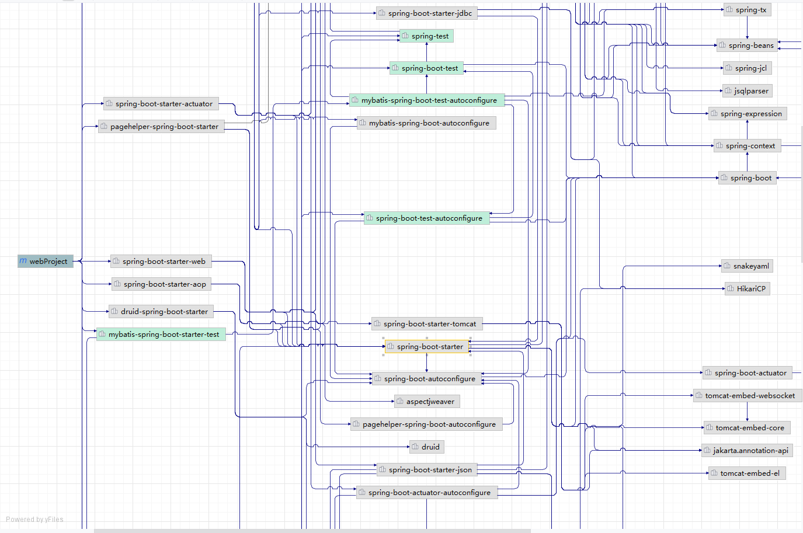

### 自动配置

自动配置是指当`Spring`项目启动后，一些配置类、`Bean`实例会自动存入`IOC`容器中，不需要手动声明，从而简化开发，省去繁琐的配置操作

举个例子，我们在引入阿里云`OSS`依赖的时候，自动引入了`JackSon`依赖

> 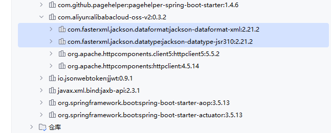

而在测试类中，我们注入这个依赖的`Bean`，也并没有任何报错，说明这个`Bean`存储在`IOC`容器中

> 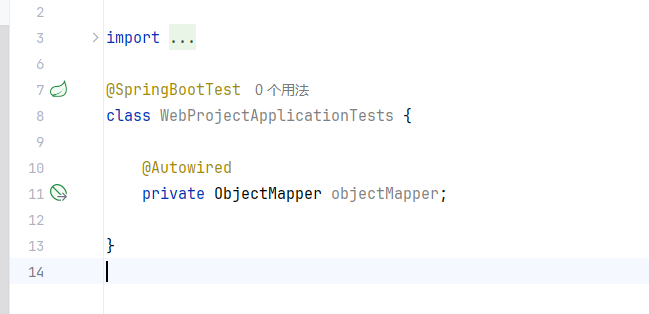

我们并没有在项目中为其单独配置第三方`Bean`，源代码中也并没有`@Component`这样的注解，所以这里的自动注入就是由`SpringBoot`的自动配置实现的

#### 实现

我们定义一个额外的包`util.eiousee`，模拟一个第三方依赖，来实现自动配置的功能

> 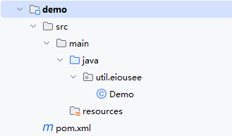

然后在`Spring`项目中引入这个依赖

```xml
<!--        demo-->
        <dependency>
            <groupId>util.eiousee</groupId>
            <artifactId>demo</artifactId>
            <version>1.0-SNAPSHOT</version>
        </dependency>
```

**方案一**

如果在`Demo`类中直接添加`@Component`注解，无法实现自动配置的功能

> 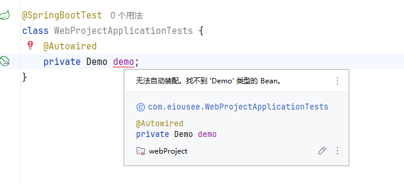

根本原因是`SpringBoot`项目默认的组件扫描路径是启动类所在包及其子包，而第三方依赖位于其他包中，因此无法找到指定的`Bean`。可以通过为启动类添加`@ComponentScan`注解来指定扫描范围，但是一旦添加该注解，默认的路径就会被覆盖，需要手动添加上启动类所在包

```java
package com.eiousee;

import org.springframework.beans.factory.annotation.Autowired;
import org.springframework.boot.SpringApplication;
import org.springframework.boot.autoconfigure.SpringBootApplication;
import org.springframework.boot.web.servlet.ServletComponentScan;
import org.springframework.context.annotation.ComponentScan;
import util.eiousee.Demo;

@ComponentScan({"com.eiousee", "util.eiousee"})
@ServletComponentScan
@SpringBootApplication
public class WebProjectApplication {

    public static void main(String[] args) {
        SpringApplication.run(WebProjectApplication.class, args);
    }

    @Autowired
    private Demo demo;
}
```

**方案二**

`Spring`提供了`@Import`注解来快捷导入依赖，所有被注解`@Import`的类都会被加载到`IOC`容器中。另外，如果`@Import`导入的是一个拥有`@Configuration`注解的配置类，该配置类中所有的声明的`Bean`也都会被加载到`IOC`容器中

先创建几个`Demo`类，然后创建一个`DemoConfig`类，声明第三方`Bean`

```java
package util.eiousee;

import org.springframework.context.annotation.Bean;
import org.springframework.context.annotation.Configuration;

@Configuration
public class DemoConfig {
    @Bean
    public Demo1 demo() {
        return new Demo1();
    }

    @Bean
    public Demo2 demo2() {
        return new Demo2();
    }
}
```

接着在启动类中使用`@Import`导入

```java
package com.eiousee;

import org.springframework.beans.factory.annotation.Autowired;
import org.springframework.boot.SpringApplication;
import org.springframework.boot.autoconfigure.SpringBootApplication;
import org.springframework.boot.web.servlet.ServletComponentScan;
import org.springframework.context.annotation.ComponentScan;
import org.springframework.context.annotation.Import;
import util.eiousee.Demo;
import util.eiousee.Demo1;
import util.eiousee.Demo2;
import util.eiousee.DemoConfig;

@ServletComponentScan
@SpringBootApplication
@Import({Demo.class, DemoConfig.class})
public class WebProjectApplication {

    public static void main(String[] args) {
        SpringApplication.run(WebProjectApplication.class, args);
    }

    @Autowired
    private Demo demo;

    @Autowired
    private Demo1 demo1;

    @Autowired
    private Demo2 demo2;
}
```

此外，`@Import`还可以导入`ImportSelector`的实现类，编写一个`ImportSelector`的实现类，然后使用`@Import`导入，就可以实现批量导入

```java
package util.eiousee;

import org.springframework.context.annotation.ImportSelector;
import org.springframework.core.type.AnnotationMetadata;

public class DemoSelector implements ImportSelector {
    @Override
    public String[] selectImports(AnnotationMetadata importingClassMetadata) {
        return new String[] {"util.eiousee.Demo", "util.eiousee.DemoConfig"};
    }
}
```

*注：从上方的代码中也可以看出，在`ImportSelector`的是实现类中同样可以使用`@Configuration`配置类。不过需要注意，`Intellij IDEA`无法解析`ImportSelector`，因此会导致误报错*

从上文中可以看出，无论哪种方案，开发人员都必须清晰地知道每个依赖对应的包名，但这些包名恰好是第三方依赖地开发人员最清楚。因此，一般的第三方依赖会提供一个`Enable`注解类，来标明自己的依赖中需要导入哪些包。而`SpringBoot`项目开发人员只需要使用`@Enable`注解就可以快捷导入依赖包

```java
package util.eiousee;

import org.springframework.context.annotation.Import;

import java.lang.annotation.ElementType;
import java.lang.annotation.Retention;
import java.lang.annotation.RetentionPolicy;
import java.lang.annotation.Target;

@Target(ElementType.TYPE)
@Retention(RetentionPolicy.RUNTIME)
@Import(DemoSelector.class)
public @interface EnableDemo {
}
```

#### 源码追踪

我们深挖`SpringBoot`源码，分析`SpringBoot`是如何实现自动配置的

`SpringBoot`项目都是由启动类`@SpringBootApplication`启动的，因此，我们从`@SpringBootApplication`注解的源码入手

```java
package com.eiousee;

import org.springframework.boot.SpringApplication;
import org.springframework.boot.autoconfigure.SpringBootApplication;
import org.springframework.boot.web.servlet.ServletComponentScan;

@ServletComponentScan
@SpringBootApplication
public class WebProjectApplication {
    public static void main(String[] args) {
        SpringApplication.run(WebProjectApplication.class, args);
    }
}
```

在`SpringBootApplication`源码中，上方的四个注解都属于元注解，分别是

- `@Target`：设置注解的应用范围，`ElementType.TYPE`表示只能注解在类或接口上
- `@Retention`：设置注解的保留周期，`RetentionPolicy.RUNTIME`表示在程序运行时仍保留
- `@Inherited`：表示该类的所有注解可被继承
- `@Documented`：表示注解能够出现在`JavaDoc`文档中

```java
@Target(ElementType.TYPE)
@Retention(RetentionPolicy.RUNTIME)
@Documented
@Inherited
@SpringBootConfiguration
@EnableAutoConfiguration
@ComponentScan(excludeFilters = { @Filter(type = FilterType.CUSTOM, classes = TypeExcludeFilter.class),
       @Filter(type = FilterType.CUSTOM, classes = AutoConfigurationExcludeFilter.class) })
public @interface SpringBootApplication {}
```

下方的三个注解中，`@SpringBootConfiguration`注解中包含`@Configuration`注解，因此在启动类中可以声明第三方`Bean`。而`@ComponentScan`是`Bean`扫描注解，表示默认的扫描范围。

最后一个`@EnableAutoConfiguration`则正是自动配置的注解

```
@Target(ElementType.TYPE)
@Retention(RetentionPolicy.RUNTIME)
@Documented
@Inherited
@AutoConfigurationPackage
@Import(AutoConfigurationImportSelector.class)
public @interface EnableAutoConfiguration {}
```

可以看到，在`@EnableAutoConfiguration`注解中，使用了`@Import`注解，并指定导入的类是`AutoConfigurationImportSelector.class`

```java
public class AutoConfigurationImportSelector implements DeferredImportSelector, BeanClassLoaderAware,
       ResourceLoaderAware, BeanFactoryAware, EnvironmentAware, Ordered {}
```

而`AutoConfigurationImportSelector`又实现了`DeferredImportSelector`

```java
public interface DeferredImportSelector extends ImportSelector {}
```

可以看到，`DeferredImportSelector`继承了`ImportSelector`，而`ImportSelector`的作用方式是重写`selectImports`方法，因此只要在`AutoConfigurationImportSelector`类中找到`selectImports`，就能够确定`Spring`底层的自动配置原理

```java
@Override
public String[] selectImports(AnnotationMetadata annotationMetadata) {
    if (!isEnabled(annotationMetadata)) {
       return NO_IMPORTS;
    }
    AutoConfigurationEntry autoConfigurationEntry = getAutoConfigurationEntry(annotationMetadata);
    return StringUtils.toStringArray(autoConfigurationEntry.getConfigurations());
}
```

可以看到，在`selectImports`中调用`getAutoConfigurationEntry`方法获取了`AutoConfigurationEntry`类型的数据，然后再包装成`String`数据向上传递。所以进一步查看`getAutoConfigurationEntry`

```java
protected AutoConfigurationEntry getAutoConfigurationEntry(AnnotationMetadata annotationMetadata) {
	if (!isEnabled(annotationMetadata)) {
		return EMPTY_ENTRY;
	}
	AnnotationAttributes attributes = getAttributes(annotationMetadata);
	List<String> configurations = getCandidateConfigurations(annotationMetadata, attributes);
	configurations = removeDuplicates(configurations);
	Set<String> exclusions = getExclusions(annotationMetadata, attributes);
	checkExcludedClasses(configurations, exclusions);
	configurations.removeAll(exclusions);
	configurations = getConfigurationClassFilter().filter(configurations);
	fireAutoConfigurationImportEvents(configurations, exclusions);
	return new AutoConfigurationEntry(configurations, exclusions);
}
```

在`getAutoConfigurationEntry`中，`configurations`是所有配置类，`exclusions`是被排除的配置类，因此我们观察`configurations`的来源，也就是`getCandidateConfigurations`方法

```java
protected List<String> getCandidateConfigurations(AnnotationMetadata metadata, AnnotationAttributes attributes) {
    ImportCandidates importCandidates = ImportCandidates.load(this.autoConfigurationAnnotation,
          getBeanClassLoader());
    List<String> configurations = importCandidates.getCandidates();
    Assert.state(!CollectionUtils.isEmpty(configurations),
          "No auto configuration classes found in " + "META-INF/spring/"
                + this.autoConfigurationAnnotation.getName() + ".imports. If you "
                + "are using a custom packaging, make sure that file is correct.");
    return configurations;
}
```

`configurations`由`importCandidates`对象的`getCandidates`方法而来，而`getCandidates`方法实际返回的是`importCandidates`的一个属性，所以我们重点观察`importCandidates`的来源，即`ImportCandidates`的`load`方法

```java
public static ImportCandidates load(Class<?> annotation, ClassLoader classLoader) {
    Assert.notNull(annotation, "'annotation' must not be null");
    ClassLoader classLoaderToUse = decideClassloader(classLoader);
    String location = String.format(LOCATION, annotation.getName());
    Enumeration<URL> urls = findUrlsInClasspath(classLoaderToUse, location);
    List<String> importCandidates = new ArrayList<>();
    while (urls.hasMoreElements()) {
       URL url = urls.nextElement();
       importCandidates.addAll(readCandidateConfigurations(url));
    }
    return new ImportCandidates(importCandidates);
}
```

在`load`方法中，第一条`Assert.notNull(annotation, "'annotation' must not be null");`是防止传入的注解类型为空，第二条`ClassLoader classLoaderToUse = decideClassloader(classLoader);`也是防止传入的类加载器为空，因此我们从第三条开始。

`String location = String.format(LOCATION, annotation.getName());`将私有属性`LOCATION`的值与注解全限定名进行了拼接，观察`LOCATION`的定义

```java
private static final String LOCATION = "META-INF/spring/%s.imports";
```

可以看到，最后会拼接为形如`META-INF/spring/com.eiousee.AutoConfiguration.imports`这样的资源定位地址

然后使用`findUrlsInClasspath`方法在对应的类路径中查找所有匹配的资源，并返回一个`Enumeration`类型。`Enumeration`是迭代器`Iterator`的前身，相较于`Iterator`只有遍历功能，没有删除元素的功能。

接着新建了返回用的`ArrayList`数组，用于存储结果，随即开始遍历`urls`中匹配到的所有`url`，最后将所有结果返回。

现在来看，`Spring`底层的自动配置原理已经非常清晰了，底层通过查询每个依赖`jar`包中的`AutoConfiguration.imports`文件，从中读取所有的自动配置类，然后逐级向上传递，同时删除不必要的配置类，最后导入所有的`Bean`，进行创建并导入`IOC`容器中

我们来查看`MyBatis`的`AutoConfiguration.imports`文件

> 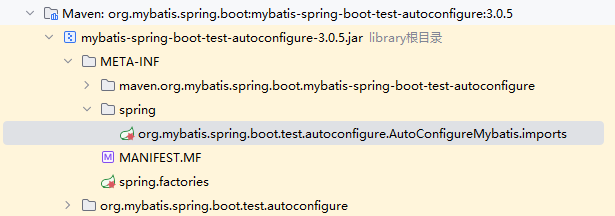

```imports
# AutoConfigureMybatis auto-configuration imports
org.springframework.boot.autoconfigure.flyway.FlywayAutoConfiguration
org.springframework.boot.autoconfigure.jdbc.DataSourceAutoConfiguration
org.springframework.boot.autoconfigure.jdbc.DataSourceTransactionManagerAutoConfiguration
org.springframework.boot.autoconfigure.jdbc.JdbcTemplateAutoConfiguration
org.springframework.boot.autoconfigure.liquibase.LiquibaseAutoConfiguration
org.springframework.boot.autoconfigure.transaction.TransactionAutoConfiguration
org.springframework.boot.autoconfigure.sql.init.SqlInitializationAutoConfiguration
org.mybatis.spring.boot.autoconfigure.MybatisLanguageDriverAutoConfiguration
org.mybatis.spring.boot.autoconfigure.MybatisAutoConfiguration
```

声明了很多自动配置类，我们打开其中的`MybatisAutoConfiguration`自动配置类进行查看

> 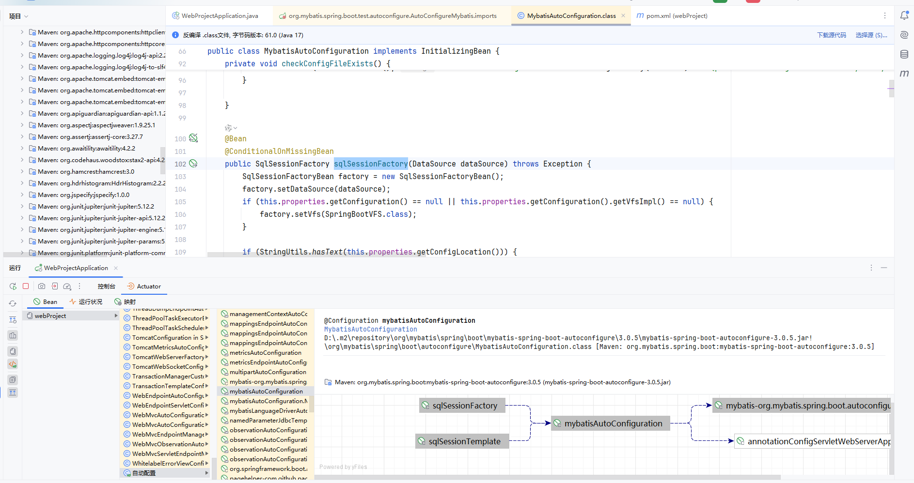

可以看到，里面声明了一个`Bean`名为`sqlSessionFactory`，而在项目运行中，自动配置里也存在对应的自动配置类`Bean` `mybatisAutoConfiguration`，在右侧的结构图中也出现了定义的第三方`Bean`，名为`sqlSessionFactory`

所以，实际演示也证明了我们的逻辑是正确的，这就是`Spring`底层实现自动配置的基本原理

#### @Conditional注解

`@Conditional`注解会按照相应的条件进行判断，满足条件的类或方法才能被注册为`Bean`，然后交予`IOC`容器中

`@Conditional`注解是一个父注解，派生了很多子注解，以下列举一部分

| 注解                        | 判定条件                      |
| --------------------------- | ----------------------------- |
| `@ConditionalOnClass`       | 存在对应的字节码文件          |
| `@ConditionalOnMissingBean` | 容器中不存在指定的`Bean`      |
| `@ConditionalOnProperty`    | 配置文件中属性有特定值        |
| `@ConditionalOnBean`        | 容器中存在指定的`Bean`        |
| `@ConditionalOnExpression`  | 给定的 `SpEL` 表达式为 `true` |

其中常见的有`@ConditionalOnClass`、`@ConditionalOnMissingBean`、`@ConditionalOnProperty`

**示例**

`@ConditionalOnClass`

```java
package org.springframework.boot.autoconfigure.condition;

import java.lang.annotation.Documented;
import java.lang.annotation.ElementType;
import java.lang.annotation.Retention;
import java.lang.annotation.RetentionPolicy;
import java.lang.annotation.Target;
import org.springframework.context.annotation.Conditional;

@Target({ElementType.TYPE, ElementType.METHOD})
@Retention(RetentionPolicy.RUNTIME)
@Documented
@Conditional({OnClassCondition.class})
public @interface ConditionalOnClass {
    Class<?>[] value() default {};

    String[] name() default {};
}
```

`@ConditionalOnClass`拥有两个字段可以指定需要的类文件，分别是`Class<?>[] value`和`String[] name`，`value`字段在编译时生效，只要任何指定类不存在，则编译中判断无法通过；`name`字段则在运行时生效，一般使用全限定名

`@ConditionalOnMissingBean`

```java
package org.springframework.boot.autoconfigure.condition;

import java.lang.annotation.Annotation;
import java.lang.annotation.Documented;
import java.lang.annotation.ElementType;
import java.lang.annotation.Retention;
import java.lang.annotation.RetentionPolicy;
import java.lang.annotation.Target;
import org.springframework.context.annotation.Conditional;

@Target({ElementType.TYPE, ElementType.METHOD})
@Retention(RetentionPolicy.RUNTIME)
@Documented
@Conditional({OnBeanCondition.class})
public @interface ConditionalOnMissingBean {
    Class<?>[] value() default {};

    String[] type() default {};

    Class<?>[] ignored() default {};

    String[] ignoredType() default {};

    Class<? extends Annotation>[] annotation() default {};

    String[] name() default {};

    SearchStrategy search() default SearchStrategy.ALL;

    Class<?>[] parameterizedContainer() default {};
}
```

`value`和`type`可以指定缺少的`Bean`的类型，根据数据类型就可以看出，`value`接收`Class`类型，而`type`接收字符串类型，因此一般使用`value`，防止拼写错误。`ignored`和`ignoredType`与上文类似，可以排除指定类的子类，例如`value = DataSource.class`，可以排除其子类`ignored = HikariDataSource.class`。这里需要注意，只要是指定类的之类，无论是通过继承`extends`还是实现`implements`得到的，如有必要，都需要进行排除。`annotation`用于指定`Bean`上是否存在对应的注解，例如`annotation = org.apache.ibatis.annotations.Mapper`，则表示如果对应`Bean`上没有`@Mapper`注解，则创建这个`Bean`。`name`指定`Bean`名称，与`value`类似，但是不常用，避免拼写错误。`search`指定搜索策略，值为`SearchStrategy`枚举类，其中的`ALL`表示整个上下文，`CURRENT`表示当前上下文，`ANCESTORS`表示只搜索祖先上下文。`parameterizedContainer`指定泛型类型，例如存在一个泛型`Bean`，`GenericService<T>`，而指定`parameterizedContainer = String.class`，则表示匹配`GenericService<String>`，忽略其他类型如`GenericService<Integer>`、`GenericService<Double>`等等

`@ConditionalOnProperty`

```java
//
// Source code recreated from a .class file by IntelliJ IDEA
// (powered by FernFlower decompiler)
//

package org.springframework.boot.autoconfigure.condition;

import java.lang.annotation.Documented;
import java.lang.annotation.ElementType;
import java.lang.annotation.Repeatable;
import java.lang.annotation.Retention;
import java.lang.annotation.RetentionPolicy;
import java.lang.annotation.Target;
import org.springframework.context.annotation.Conditional;

@Retention(RetentionPolicy.RUNTIME)
@Target({ElementType.TYPE, ElementType.METHOD})
@Documented
@Conditional({OnPropertyCondition.class})
@Repeatable(ConditionalOnProperties.class)
public @interface ConditionalOnProperty {
    String[] value() default {};

    String prefix() default "";

    String[] name() default {};

    String havingValue() default "";

    boolean matchIfMissing() default false;
}
```

`value`是完整键名，如`vlue = {"app.feature.enabled"}`，`prefix`单独指键前缀，`name`单独指键名，如`prefix = "app.feature", name = "enabled"`，`havingValue`则是需要匹配的键值，`matchIfMissing `是匹配方式，值为布尔值，`true`表示属性缺失时，条件成立，`false`则相反

#### 自定义starter

在实际开发过程中，经常会使用或定义一些公共组件，提供给各个项目团队使用。而在`Spring`项目中，一般都会将这些公共组件封装为`SpringBoot`的`starter`，包含起步依赖以及相关的自动配置等

我们自定义一个阿里云`OSS`操作类的`starter`，以便在其他项目中直接引入`AliyunOSS2Operator`作为`Bean`，不需要再进行相关配置

首先我们定义`starter`模块，创建一个新模块，不需要任何源代码，只作为依赖管理，因此只保留`pom.xml`

> 

在`pom.xml`中，删除一切不必要的配置，仅保留最基础的配置，然后引入依赖`aliyun-oss2-spring-boot-autoconfigure`

```xml
<?xml version="1.0" encoding="UTF-8"?>
<project xmlns="http://maven.apache.org/POM/4.0.0" xmlns:xsi="http://www.w3.org/2001/XMLSchema-instance"
    xsi:schemaLocation="http://maven.apache.org/POM/4.0.0 https://maven.apache.org/xsd/maven-4.0.0.xsd">
    <modelVersion>4.0.0</modelVersion>
    <parent>
       <groupId>org.springframework.boot</groupId>
       <artifactId>spring-boot-starter-parent</artifactId>
       <version>3.5.14</version>
       <relativePath/> <!-- lookup parent from repository -->
    </parent>
    <groupId>com.eiousee.oss</groupId>
    <artifactId>aliyun-oss2-spring-boot-starter</artifactId>
    <version>0.0.1-SNAPSHOT</version>
    <name>aliyun-oss2-spring-boot-starter</name>
    <description>aliyun-oss2-spring-boot-starter</description>
    <url/>
    <properties>
       <java.version>21</java.version>
    </properties>
    <dependencies>
       <dependency>
          <groupId>org.springframework.boot</groupId>
          <artifactId>spring-boot-starter</artifactId>
       </dependency>
       <dependency>
          <groupId>com.eiousee.oss</groupId>
          <artifactId>aliyun-oss2-spring-boot-autoconfigure</artifactId>
          <version>0.0.1-SNAPSHOT</version>
       </dependency>
    </dependencies>
</project>
```

然后创建自动配置模块`aliyun-oss2-spring-boot-autoconfigure`，将阿里云`OSS`操作类的代码放入其中，并创建`META-INF`目录及其子目录`spring`，创建`org.springframework.boot.autoconfigure.AutoConfiguration.imports`文件

> 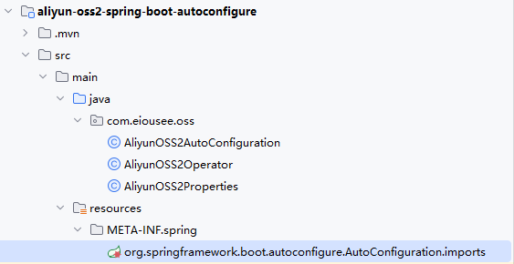

在`pom.xml`中引入阿里云的依赖

```xml
<?xml version="1.0" encoding="UTF-8"?>
<project xmlns="http://maven.apache.org/POM/4.0.0" xmlns:xsi="http://www.w3.org/2001/XMLSchema-instance"
         xsi:schemaLocation="http://maven.apache.org/POM/4.0.0 https://maven.apache.org/xsd/maven-4.0.0.xsd">
    <modelVersion>4.0.0</modelVersion>
    <parent>
        <groupId>org.springframework.boot</groupId>
        <artifactId>spring-boot-starter-parent</artifactId>
        <version>3.5.14</version>
        <relativePath/> <!-- lookup parent from repository -->
    </parent>
    <groupId>com.eiousee.oss</groupId>
    <artifactId>aliyun-oss2-spring-boot-autoconfigure</artifactId>
    <version>0.0.1-SNAPSHOT</version>
    <name>aliyun-oss2-spring-boot-autoconfigure</name>
    <description>aliyun-oss2-spring-boot-autoconfigure</description>
    <url/>
    <properties>
        <java.version>21</java.version>
    </properties>
    <dependencies>
        <dependency>
            <groupId>org.springframework.boot</groupId>
            <artifactId>spring-boot-starter</artifactId>
        </dependency>
        <!--        阿里云OSS-->
        <dependency>
            <groupId>com.aliyun</groupId>
            <artifactId>alibabacloud-oss-v2</artifactId>
            <version>0.3.2</version>
        </dependency>
    </dependencies>
</project>
```

然后在`AliyunOSS2AutoConfiguration`中声明两个必要的`Bean`

```java
package com.eiousee.oss;

import org.springframework.boot.autoconfigure.condition.ConditionalOnMissingBean;
import org.springframework.context.annotation.Bean;
import org.springframework.context.annotation.Configuration;

@Configuration
public class AliyunOSS2AutoConfiguration {

    @Bean
    @ConditionalOnMissingBean
    public AliyunOSS2Operator aliyunOSS2Operator(AliyunOSS2Properties aliyunOSS2Properties) {
        return new AliyunOSS2Operator(aliyunOSS2Properties);
    }

    @Bean
    @ConditionalOnMissingBean
    public AliyunOSS2Properties aliyunOSS2Properties() {
        return new AliyunOSS2Properties();
    }
}
```

确保`org.springframework.boot.autoconfigure.AutoConfiguration.imports`文件中有需要注册的自动配置类名

```imports
com.eiousee.oss.AliyunOSS2AutoConfiguration
```

最后在`web`项目中导入

```xml
<!--        阿里云OSS2-->
<dependency>
    <groupId>com.eiousee.oss</groupId>
    <artifactId>aliyun-oss2-spring-boot-starter</artifactId>
    <version>0.0.1-SNAPSHOT</version>
</dependency>
```

## Maven Advance

### 分模块设计与开发

分模块设计是将一个大项目拆分为若干个子模块，方便项目的管理维护、扩展，也方便模块间的相互引用，资源共享

分模块设计一般有三种拆分策略

- `功能拆分`：按照业务逻辑功能进行拆分，例如公共组件模块、商品模块、搜索模块、订单模块等
- `层级拆分`：按业务逻辑层进行拆分，例如实体类、控制层、业务层、数据访问层等
- `功能层级拆分`：同时按照功能与层级拆分，例如商品模块实体类、商品模块控制层、订单模块实体类等

### 继承

在分模块设计中，假设项目被分为了几十个模块，而每个模块都需要使用某个依赖，则需要在每个模块的`pom.xml`中都编写一份依赖，而且一旦依赖版本需要更换，将会非常麻烦

因此`Maven`提供了继承，通过子工程可以使用`<parent>`标签来继承一个父工程，所有依赖如果不指定，都会继承父工程的版本。`Maven`不支持多继承，但是可以多重继承，`Son`可以继承`Father`，`Father`可以继承`GrandFather`，从而让`Son`简介继承`GrandFather`

**示例**

创建一个父工程，设置打包方式为`pom`

```xml
<groupId>com.eiousee</groupId>
<artifactId>webProject-parent</artifactId>
<version>0.0.1-SNAPSHOT</version>
<packaging>pom</packaging>
```

在子工程中使用`<parent>`标签继承父工程

```xml
<parent>
    <groupId>com.eiousee</groupId>
    <artifactId>webProject</artifactId>
    <version>0.0.1-SNAPSHOT</version>
    <relativePath></relativePath>
</parent>
```

这样，只需要在父工程的`<dependencies>`中编写公共依赖，所有的子工程就能直接继承

### 版本锁定

如果在多个子工程，但并非全部子工程中都使用了同一个依赖，如果把该依赖加入父工程中，会导致其他不需要的工程产生额外开销，但如果不加入，子工程较多时，版本管理又比较麻烦。因此`Maven`提供了`<dependencyManagement>`标签来管理子工程依赖版本，这被称为版本锁定。只有子工程使用了此依赖，且未指定版本，版本锁定才会生效，如果子工程没有使用依赖，则不会继承

**示例**

父工程中，为`Lombok`设置了版本锁定

```xml
<dependencyManagement>
	<dependencies>
    	<dependency>
            <groupId>org.projectlombok</groupId>
            <artifactId>lombok</artifactId>
            <version>1.18.42</version>
        </dependency>
    </dependencies>
</dependencyManagement>
```

在子工程中，就不要额外指定版本

```xml
<dependency>
    <groupId>org.projectlombok</groupId>
    <artifactId>lombok</artifactId>
    <optional>true</optional>
</dependency>
```

如果父工程中存在大量的依赖标签，在更改依赖版本时，寻找依赖标签就成了一个问题，不过`Maven`也提供了`<properties>`标签，来让开发人员可以自定义属性，在每次更改值的时候，只需要更改自定义属性的值就行了

定义属性

```xml
<properties>
	<lombok.version>1.18.42</lombok.version>
    <mysql.ver>8.0.33</mysql.ver>
</properties>
```

使用属性

```xml
<dependency>
    <groupId>org.projectlombok</groupId>
    <artifactId>lombok</artifactId>
    <version>${lombok.version}</version>
</dependency>
<dependency>
    <groupId>mysql</groupId>
    <artifactId>mysql-connector-java</artifactId>
    <version>${mysql.ver}</version>
</dependency>
```

### 聚合

在进行项目打包时，如果将项目拆分为了多个模块，默认情况下，是不能完成打包的，因为`Maven`会在仓库中尝试寻找所依赖的模块，但是本地仓库和远程仓库均不存在这样的模块。但是也可以通过将每个模块安装到本地仓库，然后再进行打包，不过这种方式非常繁琐，模块结构越复杂，打包花费的时间就越多。因此我们可以利用`Maven`聚合

在`Maven`中，聚合工程是一个有且仅有一个`pom`文件的空工程，一般来说，我们会将父工程同时作为聚合工程，在聚合工程的`pom.xml`文件中，使用`<modules>`标签来指定需要聚合的子模块，注意需要指定子模块的路径而不是名称

**示例**

```xml
<modules>
	<module>../webProject-order</module>
    <module>../webProject-list</module>
    <module>../webProject-pay</module>
</modules>
```

### 私服

假设公司里程序员甲开发了一套实用的工具包，程序员乙也想使用甲开发的工具包，除开直接传输文件的情况，甲与乙是无法共享资源的，`Maven`的默认仓库中仅有本地仓库与远程中央仓库。但是，`Maven`也提供了私服，每个公司可以搭建自己的`Maven`私服供内部程序员使用

我们使用`Sonatype Nexus`来搭建一个私服，下载`Nexus`，然后执行`nexus.exe /run`

> 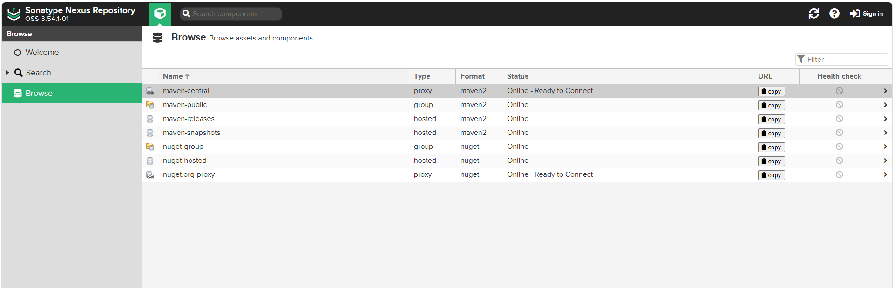

默认用户名`admin`，密码在`nexus\sonatype-work\nexus3\admin.password`中

> 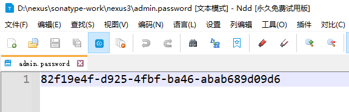

然后系统提示更改密码，我们改为`admin`，更改完成后，私服就搭建好了，我们现在对`Intellij IDEA`与`Maven`进行配置

首先在`settings.xml`中配置私服的账号密码

```xml
<servers>
	<server>
        <id>maven-release</id>
        <username>admin</username>
        <passowrd>admin</passowrd>
    </server>
    <server>
        <id>maven-snapshots</id>
        <username>admin</username>
        <passowrd>admin</passowrd>
    </server>
</servers>
```

接着配置私服地址

```xml
<mirrors>
	<mirror>
      <id>maven-public</id>
      <mirrorOf>*</mirrorOf>
      <url>http://localhost:8081/repository/maven-public</url>
    </mirror>
</mirrors>
```

设置允许`snapshots`仓库

```XML
<profiles> 
	<profile>
        <id>allow-snapshots</id>
        <activation>
            <activeByDefault>true</activeByDefault>
        </activation>
        <repositories>
            <repository>
                <id>maven-public</id>
                <url>http://localhost:8081/repository/maven-public/</url>
                <releases>
                    <enabled>true</enabled>
                </releases>
                <snapshots>
                    <enabled>true</enabled>
                </snapshots>
            </repository>
        </repositories>
    </profile>
</profiles>   
```

最后在`pom.xml`中设置私服地址

```XML
<distributionManagement>
    <!-- release版本的发布地址 -->
    <repository>
        <id>maven-releases</id>
        <url>http://localhost:8081/repository/maven-releases/</url>
    </repository>
    <!-- snapshot版本的发布地址 -->
    <snapshotRepository>
        <id>maven-snapshots</id>
        <url>http://localhost:8081/repository/maven-snapshots/</url>
    </snapshotRepository>
</distributionManagement>
```

我们在`IDEA`中使用`deploy`

> 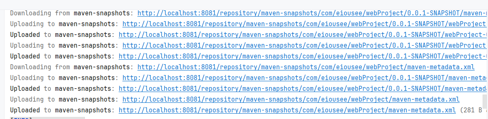

在`nexus`中也能看到上传的`jar`包

> 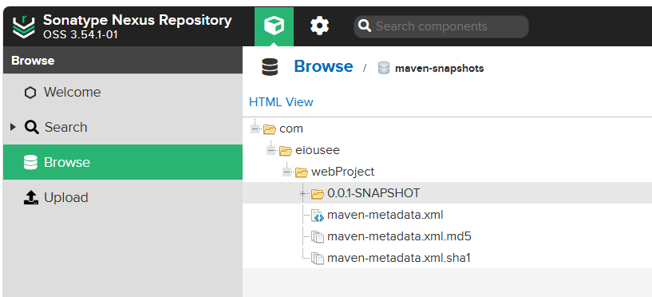
