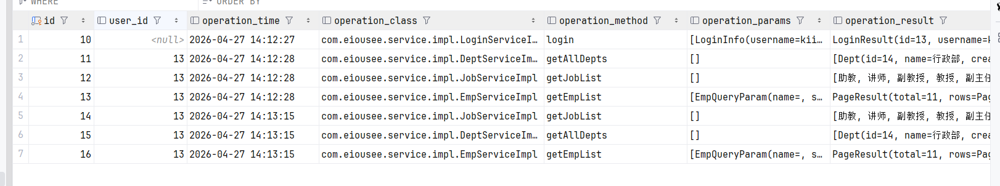
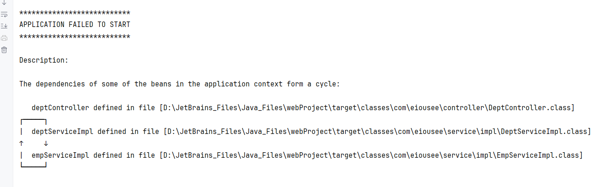
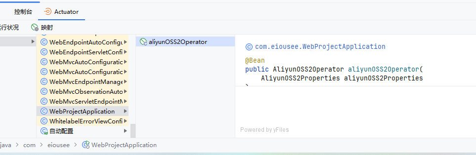
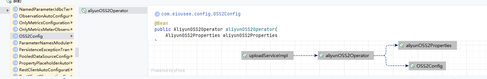

# Java Web Medium

`更新时间：2026-4-25`

注释解释：

- `<>`必填项，必须在当前位置填写相应数据

- `{}`必选项，必须在当前位置选择一个给出的选项

- `[]`可选项，可以选择填写或忽略

*注：该笔记内的可选项和参数均不完整，如有需要，请查询相关手册*

---

## AOP

`AOP`全称`Aspect Oriented Programming`，面向切面编程，是`OOP`面向对象编程的进阶思想。简单来说，就是面向特定方法编程，例如某些业务方法的运行速度较慢，需要定位执行耗时较长的方法，因此首先就需要统计每一个业务方法的耗时。`AOP`可以减少重复代码，对原来的代码没有任何侵入，可以提高开发效率，并且便于维护，任何更改都在单独的`AOP`中进行

### 快速入门

统计所有`Service`业务层方法的耗时

1. 引入`Spring AOP`依赖

```xml
<!--       Spring AOP-->
<dependency>
    <groupId>org.springframework.boot</groupId>
    <artifactId>spring-boot-starter-aop</artifactId>
    <version>3.5.13</version>
</dependency>
```

2. 编写`AOP`类，添加`@Aspect`和`@Component`注解，注册为`Bean`，然后编写`AOP`方法，在方法上使用注解`@Around`来指定需要切入的方法

```java
package com.eiousee.aspect;

import lombok.extern.slf4j.Slf4j;
import org.aspectj.lang.ProceedingJoinPoint;
import org.aspectj.lang.annotation.Around;
import org.aspectj.lang.annotation.Aspect;
import org.springframework.stereotype.Component;

@Aspect
@Slf4j
@Component
public class RecordTimeAspect {

    @Around("execution(* com.eiousee.service.impl.*.*(..))")
    public Object recordTime(ProceedingJoinPoint joinPoint) throws Throwable {
        long start = System.currentTimeMillis();
        Object result = joinPoint.proceed();
        long end = System.currentTimeMillis();
        log.info("方法 {} 耗时：{}ms", joinPoint.getSignature(), end - start);

        return result;
    }
}
```

> 

### 核心概念

**连接点**

`JoinPoint`，连接点，是指可以被`AOP`控制的方法，也包括方法执行时的相关信息

**通知**

`Advice`，通知，指可以重复的逻辑，即共性功能，比如在上文中编写的统计执行时间的方法

**切入点**

`PointCut`，所有满足切入点规则的连接点才能被`AOP`控制

**切面**

`Aspect`，描述通知与切入点的对应关系，简单来说，即是通过通知与切入点的约束，可以完整地描述哪些类、哪些方法需要执行哪些额外操作

**目标对象**

`Target`，通知所应用的对象

`SpringAOP`底层基于动态代理技术，实际是创建了一个切入类的代理类，然后交予`IOC`管理，在执行匹配方法时，调用代理类的对应方法，也就是通知方法

### AOP进阶

#### 通知类型

`SpringAOP`提供了多种通知类型注解，用于标注不同的通知方法

| 注解              | 备注                                                         |
| ----------------- | ------------------------------------------------------------ |
| `@Around`         | 环绕通知，通知方法在切入方法前后都被执行                     |
| `@Before`         | 前置通知，通知方法在切入方法前被执行                         |
| `@After`          | 后置通知，通知方法在切入方法后被执行                         |
| `@AfterReturning` | 后置通知，通知方法在切入方法后被执行，但切入方法不能抛出异常 |
| `@AfterThrowing`  | 异常后置通知，通知方法在切入方法抛出异常后被执行             |

*注：环绕通知方法需要手动调用`ProceedingJoinPoint`参数的`proceed()`方法来调用匹配方法，并且环绕通知方法返回值类型必须为`Object`*

#### 公共切入点表达式

在编写`Aspect`类时，如果每个方法都需要编写切入点表达式会非常麻烦，因此`SpringAOP`提供了`@PointCut`注解来记录切入点表达式

**标准语法**

```java
public class SomeAspect {
    @Pointcut("execution(* com.eiousee.service.impl.*.*(..))")
    public void pointcut() {}
    
    @Around("pointcut()")
    public Object recordTime(ProceedingJoinPoint joinPoint) throws Throwable {}
    
    @Before("pointcut()")
    public void before() {}
}
```

#### 通知顺序

默认情况下，在不同的切面类中，按照类名首字母顺序排序，如果不希望使用默认排序，`SpringAOP`也提供了`@Order()`注解来进行排序，括号内数字越小，次序越靠前

**示例**

```java
@Aspect
@Component
@Order(1)
public class FirstAspect {}

@Aspect
@Component
@Order(2)
public class SecondAspect {}
```

#### 切入点表达式

切入点表达式是描述切入点方法的表达式，用来决定项目中哪些方法需要加入通知，即用切入点表达式来匹配连接点，被匹配的连接点即为切入点

常见的切入点表达式类型有`execution()`和`@annotation`

- `execution()`：根据方法签名匹配
- `@annotation`：根据注解匹配

**execution**

**标准语法**

```java
execution([Accessbility] ReturnedValueType [PackageName.ClassName.]MethodName(ParamType) [throws ExceptionName])
```

切入点表达式中也可以使用通配符

- `*`：一级通配符，可以匹配一级任意字段，如包名、类名、方法名等

**示例**

```java
execution(* com.eiousee.*.get*(*))
```

表示匹配任意返回值，位于`com.eiousee`包下的所有类中，任何方法签名前缀为`get`，只有一个参数的方法，注意这里无法匹配`com.eiousee`子包中的类，例如`com.eiousee.controller.DeptController`，因为星号只能作为一级匹配

- `..`：多级匹配，可以匹配多个层级或数量

**示例**

```java
execution(* com.eiousee..*.get*(..))
```

表示匹配任意返回值，位于`com.eiousee`包及其所有子包类中，任何方法签名前缀为`get`，且参数数量任意的方法

`execution`也可以使用逻辑运算符，例如想要匹配特定的两个方法

```java
execution(* com.eiousee.controller.DeptController.list(..)) || execution(* com.eiousee.controller.DeptController.delete(..))
```

**@annotation**

**标准语法**

```java
@annotaion(AnnotationPackageName)
```

**示例**

匹配所有使用`@Eiousee`注解的类

```java
@annotation(com.eiousee.annotation.Eiousee)
```

#### 连接点

在`SpringAOP`中使用`JoinPoint`抽象了连接点，用它可以获得方法执行时的相关信息，比如目标类名、方法名、方法参数等等，对于环绕通知，只能使用`ProceedingJoinPoint`，其他四种通知类型只能使用`JoinPoint`

**常用API**

| 方法名           | 返回值类型 | 说明                                                         |
| ---------------- | ---------- | ------------------------------------------------------------ |
| `getTarget()`    | Object     | 获取匹配对象                                                 |
| `getClass()`     | Class      | 获取匹配类                                                   |
| `getSignature()` | Signature  | 获取匹配方法签名                                             |
| `getName()`      | String     | 获取对应的字符串名称，如`getTarget().getName()`、`getSignature().getName()` |
| `getArgs()`      | Object[]   | 获取匹配方法的参数列表                                       |

### 案例-日志记录功能

为学习管理项目增加一个日志记录功能，每条日志数据需要保存在数据库中

首先定义一个数据表来存储日志

```sql
CREATE TABLE IF NOT EXISTS `operation_log` (
    id INT AUTO_INCREMENT PRIMARY KEY COMMENT '编号',
    user_id INT COMMENT '员工编号',
    operation_time DATETIME COMMENT '操作时间',
    operation_class VARCHAR(255) COMMENT '操作类名',
    operation_method VARCHAR(255) COMMENT '操作方法名',
    operation_params TEXT COMMENT '操作参数',
    operation_result TEXT COMMENT '操作结果',
    cost_time BIGINT COMMENT '操作耗时'
);
```

然后定义一个操作日志实体类

```java
package com.eiousee.pojo;

import lombok.AllArgsConstructor;
import lombok.Data;
import lombok.NoArgsConstructor;

import java.time.LocalDateTime;

@Data
@AllArgsConstructor
@NoArgsConstructor
public class OperationLog {
    private Integer id;
    private LocalDateTime operationTime;
    private String operationClass;
    private String operationMethod;
    private String operationParams;
    private String operationResult;
    private Long costTime;
}
```

再编写一个切面类，切入点为所有`Service`类及其实现类，在通知方法中定义记录日志的逻辑，通知类型为环绕通知

```java
package com.eiousee.aop;

import com.eiousee.mapper.LogMapper;
import com.eiousee.pojo.OperationLog;
import lombok.extern.slf4j.Slf4j;
import org.aspectj.lang.ProceedingJoinPoint;
import org.aspectj.lang.annotation.Around;
import org.aspectj.lang.annotation.Aspect;
import org.aspectj.lang.annotation.Pointcut;
import org.springframework.stereotype.Component;

import java.time.LocalDateTime;
import java.util.Arrays;

@Aspect
@Component
@Slf4j
public class LogAspect {

    private final LogMapper logMapper;

    public LogAspect(LogMapper logMapper) {
        this.logMapper = logMapper;
    }

    @Pointcut("execution(* com.eiousee.service..*(..))")
    public void log() {}

    @Around("log()")
    public Object recordLog(ProceedingJoinPoint joinPoint) throws Throwable {
        long startTime = System.currentTimeMillis();
        Object result = joinPoint.proceed();
        long endTime = System.currentTimeMillis();

        OperationLog operationLog = new OperationLog();
        operationLog.setOperationTime(LocalDateTime.now());
        operationLog.setOperationClass(joinPoint.getTarget().getClass().getName());
        operationLog.setOperationMethod(joinPoint.getSignature().getName());
        operationLog.setOperationParams(Arrays.toString(joinPoint.getArgs()));
        operationLog.setOperationResult(result.toString());
        operationLog.setCostTime(endTime - startTime);
        log.info("操作日志：{}", operationLog);
        logMapper.addLog(operationLog);

        return result;
    }
}
```

最后实现日志记录的`Mapper`

```xml
<insert id="addLog">
    INSERT INTO
        operation_log(user_id, operation_time, operation_class, operation_method, operation_params, operation_result, cost_time)
    VALUES (
               #{id},
               #{operationTime},
               #{operationClass},
               #{operationMethod},
               #{operationParams},
               #{operationResult},
               #{costTime}
           )
</insert>
```

### ThreadLocal

`ThreadLocal`并不是一个`Thread`，而是一个`Thread`的局部变量，每个线程会提供一份单独的存储空间，具有线程隔离的效果，不同的线程之间不会相互干扰，这份存储空间就是`ThreadLocal`

**常用API**

| API                        | 说明                               |
| -------------------------- | ---------------------------------- |
| `public void set(T value)` | 设置当前线程的线程局部变量值       |
| `public T get()`           | 返回当前线程所对应的线程局部变量值 |
| `public void remove()`     | 移除当前线程的线程局部变量         |

#### 获取当前员工登录id

首先定义一个工具类操作`ThreadLocal`

```java
package com.eiousee.utils;

public class CurrentOperator {

    private final static ThreadLocal<Integer> CURRENT_OPERATOR = new ThreadLocal<>();

    public static void setCurrentOperator(Integer operatorId) {
        CURRENT_OPERATOR.set(operatorId);
    }

    public static Integer getCurrentOperator() {
        return CURRENT_OPERATOR.get();
    }

    public static void clear() {
        CURRENT_OPERATOR.remove();
    }
}
```

然后启用`Interceptor`，在`Interceptor`中解析请求的`token`，获取其中的`id`值，并在请求结束时删除。注意`Claims`类中提供了一个方法`getId()`，但我们实际使用的是`get("id")`

```java
package com.eiousee.interceptor;

import com.eiousee.utils.CurrentOperator;
import com.eiousee.utils.JwtUtils;
import io.jsonwebtoken.Claims;
import jakarta.servlet.http.HttpServletRequest;
import jakarta.servlet.http.HttpServletResponse;
import lombok.extern.slf4j.Slf4j;
import org.springframework.stereotype.Component;
import org.springframework.web.servlet.HandlerInterceptor;
import org.springframework.web.servlet.ModelAndView;

@Slf4j
@Component
public class AuthInterceptor implements HandlerInterceptor {
    @Override
    public boolean preHandle(HttpServletRequest request, HttpServletResponse response, Object handler) {
        log.info("请求开始：{}", request.getRequestURI());

        String token = request.getHeader("token");
        if (token == null || token.isEmpty()) {
            log.info("未找到Token");
            response.setStatus(HttpServletResponse.SC_UNAUTHORIZED);
            return false;
        }
        try {
            // 验证Token
            Claims claims = JwtUtils.parseJwt(token);
            CurrentOperator.setCurrentOperator(Integer.valueOf(claims.get("id").toString()));
        } catch (Exception e) {
            log.info("Token验证失败");
            response.setStatus(HttpServletResponse.SC_UNAUTHORIZED);
            return false;
        }
        return true;
    }

    @Override
    public void postHandle(HttpServletRequest request, HttpServletResponse response, Object handler, ModelAndView modelAndView) throws Exception {
        CurrentOperator.clear();
    }
}
```

最后在切面类中获取`ThreadLocal`中的数据，写入数据库中

```java
package com.eiousee.aop;

import com.eiousee.mapper.LogMapper;
import com.eiousee.pojo.OperationLog;
import com.eiousee.utils.CurrentOperator;
import lombok.extern.slf4j.Slf4j;
import org.aspectj.lang.ProceedingJoinPoint;
import org.aspectj.lang.annotation.Around;
import org.aspectj.lang.annotation.Aspect;
import org.aspectj.lang.annotation.Pointcut;
import org.springframework.stereotype.Component;

import java.time.LocalDateTime;
import java.util.Arrays;

@Aspect
@Component
@Slf4j
public class LogAspect {

    private final LogMapper logMapper;

    public LogAspect(LogMapper logMapper) {
        this.logMapper = logMapper;
    }

    @Pointcut("execution(* com.eiousee.service..*(..))")
    public void log() {}

    @Around("log()")
    public Object recordLog(ProceedingJoinPoint joinPoint) throws Throwable {
        long startTime = System.currentTimeMillis();
        Object result = joinPoint.proceed();
        long endTime = System.currentTimeMillis();

        OperationLog operationLog = new OperationLog();
        operationLog.setId(CurrentOperator.getCurrentOperator());
        operationLog.setOperationTime(LocalDateTime.now());
        operationLog.setOperationClass(joinPoint.getTarget().getClass().getName());
        operationLog.setOperationMethod(joinPoint.getSignature().getName());
        operationLog.setOperationParams(Arrays.toString(joinPoint.getArgs()));
        operationLog.setOperationResult(result.toString());
        operationLog.setCostTime(endTime - startTime);
        log.info("操作日志：{}", operationLog);
        logMapper.addLog(operationLog);

        return result;
    }
}
```

> 

### 案例-日志记录管理

根据接口文档，编写一个日志记录管理页面，使用分页查询

首先在实体类中添加一个显示用户名的字段，方便在前端直接显示操作人，而不是操作人`id`

```java
package com.eiousee.pojo;

import lombok.AllArgsConstructor;
import lombok.Data;
import lombok.NoArgsConstructor;

import java.time.LocalDateTime;

@Data
@AllArgsConstructor
@NoArgsConstructor
public class OperationLog {
    private Integer id;
    private String operator;
    private LocalDateTime operationTime;
    private String operationClass;
    private String operationMethod;
    private String operationParams;
    private String operationResult;
    private Long costTime;
}
```

然后定义`Controller` ，接收两个分页查询的参数

```java
@GetMapping
public Result getLogs(Integer page, Integer pageSize) {
    log.info("获取日志列表");
    return Result.success(logService.getLogs(page, pageSize));
}
```

定义`Service`，实现分页查询逻辑

```java
@Override
public PageResult<OperationLog> getLogs(Integer pageNum, Integer pageSize) {
    pageNum = pageNum == null ? 1 : pageNum;
    pageSize = pageSize == null ? 10 : pageSize;

    Page<OperationLog> page = PageHelper.startPage(pageNum, pageSize);
    logMapper.getLogs();
    return new PageResult<>(page.getTotal(), page.getResult());
}
```

然后编写`sql`语句

```xml
<select id="getLogs" resultType="com.eiousee.pojo.OperationLog">
    SELECT
        username AS operator,
        operation_time AS operationTime,
        operation_class AS operationClass,
        operation_method AS operationMethod,
        operation_params AS operationParams,
        operation_result AS operationResult,
        cost_time AS costTime
    FROM
        operation_log
    LEFT JOIN jdbc.users u on u.id = operation_log.user_id
</select>
```

最后更改日志记录的切入点表达式，排除日志查询类，防止数据爆炸

```java
@Pointcut("execution(* com.eiousee.service..*(..))" +
        "&& !within(com.eiousee.service.impl.LogServiceImpl)")
public void log() {}
```

## Spring配置

### 配置优先级

在`Spring`中，支持三种配置文件格式，分别是`properties`、`yml`和`yaml`，但本质上`yml`是`yaml`的缩写

如果三份配置文件同时存在，优先级从高到低为`properties`、`yml`、`yaml`

此外，`Spring`还支持命令行参数和`JVM`虚拟机参数形式的配置

命令行参数：`--server.port=8080`

`JVM`虚拟机参数：`-Dserver.port=8080`

此时的配置优先级从高到低分别为：`命令行参数`、`JVM虚拟机参数`、`properties`、`yml`、`yaml`

### Bean管理

在`Spring`中，`Bean`支持五种作用域

| 作用域        | 说明                                 |
| ------------- | ------------------------------------ |
| `singleton`   | 容器内同名称的`bean`只能存在一个实例 |
| `prototype`   | 每次使用`bean`时创建新的实例         |
| `request`     | 每个请求范围内会创建新的实例         |
| `session`     | 每个会话范围内会创建新的实例         |
| `application` | 每个应用范围内会创建新的实例         |

`Bean`的作用域可以通过`@Scope`注解来声明，注解标注在对应的`Bean`类上

对于作用域为`singleton`的`Bean`，在`Spring`项目启动时会直接创建对应的实例，项目启动完成后，直接放入`IOC`容器中进行管理。而`Spring`中也提供了`@Lazy`注解来延迟创建`Bean`，将`Bean`的创建时间更改为第一次使用时才创建，因此`@Lazy`可以解决循环依赖的问题

#### 循环依赖

如果`Spring`项目中出现一个`Bean`需要注入另一个`Bean`，而另一个`Bean`也需要注入这一个`Bean`的情况，就被称为循环依赖，默认情况下，如果存在循环依赖，`Spring`会在启动时直接报错

> 

循环依赖出现的原因是，`Spring`默认在项目启动时就创建所有的`Bean`实例，但是在创建实例`A`时，需要注入实例`B`，此时实例`B`并没有创建完成；同样地，在创建实例`B`时，实例`A`也并没有创建完成，导致双方都在等待对方创建完成，而形成的死锁状态。

此时在某一方的注入点增加`@Lazy`注解，项目启动，创建`Bean`实例时，没有注解的一方就能直接获得一个对方的代理实例，从而完成创建过程。而添加注解的一方在第一次被调用时，对方的`Bean`实例已经创建完成，只需要将对方正常注入即可完成创建。

#### 线程安全性

对于作用域是`singleton`，即无状态的`Bean`，因为其中不保存任何数据，因此可以认为是线程安全的，但是如果是有状态的单例`Bean`，多线程同时操作时，则可能会存在线程安全问题；而对于作用域是`prototype`的`Bean`，每个请求都是一个新的`Bean`实例，不存在多线程操作，所以可以认为是线程安全的

#### 第三方Bean

如果需要管理第三方提供的`Bean`实例，但又不能更改第三方的源代码，就可以使用`@Bean`注解来注册一个`Bean`，在启动类`@SpringBootApplication`中定义相关的方法。如果第三方`Bean`需要注入其他`Bean`，在方法参数列表中添加即可，第三方`Bean`的默认名称为启动类中的方法名，而不是首字母小写的类名

现在我们将之前定义的阿里云`OSS`上传类视为第三方类，删除其`@Component`注解，表示不允许更改源码

```java
package com.eiousee.utils;

import com.aliyun.sdk.service.oss2.OSSClient;
import com.aliyun.sdk.service.oss2.OSSClientBuilder;
import com.aliyun.sdk.service.oss2.credentials.CredentialsProvider;
import com.aliyun.sdk.service.oss2.credentials.EnvironmentVariableCredentialsProvider;
import com.aliyun.sdk.service.oss2.models.*;
import com.aliyun.sdk.service.oss2.transport.BinaryData;
import com.eiousee.pojo.AliyunOSS2Properties;
import org.springframework.beans.factory.annotation.Value;
import org.springframework.stereotype.Component;

public class AliyunOSS2Operator {

    private final AliyunOSS2Properties aliyunOSS2Properties;

    public AliyunOSS2Operator(AliyunOSS2Properties aliyunOSS2Properties) {
        this.aliyunOSS2Properties = aliyunOSS2Properties;
    }

    public String putObject(String fileName, byte[] data) {

        String region = aliyunOSS2Properties.getRegion();
        String bucket = aliyunOSS2Properties.getBucket();

        CredentialsProvider provider = new EnvironmentVariableCredentialsProvider();
        OSSClientBuilder clientBuilder = OSSClient.newBuilder()
                .credentialsProvider(provider)
                .region(region);

        try (OSSClient client = clientBuilder.build()) {
            PutObjectResult result = client.putObject(PutObjectRequest.newBuilder()
                            .bucket(bucket)
                            .key(fileName)
                            .body(BinaryData.fromBytes(data))
                    .build());

            System.out.printf("status code:%d, request id:%s, eTag:%s\n",
                    result.statusCode(), result.requestId(), result.eTag());

        } catch (Exception e) {
            System.out.printf("error:\n%s", e);
            return null;
        }
        return "https://" + bucket + ".oss-cn-beijing.aliyuncs.com/" + fileName;
    }
}
```

然后在启动类中注册`Bean`，并指定主要注入的其他`Bean`

```java
package com.eiousee;

import com.eiousee.pojo.AliyunOSS2Properties;
import com.eiousee.utils.AliyunOSS2Operator;
import org.springframework.boot.SpringApplication;
import org.springframework.boot.autoconfigure.SpringBootApplication;
import org.springframework.boot.web.servlet.ServletComponentScan;
import org.springframework.context.annotation.Bean;

@ServletComponentScan
@SpringBootApplication
public class WebProjectApplication {

    public static void main(String[] args) {
        SpringApplication.run(WebProjectApplication.class, args);
    }

    @Bean
    public AliyunOSS2Operator aliyunOSS2Operator(AliyunOSS2Properties aliyunOSS2Properties) {
        return new AliyunOSS2Operator(aliyunOSS2Properties);
    }
}
```

> 

但在实际业务中，必须要保证启动类的职责单一，不应该出现其他内容，因此可以单独定义一个配置类，使用`@Configuration`注解，单独定义第三方`Bean`对象

```java
package com.eiousee.config;

import com.eiousee.pojo.AliyunOSS2Properties;
import com.eiousee.utils.AliyunOSS2Operator;
import org.springframework.context.annotation.Bean;
import org.springframework.context.annotation.Configuration;

@Configuration
public class OSS2Config {
    @Bean
    public AliyunOSS2Operator aliyunOSS2Operator(AliyunOSS2Properties aliyunOSS2Properties) {
        return new AliyunOSS2Operator(aliyunOSS2Properties);
    }
}
```

> 
