# Java Web Medium

`更新时间：2026-5-13`

注释解释：

- `<>`必填项，必须在当前位置填写相应数据

- `{}`必选项，必须在当前位置选择一个给出的选项

- `[]`可选项，可以选择填写或忽略

*注：该笔记内的可选项和参数均不完整，如有需要，请查询相关手册*

---

## AOP

`AOP`全称`Aspect Oriented Programming`，面向切面编程，是`OOP`面向对象编程的进阶思想。简单来说，就是面向特定方法编程，例如某些业务方法的运行速度较慢，需要定位执行耗时较长的方法，因此首先就需要统计每一个业务方法的耗时。`AOP`可以减少重复代码，对原来的代码没有任何侵入，可以提高开发效率，并且便于维护，任何更改都在单独的`AOP`中进行

### 快速入门

统计所有`Service`业务层方法的耗时

1. 引入`Spring AOP`依赖

```xml
<!--       Spring AOP-->
<dependency>
    <groupId>org.springframework.boot</groupId>
    <artifactId>spring-boot-starter-aop</artifactId>
    <version>3.5.13</version>
</dependency>
```

2. 编写`AOP`类，添加`@Aspect`和`@Component`注解，注册为`Bean`，然后编写`AOP`方法，在方法上使用注解`@Around`来指定需要切入的方法

```java
package com.eiousee.aspect;

import lombok.extern.slf4j.Slf4j;
import org.aspectj.lang.ProceedingJoinPoint;
import org.aspectj.lang.annotation.Around;
import org.aspectj.lang.annotation.Aspect;
import org.springframework.stereotype.Component;

@Aspect
@Slf4j
@Component
public class RecordTimeAspect {

    @Around("execution(* com.eiousee.service.impl.*.*(..))")
    public Object recordTime(ProceedingJoinPoint joinPoint) throws Throwable {
        long start = System.currentTimeMillis();
        Object result = joinPoint.proceed();
        long end = System.currentTimeMillis();
        log.info("方法 {} 耗时：{}ms", joinPoint.getSignature(), end - start);

        return result;
    }
}
```

> 

### 核心概念

**连接点**

`JoinPoint`，连接点，是指可以被`AOP`控制的方法，也包括方法执行时的相关信息

**通知**

`Advice`，通知，指可以重复的逻辑，即共性功能，比如在上文中编写的统计执行时间的方法

**切入点**

`PointCut`，所有满足切入点规则的连接点才能被`AOP`控制

**切面**

`Aspect`，描述通知与切入点的对应关系，简单来说，即是通过通知与切入点的约束，可以完整地描述哪些类、哪些方法需要执行哪些额外操作

**目标对象**

`Target`，通知所应用的对象

`SpringAOP`底层基于动态代理技术，实际是创建了一个切入类的代理类，然后交予`IOC`管理，在执行匹配方法时，调用代理类的对应方法，也就是通知方法

### AOP进阶

#### 通知类型

`SpringAOP`提供了多种通知类型注解，用于标注不同的通知方法

| 注解              | 备注                                                         |
| ----------------- | ------------------------------------------------------------ |
| `@Around`         | 环绕通知，通知方法在切入方法前后都被执行                     |
| `@Before`         | 前置通知，通知方法在切入方法前被执行                         |
| `@After`          | 后置通知，通知方法在切入方法后被执行                         |
| `@AfterReturning` | 后置通知，通知方法在切入方法后被执行，但切入方法不能抛出异常 |
| `@AfterThrowing`  | 异常后置通知，通知方法在切入方法抛出异常后被执行             |

*注：环绕通知方法需要手动调用`ProceedingJoinPoint`参数的`proceed()`方法来调用匹配方法，并且环绕通知方法返回值类型必须为`Object`*

#### 公共切入点表达式

在编写`Aspect`类时，如果每个方法都需要编写切入点表达式会非常麻烦，因此`SpringAOP`提供了`@PointCut`注解来记录切入点表达式

**标准语法**

```java
public class SomeAspect {
    @Pointcut("execution(* com.eiousee.service.impl.*.*(..))")
    public void pointcut() {}
    
    @Around("pointcut()")
    public Object recordTime(ProceedingJoinPoint joinPoint) throws Throwable {}
    
    @Before("pointcut()")
    public void before() {}
}
```

#### 通知顺序

默认情况下，在不同的切面类中，按照类名首字母顺序排序，如果不希望使用默认排序，`SpringAOP`也提供了`@Order()`注解来进行排序，括号内数字越小，次序越靠前

**示例**

```java
@Aspect
@Component
@Order(1)
public class FirstAspect {}

@Aspect
@Component
@Order(2)
public class SecondAspect {}
```

#### 切入点表达式

切入点表达式是描述切入点方法的表达式，用来决定项目中哪些方法需要加入通知，即用切入点表达式来匹配连接点，被匹配的连接点即为切入点

常见的切入点表达式类型有`execution()`和`@annotation`

- `execution()`：根据方法签名匹配
- `@annotation`：根据注解匹配

**execution**

**标准语法**

```java
execution([Accessbility] ReturnedValueType [PackageName.ClassName.]MethodName(ParamType) [throws ExceptionName])
```

切入点表达式中也可以使用通配符

- `*`：一级通配符，可以匹配一级任意字段，如包名、类名、方法名等

**示例**

```java
execution(* com.eiousee.*.get*(*))
```

表示匹配任意返回值，位于`com.eiousee`包下的所有类中，任何方法签名前缀为`get`，只有一个参数的方法，注意这里无法匹配`com.eiousee`子包中的类，例如`com.eiousee.controller.DeptController`，因为星号只能作为一级匹配

- `..`：多级匹配，可以匹配多个层级或数量

**示例**

```java
execution(* com.eiousee..*.get*(..))
```

表示匹配任意返回值，位于`com.eiousee`包及其所有子包类中，任何方法签名前缀为`get`，且参数数量任意的方法

`execution`也可以使用逻辑运算符，例如想要匹配特定的两个方法

```java
execution(* com.eiousee.controller.DeptController.list(..)) || execution(* com.eiousee.controller.DeptController.delete(..))
```

**@annotation**

**标准语法**

```java
@annotaion(AnnotationPackageName)
```

**示例**

匹配所有使用`@Eiousee`注解的类

```java
@annotation(com.eiousee.annotation.Eiousee)
```

#### 连接点

在`SpringAOP`中使用`JoinPoint`抽象了连接点，用它可以获得方法执行时的相关信息，比如目标类名、方法名、方法参数等等，对于环绕通知，只能使用`ProceedingJoinPoint`，其他四种通知类型只能使用`JoinPoint`

**常用API**

| 方法名           | 返回值类型 | 说明                                                         |
| ---------------- | ---------- | ------------------------------------------------------------ |
| `getTarget()`    | Object     | 获取匹配对象                                                 |
| `getClass()`     | Class      | 获取匹配类                                                   |
| `getSignature()` | Signature  | 获取匹配方法签名                                             |
| `getName()`      | String     | 获取对应的字符串名称，如`getTarget().getName()`、`getSignature().getName()` |
| `getArgs()`      | Object[]   | 获取匹配方法的参数列表                                       |

### 案例-日志记录功能

为学习管理项目增加一个日志记录功能，每条日志数据需要保存在数据库中

首先定义一个数据表来存储日志

```sql
CREATE TABLE IF NOT EXISTS `operation_log` (
    id INT AUTO_INCREMENT PRIMARY KEY COMMENT '编号',
    user_id INT COMMENT '员工编号',
    operation_time DATETIME COMMENT '操作时间',
    operation_class VARCHAR(255) COMMENT '操作类名',
    operation_method VARCHAR(255) COMMENT '操作方法名',
    operation_params TEXT COMMENT '操作参数',
    operation_result TEXT COMMENT '操作结果',
    cost_time BIGINT COMMENT '操作耗时'
);
```

然后定义一个操作日志实体类

```java
package com.eiousee.pojo;

import lombok.AllArgsConstructor;
import lombok.Data;
import lombok.NoArgsConstructor;

import java.time.LocalDateTime;

@Data
@AllArgsConstructor
@NoArgsConstructor
public class OperationLog {
    private Integer id;
    private LocalDateTime operationTime;
    private String operationClass;
    private String operationMethod;
    private String operationParams;
    private String operationResult;
    private Long costTime;
}
```

再编写一个切面类，切入点为所有`Service`类及其实现类，在通知方法中定义记录日志的逻辑，通知类型为环绕通知

```java
package com.eiousee.aop;

import com.eiousee.mapper.LogMapper;
import com.eiousee.pojo.OperationLog;
import lombok.extern.slf4j.Slf4j;
import org.aspectj.lang.ProceedingJoinPoint;
import org.aspectj.lang.annotation.Around;
import org.aspectj.lang.annotation.Aspect;
import org.aspectj.lang.annotation.Pointcut;
import org.springframework.stereotype.Component;

import java.time.LocalDateTime;
import java.util.Arrays;

@Aspect
@Component
@Slf4j
public class LogAspect {

    private final LogMapper logMapper;

    public LogAspect(LogMapper logMapper) {
        this.logMapper = logMapper;
    }

    @Pointcut("execution(* com.eiousee.service..*(..))")
    public void log() {}

    @Around("log()")
    public Object recordLog(ProceedingJoinPoint joinPoint) throws Throwable {
        long startTime = System.currentTimeMillis();
        Object result = joinPoint.proceed();
        long endTime = System.currentTimeMillis();

        OperationLog operationLog = new OperationLog();
        operationLog.setOperationTime(LocalDateTime.now());
        operationLog.setOperationClass(joinPoint.getTarget().getClass().getName());
        operationLog.setOperationMethod(joinPoint.getSignature().getName());
        operationLog.setOperationParams(Arrays.toString(joinPoint.getArgs()));
        operationLog.setOperationResult(result.toString());
        operationLog.setCostTime(endTime - startTime);
        log.info("操作日志：{}", operationLog);
        logMapper.addLog(operationLog);

        return result;
    }
}
```

最后实现日志记录的`Mapper`

```xml
<insert id="addLog">
    INSERT INTO
        operation_log(user_id, operation_time, operation_class, operation_method, operation_params, operation_result, cost_time)
    VALUES (
               #{id},
               #{operationTime},
               #{operationClass},
               #{operationMethod},
               #{operationParams},
               #{operationResult},
               #{costTime}
           )
</insert>
```

### ThreadLocal

`ThreadLocal`并不是一个`Thread`，而是一个`Thread`的局部变量，每个线程会提供一份单独的存储空间，具有线程隔离的效果，不同的线程之间不会相互干扰，这份存储空间就是`ThreadLocal`

**常用API**

| API                        | 说明                               |
| -------------------------- | ---------------------------------- |
| `public void set(T value)` | 设置当前线程的线程局部变量值       |
| `public T get()`           | 返回当前线程所对应的线程局部变量值 |
| `public void remove()`     | 移除当前线程的线程局部变量         |

#### 获取当前员工登录id

首先定义一个工具类操作`ThreadLocal`

```java
package com.eiousee.utils;

public class CurrentOperator {

    private final static ThreadLocal<Integer> CURRENT_OPERATOR = new ThreadLocal<>();

    public static void setCurrentOperator(Integer operatorId) {
        CURRENT_OPERATOR.set(operatorId);
    }

    public static Integer getCurrentOperator() {
        return CURRENT_OPERATOR.get();
    }

    public static void clear() {
        CURRENT_OPERATOR.remove();
    }
}
```

然后启用`Interceptor`，在`Interceptor`中解析请求的`token`，获取其中的`id`值，并在请求结束时删除。注意`Claims`类中提供了一个方法`getId()`，但我们实际使用的是`get("id")`

```java
package com.eiousee.interceptor;

import com.eiousee.utils.CurrentOperator;
import com.eiousee.utils.JwtUtils;
import io.jsonwebtoken.Claims;
import jakarta.servlet.http.HttpServletRequest;
import jakarta.servlet.http.HttpServletResponse;
import lombok.extern.slf4j.Slf4j;
import org.springframework.stereotype.Component;
import org.springframework.web.servlet.HandlerInterceptor;
import org.springframework.web.servlet.ModelAndView;

@Slf4j
@Component
public class AuthInterceptor implements HandlerInterceptor {
    @Override
    public boolean preHandle(HttpServletRequest request, HttpServletResponse response, Object handler) {
        log.info("请求开始：{}", request.getRequestURI());

        String token = request.getHeader("token");
        if (token == null || token.isEmpty()) {
            log.info("未找到Token");
            response.setStatus(HttpServletResponse.SC_UNAUTHORIZED);
            return false;
        }
        try {
            // 验证Token
            Claims claims = JwtUtils.parseJwt(token);
            CurrentOperator.setCurrentOperator(Integer.valueOf(claims.get("id").toString()));
        } catch (Exception e) {
            log.info("Token验证失败");
            response.setStatus(HttpServletResponse.SC_UNAUTHORIZED);
            return false;
        }
        return true;
    }

    @Override
    public void postHandle(HttpServletRequest request, HttpServletResponse response, Object handler, ModelAndView modelAndView) throws Exception {
        CurrentOperator.clear();
    }
}
```

最后在切面类中获取`ThreadLocal`中的数据，写入数据库中

```java
package com.eiousee.aop;

import com.eiousee.mapper.LogMapper;
import com.eiousee.pojo.OperationLog;
import com.eiousee.utils.CurrentOperator;
import lombok.extern.slf4j.Slf4j;
import org.aspectj.lang.ProceedingJoinPoint;
import org.aspectj.lang.annotation.Around;
import org.aspectj.lang.annotation.Aspect;
import org.aspectj.lang.annotation.Pointcut;
import org.springframework.stereotype.Component;

import java.time.LocalDateTime;
import java.util.Arrays;

@Aspect
@Component
@Slf4j
public class LogAspect {

    private final LogMapper logMapper;

    public LogAspect(LogMapper logMapper) {
        this.logMapper = logMapper;
    }

    @Pointcut("execution(* com.eiousee.service..*(..))")
    public void log() {}

    @Around("log()")
    public Object recordLog(ProceedingJoinPoint joinPoint) throws Throwable {
        long startTime = System.currentTimeMillis();
        Object result = joinPoint.proceed();
        long endTime = System.currentTimeMillis();

        OperationLog operationLog = new OperationLog();
        operationLog.setId(CurrentOperator.getCurrentOperator());
        operationLog.setOperationTime(LocalDateTime.now());
        operationLog.setOperationClass(joinPoint.getTarget().getClass().getName());
        operationLog.setOperationMethod(joinPoint.getSignature().getName());
        operationLog.setOperationParams(Arrays.toString(joinPoint.getArgs()));
        operationLog.setOperationResult(result.toString());
        operationLog.setCostTime(endTime - startTime);
        log.info("操作日志：{}", operationLog);
        logMapper.addLog(operationLog);

        return result;
    }
}
```

> 

### 案例-日志记录管理

根据接口文档，编写一个日志记录管理页面，使用分页查询

首先在实体类中添加一个显示用户名的字段，方便在前端直接显示操作人，而不是操作人`id`

```java
package com.eiousee.pojo;

import lombok.AllArgsConstructor;
import lombok.Data;
import lombok.NoArgsConstructor;

import java.time.LocalDateTime;

@Data
@AllArgsConstructor
@NoArgsConstructor
public class OperationLog {
    private Integer id;
    private String operator;
    private LocalDateTime operationTime;
    private String operationClass;
    private String operationMethod;
    private String operationParams;
    private String operationResult;
    private Long costTime;
}
```

然后定义`Controller` ，接收两个分页查询的参数

```java
@GetMapping
public Result getLogs(Integer page, Integer pageSize) {
    log.info("获取日志列表");
    return Result.success(logService.getLogs(page, pageSize));
}
```

定义`Service`，实现分页查询逻辑

```java
@Override
public PageResult<OperationLog> getLogs(Integer pageNum, Integer pageSize) {
    pageNum = pageNum == null ? 1 : pageNum;
    pageSize = pageSize == null ? 10 : pageSize;

    Page<OperationLog> page = PageHelper.startPage(pageNum, pageSize);
    logMapper.getLogs();
    return new PageResult<>(page.getTotal(), page.getResult());
}
```

然后编写`sql`语句

```xml
<select id="getLogs" resultType="com.eiousee.pojo.OperationLog">
    SELECT
        username AS operator,
        operation_time AS operationTime,
        operation_class AS operationClass,
        operation_method AS operationMethod,
        operation_params AS operationParams,
        operation_result AS operationResult,
        cost_time AS costTime
    FROM
        operation_log
    LEFT JOIN jdbc.users u on u.id = operation_log.user_id
</select>
```

最后更改日志记录的切入点表达式，排除日志查询类，防止数据爆炸

```java
@Pointcut("execution(* com.eiousee.service..*(..))" +
        "&& !within(com.eiousee.service.impl.LogServiceImpl)")
public void log() {}
```

## Spring配置

### 配置优先级

在`Spring`中，支持三种配置文件格式，分别是`properties`、`yml`和`yaml`，但本质上`yml`是`yaml`的缩写

如果三份配置文件同时存在，优先级从高到低为`properties`、`yml`、`yaml`

此外，`Spring`还支持命令行参数和`JVM`虚拟机参数形式的配置

命令行参数：`--server.port=8080`

`JVM`虚拟机参数：`-Dserver.port=8080`

此时的配置优先级从高到低分别为：`命令行参数`、`JVM虚拟机参数`、`properties`、`yml`、`yaml`

### Bean管理

在`Spring`中，`Bean`支持五种作用域

| 作用域        | 说明                                 |
| ------------- | ------------------------------------ |
| `singleton`   | 容器内同名称的`bean`只能存在一个实例 |
| `prototype`   | 每次使用`bean`时创建新的实例         |
| `request`     | 每个请求范围内会创建新的实例         |
| `session`     | 每个会话范围内会创建新的实例         |
| `application` | 每个应用范围内会创建新的实例         |

`Bean`的作用域可以通过`@Scope`注解来声明，注解标注在对应的`Bean`类上

对于作用域为`singleton`的`Bean`，在`Spring`项目启动时会直接创建对应的实例，项目启动完成后，直接放入`IOC`容器中进行管理。而`Spring`中也提供了`@Lazy`注解来延迟创建`Bean`，将`Bean`的创建时间更改为第一次使用时才创建，因此`@Lazy`可以解决循环依赖的问题

#### 循环依赖

如果`Spring`项目中出现一个`Bean`需要注入另一个`Bean`，而另一个`Bean`也需要注入这一个`Bean`的情况，就被称为循环依赖，默认情况下，如果存在循环依赖，`Spring`会在启动时直接报错

> 

循环依赖出现的原因是，`Spring`默认在项目启动时就创建所有的`Bean`实例，但是在创建实例`A`时，需要注入实例`B`，此时实例`B`并没有创建完成；同样地，在创建实例`B`时，实例`A`也并没有创建完成，导致双方都在等待对方创建完成，而形成的死锁状态。

此时在某一方的注入点增加`@Lazy`注解，项目启动，创建`Bean`实例时，没有注解的一方就能直接获得一个对方的代理实例，从而完成创建过程。而添加注解的一方在第一次被调用时，对方的`Bean`实例已经创建完成，只需要将对方正常注入即可完成创建。

#### 线程安全性

对于作用域是`singleton`，即无状态的`Bean`，因为其中不保存任何数据，因此可以认为是线程安全的，但是如果是有状态的单例`Bean`，多线程同时操作时，则可能会存在线程安全问题；而对于作用域是`prototype`的`Bean`，每个请求都是一个新的`Bean`实例，不存在多线程操作，所以可以认为是线程安全的

#### 第三方Bean

如果需要管理第三方提供的`Bean`实例，但又不能更改第三方的源代码，就可以使用`@Bean`注解来注册一个`Bean`，在配置类`@Configuration`中定义相关的方法。如果第三方`Bean`需要注入其他`Bean`，在方法参数列表中添加即可，第三方`Bean`的默认名称为启动类中的方法名，而不是首字母小写的类名

现在我们将之前定义的阿里云`OSS`上传类视为第三方类，删除其`@Component`注解，表示不允许更改源码

```java
package com.eiousee.utils;

import com.aliyun.sdk.service.oss2.OSSClient;
import com.aliyun.sdk.service.oss2.OSSClientBuilder;
import com.aliyun.sdk.service.oss2.credentials.CredentialsProvider;
import com.aliyun.sdk.service.oss2.credentials.EnvironmentVariableCredentialsProvider;
import com.aliyun.sdk.service.oss2.models.*;
import com.aliyun.sdk.service.oss2.transport.BinaryData;
import com.eiousee.pojo.AliyunOSS2Properties;
import org.springframework.beans.factory.annotation.Value;
import org.springframework.stereotype.Component;

public class AliyunOSS2Operator {

    private final AliyunOSS2Properties aliyunOSS2Properties;

    public AliyunOSS2Operator(AliyunOSS2Properties aliyunOSS2Properties) {
        this.aliyunOSS2Properties = aliyunOSS2Properties;
    }

    public String putObject(String fileName, byte[] data) {

        String region = aliyunOSS2Properties.getRegion();
        String bucket = aliyunOSS2Properties.getBucket();

        CredentialsProvider provider = new EnvironmentVariableCredentialsProvider();
        OSSClientBuilder clientBuilder = OSSClient.newBuilder()
                .credentialsProvider(provider)
                .region(region);

        try (OSSClient client = clientBuilder.build()) {
            PutObjectResult result = client.putObject(PutObjectRequest.newBuilder()
                            .bucket(bucket)
                            .key(fileName)
                            .body(BinaryData.fromBytes(data))
                    .build());

            System.out.printf("status code:%d, request id:%s, eTag:%s\n",
                    result.statusCode(), result.requestId(), result.eTag());

        } catch (Exception e) {
            System.out.printf("error:\n%s", e);
            return null;
        }
        return "https://" + bucket + ".oss-cn-beijing.aliyuncs.com/" + fileName;
    }
}
```

然后在启动类中注册`Bean`，并指定主要注入的其他`Bean`

```java
package com.eiousee;

import com.eiousee.pojo.AliyunOSS2Properties;
import com.eiousee.utils.AliyunOSS2Operator;
import org.springframework.boot.SpringApplication;
import org.springframework.boot.autoconfigure.SpringBootApplication;
import org.springframework.boot.web.servlet.ServletComponentScan;
import org.springframework.context.annotation.Bean;

@ServletComponentScan
@SpringBootApplication
public class WebProjectApplication {

    public static void main(String[] args) {
        SpringApplication.run(WebProjectApplication.class, args);
    }

    @Bean
    public AliyunOSS2Operator aliyunOSS2Operator(AliyunOSS2Properties aliyunOSS2Properties) {
        return new AliyunOSS2Operator(aliyunOSS2Properties);
    }
}
```

> 

但在实际业务中，必须要保证启动类的职责单一，不应该出现其他内容，因此可以单独定义一个配置类，使用`@Configuration`注解，单独定义第三方`Bean`对象

```java
package com.eiousee.config;

import com.eiousee.pojo.AliyunOSS2Properties;
import com.eiousee.utils.AliyunOSS2Operator;
import org.springframework.context.annotation.Bean;
import org.springframework.context.annotation.Configuration;

@Configuration
public class OSS2Config {
    @Bean
    public AliyunOSS2Operator aliyunOSS2Operator(AliyunOSS2Properties aliyunOSS2Properties) {
        return new AliyunOSS2Operator(aliyunOSS2Properties);
    }
}
```

> 

## SpringBoot原理

### 起步依赖

在传统的`Spring`框架的项目中，配置和依赖管理非常麻烦，而`SpringBoot`提供了起步依赖，也就是形如`spring-boot-starter-web`、`mybatis-spring-boot-starter`这样拥有`starter`关键字的依赖项，`SpringBoot`的起步依赖实际上基于`maven`的依赖传递，通过起步依赖，`maven`会自动寻找起步依赖所需要的其他依赖，而不用开发人员自行配置

> 

### 自动配置

自动配置是指当`Spring`项目启动后，一些配置类、`Bean`实例会自动存入`IOC`容器中，不需要手动声明，从而简化开发，省去繁琐的配置操作

举个例子，我们在引入阿里云`OSS`依赖的时候，自动引入了`JackSon`依赖

> 

而在测试类中，我们注入这个依赖的`Bean`，也并没有任何报错，说明这个`Bean`存储在`IOC`容器中

> 

我们并没有在项目中为其单独配置第三方`Bean`，源代码中也并没有`@Component`这样的注解，所以这里的自动注入就是由`SpringBoot`的自动配置实现的

#### 实现

我们定义一个额外的包`util.eiousee`，模拟一个第三方依赖，来实现自动配置的功能

> 

然后在`Spring`项目中引入这个依赖

```xml
<!--        demo-->
        <dependency>
            <groupId>util.eiousee</groupId>
            <artifactId>demo</artifactId>
            <version>1.0-SNAPSHOT</version>
        </dependency>
```

**方案一**

如果在`Demo`类中直接添加`@Component`注解，无法实现自动配置的功能

> 

根本原因是`SpringBoot`项目默认的组件扫描路径是启动类所在包及其子包，而第三方依赖位于其他包中，因此无法找到指定的`Bean`。可以通过为启动类添加`@ComponentScan`注解来指定扫描范围，但是一旦添加该注解，默认的路径就会被覆盖，需要手动添加上启动类所在包

```java
package com.eiousee;

import org.springframework.beans.factory.annotation.Autowired;
import org.springframework.boot.SpringApplication;
import org.springframework.boot.autoconfigure.SpringBootApplication;
import org.springframework.boot.web.servlet.ServletComponentScan;
import org.springframework.context.annotation.ComponentScan;
import util.eiousee.Demo;

@ComponentScan({"com.eiousee", "util.eiousee"})
@ServletComponentScan
@SpringBootApplication
public class WebProjectApplication {

    public static void main(String[] args) {
        SpringApplication.run(WebProjectApplication.class, args);
    }

    @Autowired
    private Demo demo;
}
```

**方案二**

`Spring`提供了`@Import`注解来快捷导入依赖，所有被注解`@Import`的类都会被加载到`IOC`容器中。另外，如果`@Import`导入的是一个拥有`@Configuration`注解的配置类，该配置类中所有的声明的`Bean`也都会被加载到`IOC`容器中

先创建几个`Demo`类，然后创建一个`DemoConfig`类，声明第三方`Bean`

```java
package util.eiousee;

import org.springframework.context.annotation.Bean;
import org.springframework.context.annotation.Configuration;

@Configuration
public class DemoConfig {
    @Bean
    public Demo1 demo() {
        return new Demo1();
    }

    @Bean
    public Demo2 demo2() {
        return new Demo2();
    }
}
```

接着在启动类中使用`@Import`导入

```java
package com.eiousee;

import org.springframework.beans.factory.annotation.Autowired;
import org.springframework.boot.SpringApplication;
import org.springframework.boot.autoconfigure.SpringBootApplication;
import org.springframework.boot.web.servlet.ServletComponentScan;
import org.springframework.context.annotation.ComponentScan;
import org.springframework.context.annotation.Import;
import util.eiousee.Demo;
import util.eiousee.Demo1;
import util.eiousee.Demo2;
import util.eiousee.DemoConfig;

@ServletComponentScan
@SpringBootApplication
@Import({Demo.class, DemoConfig.class})
public class WebProjectApplication {

    public static void main(String[] args) {
        SpringApplication.run(WebProjectApplication.class, args);
    }

    @Autowired
    private Demo demo;

    @Autowired
    private Demo1 demo1;

    @Autowired
    private Demo2 demo2;
}
```

此外，`@Import`还可以导入`ImportSelector`的实现类，编写一个`ImportSelector`的实现类，然后使用`@Import`导入，就可以实现批量导入

```java
package util.eiousee;

import org.springframework.context.annotation.ImportSelector;
import org.springframework.core.type.AnnotationMetadata;

public class DemoSelector implements ImportSelector {
    @Override
    public String[] selectImports(AnnotationMetadata importingClassMetadata) {
        return new String[] {"util.eiousee.Demo", "util.eiousee.DemoConfig"};
    }
}
```

*注：从上方的代码中也可以看出，在`ImportSelector`的实现类中同样可以使用`@Configuration`配置类。不过需要注意，`Intellij IDEA`无法解析`ImportSelector`，因此会导致误报错*

从上文中可以看出，无论哪种方案，开发人员都必须清晰地知道每个依赖对应的包名，但这些包名恰好是第三方依赖地开发人员最清楚。因此，一般的第三方依赖会提供一个`Enable`注解类，来标明自己的依赖中需要导入哪些包。而`SpringBoot`项目开发人员只需要使用`@Enable`注解就可以快捷导入依赖包

```java
package util.eiousee;

import org.springframework.context.annotation.Import;

import java.lang.annotation.ElementType;
import java.lang.annotation.Retention;
import java.lang.annotation.RetentionPolicy;
import java.lang.annotation.Target;

@Target(ElementType.TYPE)
@Retention(RetentionPolicy.RUNTIME)
@Import(DemoSelector.class)
public @interface EnableDemo {
}
```

#### 源码追踪

我们深挖`SpringBoot`源码，分析`SpringBoot`是如何实现自动配置的

`SpringBoot`项目都是由启动类`@SpringBootApplication`启动的，因此，我们从`@SpringBootApplication`注解的源码入手

```java
package com.eiousee;

import org.springframework.boot.SpringApplication;
import org.springframework.boot.autoconfigure.SpringBootApplication;
import org.springframework.boot.web.servlet.ServletComponentScan;

@ServletComponentScan
@SpringBootApplication
public class WebProjectApplication {
    public static void main(String[] args) {
        SpringApplication.run(WebProjectApplication.class, args);
    }
}
```

在`SpringBootApplication`源码中，上方的四个注解都属于元注解，分别是

- `@Target`：设置注解的应用范围，`ElementType.TYPE`表示只能注解在类或接口上
- `@Retention`：设置注解的保留周期，`RetentionPolicy.RUNTIME`表示在程序运行时仍保留
- `@Inherited`：表示该类的所有注解可被继承
- `@Documented`：表示注解能够出现在`JavaDoc`文档中

```java
@Target(ElementType.TYPE)
@Retention(RetentionPolicy.RUNTIME)
@Documented
@Inherited
@SpringBootConfiguration
@EnableAutoConfiguration
@ComponentScan(excludeFilters = { @Filter(type = FilterType.CUSTOM, classes = TypeExcludeFilter.class),
       @Filter(type = FilterType.CUSTOM, classes = AutoConfigurationExcludeFilter.class) })
public @interface SpringBootApplication {}
```

下方的三个注解中，`@SpringBootConfiguration`注解中包含`@Configuration`注解，因此在启动类中可以声明第三方`Bean`。而`@ComponentScan`是`Bean`扫描注解，表示默认的扫描范围。

最后一个`@EnableAutoConfiguration`则正是自动配置的注解

```
@Target(ElementType.TYPE)
@Retention(RetentionPolicy.RUNTIME)
@Documented
@Inherited
@AutoConfigurationPackage
@Import(AutoConfigurationImportSelector.class)
public @interface EnableAutoConfiguration {}
```

可以看到，在`@EnableAutoConfiguration`注解中，使用了`@Import`注解，并指定导入的类是`AutoConfigurationImportSelector.class`

```java
public class AutoConfigurationImportSelector implements DeferredImportSelector, BeanClassLoaderAware,
       ResourceLoaderAware, BeanFactoryAware, EnvironmentAware, Ordered {}
```

而`AutoConfigurationImportSelector`又实现了`DeferredImportSelector`

```java
public interface DeferredImportSelector extends ImportSelector {}
```

可以看到，`DeferredImportSelector`继承了`ImportSelector`，而`ImportSelector`的作用方式是重写`selectImports`方法，因此只要在`AutoConfigurationImportSelector`类中找到`selectImports`，就能够确定`Spring`底层的自动配置原理

```java
@Override
public String[] selectImports(AnnotationMetadata annotationMetadata) {
    if (!isEnabled(annotationMetadata)) {
       return NO_IMPORTS;
    }
    AutoConfigurationEntry autoConfigurationEntry = getAutoConfigurationEntry(annotationMetadata);
    return StringUtils.toStringArray(autoConfigurationEntry.getConfigurations());
}
```

可以看到，在`selectImports`中调用`getAutoConfigurationEntry`方法获取了`AutoConfigurationEntry`类型的数据，然后再包装成`String`数据向上传递。所以进一步查看`getAutoConfigurationEntry`

```java
protected AutoConfigurationEntry getAutoConfigurationEntry(AnnotationMetadata annotationMetadata) {
	if (!isEnabled(annotationMetadata)) {
		return EMPTY_ENTRY;
	}
	AnnotationAttributes attributes = getAttributes(annotationMetadata);
	List<String> configurations = getCandidateConfigurations(annotationMetadata, attributes);
	configurations = removeDuplicates(configurations);
	Set<String> exclusions = getExclusions(annotationMetadata, attributes);
	checkExcludedClasses(configurations, exclusions);
	configurations.removeAll(exclusions);
	configurations = getConfigurationClassFilter().filter(configurations);
	fireAutoConfigurationImportEvents(configurations, exclusions);
	return new AutoConfigurationEntry(configurations, exclusions);
}
```

在`getAutoConfigurationEntry`中，`configurations`是所有配置类，`exclusions`是被排除的配置类，因此我们观察`configurations`的来源，也就是`getCandidateConfigurations`方法

```java
protected List<String> getCandidateConfigurations(AnnotationMetadata metadata, AnnotationAttributes attributes) {
    ImportCandidates importCandidates = ImportCandidates.load(this.autoConfigurationAnnotation,
          getBeanClassLoader());
    List<String> configurations = importCandidates.getCandidates();
    Assert.state(!CollectionUtils.isEmpty(configurations),
          "No auto configuration classes found in " + "META-INF/spring/"
                + this.autoConfigurationAnnotation.getName() + ".imports. If you "
                + "are using a custom packaging, make sure that file is correct.");
    return configurations;
}
```

`configurations`由`importCandidates`对象的`getCandidates`方法而来，而`getCandidates`方法实际返回的是`importCandidates`的一个属性，所以我们重点观察`importCandidates`的来源，即`ImportCandidates`的`load`方法

```java
public static ImportCandidates load(Class<?> annotation, ClassLoader classLoader) {
    Assert.notNull(annotation, "'annotation' must not be null");
    ClassLoader classLoaderToUse = decideClassloader(classLoader);
    String location = String.format(LOCATION, annotation.getName());
    Enumeration<URL> urls = findUrlsInClasspath(classLoaderToUse, location);
    List<String> importCandidates = new ArrayList<>();
    while (urls.hasMoreElements()) {
       URL url = urls.nextElement();
       importCandidates.addAll(readCandidateConfigurations(url));
    }
    return new ImportCandidates(importCandidates);
}
```

在`load`方法中，第一条`Assert.notNull(annotation, "'annotation' must not be null");`是防止传入的注解类型为空，第二条`ClassLoader classLoaderToUse = decideClassloader(classLoader);`也是防止传入的类加载器为空，因此我们从第三条开始。

`String location = String.format(LOCATION, annotation.getName());`将私有属性`LOCATION`的值与注解全限定名进行了拼接，观察`LOCATION`的定义

```java
private static final String LOCATION = "META-INF/spring/%s.imports";
```

可以看到，最后会拼接为形如`META-INF/spring/com.eiousee.AutoConfiguration.imports`这样的资源定位地址

然后使用`findUrlsInClasspath`方法在对应的类路径中查找所有匹配的资源，并返回一个`Enumeration`类型。`Enumeration`是迭代器`Iterator`的前身，相较于`Iterator`只有遍历功能，没有删除元素的功能。

接着新建了返回用的`ArrayList`数组，用于存储结果，随即开始遍历`urls`中匹配到的所有`url`，最后将所有结果返回。

现在来看，`Spring`底层的自动配置原理已经非常清晰了，底层通过查询每个依赖`jar`包中的`AutoConfiguration.imports`文件，从中读取所有的自动配置类，然后逐级向上传递，同时删除不必要的配置类，最后导入所有的`Bean`，进行创建并导入`IOC`容器中

我们来查看`MyBatis`的`AutoConfiguration.imports`文件

> 

```imports
# AutoConfigureMybatis auto-configuration imports
org.springframework.boot.autoconfigure.flyway.FlywayAutoConfiguration
org.springframework.boot.autoconfigure.jdbc.DataSourceAutoConfiguration
org.springframework.boot.autoconfigure.jdbc.DataSourceTransactionManagerAutoConfiguration
org.springframework.boot.autoconfigure.jdbc.JdbcTemplateAutoConfiguration
org.springframework.boot.autoconfigure.liquibase.LiquibaseAutoConfiguration
org.springframework.boot.autoconfigure.transaction.TransactionAutoConfiguration
org.springframework.boot.autoconfigure.sql.init.SqlInitializationAutoConfiguration
org.mybatis.spring.boot.autoconfigure.MybatisLanguageDriverAutoConfiguration
org.mybatis.spring.boot.autoconfigure.MybatisAutoConfiguration
```

声明了很多自动配置类，我们打开其中的`MybatisAutoConfiguration`自动配置类进行查看

> 

可以看到，里面声明了一个`Bean`名为`sqlSessionFactory`，而在项目运行中，自动配置里也存在对应的自动配置类`Bean` `mybatisAutoConfiguration`，在右侧的结构图中也出现了定义的第三方`Bean`，名为`sqlSessionFactory`

所以，实际演示也证明了我们的逻辑是正确的，这就是`Spring`底层实现自动配置的基本原理

#### @Conditional注解

`@Conditional`注解会按照相应的条件进行判断，满足条件的类或方法才能被注册为`Bean`，然后交予`IOC`容器中

`@Conditional`注解是一个父注解，派生了很多子注解，以下列举一部分

| 注解                        | 判定条件                      |
| --------------------------- | ----------------------------- |
| `@ConditionalOnClass`       | 存在对应的字节码文件          |
| `@ConditionalOnMissingBean` | 容器中不存在指定的`Bean`      |
| `@ConditionalOnProperty`    | 配置文件中属性有特定值        |
| `@ConditionalOnBean`        | 容器中存在指定的`Bean`        |
| `@ConditionalOnExpression`  | 给定的 `SpEL` 表达式为 `true` |

其中常见的有`@ConditionalOnClass`、`@ConditionalOnMissingBean`、`@ConditionalOnProperty`

**示例**

`@ConditionalOnClass`

```java
package org.springframework.boot.autoconfigure.condition;

import java.lang.annotation.Documented;
import java.lang.annotation.ElementType;
import java.lang.annotation.Retention;
import java.lang.annotation.RetentionPolicy;
import java.lang.annotation.Target;
import org.springframework.context.annotation.Conditional;

@Target({ElementType.TYPE, ElementType.METHOD})
@Retention(RetentionPolicy.RUNTIME)
@Documented
@Conditional({OnClassCondition.class})
public @interface ConditionalOnClass {
    Class<?>[] value() default {};

    String[] name() default {};
}
```

`@ConditionalOnClass`拥有两个字段可以指定需要的类文件，分别是`Class<?>[] value`和`String[] name`，`value`字段在编译时生效，只要任何指定类不存在，则编译中判断无法通过；`name`字段则在运行时生效，一般使用全限定名

`@ConditionalOnMissingBean`

```java
package org.springframework.boot.autoconfigure.condition;

import java.lang.annotation.Annotation;
import java.lang.annotation.Documented;
import java.lang.annotation.ElementType;
import java.lang.annotation.Retention;
import java.lang.annotation.RetentionPolicy;
import java.lang.annotation.Target;
import org.springframework.context.annotation.Conditional;

@Target({ElementType.TYPE, ElementType.METHOD})
@Retention(RetentionPolicy.RUNTIME)
@Documented
@Conditional({OnBeanCondition.class})
public @interface ConditionalOnMissingBean {
    Class<?>[] value() default {};

    String[] type() default {};

    Class<?>[] ignored() default {};

    String[] ignoredType() default {};

    Class<? extends Annotation>[] annotation() default {};

    String[] name() default {};

    SearchStrategy search() default SearchStrategy.ALL;

    Class<?>[] parameterizedContainer() default {};
}
```

`value`和`type`可以指定缺少的`Bean`的类型，根据数据类型就可以看出，`value`接收`Class`类型，而`type`接收字符串类型，因此一般使用`value`，防止拼写错误。`ignored`和`ignoredType`与上文类似，可以排除指定类的子类，例如`value = DataSource.class`，可以排除其子类`ignored = HikariDataSource.class`。这里需要注意，只要是指定类的之类，无论是通过继承`extends`还是实现`implements`得到的，如有必要，都需要进行排除。`annotation`用于指定`Bean`上是否存在对应的注解，例如`annotation = org.apache.ibatis.annotations.Mapper`，则表示如果对应`Bean`上没有`@Mapper`注解，则创建这个`Bean`。`name`指定`Bean`名称，与`value`类似，但是不常用，避免拼写错误。`search`指定搜索策略，值为`SearchStrategy`枚举类，其中的`ALL`表示整个上下文，`CURRENT`表示当前上下文，`ANCESTORS`表示只搜索祖先上下文。`parameterizedContainer`指定泛型类型，例如存在一个泛型`Bean`，`GenericService<T>`，而指定`parameterizedContainer = String.class`，则表示匹配`GenericService<String>`，忽略其他类型如`GenericService<Integer>`、`GenericService<Double>`等等

`@ConditionalOnProperty`

```java
//
// Source code recreated from a .class file by IntelliJ IDEA
// (powered by FernFlower decompiler)
//

package org.springframework.boot.autoconfigure.condition;

import java.lang.annotation.Documented;
import java.lang.annotation.ElementType;
import java.lang.annotation.Repeatable;
import java.lang.annotation.Retention;
import java.lang.annotation.RetentionPolicy;
import java.lang.annotation.Target;
import org.springframework.context.annotation.Conditional;

@Retention(RetentionPolicy.RUNTIME)
@Target({ElementType.TYPE, ElementType.METHOD})
@Documented
@Conditional({OnPropertyCondition.class})
@Repeatable(ConditionalOnProperties.class)
public @interface ConditionalOnProperty {
    String[] value() default {};

    String prefix() default "";

    String[] name() default {};

    String havingValue() default "";

    boolean matchIfMissing() default false;
}
```

`value`是完整键名，如`vlue = {"app.feature.enabled"}`，`prefix`单独指键前缀，`name`单独指键名，如`prefix = "app.feature", name = "enabled"`，`havingValue`则是需要匹配的键值，`matchIfMissing `是匹配方式，值为布尔值，`true`表示属性缺失时，条件成立，`false`则相反

#### 自定义starter

在实际开发过程中，经常会使用或定义一些公共组件，提供给各个项目团队使用。而在`Spring`项目中，一般都会将这些公共组件封装为`SpringBoot`的`starter`，包含起步依赖以及相关的自动配置等

我们自定义一个阿里云`OSS`操作类的`starter`，以便在其他项目中直接引入`AliyunOSS2Operator`作为`Bean`，不需要再进行相关配置

首先我们定义`starter`模块，创建一个新模块，不需要任何源代码，只作为依赖管理，因此只保留`pom.xml`

> 

在`pom.xml`中，删除一切不必要的配置，仅保留最基础的配置，然后引入依赖`aliyun-oss2-spring-boot-autoconfigure`

```xml
<?xml version="1.0" encoding="UTF-8"?>
<project xmlns="http://maven.apache.org/POM/4.0.0" xmlns:xsi="http://www.w3.org/2001/XMLSchema-instance"
    xsi:schemaLocation="http://maven.apache.org/POM/4.0.0 https://maven.apache.org/xsd/maven-4.0.0.xsd">
    <modelVersion>4.0.0</modelVersion>
    <parent>
       <groupId>org.springframework.boot</groupId>
       <artifactId>spring-boot-starter-parent</artifactId>
       <version>3.5.14</version>
       <relativePath/> <!-- lookup parent from repository -->
    </parent>
    <groupId>com.eiousee.oss</groupId>
    <artifactId>aliyun-oss2-spring-boot-starter</artifactId>
    <version>0.0.1-SNAPSHOT</version>
    <name>aliyun-oss2-spring-boot-starter</name>
    <description>aliyun-oss2-spring-boot-starter</description>
    <url/>
    <properties>
       <java.version>21</java.version>
    </properties>
    <dependencies>
       <dependency>
          <groupId>org.springframework.boot</groupId>
          <artifactId>spring-boot-starter</artifactId>
       </dependency>
       <dependency>
          <groupId>com.eiousee.oss</groupId>
          <artifactId>aliyun-oss2-spring-boot-autoconfigure</artifactId>
          <version>0.0.1-SNAPSHOT</version>
       </dependency>
    </dependencies>
</project>
```

然后创建自动配置模块`aliyun-oss2-spring-boot-autoconfigure`，将阿里云`OSS`操作类的代码放入其中，并创建`META-INF`目录及其子目录`spring`，创建`org.springframework.boot.autoconfigure.AutoConfiguration.imports`文件

> 

在`pom.xml`中引入阿里云的依赖

```xml
<?xml version="1.0" encoding="UTF-8"?>
<project xmlns="http://maven.apache.org/POM/4.0.0" xmlns:xsi="http://www.w3.org/2001/XMLSchema-instance"
         xsi:schemaLocation="http://maven.apache.org/POM/4.0.0 https://maven.apache.org/xsd/maven-4.0.0.xsd">
    <modelVersion>4.0.0</modelVersion>
    <parent>
        <groupId>org.springframework.boot</groupId>
        <artifactId>spring-boot-starter-parent</artifactId>
        <version>3.5.14</version>
        <relativePath/> <!-- lookup parent from repository -->
    </parent>
    <groupId>com.eiousee.oss</groupId>
    <artifactId>aliyun-oss2-spring-boot-autoconfigure</artifactId>
    <version>0.0.1-SNAPSHOT</version>
    <name>aliyun-oss2-spring-boot-autoconfigure</name>
    <description>aliyun-oss2-spring-boot-autoconfigure</description>
    <url/>
    <properties>
        <java.version>21</java.version>
    </properties>
    <dependencies>
        <dependency>
            <groupId>org.springframework.boot</groupId>
            <artifactId>spring-boot-starter</artifactId>
        </dependency>
        <!--        阿里云OSS-->
        <dependency>
            <groupId>com.aliyun</groupId>
            <artifactId>alibabacloud-oss-v2</artifactId>
            <version>0.3.2</version>
        </dependency>
    </dependencies>
</project>
```

然后在`AliyunOSS2AutoConfiguration`中声明两个必要的`Bean`

```java
package com.eiousee.oss;

import org.springframework.boot.autoconfigure.condition.ConditionalOnMissingBean;
import org.springframework.context.annotation.Bean;
import org.springframework.context.annotation.Configuration;

@Configuration
public class AliyunOSS2AutoConfiguration {

    @Bean
    @ConditionalOnMissingBean
    public AliyunOSS2Operator aliyunOSS2Operator(AliyunOSS2Properties aliyunOSS2Properties) {
        return new AliyunOSS2Operator(aliyunOSS2Properties);
    }

    @Bean
    @ConditionalOnMissingBean
    public AliyunOSS2Properties aliyunOSS2Properties() {
        return new AliyunOSS2Properties();
    }
}
```

确保`org.springframework.boot.autoconfigure.AutoConfiguration.imports`文件中有需要注册的自动配置类名

```imports
com.eiousee.oss.AliyunOSS2AutoConfiguration
```

最后在`web`项目中导入

```xml
<!--        阿里云OSS2-->
<dependency>
    <groupId>com.eiousee.oss</groupId>
    <artifactId>aliyun-oss2-spring-boot-starter</artifactId>
    <version>0.0.1-SNAPSHOT</version>
</dependency>
```

## Maven Advance

### 分模块设计与开发

分模块设计是将一个大项目拆分为若干个子模块，方便项目的管理维护、扩展，也方便模块间的相互引用，资源共享

分模块设计一般有三种拆分策略

- `功能拆分`：按照业务逻辑功能进行拆分，例如公共组件模块、商品模块、搜索模块、订单模块等
- `层级拆分`：按业务逻辑层进行拆分，例如实体类、控制层、业务层、数据访问层等
- `功能层级拆分`：同时按照功能与层级拆分，例如商品模块实体类、商品模块控制层、订单模块实体类等

### 继承

在分模块设计中，假设项目被分为了几十个模块，而每个模块都需要使用某个依赖，则需要在每个模块的`pom.xml`中都编写一份依赖，而且一旦依赖版本需要更换，将会非常麻烦

因此`Maven`提供了继承，通过子工程可以使用`<parent>`标签来继承一个父工程，所有依赖如果不指定，都会继承父工程的版本。`Maven`不支持多继承，但是可以多重继承，`Son`可以继承`Father`，`Father`可以继承`GrandFather`，从而让`Son`简介继承`GrandFather`

**示例**

创建一个父工程，设置打包方式为`pom`

```xml
<groupId>com.eiousee</groupId>
<artifactId>webProject-parent</artifactId>
<version>0.0.1-SNAPSHOT</version>
<packaging>pom</packaging>
```

在子工程中使用`<parent>`标签继承父工程

```xml
<parent>
    <groupId>com.eiousee</groupId>
    <artifactId>webProject</artifactId>
    <version>0.0.1-SNAPSHOT</version>
    <relativePath></relativePath>
</parent>
```

这样，只需要在父工程的`<dependencies>`中编写公共依赖，所有的子工程就能直接继承

### 版本锁定

如果在多个子工程，但并非全部子工程中都使用了同一个依赖，如果把该依赖加入父工程中，会导致其他不需要的工程产生额外开销，但如果不加入，子工程较多时，版本管理又比较麻烦。因此`Maven`提供了`<dependencyManagement>`标签来管理子工程依赖版本，这被称为版本锁定。只有子工程使用了此依赖，且未指定版本，版本锁定才会生效，如果子工程没有使用依赖，则不会继承

**示例**

父工程中，为`Lombok`设置了版本锁定

```xml
<dependencyManagement>
	<dependencies>
    	<dependency>
            <groupId>org.projectlombok</groupId>
            <artifactId>lombok</artifactId>
            <version>1.18.42</version>
        </dependency>
    </dependencies>
</dependencyManagement>
```

在子工程中，就不要额外指定版本

```xml
<dependency>
    <groupId>org.projectlombok</groupId>
    <artifactId>lombok</artifactId>
    <optional>true</optional>
</dependency>
```

如果父工程中存在大量的依赖标签，在更改依赖版本时，寻找依赖标签就成了一个问题，不过`Maven`也提供了`<properties>`标签，来让开发人员可以自定义属性，在每次更改值的时候，只需要更改自定义属性的值就行了

定义属性

```xml
<properties>
	<lombok.version>1.18.42</lombok.version>
    <mysql.ver>8.0.33</mysql.ver>
</properties>
```

使用属性

```xml
<dependency>
    <groupId>org.projectlombok</groupId>
    <artifactId>lombok</artifactId>
    <version>${lombok.version}</version>
</dependency>
<dependency>
    <groupId>mysql</groupId>
    <artifactId>mysql-connector-java</artifactId>
    <version>${mysql.ver}</version>
</dependency>
```

### 聚合

在进行项目打包时，如果将项目拆分为了多个模块，默认情况下，是不能完成打包的，因为`Maven`会在仓库中尝试寻找所依赖的模块，但是本地仓库和远程仓库均不存在这样的模块。但是也可以通过将每个模块安装到本地仓库，然后再进行打包，不过这种方式非常繁琐，模块结构越复杂，打包花费的时间就越多。因此我们可以利用`Maven`聚合

在`Maven`中，聚合工程是一个有且仅有一个`pom`文件的空工程，一般来说，我们会将父工程同时作为聚合工程，在聚合工程的`pom.xml`文件中，使用`<modules>`标签来指定需要聚合的子模块，注意需要指定子模块的路径而不是名称

**示例**

```xml
<modules>
	<module>../webProject-order</module>
    <module>../webProject-list</module>
    <module>../webProject-pay</module>
</modules>
```

### 私服

假设公司里程序员甲开发了一套实用的工具包，程序员乙也想使用甲开发的工具包，除开直接传输文件的情况，甲与乙是无法共享资源的，`Maven`的默认仓库中仅有本地仓库与远程中央仓库。但是，`Maven`也提供了私服，每个公司可以搭建自己的`Maven`私服供内部程序员使用

我们使用`Sonatype Nexus`来搭建一个私服，下载`Nexus`，然后执行`nexus.exe /run`

> 

默认用户名`admin`，密码在`nexus\sonatype-work\nexus3\admin.password`中

> 

然后系统提示更改密码，我们改为`admin`，更改完成后，私服就搭建好了，我们现在对`Intellij IDEA`与`Maven`进行配置

首先在`settings.xml`中配置私服的账号密码

```xml
<servers>
	<server>
        <id>maven-release</id>
        <username>admin</username>
        <passowrd>admin</passowrd>
    </server>
    <server>
        <id>maven-snapshots</id>
        <username>admin</username>
        <passowrd>admin</passowrd>
    </server>
</servers>
```

接着配置私服地址

```xml
<mirrors>
	<mirror>
      <id>maven-public</id>
      <mirrorOf>*</mirrorOf>
      <url>http://localhost:8081/repository/maven-public</url>
    </mirror>
</mirrors>
```

设置允许`snapshots`仓库

```XML
<profiles> 
	<profile>
        <id>allow-snapshots</id>
        <activation>
            <activeByDefault>true</activeByDefault>
        </activation>
        <repositories>
            <repository>
                <id>maven-public</id>
                <url>http://localhost:8081/repository/maven-public/</url>
                <releases>
                    <enabled>true</enabled>
                </releases>
                <snapshots>
                    <enabled>true</enabled>
                </snapshots>
            </repository>
        </repositories>
    </profile>
</profiles>   
```

最后在`pom.xml`中设置私服地址

```XML
<distributionManagement>
    <!-- release版本的发布地址 -->
    <repository>
        <id>maven-releases</id>
        <url>http://localhost:8081/repository/maven-releases/</url>
    </repository>
    <!-- snapshot版本的发布地址 -->
    <snapshotRepository>
        <id>maven-snapshots</id>
        <url>http://localhost:8081/repository/maven-snapshots/</url>
    </snapshotRepository>
</distributionManagement>
```

我们在`IDEA`中使用`deploy`

> 

在`nexus`中也能看到上传的`jar`包

> 

## Vue工程化

在以往的开发中，我们针对于前端的项目开发是直接在`nginx`的项目目录中进行的，对于企业级开发来说，每个前端开发工程师的文件和目录命名习惯不同，对于图片目录，很可能同时出现如`img`、`image`、`pic`、`picture`等不同的命名方式。因此，我们需要让前端也如同`SpringBoot`一样，拥有一个标准框架，而且这个标准框架也提供对于前端的单元测试、打包等功能，并不是直接部署在`nginx`服务器中

### Node.js

Node.js 是一个开源、跨平台的 `JavaScript` 运行时环境，能够在浏览器环境之外运行`JavaScript`。`Node.js`提供了类似于`maven`的包管理器`npm`，通过`npm`，可以方便地管理项目中需要的依赖，不再需要手动导入如`axios`这样的第三方包。同时，`Node.js`也可以作为`Web`后端服务器，但这里不做演示

### 快速入门

`Vue`官方提供了一个脚手架工具，类似于`SpringBoot`，我们在终端中执行

```cmd
npm create vue[@3.3.4]
```

就可以快捷创建一个可以运行的`Vue`项目结构

> 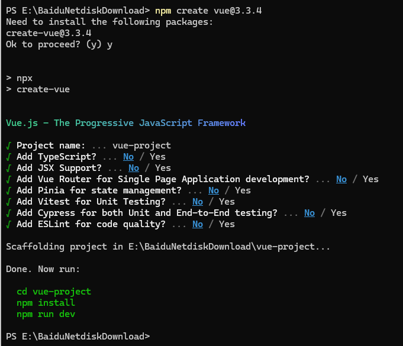

然后进入生成的项目目录，执行

```cmd
npm install
```

安装相关依赖

> 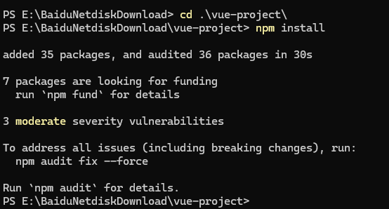

然后执行

```CMD
npm run dev
```

启动项目，并访问`http://localhost:5173`

> 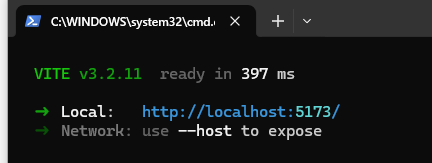

> 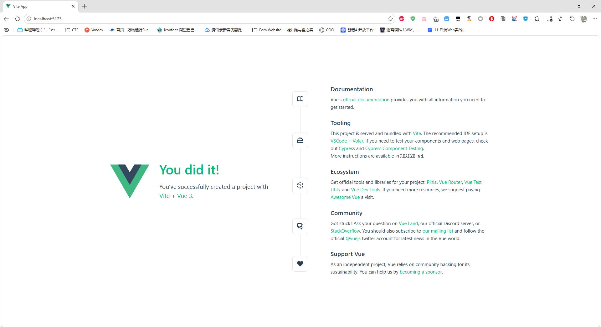

接着，我们利用这个脚手架工具，设计一个员工信息查询的页面。在`src`目录中新建目录`views`，然后创建一个文件`EmpTest.vue`

> 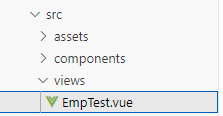

`vue`文件的基本结构如下

```vue
<script setup>

</script>

<template>

</template>

<style scoped>

</style>
```

`script`编写文件中所有的`JS`代码，`template`编写模板，也就是`HTML`内容，`style`则是`CSS`样式。如上所示的结构文件在`vue`中被称为一个组件，项目提供的`App.vue`被称为根组件，前端开发人员只需要开发不同的组件，然后根据需要挂载到其他组件即可，被挂载的组件使用其组件名称作为标签名，组件标签可以是成对的，也可以是自闭合的

```vue
<script setup>
import Demo from './views/Demo.vue';
import Demo1 from './views/Demo1.vue';    
</script>

<template>
<Demo />
<Demo1></Demo1>
</template>

<style scoped>

</style>
```

接着我们来完善`EmpTest.vue`中的内容，首先定义几个变量用于提交搜索内容。在`vue`组件中，定义变量需要使用`ref()`函数，通过`vue`包引入

```js
import { ref, onMounted } from "vue";
import axios from "axios";

const name = ref('');
const sex = ref('');
const pageSize = ref(10);
```

然后定义搜索函数，通过`axios`访问后端`api`，并将结果存储在前端

```js
const emp_list = ref([]);

const getEmpList = async () => {
    const result = await axios.get('/api/emps', {
        params: {
            name: name.value,
            sex: sex.value,
            pageSize: pageSize.value
        }
    })
    emp_list.value = result.data.data.rows;
}
```

然后使用钩子函数，在实例创建时调用一次搜索函数

```js
onMounted(() => {
    getEmpList();
});
```

最后编写简单的模板和样式

```vue
<template>
<div id="emp">
    <h1>员工列表查询</h1>
    <div class="search">
        <span>
            <label>员工姓名：</label>
            <input type="text" v-model="name">
        </span>
        <span>
            <label>性别：</label>
            <select v-model="sex">
                <option value="">全部</option>
                <option value="男">男</option>
                <option value="女">女</option>
            </select>
        </span>
        <span>
            <label>每页数量：</label>
            <select v-model="pageSize">
                <option value="5">5</option>
                <option value="10">10</option>
                <option value="20">20</option>
                <option value="50">50</option>
                <option value="100">100</option>
            </select>
        </span>
        <button @click="getEmpList">查询</button>
    </div>
    <div class="list">
        <table border="1" cellspacing="0" cellpadding="5" class="table">
            <thead>
                <tr>
                    <th>编号</th>
                    <th>姓名</th>
                    <th>性别</th>
                    <th>职位</th>
                    <th>入职时间</th>
                    <th>出生日期</th>
                    <th>头像</th>
                </tr>
            </thead>
            <tbody>
                <tr v-if="emp_list.length === 0">
                    <td colspan="7">暂无数据</td>
                </tr>
                <tr v-for="emp in emp_list" :key="emp.id">
                    <td>{{ emp.id }}</td>
                    <td>{{ emp.name }}</td>
                    <td>{{ emp.sex }}</td>
                    <td>{{ emp.jobName }}</td>
                    <td>{{ emp.boardDate }}</td>
                    <td>{{ emp.birth }}</td>
                    <td></td>
                </tr>
            </tbody>
        </table>
    </div>
</div>
</template>

<style scoped>
#emp {
    text-align: center;
}
.search {
    margin-bottom: 20px;
}
.search span {
    margin-right: 20px;
}
.list {
    width: 80%;
    margin: 0 auto;
}
.table {
    width: 100%;
}
</style>
```

在`App.vue`中导入`EmpTest`组件，并挂载

```vue
<script setup>
import EmpTest from './views/EmpTest.vue';
</script>

<template>
<EmpTest />
</template>

<style scoped>

</style>
```

启动项目，成功实现员工搜索的功能

> 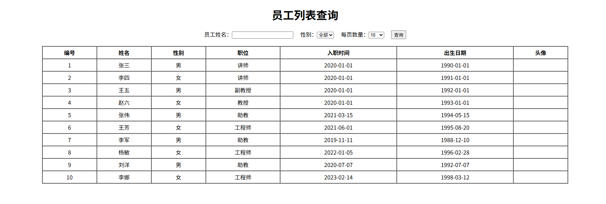

## ElementPlus

`Element`是饿了么团队研发的，基于`Vue3`的，面向设计师和开发者的组件库，内涵如超链接、按钮、图片、表格、表单、分页条等等组件，可供前端开发人员便捷使用，而不需要考虑具体的样式实现

### 快速入门

首先安装`ElementPlus`依赖，在项目终端中输入

```cmd
npm install element-plus@2.4.4 --save
```

然后检查`package.json`中是否包含`element-plus`

```json
{
  "name": "vue-project",
  "version": "0.0.0",
  "private": true,
  "type": "module",
  "scripts": {
    "dev": "vite",
    "build": "vite build",
    "preview": "vite preview"
  },
  "dependencies": {
    "axios": "^1.16.0",
    "element-plus": "^2.4.4",
    "vue": "^3.5.32"
  },
  "devDependencies": {
    "@vitejs/plugin-vue": "^6.0.6",
    "vite": "^8.0.8",
    "vite-plugin-vue-devtools": "^8.1.1"
  },
  "engines": {
    "node": "^20.19.0 || >=22.12.0"
  }
}
```

然后`main.js`中完整导入`ElementPlus`

```js
import './assets/main.css'

import { createApp } from 'vue'
import App from './App.vue'
import ElementPlus from 'element-plus'
import 'element-plus/dist/index.css'

createApp(App).use(ElementPlus).mount('#app')
```

现在我们使用`ElementPlus`为员工搜索的页面进行美化。首先改造搜索栏，我们使用如下的输入框组件

> 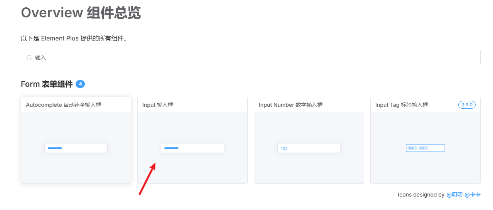

选择最基础的输入框，案例如下

```vue
<template>
  <el-input v-model="input" style="width: 240px" placeholder="Please input" />
</template>

<script setup>
import { ref } from 'vue'

const input = ref('')
</script>
```

据此在我们的项目中进行更改

```vue
<span>
    <label>员工姓名：</label>
    <el-input v-model="name" style="width: 240px" placeholder="请输入姓名" />
</span>
```

效果如下

> 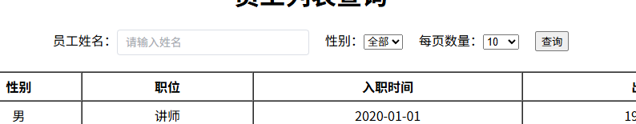

然后再更改性别选项框、每页数量和查询按钮

```vue
<div class="search">
    <span>
        <label>员工姓名：</label>
        <el-input v-model="name" style="width: 240px" placeholder="请输入姓名" />
    </span>
    <span>
        <label>性别：</label>
        <el-select v-model="sex" placeholder="选择性别" style="width: 80px">
            <el-option label="全部" value="" />
            <el-option label="男" value="男" />
            <el-option label="女" value="女" />
        </el-select>
    </span>
    <span>
        <label>每页数量：</label>
        <el-select v-model="pageSize" style="width: 70px">
            <el-option label="5" value="5" />
            <el-option label="10" value="10" />
            <el-option label="20" value="20" />
            <el-option label="50" value="50" />
            <el-option label="100" value="100" />
        </el-select>
    </span>
    <el-button type="primary" @click="getEmpList">搜索</el-button>
</div>
```

> 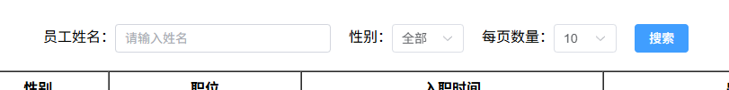

接着更新表格

```vue
<template>
<div id="emp">
    <h1>员工列表查询</h1>
    <div class="search">
        <span>
            <label>员工姓名：</label>
            <el-input v-model="name" style="width: 240px" placeholder="请输入姓名" />
        </span>
        <span>
            <label>性别：</label>
            <el-select v-model="sex" placeholder="选择性别" style="width: 80px">
                <el-option label="全部" value="" />
                <el-option label="男" value="男" />
                <el-option label="女" value="女" />
            </el-select>
        </span>
        <span>
            <label>每页数量：</label>
            <el-select v-model="pageSize" style="width: 70px">
                <el-option label="5" value="5" />
                <el-option label="10" value="10" />
                <el-option label="20" value="20" />
                <el-option label="50" value="50" />
                <el-option label="100" value="100" />
            </el-select>
        </span>
        <el-button type="primary" @click="getEmpList">搜索</el-button>
    </div>
    <div class="list">
        <el-table :data="emp_list" border style="width: 100%">
        <el-table-column prop="id" label="编号" width="180" align="center" />
        <el-table-column prop="name" label="姓名" width="180" align="center" />
        <el-table-column prop="birth" label="出生日期" width="180" align="center" />
        <el-table-column prop="sex" label="性别" width="180" align="center" />
        <el-table-column prop="jobName" label="职位" width="180" align="center" />
        <el-table-column prop="boardDate" label="入职日期" width="180" align="center" />
        <el-table-column label="头像" align="center">
            <template #default="scope">
                <el-avatar :size="60" :src="scope.row.avatarPath">
                    
                </el-avatar>
            </template>
        </el-table-column>
    </el-table>
    </div>
</div>
</template>

<style scoped>
#emp {
    text-align: center;
}
.search {
    margin-bottom: 20px;
}
.search span {
    margin-right: 20px;
}
.list {
    width: 70%;
    margin: 0 auto;
}
</style>
```

> 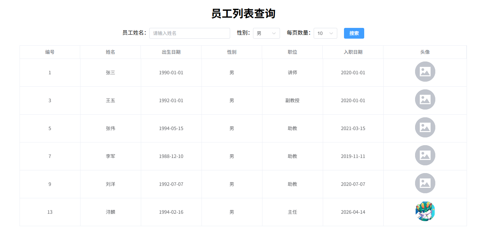

实际上分页功能还没有完全实现，因此我们还需要根据`ElementPlus`的官方文档来制作分页展示按钮

```vue
<template>
<div id="emp">
    <h1>员工列表查询</h1>
    <div class="search">
        <span>
            <label>员工姓名：</label>
            <el-input v-model="name" style="width: 240px" placeholder="请输入姓名" />
        </span>
        <span>
            <label>性别：</label>
            <el-select v-model="sex" placeholder="选择性别" style="width: 80px">
                <el-option label="全部" value="" />
                <el-option label="男" value="男" />
                <el-option label="女" value="女" />
            </el-select>
        </span>
        <el-button type="primary" @click="getEmpList">搜索</el-button>
    </div>
    <div class="list">
        <el-table 
            :data="emp_list.rows" 
            border 
            :row-key="id"
        >
            <el-table-column prop="id" label="编号" width="180" align="center" />
            <el-table-column prop="name" label="姓名" width="180" align="center" />
            <el-table-column prop="birth" label="出生日期" width="180" align="center" />
            <el-table-column prop="sex" label="性别" width="180" align="center" />
            <el-table-column prop="jobName" label="职位" width="180" align="center" />
            <el-table-column prop="boardDate" label="入职日期" width="180" align="center" />
            <el-table-column label="头像" align="center">
                <template #default="scope">
                    <el-avatar :size="40" :src="scope.row.avatarPath">
                        
                    </el-avatar>
                </template>
            </el-table-column>
        </el-table>
    </div>
    <div class="page">
        <el-pagination
            v-model:current-page="page"
            v-model:page-size="pageSize"
            :page-sizes="[5, 10, 20, 50, 100]"
            layout="total, ->, sizes, prev, pager, next, jumper"
            :total=emp_list.total
            @change="getEmpList"
        >
            <template #sizes="{ size }">
                {{ size }}
            </template>
        </el-pagination>
    </div>
</div>
</template>

<style scoped>
#emp {
    text-align: center;
}
.search {
    margin-bottom: 20px;
}
.search span {
    margin-right: 20px;
}
.list {
    width: 80%;
    margin: 0 auto;
    margin-bottom: 20px;
}
.page {
    width: 80%;
    margin: 0 auto;
}
</style>
```

> 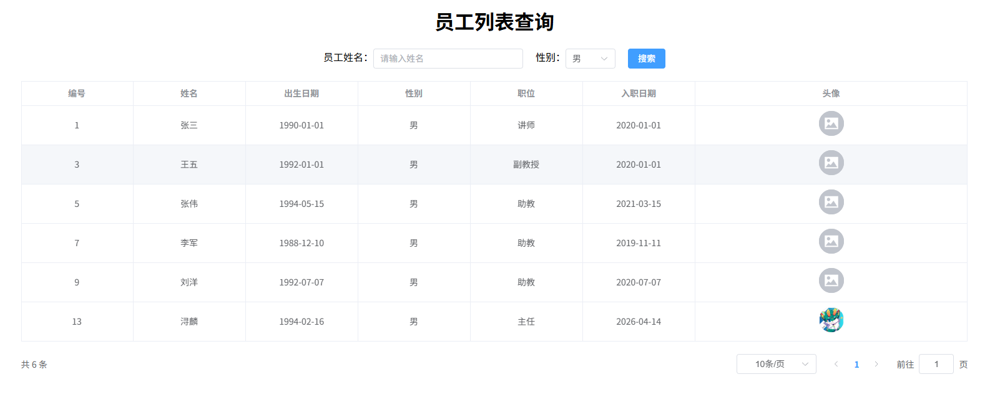

### 进阶案例

上文中我们已经实现了员工列表的基础查询效果，但是在实际的业务中，不仅有展示效果，还需要一些互动功能，如更新员工、删除员工等操作，现在我们根据`ElementPlus`提供的组件以及接口文档，来制作一个非常完善的员工管理界面

#### 添加员工

首先定义一个添加员工的按钮，布置在搜索按钮的右侧

```vue
<el-button type="success" @click="openAddEmpDialog">新增员工</el-button>
```

点击按钮后，打开添加员工的弹窗界面，这个界面被称为对话框`Dialog`，在`ElementPlus`中，对话框通过绑定一个布尔值变量来决定是否显示

```vue
<el-dialog
    v-model="addEmpDialogVisible"
    width="40%"
    align="left"
    style="margin-top: 100px;"
>
```

如上，`addEmpDialogVisible`就是控制对话框是否显示的变量，所以我们需要定义这个变量，默认赋值为`false`

```js
// 新增员工对话框是否可见
const addEmpDialogVisible = ref(false);
```

新增员工时需要在前端保存员工实例，然后提交给后端，定义这个实例，并同步定义一个重置方法，方便在操作完成后快捷重置

```js
// 新增员工属性
const emp = ref({
    name: null,
    birth: null,
    sex: null,
    avatarPath: null,
    deptName: null,
    jobName: null,
    boardDate: null,
    empExpList: []
});

// 清空表单方法
const clearForm = () => {
    emp.value = { name: null, birth: null, sex: null, avatarPath: null, deptName: null, jobName: null, boardDate: null, empExpList: [] };
}
```

然后定义`openAddEmpDialog`方法，点击按钮后，应该先打开界面，然后调用部门查询方法和职位查询方法，将所有的选项保存在前端

```js
// 部门列表
const dept_list = ref([]);
// 职位列表
const job_list = ref([]);

// 打开创建员工对话框方法
const openAddEmpDialog = () => {
    addEmpDialogVisible.value = true;
    clearForm();
    getDeptList();
    getJobList();
}

// 获取部门列表
const getDeptList = async () => {
    const result = await axios.get('/api/depts')
    dept_list.value = result.data.data;
}

// 获取职位列表
const getJobList = async () => {
    const result = await axios.get('/api/jobs')
    job_list.value = result.data.data;
}
```

接着实现上传头像，`ElementPlus`提供了多种上传文件的方式，我们使用最简单的立即上传模式。在对话框中定义头像`<div>`，然后通过`<el-avatar>`预览头像，再使用`<el-upload>`上传文件，通过一个`<el-button>`来触发。在`<el-upload>`的属性中，`action`表示文件上传路径，`name`是文件的参数名，`show-file-list`表示是否额外展示文件上传的列表，`before-upload`是在上传前执行的方法，`on-success`是上传成功后执行的方法

```vue
<!-- 头像 -->
<div class="addEmpDialog-body-info-avatar" align="center">
    <el-avatar :src="emp.avatarPath" :size="70">
        
    </el-avatar>
    <el-upload
        action="/api/upload"
        name="file"
        :show-file-list="false"
        :before-upload="beforeAvatarUpload"
        :on-success="handleAvatarSuccess"
    >
        <el-button type="success" style="margin-top: 10px;">点击上传</el-button>
    </el-upload>
</div>
```

在上传文件前，应当对文件的格式、大小进行一定限制，比如我们设置只能上传`jpg`、`png`、`jpeg`格式的文件，文件大小不超过`2MiB`

```js
// 头像上传限制
const beforeAvatarUpload = (rawFile) => {
  if (rawFile.type !== 'image/jpeg' && rawFile.type !== 'image/png' && rawFile.type !== 'image/jpg') {
    ElMessage.error('必须为jpeg、png、jpg格式的图片')
    return false
  } else if (rawFile.size / 1024 / 1024 > 2) {
    ElMessage.error('文件大小不能超过2MiB')
    return false
  }
  return true
}
```

文件上传成功后，将后端返回的文件目录添加到`emp`实例中，并提示上传成功

```js
// 头像上传成功方法
const handleAvatarSuccess = (response) => {
    emp.value.avatarPath = response.data;
    ElMessage.success('上传成功')
}
```

> 

然后定义`emp`实例对应的输入框、选择框等等。需要注意，`ElementPlus`中的日期格式必须大写，如`YYYY-MM-DD`，小写无法正确解析

```vue
<div class="addEmpDialog-body-info" style="margin-top: -30px; font-size: 16px;">
    <el-divider content-position="center">员工基本信息</el-divider>
    <!-- 头像 -->
    <div class="addEmpDialog-body-info-avatar" align="center">
        <el-avatar :src="emp.avatarPath" :size="70">
            
        </el-avatar>
        <el-upload
            action="/api/upload"
            name="file"
            :show-file-list="false"
            :before-upload="beforeAvatarUpload"
            :on-success="handleAvatarSuccess"
        >
            <el-button type="success" style="margin-top: 10px;">点击上传</el-button>
        </el-upload>
    </div>
    <!-- 员工信息 -->
    <div class="addEmpDialog-body-info-empInfo" align="center" style="margin-top: 20px;">
        <div class="empInfo">
            <label>员工姓名：</label>
            <el-input v-model="emp.name" style="width: 220px" placeholder="请输入姓名" />
            <label style="margin-left: 20px">性别：</label>
            <el-select v-model="emp.sex" placeholder="选择性别" style="width: 250px">
                <el-option label="男" value="男" />
                <el-option label="女" value="女" />
            </el-select>
        </div>
        <div class="empInfo">
            <label>出生日期：</label>
            <el-date-picker
                v-model="emp.birth"
                type="date"
                placeholder="选择日期"
                value-format="YYYY-MM-DD"
                style="width: 220px"
            />
            <label style="margin-left: 20px">部门：</label>
            <el-select v-model="emp.deptName" placeholder="选择部门" style="width: 250px">
                <el-option v-for="dept in dept_list" :key="dept.id" :label="dept.name" :value="dept.name" />
            </el-select>
        </div>
        <div class="empInfo">
            <label>职位：</label>
            <el-select v-model="emp.jobName" placeholder="选择职位" style="width: 220px">
                <el-option v-for="job in job_list" :key="job" :label="job" :value="job" />
            </el-select>
            <label style="margin-left: 20px">入职日期：</label>
            <el-date-picker
                v-model="emp.boardDate"
                type="date"
                placeholder="选择日期"
                value-format="YYYY-MM-DD"
                style="width: 250px"
            />
        </div>
    </div>
</div>
```

> 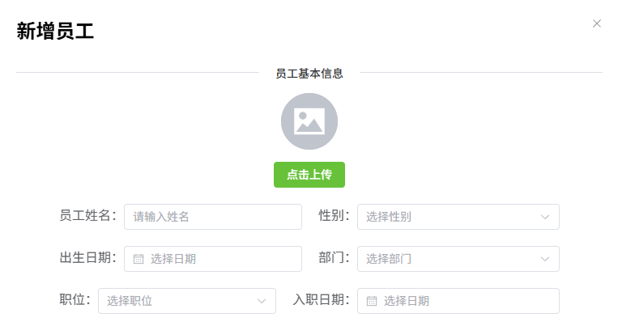

下面是员工工作经历信息，我们使用`v-for`循环遍历`emp`实例中的`empExpList`数组，每遍历到一个工作经历实例，则在页面中添加一个元素，元素中包含需要填入的工作经历信息。每个工作经历信息也需要一个`<el-button>`用于删除。在元素的最后再提供一个添加工作经历的按钮

```vue
<div class="addEmpDialog-body-empExpList" style="font-size: 16px;" align="center">
    <el-divider content-position="center">员工工作经历</el-divider>
    <el-scrollbar max-height="200px">
        <div class="addEmpDialog-body-empExpList-empExp" v-for="(empExp, index) in emp.empExpList" :key="index">
            <div class="empExp-info">
                <label>开始时间：</label>
                <el-date-picker
                    v-model="empExp.startTime"
                    type="date"
                    placeholder="选择日期"
                    value-format="YYYY-MM-DD"
                    style="width: 220px"
                />
                <label style="margin-left: 20px">结束时间：</label>
                <el-date-picker
                    v-model="empExp.endTime"
                    type="date"
                    placeholder="选择日期"
                    value-format="YYYY-MM-DD"
                    style="width: 220px"
                />
            </div>
            <div class="empExp-info">
                <label>担任职位：</label>
                <el-input v-model="empExp.job" style="width: 220px" placeholder="请输入职位" />
                <label style="margin-left: 20px">公司名称：</label>
                <el-input v-model="empExp.company" style="width: 220px" placeholder="请输入公司名称" />
            </div>
            <el-button type="danger" @click="deleteEmpExp(empExp.id)">点击删除</el-button>
            <el-divider>
                <el-icon><star-filled /></el-icon>
            </el-divider>
        </div>
        <div class="addEmpExp-button">
            <el-button type="success" @click="addEmpExp" style="margin-bottom: -10px;">点击添加</el-button>
        </div>
    </el-scrollbar>
</div>
```

定义`deleteEmpExp`和`addEmpExp`方法，新增工作经历即是在`emp.empExpList`中新增一个值全为`null`的工作经历实例，删除则是直接从数组中删除一个实例即可

```js
// 删除工作经历
const deleteEmpExp = async (index) => {
    emp.value.empExpList.splice(index, 1);
}

// 新增工作经历
const addEmpExp = () => {
    emp.value.empExpList.push({
        "startTime": null,
        "endTime": null,
        "company": null,
        "job": null
    });
}
```

> 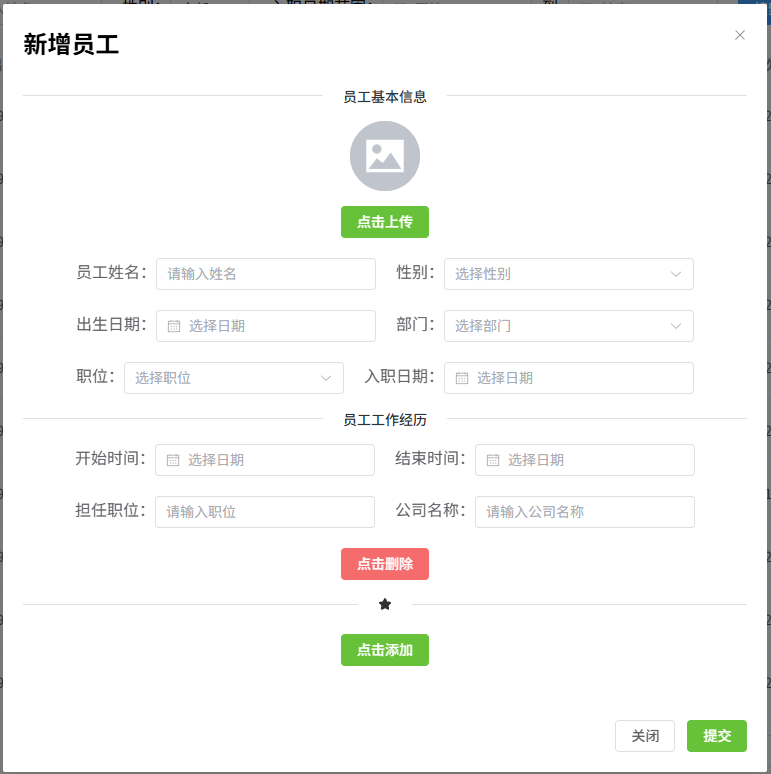

最后完成提交的方法即可，`POST`方法向`/api/emps`提交数据，根据后端返回的结果判断是否添加成功，同时关闭对话框，刷新员工列表，重置员工实例

```js
// 新增员工
const addEmp = async () => {
    const result = await axios.post('/api/emps', emp.value);
    if (result.data.code !== 1) {
        ElMessage.error(`添加失败！可能的原因：${result.data.message}`);
    } else {
        ElMessage.success(`添加成功！`);
    }
    addEmpDialogVisible.value = false;
    getEmpList();
    clearForm();
}
```

#### 批量删除员工

`ElementPlus`提供了表格多选框，通过设置表格的`type="selection"`即可快捷生成多选框

```vue
<el-table 
    :data="emp_list.rows"
    ref="table"
    width="100%"
    @selection-change="handleSelectionChange"
>
    <el-table-column width="100" type="selection" />
    <el-table-column fixed prop="id" label="工号" width="100" />
    <el-table-column prop="name" label="Name" width="150" />
    <el-table-column prop="birth" label="出生日期" width="150" />
    <el-table-column prop="sex" label="性别" width="120" />
    <el-table-column label="头像" width="100">
        <template #default="scope">
            <el-avatar :src="scope.row.avatarPath">
                
            </el-avatar>
        </template>
    </el-table-column>
    <el-table-column prop="deptName" label="部门" width="120" />
    <el-table-column prop="jobName" label="职位" width="120" />
    <el-table-column prop="boardDate" label="入职日期" width="150" />
    <el-table-column prop="updateTime" label="上次修改时间" width="200" />
    <el-table-column fixed="right" label="操作" min-width="80">
    <template #default="scope">
        <el-button link type="primary" @click="openUpdateEmpDialog(scope.row.id)">更新</el-button>
    </template>
    </el-table-column>
</el-table>
```

`<el-table>`通过`ref`来绑定一个变量，变量得到的是`table`组件，而不是多选框中的内容，因此需要额外通过`@selection-change`设置一个监听器，在每次多选框内容更改时，监听器调用`table`组件的`getSelectionRows`方法获取其中选择的数据，数据由`table`组件本身的`:data`传递

```js
// 表格组件
const table = ref();
// 删除员工列表
const deleteEmpList = ref([]);

// 删除员工多选框监听器方法
const handleSelectionChange = () => {
    deleteEmpList.value = table.value.getSelectionRows();
}
```

然后我们设置一个删除员工的按钮，按钮仅在多选框中有内容时出现

```vue
<el-button type="danger" @click="deleteEmpDialogVisible = true" v-show="deleteEmpList.length > 0">删除员工</el-button>
```

定义删除员工的对话框，对话框中显示需要删除的员工信息

```vue
<div class="deleteEmpDialog">
    <el-dialog
        v-model="deleteEmpDialogVisible"
        width="35%"
        align="left"
        align-center="true"
    >
    <template #header>
        <div class="my-header">
            <h1 style="font-size: 24px;margin: 1px;">批量删除员工</h1>
        </div>
    </template>
    <div class="deleteEmpDialog-body" style="margin-top: -30px;">
        <label style="font-size: 16px;">是否删除以下员工</label>
        <div class="deleteEmpDialog-body-empInfo" align="center">
            <el-table :data="deleteEmpList" style="width: 100%" max-height="300px">
                <el-table-column prop="id" label="工号" width="100" />
                <el-table-column prop="name" label="姓名" width="120" />
                <el-table-column prop="sex" label="性别" width="120" />
                <el-table-column prop="deptName" label="部门" width="120" />
                <el-table-column prop="jobName" label="职位" />
            </el-table>
        </div>
    </div>
    <template #footer>
        <div class="deleteEmpDialog-footer">
            <el-button @click="deleteEmpDialogVisible = false">关闭</el-button>
            <el-button type="danger" @click="deleteEmp">确定</el-button>
        </div>
        </template>
    </el-dialog>
</div>
```

最后完善删除员工的请求方法，`deleteEmpList`中存储的是对象，所以我们通过`map()`方法转换为`id`数组，通过`axios`将数组作为参数传递到后端进行删除。操作完成后，刷新表格和选择内容

```js
// 删除员工方法
const deleteEmp = async () => {
    deleteEmpDialogVisible.value = false;
    const deleteEmpListId = deleteEmpList.value.map(emp => emp.id);
    const result = await axios.delete('/api/emps', {
        params: {
            ids: deleteEmpListId
        }
    })
    if (result.data.code !== 1) {
        ElMessage.error(`删除失败！可能的原因：${result.data.msg}`);

    } else {
        ElMessage.success(`删除成功！`);
    }
    getEmpList();
    handleSelectionChange();
}
```

## Vue Router

`Vue Router` 是 `Vue.js` 官方提供的客户端路由解决方案，专为构建单页面应用设计。它通过将浏览器的 URL 与用户界面绑定，使页面无需重新加载即可实现导航。`Vue Router` 深度集成了` Vue` 的组件系统，提供了灵活且强大的路由管理功能。

举个例子，在传统的页面布局中，假设页面中存在一个导航栏，用户每点击一个导航栏，就会打开一个新页面，或者在当前页面重新加载新页面。使用`Vue Router`可以在当前页面中加载其他页面，类似于`HTML`中的内联框架`<iframe>`，但是功能更为强大。

### 快速入门

首先安装`Vue Router`依赖

```cmd0
npm install vue-router --save
```

然后`main.js`中导入并使用`Vue Router`

```js
import router from './router'

const app = createApp(App)
app.use(router)
app.mount('#app')
```

在`src`目录下创建`router`目录，并在`router`目录中创建文件`index.js`

```js
import { createRouter, createWebHistory} from 'vue-router'

const routes = [

]

const router = createRouter({
  history: createWebHistory(),
  routes
});

export default router
```

`Vue Router`中，使用`<router-link>`标签设置需要路由的元素，使用属性`to`设置路由地址

```vue
<router-link to="/">
    <el-button type="success">返回首页</el-button>
</router-link>
```

然后使用`<router-view>`标签来设置路由显示的位置

```vue
<el-container>
    <el-header>导航栏</el-header>
    <el-container>
        <el-aside>侧边栏</el-aside>
        <el-main>
            主要内容区
            <router-view />
        </el-main>
    </el-container>
</el-container>
```

路由的配置在`index.js`中设置，每个路由的格式如下，`component`接收的是一个组件对象，需要使用`import`导入

```js
{
    path: '',
    name: '',
    component: 
}
```

例如我们设置`/emp`访问`src/views/emp/index.vue`

```js
import EmpView from '@/views/emp/index.vue'

const routes = [
    {
        path :'emp',
        name: 'emp',
        component: EmpView
    }
]
```

不难看出，`routes`是一个数组，因此可以配置多个路由

```js
import EmpView from '@/views/emp/index.vue'
import DeptView from '@/views/dept/index.vue'

const routes = [
    {
        path :'emp',
        name: 'emp',
        component: EmpView
    },
    {
        path :'dept',
        name: 'dept',
        component: DeptView
    }
]
```

`Vue Router`也支持配置子路由，通过设置路由实例的`children`属性，当访问`/aaa/bbb`时，可以路由到`/aaa`的`/bbb`子路由

```js
const routes = [
    {
        path :'/aaa',
        name: 'aaa',
        component: aaa,
        children: [
            {
                path: '/bbb',
                name: 'bbb',
                component: bbb
            }
        ]
    }
]
```

如果路由`a`对应的`vue`组件中存在一个`<router-view>`，那么其子路由会直接显示在`a`组件的对应位置

`a.vue`

```vue
<script setup>

</script>

<template>
aaa
<router-view />
ccc
</template>

<style scoped>

</style>
```

`b.vue`

```vue
<script setup>

</script>

<template>
bbb
</template>

<style scoped>

</style>
```

访问`/aaa/bbb`即可得到

> 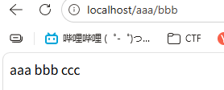

因此可以构建单页面应用设计，设置一个布局组件，在布局组件中设置一个菜单，通过菜单路由到各个子组件，然后在布局组件中合适位置放置一个`<router-view>`，点击菜单中的按钮，即可在布局组件的指定位置显示子路由页面的内容

> 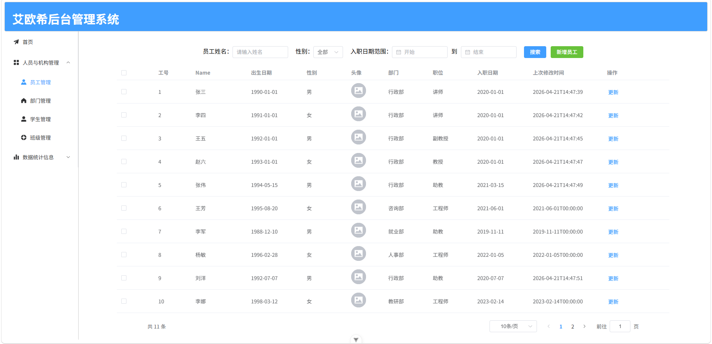

### 进阶案例

我们来制作上文图片中的网页效果，首先定义一个布局组件，在布局组件中使用`ElementPlus`的`<el-container>`容器来进行布局

```vue
<script setup>
    
</script>

<template>
<div class="container">
    <el-container>
        <el-header height="80px" class="container-header">
            <h1 class="container-header-title" style="color: white;">艾欧希后台管理系统</h1>
        </el-header>
        <el-container class="container-body">
            <el-aside width="200px" class="container-aside">
               
            </el-aside>
            <el-main>
                <router-view />
            </el-main>
        </el-container>
    </el-container>
</div>
</template>

<style scoped>
.container-header {
    background-color: #409EFF;
    align-items: center;
    border-radius: 4px;
    border: 1px solid #ccc;
}
.container-body {
    /* border: 1px solid #ccc; */
    height: 89.5vh;
}
.container-aside {
    border-right: #ccc 1px solid;
}
</style>
```

> 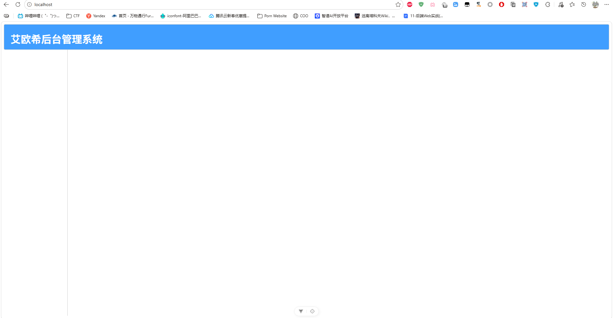

然后在左边栏使用`ElementPlus`中的`<el-menu>`侧边栏菜单组件设计一些菜单按钮

```vue
<script setup>
    
</script>

<template>
<div class="container">
    <el-container>
        <el-header height="80px" class="container-header">
            <h1 class="container-header-title" style="color: white;">艾欧希后台管理系统</h1>
        </el-header>
        <el-container class="container-body">
            <el-aside width="200px" class="container-aside">
                <el-scrollbar height="100%">
                    <el-menu router>
                        <el-menu-item index="/index">
                            <template #title>
                                <el-icon><Promotion /></el-icon>
                                <span>首页</span>
                            </template>
                        </el-menu-item>
                        <el-sub-menu index="1">
                            <template #title>
                                <el-icon><Menu /></el-icon>
                                <span>人员与机构管理</span>
                            </template>
                            <el-menu-item index="/emp">
                                <template #title>
                                    <el-icon><Avatar /></el-icon>
                                    <span>员工管理</span>
                                </template>
                            </el-menu-item>
                            <el-menu-item index="/dept">
                                <template #title>
                                    <el-icon><HomeFilled /></el-icon>
                                    <span>部门管理</span>
                                </template>
                            </el-menu-item>
                            <el-menu-item index="/student">
                                <template #title>
                                    <el-icon><UserFilled /></el-icon>
                                    <span>学生管理</span>
                                </template>
                            </el-menu-item>
                            <el-menu-item index="/class">
                                <template #title>
                                    <el-icon><HelpFilled /></el-icon>
                                    <span>班级管理</span>
                                </template>
                            </el-menu-item>
                        </el-sub-menu>
                        <el-sub-menu index="2">
                            <template #title>
                                <el-icon><Histogram /></el-icon>
                                <span>数据统计信息</span>
                            </template>
                            <el-menu-item index="/report/emp">
                                <template #title>
                                    <el-icon><InfoFilled /></el-icon>
                                    <span>员工信息统计</span>
                                </template>
                            </el-menu-item>
                            <el-menu-item index="/report/student">
                                <template #title>
                                    <el-icon><Share /></el-icon>
                                    <span>学生信息统计</span>
                                </template>
                            </el-menu-item>
                            <el-menu-item index="/log">
                                <template #title>
                                    <el-icon><Comment /></el-icon>
                                    <span>系统日志</span>
                                </template>
                            </el-menu-item>
                        </el-sub-menu>
                    </el-menu>
                </el-scrollbar>
            </el-aside>
            <el-main>
                <router-view />
            </el-main>
        </el-container>
    </el-container>
</div>
</template>

<style scoped>
.container-header {
    background-color: #409EFF;
    align-items: center;
    border-radius: 4px;
    border: 1px solid #ccc;
}
.container-body {
    /* border: 1px solid #ccc; */
    height: 89.5vh;
}
.container-aside {
    border-right: #ccc 1px solid;
}
</style>
```

> 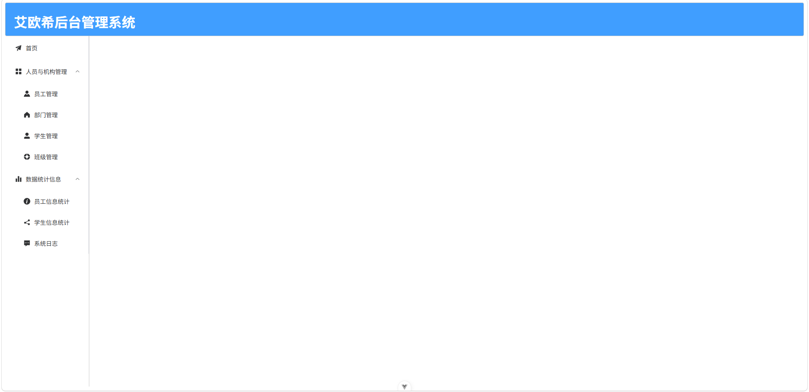

然后在`index.js`中设置路由，同时创建对应的`vue`文件。`report`路由没有对应的组件，因此不需要`component`，但需要子路由`/emp`和`/student`

```js
import { createRouter, createWebHistory} from 'vue-router'

import LayoutView from '@/views/layout/index.vue'
import EmpView from '@/views/emp/index.vue'
import IndexView from '@/views/index/index.vue'
import DeptView from '@/views/dept/index.vue'
import ClassView from '@/views/class/index.vue'
import StudentView from '@/views/student/index.vue'
import EmpReportView from '@/views/report/emp/index.vue'
import StudentReportView from '@/views/report/student/index.vue'
import LogView from '@/views/log/index.vue'

const routes = [
  {
    path: '/',
    name: 'layout',
    component: LayoutView,
    children: [
      {
        path :'emp',
        name: 'emp',
        component: EmpView
      },
      {
        path :'index',
        name: 'index',
        component: IndexView
      },
      {
        path :'dept',
        name: 'dept',
        component: DeptView
      },
      {
        path :'class',
        name: 'class',
        component: ClassView
      },
      {
        path :'student',
        name: 'student',
        component: StudentView
      },
      {
        path :'report',
        name: 'report',
        children: [
          {
            path: 'emp',
            name: 'empReport',
            component: EmpReportView
          },
          {
            path: 'student',
            name: 'studentReport',
            component: StudentReportView
          }
        ]
      },
      {
        path: 'log',
        name: 'log',
        component: LogView
      }
    ]
  }
]

const router = createRouter({
  history: createWebHistory(),
  routes
});

export default router
```

最后设计一个首页，在访问`/`时自动加载，在`index.js`中通过`redirect`来设置重定向的路由

```js
const routes = [
  {
    path: '/',
    name: 'layout',
    component: LayoutView,
    redirect: 'index',
    ...
```

点击员工管理，可以看到在右侧内容区中显示出了我们先前制作的员工管理界面

> 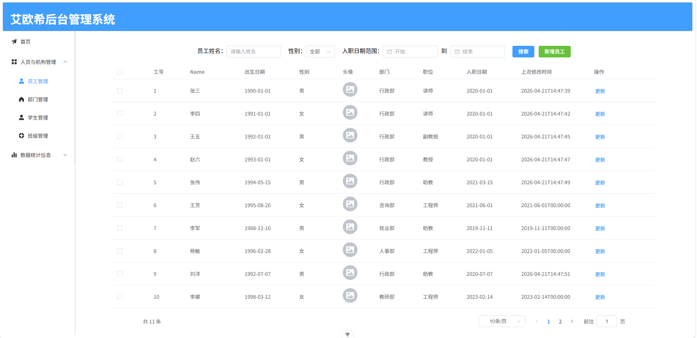

## Docker

如果想要部署一个`Web`项目，一般的手段是将前后端打包后的文件上传到服务器中，然后在服务器中启动`Nginx`与`Java`。但是这种方式存在一些问题，如果项目需要更新，那么就需要停止当前项目，然后重新运行，如果项目的启动过程比较麻烦，那么就会造成较长时间的服务不可用，这对于某些时间敏感业务来说是一种严重威胁。而且如果新版本的项目存在问题，那么又需要重新部署旧版本，同样会造成同样的问题。

`Docker` 是一个开源的应用容器引擎，基于 `Go` 语言并遵从 `Apache2.0` 协议开源。`Docker` 可以让开发者打包他们的应用以及依赖包到一个轻量级、可移植的容器中，然后发布到任何流行的 `Linux` 机器上，也可以实现虚拟化。简单来说，`Docker`可以快速创建一个项目包，这个项目包可以在任何能够运行`Docker`的计算机上快捷运行。`Docker`也提供一些程序的快捷安装方式，不需要程序员进行繁琐的手动安装方式，用几行简洁的代码即可安装并使用。

### 快速入门

首先来安装`Docker`，`Docker`官方提供了快捷安装程序，阿里云也提供了镜像源

**官方源**

```bash
curl -fsSL https://get.docker.com | bash -s docker
```

**阿里源**

```bash
curl -fsSL https://get.docker.com | bash -s docker --mirror Aliyun
```

但是如果使用`WSL`，可能会出现提示

```bash
# Executing docker install script, commit: 2687d91ddeb3bd6aeae37a90947761efdee87030

WSL DETECTED: We recommend using Docker Desktop for Windows.
Please get Docker Desktop from https://www.docker.com/products/docker-desktop/


You may press Ctrl+C now to abort this script.
+ sleep 20
```

这是`Docker`安装程序检测到了`WSL`环境，推荐使用`Windows`环境的`Docker Desktop`，不过可以忽略这个提示手动安装

```bash
sudo apt install docker.io
```

安装完成后，使用如下命令启动

```bash
# 启动Docker
sudo systemctl start docker

# 设置开机启动
sudo systemctl enable docker
```

然后检查`Docker`服务状态，保证正确安装并启动

```bash
sudo systemctl status docker
```

> 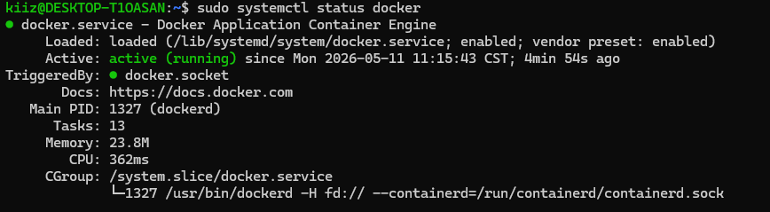

接着换源，上文提到，`Docker`提供了快捷安装程序的功能，实质是`Docker`官方维护了一个中央仓库，类似于`Maven`，`Docker`开发者可以通过访问中央仓库来下载需要的镜像，然后快捷部署在服务器上。但是由于`GFW`的存在，国内无法稳定访问中央仓库，所以官方、阿里云、网易等等提供了一些加速源

```bash
sudo nano /etc/docker/daemon.json

{
  "registry-mirrors": [
    "https://registry.docker-cn.com",
    "http://hub-mirror.c.163.com",
    "https://docker.mirrors.ustc.edu.cn",
    "https://mirror.ccs.tencentyun.com",
    "https://registry.cn-hangzhou.aliyuncs.com",
    "https://docker.mirrors.ustc.edu.cn"
  ]
}
```

然后重启服务

```bash
sudo systemctl daemon-reload
sudo systemctl restart docker
```

然后输入以下命令从中央仓库拉取一个`MySQL8`镜像

```bash
sudo docker pull mysql:8
```

> 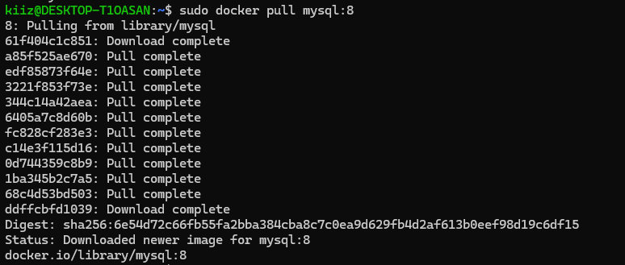

然后输入以下命令来运行一个实例，并设置暴露的端口为`3307`，`mysql`的`root`账户秘密设置为`root`

```bash
sudo docker run -d \
	--name mysql \
	-p 3307:3306 \
	-e TZ=Asia/Shanghai \
	-e MYSQL_ROOT_PASSWORD=root \
	mysql:8
```

> 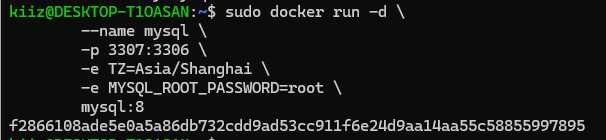

然后检查当前实例的列表

```bash
kiiz@DESKTOP-T1OASAN:~$ sudo docker ps
CONTAINER ID   IMAGE     COMMAND                   CREATED          STATUS          PORTS                                                    NAMES
f2866108ade5   mysql:8   "docker-entrypoint.s…"   59 seconds ago   Up 59 seconds   33060/tcp, 0.0.0.0:3307->3306/tcp, [::]:3307->3306/tcp   mysql
```

然后我们通过`Windows`去访问

> 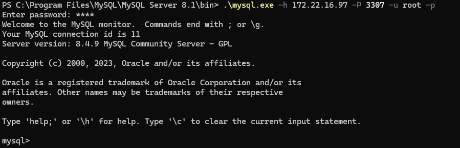

### 常用命令

现在来解释一下刚才的命令

```bash
sudo docker run -d \
	--name mysql \
	-p 3307:3306 \
	-e TZ=Asia/Shanghai \
	-e MYSQL_ROOT_PASSWORD=root \
	mysql:8
```

- `run`：创建一个容器，并运行指定的镜像实例
- `-d`：容器后台运行，不占用前台窗口
- `--name`：为容器命名
- `-p`：格式为`port1:port2`，指定代理的端口，`port1`是暴露给外界的端口，即服务器中的端口，`port2`是容器内被代理的端口，`3307:3306`即表示代理容器内的`3306`端口，外界通过服务器的`3307`端口来访问
- `-e`：`Environment`的缩写，表示环境变量，格式为`KEY=VALUE`，
- `mysql:8`：指定需要运行的镜像，格式为`ImageName:Version`，版本如果不指定，默认使用最新版本

#### Docker API

| API      | 说明                                     |
| -------- | ---------------------------------------- |
| `pull`   | 从中央镜像仓库拉取镜像到本地             |
| `push`   | 将本地镜像推送到中央仓库                 |
| `build`  | 将本地`Dockerfile`构建为一个`Docker`镜像 |
| `rmi`    | 删除本地镜像                             |
| `save`   | 将本地镜像打包为归档文件                 |
| `load`   | 从归档文件中加载镜像                     |
| `run`    | 创建并启动一个新的容器                   |
| `stop`   | 停止正在运行容器                         |
| `start`  | 启动停止的容器                           |
| `rm`     | 删除容器                                 |
| `ps`     | 查看当前正在运行的容器                   |
| `images` | 查看当前所有的本地镜像                   |
| `logs`   | 查看容器运行日志                         |
| `exec`   | 进入容器内部                             |

### 数据卷

数据卷是`Docker`中的一个虚拟目录，用于在容器和宿主机之间进行文件管理，因为容器内的系统默认并不提供任何文件编辑功能，文件的编辑必须通过宿主机完成。

一般情况下，容器中创建的数据卷目录，会在宿主机的`/var/lib/docker/volumes`下创建对应的映射目录，映射目录中的`/_data`目录即是容器中对应的数据卷

#### 数据卷 API

| API       | 说明                     |
| --------- | ------------------------ |
| `create`  | 创建数据卷               |
| `ls`      | 查看所有的数据卷         |
| `rm`      | 删除指定数据卷           |
| `inspect` | 查看某个数据卷的详细信息 |
| `prune`   | 清除所有未使用的数据卷   |

同时，在使用`run`创建容器时，也可以使用`-v`参数来创建数据卷

```bash
sudo docker run -v <VolumeName:Path>
```

例如给一个`Nginx`容器创建数据卷

```bash
sudo docker run -d \
	--name nginx \
	-p 80:80 \
	-v html:/usr/share/nginx/html \
	nginx:1.26.3
```

接着我们检查宿主机中是否创建了对应的映射目录

```bash
kiiz@DESKTOP-T1OASAN:~$ sudo ls /var/lib/docker/volumes
32857f41d385506ff29ac4b8666ab43bbdd60503a50d50a9f0199c30a6e7b8c0  backingFsBlockDev  html  metadata.db
kiiz@DESKTOP-T1OASAN:~$ sudo ls /var/lib/docker/volumes/html
_data
```

可以看到，`html`目录已经成功创建，而且也包含了子目录`_data`。`html`数据卷挂载的是`Nginx`的默认目录，也就意味着`_data`目录中也应该包含`Nginx`初始文件，我们打开进行查看

```bash
kiiz@DESKTOP-T1OASAN:~$ sudo ls /var/lib/docker/volumes/html/_data
50x.html  index.html
```

`_data`目录中出现了`Nginx`默认文件`50x.html`以及`index.html`，表明我们的数据卷创建并挂载成功。再通过`inspect`来查看数据卷的详细信息

```bash
kiiz@DESKTOP-T1OASAN:~$ sudo docker volume inspect html
[
    {
        "CreatedAt": "2026-05-11T16:18:15+08:00",
        "Driver": "local",
        "Labels": null,
        "Mountpoint": "/var/lib/docker/volumes/html/_data",
        "Name": "html",
        "Options": null,
        "Scope": "local"
    }
]
```

#### 前端部署

现在尝试将前端项目使用`Docker`部署到服务器中，首先创建一个`Nginx`容器，并添加数据卷

```bash
sudo docker run -d \
	--name nginx \
	-p 80:80 \
	-v html:/usr/share/nginx/html \
	nginx:1.26.3
```

接着查看`/var/lib/docker`目录的权限组

```bash
kiiz@DESKTOP-T1OASAN:~$ ls /var/lib/docker -ld
drwx--x--- 11 root root 4096  5月 11 16:42 /var/lib/docker
```

可以看到`docker`目录属于`root`用户组，某些计算机可能属于`docker`用户组。默认情况下`docker`目录仅有所有者可以访问，因此我们需要切换到`root`用户，然后访问数据卷

```bash
kiiz@DESKTOP-T1OASAN:~$ su -
密码：
root@DESKTOP-T1OASAN:~# cd /var/lib/docker/volumes/html/_data
root@DESKTOP-T1OASAN:/var/lib/docker/volumes/html/_data# ll
total 28
drwxr-xr-x 3 root root 4096 May 11 16:49 ./
drwx-----x 3 root root 4096 May 11 16:48 ../
-rw-r--r-- 1 root root  497 Feb  5  2025 50x.html
-rw-r--r-- 1 root root  428 May 11 16:49 index.html
```

然后将打包好的前端项目复制到数据卷中

```bash
root@DESKTOP-T1OASAN:/var/lib/docker/volumes/html/_data# cp -r /mnt/d/PhpStudyPro/WWW/vue/vue-project/dist/. ./
```

然后查看`WSL`的`ip`进行访问

```bash
eth0: flags=4163<UP,BROADCAST,RUNNING,MULTICAST>  mtu 1280
        inet 172.22.16.97  netmask 255.255.240.0  broadcast 172.22.31.255
        inet6 fe80::215:5dff:fe43:891  prefixlen 64  scopeid 0x20<link>
        ether 00:15:5d:43:08:91  txqueuelen 1000  (以太网)
        RX packets 234  bytes 37635 (37.6 KB)
        RX errors 0  dropped 0  overruns 0  frame 0
        TX packets 994  bytes 1588324 (1.5 MB)
        TX errors 0  dropped 0 overruns 0  carrier 0  collisions 0
```

> 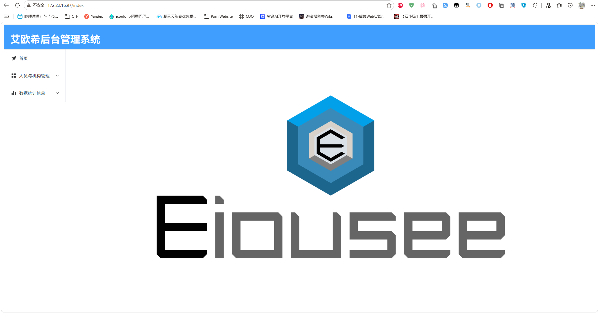

某些容器在创建时自己也会携带一个匿名数据卷，例如上文提到的`mysql`。在`/var/lib/docker/volumes`目录中，可以看到一个名字很奇怪的目录`32857f41d385506ff29ac4b8666ab43bbdd60503a50d50a9f0199c30a6e7b8c0`

```bash
root@DESKTOP-T1OASAN:/home/kiiz# ls /var/lib/docker/volumes/
354529bb7f245d0a7559d0846bf671876757bac5c0ce329811ce94c9d37efc11  backingFsBlockDev  html  metadata.db
```

这个目录实质上就是`mysql`容器创建时自动创建的数据卷，可以通过`mysql`容器的详细信息来查看

```bash
root@DESKTOP-T1OASAN:/home/kiiz# docker inspect mysql | grep -A 10 Mounts
        "Mounts": [
            {
                "Type": "volume",
                "Name": "354529bb7f245d0a7559d0846bf671876757bac5c0ce329811ce94c9d37efc11",
                "Source": "/var/lib/docker/volumes/354529bb7f245d0a7559d0846bf671876757bac5c0ce329811ce94c9d37efc11/_data",
                "Destination": "/var/lib/mysql",
                "Driver": "local",
                "Mode": "",
                "RW": true,
                "Propagation": ""
            }
```

查看其中的内容

```bash
root@DESKTOP-T1OASAN:/home/kiiz# ls /var/lib/docker/volumes/354529bb7f245d0a7559d0846bf671876757bac5c0ce329811ce94c9d37efc11/_data/
 auto.cnf        ca.pem               ib_buffer_pool   mysql                   private_key.pem   undo_001
 binlog.000001   client-cert.pem      ibdata1          mysql.ibd               public_key.pem    undo_002
 binlog.000002   client-key.pem       ibtmp1           mysql.sock              server-cert.pem
 binlog.index   '#ib_16384_0.dblwr'  '#innodb_redo'    mysql_upgrade_history   server-key.pem
 ca-key.pem     '#ib_16384_1.dblwr'  '#innodb_temp'    performance_schema      sys
```

里面存储的是`mysql`的数据内容，包括所有的数据库、数据表、表结构等等。这个目录存在的意义是当容器被删除时，数据库中存储的数据仍能保留在服务器中，以免数据丢失。在容器删除时，并不会自动删除对应的数据卷

```bash
root@DESKTOP-T1OASAN:/home/kiiz# docker rm -f mysql
mysql
root@DESKTOP-T1OASAN:/home/kiiz# docker ps -a
CONTAINER ID   IMAGE          COMMAND                   CREATED             STATUS          PORTS                                 NAMES
a165b28cb672   nginx:1.26.3   "/docker-entrypoint.…"   About an hour ago   Up 31 minutes   0.0.0.0:80->80/tcp, [::]:80->80/tcp   nginx
root@DESKTOP-T1OASAN:/home/kiiz# ls /var/lib/docker/volumes/
354529bb7f245d0a7559d0846bf671876757bac5c0ce329811ce94c9d37efc11  backingFsBlockDev  html  metadata.db
```

#### 本地挂载

数据卷挂载的默认位置其实比较深，而且`docker`目录的权限管理非常严格，因此实际操作中使用默认的数据卷挂载方式非常麻烦。`Docker`也提供了本地挂载的方式，即可以由用户自定义数据卷在宿主机中的挂载路径。本地挂载也是用`-v`参数，如果不以`.`或者`./`开头，`-v`参数默认挂载到`/var/lib/docker/volumes`

```bash
sudo docker run -v abc:abc
```

挂载到`/var/lib/docker/volumes/abc`

```bash
sudo docker run -v /home/kiiz/abc:abc
```

挂载到`~/abc`

**示例**

我们新建一个`mysql`容器，并设置`mysql`的数据源、配置项、初始化脚本为数据卷。首先创建这三个目录，并在初始化脚本中存放建表脚本

```bash
kiiz@DESKTOP-T1OASAN:~/mysql$ ll
总计 20
drwxr-xr-x  5 kiiz kiiz 4096  5月 12 15:24 ./
drwxr-x--- 14 kiiz kiiz 4096  5月 12 15:23 ../
drwxr-xr-x  2 kiiz kiiz 4096  5月 12 15:24 conf/
drwxr-xr-x  2 kiiz kiiz 4096  5月 12 15:23 data/
drwxr-xr-x  2 kiiz kiiz 4096  5月 12 15:29 init/
```

然后创建容器并挂载数据卷，`mysql`的`docker`容器中，数据文件存放在`/var/lib/mysql`，配置文件存放在`/etc/mysql/conf.d`，初始化脚本存放在`/docker-entrypoint-initdb.d`。存放于初始化脚本目录中的所有`sql`文件会在启动时自动执行，因此我们编写或者直接生成对应的`DDL`语句

```mysql
CREATE DATABASE IF NOT EXISTS jdbc;

create table if not exists jdbc.dept
(
    id          int unsigned auto_increment comment '部门编号'
        primary key,
    name        varchar(32) not null comment '部门名称',
    create_time datetime    null comment '创建时间',
    update_time datetime    null comment '修改时间',
    constraint name
        unique (name)
)
    comment '部门表';

create table if not exists jdbc.education
(
    id             int          not null comment '学历编号'
        primary key,
    education_name varchar(255) not null comment '学历名称'
);

create table if not exists jdbc.emp_exp
(
    id         int          not null comment '员工编号',
    start_time date         not null comment '开始时间',
    end_time   date         null comment '结束时间',
    company    varchar(255) null comment '公司名称',
    job        varchar(255) null comment '职位名称',
    primary key (id, start_time),
    constraint chk_date_order
        check (`end_time` > `start_time`)
)
    comment '员工工作经历表';

create table if not exists jdbc.emp_info
(
    id          int auto_increment comment '员工编号'
        primary key,
    name        varchar(255)      not null comment '员工姓名',
    birth       date              not null comment '员工出生日期',
    sex         enum ('男', '女') not null comment '员工性别',
    avatar_path varchar(255)      null comment '员工头像',
    dept_id     int               null comment '员工部门编号',
    job_id      int               null comment '员工职位编号',
    board_date  date              null comment '入职日期',
    update_time datetime          null comment '更新时间',
    constraint emp_info_pk
        unique (name)
)
    comment '员工信息表';

create table if not exists jdbc.job
(
    id    int auto_increment comment '职位编号'
        primary key,
    title varchar(255) not null comment '职位名称'
)
    comment '职位表';

create table if not exists jdbc.major
(
    id         int          not null comment '专业编号'
        primary key,
    major_name varchar(255) not null comment '专业名称',
    constraint major_name
        unique (major_name)
);

create table if not exists jdbc.operation_log
(
    id               int auto_increment comment '编号'
        primary key,
    user_id          int          null comment '员工编号',
    operation_time   datetime     null comment '操作时间',
    operation_class  varchar(255) null comment '操作类名',
    operation_method varchar(255) null comment '操作方法名',
    operation_params text         null comment '操作参数',
    operation_result longtext     null comment '操作结果',
    cost_time        bigint       null comment '操作耗时'
);

create table if not exists jdbc.student
(
    id           int               not null comment '学号'
        primary key,
    name         varchar(255)      not null comment '姓名',
    sex          enum ('男', '女') null comment '性别',
    birth        date              null comment '出生日期',
    class_id     int               null comment '班级编号',
    major_id     int               null comment '专业编号',
    education_id int               null comment '学历编号',
    update_time  datetime          null comment '更新时间'
);

create table if not exists jdbc.student_discipline
(
    student_id        int          null comment '学号',
    discipline_date   date         null comment '违纪时间',
    discipline_reason varchar(255) null comment '违纪原因',
    deduction_points  float        null comment '扣分'
);

create table if not exists jdbc.users
(
    id       int          not null comment '员工编号'
        primary key,
    username varchar(255) not null comment '用户名',
    password varchar(255) not null comment '密码',
    constraint username
        unique (username)
)
```

然后执行容器创建命令

```bash
sudo docker run -d \
	--name mysql \
	-p 3306:3306 \
	-e TZ=Asia/Shanghai \
	-e MYSQL_ROOT_PASSWORD=root \
	-v ./mysql/data:/var/lib/mysql \
	-v ./mysql/init:/docker-entrypoint-initdb.d \
	-v ./mysql/conf:/etc/mysql/conf.d \
	mysql:8
```

> 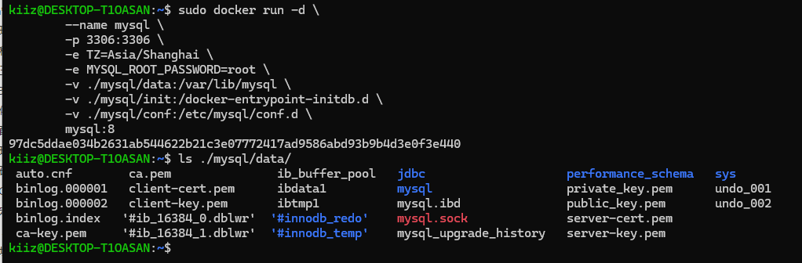

可以看到数据库中也出现了`jdbc`库，我们尝试在`windows`中连接，并查看其中的表是否也正常创建

> 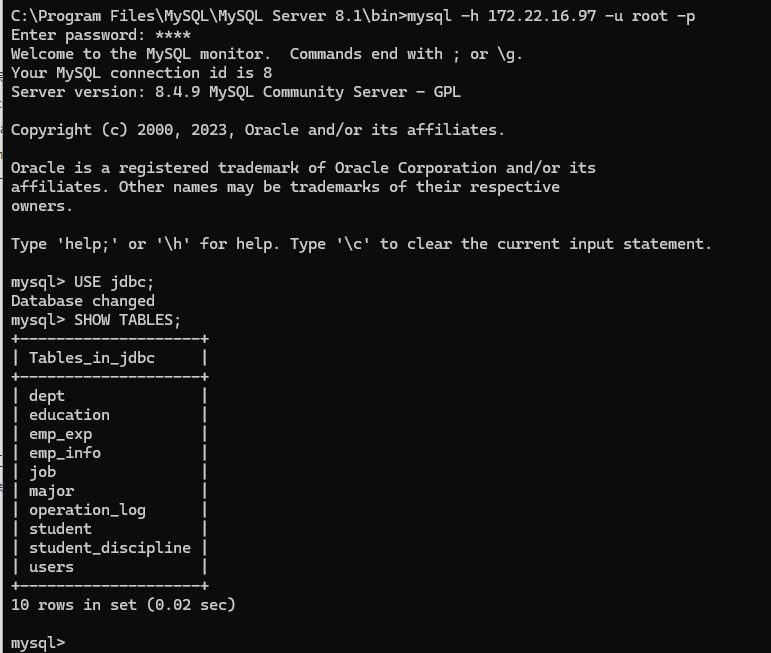

可以看到其中的表也全部成功创建

### 自定义镜像

前端可以通过官方提供的`Nginx`容器进行部署，但是对于后端来说，并没有一个`Java`的官方`Docker`容器，所以就需要开发人员自己定于一个镜像，这个镜像中需要包含完整的`Java`运行环境，以及后端需要的一些环境变量等等

#### Dockerfile

`Dockerfile`本质是一个文本文件，其中包含一个个指令，用于描述要执行什么操作来构建镜像

**API**

| API          | 说明                               | 示例                                  |
| ------------ | ---------------------------------- | ------------------------------------- |
| `FROM`       | 指定基础镜像                       | `FROM Ubuntu:22.04`                   |
| `ENV`        | 设置环境变量                       | `ENV key=value`                       |
| `COPY`       | 将本地目录复制到镜像系统的指定目录 | `COPY ./jdk21.tar.gz /tmp`            |
| `RUN`        | 执行`Linux`的`shell`命令           | `RUN tar -zxvf /tmp/jdk21.tar.gz`     |
| `EXPOSE`     | 指定暴露的端口号                   | `EXPOSE 8080`                         |
| `ENTRYPOINT` | 启动时命令                         | `ENTRYPOINT java -jar webProject.jar` |

#### 快速入门

我们使用`Ubuntu22.04`版本为例，制作一个后端镜像

```dockerfile
# 使用Ubuntu 22.04
FROM ubuntu:22.04

# 添加JDK
COPY jdk21.tar.gz /usr/local/
RUN tar -xzf /usr/local/jdk21.tar.gz -C /usr/local/ && rm /usr/local/jdk21.tar.gz

# 设置环境变量
ENV JAVA_HOME=/usr/local/jdk-21.0.11
ENV PATH=$JAVA_HOME/bin:$PATH

# 创建后端应用目录
RUN mkdir -p /app
WORKDIR /app

# 复制JAR应用程序
COPY app.jar app.jar

# 暴露端口
EXPOSE 8080

# 启动脚本
ENTRYPOINT ["java", "-jar", "/app/app.jar"]
```

接着执行构建镜像的命令

```bash
sudo docker -t <imageName>:<version> <dir>
```

- `imageName`：指定构建的镜像名
- `version`：镜像的版本名，默认为`latest`
- `dir`：构建文件`Dockerfile`所在路径

```bash
sudo docker build -t app:latest .
```

然后查看镜像列表

```bash
kiiz@DESKTOP-T1OASAN:~/webProject$ sudo docker images
                                                                                                   i Info →   U  In Use
IMAGE          ID             DISK USAGE   CONTENT SIZE   EXTRA
app:latest     0e797b3c477b       1.15GB          469MB
mysql:8        6e54d72c66fb       1.12GB          254MB    U
nginx:1.26.3   41b194461e4b        282MB         75.2MB    U
ubuntu:22.04   962f6cadeae0        119MB         31.7MB
```

启动镜像，暴露端口`8080`

```bash
sudo docker run -d \
	--name app \
	-p 8080:8080 \
	-v ./log:/app/log \
	app:latest
```

然后访问后端，成功返回了报错信息

> 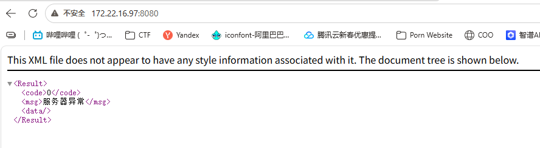

*注：如果`SpringBoot`没有正常启动，那么后端就不会返回正确的`Result`数据，因此这可以证明`SpringBoot`已经正确启动了。或者可以在启动命令中添加一个日志数据卷`-v ./log:/app/log \`，通过日志来确定`SpringBoot`的状态*

> 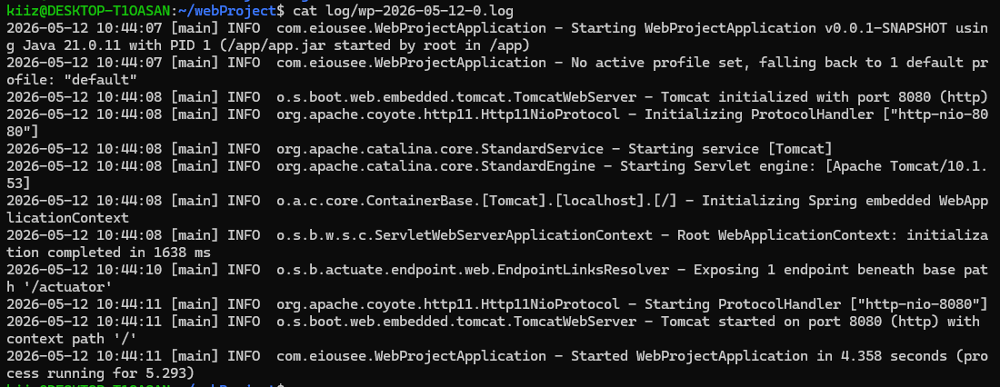

### 网络

在上文搭建的三个容器`mysql`、`Nginx`、`Java`之间，实际上是可以进行通信的，`Docker`容器会默认将系统虚拟网卡`docker0`作为网桥，以`docker0`为网关搭建一个虚拟网段，然后连接到这个局域网中。但实际部署中并不会这么做，因为对于每个`Docker`容器来说，`ip`的分配是随机的，假设后端已经设定好了数据库的`ip`为`172.17.0.2`，但是数据库容器突然出现错误，需要创建新容器，而新容器的`ip`为`172.17.0.4`，此时后端就需要重新改写数据库`ip`，非常繁琐。

为了解决这个问题，`Docker`提供了自定义网络功能，通过`network`命令访问

#### API

| API          | 说明                   |
| ------------ | ---------------------- |
| `create`     | 创建一个网络           |
| `ls`         | 查看所有网络           |
| `rm`         | 删除指定网络           |
| `prune`      | 清除未使用的网络       |
| `connect`    | 使指定容器连接加入网络 |
| `disconnect` | 使指定容器连接断开网络 |
| `inspect`    | 查看网络详细信息       |

#### 快速入门

查看默认的网络环境

```bash
kiiz@DESKTOP-T1OASAN:~$ sudo docker network ls
NETWORK ID     NAME      DRIVER    SCOPE
0af51e3e5eb4   bridge    bridge    local
ef75ad4b26fa   host      host      local
225c8ffedb6d   none      null      local
```

以上三个网络是`Docker`在安装时自动创建的，我们再创建一个网络，命名为`eiousee`

```bash
kiiz@DESKTOP-T1OASAN:~$ sudo docker network create eiousee
683b5a6d4c45264cd360d45b541819601fbd38191de71811994220614c51890e
kiiz@DESKTOP-T1OASAN:~$ sudo docker network ls
NETWORK ID     NAME      DRIVER    SCOPE
0af51e3e5eb4   bridge    bridge    local
683b5a6d4c45   eiousee   bridge    local
ef75ad4b26fa   host      host      local
225c8ffedb6d   none      null      local
```

然后将`mysql`和`app`容器加入`eiousee`网络

```bash
kiiz@DESKTOP-T1OASAN:~/webProject$ sudo docker network connect eiousee mysql
kiiz@DESKTOP-T1OASAN:~/webProject$ sudo docker network connect eiousee app
```

接着进入`app`，使用`getent`测试`mysql`容器的`dns`解析是否正常

```bash
kiiz@DESKTOP-T1OASAN:~$ sudo docker exec -it app bash
root@ba1c51760080:/app# getent hosts mysql
172.18.0.2      mysql
```

正确输出了`mysql`的地址，说明解析成功，然后使用`echo`重定向来测试`TCP`端口的连接

```bash
root@ba1c51760080:/app# (echo > /dev/tcp/mysql/3306) && echo OK || echo FAIL
OK
```

对`mysql`的`3306`端口测试同样通过，说明自定义网络环境已经正确配置好了

### 手动项目部署

现在我们已经了解基础的部署过程，现在来尝试将前后端项目进行完整部署，并保证前端能获取到数据库中的正确数据

1. 修改前后端配置，我们需要将后端`application.yml`中的数据库地址更改为容器名`mysql`，并且配置正确的用户名和密码

```yml
# 数据源
datasource:
    url: jdbc:mysql://mysql:3306/jdbc
    username: root
    password: root
```

2. 在`Dockerfile`中配置阿里云`OSS2`的密钥，以及设置统一编码

```bash
# 阿里云OSS2
ENV OSS_ACCESS_KEY_ID=xxxxxxxxxxxxxxxxxxxxx
ENV OSS_ACCESS_KEY_SECRET=xxxxxxxxxxxxxxxxxxxxxx

# 统一编码
ENV LANG=en_US.UTF-8
ENV LANGUAGE=en_US:en
ENV LC_ALL=en_US.UTF-8
```

3. 重新构建后端镜像

```bash
sudo docker build -t app:0.0.1-SNAPSHOT .
```

4. 创建容器，并指定网络以及`log`目录的数据卷

```bash
sudo docker run -d \
	--name app \
	--network eiousee \
	-p 8080:8080 \
	-v ./log:/app/log \
	app:0.0.1-SNAPSHOT
```

5. 在`mysql`目录中准备好数据表创建文件和数据插入文件。需要注意的是每个文件必须设置编码集，否则中文会乱码

```mysql
SET NAMES utf8mb4 COLLATE utf8mb4_general_ci;

...
```

6. 然后创建`mysql`容器，并加入`eiousee`网络

```bash
sudo docker run -d \
	--name mysql \
	--network eiousee \
	-p 3306:3306 \
	-e TZ=Asia/Shanghai \
	-e MYSQL_ROOT_PASSWORD=root \
	-v ./mysql/data:/var/lib/mysql \
	-v ./mysql/init:/docker-entrypoint-initdb.d \
	-v ./mysql/conf:/etc/mysql/conf.d \
	mysql:8
```

7. 访问`wsl:8080/depts`，查看数据是否正确返回

> 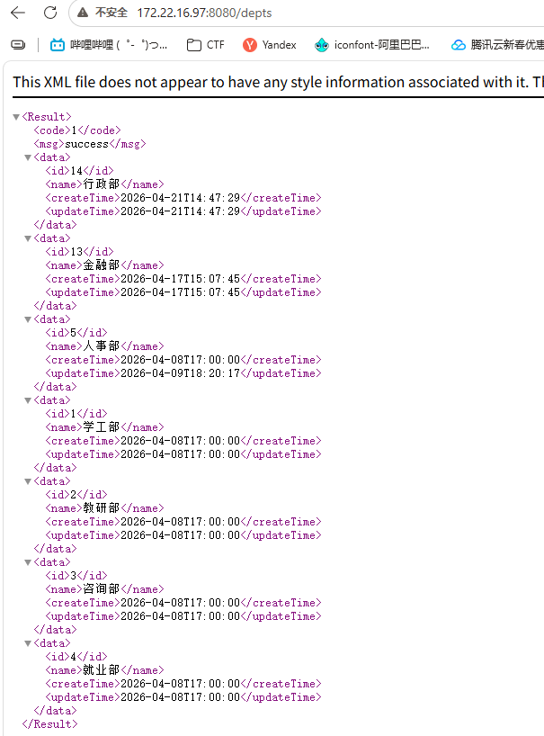

8. 创建`www`目录，以及子目录`html`和配置文件`nginx.conf`

```conf
#user  nobody;
worker_processes  1;

events {
    worker_connections  1024;
}

http {
    include       mime.types;
    default_type  application/octet-stream;

    sendfile        on;
    keepalive_timeout  65;

    server {
        listen       80;
        server_name  localhost;

        root /usr/share/nginx/html;
        index index.html;

        location / {
        }       

        location /api/ {
            proxy_pass http://app:8080/;

            proxy_set_header Host $host;
            proxy_set_header X-Real-IP $remote_addr;
            proxy_set_header X-Forwarded-For $proxy_add_x_forwarded_for;
            proxy_set_header X-Forwarded-Proto $scheme;

            proxy_connect_timeout 60s;
            proxy_read_timeout 60s;
        }

        error_page   500 502 503 504  /50x.html;
        location = /50x.html {
            root   html;
        }
    }
}
```

9. 创建`Nginx`容器，并映射本地目录

```bash
sudo docker run -d \
	--name nginx \
	--network eiousee \
	-p 80:80 \
	-v ./www/html:/usr/share/nginx/html \
	-v ./www/nginx.conf:/etc/nginx/nginx.conf \
	nginx:1.26.3
```

10. 访问前端，并查看是否正确返回结果

> 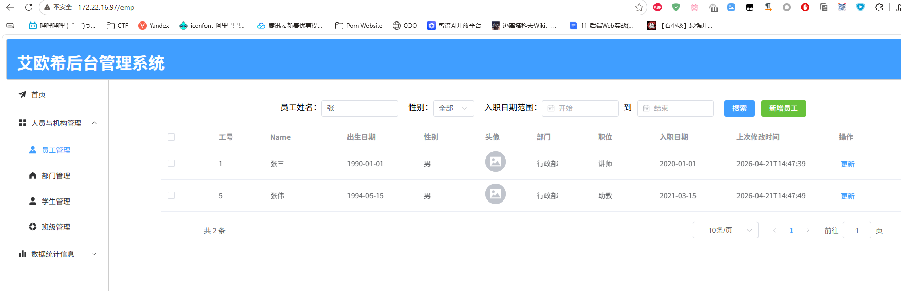

到此，整个项目的手动部署已经基本完成

### DockerCompose

目前的学习中，我们仅仅使用了三个容器来部署项目，但是实际的开发中，可能会使用大量的容器来部署不同的服务组件，各个服务组件之间相互依赖。而且各个容器之间实际上也存在一定的启动次序问题，例如需要先启动`mysql`、再启动`springboot`，最后启动`nginx`。手动部署这些容器非常繁琐，也很容易混淆。因此`Docker`提供了`DockerCompose`来完成自动化项目部署

`DockerCompose`技术通过一份`docker-compose.yml`文件来描述容器结构，通过`docker-compose.yml`文件一键生成所有容器

#### 快速入门

以下是一份创建`mysql`容器的`DockerCompose`文件

```yml
services:
	mysql:
		image: mysql:8
		container_name: mysql
		ports:
			- "3306:3306"
		environment:
			TZ: Asia/Shanghai
			MYSQL_ROOT_PASSWORD: root
		volumes:
			- "./mysql/conf:/etc/mysql/conf.d"
			- "./mysql/data:/var/lib/mysql"
			- "./mysql/init:/docker-entrypoint-initdb.d"
		networks:
			- "app-net"
networks:
	app-net:
		name: app
```

- `services`：容器列表
- `mysql`：容器标识符，表示`docker-compose.yml`文件中的一个容器
- `image`：容器镜像
- `container_name`：真正的容器名
- `ports`：容器端口映射
- `environment`：容器内的环境变量
- `volumes`：容器数据卷
- `mysql-networks`：自定义的容器网络
- `networks`：自定义的网络环境，值为网络环境标识符，而不是网络名
- `app-net`：网络环境标识符，表示`docker-compose.yml`文件中的一个网络
- `name`：真正的网络名

同时，`DockerCompose`也允许直接构建镜像

```yml
services:
	app:
		build:
			context: .
			dockerfile: Dockerfile
		container_name: app
		ports:
			- "8080:8080"
		networks:
        	- "app-net"
        depends_on:
        	- mysql
```

- `build`：表示该容器需要进行镜像构建
- `context`：构建工作目录，相当于`sudo docker build -t xxx:xxx .`最后的`.`
- `dockerfile`：`dockerfile`文件名
- `depends_on`：容器依赖项，只有当对应容器创建完成后，才执行容器创建

#### 自动项目部署

现在已经了解了`DockerCompose`的基本用法，我们来构建一个`docker-compose.yml`进行自动部署

```yml
services:
  mysql:
    image: mysql:8
    container_name: mysql
    ports:
      - "3306:3306"
    environment:
      TZ: Asia/Shanghai
      MYSQL_ROOT_PASSWORD: root
    volumes:
      - "./mysql/conf:/etc/mysql/conf.d"
      - "./mysql/data:/var/lib/mysql"
      - "./mysql/init:/docker-entrypoint-initdb.d"
    networks:
      - app-net
  app:
    build: 
      context: .
      dockerfile: Dockerfile
    container_name: app
    ports:
      - "8080:8080"
    volumes:
      - "./log:/app/log"
    networks:
      - app-net
    depends_on:
      - mysql
  nginx:
    image: nginx:1.26.3
    container_name: nginx
    ports:
      - "80:80"
    volumes:
      - "./www/html:/usr/share/nginx/html"
      - "./www/nginx.conf:/etc/nginx/nginx.conf"
    networks:
      - app-net
    depends_on:
      - app

networks:
  app-net:
    name: app-net
```

##### API

简单了解一下`DockerCompose`的`API`

| API       | 说明                                   |
| --------- | -------------------------------------- |
| `up`      | 通过`docker-compose`创建并启动所有容器 |
| `down`    | 停止并移除所有创建的容器和网络         |
| `ps`      | 列出所有启动的容器                     |
| `logs`    | 查看指定容器的日志                     |
| `stop`    | 停止容器                               |
| `start`   | 启动容器                               |
| `restart` | 重启容器                               |
| `top`     | 查看当前运行的进程                     |

根据`api`，我们将项目部署上线

```bash
kiiz@DESKTOP-T1OASAN:~/webProject$ sudo docker-compose up -d
Creating network "app-net" with the default driver
Creating mysql ... done
Creating app   ... done
Creating nginx ... done
```

然后访问前端页面

> 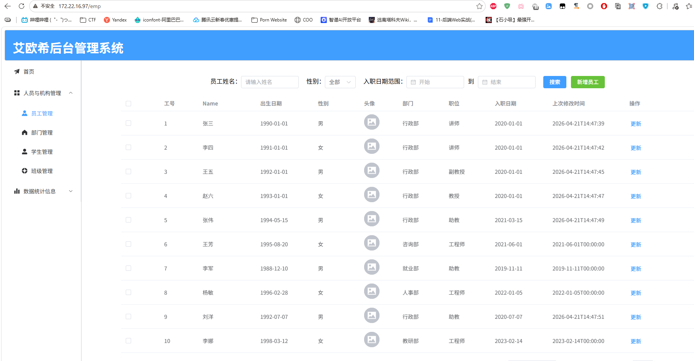

可以看到，项目已经自动部署完成
