# Redis

`更新时间：2026-8-26`

注释解释：

- `<>`必填项，必须在当前位置填写相应数据

- `{}`必选项，必须在当前位置选择一个给出的选项

- `[]`可选项，可以选择填写或忽略

*注：该笔记内的可选项和参数均不完整，如有需要，请查询相关手册*

---

## NoSQL

NoSQL相对SQL，SQL全程Structured Query Language，结构化查询语言，是主流关系型数据库使用的查询语言，使用近似自然语言的命令来构建查询语句，如

```sql
SELET id, username FROM users;
```

NoSQL目前没有官方的名称，一般认为是非结构化查询语言，这并不指一种语言，而是除SQL以外其他数据库及其数据库查询语言的统称，常见的NoSQL数据库包括Redis、MongoDB、ES等等，均使用不同的查询语言与数据结构

常见的NoSQL数据结构有键值对型，如Redis中通过键确定每一条数据值；还有文档型，如ES中，每条数据由文档构成，多个文档构成一个索引；还有如图表型，将每条数据及其数据间的关系以节点的形式来表示，构成复杂的关系网络

而且SQL具有强事务性，SQL数据库必须满足事务的ACID特性，而NoSQL一般不作要求，进满足BASE理论即可，即基本可用、软状态、最终一致性。对于存储方式来说，SQL大多采用磁盘存储，保证数据结构稳定及其数据安全性，避免数据丢失；而NoSQL大多采用内存存储，虽然会使用磁盘作为持久化手段，但是核心数据通常是存储在内存中，一旦服务宕机，很可能造成数据丢失

## Redis

Redis诞生于2009年，全程 Remote Dictionary Server，远程词典服务器，是一个基于内存的键值对型NoSQL数据库，其明显的特征是键值型，value支持多种不同的数据结构，功能丰富。此外，Redis还具备了单线程，每个命令具备原子性，并发安全；延迟极低，速度快，基于内存、IO多路复用和良好的编码；且支持数据持久化，支持主从集群，分片集群、哨兵集群，支持多语言客户端，多个编程语言都可以操作Redis

### Redis数据结构

Redis有很多种数据结构，但是基本数据类型只有五种，分别是String字符串、Hash哈希表、List列表、Set集合、SortedSet排序集合；其余的被称为特殊类型，如GEO地理坐标、BitMap位图、HyperLog超文档等，都是基于基本数据类型构造的特殊数据类型

### Redis通用命令

通用命令是指无需考虑数据类型，所有数据类型下都可以使用的命令，使用命令

```redis
HELP @generic
```

就可以查看所有的通用命令

> 

下面我们罗列几个常用的通用命令，其余的命令可以通过官方文档进行了解学习

#### KEYS

**标准语法**

```redis
KEYS <PATTERN>
```

KEYS命令根据PATTERN来查询匹配的键名，PATTERN不是正则表达式，而是Redis自己的匹配模式，如下

| 匹配符 | 含义                                                     | 示例                                          |
| ------ | -------------------------------------------------------- | --------------------------------------------- |
| ?      | 单字符匹配，该位置可以为任意字符                         | h?llo = hallo、hbllo、hcllo...                |
| *      | 多字符匹配，即通配符                                     | h*llo = hallo、hbllo、haallo、haaallo...      |
| [xy]   | 单字符枚举匹配，该位置可以为[xy]枚举集合中的任意一个字符 | h[ae]llo = hallo、hello                       |
| [^x]   | 前缀匹配，该位置可以为字符x之前的任意一个字符            | h[\^e]llo = hallo、hbllo...hdllo，不包含hello |
| [x-y]  | 单字符范围匹配，改位置可以为x到y之间的任意一个字符       | h[b-e]llo = hbllo、hcllo、hdllo、hello        |

> 

KEYS会执行搜索，而Redis是单线程执行的，所以一旦Redis数据库中的数据量足够庞大，执行KEYS就会造成一定的进程阻塞，无法执行其他命令。因此一般不推荐在开发中使用KEYS命令，或者应当在主从集群的从节点上执行该命令，不影响主节点写命令

#### DEL

**标准语法**

```redis
DEL <KEY> [KEYS...]
```

删除一个或者多个KEY，返回值为删除的KEY数量，当KEY不存在时返回0

> 

#### EXISTS

**标准语法**

```redis
EXISTS <KEY> [KEYS...]
```

判断一个或多个KEY是否存在，返回值为存在的KEY数量

> 

#### EXPIRE

**标准语法**

```redis
EXPIRE <KEY> <SECONDS>
```

为一个KEY设置有效期，单位为秒，有效期到期时，KEY会被自动删除以释放内存，返回值为修改的KEY数量，返回值为0表示KEY不存在

> 

#### TTL

**标准语法**

```redis
TTL <KEY>
```

与EXPIRE相对，查看一个KEY的有效时间，当有效期为-2时表示KEY已经过期

> 

为什么是-2呢，因为Redis将永久有效的KEY的TTL设置为了-1

> 

*注：一般来说，Redis中的KEY都需要设置一个TTL，以避免长期占用内存空间，而每个KEY设置的TTL也不应该相同，避免缓存雪崩*

### String

String类型，也就是字符串类型，是Redis中最简单的存储类型，其value为字符串，根据字符串格式不同，可以将String分为三类

- string：普通字符串
- int：整数类型，可以进行自增自减操作
- float：浮点类型，也可以进行自增自减操作

String底层通过字节数组存储，但是不同的String类型的编码方式不同。String类型的最大空间不能超过512M

#### 常用命令

| 命令        | 标准语法                                                     | 说明                                                         |
| ----------- | ------------------------------------------------------------ | ------------------------------------------------------------ |
| SET         | SET \<KEY\> \<VALUE> [EX SECONDS \| PX MILLISECONDS] [NX \| XX] | 添加或修改一个String类型的KEY，可以携带EX或PX设置过期时间，EX单位为秒，PX单位为毫秒，NX和XX用于指定执行前提，NX表示不存在则执行，XX表示存在则执行，NX和XX一般用于锁 |
| GET         | GET \<KEY>                                                   | 获取一个String类型的KEY的VALUE                               |
| MSET        | MSET \<KEY> \<VALUE> [\<KEYS> \<VALUES>...]                  | 批量添加多个String类型的KEY                                  |
| MGET        | MGET \<KEY> [\<KEYS>...]                                     | 批量获取多个String类型的KEY的VALUE                           |
| INCR        | INCR \<KEY>                                                  | 让一个整型KEY自增1                                           |
| INCRBY      | INCRBY \<KEY> \<INCREMENT>                                   | 让一个整型KEY自增并设置自增步长                              |
| INCRBYFLOAT | INCRBYFLOAT \<KEY> \<INCREMENT>                              | 让一个浮点型KEY自增并设置自增步长                            |
| SETNX       | SETNX \<KEY> \<VALUE>                                        | 如果KEY不存在，则添加一个String类型的KEY                     |
| SETEX       | SETEX \<KEY> \<SECONDS> \<VALUE>                             | 添加一个String类型的KEY，并同时设置TTL                       |

### KEY的分级结构

在Redis中，并不存在类似于SQL中的表结构，所有的KEY统一放置在一个数据库中，这很容易造成KEY的混乱，为了不同的业务使用相同的KEY，Redis支持使用特殊符号作为KEY，其中以分号作为分隔符的KEY会被Redis认为是分级KEY。假设有一个OOEZ语音聊天项目，需要存储语音频道中所有用户的信息，KEY结构如下

```redis
ooez:channel:user:id
```

用户信息的KEY-VALUE结构示例为

| KEY                     | VALUE                          |
| ----------------------- | ------------------------------ |
| ooez:channel:user:20549 | {"id": 20549, "name": "kiiz"}  |
| ooez:channel:user:31160 | {"id": 31160, "name": "ocean"} |

然后再定义一个KEY用于存储频道中的房间信息

```redis
ooez:channel:room:id
```

房间信息KEY-VALUE结构示例为

| KEY                  | VALUE                     |
| -------------------- | ------------------------- |
| ooez:channel:room:14 | {"id": 14, "maxUsers": 5} |
| ooez:channel:room:16 | {"id": 16, "maxUsers": 2} |

通常是使用id作为KEY，而前缀就可以表明KEY所处的业务逻辑，避免KEY重复

### Hash

哈希类型，也叫散列，其VALUE是一个无序字典，类似于Java中的HashMap，如果加上本来的KEY，其数据结构类似于Java中的Map\<String, Map\<String, String>>。哈希的VALUE也是一个键值对，其键被称为Field字段，键值才称为VALUE

#### 常用命令

| 命令    | 标准语法                                                | 说明                                              |
| ------- | ------------------------------------------------------- | ------------------------------------------------- |
| HSET    | HSET \<KEY> \<FIELD> \<VALUE>                           | 添加或修改Hash类型的KEY的FIELD值                  |
| HGT     | HGET \<KEY> \<FIELD>                                    | 获取一个Hash类型的KEY的FIELD值                    |
| HMSET   | HMSET \<KEY> \<FIELD> \<VALUE> [\<FIELDS> \<VALUES>...] | 批量添加多个Hash类型的KEY的FIELD值                |
| HMGET   | HMGET \<KEY> \<FIELD> [\<FIELDS>...]                    | 批量获取多个Hash类型的KEY的FIELD值                |
| HGETALL | HGETALL \<KEY>                                          | 获取一个Hash类型的KEY中的所有FIELD和VALUE         |
| HKEYS   | HKEYS \<KEY>                                            | 获取一个Hash类型的KEY中的所有FIELD                |
| HVALS   | HVALS \<KEY>                                            | 获取一个Hash类型的KEY中的所有VALUE                |
| HINCRBY | HINCRBY \<KEY> \<FIELD> \<INCREMENT>                    | 让一个Hash类型KEY的字段值自增并指定步长           |
| HSETNX  | HSETNX \<KEY> \<FIELD> \<VALUE>                         | 如果FIELD不存在，则添加一个Hash类型的KEY的FIELD值 |

### List

Redis中的List类型与Java中的LinkedList类似，可以看作是一个双向链表结构，既可以正向索引也可以反向索引。其特征也符合双向链表，有序、元素可以重复、插入和删除速度快、查询速度一般。List类型常用来存储一个有序数据，如点赞列表、评论列表等等

#### 常用命令

| 命令   | 标准语法                             | 说明                                                      |
| ------ | ------------------------------------ | --------------------------------------------------------- |
| LPUSH  | LPUSH \<KEY> \<VALUE> [\<VALUES>...] | 向列表左侧插入一个或多个元素                              |
| LPOP   | LPOP \<KEY>                          | 弹出并返回列表左侧的一个元素，没有则返回nil               |
| RPUSH  | RPUSH \<KEY> \<VALUE> [\<VALUES>...] | 向列表右侧插入一个或多个元素                              |
| RPOP   | RPOP \<KEY>                          | 弹出并返回列表右侧的一个元素，没有则返回nil               |
| LRANGE | LRANGE \<KEY> \<START> \<STOP>       | 返回一段角标范围内的所有元素                              |
| BLPOP  | BLPOP \<KEY> [\<KEYS>...] \<TIMEOUT> | 与LPOP类似，但是没有元素时等待指定时间，而不是直接返回nil |

### Set

Redis的Set结构与Java中的HashSet类似，可以看作是一个VALUE为null的HashMap，Set结构底层也是一个哈希表。Set具有的特征有无序、元素不可重复、查找快、支持交集、并集、差集等功能

哈希表底层是通过哈希函数计算元素来获取下标，所以可以保证数据不重复，而相同的数据哈希结果相同，因此查询速度也更快

#### 常用命令

| 命令      | 标准语法                              | 说明                      |
| --------- | ------------------------------------- | ------------------------- |
| SADD      | SADD \<KEY> \<MEMBER> [\<MEMBERS>...] | 向SET中添加一个或多个元素 |
| SREM      | SREM \<KEY> \<MEMBER> [\<MEMBERS>...] | 移除SET中的指定元素       |
| SCARD     | SCARD \<KEY>                          | 返回SET中元素的个数       |
| SISMEMBER | SISMEMBER \<KEY> \<MEMBER>            | 判断一个元素是否存在SET中 |
| SMEMBERS  | SMEMBERS \<KEY>                       | 获取SET中的所有元素       |
| SINTER    | SINTER \<KEY> [\<KEYS>...]            | 求SET集合的交集           |
| SDIFF     | SDIFF \<KEY> [\<KEYS>...]             | 求SET集合的差集           |
| SUNION    | SUNION \<KEY> [\<KEYS>...]            | 求SET集合的并集           |

### SortedSet

Redis的SortedSet是一个可排序的Set集合，与Java中的TreeSet类似，但是底层数据结构差别很大。SortedSet中每一个元素都带有一个score属性，可以基于score属性对元素排序，底层实现是一个跳表加哈希表，详情可见[SortedSet](./JavaWebEnhance.md#SortedSet)。SortedSet的特征有可排序、元素不重复、查询速度快

#### 常用命令

| 命令          | 标准语法                                                     | 说明                                               |
| ------------- | ------------------------------------------------------------ | -------------------------------------------------- |
| ZADD          | ZADD \<KEY> [NX \| XX] [CH] [INCR] \<SCORE> \<MEMBER> [\<SCORES> \<MEMBERS>...] | 添加一个或多个元素到ZSET，如果已经存在则更新其分数 |
| ZREM          | ZREM \<KEY> \<MEMBER> [\<MEMBERS>...]                        | 删除ZSET中的一个指定元素                           |
| ZSCORE        | ZSCORE \<KEY> \<MEMBER>                                      | 获取ZSET指定元素的分数                             |
| ZRANK         | ZRANK \<KEY> \<MEMBER>                                       | 获取ZSET中指定元素的排名                           |
| ZCARD         | ZCARD \<KEY>                                                 | 获取ZSET中元素个数                                 |
| ZCOUNT        | ZCOUNT \<KEY> \<MIN> \<MAX>                                  | 统计分数在指定范围内的所有元素个数                 |
| ZINCRBY       | ZINCRBY \<KEY> \<INCREMENT> \<MEMBER>                        | 让ZSET指定元素自增                                 |
| ZRANGE        | ZRANGE \<KEY> \<START> \<STOP> [WITHSCORES]                  | 按照分数排序，然后获取指定排名范围内的元素         |
| ZRANGEBYSCORE | ZRANGEBYSCORE \<KEY> \<MIN> \<MAX> [WITHSCORES] [LIMIT OFFSET COUNT] | 按照分数排序后，获取指定分数范围内的元素           |
| ZDIFF         | ZDIFF \<NUMKEYS> \<KEY> [\<KEYS>...] [WITHSCORES]            | 求ZSET的差集                                       |
| ZINTER        | ZINTER \<NUMKEYS> \<KEY> [\<KEYS>...] [WEIGHTS \<WEIGHT> [\<WEIGHTS>...]] [AGGREGATE SUM \| MIN \| MAX] [WITHSCORES] | 求ZSET的交集                                       |
| ZUNION        | ZUNION\<NUMKEYS> \<KEY> [\<KEYS>...] [WEIGHTS \<WEIGHT> [\<WEIGHTS>...]] [AGGREGATE SUM | MIN                                                |

*注：ZDIFF、ZINTER、ZUNION都是Redis6.2.0+加入的新命令，如果想要使用，服务端和客户端都需要升级到6.2.0+*

## Redis Java Client

作为Java后端开发人员，我们就需要通过Redis的Java客户端来操作Redis，而Redis官方也罗列了几种Redis的Java客户端供我们选择

| 客户端   | 说明                                                         |
| -------- | ------------------------------------------------------------ |
| Jedis    | 以Redis命令作为方法名称，学习成本低，简单实用。但是Jedis实例是线程不安全的，多线程环境下需要基于连接池来使用 |
| Lettuce  | Lettuce基于Netty实现，支持同步、异步和响应式编程方式，并且是线程安全的，支持Redis哨兵模式、集群模式和管道模式 |
| Redisson | Redisson是一个基于Redis实现的分布式、可伸缩的Java数据结构集合，包含了诸如Map、Queue、Lock、Semaphor、AtomicLong等强大功能 |

### Jedis

#### 快速入门

Jedis上手非常方便，开发人员可以通过几行代码就快速构建一个可用的Resposiroty。首先引入依赖

```xml
<!-- Jedis-->
<dependency>
    <groupId>redis.clients</groupId>
    <artifactId>jedis</artifactId>
    <version>4.3.1</version>
</dependency>
```

然后声明一个Jedis实例

```java
// 声明一个Jedis连接
Jedis jedis = new Jedis("localhost", 6379);
// 选择0号数据库
jedis.select(0);
```

接下来就可以执行Redis命令了，我们打印Redis服务端信息

```java
String server = jedis.info("SERVER");
System.out.println(server);
```

> 

#### Jedis连接池

Jedis本身是线程不安全的，并且频繁地创建和销毁连接会造成性能损耗，因此更推荐使用Jedis连接池代替Jedis直连。我们创建一个工厂类，工厂类中构建Jedis连接池，然后暴露get方法即可

```java
package com.itheima.mp.util;

import lombok.Getter;
import redis.clients.jedis.JedisPool;
import redis.clients.jedis.JedisPoolConfig;

import java.time.Duration;

public class JedisConnectionFactory {

    @Getter
    private static final JedisPool jedisPool;
    private static final String HOST = "localhost";
    private static final Integer PORT = 6379;

    // 初始化连接池
    static {
        // 声明配置对象
        JedisPoolConfig config = new JedisPoolConfig();
        // 配置参数
        config.setMaxTotal(10);
        config.setMaxIdle(10);
        config.setMinIdle(2);
        config.setMaxWait(Duration.ofSeconds(5));
        // 创建连接池对象
        jedisPool = new JedisPool(config, HOST, PORT);
    }
}
```

首先定义私有成员JedisPool，然后通过静态代码块来为其进行初始化赋值，JedisPool需要JedisPoolConfig作为配置，因此需要先声明一个JedisPoolConfig，然后填充参数，如最大连接数、最大空闲连接数、最小空闲连接数、连接等待时间等等，然后将配置传入JedisPool的构造器，构造一个连接池，最后为私有成员添加@Getter注解添加getter方法

### Spring Data Redis

Spring Data是Spring中数据操作的模块，包含对各种数据库的集成，其中对Redis的集成模块叫做Spring Data Redis。此外，Spring Data还提供了如Spring Data JDBC、Spring Data JPA、Spring Data REST、Spring Data Elasticsearch等等

Spring Data Redis提供了对不同Redis客户端的整合，如Lettuce和Jedis，支持Redis的发布订阅模型，支持Redis哨兵和Redis集群，支持基于Lettuce的响应式编程模型，支持基于JDK、JSON、字符串、Spring对象的数据序列化及其反序列化，支持基于Redis的JDK Collection实现

Spring Data Redis提供了RedisTemplate统一API来操作Redis，RedisTemplate将不同的数据类型的操作API封装到了不同的类型中

| API                         | 返回值类型      | 说明                  |
| --------------------------- | --------------- | --------------------- |
| redisTemplate.opsForValue() | ValueOperations | 操作String类型数据    |
| redisTemplate.opsForHash()  | HashOperations  | 操作Hash类型数据      |
| redisTemplate.opsForList()  | ListOperations  | 操作List类型数据      |
| redisTemplate.opsForSet()   | SetOperations   | 操作Set类型数据       |
| redisTemplate.opsForZset()  | ZSetOperations  | 操作SortedSet类型数据 |
| redisTemplate               |                 | 通用命令              |

#### 快速入门

首先引入依赖

```xml
<!-- spring data redis-->
<dependency>
    <groupId>org.springframework.boot</groupId>
    <artifactId>spring-boot-starter-data-redis</artifactId>
</dependency>
<!-- apache 连接池-->
<dependency>
    <groupId>org.apache.commons</groupId>
    <artifactId>commons-pool2</artifactId>
</dependency>
```

Spring Data Redis的版本号依赖Spring Boot父工程的版本，所以不需要手动指定。而Apache Pool则负责构建连接池

在引入依赖完成后，在配置文件中配置Redis

```yml
spring:
  redis:
    host: localhost
    port: 6379
    lettuce:
      pool:
        max-active: 8
        max-idle: 8
        min-idle: 2
        max-wait: 1000
```

然后就按照Spring的标准方式，注入RedisTemplate，获取Redis数据

```java
@Autowired
private RedisTemplate redisTemplate;

@Test
void test() {
    redisTemplate.opsForValue().set("name", "Ocean");
    Object name = redisTemplate.opsForValue().get("name");
    System.out.println(name);
}
```

但是当我们尝试通过redis-cli访问name时，却发现name并不存在

> 

查看当前所有KEY，只有一个以name结尾的KEY，\xac\xed\x00\x05t\x00\x04name

> 

#### 序列化器

这源于Spring Data Redis默认选择的序列化器，Spring Data Redis默认选择了JDK的序列化器，而JDK序列化器会将所有的KEY和VALUE直接转换为字节数组，同时加入一些额外的标识符，因此会生成这样的字节数据

如果希望Spring Data Redis直接输出可读的KEY和VALUE，就需要更改其序列化器，默认的序列化器实现其实有很多种

> 

而常用的就是StringRedisSerializer和Jackson2JsonRedisSerializer。修改的方式则是定义一个配置类，主动声明一个Bean返回RedisTemplate，而这个RedisTemplate就是已经修改好序列化器的RedisTemplate

```java
import org.springframework.context.annotation.Bean;
import org.springframework.context.annotation.Configuration;
import org.springframework.data.redis.connection.RedisConnectionFactory;
import org.springframework.data.redis.core.RedisTemplate;
import org.springframework.data.redis.serializer.GenericJackson2JsonRedisSerializer;
import org.springframework.data.redis.serializer.RedisSerializer;

@Configuration
public class RedisConfiguration {

    @Bean
    public RedisTemplate<String, Object> redisTemplate(RedisConnectionFactory redisConnectionFactory) {
        // 创建RedisTemplate对象
        RedisTemplate<String, Object> redisTemplate = new RedisTemplate<>();
        // 设置连接工厂
        redisTemplate.setConnectionFactory(redisConnectionFactory);
        // 设置KEY序列化器
        redisTemplate.setKeySerializer(RedisSerializer.string());
        redisTemplate.setHashKeySerializer(RedisSerializer.string());
        // 设置VALUE序列化器
        redisTemplate.setValueSerializer(RedisSerializer.json());
        redisTemplate.setHashValueSerializer(RedisSerializer.json());
        // 返回
        return redisTemplate;
    }
}
```

需要注意的是这里直接使用了RedisSerializer的string和json方法来快捷获取序列化器实例，就不需要我们手动声明了

```java
/**
 * Obtain a {@link RedisSerializer} that can read and write JSON using
 * <a href="https://github.com/FasterXML/jackson-core">Jackson</a>.
 *
 * @return never {@literal null}.
 * @since 2.1
 */
static RedisSerializer<Object> json() {
    return new GenericJackson2JsonRedisSerializer();
}

/**
 * Obtain a simple {@link java.lang.String} to {@literal byte[]} (and back) serializer using
 * {@link java.nio.charset.StandardCharsets#UTF_8 UTF-8} as the default {@link java.nio.charset.Charset}.
 *
 * @return never {@literal null}.
 * @since 2.1
 */
static RedisSerializer<String> string() {
    return StringRedisSerializer.UTF_8;
}
```

然后我们通过redis-cli创建name，值设置为Ki1z，再通过Spring Data Redis读取

> 

> 

可以看到出现了报错，但其实并不是无法读取的报错，而是序列化器无法对其反序列化的报错，我们直接写入的`Ki1z`并不是标准JSON，所以无法进行转换。下面我们更改为标准的`"Ki1z"`

> 

> 

#### StringRedisTemplate

刚才我们尝试了读取String类型，而Jackson2Json还支持直接的对象插入

```java
@Test
void test() {
    User user = new User("Ki1z", "123456");
    redisTemplate.opsForValue().set("user", user);
    System.out.println(redisTemplate.opsForValue().get("user"));
}

@AllArgsConstructor
@NoArgsConstructor
@Data
static class User {
    private String username;
    private String password;
}
```

> 

然后我们通过DataGrip来观察实际存入Redis的数据

> 

不难发现，Jackson为了保证反序列化的正确性，在JSON插入一了一条类信息，标识该对象所属的实体类。但另一方面，这些多余的数据会造成大量的额外内存占用，如图中的@class字段，占用空间比原本的User还长，所以我们不能使用Jackson的自动反序列化

而作为开发人员，我们知道Redis中存储的数据对应的实体类，因此我们只用进行手动反序列化即可。而在Redis中，只需要保存原本的JSON字符串即可，而JSON字符串的本质是String，所以只需要将Redis的序列化器都设置为StringRedisSerializer。而Spring Data Redis其实已经预先提供好了KEY和VALUE的序列化器都是String的模板，这就是StringRedisTemplate

下面我们利用StringRedisTemplate来传入User对象

```java
@Autowired
private StringRedisTemplate redisTemplate;

@Test
void test() throws JsonProcessingException {
    User user = new User("Ki1z", "123456");
    ObjectMapper objectMapper = new ObjectMapper();
    // 将对象转为JSON字符串
    String json = objectMapper.writeValueAsString(user);

    redisTemplate.opsForValue().set("user", json);
    json = (String) redisTemplate.opsForValue().get("user");
    User user1 = objectMapper.readValue(json, User.class);
    System.out.println(user1);
}

@AllArgsConstructor
@NoArgsConstructor
@Data
static class User {
    private String username;
    private String password;
}
```

注入StringRedisTemplate，然后声明ObjectMapper用于转换JSON，转换完成后传入Redis，最后再通过ObjectMapper反序列化为User

> 

## 黑马点评

下面我们将依据黑马点评项目，通过Redis来学习并解决实际开发中可能遇到的各种问题，如短信登录、点赞列表、点赞排行榜、好友关注、用户签到、UV统计、附近商户、优惠券秒杀、查询缓存等，从实际开发中逐步深入了解Redis

> 

### 基于Session实现登录

在项目搭建完成后，我们开始逐步实现项目中未完成的功能，首先是基于Session实现登录功能。不过并不是真的只通过Session，而是通过短信登录验证，在发送验证码后，通过Session在服务端保存验证码，并在校验时取出验证，这就是基于Session实现登录

在编写代码之前，我们先来分析一下基于Session实现登录的步骤。基于Session实现登录可以分为三个模块，发送验证码、接收验证码进行登录、校验登录状态。在发送验证码模块中，首先由用户提交手机号，然后后端生成一个验证码，将验证码保存在Session中以供下游调用，然后再向用户发送验证码；在接收验证码模块中，后端获取用户提交的手机号和验证码，然后从Session中取出验证码进行校验，如果校验通过，则从数据库中查询该用户信息，查询通过则保存用户登录信息到Session，而不存在的用户则直接进行快捷注册，然后保存用户信息到Session；在校验登录模块，从Session中获取用户信息，判断用户信息是否合法，再将用户信息保存在ThreadLocal中，供下文直接调用

#### 发送短信验证码

在黑马点评项目中，点击“我的”就会跳转到个人页面，未登录的情况下重定向到登录页面

> 

输入手机号，点击发送验证码，前端就会向后端发送一条请求

> 

然后我们基于这个请求路径来编写业务逻辑

```java
@PostMapping("code")
public Result sendCode(@RequestParam("phone") @NotBlank String phone, HttpSession session) {
    log.debug("发送验证码，手机号：{}", phone);
    return userService.sendCode(phone, session);
}
```

```java
@Override
public Result sendCode(String phone, HttpSession session) {
    // 检查手机号
    if (RegexUtils.isPhoneInvalid(phone)) {
        return Result.fail("手机号格式错误");
    }
    // 生成验证码
    String code = RandomUtil.randomNumbers(4);
    // 保存验证码
    session.setAttribute("code", code);
    // 发送验证码
    log.debug("发送验证码成功，验证码: {}", code);
    // 返回结果
    return Result.ok("发送成功，验证码5分钟内有效");
}
```

在Service中，首先通过RegexUtils工具类检查手机号格式，然后通过随机数生成器生成一个四位数验证码，再将验证码保存到Session中，发送验证码，并返回结果。如果要发送真实的短信验证码需要调用第三方服务，还会造成短信资费，因此我们选择使用log模拟发送

> 

#### 接收验证码与登录校验

```java
@PostMapping("/login")
public Result login(@RequestBody @Valid LoginFormDTO loginForm, HttpSession session){
    log.debug("登录，参数：{}", loginForm);
    return userService.login(loginForm, session);
}
```

```java
@Transactional
@Override
public Result login(LoginFormDTO loginForm, HttpSession session) {
    String phone = loginForm.getPhone();
    if (RegexUtils.isPhoneInvalid(phone)) {
        return Result.fail("手机号格式错误");
    }
    String code = loginForm.getCode();
    String password = loginForm.getPassword();
    if (code != null && !code.isEmpty()) {
        // 验证码登录
        // 从Session中获取验证码
        String cacheCode = (String) session.getAttribute("code");
        // 判断验证码是否一致
        if (cacheCode == null || !cacheCode.equals(code)) {
            return Result.fail("验证码错误");
        }
        // 验证通过，删除验证码
        session.removeAttribute("code");
        // 查询用户
        User user = query().eq("phone", phone).one();
        if (user == null) {
            // 用户不存在，注册用户
            user = registerByPhone(phone);
        }
        // 登录成功，保存用户信息到Session中
        session.setAttribute("user", user);
        return Result.ok("登录成功");

    } else if (password != null && !password.isEmpty()) {
        return Result.fail("密码登录功能未完成");
    } else {
        return Result.fail("密码或验证码不能为空");
    }
}

@Transactional
public User registerByPhone(String phone) {
    User user = User.builder()
            .id(IdWorker.getId())
            .phone(phone)
            .nickName("用户" + RandomUtil.randomString(10))
            .build();
    int insert = userMapper.insert(user);
    if (insert <= 0) {
        throw new RuntimeException("注册失败");
    }
    return user;
}
```

由于密码登录与验证码登录使用同一个接口，为了方便开发，这里就只做验证码登录的逻辑。首先验证登录的额表单信息，然后从Session中获取验证码，并判断与用户提交的是否一致，验证成功后，删除验证码，并从数据库中查询用户信息，如果用户不存在，则注册一个新用户，最后将用户信息保存到Session中

#### 校验登录状态

登录状态的校验不能部署在接口处，因为这会导致每个接口占用大量的代码去编写校验逻辑，而Spring中则提供了Interceptor来统一拦截请求，所以我们将登录校验逻辑安排在Interceptor中

```java
package com.hmdp.interceptor;

import com.hmdp.dto.UserDTO;
import com.hmdp.entity.User;
import com.hmdp.utils.UserHolder;
import org.springframework.stereotype.Component;
import org.springframework.web.servlet.HandlerInterceptor;

import javax.servlet.http.HttpServletRequest;
import javax.servlet.http.HttpServletResponse;

public class LoginInterceptor implements HandlerInterceptor {

    @Override
    public boolean preHandle(HttpServletRequest request, HttpServletResponse response, Object handler) throws Exception {
        // 获取用户信息
        User user = (User) request.getSession().getAttribute("user");
        if (user == null) {
            response.setStatus(401);
            return false;
        }
        // 保存到上下文中
        UserDTO userDTO = UserDTO.builder()
                .id(user.getId())
                .icon(user.getIcon())
                .nickName(user.getNickName())
                .build();
        UserHolder.saveUser(userDTO);
        // 放行
        return true;
    }

    @Override
    public void afterCompletion(HttpServletRequest request, HttpServletResponse response, Object handler, Exception ex) throws Exception {
        // 移除用户
        UserHolder.removeUser();
    }
}
```

定义LoginInterceptor实现HandlerInterceptor，并实现方法preHandle和afterCompletion，在preHandle中从Session中获取用户信，然后保存到上下文中，而afterCompletion负责在登录校验完成后清除上下文

```java
package com.hmdp.config;

import com.hmdp.interceptor.LoginInterceptor;
import org.springframework.context.annotation.Configuration;
import org.springframework.web.servlet.config.annotation.InterceptorRegistry;
import org.springframework.web.servlet.config.annotation.WebMvcConfigurer;

@Configuration
public class MvcConfig implements WebMvcConfigurer {

    @Override
    public void addInterceptors(InterceptorRegistry registry) {
        registry.addInterceptor(new LoginInterceptor())
                .excludePathPatterns(
                        "/user/code",
                        "/user/login",
                        "/shop/**",
                        "/voucher/**",
                        "/blog/hot",
                        "/shop-type/**",
                        "/upload/**"
                );
    }
}
```

然后定义MvcConfig，实现WebMvcConfigurer，拦截器想要生效必须由registry通过addInterceptor方法注册，并指定排除路径。这样就可以实现登录校验了，我们登录一个账号，然后访问个人中心，即可查看个人信息

> 

### 基于Redis实现登录

Session有一个很明显的缺点，不支持分布式或者集群。简单来说，如果部署了多台Tomcat服务器，服务器中运行相同的项目实例，但是每台Tomcat的Session是不共享的，虽然Tomcat支持启用某些功能以共享数据，但是从性能和安全性上来说都不太合适。而登录校验是一项频繁访问的业务，服务器通常需要满足延迟低、高并发等要求，Redis则刚好符合这些要求

简单分析一下基于Redis实现登录的步骤，在发送验证码时，后端直接将验证码与手机号信息保存在Redis中，用户登录时从Redis中获取验证码进行验证，验证通过后，再将用户信息保存在Redis中，供接口调用。但这里会出现一个问题，Redis中用户信息的KEY该如何确定，这个KEY会保存在用户浏览器中，浏览器访问接口时携带这个KEY，拦截器拦截请求后，通过KEY访问并获取用户信息，再填入ThreadLocal中。因此KEY不能包含任何用户信息，KEY也需要保证唯一性，那么一串随机的字符串刚好可以作为KEY，这也让KEY伪造的难度大大提高。而目前主流的随机字符串中，UUID的使用相当广泛

#### 代码改造

在改造业务代码之前，我们先定以一个Redis的操作类，Redis属于数据库，所以Redis操作类一般属于DAO层，我们定义为RedisRepository

```java
package com.hmdp.repository;

import lombok.RequiredArgsConstructor;
import org.springframework.context.annotation.Lazy;
import org.springframework.data.redis.core.StringRedisTemplate;
import org.springframework.stereotype.Repository;

import java.time.Duration;

@Repository
@RequiredArgsConstructor
public class RedisRepository {

    private final StringRedisTemplate stringRedisTemplate;

    public void set(String key, String value, Long timeout) {
        stringRedisTemplate.opsForValue().set(key, value);
        stringRedisTemplate.expire(key, Duration.ofSeconds(timeout));
    }

    public String get(String key) {
        return stringRedisTemplate.opsForValue().get(key);
    }

    public void hashSet(String key, String field, String value, Long timeout) {
        stringRedisTemplate.opsForHash().put(key, field, value);
        stringRedisTemplate.expire(key, Duration.ofSeconds(timeout));
    }

    public String hashGet(String key, String field) {
        return (String) stringRedisTemplate.opsForHash().get(key, field);
    }

    public void delete(String key) {
        stringRedisTemplate.delete(key);
    }

    public void expire(String key, Long timout) {
        stringRedisTemplate.expire(key, Duration.ofSeconds(timout));
    }
}
```

在RedisRepository中，注入StringRedisTemplate，封装一些常用方法，并同时设置过期时间，避免KEY永远存在Redis中。然后就可以开始改造原始代码了

```java
@Override
public Result sendCode(String phone, HttpSession session) {
    // 检查手机号
    if (RegexUtils.isPhoneInvalid(phone)) {
        return Result.fail("手机号格式错误");
    }
    // 生成验证码
    String code = RandomUtil.randomNumbers(4);
    // 保存验证码
    redisRepository.set(RedisKeyConstant.LOGIN_CODE_KEY + phone, code, RedisKeyConstant.LOGIN_USER_TTL);
    // 发送验证码
    log.debug("发送验证码成功，验证码: {}", code);
    // 返回结果
    return Result.ok("发送成功，验证码5分钟内有效");
}
```

在发送验证码方法中，原来是将验证码保存在Session中，现在改为通过redisRepository保存在Redis中，以用户手机号为键，TTL规范为一个常量

```java
package com.hmdp.constants;

import cn.hutool.core.util.RandomUtil;

public class RedisKeyConstant {
    public static final String LOGIN_CODE_KEY = "login:code:";          // 登录验证码
    public static final Long LOGIN_USER_TTL = 5 * 60L + RandomUtil.randomLong(0, 60);                  // 登录验证码有效期

    public static final String USER_INFO_KEY = "user:info:";            // 用户信息
    public static final Long USER_INFO_TTL = 30 * 60L + RandomUtil.randomLong(0, 60);         // 用户信息保存有效期
}
```

常量中定义需要的键名和TTL，同时保证TTL包含随机值，避免同一时间失效大量KEY，造成雪崩

```java
@Transactional
@Override
public Result login(LoginFormDTO loginForm, HttpSession session) throws JsonProcessingException {
    String phone = loginForm.getPhone();
    if (RegexUtils.isPhoneInvalid(phone)) {
        return Result.fail("手机号格式错误");
    }
    String code = loginForm.getCode();
    String password = loginForm.getPassword();
    if (code != null && !code.isEmpty()) {
        // 验证码登录
        // 从Redis中获取验证码
        String cacheCode = redisRepository.get(RedisKeyConstant.LOGIN_CODE_KEY + phone);
        // 判断验证码是否一致
        if (cacheCode == null || !cacheCode.equals(code)) {
            return Result.fail("验证码错误");
        }

        // 验证通过，删除验证码
        redisRepository.delete(RedisKeyConstant.LOGIN_CODE_KEY + phone);
        // 查询用户
        User user = query().eq("phone", phone).one();
        if (user == null) {
            // 用户不存在，注册用户
            user = registerByPhone(phone);
        }

        // 登录成功，保存用户信息到Redis中
        // 生成token
        String token = UUID.randomUUID().toString().replaceAll("-", "");
        // 将用户信息转换为JSON
        UserDTO userDTO = UserDTO.builder()
                .id(user.getId())
                .icon(user.getIcon())
                .nickName(user.getNickName())
                .build();
        ObjectMapper objectMapper = new ObjectMapper();
        String userJson = objectMapper.writeValueAsString(userDTO);
        // 保存用户信息到Redis中
        redisRepository.set(RedisKeyConstant.USER_INFO_KEY + token, userJson, RedisKeyConstant.USER_INFO_TTL);
        // 返回token
        return Result.ok(token);

    } else if (password != null && !password.isEmpty()) {
        return Result.fail("密码登录功能未完成");
    } else {
        return Result.fail("密码或验证码不能为空");
    }
}
```

然后是登录方法，登录方法中验证通过，删除Redis中的验证码，然后将用户信息保存到Redis中，键为UUID随机数，最后返回token，这个token前端会作为请求头authorization的值，在后续请求中每次携带

> 

```java
@Override
public boolean preHandle(HttpServletRequest request, HttpServletResponse response, Object handler) throws Exception {
    // 从请求头中获取token
    String token = request.getHeader("authorization");
    if (token == null) {
        response.setStatus(401);
        return false;
    }
    // 查询用户
    String userJson = redisRepository.get(RedisKeyConstant.USER_INFO_KEY + token);
    if (userJson == null) {
        response.setStatus(401);
        return false;
    }
    UserDTO user = new ObjectMapper().readValue(userJson, UserDTO.class);
    // 保存到上下文中
    UserHolder.saveUser(user);
    // 更新Redis中的用户信息TTL
    redisRepository.expire(RedisKeyConstant.USER_INFO_KEY + token, RedisKeyConstant.USER_INFO_TTL);
    // 放行
    return true;
}
```

最后是拦截器，拦截器不再拦截Session，而是获取请求头中的authorization头，通过authorization作为键名访问键值，如果没有则表示authorization过期或者伪造，从而返回401。最后将用户信息反序列化为UserDTO实体，最后放行

### 商户查询缓存

#### 代码改造

在黑马点评项目中，商户信息是一个高频访问的接口，所有的用户在选择商户时肯定都会访问商户信息的页面，因此我们需要为商户信息接口添加缓存

> 

```java
/**
 * 根据id查询商铺信息
 * @param id 商铺id
 * @return 商铺详情数据
 */
@GetMapping("/{id}")
public Result queryShopById(@PathVariable("id") Long id) {
    return Result.ok(shopService.getById(id));
}
```

追踪到原始代码，可以发现后端是直接调用IServer提供的getById方法，通过数据库返回数据，高并发情况下，这会对数据库服务造成很大的性能影响，因此我们将其改造为Redis缓存架构

首先来分析如何改造，Redis基于内存，拥有强大的高并发读写能力，因此在请求直达数据库之前，可以先在Redis处进行分流，我们将数据库中的数据缓存到Redis中，如果Redis拥有缓存，则直接返回，这就可以避免大量请求直接抵达数据库。即使Redis中没有数据，也可以先放行一个请求到达数据库，然后由后端将数据库中的数据缓存到Redis中，后续的请求在Redis处就可以直接返回

```java
@Override
public Result queryById(@NotNull Long id) {
    // 查询Redis中是否存在缓存
    String shopJson = redisRepository.get(RedisKeyConstant.CACHE_SHOP_INFO_KEY + id);
    // 缓存命中
    if (shopJson != null) {
        Shop shop = JSONUtil.toBean(shopJson, Shop.class);
        return Result.ok(shop);
    }
    // 缓存未命中，查询数据库
    Shop shop = this.getById(id);
    // 数据库中不存在，返回错误
    if (shop == null) {
        return Result.fail("店铺不存在");
    }
    // 数据库中存在，写入Redis缓存
    shopJson = JSONUtil.toJsonStr(shop);
    redisRepository.set(RedisKeyConstant.CACHE_SHOP_INFO_KEY + id, shopJson, RedisKeyConstant.CACHE_SHOP_INFO_TTL);
    // 返回结果
    return Result.ok(shop);
}
```

改造的代码与我们预先的设计基本相同，首先通过redisRepository获取Redis中对应KEY，如果缓存命中，则直接封装为shop实体然后返回，这里注意不要使用Jackson，该项目自然的Jackson版本可能过于老旧，不对LocalDateTime适配，这会导致序列化的数据中将LocalDateTime识别为一个额外的对象，从而进一步序列化LocalDateTime中的各种属性。缓存未命中，则从数据库中查询，如果数据库中也不存在数据，则认为该店铺不存在，返回错误。最后将数据库中的数据序列化为JSON，写入Redis，然后返回到前端

#### 缓存更新策略

缓存更新策略大致可以分为三种，内存淘汰、超时剔除和主动更新

| 更新策略 | 说明                                                         | 数据一致性 | 维护成本 |
| -------- | ------------------------------------------------------------ | ---------- | -------- |
| 内存淘汰 | 不用自己维护，利用Redis的内存淘汰机制，当内存不足时自动淘汰部分数据，下次查询时更新缓存 | 差         | 无       |
| 超时剔除 | 给缓存数据添加TTL时间，到期后自动删除缓存，下次查询时更新缓存 | 一般       | 低       |
| 主动更新 | 编写业务逻辑，在修改数据库的同时更新缓存                     | 好         | 高       |

对于低一致性要求的业务，可以使用内存淘汰机制，缓存不一致对业务几乎不产生影响；而对于高一致性要求的业务，则应当根据实际要求制定适当的缓存更新策略

主动更新一般可以分为三类，这在[缓存一致性](./JavaWebEnhance.md#缓存一致性)中也有阐述，这里简单概述一下。主动更新在企业中一般有三种模式，Cache Aside、Read/Write Through和Write Behind，Cache Aside要求开发人员独立完成缓存和数据库业务，而另外两种方式则不需要开发人员兼顾缓存和数据库，Read/Write Through侧重于无感知开发，将数据存储服务独立出来，业务开发人员不需要关心到底是缓存还是数据库，所有的存储细节由存储服务实现；Write Behind侧重于缓存存储，开发人员只操作缓存，数据库的存储由独立线程周期异步执行，强调最终一致性

一般来说，企业通常会选择Cache Aside模式，小部分业务选择Write Behind，而Read/Write Through基本不考虑

```java
@Override
@Transactional
public Result updateByIdWithCache(@NotNull Shop shop) {
    if (shop == null || shop.getId() == null) {
        return Result.fail("店铺不存在");
    }
    // 更新数据库
    boolean update = this.updateById(shop);
    if (!update) {
        throw new RuntimeException("更新店铺信息失败");
    }
    // 删除Redis缓存
    redisRepository.delete(RedisKeyConstant.CACHE_SHOP_INFO_KEY + shop.getId());
    return Result.ok();
}
```

我们为店铺信息缓存构建更新策略，在更新数据库后立即删除缓存，以保证数据一致性

### 缓存穿透

理论详见[缓存穿透](./JavaWebEnhance.md#缓存穿透)

#### 缓存空对象

对店铺信息缓存建立缓存穿透防御措施，采用缓存空对象方案

```java
@Override
public Result queryById(@NotNull Long id) {
    // 查询Redis中是否存在缓存
    String shopJson = redisRepository.get(RedisKeyConstant.CACHE_SHOP_INFO_KEY + id);
    // 缓存命中
    if (shopJson != null && !StrUtil.isBlank(shopJson)) {
        Shop shop = JSONUtil.toBean(shopJson, Shop.class);
        return Result.ok(shop);
    }
    // 缓存命中，但为空对象，返回错误
    if (StrUtil.isBlank(shopJson)) {
        return Result.fail("店铺不存在");
    }
    // 缓存未命中，查询数据库
    Shop shop = this.getById(id);
    // 数据库中不存在，建立缓存空对象，并返回
    if (shop == null) {
        redisRepository.set(RedisKeyConstant.CACHE_SHOP_INFO_KEY + id, "", RedisKeyConstant.CACHE_NONE_TTL);
        return Result.fail("店铺不存在");
    }
    // 数据库中存在，写入Redis缓存
    shopJson = JSONUtil.toJsonStr(shop);
    redisRepository.set(RedisKeyConstant.CACHE_SHOP_INFO_KEY + id, shopJson, RedisKeyConstant.CACHE_SHOP_INFO_TTL);
    // 返回结果
    return Result.ok(shop);
}
```

先前我们判断缓存是否命中是通过shopJson != null，一旦引入缓存空对象，就必须再判断字符串本身是否是空对象，然后再决定是否拦截。而对于缓存和数据都未命中的数据，先前是直接返回错误，现在需要建立一个该KEY的缓存空对象，TTL设置为空对象特定的短TTL，避免长时间占用内存，然后再返回错误

#### 布隆过滤器

这里详细讲解一下布隆过滤器，布隆过滤器本质上是一种用 位数组 + 多个哈希函数 实现的空间高效、概率型数据结构，用于快速判断元素是否属于某个集合。它的特点是判断不存在绝对准确，判断存在可能有误判，但绝不会出现漏判
$$
\begin{array}{l}

\large \textbf{概念} \\

布隆过滤器核心由两部分构成 \\

\bullet \quad 一个二进制，也就是位数组，长度为m，初始值全为0 \\

\bullet \quad k个独立的哈希函数，分别记为h_1，h_2，h_3...，h_k，每个函数都可以将输入映射到[0,m)范围内的某一个位置 \\

\\

\large \textbf{插入} \\

当需要插入元素x时，使用k个哈希函数分别计算h_1(x)，h_2(x)，h_3(x)，...，h_k(x) \\

然后将数组中对应位置全部置为1 \\

例如，插入苹果apple，假设k=3，哈希结果为2，5，8，则bit[2]、bit[5]、bit[8]都置为1 \\

\\

\large \textbf{查询} \\

当查询元素y是否存在时，也按照这个顺序 \\

首先计算h_1(y)，h_2(y)，h_3(y)，...，h_k(y) \\

检查对应位置是否全部为1 \\

\bull \quad 如果任何一个位置为0 \Rightarrow 元素y一定不存在 \\

\bull \quad 如果全部为1 \Rightarrow 元素y可能存在，这些1可能是其他元素造成的碰撞 \\

\\

\large \textbf{关键数学公式} \\

误判率(False \ Positive \ Rate)的近似公式为 \\

\hfill p \approx (1-e^{-kn/m})^{k} \hfill \\ 

其中m为数组长度，n表示已插入的元素数量，k表示哈希函数个数 \\

从这个公式出发，我们可以得到最优哈希函数个数公式 \\

\hfill k = \frac{m}{n}\ln{2} \hfill \\

如果给定误判率p和元素数量n，所需数组长度公式 \\

\hfill m = -\frac{n\ln{p}}{(\ln{2})^2} \hfill
\end{array}
$$
当然，布隆过滤器并不是万能的，也有自己的一些优缺点

优点：布隆过滤器空间效率极高，同样存储一百万条数据仅占用约1.2MiB空间，而Redis的HashSet需要约50MiB；其次，查询速度快，布隆过滤器底层数据结构为数组，布隆过滤器通过数据下标查询元素，k个哈希函数的情况下，每个哈希函数进行一次查找，每个哈希函数的查询时间复杂度为O(1)，总计时间复杂度为O(k)；布隆过滤器可以绝对判定元素不存在，不存在漏判，而且布隆过滤器隐私性好，位数组中不包含任何原始数据

缺点：布隆过滤器存在误判风险，可能把不存在的元素判断为存在，从数学模型中可以知道误判率p随m增大而指数级下降，随n增大指数级上升，核心则取决于比值n/m；布隆过滤器本身不支持删除，因为多个元素的哈希结果可能相同，如果因为某一个元素而删除布隆数组，那么会直接导致其他元素也同样被认为删除；布隆过滤器不支持扩容，位数组长度在创建时就已经确定，元素超出预期会导致误判率大幅提高；哈希强依赖性，布隆过滤器的安全性直接受哈希函数安全性的约束，如果哈希函数本身不安全，生成大量重复结果，就会导致误判率大幅提高

那么如何降低布隆过滤器的误判率呢？我们用一个例子来分析。假设Redis中需要存储的KEY最大值为100万个，，要求误判率不超过5%，经过公式可以计算得到最佳的数组长度为
$$
m = -\frac{1000000\ln{0.05}}{(\ln{2})^2} \approx 6235035
$$
然后计算最佳的哈希函数数量
$$
k = \frac{6235035}{1000000}\ln{2} \approx 4.32193
$$
也就是说，在误判率不超过5%，KEY最大值为100万的情况下，需要准备6235035位的数组以及5个哈希函数。然后我们将误判率降低到1%，计算得到m约等于9585058，k约等于7。可以看出，误判率的提升伴随着哈希函数与位数组的增长，其中位数组的增长幅度相当大，在误判率降低4%的情况下，位数组的长度需要增长约54%。总结为数学模型为
$$
m \approx 1,442,695 \times log_2(\frac{1}{p}) \\ k=log_2(\frac{1}{p})
$$
这是一种半衰结构，因此在实际业务中，不能过度追求误判率，需要考虑实际的机器性能与业务需求

**简单实现**

下面我们利用Java实现一个简单的布隆过滤器，在实际开发中应当选择利用Redis实现

```java
import java.util.BitSet;

public class SimpleBloomFilter {

    private final BitSet bitSet;
    private final int bitSize;
    private final int hashCount;

    /**
     * @param expectedSize      预期插入的元素数量
     * @param falsePositiveRate 期望误判率（如 0.01 表示 1%）
     */
    public SimpleBloomFilter(int expectedSize, double falsePositiveRate) {
        // 根据公式计算最佳位数组大小
        this.bitSize = (int) (-(expectedSize * Math.log(falsePositiveRate))
                / Math.pow(Math.log(2), 2));
        // 根据公式计算最佳哈希函数个数
        this.hashCount = Math.max(1, (int) Math.round((double) bitSize / expectedSize * Math.log(2)));
        this.bitSet = new BitSet(bitSize);

        System.out.printf("布隆过滤器初始化完成 | 位数组: %d bit (%.2f KB) | 哈希函数: %d 个%n",
                bitSize, bitSize / 8.0 / 1024, hashCount);
    }

    /**
     * 添加元素
     */
    public void add(String value) {
        if (value == null) return;
        for (int i = 0; i < hashCount; i++) {
            int position = hash(value, i) % bitSize;
            bitSet.set(position);
        }
    }

    /**
     * 判断元素是否可能存在
     * @return true = 可能存在（有误判风险），false = 一定不存在
     */
    public boolean mightContain(String value) {
        if (value == null) return false;
        for (int i = 0; i < hashCount; i++) {
            int position = hash(value, i) % bitSize;
            if (!bitSet.get(position)) {
                return false; // 只要有一个位是 0，一定不存在
            }
        }
        return true; // 所有位都是 1，可能存在
    }

    /**
     * 简易哈希函数：通过不同种子模拟多个哈希函数
     */
    private int hash(String value, int seed) {
        int result = 0;
        for (int i = 0; i < value.length(); i++) {
            result = seed * result + value.charAt(i);
        }
        return Math.abs(result);
    }
}
```

我们通过Java的BitSet来模拟位数组，相比布尔数组，BitSet是真正的位数组，而布尔数组每位需要占用四个字节。定义SimpleBloomFilter类，类中包含三个属性bitSet、bitSize和hashCount，bitSize和hashCount通过计算得到，计算的数学公式在上文，所以通过构造器传入预计的元素个数以及期望误判率，计算this.bitSize = (int) (-(expectedSize * Math.log(falsePositiveRate)) / Math.pow(Math.log(2), 2))以及this.hashCount = Math.max(1, (int) Math.round((double) bitSize / expectedSize * Math.log(2)))，然后定义this.bitSet = new BitSet(bitSize)就可以得到位数组

初始化完成后实现哈希函数，这里就使用简单实现；然后定义添加元素的方法，方法中进行for循环，每次循环通过哈希函数结果与位数组长度取模得到下标，然后在位数组下标的对应位置1；然后是查询方法，for循环便利每个哈希元素，计算哈希结果与位数组长度取模得到下标，再判断该下标是否为0，一旦为0，则立即返回false，符合快速失败原则

#### 计数布隆过滤器

在谈及布隆过滤器的缺点时，我们提到过，布隆过滤器不支持删除元素，换句话说，假设我们使用Redis实现布隆过滤器，当我们将所有KEY添加到布隆过滤器后，一旦有KEY失效，我们就不能将其从布隆过滤器中删除，如果有大量的KEY失效，布隆过滤器的误判率也会大幅提高。那么有没有什么方法能够删除元素呢？

布隆过滤器无法删除元素的最大问题是，位数组中的每个元素都只能为0和1，包含的信息量太少了，而如果我们将位数组更换为整型数组，一个元素能够包含的信息量不就更大了吗。假设现在定义一个每位4bit的数组，能够表示的最大值为15，每次添加元素时，将对应位置的值加1，查询时，判断对应位置的元素是否大于0即可。这里不能判断每个位置的元素是否一致，假设添加了元素apple，下标为0,2,4，由添加了元素paper，下标为1,2,4，此时数组为11202，如果比较元素值一致，查询apple时，查询下标0,2,4，结果分别为1,2,2，结果不一致，就会导致apple被认为不存在

计数布隆过滤器的误判率几乎与布隆过滤器相当，因为计数布隆过滤器判断元素存在的依据是计数器大于0，在数学上来说可以等同于传统布隆过滤器的位数组对应位为1，而计数布隆过滤器最大的问题是计数器溢出与误删。计数器溢出是指，当使用不恰当的哈希函数时，数组下标分布并不均匀，一些下标偏向于某些值，从而进一步导致计数器增长速度比其他下标更快，从而引起计数器超出最大限制的问题。计数器溢出的根本原因在于计数器本身的长度限制，而计数器也不能无脑增大容量。误删是指，删除元素时，计数布隆过滤器会将数组对应下标的元素减1，如果我们给出一个不存在的元素，但这个元素在数组中所有的位置刚好都大于0，那么计数布隆过滤器就会认为这个元素存在，从而删除这个元素。误删元素会严重影响布隆过滤器的数据安全性，一旦误删某一个元素，很可能导致很多正常的元素无法访问，误删的问题属于计数布隆过滤器的底层逻辑问题

#### 布谷鸟过滤器

大杜鹃，俗称布谷鸟，是鹃形目杜鹃科杜鹃属的一种中型攀禽，是一种典型的种间巢寄生鸟类，简单来说，不自己营巢和孵卵，而是通常将卵寄生在雀形目鸟类巢中，由寄主父母对幼鸟进行照顾

布谷鸟过滤器是一种概率型数据结构，用于高效判断元素是否属于某个集合。它在功能上类似于布隆过滤器，但在空间效率和实用性上有显著改进。布谷鸟过滤器借鉴了布谷鸟哈希的思想：

- 每个元素通过两个哈希函数映射到两个候选位置
- 如果两个位置都被占用，则踢走其中一个已有元素，让它迁移到自己的另一个候选位置
- 这种 踢走-迁移 的机制就像大杜鹃抢占其他鸟的巢穴

布谷鸟过滤器一般由一个数组和两个哈希函数组成，数组的每个元素是一个桶，每个桶可以存放一个或者多个指纹。指纹是插入的元素经过哈希计算得到的短摘要，通常只有几个比特

当需要插入时，首先计算元素对应的指纹
$$
f = fingerprint(x)
$$
然后通过一个哈希函数计算得到两个数组的候选桶位置。实际上官方在实现底层仅使用了一个哈希函数，高位是桶索引，低位是元素指纹
$$
i_1 = hash(x) \\
i_2 = i_1 \ \oplus \ hash(f)
$$
判断候选桶是否为空，如果任一桶有空位，直接存入指纹；如果都满了，随机踢出一个已有指纹，让它迁移到另一个候选桶，递归进行。在查询时，计算指纹和两个候选桶位置，检查两个桶中是否存在该指纹，存在则表示可能存在，都不存在则表示一定不存在

举个例子，定义一个数组，总长度为8，为了教学更加直观，我们分为两片区域A1、A2，每个桶的容量为1，采用两个哈希函数，一个计算指纹，一个计算桶索引

> 

插入元素apple，计算指纹得到0x1A，计算桶索引得到2，将0x1A放置在A1数组中索引为2的地方

> 

然后插入元素paper，计算指纹得到0x33，计算桶索引得到2，但是此时A1中2的位置已经存在了元素0x1A，所以计算$i_2$得到0，插入A2中0的位置

> 

再插入元素kiiz，计算指纹得到0xC6，计算桶索引得到2，但是A1中2的位置已经存在了元素0x1A，所以计算$i_2$得到0，而A2中0的位置也已经存在了元素0x33。此时就会发生踢出，在官方的踢出逻辑中，会从$i_1$和$i_2$中随机选择一个踢出，这里我们选择踢出$i_1$，也就是0x1A，然后0x1A寻找自己的$i_2$，得到A2的索引1，于是移动到A2中

> 

你可能会好奇，为什么不优先踢出$i_1$呢？在插入时，布谷鸟过滤器会优先选择插入$i_1$，只有当$i_1$满的时候才会插入$i_2$，所以总体来看，对于$i_2$的元素，我们可以认为，其对应的$i_1$满的概率相当高，只有在删除时，才可能会出现$i_1$空闲的状态。此时如果删除$i_2$的元素，元素对应$i_1$空闲的概率就非常低，很可能导致元素踢出到$i_1$后，$i_1$还需要一次踢出，才能找到空闲的$i_2$。显然，如果踢出$i_2$的元素，就很可能导致一次无意义的踢出行为，但是，这种行为却是特意设计的

布谷过滤器的设计利用率在95%左右，也就意味着其中约95%的桶是已经存满的桶，桶中的元素极有可能构成一个个的小型环。假设插入一个元素，该元素的两个桶都满了，选择踢出了元素A，元素A到达另一个桶，也满了，踢出元素B，元素B到达的桶也满了，踢出元素C，元素C回到新元素的桶，此时桶已经满了，踢出新元素，新元素到达元素A所在桶，踢出元素A，元素A到达元素C所在桶，踢出元素C，元素C到达元素B所在桶，踢出元素B，元素B到达新元素所在桶，踢出新元素。以此类推，形成了无限循环的踢出逻辑，这就被称为环。如果踢出时只踢出$i_1$中的元素，这种单向传递的逻辑就极有可能导致环的形成，如果选择随机踢出，就可以在一定程度上减少环出现的概率，在踢出$i_2$的元素中时，就有概率拆解一个或多个环，增加插入成功率

布谷鸟过滤器同样会出现误判的现象，因为元素指纹值是一个短哈希摘要，指纹越短，重复率就越高。布谷鸟过滤器的误判率数学公式如下
$$
P_{fp} \approx \frac{2b}{2^f}
$$
其中f是指纹长度，单位为bit；b表示每个桶中插槽个数，也就是每个桶的容量。在b为4的情况下，误判率随指纹长度的变化情况如下

| 指纹长度 | 误判率   |
| -------- | -------- |
| 4bit     | 25%      |
| 8bit     | 3.1%     |
| 12bit    | 0.12%    |
| 16bit    | 0.005%   |
| 24bit    | 0.00002% |

从公式可以看出，布谷鸟过滤器的误判率并不取决于数组的长度，也就是总桶数量，因为布谷鸟过滤器的误判取决于哈希函数本身的碰撞。布谷鸟过滤器在判断存在时只查询指纹是否存在，即使是只有两个桶的数组，只要对应元素的指纹不同，就不会出现误判

总桶数量取决于布谷鸟过滤器的负载率
$$
m = \frac{n}{b\times\alpha}
$$
其中m表示总桶数量；n表示预期存储的元素数量；b是每个桶的槽位数量；α表示目标负载率。官方给出了几个常用b的推荐最大负载率

| 桶容量b | 最大负载率α |
| ------- | ----------- |
| 1       | 50%         |
| 2       | 84%         |
| 4       | 95%         |
| 8       | 98%         |

最大负载率意味着节省最大的内存空间以及最大的插入成功率，假设我们预计存储一百万个元素，桶容量设置为4，使用推荐负载率95%，计算得到m等于262144，向上取2的幂得到$2^{19} = 524288$，数组长度就可以确定为524288；此时选择指纹长度为16bit，那么计算可以得到总共占用内存约4MiB左右，相较于布隆过滤器的0.005%误判率，需要大约2.58MiB的存储空间，以及14个哈希函数。而且布谷鸟过滤器还支持元素删除，可见布谷鸟过滤器可以成为布隆过滤器的一个有力替代

**简单实现**

布谷鸟过滤器的实现相对比较复杂，我们来逐步分析。首先定义桶，每个桶需要包含几个插槽，也就是桶容量，桶容量直接对应了最大负载率，因此在简单实现中我们暂且指定为4

```java
public class Bucket {

    private static final int BUCKET_SIZE = 4;
    private final short[] slots = new short[BUCKET_SIZE];

}
```

桶中的数据类型使用short，slot中需要存储指纹，指纹长度一般在16位以内，如果使用byte可能导致指纹被截断，int太占用内存空间，short占用两个字节刚好16位。然后为每个桶定义插入、删除方法，便利桶中的所有插槽，如果有空位就插入，如果匹配就删除

```java
public boolean insert(short fingerprint) {
    for (int i = 0; i < BUCKET_SIZE; i++) {
        if (slots[i] == 0) {
            slots[i] = fingerprint;
            return true;
        }
    }
    return false;
}

public boolean delete(short fingerprint) {
    for (int i = 0; i < BUCKET_SIZE; i++) {
        if (slots[i] == fingerprint) {
            slots[i] = 0;
            return true;
        }
    }
    return false;
}
```

然后定义包含方法和交换方法，交换方法用于在指纹踢出时，将新指纹与插槽中的某一指纹交换位置

```java
public boolean contains(short fingerprint) {
    for (int i = 0; i < BUCKET_SIZE; i++) {
        if (slots[i] == fingerprint) {
            return true;
        }
    }
    return false;
}

public short swap(short fingerprint, int index) {
    short old = slots[index];
    slots[index] = fingerprint;
    return old;
}
```

再准备一个哈希函数，在简单实现中，我们利用一个哈希函数直接计算元素指纹及其$i_1$索引位置，哈希函数的实现逻辑这里可以忽略

```java
public final class MurmurHash64 {

    private static final long C1 = 0x87c37b91114253d5L;
    private static final long C2 = 0x4cf5ad432745937fL;

    public static long hash(byte[] data, long seed) {
        long h = seed;
        int len = data.length;
        int i = 0;

        for (; i + 7 < len; i += 8) {
            long k = (((long) data[i] & 0xFF))
                   | (((long) data[i + 1] & 0xFF) << 8)
                   | (((long) data[i + 2] & 0xFF) << 16)
                   | (((long) data[i + 3] & 0xFF) << 24)
                   | (((long) data[i + 4] & 0xFF) << 32)
                   | (((long) data[i + 5] & 0xFF) << 40)
                   | (((long) data[i + 6] & 0xFF) << 48)
                   | (((long) data[i + 7] & 0xFF) << 56);

            k *= C1;
            k = Long.rotateLeft(k, 31);
            k *= C2;

            h ^= k;
            h = Long.rotateLeft(h, 27);
            h = h * 5 + 0x52dce729L;
        }

        long k = 0;
        switch (len & 7) {
            case 7: k ^= ((long) data[i + 6] & 0xFF) << 48;
            case 6: k ^= ((long) data[i + 5] & 0xFF) << 40;
            case 5: k ^= ((long) data[i + 4] & 0xFF) << 32;
            case 4: k ^= ((long) data[i + 3] & 0xFF) << 24;
            case 3: k ^= ((long) data[i + 2] & 0xFF) << 16;
            case 2: k ^= ((long) data[i + 1] & 0xFF) << 8;
            case 1: k ^= ((long) data[i] & 0xFF);
        }

        h ^= k;
        h *= C1;

        h ^= len;
        h ^= (h >>> 33);
        h *= 0xff51afd7ed558ccdL;
        h ^= (h >>> 33);
        h *= 0xc4ceb9fe1a85ec53L;
        h ^= (h >>> 33);

        return h;
    }
}
```

下面就可以开始定义布谷鸟过滤器了，首先是必要的属性，包括桶、总桶数量、指纹长度、桶容量、最大踢出次数、最大负载率。其中桶容量、最大踢出次数、最大负载率由我们事先定义好，如果想要写得比较完善，也可以通过计算得出最大负载率及其桶容量。最大踢出次数在原版论文中默认为500，Redis的布谷鸟过滤器默认为20，为了方便测试，我们也设置为20

```java
public class SimpleCuckooFilter {

    private Bucket[] buckets;
    private int BUCKET_NUM;
    private int FINGERPRINT_LENGTH;
    private final int BUCKET_SIZE = 4;
    private final int MAX_KICKS = 20;
    private final double MAX_LOAD_FACTOR = 0.95;

}
```

然后是构造器，构造器仅传入两个参数预计插入的元素个数以及最大误判率，通过最大误判率来计算指纹长度，通过预计插入的元素个数来计算总桶数量，公式参考上文，总桶数量需要满足2的幂次方，以保证均匀分布

```java
public SimpleCuckooFilter(long capacity, double errorRate) {
    // 计算指纹长度
    FINGERPRINT_LENGTH = (int) Math.ceil(Math.log(2.0 * BUCKET_SIZE / errorRate) / Math.log(2));
   System.out.println("Fingerprint length: " + FINGERPRINT_LENGTH);
    // 计算总桶数量，向上取2的幂
   int minBuckets = (int) Math.ceil((double) capacity / (BUCKET_SIZE * MAX_LOAD_FACTOR));
   BUCKET_NUM = Integer.highestOneBit(minBuckets - 1) << 1;
   System.out.println("Bucket number: " + BUCKET_NUM);

    buckets = new Bucket[BUCKET_NUM];
    for (int i = 0; i < BUCKET_NUM; i++) {
        buckets[i] = new Bucket();
    }
    System.out.println("Buckets created.");
}
```

再定义三个工具方法，计算哈希值及其将长整型转换为字节数组

```java
private static long hash(byte[] key) {
    return MurmurHash64.hash(key, 0L);
}

private static long hash(byte[] key, long seed) {
    return MurmurHash64.hash(key, seed);
}

private static byte[] longToBytes(long value) {
    return ByteBuffer.allocate(8).putLong(value).array();
}
```

正式开始编写核心源码

```java
private short getFingerprint(long hash) {
    short fingerprint = (short) (hash >>> (64 - FINGERPRINT_LENGTH));
    if (fingerprint == 0) {
        fingerprint = 1;
    }
    return fingerprint;
}

private int getBucketIndex(long hash) {
    return (int) (hash & (BUCKET_NUM - 1));
}

private long getFingerprintHash(short fingerprint) {
    return hash(longToBytes(fingerprint), 0xc6a4a7935bd1e995L);
}

public boolean insert(String key) {
    long hash = hash(key.getBytes());
    short fingerprint = getFingerprint(hash);
    int i1 = getBucketIndex(hash);

    // 尝试直接插入i1
    if (buckets[i1].insert(fingerprint)) {
        return true;
    }

    // 尝试直接插入i2
    long fpHash = getFingerprintHash(fingerprint);
    int i2 = i1 ^ getBucketIndex(fpHash);
    if (buckets[i2].insert(fingerprint)) {
        return true;
    }

    // 两个桶都满，需要踢出链
    // 先备份涉及的桶（初始只有i1和i2）
    Map<Integer, Bucket> snapshot = new HashMap<>();
    snapshot.put(i1, buckets[i1].copy());
    snapshot.put(i2, buckets[i2].copy());

    // 随机选择一个桶，踢出一个元素
    int kickOutIndex = RandomUtil.randomBoolean() ? i1 : i2;
    int kickOutSlot = RandomUtil.randomInt(BUCKET_SIZE);
    short old = buckets[kickOutIndex].swap(fingerprint, kickOutSlot);

    // 执行踢出链
    boolean success = kickOut(old, 1, kickOutIndex, snapshot);

    if (!success) {
        // 踢出链失败，回滚所有桶到快照状态
        for (Map.Entry<Integer, Bucket> entry : snapshot.entrySet()) {
            buckets[entry.getKey()] = entry.getValue();
        }
        return false;
    }
    return true;
}
```

首先是插入方法。先调用哈希函数，计算得到元素哈希值，哈希值的高位作为指纹，低位作为桶索引。在计算指纹时，将哈希值右移64 - FINGERPRINT_LENGTH的长度，剩下的也就是FINGERPRINT_LENGTH。然后计算索引，这里并没有直接左移，而是计算hash & (BUCKET_NUM - 1)，因为左移还需要得到BUCKET_NUM的幂数，直接与运算更加方便。hash的长度一定大于BUCKET_NUM ，得到的结果一定在BUCKET_NUM范围内，而计算的是索引，因此必须将BUCKET_NUM - 1避免索引越界。得到$i_1$后，获取对应的桶，并尝试插入，如果插入成功则直接返回true，插入失败，再计算$hash(f)$，取$hash(f)$的低位，与$i_1$异或即可得到$i_2$，确保对称性。上文公式中$i_2 = i_1 \oplus hash(f)$的前提是使用了两个哈希函数，$hash(f)$可以直接输出总桶数量范围内的值。得到$i_2$后再次尝试插入，如果插入失败，则进入踢出流程

在踢出流程中，先对两个桶进行备份，方便在踢出链失败时进行回滚。这里简要解释一下踢出链失败，我们在踢出元素时，会直接将新元素指纹与桶中的某一个元素指纹进行交换，被交换的指纹移动到自己的$i_2$桶中，然后再与$i_2$桶中的某个元素交换，递归进行。但是假设踢出链一直在进行，最终到达最大踢出次数，然后失败。此时桶中的元素已经被更改了，却返回false，这严重违反了数据一致性，因此需要利用事务来进行回滚。预先保留两个桶中的快照，在踢出链失败时使用快照覆盖桶即可

Bucket类中也需要添加copy方法，拷贝当前的插槽数据。注意需要建立新对象，避免回滚时引用旧对象。slots被定义为了final，只能使用 System.arraycopy()方法来进行拷贝

```java
public Bucket copy() {
    Bucket cloned = new Bucket();
    System.arraycopy(this.slots, 0, cloned.slots, 0, BUCKET_SIZE);
    return cloned;
}
```

备份完成后，随机选择一个桶和插槽，交换指纹位置，并进入踢出链

```java
private boolean kickOut(short old, int kicks, int currentBucket, Map<Integer, Bucket> snapshot) {
    if (kicks >= MAX_KICKS) {
        return false;
    }

    // 计算old的另一个候选桶
    long fpHash = getFingerprintHash(old);
    int otherBucket = currentBucket ^ getBucketIndex(fpHash);

    // 备份新涉及的桶
    if (!snapshot.containsKey(otherBucket)) {
        snapshot.put(otherBucket, buckets[otherBucket].copy());
    }

    // 尝试插入到另一个桶
    if (buckets[otherBucket].insert(old)) {
        return true;
    }

    // 另一个桶也满，继续踢出
    int kickOutSlot = RandomUtil.randomInt(BUCKET_SIZE);
    short old2 = buckets[otherBucket].swap(old, kickOutSlot);
    return kickOut(old2, kicks + 1, otherBucket, snapshot);
}
```

优先判断踢出次数是否达到上限，达到上限后快速失败。然后计算old的另外一个候选桶，备份另一个桶，然后尝试插入，如果另一个桶也满了，从桶中随机挑选一个插槽，继续踢出

在失败时，备份Map中记录了所有涉及的桶，因此遍历备份Map，将所有涉及的桶还原为快照即可。注意该实现不支持多线程并发操作，在并发状态下极有可能出现还原前有其他指纹插入或桶中的指纹被删除，导致插入指纹被覆盖或还原的脏写问题。不过解决方法也比较简单，对插入和删除方法添加synchronized全局锁，仅有一个线程能操作这两个方法，并且插入和删除方法互斥，无法同步进行

然后是删除方法与判断是否存在的方法，这两个方法比较简单，计算两个桶，判断元素是否存在，并删除即可。这里的删除方法并没有调用contains，因为Bucket的delete会自己判断元素是否一致

```java
public boolean contains(String key) {
    long hash = hash(key.getBytes());
    short fingerprint = getFingerprint(hash);
    int i1 = getBucketIndex(hash);

    if (buckets[i1].contains(fingerprint)) {
        return true;
    }

    long fpHash = getFingerprintHash(fingerprint);
    int i2 = i1 ^ getBucketIndex(fpHash);
    return buckets[i2].contains(fingerprint);
}

public boolean delete(String key) {
    long hash = hash(key.getBytes());
    short fingerprint = getFingerprint(hash);
    int i1 = getBucketIndex(hash);

    if (buckets[i1].delete(fingerprint)) {
        return true;
    }

    long fpHash = getFingerprintHash(fingerprint);
    int i2 = i1 ^ getBucketIndex(fpHash);
    return buckets[i2].delete(fingerprint);
}
```

### 缓存雪崩

理论详见[缓存雪崩](./JavaWebEnhance.md#缓存雪崩)

### 缓存击穿

理论详见[缓存击穿](./JavaWebEnhance.md#缓存击穿)

#### 基于互斥锁解决缓存击穿

互斥锁的基本逻辑是，当热点KEY过期后，大量请求到达后端尝试获取KEY失败，只允许其中一个线程得到互斥锁进行缓存重建，其他线程阻塞等待，并重新尝试获取热点KEY，直到缓存重建完成或者锁被释放

我们对黑马点评的店铺信息缓存制作缓存击穿保护，这里使用基于Redis的互斥锁方案，Redis的String类型中，有一个命令SETNX，仅当KEY不存在时才能够执行成功，如下

> 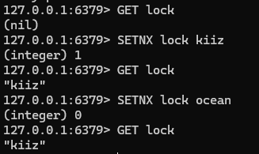

某一个线程设置一个锁后，其他线程尝试设置均返回0，即失败，所以可以达到互斥锁的目的

改造原始代码，首先在RedisRepository中定义一个获取锁的方法，以及设置有关锁的常量

```java
public Boolean setMutex(String key, String value, Long timeout) {
    return stringRedisTemplate.opsForValue().setIfAbsent(key, value, timeout, TimeUnit.SECONDS);
}
```

```java
public static final String LOCK_SHOP_INFO_KEY = "lock:shop:info:";       // 商品信息互斥锁
public static final Long LOCK_SHOP_INFO_TTL = 10L;              // 商品信息互斥锁TTL
```

然后改造业务方法

```java
@Override
public Result queryById(@NotNull Long id) {
    // 查询Redis中是否存在缓存
    String shopJson = redisRepository.get(RedisKeyConstant.CACHE_SHOP_INFO_KEY + id);
    // 缓存命中
    if (shopJson != null && !StrUtil.isBlank(shopJson)) {
        Shop shop = JSONUtil.toBean(shopJson, Shop.class);
        return Result.ok(shop);
    }
    // 缓存命中，但为空对象，返回错误
    if (StrUtil.isBlank(shopJson)) {
        return Result.fail("店铺不存在");
    }

    // 获取互斥锁，重建缓存
    String lockKey = RedisKeyConstant.LOCK_SHOP_INFO_KEY + id;
    Shop shop;
    try {
        Boolean lock = redisRepository.setMutex(lockKey, "1", RedisKeyConstant.LOCK_SHOP_INFO_TTL);
        if (!lock) {
            // 获取锁失败，休眠
            Thread.sleep(50);
            // 重试
            return queryById(id);
        }

        // 获取锁成功，查询数据库
        shop = this.getById(id);
        // 数据库中不存在，建立缓存空对象，并返回
        if (shop == null) {
            redisRepository.set(RedisKeyConstant.CACHE_SHOP_INFO_KEY + id, "", RedisKeyConstant.CACHE_NONE_TTL);
            return Result.fail("店铺不存在");
        }
        // 数据库中存在，写入Redis缓存
        shopJson = JSONUtil.toJsonStr(shop);
        redisRepository.set(RedisKeyConstant.CACHE_SHOP_INFO_KEY + id, shopJson, RedisKeyConstant.CACHE_SHOP_INFO_TTL);
    } catch (InterruptedException e) {
        log.error("缓存构建失败");
        throw new RuntimeException(e);
    } finally {
        // 释放锁
        redisRepository.delete(lockKey);
    }
    // 返回结果
    return Result.ok(shop);
}
```

在缓存未命中时，先尝试互斥锁，如果互斥锁获取失败，则休眠50ms，并递归重试，直到构建完成或锁被释放。在成功获取互斥锁后，查询数据库获取店铺信息，然后重建Redis缓存。这里使用try-catch-finally以保证锁能够成功释放，避免死锁，最后返回结果

#### 基于逻辑过期解决缓存击穿

基于逻辑过期，就是不指定Redis过期时间，而是为Redis数据体中插入一个过期时间字段，每次查询时判断该字段是否过期，然后再使用独立线程进行缓存重建工作。首先为实体类制定过期时间字段，一般来说有两种方式，第一种是定义Redis数据类，添加过期时间字段，实体类继承Redis数据类即可；第二种则是在Redis数据类中再定义一个数据字段，进行Redis交互时将业务实体封装到Redis数据实体的数据字段即可，这里我们使用第二种，因为第一种会产生一些业务侵入

```java
import lombok.Builder;
import lombok.Data;
import lombok.experimental.Accessors;

@Data
@Builder
@Accessors(chain = true)
public class RedisData<T> {

    private Long expireTime;

    private T data;
}
```

```java
@Override
public Result queryByIdWithLogicalExpire(@NotNull Long id) {
    // 获取缓存
    String shopJson = redisRepository.get(RedisKeyConstant.CACHE_SHOP_INFO_KEY + id);
    // 缓存未命中，直接返回错误
    if (shopJson == null) {
        return Result.fail("店铺不存在");
    }
    // 缓存命中，转换为RedisData
    RedisData redisData = JSONUtil.toBean(shopJson, RedisData.class);
    Shop shop = JSONUtil.toBean((JSONObject) redisData.getData(), Shop.class);
    LocalDateTime expireTime = redisData.getExpireTime();
    // 检查过期时间
    if (expireTime != null && expireTime.isAfter(LocalDateTime.now())) {
        // 缓存未过期，直接返回
        return Result.ok(shop);
    }
    // 缓存已过期，重建缓存
    // 获取互斥锁
    String lockKey = RedisKeyConstant.LOCK_SHOP_INFO_KEY + id;
    Boolean lock = redisRepository.setMutex(lockKey, "1", RedisKeyConstant.LOCK_SHOP_INFO_TTL);
    // 获取锁失败，返回旧数据
    if (!lock) {
        return Result.ok(shop);
    }
    // 获取锁成功，异步线程重建缓存
    executor.submit(() -> {
        try {
            // 查询数据库
            Shop newShop = this.getById(id);
            // 数据库中不存在，删除Redis缓存
            if (newShop == null) {
                redisRepository.delete(RedisKeyConstant.CACHE_SHOP_INFO_KEY + id);
                return;
            }
            // 构建RedisData
            RedisData<Shop> shopRedisData = new RedisData<>();
            shopRedisData.setData(newShop);
            shopRedisData.setExpireTime(LocalDateTime.now().plusSeconds(10));
            // 写入Redis缓存
            redisRepository.set(RedisKeyConstant.CACHE_SHOP_INFO_KEY + id, JSONUtil.toJsonStr(shopRedisData), 300L);
        } catch (Exception e) {
            throw new RuntimeException(e);
        } finally {
            // 释放锁
            redisRepository.delete(lockKey);
        }
    });
    // 返回结果
    return Result.ok(shop);
}
```

逻辑过期解决方案相较于互斥锁实现差别较大，逻辑过期理论上没有TTL，因此也可以直接避免缓存穿透问题，也就不需要在判断缓存是否命中。这里是为了避免缓存不存在，所以缓存未命中直接返回错误，作为兜底策略。然后将Redis中的数据转换为RedisData，再判断过期时间，如果未过期，直接返回，如果过期，则进入缓存重建流程

在缓存重建流程中，由第一个发现过期的线程获取互斥锁，该线程自己并不进行重建工作，而是交由异步线程执行，并给予锁，然后直接返回旧数据；在异步线程中，再进行查询数据库、构建新RedisData，并写入Redis缓存的操作，最后由异步线程释放锁

### 全局ID生成器

在分布式系统中，某些业务数据量非常庞大，如订单表，每个订单都需要有一个订单id，如果仅使用mysql自增长id，很容易暴露一些业务细节，而且如果使用多个数据表，每个表的自增长是独立的，数据无法进行聚合。因此这里就需要全局ID生成器，用于分布式系统中，对每个业务中生成一个唯一ID，该ID在所有业务实例中不重复

全局ID生成器需要满足唯一性、高可用、高性能、递增性、安全性。唯一性是指ID全局唯一，不允许重复；高可用是指任何时候ID生成器都能够正常生成可用ID；高性能是指在高并发情况下也能快速生成可用ID；递增性是指生成的ID拥有一定的递增属性，让数据库可以创建索引，提高插入效率；安全性是指用户无法通过ID推测出业务细节，规律性不能过于明显

Redis刚好可以用于构建全局ID生成器，Redis本身就拥有高可用与高性能的特性，唯一性、递增性和安全性可以通过我们对ID的设计来解决

#### 全局ID设计

Java中，ID通常使用Long类型来保存，Java中Long的最大值为$2^{63}-1$，Long使用8字节64位存储，第一位是符号位。而对于ID来说，使用其中的32位，即$2^{32}$就已经足够了，约为21亿。为了能够合理使用Long的全部63位，再将高31位设置为一个时间戳，保存ID生成的时间，以秒为单位，$2^{31}$秒约为69年。低32位就作为序列号，允许同一时间生成多个ID

> 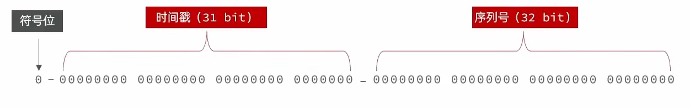

#### 基于Redis实现全局ID生成器

```java
package com.hmdp.utils;

import com.hmdp.repository.RedisRepository;
import lombok.RequiredArgsConstructor;
import org.springframework.stereotype.Component;

import java.time.LocalDateTime;
import java.time.ZoneOffset;
import java.time.format.DateTimeFormatter;

@Component
@RequiredArgsConstructor
public class GlobalIdGenerator {

    // 2026-01-01 00:00:00.000
    private static final Long ORIGINAL_TIMESTAMP = 1767225600L;
    // 序列号长度
    private static final Byte ID_LENGTH = 32;

    private RedisRepository redisRepository;

    public Long next(String bizKey) {
        // 获取当前时间戳
        LocalDateTime now = LocalDateTime.now();
        long timestamp = now.toEpochSecond(ZoneOffset.UTC) - ORIGINAL_TIMESTAMP;
        // 生成序列号Key
        String format = now.format(DateTimeFormatter.ofPattern("yyyy:MM:dd"));
        String key = "INCREMENT:" + bizKey + ":" + format;
        // 获取序列号
        Long increment = redisRepository.increment(key);

        // 组装返回
        return timestamp << ID_LENGTH | increment;
    }
}
```

实现起来相对比较简单，先定义两个常量，一个是起始时间ORIGINAL_TIMESTAMP，暂定为2026年1月1日0分0秒，所有订单的时间戳都是以当前时间减去ORIGINAL_TIMESTAMP时间得到，最高支持到2095年。然后是序列号长度，如果我们不再使用Long，而是int，或者Bigint，则可以通过ID_LENGTH来更新序列号长度，这里使用Byte，最大值为128，也就是支持128位的序列号长度，而目前Redis的自增长最大也只有64位

然后开始生成id，使用当前时间计算时间戳，然后使用当前日期和业务Key生成一个自增长序列号Key，这样可以在Redis中查看每天生成的Key数量，方便统计。最后通过位运算得到最终ID并返回

### 优惠券秒杀

#### 实现秒杀券下单

```java
@Service
@RequiredArgsConstructor
public class VoucherOrderServiceImpl extends ServiceImpl<VoucherOrderMapper, VoucherOrder> implements IVoucherOrderService {

    private final ISeckillVoucherService seckillVoucherService;
    private final GlobalIdGenerator idGenerator;

    @Override
    @Transactional
    public Result addSeckillVoucher(@NotNull Long voucherId) {

        // 获取用户信息
        Long userId = UserHolder.getUser().getId();
        if (userId == null) {
            return Result.fail("用户未登录");
        }

        // 查询秒杀券
        SeckillVoucher voucher = seckillVoucherService.getById(voucherId);
        if (voucher == null) {
            return Result.fail("秒杀券不存在");
        }
        // 检查过期时间
        if (voucher.getEndTime().isBefore(LocalDateTime.now())) {
            return Result.fail("秒杀券已过期");
        }
        if (voucher.getBeginTime().isAfter(LocalDateTime.now())) {
            return Result.fail("秒杀券未开始");
        }
        // 检查库存
        if (voucher.getStock() < 1) {
            return Result.fail("秒杀券已售罄");
        }
        // 扣减库存
        boolean success = seckillVoucherService.update().setSql("stock = stock - 1")
                .eq("voucher_id", voucherId).update();
        if (!success) {
            return Result.fail("秒杀券已售罄");
        }

        // 创建订单
        VoucherOrder order = new VoucherOrder();
        Long orderId = idGenerator.next("order");
        order.setId(orderId);
        order.setVoucherId(voucherId);
        order.setUserId(userId);
        // 保存订单
        save(order);
        // 返回订单id
        return Result.ok(orderId);
    }
}
```

 完成最基础的秒杀券下单功能，对于我们来说没有什么难度，首先查询秒杀券，然后检查过期时间，再检查库存，扣减库存，并创建订单，保存到数据库中。但实际上这个下单逻辑存在诸多问题

#### 超卖问题

上文的代码在高并发情况下极易出现超卖问题，我们可以来测试一下

准备100个秒杀券库存

> 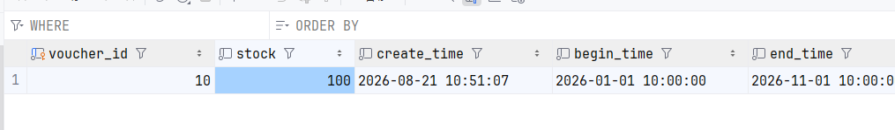

准备200个线程，在1秒内同时到达，模拟高并发情况

> 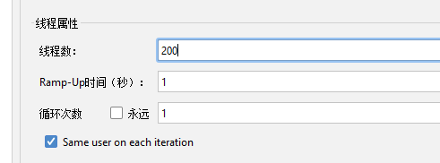

发送请求

> 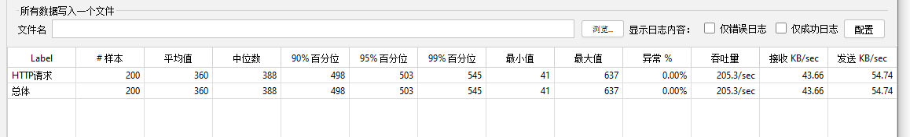

最后观察库存数量

> 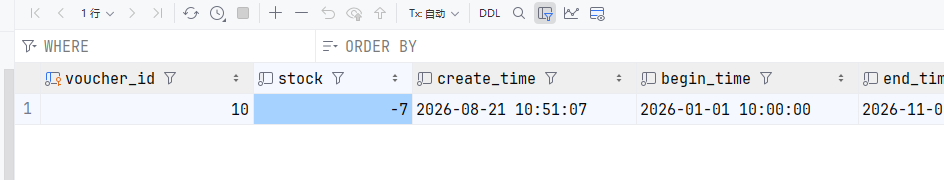

可见已经超卖了7个秒杀券，如果是对数量非常敏感的商品，超卖问题造成的损失将会非常大。那么超卖问题是如何造成的呢？观察代码可以得到答案

```java
// 查询秒杀券
SeckillVoucher voucher = seckillVoucherService.getById(voucherId);
if (voucher == null) {
    return Result.fail("秒杀券不存在");
}
// 检查过期时间
if (voucher.getEndTime().isBefore(LocalDateTime.now())) {
    return Result.fail("秒杀券已过期");
}
if (voucher.getBeginTime().isAfter(LocalDateTime.now())) {
    return Result.fail("秒杀券未开始");
}
// 检查库存
if (voucher.getStock() < 1) {
    return Result.fail("秒杀券已售罄");
}
// 扣减库存
boolean success = seckillVoucherService.update().setSql("stock = stock - 1")
        .eq("voucher_id", voucherId).update();
if (!success) {
    return Result.fail("秒杀券已售罄");
}
```

在这段代码中，先查询秒杀券，然后再通过查询出的秒杀券获取库存，假设某一时刻秒杀券库存为1，A线程和B线程几乎同一时间查询，都得到库存为1，而两个线程检查库存时，自己的商品实例中都满足库存大于1，因此两个线程都执行扣减库存的逻辑，最终导致库存超卖

这里一种经典的并发安全问题，对于此类问题，一般有悲观锁和乐观锁两种方式

悲观锁和乐观锁并不是指特定的解决方案，而是两种针对并发安全问题的思想。悲观锁是认为线程安全问题一定会发生，因此在操作数据之前先获取锁，确保线程串行执行，如Synchronized、Lock都属于悲观锁，悲观锁为整个方法或者类加锁，同一时间仅有一个线程可以执行相关逻辑，保证线程安全。但悲观锁的串行执行会造成严重的性能损失，在高并发高性能情况下不适用，包括这里的秒杀问题，用户点击下单后，需要等待一段时间才能返回结果，就会对用户的体验造成较大的影响。而乐观锁认为，线程安全问题不一定会发生，因此不直接加锁，而是在更新数据时判断其他线程是否对数据进行了更改，如果没有修改，则认为是线程安全的，然后更新数据；如果已经被其他线程修改了，则抛出异常或重试

#### 乐观锁解决超卖问题

对于一般的乐观锁解决方案，是在更新数据前查询某个特定的数据值是否被更改，例如我们可以设定一个版本号字段，每次数据更新时，当前版本号必须与之前查询到的版本号一致，否则认为数据被更改过。而在超卖问题中，可以直接使用库存字段充当这个版本号，库存在每次卖出后一定会发生变化，同样的库存也只允许变化一次

```java
// 扣减库存
boolean success = seckillVoucherService.update().setSql("stock = stock - 1")
        .eq("voucher_id", voucherId).eq("stock", voucher.getStock()).update();
```

因此我们在扣减库存的位置添加一个查询条件，必须是查询到的库存等于当前库存时，才认为库存安全，可以扣减

> 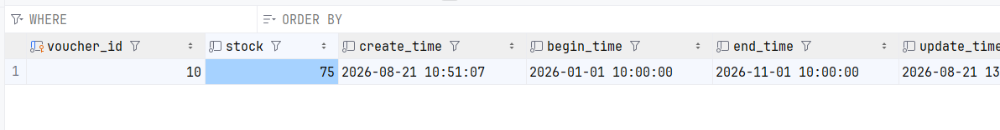

但是这里又出现了一个问题，我们再次发送200个请求，却只卖出了25份，这又是为什么？简单来说，这就是乐观锁的弊端，乐观锁会影响业务的完成度。假设有100个线程同时查询，此时库存为100，因此100个线程中的库存都为100，但乐观锁保证了仅有一个线程能够成功减少一个库存，其余的99个线程都会返回库存售罄。在业务上来说这是非常严重的问题，特别是秒杀情况下，用户因后端错误的返回结果从而认为商品售罄，不再继续尝试，导致用户造成实际损失

那么如何解决这个无法卖出的问题呢？从业务上来看，在库存减少为0之前的超卖，实际上是可以直接忽略的，因为事实层面上，每个用户都抢到了自己的秒杀商品，订单也确实正常下达了。所以其实这里的乐观锁并需要必须保证当前库存等于查询时库存，仅需要当前库存大于0即可。同样假设100个线程同时查询，此时库存为100,100个线程中的库存都为100，每个线程执行扣减库存时，仅检查当前库存是否大于0，如果库存已经等于0，随即返回售罄，并不会导致超卖

```java
// 扣减库存
boolean success = seckillVoucherService.update().setSql("stock = stock - 1")
        .eq("voucher_id", voucherId).gt("stock", 0).update();
```

> 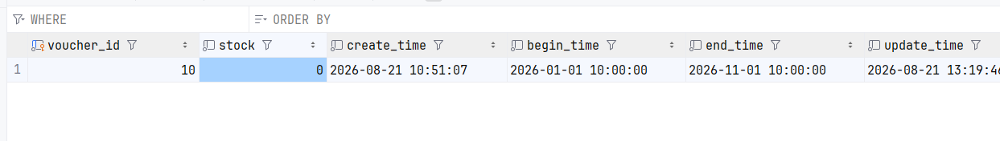

#### 一人一单

优惠券秒杀的业务本质上是商家吸引更多的顾客来店中消费，从而进一步带动更多的用户前来购买商品。而秒杀券这样的商品一般是亏本的，如果全部被一个或少数几个顾客买走，就等于完全失去了活动意义。因此秒杀商品一般限制每个用户仅能购买一个

```java
@Override
@Transactional
public Result addSeckillVoucher(@NotNull Long voucherId) {

    // 获取用户信息
    Long userId = UserHolder.getUser().getId();
    if (userId == null) {
        return Result.fail("用户未登录");
    }

    // 判断用户是否购买过
    Integer count = query().eq("user_id", userId).eq("voucher_id", voucherId).count();
    if (count > 0) {
        return Result.fail("用户已购买过");
    }

    // 查询秒杀券
    SeckillVoucher voucher = seckillVoucherService.getById(voucherId);
    if (voucher == null) {
        return Result.fail("秒杀券不存在");
    }
    // 检查过期时间
    if (voucher.getEndTime().isBefore(LocalDateTime.now())) {
        return Result.fail("秒杀券已过期");
    }
    if (voucher.getBeginTime().isAfter(LocalDateTime.now())) {
        return Result.fail("秒杀券未开始");
    }
    // 检查库存
    if (voucher.getStock() < 1) {
        return Result.fail("秒杀券已售罄");
    }
    // 扣减库存
    boolean success = seckillVoucherService.update().setSql("stock = stock - 1")
            .eq("voucher_id", voucherId).gt("stock", 0).update();
    if (!success) {
        return Result.fail("秒杀券已售罄");
    }

    // 创建订单
    VoucherOrder order = new VoucherOrder();
    Long orderId = idGenerator.next("order");
    order.setId(orderId);
    order.setVoucherId(voucherId);
    order.setUserId(userId);
    // 保存订单
    save(order);
    // 返回订单id
    return Result.ok(orderId);
}
```

实现非常简单，在秒杀之前先查询数据库中是否已经存在该用户制定优惠券的订单，然后我们进行测试

> 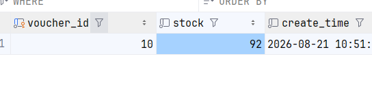

经测试发现，只允许卖出一份，但实际卖出了8份，一人一单并没有实现，这又是为什么？其实和之前的超卖问题一样，从判断购买到实际插入之间存在时间差，一旦多个线程在一个线程插入前执行了查询，那么这些线程就都可以执行插入，最终导致一人多单。但一人一单问题并不能添加乐观锁，虽然Mysql可以间接实现INSERT添加限定条件，但在高并发情况下仍存在一些并发安全问题，如下

```mysql
INSERT INTO user (name, age, sex, unique_number)
SELECT '张三', 22, '男', '11001'
FROM DUAL
WHERE NOT EXISTS (
    SELECT 1 FROM user WHERE unique_number = '11001'
);
```

WHERE NOT EXISTS限制仅有不存在unique_number为11001的数据时才允许插入，但在Mysql层面，如果有多个线程同时执行WHERE NOT EXISTS，可能同时返回true，Mysql并未对普通SELECT添加排他锁，因此仍可能导致一人多单的超卖问题

所以这里需要使用悲观锁，即Synchronized。但悲观锁应当添加在什么位置呢？如果直接添加到方法上，并发情况下仅有一个线程能够执行方法，并发安全性确实非常好，但是性能相对地也非常差；如果添加到插入逻辑上，多个线程查询时同时满足，仅有一个线程能够插入，其他线程在插入时等待，在前面的线程释放锁后继续插入，完全没有任何意义；所以悲观锁应当锁止从查询开始到插入结束的整个流程，只允许一个线程查询，查询完成后插入，插入完成后再释放锁，此时其他线程继续查询，才能保证从查询到插入间没有其他线程修改数据

还有一个问题，锁应该选择什么？锁应当选择一个所有线程同时拥有的数据，如果选择优惠券id，那么所有相同优惠券id的请求就都会阻塞。但是从业务逻辑上来看，我们编写的是一人一单的逻辑，相同优惠券id的请求会包含不同的用户，两个用户的请求之间并不存在竞争情况。因此我们使用用户id作为锁，同一个用户的所有请求都会阻塞，仅有数量判断通过的线程能够执行插入，其余线程直接返回

```java
@Override
@Transactional
public Result addSeckillVoucher(@NotNull Long voucherId) {

    // 获取用户信息
    Long userId = UserHolder.getUser().getId();
    if (userId == null) {
        return Result.fail("用户未登录");
    }

    synchronized (userId) {
        // 判断用户是否购买过
        Integer count = query().eq("user_id", userId).eq("voucher_id", voucherId).count();
        if (count > 0) {
            return Result.fail("用户已购买过");
        }

        // 查询秒杀券
        SeckillVoucher voucher = seckillVoucherService.getById(voucherId);
        if (voucher == null) {
            return Result.fail("秒杀券不存在");
        }
        // 检查过期时间
        if (voucher.getEndTime().isBefore(LocalDateTime.now())) {
            return Result.fail("秒杀券已过期");
        }
        if (voucher.getBeginTime().isAfter(LocalDateTime.now())) {
            return Result.fail("秒杀券未开始");
        }
        // 检查库存
        if (voucher.getStock() < 1) {
            return Result.fail("秒杀券已售罄");
        }
        // 扣减库存
        boolean success = seckillVoucherService.update().setSql("stock = stock - 1")
                .eq("voucher_id", voucherId).gt("stock", 0).update();
        if (!success) {
            return Result.fail("秒杀券已售罄");
        }

        // 创建订单
        VoucherOrder order = new VoucherOrder();
        Long orderId = idGenerator.next("order");
        order.setId(orderId);
        order.setVoucherId(voucherId);
        order.setUserId(userId);
        // 保存订单
        save(order);
        // 返回订单id
        return Result.ok(orderId);
    }
}
```

这段代码中，我们使用synchronized锁住了从查询到最后返回的所有代码，以保证仅有一个线程能够执行这些步骤。同时使用userId作为锁，保证只能锁止同一个用户的请求，其他用户的请求正常执行

但其实这段代码也有两个很严重的问题。第一，事务引起的锁失效，这里的事务会在锁释放之后再提交，假设A线程创建了订单，释放锁，此时事务并没有提交，B线程获得锁，判断用户是否购买过。此时事务还没有提交，因此B判断通过，执行创建订单的逻辑，又会造成超卖问题；第二，userId本身不能直接作为锁，synchronized是通过对象地址来判断是否是同一个锁，而userId为Long包装类型，多个线程中很可能都是通过new得到的新对象，地址不同，因此synchronized会认为不是同一把锁，从而允许其获取锁，造成超卖问题

对于事务问题，解决方案是提取所有代码为方法，然后为新方法添加事务注解，确保事务在锁释放前提交

```java
@Override
public Result addSeckillVoucher(@NotNull Long voucherId) {

    // 获取用户信息
    Long userId = UserHolder.getUser().getId();
    if (userId == null) {
        return Result.fail("用户未登录");
    }

    synchronized (userId) {
        return tryToAddSeckillVoucher(voucherId, userId);
    }
}

@Transactional
public Result tryToAddSeckillVoucher(Long voucherId, Long userId) {
    // 判断用户是否购买过
    Integer count = query().eq("user_id", userId).eq("voucher_id", voucherId).count();
    if (count > 0) {
        return Result.fail("用户已购买过");
    }

    // 查询秒杀券
    SeckillVoucher voucher = seckillVoucherService.getById(voucherId);
    if (voucher == null) {
        return Result.fail("秒杀券不存在");
    }
    // 检查过期时间
    if (voucher.getEndTime().isBefore(LocalDateTime.now())) {
        return Result.fail("秒杀券已过期");
    }
    if (voucher.getBeginTime().isAfter(LocalDateTime.now())) {
        return Result.fail("秒杀券未开始");
    }
    // 检查库存
    if (voucher.getStock() < 1) {
        return Result.fail("秒杀券已售罄");
    }
    // 扣减库存
    boolean success = seckillVoucherService.update().setSql("stock = stock - 1")
            .eq("voucher_id", voucherId).gt("stock", 0).update();
    if (!success) {
        return Result.fail("秒杀券已售罄");
    }

    // 创建订单
    VoucherOrder order = new VoucherOrder();
    Long orderId = idGenerator.next("order");
    order.setId(orderId);
    order.setVoucherId(voucherId);
    order.setUserId(userId);
    // 保存订单
    save(order);
    // 返回订单id
    return Result.ok(orderId);
}
```

不过到此还没有结束，因为这里的return tryToAddSeckillVoucher(voucherId, userId)调用的是VoucherOrderServiceImpl自己的方法，是直接的对象调用，而Spring的事务管理是通过代理对象来调用的，所以tryToAddSeckillVoucher的@Transactional会失效，IDEA也提醒了这一点

> 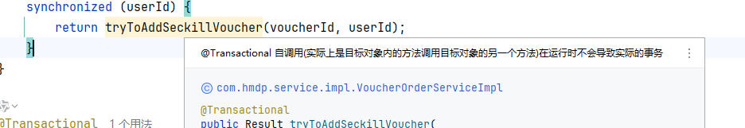

解决方案有多种，例如通过AOP获取Service代理类，然后拉取方法tryToAddSeckillVoucher到代理类中，再由代理类执行，这样Spring就能通过动态代理获取到tryToAddSeckillVoucher方法。但是这种方法需要额外引入Aspectj依赖，还有一定的业务侵入，因此我们使用另一种比较简单的方案，在ISeckillVoucherService中定义这个方法，用VoucherOrderServiceImpl注入ISeckillVoucherService，以实现代理

```java
@Service
@RequiredArgsConstructor
public class SeckillVoucherServiceImpl extends ServiceImpl<SeckillVoucherMapper, SeckillVoucher> implements ISeckillVoucherService {

    private final GlobalIdGenerator idGenerator;
    private final @Lazy IVoucherOrderService voucherOrderService;

    @Transactional
    @Override
    public Result tryToAddSeckillVoucher(Long voucherId, Long userId) {
        // 判断用户是否购买过
        Integer count = voucherOrderService.query().eq("user_id", userId).eq("voucher_id", voucherId).count();
        if (count > 0) {
            return Result.fail("用户已购买过");
        }

        // 查询秒杀券
        SeckillVoucher voucher = getById(voucherId);
        if (voucher == null) {
            return Result.fail("秒杀券不存在");
        }
        // 检查过期时间
        if (voucher.getEndTime().isBefore(LocalDateTime.now())) {
            return Result.fail("秒杀券已过期");
        }
        if (voucher.getBeginTime().isAfter(LocalDateTime.now())) {
            return Result.fail("秒杀券未开始");
        }
        // 检查库存
        if (voucher.getStock() < 1) {
            return Result.fail("秒杀券已售罄");
        }
        // 扣减库存
        boolean success = update().setSql("stock = stock - 1")
                .eq("voucher_id", voucherId).gt("stock", 0).update();
        if (!success) {
            return Result.fail("秒杀券已售罄");
        }

        // 创建订单
        VoucherOrder order = new VoucherOrder();
        Long orderId = idGenerator.next("order");
        order.setId(orderId);
        order.setVoucherId(voucherId);
        order.setUserId(userId);
        // 保存订单
        voucherOrderService.save(order);
        // 返回订单id
        return Result.ok(orderId);
    }
}
```

然后在VoucherOrderServiceImpl中调用

```java
@Override
public Result addSeckillVoucher(@NotNull Long voucherId) {

    // 获取用户信息
    Long userId = UserHolder.getUser().getId();
    if (userId == null) {
        return Result.fail("用户未登录");
    }

    synchronized (userId) {
        return seckillVoucherService.tryToAddSeckillVoucher(voucherId, userId);
    }
}
```

然后是userId的问题，根本原因是userId的地址不同，如果userId能有一个相同地址，那么就可以直接使用了。在Java中，String有一个方法intern，可以保证相同字符串获取的地址是相同的，因此我们将userId转换为String，再调用intern

```java
@Override
public Result addSeckillVoucher(@NotNull Long voucherId) {

    // 获取用户信息
    Long userId = UserHolder.getUser().getId();
    if (userId == null) {
        return Result.fail("用户未登录");
    }

    synchronized (userId.toString().intern()) {
        return seckillVoucherService.tryToAddSeckillVoucher(voucherId, userId);
    }
}
```

> 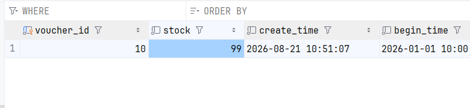

### 分布式锁

上文针对一人一单的解决方案中，我们仅考虑了单机，即单服务实例的情况。但是很多时候，一个服务会部署多台实例，组成一个集群，从而提高服务并发性能，而此时，之前的一人一单解决方案就会出现问题

synchronized锁仅对当前实例有效，如果部署了多个服务实例，并制定了负载均衡的情况下，对于同一用户的同一请求，可能就会被均衡到不同的服务实例中，假设nginx配置了轮询负载均衡模式，后端部署了两个实例，此时同一用户的两个秒杀请求到达，第一个请求进入服务A，另一个请求进入服务B，而两个服务中的请求都能够获取到自己的锁，从而完成下单逻辑

针对这种情况，就需要使用分布式锁来解决问题

分布式锁的基本方案是将各个实例的锁提取为公共锁，所有实例共享一个锁池，所有实例在获取锁时从共享锁池中获取，以保证多个实例间也能互斥。分布式锁要求多进程可见、互斥、高可用、高性能、安全性

以下是常见的三种互斥锁解决方案

| 解决方案  | 互斥性                           | 高可用                           | 高性能 | 安全性                             |
| --------- | -------------------------------- | -------------------------------- | ------ | ---------------------------------- |
| MySQL     | 利用mysql本身的事务互斥锁机制    | 支持主从集群                     | 一般   | 断开连接，自动回滚事务，释放互斥锁 |
| Redis     | 利用SETNX等互斥命令              | 支持主从集群、分片集群、哨兵集群 | 好     | 利用锁TTL，到期自动释放            |
| Zookeeper | 利用节点的唯一性和有序性实现互斥 | 支持集群                         | 一般   | 临时节点，断开连接后自动释放       |

#### 基于Redis的分布式锁

在之前设计互斥锁解决缓存击穿问题时，其实已经涉及到了一些Redis锁的逻辑。我们利用SETNX命令，确保只有一个线程能获取锁

```redis
SETNX lock 1
```

释放锁时，删除锁的KEY即可

```redis
DEL lock
```

为了避免服务宕机导致死锁，还需要为锁添加TTL

```redis
EXPIRE lock 10
```

这里还存在一种可能，如果服务在SETNX与EXPIRE命令之间宕机，TTL没有正常设置，依然会出现死锁情况。不过Redis其实已经准备好了解决方案，在学习SET命令时，我们知道SET可以拼接很多参数，而这些参数中就包括了EX设置TTL，NX设置互斥

```redis
SET <KEY> <VALUE> [EX SECONDS | PX MILLISECONDS] [NX | XX]
```

> 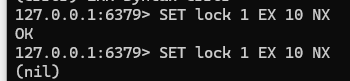

这样就可以保证命令的原子性，避免出现死锁的情况。分布式锁有阻塞和非阻塞两种形式，这里我们使用非阻塞式，对于优惠券秒杀业务，如果一个线程获取锁失败，则可以认为一定有一个线程抢购成功，正在下达订单，因此可以直接返回，不需要额外的重试

下面我们来设计一个简单的Redis分布式锁解决方案

首先定义一个锁实体类，实体类中存储键名和键值，键名是锁KEY，在声明时传入，而键值设置为线程名，方便在Redis中记录是哪个线程获取了锁。再定义两个方法，一个尝试获取锁，一个释放锁

```java
package com.hmdp.entity;

import com.hmdp.constants.RedisKeyConstant;
import com.hmdp.repository.RedisRepository;
import lombok.AllArgsConstructor;

@AllArgsConstructor
public class RedisMutexLock {

    private final RedisRepository redisRepository;
    private final String key;
    private final String value = Thread.currentThread().getName();

    public boolean tryLock(String id) {
        Boolean mutex = redisRepository.setMutex(key + id, value, RedisKeyConstant.LOCK_MUTEX_TTL);
        return Boolean.TRUE.equals(mutex);
    }

    public void unlock(String id) {
        redisRepository.delete(key + id);
    }
}
```

然后改造业务代码

```java
@Override
public Result addSeckillVoucher(@NotNull Long voucherId) {

    // 获取用户信息
    Long userId = UserHolder.getUser().getId();
    if (userId == null) {
        return Result.fail("用户未登录");
    }

    // 创建锁对象
    RedisMutexLock lock = new RedisMutexLock(redisRepository, RedisKeyConstant.LOCK_ORDER_SECKILL_VOUCHER_KEY);
    // 获取锁
    boolean isLock = lock.tryLock(voucherId.toString());
    // 判断锁是否获取成功
    if (!isLock) {
        // 获取锁失败，返回错误
        return Result.fail("不允许重复下单");
    }
    // 获取锁成功，创建订单
    try {
        return seckillVoucherService.tryToAddSeckillVoucher(voucherId, userId);
    } finally {
        // 释放锁
        lock.unlock(voucherId.toString());
    }
}
```

将之前的JVM互斥锁方案更改为Redis分布式锁方案，首先创建锁对象，注入RedisRepository以操作Redis，然后传入常量KEY。获取锁时，传入用户id，以保证每个用户的锁是独立的，只有同一个用户的请求才互斥。获取锁失败时，直接返回错误；获取锁成功后，交由seckillVoucherService的tryToAddSeckillVoucher下达订单，最后释放锁

#### 分布式锁误删问题

上述的分布式锁方案中存在一个问题，假设在极端情况下，一个线程获取锁之后进入阻塞状态，阻塞时间大于锁的TTL，然后锁过期，此时第二个线程进入，尝试获取锁，但由于线程一的锁过期，所以线程二成功获取锁。在线程二完成之前线程一恢复，删除互斥锁，此时线程三又进入，线程一删除的实际上是线程二的锁，所以线程三也能成功获取锁。以此类推，构成严重的并发安全问题

不过解决方案也比较简单，在删除锁之前先判断当前锁是否属于自己，上文中我们将线程名作为键值存储在了Redis中，每个线程在删除锁时先获取锁对应的值，与自己的值进行比较，如果相同，则表示是自己的锁，才能进行删除。不过这里就不能再使用线程名或者线程id，因为不同JVM中的线程名与线程id可能相同，因此我们可以直接使用UUID或者先前的全局ID生成器来生成一个全局唯一ID

```java
package com.hmdp.entity;

import com.hmdp.constants.RedisKeyConstant;
import com.hmdp.repository.RedisRepository;
import com.hmdp.utils.GlobalIdGenerator;
import lombok.AllArgsConstructor;

import java.util.Objects;

@AllArgsConstructor
public class RedisMutexLock {

    private final RedisRepository redisRepository;
    private final String key;
    private final GlobalIdGenerator idGenerator;
    private final String value = idGenerator.next(BIZ_KEY).toString();

    private static final String BIZ_KEY = "mutexLock";

    public boolean tryLock(String id) {
        Boolean mutex = redisRepository.setMutex(key + id, value, RedisKeyConstant.LOCK_MUTEX_TTL);
        return Boolean.TRUE.equals(mutex);
    }

    public void unlock(String id) {
        // 获取锁的value
        String lockValue = redisRepository.get(key + id);
        if (Objects.equals(lockValue, value)) {
            // 释放锁
            redisRepository.delete(key + id);
        }
    }
}
```

这里我们引入了先前制定的GlobalIdGenerator，然后将值更改为了由GlobalIdGenerator生成的唯一ID，这个唯一ID的序列号由Redis统一维护，所以只要保证仅有一个Redis实例或者集群，就可以保证所有业务集群中的ID唯一

#### 分布式锁的原子性问题

不过，即使我们引入了防误删措施，也无法完全保证分布式锁的并发安全问题，因为获取锁与释放锁本质上仍是两次请求，只要有任意一个线程插入到了查询与删除之间，就会导致分布式锁安全问题。一般有两种解决方案

##### WATCH + MULTI

Redis支持事务，但并不是sql那样的ACID事务，而是通过MULTI将多个命令入队，并依次执行，中间无法被其他命令打断。而MULTI在执行EXEC前，会检查被WATCH的KEY的客户端的CLIENT_DIRTY_CAS位，一旦KEY被更改，EXEC就会返回nil，不再执行

**示例**

设置一个测试KEY，键名为test，键值为1

> 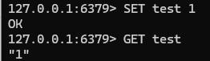

然后对test设置WATCH，尝试直接进行修改

> 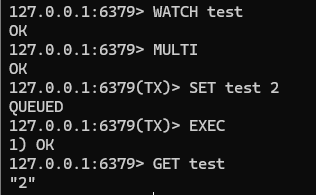

注意，在EXEC结束后，WATCH也自动失效，所以我们再设置WATCH，但并不马上更新，而是通过另一个客户端更新

> 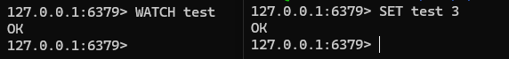

再在第一客户端中执行MULTI更新

> 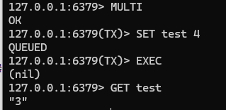

测试可以发现EXEC返回nil，更新失败，test的值最终为第二客户端设置的3

依据这个特性，我们就可以为分布式锁设计一个乐观锁，在查询锁的内容之前，优先设置WATCH，然后再获取锁内容，根据锁内容判断是否是自己的锁，如果不是自己的锁，直接返回；如果是自己的锁，通过MULTI来删除锁KEY，如果此时锁已经被其他线程修改，则删除失败，确保其他线程的锁不会被删除

但WATCH + MULTI本质上是一个乐观锁，从WATCH到EXEC这个窗口中，Redis不会阻止其他线程修改KEY的内容，如果是一致性要求严格的业务，就不应该使用这套方案

##### Lua脚本

Lua的基本教程可以查阅[Lua](https://github.com/Ki1z/Studies/blob/main/Lua/Lua.md)

在Redis中，支持执行Lua脚本来同时运行多个命令，并且Redis客户端会将每个Lua脚本作为原子命令执行，中间不允许有其他命令。而分布式锁误删问题的根本，就是查询和删除两个命令不满足原子性，中间存在窗口。目前Lua脚本方案是解决Redis分布式锁误删问题的最佳方案

Redis官方为Lua设计了一个简易方法redis.call()，可以执行任意Redis命令并返回对应的返回值，然后通过Redis客户端的EVAL命令执行脚本即可使用。EVAL命令在执行时可以传递参数，EVAL原型如下

```Redis
EVAL <script> <numkeys> [key1, key2,...] [arg1, arg2,...]
```

numkeys即为需要传递的KEY参数个数，例如我们传递3个参数，其中1个参数为KEY

```redis
EVAL <script> 1 key arg1 arg2
```

Redis将KEY类型参数存储到了Lua的KEYS数组，arg类型参数存储到了ARGV数组，来Lua中通过这两个数组来获取传入的参数，如下

```redis
EVAL "return redis.call('SET', KEYS[1], ARGV[1])" 1 name kiiz
```

*注：Lua的下标从1开始*

下面我们就来编写这个Lua脚本，脚本需要完成的是获取锁KEY值，比较Redis值与线程自己的值，然后选择是否释放锁

```lua
-- 分布式锁KEY
key = KEYS[1]
-- 线程id
localId = ARGV[1]
-- 获取Redis中的KEY值
id = redis.call('GET', key)
-- 比较id是否一致
if (localId == id) then
    -- id一致，释放锁
    return redis.call('DEL', key)
end
return 0
```

在Spring Data Redis中，通过execute方法来调用Lua脚本

```java
@Override
public <T> T execute(RedisScript<T> script, List<K> keys, Object... args) {
    return scriptExecutor.execute(script, keys, args)
}
```

借助这个api，我们来改造原始代码。在RedisRepository中定义一个方法，用于执行脚本

```java
private static final DefaultRedisScript SCRIPT = new DefaultRedisScript<>();

public <R> R executeScript(String script, Class<R> returnType, List<String> keys, Object... args) {
    // 设置脚本
    SCRIPT.setLocation(new ClassPathResource(script));
    // 设置返回类型
    SCRIPT.setResultType(returnType);
    // 执行脚本
    Object execute = stringRedisTemplate.execute(SCRIPT, keys, args);
    return (R) execute;
}
```

executeScript的核心是调用stringRedisTemplate的execute方法，execute方法有三个参数，脚本、键以及其他参数，脚本类型为RedisScript接口，仅有一个实现类DefaultRedisScript，所以我们直接在RedisRepository中预先准备好一个DefaultRedisScript实例，然后通过SCRIPT的setLocation来指定脚本具体位置。setLocation接收一个Resource，我们将脚本放置在了resources/lua/unlock.lua，在程序运行时的位置则是ClassPath/lua/unlock.lua，所以直接声明一个ClassPathResource，并传入脚本的相对位置。然后通过setResultType设置脚本返回值类型，因为executeScript方法的目标是能够执行任意脚本，不能硬编码返回值类型，这里使用了泛型R，方法返回值类型也为R，均通过returnType参数来指定，以确保调用者能够获取到正确的返回值。下面就直接调用stringRedisTemplate的execute，然后返回即可

*注：Redis为了应对漏洞CVE-2022-24735以及CVE-2022-24736，从6.2.7和7.0开始将Lua的全局表设置为了只读，如果在运行时报错Attempt to modify a readonly table script，极大可能是在脚本中定义了全局变量，为变量添加local关键字即可*

```lua
-- 分布式锁KEY
local key = KEYS[1]
-- 线程id
local localId = ARGV[1]
-- 获取Redis中的KEY值
local id = redis.call('GET', key)
```

### Redisson

Redisson是一个在Redis的基础上实现的Java驻内存数据网格（In-Memory Data Grid）。它不仅提供了一系列的分布式的Java常用对象，还提供了许多分布式服务。其中包括(BitSet, Set, Multimap, SortedSet, Map, List, Queue, BlockingQueue, Deque, BlockingDeque, Semaphore, Lock, AtomicLong, CountDownLatch, Publish / Subscribe, Bloom filter, Remote service, Spring cache, Executor service, Live Object service, Scheduler service) Redisson提供了使用Redis的最简单和最便捷的方法。Redisson的宗旨是促进使用者对Redis的关注分离（Separation of Concern），从而让使用者能够将精力更集中地放在处理业务逻辑上
#### 快速入门

- 引入依赖

```xml
<!--redisson-->
<dependency>
    <groupId>org.redisson</groupId>
    <artifactId>redisson</artifactId>
    <version>3.17.5</version>
</dependency>
```

- 添加配置

```java
import org.redisson.Redisson;
import org.redisson.api.RedissonClient;
import org.redisson.config.Config;
import org.springframework.context.annotation.Bean;
import org.springframework.context.annotation.Configuration;

@Configuration
public class RedisConfig {

    @Bean
    public RedissonClient redissonClient() {
        // 声明配置类
        Config config = new Config();
        // 添加单节点
        config.useSingleServer()
                .setAddress("redis://localhost:6379");
        // 创建RedissonClient对象
        return Redisson.create(config);
    }
}
```

- 改造代码

Redisson的api和我们先前定义的几乎相同，在获取锁时，仅需注入RedissonClient，然后调用getLock

```java
// 创建锁对象
RLock lock = redissonClient.getLock(RedisKeyConstant.LOCK_ORDER_SECKILL_VOUCHER_KEY + voucherId);
// 获取锁
boolean isLock = lock.tryLock();
// 判断锁是否获取成功
if (!isLock) {
    // 获取锁失败，返回错误
    return Result.fail("不允许重复下单");
}
// 获取锁成功，创建订单
try {
    return seckillVoucherService.tryToAddSeckillVoucher(voucherId, userId);
} finally {
    // 释放锁
    lock.unlock();
}
```

#### 可重入锁原理

我们使用Redisson的核心原因就是Redisson支持可重入锁、锁重试等等机制，这些机制实现起来非常困难和复杂，而Redisson已经实现好了这些功能，并且相当完善

可重入锁是指允许同一线程多次获取同一把锁，假设线程执行方法A，在方法A中获取了一把锁用于执行方法B，但是在方法B中需要再获取一次锁，如果这里锁无法重入，则会导致线程原地等待方法A释放锁，但方法B没有执行完，所以方法A无法释放锁，形成死锁

在我们定义的互斥锁方案中，Redis的数据结构我们选择了String类型，互斥命令为SETNX，如果直接使用String实现可重入锁，SETNX会直接返回0，导致获取锁失败。而如果仅使用SET，虽然可以在一定程度上实现重入，但是锁自身无法记录被获取的次数，锁必须在所有方法执行完成后再一并释放，这会导致锁边界模糊，重入锁仅仅是形式锁

因此我们需要在锁中添加一个记录重入次数的字段，也就是计数器，每次重入时计数器加一，释放时计数器减一，当计数器为零时，则认为锁被释放，可以执行DEL。Redis中的Hash类型刚好可以存储三个字段，但Hash中并没有SETNX这样的互斥命令，所以我们需要手写互斥逻辑。互斥逻辑要求必须原子性，因此我们在lua脚本中编写

```lua
-- 锁KEY
local key = KEYS[1]
-- 线程ID
local id = ARGV[1]
-- 锁TTL
local ttl = ARGB[2]

-- 互斥判断
if (redis.call('EXISTS', key) == 0) then
    -- 不存在锁，则可以获取锁
    redis.call('HSET', key, id, '1')
    -- 设置TTL
    redis.call('EXPIRE', key, ttl)
    -- 返回获取成功
    return 1
end

-- 锁存在，则判断是否重入
if (redis.call('HEXISTS', key, id) == 1) then
    -- 存在锁，则重入
    redis.call('HINCRBY', key, id, '1')
    -- 重置TTL
    redis.call('EXPIRE', key, ttl)
    -- 返回获取成功
    return 1
end
-- 存在锁，但不是自己的，则返回获取失败
return 0
```

下面我们查阅源码，看看Redisson是如何实现的，从lock的tryLock方法入手，类型是一个java.util.concurrent.locks.Lock

> 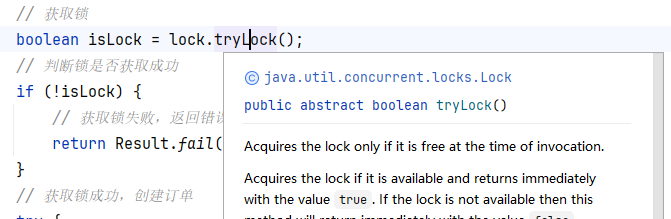

找到实现类RedissonLock

> 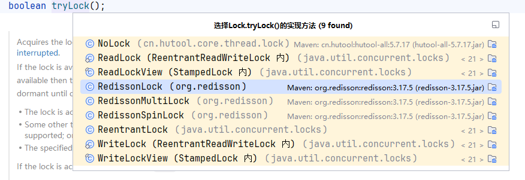

```java
@Override
public boolean tryLock() {
    return get(tryLockAsync());
}
```

调用了tryLockAsync方法

```java
@Override
public RFuture<Boolean> tryLockAsync() {
    return tryLockAsync(Thread.currentThread().getId());
}
```

tryLockAsync方法中调用了tryLockAsync的重载方法，并传入了当前线程id

```java
@Override
public RFuture<Boolean> tryLockAsync(long threadId) {
    return tryAcquireOnceAsync(-1, -1, null, threadId);
}
```

这里调用了tryAcquireOnceAsync方法

```java
private RFuture<Boolean> tryAcquireOnceAsync(long waitTime, long leaseTime, TimeUnit unit, long threadId) {
    RFuture<Boolean> acquiredFuture;
    if (leaseTime > 0) {
        acquiredFuture = tryLockInnerAsync(waitTime, leaseTime, unit, threadId, RedisCommands.EVAL_NULL_BOOLEAN);
    } else {
        acquiredFuture = tryLockInnerAsync(waitTime, internalLockLeaseTime,
                TimeUnit.MILLISECONDS, threadId, RedisCommands.EVAL_NULL_BOOLEAN);
    }

    CompletionStage<Boolean> f = acquiredFuture.thenApply(acquired -> {
        // lock acquired
        if (acquired) {
            if (leaseTime > 0) {
                internalLockLeaseTime = unit.toMillis(leaseTime);
            } else {
                scheduleExpirationRenewal(threadId);
            }
        }
        return acquired;
    });
    return new CompletableFutureWrapper<>(f);
}
```

tryAcquireOnceAsync中首先判断leaseTime是否大于0，默认是-1，执行tryLockInnerAsync方法

```java
<T> RFuture<T> tryLockInnerAsync(long waitTime, long leaseTime, TimeUnit unit, long threadId, RedisStrictCommand<T> command) {
    return evalWriteAsync(getRawName(), LongCodec.INSTANCE, command,
            "if (redis.call('exists', KEYS[1]) == 0) then " +
                    "redis.call('hincrby', KEYS[1], ARGV[2], 1); " +
                    "redis.call('pexpire', KEYS[1], ARGV[1]); " +
                    "return nil; " +
                    "end; " +
                    "if (redis.call('hexists', KEYS[1], ARGV[2]) == 1) then " +
                    "redis.call('hincrby', KEYS[1], ARGV[2], 1); " +
                    "redis.call('pexpire', KEYS[1], ARGV[1]); " +
                    "return nil; " +
                    "end; " +
                    "return redis.call('pttl', KEYS[1]);",
            Collections.singletonList(getRawName()), unit.toMillis(leaseTime), getLockName(threadId));
}
```

这里就出现了Redisson的lua脚本，不过是通过硬编码方式编写的，这样可以避免脚本被修改。这段lua脚本的逻辑实际上与我们编写的相同，首先判断KEY是否存在，不存在则添加一个锁，然后设置过期时间；如果存在，则判断值是否相同，相同则将value加一，最后返回

同样地，我们再查阅释放锁的lua脚本

```java
protected RFuture<Boolean> unlockInnerAsync(long threadId) {
    return evalWriteAsync(getRawName(), LongCodec.INSTANCE, RedisCommands.EVAL_BOOLEAN,
            "if (redis.call('hexists', KEYS[1], ARGV[3]) == 0) then " +
                    "return nil;" +
                    "end; " +
                    "local counter = redis.call('hincrby', KEYS[1], ARGV[3], -1); " +
                    "if (counter > 0) then " +
                    "redis.call('pexpire', KEYS[1], ARGV[2]); " +
                    "return 0; " +
                    "else " +
                    "redis.call('del', KEYS[1]); " +
                    "redis.call('publish', KEYS[2], ARGV[1]); " +
                    "return 1; " +
                    "end; " +
                    "return nil;",
            Arrays.asList(getRawName(), getChannelName()), LockPubSub.UNLOCK_MESSAGE, internalLockLeaseTime, getLockName(threadId));
}
```

首先判断锁是否存在，如果不存在则直接返回；然后将锁计数器减一，判断计数器是否大于0，如果大于0，重置TTL，如果小于0，直接删除KEY，释放锁，最后返回

#### 锁重试原理

上文提到的lua脚本中，互斥锁在获取失败后也直接返回了失败，但是很多业务要求不能直接返回失败，而是在指定时间内重试，直到重试最大时长才返回失败。Redisson的tryLock方法的第一参数就是waitTime最大等待时长

我们将源代码中添加最大等待时长，规定为两秒钟

```java
// 获取锁
boolean isLock = lock.tryLock(RedisKeyConstant.LOCK_MUTEX_WAIT_TIME, TimeUnit.SECONDS);
```

然后继续跟踪源码

```java
@Override
public boolean tryLock(long waitTime, TimeUnit unit) throws InterruptedException {
    return tryLock(waitTime, -1, unit);
}
```

调用了tryLock重载方法

```java
@Override
public boolean tryLock(long waitTime, long leaseTime, TimeUnit unit) throws InterruptedException {
    long time = unit.toMillis(waitTime);
    long current = System.currentTimeMillis();
    long threadId = Thread.currentThread().getId();
    Long ttl = tryAcquire(waitTime, leaseTime, unit, threadId);
    // lock acquired
    if (ttl == null) {
        return true;
    }

    time -= System.currentTimeMillis() - current;
    if (time <= 0) {
        acquireFailed(waitTime, unit, threadId);
        return false;
    }

    current = System.currentTimeMillis();
    CompletableFuture<RedissonLockEntry> subscribeFuture = subscribe(threadId);
    try {
        subscribeFuture.get(time, TimeUnit.MILLISECONDS);
    } catch (TimeoutException e) {
        if (!subscribeFuture.cancel(false)) {
            subscribeFuture.whenComplete((res, ex) -> {
                if (ex == null) {
                    unsubscribe(res, threadId);
                }
            });
        }
        acquireFailed(waitTime, unit, threadId);
        return false;
    } catch (ExecutionException e) {
        acquireFailed(waitTime, unit, threadId);
        return false;
    }

    try {
        time -= System.currentTimeMillis() - current;
        if (time <= 0) {
            acquireFailed(waitTime, unit, threadId);
            return false;
        }

        while (true) {
            long currentTime = System.currentTimeMillis();
            ttl = tryAcquire(waitTime, leaseTime, unit, threadId);
            // lock acquired
            if (ttl == null) {
                return true;
            }

            time -= System.currentTimeMillis() - currentTime;
            if (time <= 0) {
                acquireFailed(waitTime, unit, threadId);
                return false;
            }

            // waiting for message
            currentTime = System.currentTimeMillis();
            if (ttl >= 0 && ttl < time) {
                commandExecutor.getNow(subscribeFuture).getLatch().tryAcquire(ttl, TimeUnit.MILLISECONDS);
            } else {
                commandExecutor.getNow(subscribeFuture).getLatch().tryAcquire(time, TimeUnit.MILLISECONDS);
            }

            time -= System.currentTimeMillis() - currentTime;
            if (time <= 0) {
                acquireFailed(waitTime, unit, threadId);
                return false;
            }
        }
    } finally {
        unsubscribe(commandExecutor.getNow(subscribeFuture), threadId);
    }
//        return get(tryLockAsync(waitTime, leaseTime, unit));
}
```

tryLock看着很长，但是获取锁的方法就在Long ttl = tryAcquire(waitTime, leaseTime, unit, threadId)，继续跟入

```java
private Long tryAcquire(long waitTime, long leaseTime, TimeUnit unit, long threadId) {
    return get(tryAcquireAsync(waitTime, leaseTime, unit, threadId));
}
```

调用了tryAcquireAsync

```java
private <T> RFuture<Long> tryAcquireAsync(long waitTime, long leaseTime, TimeUnit unit, long threadId) {
    RFuture<Long> ttlRemainingFuture;
    if (leaseTime > 0) {
        ttlRemainingFuture = tryLockInnerAsync(waitTime, leaseTime, unit, threadId, RedisCommands.EVAL_LONG);
    } else {
        ttlRemainingFuture = tryLockInnerAsync(waitTime, internalLockLeaseTime,
                TimeUnit.MILLISECONDS, threadId, RedisCommands.EVAL_LONG);
    }
    CompletionStage<Long> f = ttlRemainingFuture.thenApply(ttlRemaining -> {
        // lock acquired
        if (ttlRemaining == null) {
            if (leaseTime > 0) {
                internalLockLeaseTime = unit.toMillis(leaseTime);
            } else {
                scheduleExpirationRenewal(threadId);
            }
        }
        return ttlRemaining;
    });
    return new CompletableFutureWrapper<>(f);
}
```

这里调用tryLockInnerAsync

```java
<T> RFuture<T> tryLockInnerAsync(long waitTime, long leaseTime, TimeUnit unit, long threadId, RedisStrictCommand<T> command) {
    return evalWriteAsync(getRawName(), LongCodec.INSTANCE, command,
            "if (redis.call('exists', KEYS[1]) == 0) then " +
                    "redis.call('hincrby', KEYS[1], ARGV[2], 1); " +
                    "redis.call('pexpire', KEYS[1], ARGV[1]); " +
                    "return nil; " +
                    "end; " +
                    "if (redis.call('hexists', KEYS[1], ARGV[2]) == 1) then " +
                    "redis.call('hincrby', KEYS[1], ARGV[2], 1); " +
                    "redis.call('pexpire', KEYS[1], ARGV[1]); " +
                    "return nil; " +
                    "end; " +
                    "return redis.call('pttl', KEYS[1]);",
            Collections.singletonList(getRawName()), unit.toMillis(leaseTime), getLockName(threadId));
}
```

可以看到tryLockInnerAsync就是在重入锁原理中看到的逻辑，这里我们观察lua脚本的返回值，获取锁成功时返回了nil，失败则返回锁ttl，有些奇怪，因为一般来说成功后应当直接返回true，nil在java中相当于null，即false

回到tryLock方法

```java
Long ttl = tryAcquire(waitTime, leaseTime, unit, threadId);
```

这个方法的返回值最后被赋值给了ttl属性，那么ttl记录的就是当前锁的ttl

```java
// lock acquired
if (ttl == null) {
    return true;
}

time -= System.currentTimeMillis() - current;
if (time <= 0) {
    acquireFailed(waitTime, unit, threadId);
    return false;
}
```

然后程序判断ttl是否为null，如果为null，则说明获取锁成功，返回true；如果不是null，则说明锁已经被获取，然后使用当前毫秒减去方法开始执行时的毫秒，得到第一次尝试获取锁得到的时长，再用最大等待时长减去第一次尝试获取锁的时长，如果为负数，则已经超过了最大等待时长，不再重试，直接返回失败

```java
current = System.currentTimeMillis();
CompletableFuture<RedissonLockEntry> subscribeFuture = subscribe(threadId);
try {
    subscribeFuture.get(time, TimeUnit.MILLISECONDS);
} catch (TimeoutException e) {
    if (!subscribeFuture.cancel(false)) {
        subscribeFuture.whenComplete((res, ex) -> {
            if (ex == null) {
                unsubscribe(res, threadId);
            }
        });
    }
    acquireFailed(waitTime, unit, threadId);
    return false;
} catch (ExecutionException e) {
    acquireFailed(waitTime, unit, threadId);
    return false;
}
```

然后进入重试逻辑，首先记录了当前毫秒，然后并没有立即重试，而是调用了subscribe方法，参数为threadId。不立即重试是因为在获取锁失败后，立即重试失败的可能性很大，所以需要等待一段时间，以确保获取锁的线程能够执行完所有业务；subscribe方法实际上是订阅了threadId的通知，在先前释放锁逻辑中，执行DEL之后还执行了一个命令PUBLISH，最后才返回1

```java
"redis.call('del', KEYS[1]); " +
"redis.call('publish', KEYS[2], ARGV[1]); " +
"return 1; "
```

PUBLISH就是发布一个Redis通知，所有订阅该KEY的服务都可以获取到该通知。然后调用subscribeFuture的get方法来尝试获取通知，通知的最大等待时长即为刚才已经减去第一次尝试获取后的最大等待时长。中间如果发生异常或者通知超时，直接返回失败

```java
try {
    time -= System.currentTimeMillis() - current;
    if (time <= 0) {
        acquireFailed(waitTime, unit, threadId);
        return false;
    }

    while (true) {
        long currentTime = System.currentTimeMillis();
        ttl = tryAcquire(waitTime, leaseTime, unit, threadId);
        // lock acquired
        if (ttl == null) {
            return true;
        }

        time -= System.currentTimeMillis() - currentTime;
        if (time <= 0) {
            acquireFailed(waitTime, unit, threadId);
            return false;
        }

        // waiting for message
        currentTime = System.currentTimeMillis();
        if (ttl >= 0 && ttl < time) {
            commandExecutor.getNow(subscribeFuture).getLatch().tryAcquire(ttl, TimeUnit.MILLISECONDS);
        } else {
            commandExecutor.getNow(subscribeFuture).getLatch().tryAcquire(time, TimeUnit.MILLISECONDS);
        }

        time -= System.currentTimeMillis() - currentTime;
        if (time <= 0) {
            acquireFailed(waitTime, unit, threadId);
            return false;
        }
    }
} finally {
    unsubscribe(commandExecutor.getNow(subscribeFuture), threadId);
}
```

如果获取通知成功，则进入重试逻辑。重试逻辑中仍然先判断当前是否超时，然后再进行重试，每次重试时，记录当前毫秒时间，然后尝试获取锁，如果获取成功，直接返回true，获取失败后判断是否超时，再等待消息。不过这里等待消息使用了信号量机制，通知针对ttl设计了不同等待时长，当ttl大于0，即锁仍被占用，并且在最大等待时间内锁可能被释放时，则等待ttl时间，确保在锁释放后才重试；如果ttl小于0，即锁已经被释放，那么直接等待最大等待时长

如果中途有消息发布，那么立即计算剩余时长，如果等待超时，则返回失败；如果仍然剩余最大等待时长，则继续重试

这里需要注意，subscribeFuture.get(time, TimeUnit.MILLISECONDS)和commandExecutor.getNow(subscribeFuture).getLatch().tryAcquire(time, TimeUnit.MILLISECONDS)设置的等待时长均为最大等待时长，是因为两个方法并不直接获取锁，两个方法只负责接收消息并唤醒。当锁被释放时，需要线程执行获取锁的逻辑，并不保证一定能获取到锁。因此设置为最大等待时长，如果超时锁仍未被释放，直接失败；如果锁被释放，则立即尝试获取锁，获取失败后再进行尝试，确保cpu的最佳利用率

