# Redis Advance

`更新时间：2026-10-07`

注释解释：

- `<>`必填项，必须在当前位置填写相应数据

- `{}`必选项，必须在当前位置选择一个给出的选项

- `[]`可选项，可以选择填写或忽略

*注：该笔记内的可选项和参数均不完整，如有需要，请查询相关手册*

---

## 分布式缓存

在[Redis](./Redis.md)基础篇中我们提到的Redis缓存都是单节点缓存，而由于Redis是内存存储，服务重启或者宕机时很有可能导致数据丢失；虽然Redis以高性能著称，但是单节点的性能仍受限于服务器本身，如果服务器本身性能较差，并发请求又非常高，很容易出现服务崩溃；同时，如果单节点Redis出现故障，也无法自主恢复，这不仅仅会造成Redis本身数据丢失，还会造成一系列的相关业务异常；以及内存存储虽然高性能，但是存储容量与硬盘基本不在一个数量级，单节点Redis很容易出现内存不足，需要频繁清除Key的情况

### Redis持久化

#### RDB持久化

RDB全称Redis Database Backup file，Redis数据备份文件，或者叫做Redis数据快照。简单来说就是将内存中所有的数据都写入到磁盘中，当Redis实例故障重启后，就可以从硬盘中读取快照文件，恢复数据。RDB文件默认保存在Redis运行目录，通过客户端的SAVE命令可以调起一次备份

> 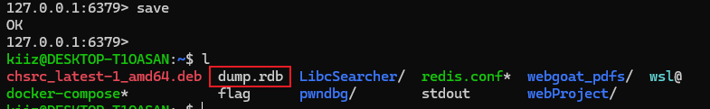

不过SAVE命令是由Redis主进程来执行的，会阻塞当前所有命令，如果Key比较多的情况下会消耗一定时间，所以在实际开发中应当选择另一个异步备份命令BGSAVE，BGSAVE会启动一个子进程来执行SAVE，不会阻塞主进程命令执行

Redis在运行时和正常终止时也会自动执行SAVE

> 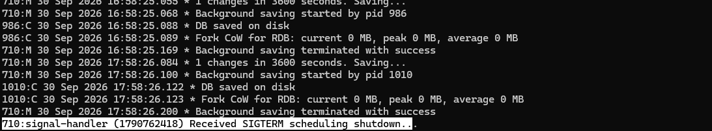

在Redis.conf配置文件中，可以针对RDP文件进行一些配置，如下

```conf
# 在指定时间t内，如果至少有k个Key被修改，则执行一次bgsave
save 900 1
# save 300 10
# save 60 10000

# 是否压缩RDB，一般不开启，压缩会额外占用CPU资源
rdbcompression yes

# RDB文件名
dbfilename dump.rdb

# Redis数据文件目录
dir ./
```

RDB本身不能完全解决服务突然宕机的问题，如果将BGSAVE的时间设置过长，在保存时间窗口内的数据就会丢失，如果设置过短，如果Redis数据量很大，就会占用大量的CPU资源来执行备份，降低服务性能

##### RDB fork原理

fork是指，当Redis执行BGSAVE时，需要从主进程中调起一个子进程，这个过程就是fork。fork过程中需要主进程向子进程同步内存数据，所以其实需要主进程阻塞，在fork完成后，子进程才将内存中的数据写入硬盘

不难发现，fork的过程需要尽快完成，因为需要尽最大可能避免主进程阻塞。如果直接将内存数据拷贝一份，就会额外占用一倍的物理内存，对于服务本身来说是完全没有必要的，因此Redis设计了一个特别的拷贝方式。在主流操作系统中，系统会为每个进程划分一块属于进程自己的虚拟内存空间，每个进程的虚拟内存相互独立，而操作系统则维护一份虚拟内存空间到物理内存的映射表，这个表就是页表。在Redis进行fork时，直接将页表拷贝给了子进程，对于子进程来说，页表中映射的地址与主进程完全相同，因此其中存储的属于也就是同一份，直接实现了内存共享

不过还需要考虑一个问题，如果子进程在读取内存中数据时，主进程需要写入新的数据呢？为了避免同时读写冲突，Redis采用了copy-on-write模式，当主进程读数据时，直接读取共享数据，而当主进程写数据时，拷贝一份需要写的数据，然后基于拷贝执行操作，后续的读操作也基于这个拷贝。共享数据永远属于只读模式，防止数据被更改

在极端情况下，如果主进程需要同时写入当前共享数据中的所有数据，那么就需要将所有数据全部拷贝一份，造成额外一倍的内存空间占用，因此RDB无法从根本上解决数据持久化问题，还需要其他技术进行弥补

#### AOF 持久化

AOF全称为Append Only File追加文件，Redis会将每一个写命令记录在AOF文件中，也就相当于命令日志文件，当需要数据恢复时，只需要将AOF文件中的所有命令执行一次即可

AOF默认是关闭的，需要通过Redis.conf配置文件打开，同时AOF记录命令的频率也可以进行配置

```conf
# 开启AOF功能，默认为no
appendonly yes
# AOF文件名
appendfilename "appendonly.aof"

# 每次执行命令，立即写入到AOF文件
appendfsync always
# 写入命令先存入内存缓冲区，然后每秒将缓冲区数据写入硬盘
appendfsync everysec
# 写入命令先存入内存缓冲区，然后由操作系统自己决定如何写入硬盘
appendfsync no
```

| 写入频率 | 刷盘时机     | 优点                       | 缺点                                 |
| -------- | ------------ | -------------------------- | ------------------------------------ |
| always   | 同步         | 高可靠性，几乎不会丢失数据 | 性能影响大，每次写入需要额外的硬盘IO |
| everysec | 每秒         | 性能较好                   | 理论上会丢失一秒内的数据             |
| no       | 操作系统控制 | 性能最佳                   | 可靠性极低，甚至不如RDB              |

*注：AOF默认采用everysec频率*

AOF文件格式如下

```aof
*2
$6
SELECT
$1
0
*3
$3
SET
$3
num
$3
123
```

上文的AOF文件执行了两条命令

```redis
SELECT 0
SET num 123
```

我们以此来解析AOF文件结构，每条命令通过`*`来指定命令参数个数，第一行的`*2`表示第一条命令有两个参数，第一个参数是命令，第二个参数是命令参数；然后是`$`标识参数字符长度，所以第二行`$6`表示命令长度为6，第三行即是命令本身，第四行是第二个参数，长度为1，第五行为参数本身，以此类推

观察下面的AOF文件

```aof
*3
$3
SET
$3
num
$3
123
*3
$3
SET
$3
num
$3
456
*3
$3
SET
$3
num
$3
789
```

这次我们对num进行了三次写操作，所以AOF也对三次操作分别进行了记录，但是从最终结果来看，只有最后一次写操作是有效。相比RDB，AOF文件的体积会大得多，因为会包含大量的重复Key写操作，在进行数据备份时，这些重复的写操作也会占用额外的资源

因此Redis设计了BGREWRITEAOF命令，可以让AOF文件执行重写功能，用最少的命令达到最终数据一致。而且命令重写不仅针对重复Key，对于相同类型的写操作，Redis会自动重写为批量写入命令，例如

```redis
SET name jack
SET num 123
```

执行BGREWRITEAOF，重写为

```redis
MSET name jack num 123
```

不过重写后的文件内容格式就不是原本可读的AOF格式，而是经过压缩编码的格式

> 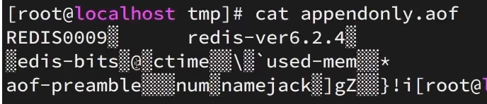

除了手动执行BGREWRITEAOF命令，Redis也会在一定条件下自动重写，触发条件可以由Redis.conf进行配置

```conf
# AOF文件最大增长率，超过该比例将触发重写。默认为100%，即超过一倍大小将触发重写
auto-aof-rewrite-percentage 100
# AOF文件最大体积，超过该体积则触发重写
auto-aof-rewrite-min-size 64mb
```

**综合对比**

| 持久化方案   | RDB                                | AOF                                                |
| ------------ | ---------------------------------- | -------------------------------------------------- |
| 实现方式     | 定时对内存做快照                   | 记录每次执行的写命令                               |
| 数据完整性   | 不完整，两次备份之间的数据会丢失   | 相对完整，完整性取决于刷盘策略                     |
| 文件大小     | 会自动压缩，文件体积较小           | 相对较大，可以采用命令重写                         |
| 宕机恢复速度 | 很快，直接覆盖数据文件即可         | 慢，恢复速度取决于命令长度                         |
| 系统资源占用 | 高，需要大量CPU和内存执行备份      | 低，主要是硬盘IO资源，不过在重写时需要消耗大量资源 |
| 使用场景     | 数据完整性需求较低，追求更高的性能 | 数据完整性与安全性要求较高                         |

### Redis集群

单节点Redis的并发能力是有上限的，因此要进一步提高Redis的并发能力，就需要搭建主从集群，实现读写分离。而主从集群是指，一台Web服务器连接Redis时，可以提供由多个Redis服务器组成的集群，而在这个集群中每个Redis服务器的角色是不同的， 分为master和slave/replica，master一般负责写，布置较少，slave/replic负责读，布置较多，这样可以大大提升Redis的读性能

而为了保证数据一致，需要master节点将数据同步给slave节点，以保证在任何slave节点都能够读取到正确的数据

#### 建立主从集群

建立Redis主从集群有两种方式，第一种是在Redis命令台中输入命令来配置主从关系，这种方式是临时生效的

```bash
# Redis 5.x之前
slaveof <masterIp> <masterPort>
# Redis 5.x之后
replicaof <masterIp> <masterPort>
```

*注：slaveof在5.x之后同样可用，master节点不需要命令，默认所有节点均为master*

第二种则是在配置文件redis.conf中使用slaveof指定master节点，注册为其slave节点，这种方式是永久生效的

```conf
slaveof <masterIp> <masterPort>
```

*注：一般不采用配置方式，因为主从关系很可能会变动*

在启用Redis后，可以通过命令info replication来查看当前服务的主从关系

> 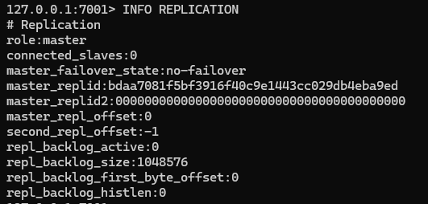

现在我们准备三个Redis服务，端口分别为7001、7002、7003，7001为master，其余的为slave。需要注意的是，不要使用windows的Redis5.x版本，windows的Redis5.x版本存在已知问题，主从集群无法正确连接

> 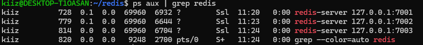

在7002中输入

```bash
SLAVEOF localhost 7001
```

然后检查关系状态，确认role为slave，并且master_link_status为up，保证主从连接成功

> 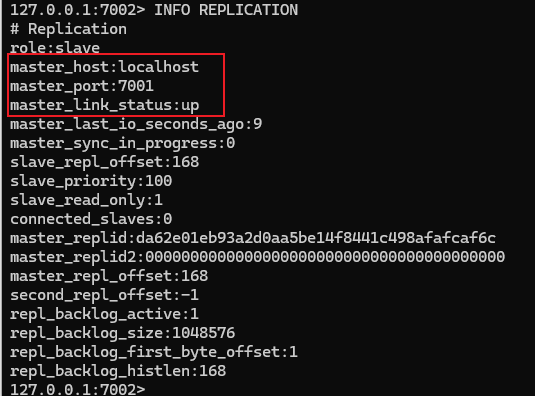

7003执行同样的步骤

> 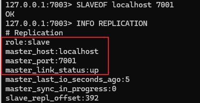

登录7001，查看7001的slave状态

> 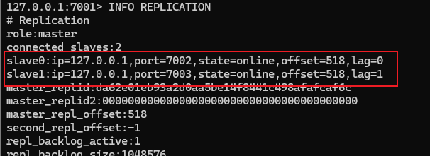

Redis主从集群默认是同步的，而且仅有master节点拥有写权限。我们先尝试在7002中写数据

> 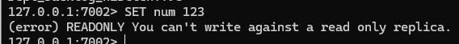

提示仅有读权限，然后我们在7001中写入一个num，再使用7002读取

> 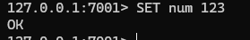
>
> 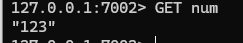

#### 主从同步原理

当主从第一次同步连接，或者由于某些原因断开重连时，从节点都会发送一个psync请求，尝试数据同步。主节点在接收到psync请求后，先判断从节点是否为第一次同步，如果是第一次同步，则向从节点发送自己的全部数据，这种同步被称为全量同步；如果从节点不是第一次同步，而是断开重连，则主节点没必要进行全量同步，而是将从节点缺少的数据发送给从节点，这种同步被称为增量同步。在连接保持时，每当主节点写数据，都会将命令发送给所有从节点，保持实时同步

> 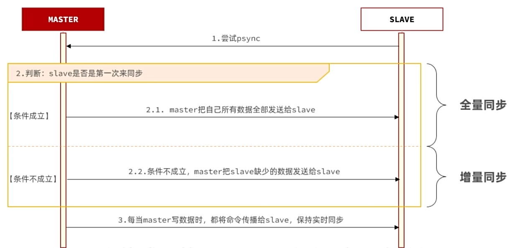

##### 首次连接判断

在建立主从集群之前，每个Redis服务都有一个属于自己的replicationID，简称replid，并且每个服务的id都不同

> 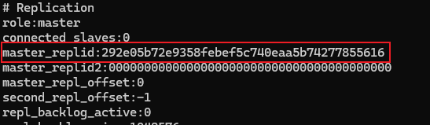

而在主从集群建立之后，master节点会重新生成一个replid，并将自己的id分享给所有的slave节点，简单来说，主从集群中所有的redis服务共用一个replid

> 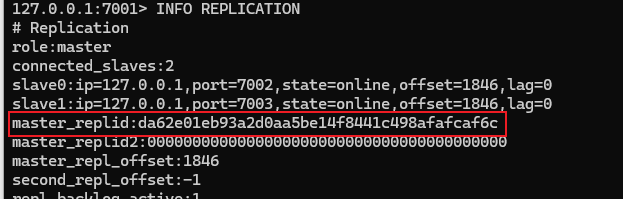
>
> 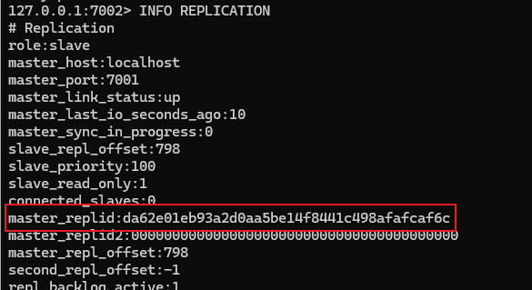

而判断是否为第一次同步就是依据replid，如果replid与当前主从集群的id一致，则说明该节点先前与master有过同步记录，因此下一步进行增量同步；而如果replid与当前主从集群的id不一致，则说明是第一次同步，需要全量同步

##### 同步机制

###### 全量同步

上文提到，RDB文件会保存Redis中所有的数据，因此全量同步就是基于RDB实现的。在从节点第一次连接后，主节点触发一次BGSAVE，生成一个RDB文件，在生成完成后，将RDB文件发送给从节点，从而完成同步。不过RDB文件并不包含主节点所有的数据，因为BGSAVE是由子进程进行的，在文件生成途中可能还有写操作，因此主节点会将新的写操作保存在内存缓冲区repl_baklog中，在RDB文件生成完成后，将repl_baklog一并发送给从节点，这样才实现全量同步

> 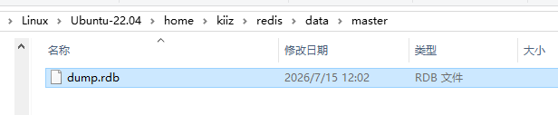

###### 增量同步

假设从节点因为网络故障异常断开，网络恢复后又重新连接，这时就需要进行增量同步。但检查数据增量是非常麻烦的，所以Redis在进行增量同步时并不是发送数据增量，而是从节点缺失的命令增量。这个命令增量就是repl_baklog，repl_baklog的创建时机是第一个从节点连接成功的时刻立即创建，然后开始记录命令，这样当任意从节点在任意时刻断开连接，主节点都能拥有完整的命令记录。而增量同步的核心思想是利用一个offset偏移值，offset记录了repl_baklog文件的长度，保持连接时，主节点与从节点的offset保持一致，而断开连接后，主节点offset继续增大，从节点offset保持不变。一旦从节点重新连接，只要获取了从节点的offset值，就可以得知从节点是何时断开连接，并且也能得知从节点缺少哪些命令，然后主节点再将缺失的命令发送给从节点

> 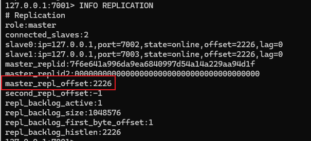
>
> 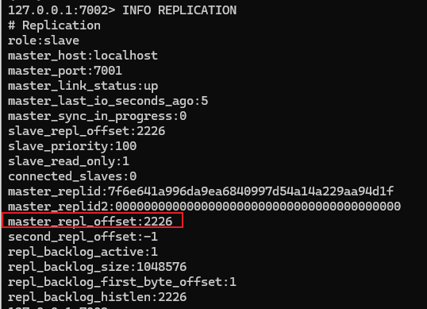

##### 同步优化

上文我们提到，增量同步的重点在于repl_baklog文件记录主节点命令，但是当主节点命令越来越多，repl_baklog文件也越来越大，repl_baklog默认位于内存中，如果容量太大，会直接影响Redis的运行安全，因此Redis针对repl_baklog文件的大小进行了限制，默认最大仅为1Mib。而一旦对repl_baklog文件容量进行限制，就又会出现新的问题，假设repl_baklog文件被写满，又该如何记录命令？这里Redis为repl_baklog设计了一个特殊的数据结构，repl_baklog是一个环形数组，当数组填满时，新的数据会从0开始覆盖旧的数据，避免repl_baklog被写满。

但这又会引出新的问题，假设环形数据的下标最大值为1000，目前主从节点的offset位于127，此时某个从节点因为网络原因断开连接，而主节点继续执行命令，由于命令较多，repl_baklog文件被写满，只能从0下标开始覆盖，直到超过127。一段时间后，网络恢复，从节点重新连接主节点，但此时从节点的offset已经被新的值覆盖，增量同步完全失效，所以就只能进行全量同步。

而全量同步应当尽量避免，因为dump.rdb文件在长期使用后可能达到Gib级别，从内存写入磁盘，再从磁盘由网络发送到从节点会非常消耗主节点服务器资源，导致严重的性能问题

针对以上问题，我们可以实施下列的几种优化方案：

- 在master中配置repl-diskless-sync yes启用无磁盘复制，在全量同步时直接从内存中传输数据，避免磁盘IO
- 设置Redis单节点内存占用限制，减少rdb文件导致的过多磁盘IO
- 适当提高repl_baklog文件大小，尽快修复从节点故障，避免从节点offset被覆盖，从而避免全量同步
- 限制一个master上的从节点数量，或是采用主从从链式结构，减少master压力

#### 哨兵

上文我们提到的问题都是基于从节点故障的情况，但如果是主节点故障，就会产生非常严重的影响。因此Redis提供了哨兵机制来实现主从集群的自动故障恢复。

哨兵是独立于Redis主从集群之外的服务，并且为了避免哨兵本身存在异常，通常会布置多个哨兵服务形成哨兵集群。哨兵的主要工作内容是监控主从集群中各个节点的运行情况，如果此时主节点发生异常断开连接，哨兵也能将某个从节点提升为新主节点，从而保持业务的正常运行。当原来的主节点恢复后，将会被降级为从节点。当主从集群发生故障时，哨兵也需要将新的主节点与从节点的信息推送到Redis客户端

##### 服务监控

哨兵的服务状态监控基于心跳机制，即每隔1秒向集群的所有节点发送一个PING命令，Redis默认在接收到PING命令后会返回一个PONG

> 

如果某个哨兵发现某个节点在规定时间内未响应PONG，则该实例对于哨兵主观下线。当超过指定数量 quorum 的哨兵都认为某节点主观下线时，则认为该实例客观下线，从而认定服务失效。quorum的值应当超过哨兵数量的一半

##### master选举

一旦master故障，哨兵就需要在slave中重新挑选一个新的master，选择依据如下：

- 判断slave节点与master节点断开时间长短，如果超过指定值，则会排除该slave节点。这个值由 down-after-millisecondes \* 10来得到
- 判断slave节点的slave-priority值，也就是优先级，值越小优先级越高，如果值为0则表示永不参与选举。默认值为1
- 判断slave节点的offset值，越大说明数值越新，优先级越高
- 判断slave节点的运行id，id越小优先级越高。但实际上运行id是随机生成的，也就等同于随机选举

这四条选举规则是顺序进行的，只有先满足上面的，再对下一条进行匹配

当新的master选举成功后，哨兵会向其发送一条SLAVEOF NO ONE命令，让该节点提升为master，然后向其他所有节点发送SLAVEOF \<NEW MASTER HOST\> \<NEW PORT\>命令，让其余的所有节点成为新master的slave节点，开始从新的master节点中同步数据。而旧master会被标记为slave，当节点修复后，自动成为新的master的slave节点

##### 哨兵集群

###### 搭建哨兵集群

首先需要关闭当前的主从集群

> 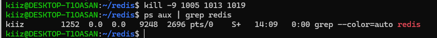

然后编写sentinel.conf配置文件，这里提供了一份最小可用文件

在哨兵的配置文件中，只需要指定master节点的ip以及端口即可，从节点的相关数据能够通过主节点获取

```conf
port 27001
daemonize yes
pidfile "/home/kiiz/redis/sentinel/s1.pid"
logfile "/home/kiiz/redis/sentinel/s1.log"
dir "/home/kiiz/redis/sentinel/data/s1"

# 监控主节点 IP 端口 以及法定票数(quorum)
sentinel monitor mymaster 127.0.0.1 7001 2

# 判定主节点下线的时间阈值（毫秒）
sentinel down-after-milliseconds mymaster 5000

# 故障转移超时时间
sentinel failover-timeout mymaster 60000
```

然后复制多个配置文件，修改端口以及pidfile、logfile和dir位置，启动哨兵集群

哨兵可以通过redis-server和redis-sentinel两种方式来启动，如果通过redis-server，则需要添加参数--mode=sentinel，而redis-sentinel则需要单独安装

> 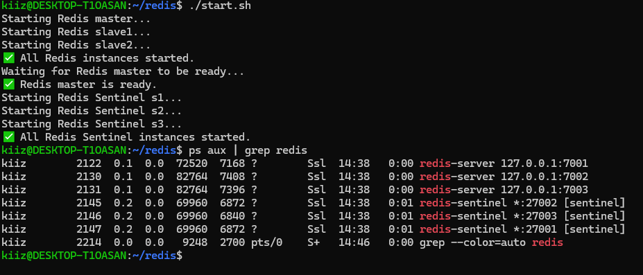

通过redis-cli连接其中一个哨兵，输入命令INFO SENTINEL来查看哨兵集群情况

> 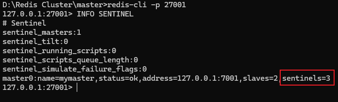

###### 哨兵集群工作流程

现在我们停止master，模拟主节点宕机

> 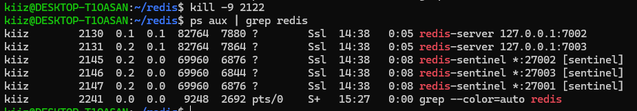

在master断开后，s2首先检测到，然后发送了一条`+sdown master mymaster 127.0.0.1 7001`主观下线通知，而后s1检测到，也发送了一条+sdown主观下线通知，最后是s3

> 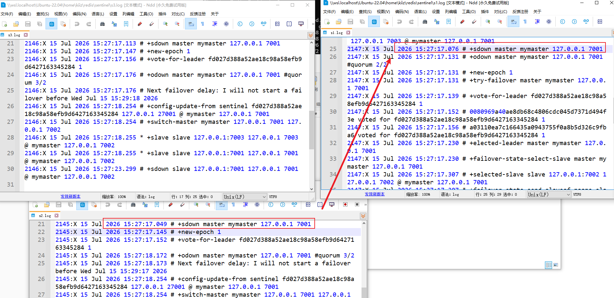

我们设置的quorum为2，因此在s1中，当quorum满足2/2时，发送了一条`+odown master mymaster 127.0.0.1 7001 #quorum 2/2`客观下线通知

> 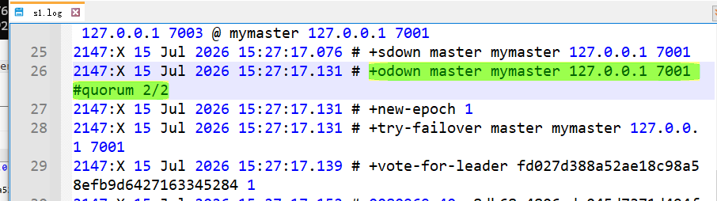

然后哨兵集群协商故障转移主导，也就是`+vote-for-leader`，一般来说，谁最先发送+odown通知，谁主导故障转移，因此s1为自己投了一票

> 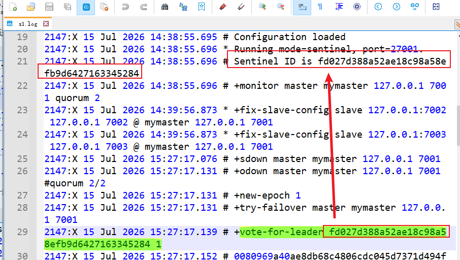

然后s2和s3也都为s1投票

> 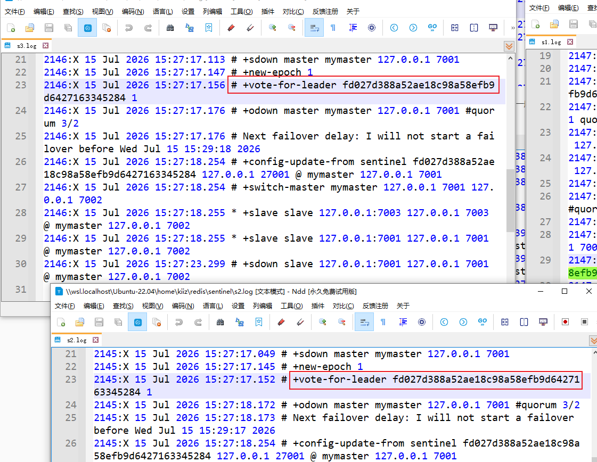

现在确认由s1主导，因此s1发布了`+elected-leader`担任通知

> 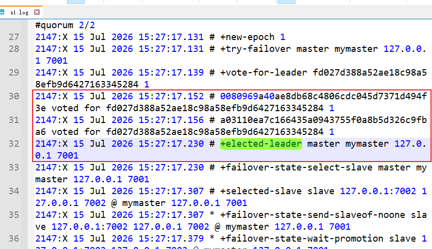

然后s1开始进行故障转移，首先选举新的master，这里选中了7002

> 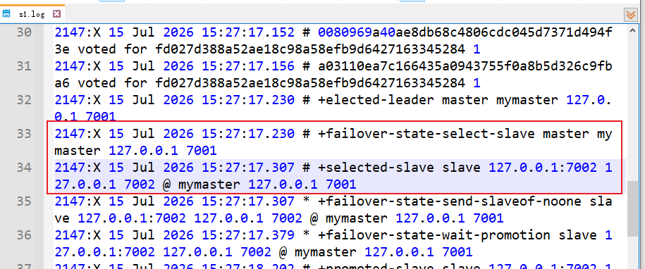

选中7002后，s1下发SLAVEOF ON ONE命令，将7002提升为master

> 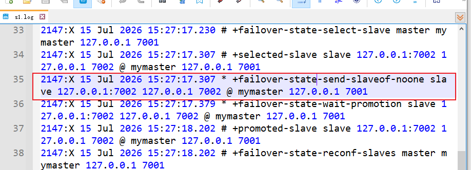

新的master被选举后，s1向其他节点发送通知，告知新的master，以及旧的master被降级

> 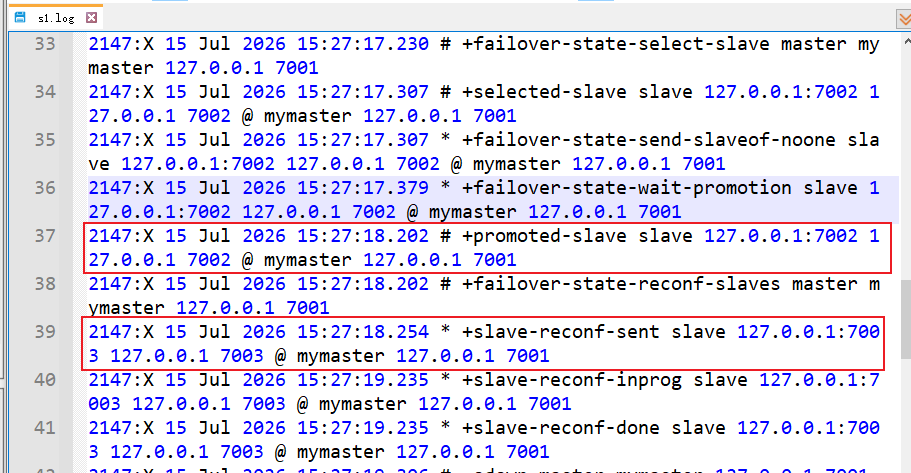

故障转移后，s1随即下发-odown，宣布事实下线事件结束，同时切换master，然后宣布子节点主观下线

> 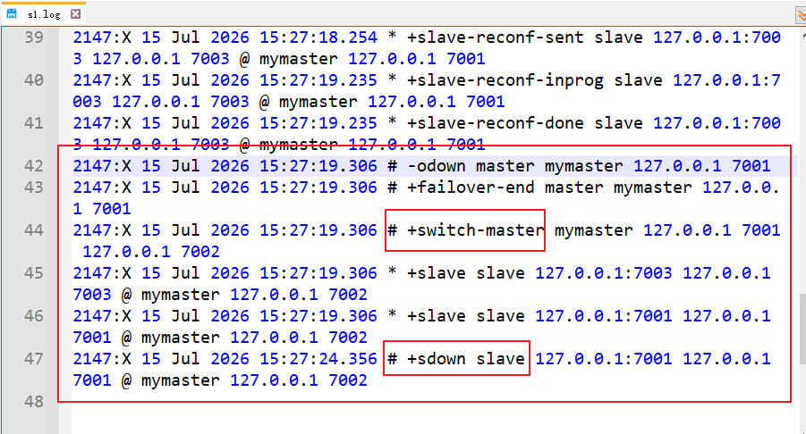

此时我们再重启旧master

> 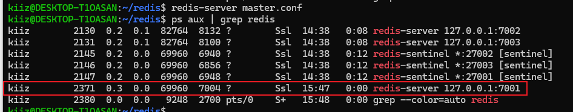

s1检测到7001上线后，关闭slave sdown主观下线，并将其降级为slave

> 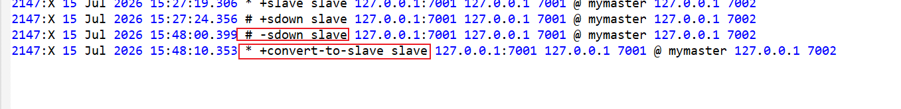

最后我们通过redis-cli来检查7001是否被降级

> 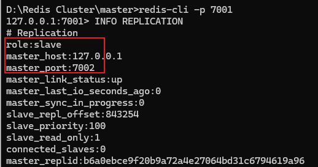

### Redis分片集群

主从和哨兵集群可以解决高可用，高并发读的问题，但是依然无法解决海量数据存储以及高并发写的问题。而分片集群则可以解决这些问题，分片集群的特征是集群中有多个master，每个master保存不同的数据，每个master都可以有多个slave节点，而master之间都可以进行类似sentinel的健康状态检测，当检测到某一个master不可用时，也能够从slave中选举出新的master

#### 搭建分片集群

我们部署一个简单的分片集群，准备三个master，每个master只拥有一个slave。首先创建对应的配置项，分片集群的配置项中必须添加cluster相关的配置，以下是一个最小可用配置

```conf
# ========== 网络绑定 ==========
bind 127.0.0.1
port 7001
protected-mode yes

# ========== 后台运行 ==========
daemonize yes
pidfile /home/kiiz/redis/data/r1/r1.pid

# ========== 日志 ==========
loglevel notice
logfile /home/kiiz/redis/data/r1/r1.log

# ========== 持久化（最小 RDB） ==========
save 900 1
save 300 10
save 60 10000
dir /home/kiiz/redis/data/r1/
dbfilename dump.rdb

# ========== 内存控制（推荐） ==========
maxmemory 256mb
maxmemory-policy allkeys-lru

# ========== 关闭 AOF ==========
appendonly no

# ========== Cluster 必须项 ==========
cluster-enabled yes
cluster-config-file nodes.conf
cluster-node-timeout 5000
```

然后依据这个模板，我们创建r2-r6，同时注意data中应包含r1-r6的目录用于存放数据文件

> 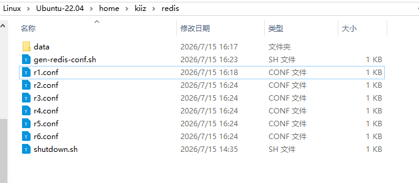

接着启动所有的redis-server，同时创建一个集群，设置三主三从，然后将所有redis-server添加到集群中。这里集群会自动选择主从归属，不需要我们手动指定，默认情况下，会先分配master，再分配slave

```bash
#!/bin/bash

BASE_DIR="/home/kiiz/redis"

# ========== 1. 启动所有 Redis 实例 ==========
echo "🚀 启动 Redis 实例..."

for i in {1..6}; do
  CONF="${BASE_DIR}/r${i}.conf"
  if [ -f "${CONF}" ]; then
    redis-server "${CONF}"
    echo "✅ r${i} 启动成功 (port 700${i})"
  else
    echo "❌ 配置文件不存在: ${CONF}"
    exit 1
  fi
done

# ========== 2. 等待节点就绪 ==========
echo "⏳ 等待 Redis 节点就绪..."
sleep 2

# ========== 3. 创建集群 ==========
echo "🔧 创建 Redis Cluster (replicas = 1)..."

yes yes | redis-cli --cluster create \
  127.0.0.1:7001 \
  127.0.0.1:7002 \
  127.0.0.1:7003 \
  127.0.0.1:7004 \
  127.0.0.1:7005 \
  127.0.0.1:7006 \
  --cluster-replicas 1

echo "✅ Redis Cluster 创建完成"
```

> 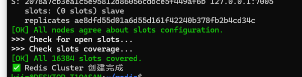

同时也能观察到集群自动选择了master及其对应的slave，如预期所料，r1-r3被选为了master，而r4-r6为slave

> 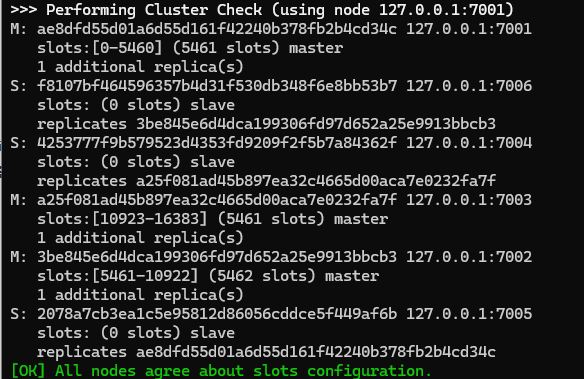

然后我们访问r1，从r1处获取集群信息

```bash
kiiz@DESKTOP-T1OASAN:~/redis$ redis-cli -p 7001 cluster nodes
f8107bf464596357b4d31f530db348f6e8bb53b7 127.0.0.1:7006@17006 slave 3be845e6d4dca199306fd97d652a25e9913bbcb3 0 1784105425000 2 connected
ae8dfd55d01a6d55d161f42240b378fb2b4cd34c 127.0.0.1:7001@17001 myself,master - 0 1784105426000 1 connected 0-5460
4253777f9b579523d4353fd9209f2f5b7a84362f 127.0.0.1:7004@17004 slave a25f081ad45b897ea32c4665d00aca7e0232fa7f 0 1784105425529 3 connected
a25f081ad45b897ea32c4665d00aca7e0232fa7f 127.0.0.1:7003@17003 master - 0 1784105425027 3 connected 10923-16383
3be845e6d4dca199306fd97d652a25e9913bbcb3 127.0.0.1:7002@17002 master - 0 1784105426000 2 connected 5461-10922
2078a7cb3ea1c5e95812d86056cddce5f449af6b 127.0.0.1:7005@17005 slave ae8dfd55d01a6d55d161f42240b378fb2b4cd34c 0 1784105426330 1 connected
```

从左往右看，第一列为NodeID，节点唯一标识，用于标识集群中的节点；第二列是节点地址，127.0.0.1:7006是节点所在网络地址，@17006是集群总线端口，这个端口由port + 10000得来，用于节点间gossip通信，因此防火墙必须放行该端口；第三列是集群角色，一般为master和slave，当前节点用myself标识；第四列是主节点NodeID，仅有slave节点才有这个属性，因此所有的master节点第四列为-；第五列为Redis内部的flag位编码，0标识正常，非零值标识可能存在某些异常；第六列为最近一次集群状态变更时间戳，单位毫秒；第七列为集群逻辑时钟，这里暂不做介绍；第八列为链路状态，connected标识正常连接，其余状态还有disconnected不可达，fail?疑似下线，fail确认下线；master节点还有第九行slot分配范围，这里也暂不做介绍

#### 散列插槽

master节点的第九行的slot全称为Hash Slot散列插槽，Redis中共有16384个插槽，在分片集群中，会将所有的插槽分配给集群中的每一个master节点。Redis数据并不与节点绑定，而是与插槽Slot绑定。当需要读写数据时，Redis基于CRC16算法对key进行hash运算，得到的结果与16384模运算，从而得到这个key的slot值，然后到插槽对应的Redis节点进行读写操作

Redis的Hash运算相较常规运算有些不同，当key中包含大括号`{}`时，Redis会取大括号中的字符串来计算hash slot，如果不包含大括号，则会按照原始字符串来进行计算。大括号的一个重要作用是将数据存储在同一个节点上

**示例**

假设我们需要存储用户ocean的信息，先连接7001，然后执行命令SET user ocean

> 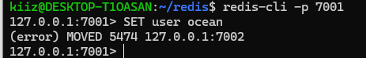

这时却出现了报错，因为定义的key为user，而user在进行slot运算后得到的结果为5474，插槽5474位于7002上，因此Redis不允许我们在7001上插入数据。这里需要在redis-cli后添加一个-c参数，启用cluster模式，这样redis-cli就可以帮我们自动跳转

> 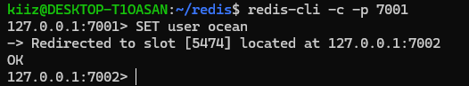

然后我们再设置用户年龄22，执行命令SET age 22，结果又跳转回了7001

> 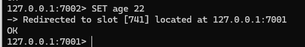

如果此时想要获取用户名GET user，又得跳转到7002，这样就显得非常麻烦，因此可以使用大括号来为key添加一个前缀，例如{user}:name设置用户名，{user}:age设置用户年龄，以保证用户信息存储在一个节点中

> 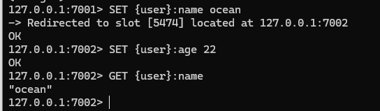

#### 故障转移

Redis分片集群不需要哨兵集群，自己就能完成整个故障转移过程。从逻辑上来看，分片集群每个主节点其实就可以担任一个哨兵职位，当发现某一个主节点下线时，其他的主节点位于同一个集群中，就可以立即发现下线节点，然后通过故障转移步骤选举出新的主节点，保证集群的高可用性

##### 数据迁移

Redis分片集群也支持手动故障转移，这又被称为数据迁移，因为这是可控的。数据迁移利用CLUSTER FAILOVER命令，让节点中的某个master节点宕机，然后Redis分片集群会自动将其slave节点提升为master，并完成数据迁移，大致步骤如下

> 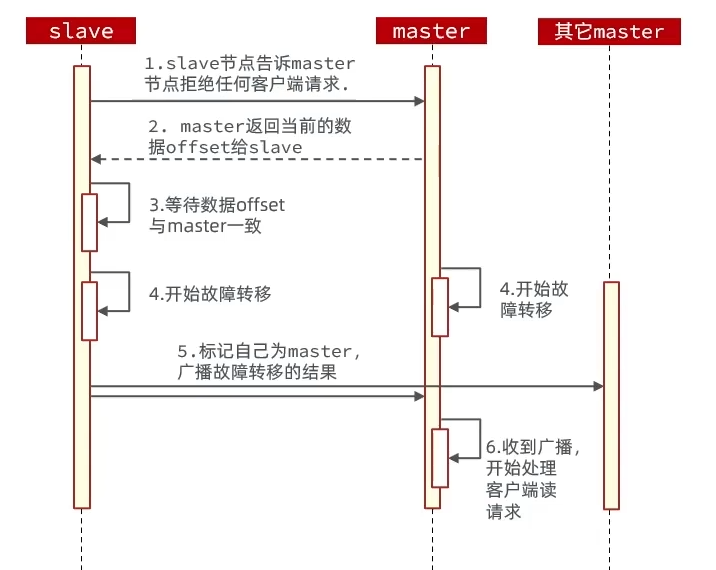

数据迁移有三种模式

- 缺省：默认流程，即上图中的六个步骤
- force：忽略对offset的校验
- takeover：直接将自己标记为master，忽略数据一致性，忽略master状态和其他master意见

## 多级缓存

传统缓存结构中，我们部署的缓存仅有Redis，请求到达Tomcat，先查询Redis，如果未命中则查询数据库，最后返回。而这里其实有个问题，Tomcat本身的并发能力还不如Redis，换句话说，Tomcat并不能发挥出Redis的最佳利用率。而且Redis的Key存在TTL，当缓存过期时，大量请求会直接到达数据库，对数据库造成影响

因此我们需要额外建立多级缓存，在请求的每个环节都添加对应的缓存，减轻Tomcat压力，以及防止请求直达数据库

在一般的开发中，我们会建立如下的缓存结构

> 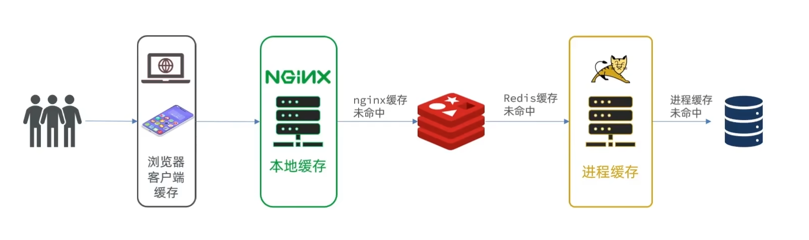

首先是浏览器缓存，浏览器可以缓存静态网页资源，而在网页浏览中，几乎绝大多数的资源都是静态资源，因此浏览器缓存可以大幅提升用户体验；而动态资源，如后端请求，浏览器就无法建立缓存，需要通过NGINX反向代理获取数据。而NGINX本身其实支持编程，可以建立NGINX本地缓存，如果用户的请求在NGINX中有缓存，那么就可以直接返回前端，请求根本无法到达后端。对于NGINX本地缓存未命中，就需要在Redis中查询缓存，不过这里就不直接通过Tomcat查询Redis，而是NGINX直接查询Redis，因为NGINX支持直接编程查询Redis，而且Tomcat性能不如Redis，而NGINX性能优于Redis，以保证Web服务器不会影响缓存查询性能。如果Redis缓存未命中，则进入Tomcat后端业务，不过这里仍未直接查询数据库，而是查询Tomcat自己的进程缓存，如果进程缓存中存在对应数据，就直接返回，最后再查询数据库。总的来说，多级缓存就是尽最大可能，在请求路径上每一个可能的节点添加缓存，以避免请求到达数据库

### JVM缓存

缓存在日常开发中起着至关重要的作用，由于是存储在内存中，数据的读取速度非常快，能大量减少对数据库的访问，减少数据库的压力。按照部署位置，我们一般将缓存分为两类

- 分布式缓存：如Redis，优点是存储容量大，可靠性更好，可以在集群间共享缓存；缺点是访问缓存需要网络开销，如果网络异常，缓存直接无法使用；适用场景为缓存数据量较大，可靠性要求较高，需要在集群间共享
- 进程本地缓存：如HashMap、GuavaCache等，优点是读取本地内存，没有网络开销，读取更快；缺点也很明显，存储容量非常有限，可靠性较低，服务异常则缓存异常，无法共享；适用场景为对性能要求较高，缓存数据量较小

#### Caffeine

Caffeine是一款基于Java8开发的，提供了近乎最佳命中率的开源高性能本地缓存解决方案，目前Spring内部的缓存就是基于Caffeine

##### 快速入门

我们利用Caffeine来建立一个本地JVM缓存，实际使用非常简单

```java
@Test
public void test() {
    // 创建缓存对象
    Cache<String, String> cache = Caffeine.newBuilder().build();
    // 存储一个数据
    cache.put("name", "jack");
    // 获取数据，不存在则返回null
    String value = cache.getIfPresent("name");
    System.out.println("value = " + value);
    // 获取数据，不存在则执行数据库查询
    String value2 = cache.get("name1", k -> {
        System.out.println("从数据库查询数据");
        return "tom";
    });
    System.out.println("value2 = " + value2);
}
```

首先创建一个Caffeine缓存对象，然后向缓存对象中插入数据，查询时使用get或者getIfPresent方法尝试获取，不同的是get在获取失败后会执行一个回调方法，而getIfPresent直接返回null

> 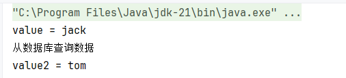

#### 缓存驱逐策略

如同Redis的Key淘汰策略一样，为了减少内存开销，Caffeine也需要有缓存淘汰策略来提供更加的内存利用率，Caffeine默认提供了三种缓存驱逐策略

- 基于容量：设置缓存数量上限，超过缓存数量上限时，前一个缓存会被驱逐
- 基于时间：类似Redis的TTL，为每一个缓存设置一个有效期，有效期截止后不会马上驱逐，而是在下一次读写操作，或者在空间时间完成驱逐
- 基于引用：设置缓存为软引用或者弱引用，利用JVM的GC垃圾回收机制来回收内存，一般不使用

下面是一个基于时间过期驱逐策略的示例

```java
/* 基于时间过期的缓存 */
@Test
public void test2() throws InterruptedException {
    Cache<String, String> cache = Caffeine.newBuilder()
            .expireAfterWrite(Duration.ofSeconds(2)) // 设置写入后过期时间
            .build();

    cache.put("name", "jack");
    // 立即获取缓存
    System.out.println(cache.getIfPresent("name"));
    // 等待2秒再获取缓存
    Thread.sleep(2000);
    System.out.println(cache.getIfPresent("name"));
}
```

> 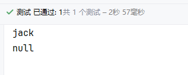

基于容量过期的api也相似，在创建缓存对象时调用maximumSize，并传入最大缓存数量即可

#### 实现商品查询的本地进程缓存

利用Caffeine实现一个本地缓存功能，给根据id查询商品及商品库存的业务添加缓存，缓存未命中时查询数据库。缓存初始大小设置为100，缓存上限为10000

```java
package com.heima.item.config;

import com.github.benmanes.caffeine.cache.Cache;
import com.github.benmanes.caffeine.cache.Caffeine;
import com.heima.item.pojo.Item;
import com.heima.item.pojo.ItemStock;
import org.springframework.context.annotation.Bean;
import org.springframework.context.annotation.Configuration;

@Configuration
public class CaffeineConfig {

    @Bean
    public Cache<Long, Item> itemCache() {
        return Caffeine.newBuilder()
                .initialCapacity(100)
                .maximumSize(10_000)
                .build();
    }

    @Bean
    public Cache<Long, ItemStock> stockCache() {
        return Caffeine.newBuilder()
                .initialCapacity(100)
                .maximumSize(10_000)
                .build();
    }
}
```

定义一个CaffeineConfig，声明两个Bean，返回两个缓存对象，一个用于缓存商品信息，一个用户缓存商品库存

```java
@Override
public Item findById(Long id) {
    return itemCache.get(id, this::getById);
}
```

然后在Service中直接调用缓存对象的get方法，回调方法设置为IService的getById即可。这里不需要手动设置缓存逻辑，Caffeine会自动对没有缓存的数据建立缓存

### NGINX本地缓存

NGINX中可以使用Lua语言来建立本地缓存。NGINX由C语言编写，所以有强大的高并发能力，而Lua语言也源自C，所以NGINX开放了对于Lua的脚本功能，使其实现一些业务功能

有关Lua教程可以参考[Lua](../Lua/Lua.md)

#### OpenResty

OpenResty是一个基于NGINX的高性能Web平台，用于方便地搭建能够处理超高并发、扩展性极强的动态Web应用、Web服务以及动态网关，其具备NGINX的完整功能，基于Lua语言进行扩展，集成了大量的Lua库，第三方模块，并且允许使用Lua自定义业务逻辑，自定义库

##### 快速入门

在原版NGINX中，进行反向代理的语法如下

```conf
location /api {
    proxy_pass http://backend;
}
```

通过location关键字，拦截路径为/api的所有url，并转发到http://backend。但是OpenResty需要通过Lua执行脚本，因此需要改用关键字content_by_lua_file，并指定一个Lua脚本，同时设定响应类型

```conf
# 代理/api/item
location /api/item {
    # 设置响应类型，即MIME类型
    default_type application/json;
    # 设置Lua脚本
    content_by_lua_file lua/item.lua;
}
```

lua脚本的返回值即是请求的响应内容，换句话说，NGINX仅仅执行了反向代理，而OpenResty是搭建了一个基于Lua的轻量级后端。不过在此之前，还需要在http块中引入依赖

```conf
# 引入lua模块
lua_package_path "<lualibPath>\?.lua;;";
# 引入c模块
lua_package_cpath "<lualibPath>\?.so;;";
```

*注：这里的\<lualibPath>表示你的lualib目录的位置*

然后就可以开始编写业务逻辑了，这里我们编写一个商品详情页的查询逻辑，先不查询真实数据，而是返回一段测试数据，验证OpenResty是否可用。在Lua中，通过ngx.say()函数返回页面响应，格式为json

```lua
ngx.say([[{
    "id": 10001,
    "name": "SALSA AIR TEST",
    "title": "RIMOWA 21寸托运箱拉杆箱 SALSA AIR TEST系列果绿色 820.70.36.4",
    "price": 99900,
    "image": "https://m.360buyimg.com/mobilecms/s720x720_jfs/t6934/364/1195375010/84676/e9f2c55f/597ece38N0ddcbc77.jpg!q70.jpg.webp",
    "category": "拉杆箱",
    "brand": "RIMOWA",
    "spec": "{\"颜色\": \"红色\", \"尺码\": \"26寸\"}",
    "status": 1,
    "createTime": "2019-04-30T16:00:00.000+00:00",
    "updateTime": "2019-04-30T16:00:00.000+00:00",
    "stock": null,
    "sold": null
}]])
```

我们将10001商品中更改几个数据，例如将价格改为999，然后访问localhost查看内容

> 


可以看到价格更改成功，商品名也新增了TEST字样。总的来说，从JavaWeb的视角来看，OpenResty就是Controller，而Lua脚本就是Service，后面的内容就是通过Lua脚本来访问Redis或者发起远程调用访问Java后端

#### 获取请求参数

OpenResty提供了多个api来获取不同类型的请求参数，下面提供几种常用的参数类型

| 参数         | 示例         | API说明                                                      |
| ------------ | ------------ | ------------------------------------------------------------ |
| 路径占位符   | /item/1001   | 在nginx.conf中利用正则表达式匹配占位符，然后通过ngx.var数组获取 |
| 请求头       | id: 1001     | ngx.req.get_headers()获取所有请求头，返回值类型为table       |
| GET请求参数  | ?id=1001     | ngx.req.get_uri_args()获取GET类型参数，返回值类型为table     |
| POST表单参数 | id=1001      | 首先通过ngx.req.read_body()读取请求体，然后通过ngx.req.get_post_args()获取所有POST表单数据，返回值类型为table |
| JSON请求体   | {"id": 1001} | 首先通过ngx.req.read_body()读取请求体，然后通过ngx.req.get_body_data()获取请求体中的数据，返回值类型为string |

**示例**

路径占位符首先需要在nginx.conf中定义对应的反向代理，使用location \~表示路径中存在正则表达式

```conf
# 反向代理/api/item
location ~ /api/item/(\d+) {
    # 设置响应类型，即MIME类型
    default_type application/json;
    # 设置Lua脚本
    content_by_lua_file lua/item.lua;
}
```

```lua
local id = ngx.var[1]
ngx.say(id)
```

然后通过Postman测试一下

> 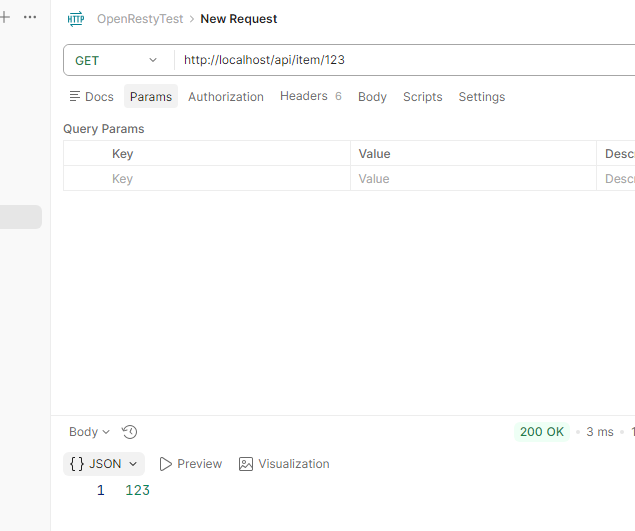

#### 通过OpenResty发起远程调用

在建立NGINX本地缓存之前，OpenResty需要拥有数据才能进行缓存，因此我们需要向Tomcat发起远程调用，获取对应的缓存数据。因此，我们需要获取请求参数中的id，根据id向Tomcat服务发送请求查询商品信息和库存信息，并组装商品信息、库存信息，序列化为JSON格式并返回前端

在OpenResty中，远程调用通过ngx.location.capture，传入两个参数，第一参数为请求路径，参数类型为string，第二个参数为请求内容，参数类型为table

```lua
local res = ngx.location.capture("/path", {
    method = ngx.HTTP_GET,
    args = {
        a = 1,
        b = 2
    },
    body = "a=1&b=2"
})
```

args负责URL传参，body负责请求体传参，两者仅能同时存在一个，返回值res包含三个属性，status响应码、header请求头，类型为table、body响应体。这里需要注意的是，请求的路径仅填写path，而不包含IP以及端口。OpenResty的请求会被自己的NGINX监听，通过NGINX反向代理到Tomcat

```conf
# 反向代理到Tomcat
location /item {
    proxy_pass http://localhost:8081;
}
```

为了方便使用，我们可以将ngx.location.capture再封装为单独的函数，配置在OpenResty的函数库中。床见openresty/lualib/common.lua文件，在common.lua中编写代码

```lua
-- get请求
local function http_get(path, params)

    if not path or path == "" then
        ngx.log(ngx.ERROR, "请求路径为空")
        ngx.exit(400)
    end

    -- 发起请求
    local res = ngx.location.capture(path, {
        method = ngx.HTTP_GET,
        args = params
    })

    -- 获取响应
    if not res then
        ngx.log(ngx.ERROR, "请求路径不存在")
        ngx.exit(404)
    end
    return res.body
end

local _M = {
    http_get = http_get
}

return _M
```

然后在业务lua中调用common库

```lua
-- 导入common.lua
local common = require("common")

-- 获取路径参数
local id = ngx.var[1]

if not id then
    ngx.say()
end

-- 查询商品信息
local item = common.http_get("/item/" .. id, nil)
local stock = common.http_get("/item/stock/" .. id, nil)
```

这里通过http_get查询到的是JSON格式的字符串，但前端要求我们返回一条JSON，而lua本身并不能直接操作JSON，因此需要使用cjson库，将JSON转换为lua的table，然后进行组装。cjson文件位于openresty/lualib/cjson.so，是一个C编写的库，通过C接口来让lua能够访问

```lua
-- 导入common.lua
local common = require("common")
-- 导入cjson
local cjson = require("cjson")

-- 获取路径参数
local id = ngx.var[1]

if not id then
    ngx.say()
end

-- 查询商品信息
local itemJSON = common.http_get("/item/" .. id, nil)
local stockJSON = common.http_get("/item/stock/" .. id, nil)
-- 转换为table
local item = cjson.decode(itemJSON)
local stock = cjson.decode(stockJSON)
-- 组装数据
item.stock = stock.stock
item.sold = stock.sold
-- 返回结果
ngx.say(cjson.encode(item))
```

> 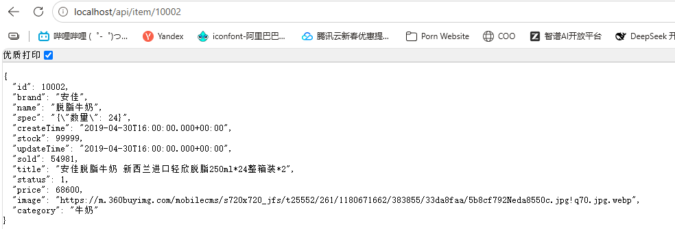

#### 基于哈希进行负载均衡

如果我们部署了多台Tomcat，形成了一个集群，在轮询负载均衡模式下，对于同一件商品，可能需要所有的Tomcat同时拥有该商品缓存，用户端才能有较好的缓存体验，但对于服务器内存资源来说这就是一种浪费。所以我们可以借鉴Redis的散列插槽的模式，对每个请求参数执行一次哈希运算，相同哈希结果的请求发送到同一台服务器中，保证缓存的最佳利用率

而NGINX其实自带这个哈希负载均衡算法，只需要在upstream集群中设置hash \$request_uri即可

```conf
upstream tomcat-cluster {
	hash $request_uri;
	server http://tomcat1:8080;
	server http://tomcat2:8080;
}
```

#### 通过OpenResty查询Redis缓存

##### Redis缓存预热

在实际开发中，项目上线前，为了避免大量用户请求直接到达数据库，会通过大数据统计手段对热点数据进行缓存，这一步被称为缓存预热，在该项目中，我们也模拟一次缓存预热，因为数据量很小，所以我们缓存全部数据

在Spring中，可以通过实现InitializingBean来定义一个初始化类

```java
package com.heima.item.config;

import lombok.RequiredArgsConstructor;
import org.springframework.beans.factory.InitializingBean;
import org.springframework.data.redis.core.StringRedisTemplate;
import org.springframework.stereotype.Component;

@Component
@RequiredArgsConstructor
public class RedisHandler implements InitializingBean {

    private final StringRedisTemplate redisTemplate;

    @Override
    public void afterPropertiesSet() throws Exception {
        
    }
}
```

在afterPropertiesSet方法中完成缓存的预热工作，即查询数据库中所有商品与库存信息，然后在Redis中进行缓存

```java
package com.heima.item.config;

import com.fasterxml.jackson.core.JsonProcessingException;
import com.fasterxml.jackson.databind.ObjectMapper;
import com.heima.item.pojo.Item;
import com.heima.item.pojo.ItemStock;
import com.heima.item.service.IItemService;
import com.heima.item.service.IItemStockService;
import lombok.RequiredArgsConstructor;
import org.springframework.beans.factory.InitializingBean;
import org.springframework.data.redis.core.StringRedisTemplate;
import org.springframework.stereotype.Component;

import java.util.HashMap;
import java.util.List;
import java.util.Map;
import java.util.stream.Collectors;

@Component
@RequiredArgsConstructor
public class RedisHandler implements InitializingBean {

    private final StringRedisTemplate redisTemplate;
    private final IItemService itemService;
    private final IItemStockService itemStockService;

    private static final ObjectMapper objectMapper = new ObjectMapper();

    private static final String ITEM_INFO_KEY_PREFIX = "item:info:";
    private static final String ITEM_STOCK_KEY_PREFIX = "item:stock:";

    @Override
    public void afterPropertiesSet() throws Exception {
        // 查询商品信息
        List<Item> itemList = itemService.list();

        if (itemList == null || itemList.isEmpty())
            return;

        Map<String, String> itemJsonMap = new HashMap<>(itemList.size());
        for (Item item : itemList) {
            Long id = item.getId();
            String json = objectMapper.writeValueAsString(item);
            itemJsonMap.put(ITEM_INFO_KEY_PREFIX + id, json);
        }
        // 存入Redis
        redisTemplate.opsForValue().multiSet(itemJsonMap);

        // 查询商品库存信息
        List<ItemStock> stockList = itemStockService.list();

        if (stockList == null || stockList.isEmpty())
            return;

        Map<String, String> itemStockJsonMap = new HashMap<>(stockList.size());
        for (ItemStock itemStock : stockList) {
            Long id = itemStock.getId();
            String json = objectMapper.writeValueAsString(itemStock);
            itemStockJsonMap.put(ITEM_STOCK_KEY_PREFIX + id, json);
        }
        // 存入Redis
        redisTemplate.opsForValue().multiSet(itemStockJsonMap);
    }
}
```

实现逻辑非常简单，通过Service查询到所有商品数据，然后通过for循环遍历数据，将每个实例转换为JSON，保存在Map中，最后通过MSET缓存到Redis中，使用MSET可以减少网络往返次数，提高预热性能

> 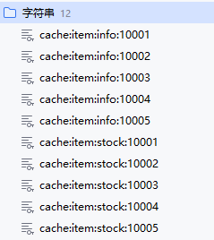

##### OpenResty查询Redis缓存

类似远程调用，OpenResty也提供了专门针对于Redis的请求API，名为resty.redis，位于openresty/lualib/resty/redis.lua

操作Redis更加复杂，需要先创建lua对象，然后设置超时时间，释放连接池等等

```lua
-- 引入Redis
local redis = require("resty.redis")
-- 创建Redis对象
local r = redis:new()
-- 设置Redis超时时间
r:set_timeouts(1000, 1000, 1000)

-- 释放连接到连接池
local function close_conn(r)
    -- 连接空闲时间，单位ms
    local pool_max_idle_time = 10000
    -- 连接池大小
    local pool_size = 100
    local ok, err = r:set_keepalive(pool_max_idle_time, pool_size)
    
    if not ok then
        ngx.log(ngx.ERR, "创建连接池出错", err)
    end
end
```

初始化完成后，再封装一个读取数据的函数

```lua
local function redis_get(ip, port, key)
    -- 建立连接
    local ok, err = r:connect(ip, port)
    if not ok then
        ngx.log(ngx.ERR, "连接Redis失败", err)
        return nil
    end
    
    -- 执行GET查询
    local res, err = r:get(key)
    -- 释放连接并返回
    close_conn(r)
    return res
end
```

在common.lua中粘贴这些代码，然后暴露redis_get供其他脚本调用

```lua
local _M = {
    http_get = http_get,
    redis_get = redis_get
}
```

然后修改itemInfo.lua中有关查询的逻辑，应该先查询Redis，Redis查询失败后再请求Tomcat

```lua
-- 导入common.lua
local common = require("common")
-- 导入cjson
local cjson = require("cjson")

-- 获取路径参数
local id = ngx.var[1]

if not id then
    ngx.say()
end

local ITEM_INFO_KEY_PREFIX = "cache:item:info:"
local ITEM_STOCK_KEY_PREFIX = "cache:item:stock:"

local REDIS_HOST = "127.0.0.1"
local REDIS_PORT = 6379

-- 查询商品信息
local itemJSON = common.redis_get(REDIS_HOST, REDIS_PORT, ITEM_INFO_KEY_PREFIX .. id)
if not itemJSON then
    itemJSON = common.http_get("/item/" .. id, nil)
end
local stockJSON = common.redis_get(REDIS_HOST, REDIS_PORT, ITEM_STOCK_KEY_PREFIX .. id)
if not stockJSON then
    stockJSON = common.http_get("/item/stock/" .. id, nil)
end

-- 转换为table
local item = cjson.decode(itemJSON)
local stock = cjson.decode(stockJSON)

-- 组装数据
item.stock = stock.stock
item.sold = stock.sold

-- 返回结果
ngx.say(cjson.encode(item))
```

这里额外需要注意的是，redis_get不能解析本地域名，只能填写ip地址，如果是本机请使用127.0.0.1而不是localhost。然后进行测试，我们可以直接关闭Tomcat服务，仅启用Redis，刷新前端页面，依然可以完成请求

> 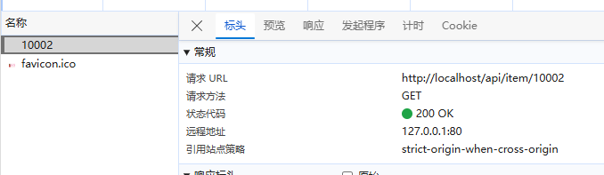

#### Nginx本地缓存

OpenResty为NGINX提供了shared dict的功能，可以在多个nginx的worker之间共享数据，worker类似于线程，负责接收用户请求并进行代理转发，而shared dict则可以实现缓存功能

如果需要开启shared dict，则需要在nginx.conf的http栏中添加一条

```conf
# 开启缓存功能，缓存对象命令为item_cache，缓存大小为150Mib
lua_shared_dict item_cache 150m;
```

然后通过专属的api来操作缓存

```lua
-- 获取缓存对象
local item_cache = ngx.shared.item_cache
-- 向缓存中存储数据，可以设置TTL，单位为秒，0表示永不过期
item_cache:set("key", "value", TTL)
-- 读取缓存中的数据
local val = item_cache:get("key")
```

据此，我们继续来改造原始lua脚本，为其添加NGINX本地缓存。这里我们先将查询逻辑封装为一个函数，在函数中统一先查询本地，再查询Redis，最后调用Tomcat

```lua
-- 导入common.lua
local common = require("common")
-- 导入cjson
local cjson = require("cjson")

local REDIS_ITEM_INFO_KEY_PREFIX = "cache:item:info:"
local REDIS_ITEM_STOCK_KEY_PREFIX = "cache:item:stock:"
local REDIS_HOST = "127.0.0.1"
local REDIS_PORT = 6379

local LOCAL_ITEM_INFO_KEY_PREFIX = "cache:item:info:"
local LOCAL_ITEM_STOCK_KEY_PREFIX = "cache:item:stock:"
local LOCAL_ITEM_INFO_KEY_TTL = 30 * 60
local LOCAL_TIEM_STOCK_KEY_TTL = 60

-- 封装查询函数
local function query(local_cache, 
    local_cache_key, 
    redis_key, 
    http_path, 
    http_param,
    local_cache_ttl
)
    -- 查询本地缓存
    ngx.log(ngx.ERR, "开始执行查询，尝试本地缓存")
    local res = local_cache:get(local_cache_key)
    if not res then
        -- 查询Redis
        ngx.log(ngx.ERR, "本地缓存查询失败，尝试Redis")
        res = common.redis_get(REDIS_HOST, REDIS_PORT, redis_key)
        if not res then
            -- 查询Tomcat
            ngx.log(ngx.ERR, "Redis查询失败，尝试Tomcat")
            res = common.http_get(http_path, http_param)
        end

        -- 构建本地缓存
        ngx.log(ngx.ERR, "构建本地缓存", res)
        local_cache:set(local_cache_key, res, local_cache_ttl)
    end

    return res
end

-- 获取路径参数
local id = ngx.var[1]

if not id then
    ngx.say()
end

-- 导入本地缓存
local item_cache = ngx.shared.item_cache

-- 查询商品信息
local itemJSON = query(item_cache, 
    LOCAL_ITEM_INFO_KEY_PREFIX .. id, 
    REDIS_ITEM_INFO_KEY_PREFIX .. id, 
    "/item/" .. id, 
    nil,
    LOCAL_ITEM_INFO_KEY_TTL
)
local stockJSON = query(item_cache, 
    LOCAL_ITEM_STOCK_KEY_PREFIX .. id, 
    REDIS_ITEM_STOCK_KEY_PREFIX .. id, 
    "/item/stock/" .. id, 
    nil,
    LOCAL_TIEM_STOCK_KEY_TTL
)

-- 转换为table
local item = cjson.decode(itemJSON)
local stock = cjson.decode(stockJSON)

-- 组装数据
item.stock = stock.stock
item.sold = stock.sold

-- 返回结果
ngx.say(cjson.encode(item))
```

访问前端，查询错误日志，我们就可以看到缓存是否构建成功

> 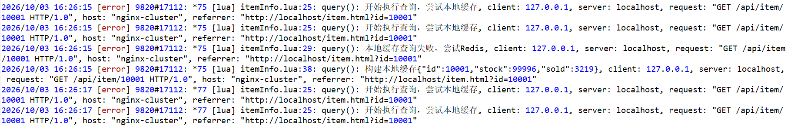

可以看到，在构建本地缓存后，第二次查询就不再通过Redis，而是直接通过本地缓存返回数据

### 缓存同步

缓存同步的常见方式有如下三种

- 设置有效期：给缓存设置有效期或者TTL，到期后自动删除，再次查询时更新，优点是简单方便，缺点是时效性差，缓存过期之前可能数据不一致

- 同步双写：在修改数据库的同时直接修改缓存，优点是时效性强，缓存与数据库强一致性，缺点是有代码侵入，而且代码耦合度高，不利于维护
- 异步通知：修改数据库时发送事件通知，相关服务监听到通知后修改缓存数据，优点是低耦合，可以同时通知多个缓存服务，缺点是时效性一般，可能存在中间不一致状态，而且可靠性性完全依赖消息中间件

#### 基于Canal的异步通知

canal是阿里巴巴旗下一款开源项目，基于Java开发，可以实现基于数据库增量日志解析，提供增量数据订阅与消费。简单来说，canal可以监听Mysql的数据变化，然后发布通知。相比Service在更新数据库时发送消息，可以省去手动发布消息的步骤，进一步提升时效性。canal的监听是基于Mysql主从同步来实现的

Mysql的主从同步类似Redis的增量同步，主节点将数据变更写入而今日文件Binary Log，其中记录的数据叫做Binary Log Events。从节点将主节点的Binary Log Events复制到自己的Relay Log中，然后从节点再通过单独的执行线程读取并重放Relay Log中的事件，达到主从一致

canal的原理就是将自己伪装成Mysql的从节点，监听主节点的binary log变化，再把变化的信息发送到canal客户端，进而完成对其他数据库的通知

#### 基于Canal实现缓存同步

在配置完成canal服务端后，由于官方的Java API比较复杂，我们使用第三方的API来在SpringBoot项目中构建一个监听器，并完成Redis的缓存更新

首先引入依赖，并填写canal相关配置

```xml
<!-- canal -->
<dependency>
    <groupId>top.javatool</groupId>
    <artifactId>canal-spring-boot-starter</artifactId>
    <version>1.2.1-RELEASE</version>
</dependency>
```

```yml
canal:
  destination: test
  server: localhost:11111
```

然后就可以开始编写监听器，需要实现EntryHandler接口

```java
package com.heima.item.canal;

import com.heima.item.pojo.Item;
import org.springframework.stereotype.Component;
import top.javatool.canal.client.annotation.CanalTable;
import top.javatool.canal.client.handler.EntryHandler;

@CanalTable("tb_item")
@Component
public class ItemHandler implements EntryHandler<Item> {

    @Override
    public void insert(Item item) {
        
    }

    @Override
    public void update(Item before, Item after) {

    }

    @Override
    public void delete(Item item) {

    }
}
```

在ItemHandler中，使用注解@CanalTable标注监听的表名称，在canal监听到数据表变化后，自动封装为Item实体类传递到ItemHandler中，我们实现的三个方法，分别表示数据表发生对应操作时调用的回调方法，我们可以在更新方法中添加一条日志来测试一下

```java
@Override
public void update(Item before, Item after) {
    log.debug("商品数据发生变化，before: {}, after: {}", before, after);
}
```

> 

这里可以发现，虽然canal监听到了数据变化，但是id、name、title等字段值均为null，这是因为canal并不知道数据库字段与实体类属性的映射关系，所以我们需要在实体类中添加对应注解，标记数据库字段

```java
package com.heima.item.pojo;

import com.baomidou.mybatisplus.annotation.IdType;
import com.baomidou.mybatisplus.annotation.TableField;
import com.baomidou.mybatisplus.annotation.TableId;
import com.baomidou.mybatisplus.annotation.TableName;
import lombok.Data;

import javax.persistence.Column;
import javax.persistence.Id;
import javax.persistence.Transient;
import java.util.Date;

@Data
@TableName("tb_item")
public class Item {
    @TableId(type = IdType.AUTO)
    @Id
    private Long id;//商品id
    @Column(name = "name")
    private String name;//商品名称
    private String title;//商品标题
    private Long price;//价格（分）
    private String image;//商品图片
    private String category;//分类名称
    private String brand;//品牌名称
    private String spec;//规格
    private Integer status;//商品状态 1-正常，2-下架
    private Date createTime;//创建时间
    private Date updateTime;//更新时间
    @TableField(exist = false)
    @Transient
    private Integer stock;
    @TableField(exist = false)
    @Transient
    private Integer sold;
}
```

对于主键字段，使用@Id注解，注意包名为javax.persistence.Id。属性名如果与数据库字段一直，canal能够自动解析，如果不一致则需要@Column字段，设置name=数据库字段。如果是表中不存在的字段，则需要添加@Transient注解，在Java序列化中，添加@Transient注解的属性不会被序列化，属性值为null，也就相当于忽略该属性

```java
package com.heima.item.canal;

import com.fasterxml.jackson.core.JsonProcessingException;
import com.github.benmanes.caffeine.cache.Cache;
import com.heima.item.config.RedisHandler;
import com.heima.item.pojo.Item;
import com.heima.item.pojo.ItemStock;
import lombok.RequiredArgsConstructor;
import lombok.extern.slf4j.Slf4j;
import org.springframework.data.redis.core.StringRedisTemplate;
import org.springframework.stereotype.Component;
import top.javatool.canal.client.annotation.CanalTable;
import top.javatool.canal.client.handler.EntryHandler;

@CanalTable("tb_item")
@Component
@Slf4j
@RequiredArgsConstructor
public class ItemHandler implements EntryHandler<Item> {

    private final RedisHandler redisHandler;
    private final Cache<Long, Item> itemCache;

    @Override
    public void insert(Item item) {
        try {
            // 缓存到Redis
            redisHandler.saveItem(item);
            // 缓存到Caffeine
            itemCache.put(item.getId(), item);
        } catch (JsonProcessingException e) {
            throw new RuntimeException(e);
        }
    }

    @Override
    public void update(Item before, Item after) {
        try {
            redisHandler.saveItem(after);
            itemCache.put(after.getId(), after);
        } catch (JsonProcessingException e) {
            throw new RuntimeException(e);
        }
    }

    @Override
    public void delete(Item item) {
        redisHandler.deleteItem(item.getId());
        itemCache.invalidate(item.getId());
    }
}
```

编写完整的缓存更新策略，在数据库发生变更后，同时修改Redis和JVM本地缓存。然后我们启动项目进行测试

> 

> 

*注：这里其实还存在一个问题，如何更新NGINX的本地缓存呢？*

## Redis最佳实践

### 键值设计

#### Key规范

Redis的Key虽然可以自定义，但是一般需要遵循以下几个最佳实践约定

- 遵循基本格式：`业务名称:数据名称:数据id`
- 长度不超过44字节，约等于44字符的英文
- 不包含特殊字符

例如登录业务需要保存用户信息，则Key可以设计为 `login:user:10`

对于这样的Key设计，其优点有以下四种

1. 可读性强，使用冒号作为分隔符将Key分割为三个区域，第一区域展示业务名称或者服务名称，login表示登录业务；第二区域展示数据意义，user表示用户数据；第三区域展示数据id，10表示为用户id为10
2. 避免Key冲突，实际开发中，对于相同数据id，可能多个业务都需要使用，如果仅使用数据id作为Key，极大可能造成Key重复，进而导致数据被覆盖
3. 方便管理，在某些Redis客户端中，Key中的冒号会被识别为层级分隔符，客户端会自动为相同层级的Key创建独立的空间，方便开发人员进行管理
4. 节省内存，Key是string类型，在Redis底层针对string有int、embstr和raw三种编码，而embstr在小于44字节时使用，采用连续内存空间，内存占用更小

#### BigKey

BigKey不是指Key本身很长，而是Key中的数据量非常庞大，例如String类型的Key，存储的文本数据超过5MiB，ZSET类型的Key，存储的元素数量超过10000个，Hash类型的Key，存储的元素数量只有100个，但是每个元素占用1MiB，合计超过100MiB

在Redis中，可以使用MEMORY USAGE命令来查看某个Key占用的内存字节数量

> 

不过MEMORY USAGE对CPU占用较高，所以一般直接查看value长度或者元素数量来粗略评估Key占用

> 

对于string类型的Key，一般值大小不超过10KiB；对于集合或者列表类型的Key，元素数量不超过1000

BigKey容易造成以下危害

- 网络阻塞：对BigKey执行读请求时，少量的QPS就可能导致服务器带宽被占满，例如某个Key占用5MiB，服务器带宽100MiB，仅需20个请求就可以占满所有带宽，导致服务不可用
- 数据倾斜：BigKey所在的实例内存占用远超其他实例，无法使数据分片的内存资源达到平衡
- Redis阻塞：对元素较多的Hash、List、ZSET等进行运算会耗时较长，使主线程被阻塞
- CPU压力：对BigKey的数据序列化和反序列化会导致CPU使用率飙升，影响Redis实例和本机中其他运行的程序

redis-cli其实自带有关bigkey的扫描功能，使用--bigkeys参数

> 

#### 合适的数据类型

为value选择合适的数据类型至关重要，选择合适的数据类型也可以进一步降低BigKey出现的概率。例如需要保存一个Java实体类，就可以有三种存储方式

- JSON字符串：将实体类转换为JSON字符串，使用Redis的string类型存储。优点是实现简单，缺点是需要手动把实体类与JSON字符串进行转换，而且数据过耦合，无法直接修改特定字段
- 字段打散：使用多个string类型的Key，分别存储实体类中的不同属性值。优点是操作灵活，可以存储任意实体属性，也可以任意修改，缺点是数据过于解耦，占用空间大，无法统一控制
- Hash：将一个实体作为一个Hash Key，属性作为Hash field。优点是占用空间小，操作灵活，可以修改任意实体属性，缺点是实现相对复杂，在Java中需要将实体类转换为Map

**Hash优化**

现在假设有一个Hash类型的Key，其中有100万条entry，field为自增类型，该如何对这个Key进行优化？

我们首先需要知道，Redis对Hash类型有两种编码形式，默认在entry小于500时，Hash会使用ziplist存储，相比哈希表，ziplist的内存占用会少很多。所以，针对Hash类型的优化，可以将其拆分为多个哈希Key，每个哈希存储最多500个entry

我们来建立一个规模小一些的示例，使用一个hash存储100000个entry对比使用1000和哈希存储100个entry

> 

> 

可以看到，使用ziplist的Hash结构相比哈希表，内存占用仅为不到28%

> 

### 批处理优化

在Redis中，可能会遇到需要同时执行大量命令的情况，如果将这些命令全部一条一条地执行，效率其实非常低。从整体来看，Redis的执行速度非常快，但是造成最终执行效率低下的重要因素，却是网络传输。如果客户端想服务器单独发送多条命令，每条都命令都需要计算网络传输中的开销，虽然宏观上来看，几毫秒的延迟并没有什么影响，但在大数据量的情况下，假设需要发送1000条命令，每条命令网络传输耗时10ms，10ms的1000倍就是10秒，已经能够明显感觉到业务阻塞，所以需要进行批处理优化

Redis本身提供了String、Hash类型的批处理命令，如MSET，HMSET。但并没有提供List、Set、ZSet等类型的批处理命令，这里就需要使用pipeline

Pipeline是Redis提供的统一批处理方案，可以执行任意类型Key，任意数量的批处理。不过pipeline总体仍比M命令更慢，因为pipeline在底层上只是将所有命令一同发往Redis，而Redis执行命令时可能有其他命令插队。而M命令是Redis内置命令，优先级最高，Redis会将M命令原子性执行，不允许其他命令插队

Pipeline在Spring Data Redis中通过redisTemplate.executePipelined()访问，executePipelined接收一个RedisCallback，通过RedisConnection直接执行命令，注意回调方法必须返回null

```java
stringRedisTemplate.executePipelined((RedisCallback<?>) (connection) -> {
    connection.set("test".getBytes(), "test".getBytes());
    connection.get("test".getBytes());
    return null;
});
```

如果不想手动转换为Bytes，在使用StringRedisTemplate时可以将RedisConnection强转为StringRedisConnection

```java
stringRedisTemplate.executePipelined((RedisCallback<?>) (connection) -> {
    StringRedisConnection conn = (StringRedisConnection) connection;
    conn.set("test", "test");
    conn.get("test");
    return null;
});
```

#### 集群下的批处理

在分片集群下，Redis会将插槽平均分配到不同的实例中，如果M命令或者Pipeline在执行批处理时，发现Key的插槽不一致，则会拒绝执行。为了解决集群下的批处理，一般有四种方案

| 方案     | 实现思路                                                     | 耗时                                           | 优点             | 缺点             |
| -------- | ------------------------------------------------------------ | ---------------------------------------------- | ---------------- | ---------------- |
| 串行命令 | for循环便利Key，依次执行每个命令                             | N次网络传输 + N次命令耗时                      | 实现简单         | 等于没有批处理   |
| 串行slot | 在客户端为每一个Key计算slot，对于相同slot的Key分为一组，每组利用Pipeline串行执行 | 假设存在M组，则M次网络传输 + N次命令消耗       | 耗时较短         | 实现较复杂       |
| 并行slot | 在串行slot的基础上引入线程池，为每组分配单独的执行线程并行执行 | 假设存在M组，则不超过M次网络传输 + N次命令消耗 | 耗时短           | 实现复杂         |
| hash_tag | 利用散列插槽的有效Key设定，为所有Key设置相同的hash_tag，强行让所有Key的插槽相同 | 1次网络传输 + N次命令消耗                      | 耗时短，实现简单 | 容易出现数据倾斜 |

在Spring Data Redis中，默认的Luttuce就使用了并行slot的方案

```java
@Override
public RedisFuture<String> mset(Map<K, V> map) {

    Map<Integer, List<K>> partitioned = SlotHash.partition(codec, map.keySet());

    if (partitioned.size() < 2) {
        return super.mset(map);
    }

    Map<Integer, RedisFuture<String>> executions = new HashMap<>();

    for (Map.Entry<Integer, List<K>> entry : partitioned.entrySet()) {

        Map<K, V> op = new HashMap<>();
        entry.getValue().forEach(k -> op.put(k, map.get(k)));

        RedisFuture<String> mset = super.mset(op);
        executions.put(entry.getKey(), mset);
    }

    return MultiNodeExecution.firstOfAsync(executions);
}
```

在io.lettuce.core.cluster.RedisAdvancedClusterAsyncCommandsImpl#mset中，第一行就通过SlotHash.partition计算每个Key的插槽，然后封装到一个Map元素中，后续再便利Map元素，通过RedisFuture\<String> mset = super.mset(op)异步执行

### 服务端优化

#### 慢查询

慢查询是指执行时间较长的命令，不仅限于查询，任何写入、查询超过，只要超过指定阈值，都会被认为是慢查询。在Redis中，可以通过设置slowlog-log-slower-than配置项来设置慢查询阈值，默认为10000，单位是微秒。一般可以将其设置为更小数值，因为Redis常规查询通常在百微秒以内，如果追求极致性能，可以设置为100us

如果出现慢查询，Redis会将其记录在slowlog中，slowlog的长度也可以通过slowlog-max-len来修改，默认长度128，仅记录128条慢查询命令，一般可以设置更大容量

在Redis中，可以通过SLOWLOG GET来查询慢查询日志

> 

第一行为日志编号，从0开始；第二行为日志记录时间戳，可以得知慢查询何时发生；第三行为慢查询耗时，单位微秒，这里仅记录实际命令耗时，不记录网络传输耗时；第四行为执行的命令，这里执行了`COMMAND DOCS`命令，就可以得知慢查询是由命令导致，而非业务问题；第五行为客户端地址，可以知道慢查询由谁触发；第六行为客户端名称，默认为空

通过查阅慢查询日志，可以分析慢查询产生原因，针对性地进行改进，提升业务总体性能。所以慢查询日志对于运维人员来说是一份相当重要的日志

## Redis原理

### Redis数据结构

#### 动态字符串SDS

Redis中保存的Key是字符串，value往往也是字符串或者字符串的集合，如SET、HASH、LIST等，可见字符串是Redis中最常用，最重要的一种数据结构，没有字符串就没有Redis。Redis是C语言编写的，但是Redis并没有直接使用C语言中的字符串，因为C语言字符串存在一些问题

```c
// C语言字符串
char* str = "hello";
```

C语言不支持字符串，所以字符串的本质是字符数组，类似于`{'h', 'e', 'l', 'l', 'o', '\0'}`，C语言字符串最显著的特征就是存在一个结束符`\0`。对于C语言字符串，如果需要统计字符串长度，就必须计算该字符数组的长度，从0开始遍历计数，性能并不好。而且C语言字符串中不允许出现特殊字符`\0`，否则会被认为是字符串结束符，例如早期PHP中出现的某些`\0`截断漏洞，其实就源于底层C语言字符串中将`\0`作为结束符。同时，C语言字符串不允许修改，如果需要修改，必须申请新的内存空间，将数组指着指向新的内存地址

因此，Redis自己定义了一种新的数据结构，叫做简单动态字符串Simple Dynamic String，简称SDS

```c
struct __attrubute__ ((__packed__)) sdshdr8 {
    uint8_t len;
    uint8_t alloc;
    unsigned char flags;
    char buf[];
}
```

在C语言中，Redis为SDS设计了一个结构体，包含四个变量

- `uint8_t len`：无符号八位整型，最大值$2^8 - 1 = 255$，用于表示SDS当前已经使用的字节数
- `uint8_t alloc`：同样是无符号八位整型，用于表示申请的可使用最大字节数
- `unsigned char flags`：无符号char类型，占用一个字节，最大值255，表示不同的SDS头类型
- `char buf[]`：char类型，保存实际的字符串

SDS的结构体不止sdshdr8一种，根据允许的最大长度划分，还有sdshdr5、sdshdr16、sdshdr32、sdshdr64，flags的作用就是标识这几种不同的SDS结构体

```c
#define SDS_TYPE_5  0
#define SDS_TYPE_8  1
#define SDS_TYPE_16 2
#define SDS_TYPE_32 3
#define SDS_TYPE_64 4
```

在实际的内存空间中，一个包含字符串name的SDS如下所示，为了兼容C语言，也使用了结束符`\0`

> 

##### 动态扩容

SDS之所以叫动态字符串，是因为他具备动态扩容能力，例如存在一个内存为hi的SDS字符串

> 

现在我们需要为其追加一段新的字符串`, Amy`，首先需要申请新的内存空间。SDS有两种申请模式，如果新字符串小于1MiB，则新的空间为扩展后字符串长度的两倍+1；如果新的字符串大于1MiB，则新空间为扩展后字符串长度+1MiB+1，这被称为内存预分配。在操作系统中，系统调用命令，特别是内存申请的命令非常占用系统资源，所以为了尽可能少地发起申请内存的请求，Redis为其设计了这样的申请模式

#### IntSet

IntSet是Redis中Set集合的一种实现方式，基于C语言的整数数组来实现，具备长度可变，有序等特征

```c
typedef struct intset {
    uint32_t encoding;
    uint32_t length;
    int8_t contents[];
} intset;
```

- `uint32_t encoding`：IntSet编码方式，支持存放16位、32位、64位整数
- `uint32_t length`：元素个数
- `int8_t contents`：整数数组，用于保存集合内容

encoding支持三种编码方式

```c
#define INTSET_ENC_INT16 (sizeof(int16_t))
#define INTSET_ENC_INT32 (sizeof(int32_t))
#define INTSET_ENC_INT64 (sizeof(int64_t))
```

为了方便查找，Redis将IntSet中的所有整数按照升序依次保存在contents数组中，如下

> 

IntSet中的元素无论本身的实际大小，一定会占用指定编码的内存空间，这是为了指针能够根据下标快速计算出元素内存地址。举个例子，在不指定编码的情况下，内存中元素占用的空间为实际元素大小

> 

假设数组中存储了5、50、500、510四个元素，5和50占用一个字节，500和510占用两个字节，那么在寻找元素500的时候，就需要先计算5和50的元素大小，然后才能计算出500所在的内存地址。而如果强制编码长度，则只需要得到元素的下标，用下标乘以编码长度，就可以快捷计算出元素所在内存地址

##### IntSet升级

假设存在一个IntSet，编码方式为INTSET_ENC_INT16，其中存储了元素5、10、20。但是现在需要向其中插入一个数字50000，很显然50000超过了INT16的最大值，因此IntSet需要进行升级。IntSet的升级步骤如下

- 升级编码为INTSET_ENC_INT32，每个整数占4字节，按照新的编码方式申请内存空间
- 申请内存空间后，倒序将数组中的元素复制到扩容后的正确位置。这里不使用正序是避免数据被覆盖，如果按照正序复制，元素5扩容后占4字节，也就是原来的元素5个和元素10共同的内存空间，如果直接进行覆盖，元素10就丢失了，因此只能进行倒序复制
- 旧元素移动完成后，将需要加入的元素放在数组末尾
- 最后将IntSet的encoding更新为INTSET_ENC_INT32，并将length修改为4

我们通过查阅C源码来进行分析，升级发生在元素插入阶段，所以我们定位到插入元素的函数

```c
/* Insert an integer in the intset */
intset *intsetAdd(intset *is, int64_t value, uint8_t *success) {
    uint8_t valenc = _intsetValueEncoding(value);
    uint32_t pos;
    if (success) *success = 1;

    /* Upgrade encoding if necessary. If we need to upgrade, we know that
     * this value should be either appended (if > 0) or prepended (if < 0),
     * because it lies outside the range of existing values. */
    if (valenc > intrev32ifbe(is->encoding)) {
        /* This always succeeds, so we don't need to curry *success. */
        return intsetUpgradeAndAdd(is,value);
    } else {
        /* Abort if the value is already present in the set.
         * This call will populate "pos" with the right position to insert
         * the value when it cannot be found. */
        if (intsetSearch(is,value,&pos)) {
            if (success) *success = 0;
            return is;
        }

        is = intsetResize(is,intrev32ifbe(is->length)+1);
        if (pos < intrev32ifbe(is->length)) intsetMoveTail(is,pos,pos+1);
    }

    _intsetSet(is,pos,value);
    is->length = intrev32ifbe(intrev32ifbe(is->length)+1);
    return is;
}
```

首先通过uint8_t valenc = _intsetValueEncoding(value);获取需要插入的元素的编码，也就是判断元素的大小，如果元素大小大于intset的编码，则需要进行扩容。然后声明了uint32_t pos，需要插入的位置，这里暂时为null，需要后续计算得出。接着if (valenc > intrev32ifbe(is->encoding))判断元素编码是否大于当前intset编码，如果大于，则执行intsetUpgradeAndAdd(is,value)升级，否则调用if (intsetSearch(is,value,&pos))判断元素是否已经存在，因为是Set类型，对于已经存在的值就不允许插入，所以*success = 0，返回原intset。如果不存在，则为pos赋值，执行插入逻辑，intsetResize(is,intrev32ifbe(is->length)+1)将原来的intset的length加一，然后进行扩容，扩容后intset的地址可能发生变更。然后判断插入的元素位置是否在末尾，如果不是末尾，则需要将pos位置之后的元素向后移动一位，为新元素腾出空间，即if (pos < intrev32ifbe(is->length)) intsetMoveTail(is,pos,pos+1)。一切准备完成后，执行\_intsetSet(is,pos,value)插入新元素，is->length = intrev32ifbe(intrev32ifbe(is->length)+1)更新intset长度，最后返回新的intset

当然，我们关注的是intset升级逻辑

```c
/* Upgrades the intset to a larger encoding and inserts the given integer. */
static intset *intsetUpgradeAndAdd(intset *is, int64_t value) {
    uint8_t curenc = intrev32ifbe(is->encoding);
    uint8_t newenc = _intsetValueEncoding(value);
    int length = intrev32ifbe(is->length);
    int prepend = value < 0 ? 1 : 0;

    /* First set new encoding and resize */
    is->encoding = intrev32ifbe(newenc);
    is = intsetResize(is,intrev32ifbe(is->length)+1);

    /* Upgrade back-to-front so we don't overwrite values.
     * Note that the "prepend" variable is used to make sure we have an empty
     * space at either the beginning or the end of the intset. */
    while(length--)
        _intsetSet(is,length+prepend,_intsetGetEncoded(is,length,curenc));

    /* Set the value at the beginning or the end. */
    if (prepend)
        _intsetSet(is,0,value);
    else
        _intsetSet(is,intrev32ifbe(is->length),value);
    is->length = intrev32ifbe(intrev32ifbe(is->length)+1);
    return is;
}
```

首先通过uint8_t curenc = intrev32ifbe(is->encoding)获取当前的编码方式，然后调用_intsetValueEncoding()函数，传入value获取需要插入的元素需要的编码方式，也就是目标编码方式，接着又获取了原intset的长度以及一个prepend。prepend表示需要插入队首还是队尾，对于需要升级的元素，其值一定大于当前intset所有元素，或者小于intset允许的最小值，因此可能的插入位置只有队首和队尾两个，如果是插入队首，则后续升级移动旧元素时，就需要在队首额外预留一个新元素的位置，所以这里就使用了prepend作为标识

然后通过is->encoding = intrev32ifbe(newenc)设置新的编码方式，is = intsetResize(is,intrev32ifbe(is->length)+1)设置新的intset长度。设置完成后，进入while循环，移动旧元素。while的条件是length\-\-，也就是倒序开始，指针依次向前移动，这里执行的函数是\_intsetSet(is,length+prepend,_intsetGetEncoded(is,length,curenc))，其实也就是intset设置元素位置的函数，第一个参数是intset本身，第二参数是元素位置，第三个参数是需要设置位置的数据。正因为使用了prepend作为队首标记，一旦prepend为1，在重新设置旧元素位置时，新的位置为length + prepend，也就是旧位置向后移一个位置，这样就可以为新元素腾出队首的空间。\_intsetGetEncoded()函数的作用是获取某个位置的元素，所以第三参数直接调用了\_intsetGetEncoded(is,length,curenc)，获取intset中位置为length，编码方式为curenc的元素，即需要移动位置的元素

全部元素位置移动完成后，插入新的元素，如果prepend为1，表示为队首元素，则执行\_intsetSet(is,0,value)插入队首，否则执行\_intsetSet(is,intrev32ifbe(is->length),value)插入队尾，最后设置新的intset长度，并返回升级后的intset

对于查找元素是否存在的intsetSearch(is,value,&pos)函数，底层原理是二分查找，这里就不再概述

```c
/* Search for the position of "value". Return 1 when the value was found and
 * sets "pos" to the position of the value within the intset. Return 0 when
 * the value is not present in the intset and sets "pos" to the position
 * where "value" can be inserted. */
static uint8_t intsetSearch(intset *is, int64_t value, uint32_t *pos) {
    int min = 0, max = intrev32ifbe(is->length)-1, mid = -1;
    int64_t cur = -1;

    /* The value can never be found when the set is empty */
    if (intrev32ifbe(is->length) == 0) {
        if (pos) *pos = 0;
        return 0;
    } else {
        /* Check for the case where we know we cannot find the value,
         * but do know the insert position. */
        if (value > _intsetGet(is,max)) {
            if (pos) *pos = intrev32ifbe(is->length);
            return 0;
        } else if (value < _intsetGet(is,0)) {
            if (pos) *pos = 0;
            return 0;
        }
    }

    while(max >= min) {
        mid = ((unsigned int)min + (unsigned int)max) >> 1;
        cur = _intsetGet(is,mid);
        if (value > cur) {
            min = mid+1;
        } else if (value < cur) {
            max = mid-1;
        } else {
            break;
        }
    }

    if (value == cur) {
        if (pos) *pos = mid;
        return 1;
    } else {
        if (pos) *pos = min;
        return 0;
    }
}
```

#### Dict

Redis是典型的键值对型数据库，我们可以根据键实现快速的增删改查，而键与值的映射关系正是通过Dict来实现的。在Java中也有一种键值对数据结构HashMap，其原理是一个哈希数组，数组元素为一个个Entry，Entry中存放键值对结构，而HashMap的Entry存放的位置是通过计算Key的哈希来得到的，因此HashMap的性能非常优秀。而Redis的dict也是类似的数据结构，dict由三部分构成，分别是哈希表DictHashTable、哈希节点DictEntry和字典Dict

```c
typedef struct dictht {
    dictEntry **table;
    unsigned long size;
    unsigned long sizemask;
    unsigned long used;
} dictht;
typedef struct dictEntry {
    void *key;
    union {
        void *val;
        uint64_t u64;
        int64_t s64;
        double d;
    } v;
    struct dictEntry *next;
} dictEntry;
```

先来看dictht

- `dictEntry **table`：指向Entry指针数组的指针，Entry指针数据中保存的是所有指向Entry的指针，这样就可以让Dict能访问所有Entry
- `unsigned long size`：哈希表的大小，只能为2的n次幂
- `unsigned long sizemask`：哈希表大小的掩码，总是为size - 1
- `unsigned long used`：Dict中Entry的个数

然后是dictEntry

- `void *key`：指向键的指针，上文提到，Redis的键为String结构，所以实际的数据结构为SDS，这里便使用了一个指针来表示
- `union {...}`：union是C语言的一个特殊结构，该变量类型只能为union中的一种，其中`void *val`表示键值对的值可以为任意数据类型，如SDS等
- `struct dictEntry *next`：指向下一个Entry的指针

当需要向Dict添加键值对时，Redis首先根据Key计算出hash值，然后计算 hash(key) & sizemask 来得到元素应该存储到数组中的哪个索引位置。一般来说，对于长度有限的数组，应当使用mod运算，这里进行与运算正是利用了sizemask的特性

上文我们提到，sizemask只能为size - 1，而size只能为2的n次幂，我们假设存在一个dict，长度规定为8，那么二进制表示为
$$
size = 1000_{(2)}
$$
而sizemask表示为
$$
sizemask = size - 1 = 0111_{(2)}
$$
任意数与0111进行与运算，一定会小于等于0111，因此，与运算与模运算的结果是一致的。而计算机进行与运算的性能高于模运算，Redis在底层也对运算方式性能进行了优化

如果存在两个哈希值相同的元素，发生哈希碰撞，dict就会为其构建一个链表

> 

Redis会将dictEntry数组的指针指向新Entry，新Entry的指针指向旧Entry，一旦再有新的Entry加入，重复这一过程，就可以快捷插入数据

上文我们提到，dict由dictht、dictEntry和dict组成，那么dict的作用是什么呢？

```c
typedef struct dict {
    dictType *type;
    void *privdata;
    dictht ht[2];
    long rehashidx; /* rehashing not in progress if rehashidx == -1 */
    int16_t pauserehash; /* If >0 rehashing is paused (<0 indicates coding error) */
} dict;
```

- `dictType *type`：标识不同的dict类型，因为Redis中多种数据类型都需要使用dict，使用的哈希函数也不同，所以使用type字段来标注特定的dict类型
- `void *privdata`：私有数据，用于在特殊哈希函数中进行运算
- `dictht ht[2]`：哈希表，一般情况只使用其中一个哈希表，另一个为空，当需要rehash时，才会使用第二个哈希表
- `long rehashidx`：rehash的进度，-1表示未进行
- `int16_t pauserehash`：rehash是否暂停，1表示暂停，0表示进行中

##### Dict扩容

Dict的HashTable就是数组结合单向链表的实现，当集合中元素较多时，必定会导致哈希冲突增多，链表过长，此时查询性能就会大大降低。所以dict在每次新增键值对时都会检查负载因子，负载因子公式为 LoadFactor = used / size，满足以下两种情况时会触发哈希表扩容

- 哈希表负载因子大于等于1，并且服务器没有执行BGSAVE或者BGWRITEAOF等后台进程
- 哈希表负载因子大于5

```c
/* Add an element to the target hash table */
int dictAdd(dict *d, void *key, void *val)
{
    dictEntry *entry = dictAddRaw(d,key,NULL);

    if (!entry) return DICT_ERR;
    dictSetVal(d, entry, val);
    return DICT_OK;
}
```

分析dictAdd()函数，首先调用dictAddRaw(d,key,NULL)想Entry中添加一个空值，这其实是先占位，确保dict能提供插入空间，否则返回DICT_ERR。如果NULL插入成功，则执行dictSetVal(d, entry, val)将真正的值填入，并返回DICT_OK

```c
dictEntry *dictAddRaw(dict *d, void *key, dictEntry **existing)
{
    long index;
    dictEntry *entry;
    dictht *ht;

    if (dictIsRehashing(d)) _dictRehashStep(d);

    /* Get the index of the new element, or -1 if
     * the element already exists. */
    if ((index = _dictKeyIndex(d, key, dictHashKey(d,key), existing)) == -1)
        return NULL;

    /* Allocate the memory and store the new entry.
     * Insert the element in top, with the assumption that in a database
     * system it is more likely that recently added entries are accessed
     * more frequently. */
    ht = dictIsRehashing(d) ? &d->ht[1] : &d->ht[0];
    entry = zmalloc(sizeof(*entry));
    entry->next = ht->table[index];
    ht->table[index] = entry;
    ht->used++;

    /* Set the hash entry fields. */
    dictSetKey(d, entry, key);
    return entry;
}
```

在dictAddRaw函数中，声明了三个变量，long index插入索引，dictEntry *entry需要插入的Entry，dictht *ht插入的Entry所在的哈希表。if (dictIsRehashing(d))先判断了dict是否处于rehash状态，如果没有rehash，则执行index = _dictKeyIndex(d, key, dictHashKey(d,key), existing)计算插入索引，如果索引为-1，表示无法插入，返回NULL

然后再根据rehash状态选择dict中的哈希表，如果在rehash状态，则选择第二张表。然后利用entry = zmalloc(sizeof(*entry))为新Entry申请内存空间，空间大小为Entry指定的大小，接着entry->next = ht->table[index]让新Entry的next指向当前哈希表中对应位置的Entry，再ht->table[index] = entry将哈希表中对应位置的Entry更改为新插入的Entry，完成插入，并ht->used++更新容量，最后执行dictSetKey(d, entry, key)插入Key，并返回Entry

```c
/* Returns the index of a free slot that can be populated with
 * a hash entry for the given 'key'.
 * If the key already exists, -1 is returned
 * and the optional output parameter may be filled.
 *
 * Note that if we are in the process of rehashing the hash table, the
 * index is always returned in the context of the second (new) hash table. */
static long _dictKeyIndex(dict *d, const void *key, uint64_t hash, dictEntry **existing)
{
    unsigned long idx, table;
    dictEntry *he;
    if (existing) *existing = NULL;

    /* Expand the hash table if needed */
    if (_dictExpandIfNeeded(d) == DICT_ERR)
        return -1;
    for (table = 0; table <= 1; table++) {
        idx = hash & d->ht[table].sizemask;
        /* Search if this slot does not already contain the given key */
        he = d->ht[table].table[idx];
        while(he) {
            if (key==he->key || dictCompareKeys(d, key, he->key)) {
                if (existing) *existing = he;
                return -1;
            }
            he = he->next;
        }
        if (!dictIsRehashing(d)) break;
    }
    return idx;
}
```

我们来看看索引是如何计算的。先判断是否需要扩容，如果返回DICT_ERR，则表示无法扩容，返回了-1。然后遍历了dict中两张哈希表，对于每一张哈希表，先计算idx = hash & d->ht[table].sizemask，得到Entry数组下标，然后he = d->ht[table].table[idx]获取对应下标的Entry，因为哈希表中每一个位置都是一个Entry链表，所以又进入了一层while循环

在while循环中，if (key==he->key || dictCompareKeys(d, key, he->key))判断Key是否存在，如果Key已经存在，则返回-1，然后将Entry的指针修改为链表中下一个Entry，直到链表结束。然后再判断了是否处于rehash中，如果没有rehash，则立即终止，并返回插入索引，也就是默认只使用第一张表

```c
/* Expand the hash table if needed */
static int _dictExpandIfNeeded(dict *d)
{
    /* Incremental rehashing already in progress. Return. */
    if (dictIsRehashing(d)) return DICT_OK;

    /* If the hash table is empty expand it to the initial size. */
    if (d->ht[0].size == 0) return dictExpand(d, DICT_HT_INITIAL_SIZE);

    /* If we reached the 1:1 ratio, and we are allowed to resize the hash
     * table (global setting) or we should avoid it but the ratio between
     * elements/buckets is over the "safe" threshold, we resize doubling
     * the number of buckets. */
    if (d->ht[0].used >= d->ht[0].size &&
        (dict_can_resize ||
         d->ht[0].used/d->ht[0].size > dict_force_resize_ratio) &&
        dictTypeExpandAllowed(d))
    {
        return dictExpand(d, d->ht[0].used + 1);
    }
    return DICT_OK;
}
```

先判断是否在rehash，如果正在rehash，直接返回DICT_OK，因为在rehash时使用的是第二张表，所以不考虑扩容。然后判断dict中第一张表的size是否为0，如果为0，则表示该dict是新增的dict，需要进行初始化，执行dictExpand(d, DICT_HT_INITIAL_SIZE)初始化扩容，DICT_HT_INITIAL_SIZE默认为4。接着是一个复杂的判断，需要同时满足d->ht[0].used >= d->ht[0].size和(dict_can_resize || d->ht[0].used/d->ht[0].size > dict_force_resize_ratio)以及dictTypeExpandAllowed(d)，我们拆开来看

d->ht[0].used >= d->ht[0].size表示已经使用的空间大于等于总空间，也就是负载因子大于等于1；dict_can_resize是一个标志位，当进行BGSAVE或者BGREWRITEAOF时，Redis会将其设置为0；d->ht[0].used/d->ht[0].size是负载因子，dict_force_resize_ratio是强制扩容率，默认为5；最后的dictTypeExpandAllowed(d)判断该dict是否允许被扩容，某些占用大量内存的dict具有expandAllowed()函数，这里会调用dict自己的expandAllowed函数来检查是否允许扩容

因此，这段判断逻辑总结起来就是上文提到的两句话：哈希表负载因子大于等于1，并且服务器没有执行BGSAVE或者BGWRITEAOF等后台进程。哈希表负载因子大于5。同理，dict在删除元素时也会进行收缩，当负载因子小于0.1时会触发收缩，这里就不再跟踪代码

##### rehash

无论是扩容还是收缩，dict一定会创建新的哈希表，从而导致哈希表的size和sizemask发生变化，而Key的查询与sizemask有关。因此必须对哈希表中的每一个Key重新计算索引，并插入新的哈希表，这个过程就被称为rehash。大致步骤如下

- 计算新hash表的size，值取决于当前需要扩容还是收缩，如果是扩容，则新size为不小于used + 1的第一个2的n次幂；如果是收缩，则新size为不小于used的第一个2的n次幂，最小不低于4
- 按照新的size申请内存空间，创建dictht，并赋值给dict的第二张表
- 设置dict的rehashidx = 0，表示开始进行rehash
- 将第一张表中的每一个Entry进行rehash移动到第二张表
- 将第二张表赋值给第一张表，然后重新初始化第二张表，释放原来第一张表的内存

不过rehash并不是一次性全部完成的，假设哈希表中存储了百万级别的Entry，如果一次性完成rehash，就会导致主线程阻塞，所以Redis为其设计了渐进式rehash，在每次数据变动时才进行一次rehash，dict的rehashidx其实就是当前rehash的哈希表的下标，0表示从哈希表第一个元素开始。对于新增操作，在dictAddRaw中可以注意到这条语句

```c
ht = dictIsRehashing(d) ? &d->ht[1] : &d->ht[0];
```

在进行rehash时直接选择第二张表，这正是因为rehash是将第一张表的数据移动到第二张表，此时还向第一张表插入数据完全没有必要。在每个rehashidx完成后，rehashidx自增，以完成整个哈希表的rehash

#### ZipList

从dict的数据结构可以看出，当dict进行rehash时，dict中就存在两个申请了实际空间的哈希表，所以dict的内存占用其实相当大。在Redis中，有一个专门为了节省内存设计的数据结构，即ZipList

ZipList是一种特殊的，类似于双向链表的结构，由一系列特殊编码的连续内存块组成，可以在任意一端进行压入弹出操作，并且该操作的时间复杂度为O(1)，性能非常高

Redis并没有在源码中设计ziplist结构体，所以这里通过表格来模拟

> 

| 类型     | 属性    | 长度  | 说明                                                         |
| -------- | ------- | ----- | ------------------------------------------------------------ |
| uint32_t | zlbytes | 4字节 | 记录ziplist占用的内存字节数                                  |
| uint32_t | zltail  | 4字节 | 记录ziplist尾节点头距离ziplist起始地址的内存偏移量，用于快速计算尾节点地址 |
| uint16_t | zllen   | 2字节 | 记录ziplist包含的节点数量，最大值为UINT16_MAX，即65534。超过这个值只会被记为65535，具体数量需要遍历计算 |
| entry    | entry   | N/A   | ziplist的各个Entry，Entry长度由保存的数据决定                |
| uint8_t  | zlend   | 1字节 | 末尾标记符，用于标记ziplist末尾，实际值为0xFF                |

##### ZipList Entry

ziplist的Entry并不像普通链表那样记录前后节点的指针，因为记录两个指针需要占用16字节，非常浪费内存空间。因此ziplist的Entry设计了如下结构

> 

- `previous_entry_length`：前一个Entry的长度，占1个或者5个字节，当前一Entry的长度小于254字节，则使用1字节；否则使用5字节，并且第一个字节恒定为0xfe，后四个字节才是真实长度
- `encoding`：数据编码，记录content保存的数据类型及长度，占用1，2或者5字节
- `content`：保存的真实数据，可以是字符串或者整数

##### Encoding

当encoding以00、01或者10开头，则说明content存储的数据类型为字符串，其中00表示编码长度为1字节，字符串大小小于等于63字节，因为1字节8个比特位中，前两位需要标识数据类型；同理，01表示编码长度为2字节，字符串大小小于等于16383字节；10表示编码长度为5字节，字符串大小小于等于4294967295字节，比较少见

举个例子，我们需要保存字符串ab和bc，先保存ab，前一个节点长度为0，字符串大小为2字节，所以最终Entry为

```entry
| 0x00 | 0x02 | 0x61 | 0x62 |
```

然后保存bc，bc的前一个节点ab长度为4

```entry
| 0x00 | 0x02 | 0x61 | 0x62 || 0x04 | 0x02 | 0x62 | 0x63 |
```

据此，我们也可以推理出整个ziplist结构

```ziplist
| 0x13 | 00 | 00 | 00 || 0x0E | 00 | 00 | 00 || 0x02 | 00 || 0x00 | 0x02 | 0x61 | 0x62 || 0x04 | 0x02 | 0x62 | 0x63 || 0xFF  |
| 		 4Bytes		  ||        4Bytes       ||   2Bytes  ||           4Bytes          ||           4Bytes          || 1Byte |
|		 zlbytes	  ||		zltail		 ||	  zllen   ||			entry		   ||			entry			|| zlen  |
```

计算机使用小端序存储数据，所以zlbytes、zltail、zllen的实际值都在高位

当encoding以11开头，则表示content是整数类型，且encoding固定只占用1个字节

| 编码     | 编码长度 | 整数类型                                                     |
| -------- | -------- | ------------------------------------------------------------ |
| 11000000 | 1        | int16_t                                                      |
| 11010000 | 1        | int32_t                                                      |
| 11100000 | 1        | int64_t                                                      |
| 11110000 | 1        | 24位有符号整型                                               |
| 11111110 | 1        | int8_t                                                       |
| 1111xxxx | 1        | 当数据很小时，直接在编码中保存数据，节省1字节的content空间，范围从0001~1101，实际数据为编码数据减一 |

举个例子，保存数字2和数字200，先保存数字2，由于数字很小，直接保存在编码中

```entry
| 0x00 | 0xF3 |
```

然后保存数字200，使用int8_t的编码

```entry
| 0x00 | 0xF3 || 0x02 | 0xFE | 0xC8 |
```

##### ZipList连锁更新问题

假设存在一个特殊的ziplist，其中每一个Entry的长度都在250左右，不超过253，所以每一个Entry的previous_entry_length都只用一个字节表示

> 

现在需要向该ziplist头部插入一个新的Entry，但是该Entry的长度远远大于254，此时就需要修改第二个Entry的previous_entry_length，由于新Entry长度大于254，所以第二个Entry的previous_entry_length必须升级到5字节长度，导致第二个Entry的总体长度由250增加至254。而由于第二个Entry的长度大于等于254，所以第三个Entry的previous_entry_length也就必须升级到5字节，以此类推，该ziplist中每一个Entry都需要升级自己的previous_entry_length长度，从而发生大量的内存申请，严重影响系统性能

在Redis7.0后，ziplist被listpack替代，不再使用，listpack中相关字段保存的是节点自身长度，从根本上避免了这个问题

#### QuickList

ziplist虽然节省内存，但是申请的内存空间必须是连续的，如果内存占用较多，申请内存的效率就会很低。所以为了缓解这个问题，Redis在3.2版本引入了新的数据结构QuickList，QuickList本质是一个双端链表，链表中每一个节点都是一个ziplist，在Redis7.0后，ziplist被listpack替代

quicklist限制了每个ziplist的大小和长度，一定程度避免了连锁更新问题的影响面，也提高了内存申请成功的几率

在Redis中，可以通过list-max-ziplist-size来限制ziplist的大小或者长度，当为正数时，表示ziplist允许的最大Entry个数；当为负数时，表示ziplist最大允许的内存大小，其中-1表示4KiB，-2表示8KiB，-3表示16KiB，-4表示32KiB，-5表示64KiB，默认值为-2

> 

除了控制ziplist的大小，QuickList还可以对节点的ziplist进行压缩，通过配置项list-compress-depth来控制，因为链表一般都是从首尾访问较多，因此首尾通常不压缩。0表示不压缩，1表示QuickList首尾各有一个节点不压缩，中间进行压缩，2表示QuickList首尾各有2个节点不压缩，中间节点压缩，以此类推。默认值为0

> 

```c
typedef struct quicklist {
    quicklistNode *head;
    quicklistNode *tail;
    unsigned long count;        /* total count of all entries in all ziplists */
    unsigned long len;          /* number of quicklistNodes */
    int fill : QL_FILL_BITS;              /* fill factor for individual nodes */
    unsigned int compress : QL_COMP_BITS; /* depth of end nodes not to compress;0=off */
    unsigned int bookmark_count: QL_BM_BITS;
    quicklistBookmark bookmarks[];
} quicklist;
```

我们来观察QuickList的结构体，由8个成员变量组成

- `quicklistNode *head`：头指针，指向一个quicklistNode结构体
- `quicklistNode *tail`：尾指针
- `unsigned long count`：QuickList中所有Entry的总数
- `unsigned long len`：QuickList中quicklistNode节点的数量，并不等于ziplist的数量，因为一个节点包含多个ziplist
- `int fill`：QuickList容量限制符，上文提到由list-max-ziplist-size配置项设置，默认为-2，这里的冒号表示该变量的位宽，也就是占用的比特位数，QL_COMP_BITS默认16
- `unsigned int compress`：首尾不压缩的节点数量
- `unsigned int bookmark_count`：内存重分配时的书签数量，暂不作解释
- `quicklistBookmark bookmarks[]`：内存重分配时的书签数组，暂不作解释

```c
typedef struct quicklistNode {
    struct quicklistNode *prev;
    struct quicklistNode *next;
    unsigned char *zl;
    unsigned int sz;             /* ziplist size in bytes */
    unsigned int count : 16;     /* count of items in ziplist */
    unsigned int encoding : 2;   /* RAW==1 or LZF==2 */
    unsigned int container : 2;  /* NONE==1 or ZIPLIST==2 */
    unsigned int recompress : 1; /* was this node previous compressed? */
    unsigned int attempted_compress : 1; /* node can't compress; too small */
    unsigned int extra : 10; /* more bits to steal for future usage */
} quicklistNode;
```

然后来看节点结构体，节点结构体由10个成员变量组成

