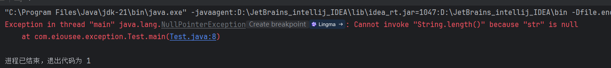
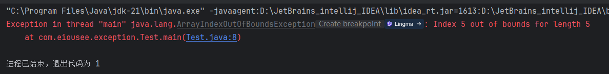
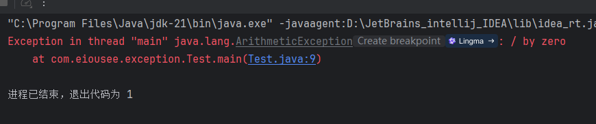
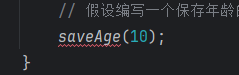
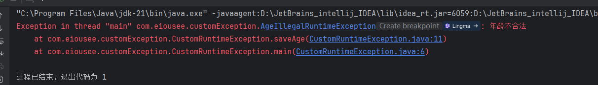
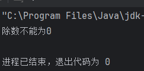
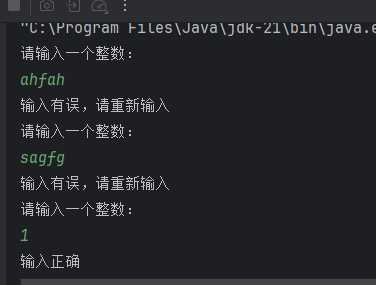
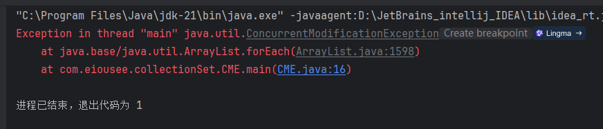

# Java Advance

`更新时间：2024-11-4`

注释解释：

- `<>`必填项，必须在当前位置填写相应数据

- `{}`必选项，必须在当前位置选择一个给出的选项

- `[]`可选项，可以选择填写或忽略

*注：该笔记内的可选项和参数均不完整，如有需要，请查询相关手册*

---

## 异常

Java中的异常分为编译时异常和运行时异常两种，对于编译时异常，一般的IDE会直接使用醒目标识报错，而运行时异常是需要程序运行后才会触发的异常

### RuntimeException

RuntimeException是Java中所有运行时异常的父类，所有的运行时异常都需要继承该类

### 常见的运行时异常

- NullPointerException 空指针异常

使用引用数据类型的变量时，如果变量内没有存储任何数据，即等于null时，调用该变量的方法容易导致空指针异常

```java
public class Test {
    public static void main(String[] args) {
        // 常见的运行时异常
        // 空指针异常
        String str = null;
        System.out.println(str.length());
    }
}
```

> 

- IndexOutOfBoundsException 下标越界异常

为数组赋值时，如果忘记了数组的长度，或者认为数组的首下标为1，就容易导致下表越界异常

```java
public class Test {
    public static void main(String[] args) {
        // 常见的运行时异常
        // 数组越界
        int[] arr = new int[5];
        arr[5] = 1;
    }
}
```

> 

*注：这里的ArrayIndexOutOfBoundsException继承自IndexOutOfBoundsException*

- 数值异常

在计算除法时，除数可能为0，导致数值异常

```java
public class Test {
    public static void main(String[] args) {
        // 常见的运行时异常
        // 除数为0
        int a = 10;
        int b = 0;
        System.out.println(a / b);
    }
}
```

> 

### 异常的作用

对于Java的异常来说，通过使用异常处理，开发者可以编写更加健壮、易于维护的代码。同时，异常可以用来定位程序出错的关键信息，也可以作为方法内部的一种特殊返回值，告知上层调用者方法的执行情况

- 普通异常处理

```java
public class Test {
    public static void main(String[] args) {
        int a = 10;
        int b = 0;
        System.out.println(div(10, 0));
    }
    
    public static double div(int dividend, int divisor) {
        if (divisor == 0) {
            System.out.println("除数不能为0");
            return -1;
        }
        return (double) dividend / divisor;
    }
}
```

在上面的程序中，考虑到除数可能为0，因此在`div()`中使用了一个`if`来判断除数是否为0，如果为0则返回-1。但是，如果遇到商本来就为-1，或者用户把-1当作正确结果时，这种处理方法就不再适用

- throw处理

```java
public class Test {
    public static void main(String[] args) {
        int a = 10;
        int b = 0;
        try {
        	System.out.println(div(10, 0));
        } catch (Exception e) {
            e.printStackTrace();
        }
    }
    
    public static double div(int dividend, int divisor) throws RuntimeException{
        if (divisor == 0) {
            throw new RuntimeException("除数不能为0");
        }
        return (double) dividend / divisor;
    }
}
```

在改进的程序中，将返回-1改为了使用`throw`关键字抛出一个`RuntimeException`异常，主函数捕获这个异常，然后输出该异常的信息

### 自定义异常

Java无法为世界上的所有问题提供异常类来代表，如果程序员遇到了某种该类问题，就可以使用自定义异常

根据继承父类的不同，自定义异常可以分为自定义运行时异常和自定义编译时异常

#### 自定义编译时异常

- CustomCompiletimeException类

```java
public class CustomCompiletimeException {
    public static void main(String[] args) {
        // 假设编写一个保存年龄的程序，首先需要判断年龄是否合法
        saveAge(10);
    }

    private static void saveAge(int age) throws AgeIllegalException{
        if (age <= 0) {
            throw new AgeIllegalException("年龄不合法");
        }
        System.out.println("保存成功！");
    }
}
```

- AgeIllegalException异常类

```java
public class AgeIllegalException extends Exception {

    public AgeIllegalException() {}

    public AgeIllegalException(String string) {
        super(string);
    }
}
```

> 

*对于编译时异常，必须向上抛出或者进行异常捕获*

#### 自定义运行时异常

- CustomRuntimeException

```java
public class CustomRuntimeException {
    public static void main(String[] args) {
        // 假设编写一个保存年龄的程序，首先需要判断年龄是否合法
        saveAge(0);
    }

    private static void saveAge(int age) {
        if (age <= 0) {
            throw new AgeIllegalRuntimeException("年龄不合法");
        }
        System.out.println("保存成功！");
    }
}
```

- AgeIllegalRuntimeException

```java
public class AgeIllegalRuntimeException extends RuntimeException {

    public AgeIllegalRuntimeException() {}

    public AgeIllegalRuntimeException(String string) {
        super(string);
    }
}
```

> 

*运行时异常不需要抛出，但并不代表没有抛出，所有的方法默认都会抛出一个`RuntimeException`*

### 异常处理

目前常见的异常处理方案有两种，一种是将异常层层向上抛，用户层捕获异常，响应适合用户的内容；第二种是最外层捕获异常后，尝试修复该异常

- 响应合适内容

```java
public class ResponseSuitableContent {
    public static void main(String[] args) {
        try {
            System.out.println(calc(2, 0));
        } catch (ArithmeticException e) {
            System.out.println("除数不能为0");
        }
    }

    public static double calc(double a, double b) throws ArithmeticException{
        return Math.pow(a, div(a, b));
    }

    public static double div(double a, double b) throws ArithmeticException{
        if (b == 0) {
            throw new ArithmeticException();
        }
        return a / b;
    }
}
```

> 

- 尝试修复

```java
import java.util.Scanner;

public class TryToFix {
    public static void main(String[] args) {
        while (true) {
            try {
                int num = getUserInput();
                break;
            } catch (Exception e) {
                System.out.println("输入有误，请重新输入");
            }
        }
        System.out.println("输入正确");
    }

    public static int getUserInput() {
        Scanner scanner = new Scanner(System.in);
        System.out.println("请输入一个整数：");

        return scanner.nextInt();
    }
}
```

> 

## 泛型

泛型是指，在定义类、接口、方法时，同时声明了一个或多个类型变量。泛型提供了在编译阶段约束所能操作的数据类型，并自动进行检查的能力，这样可以避免强制类型转换，以及可能出现的异常和数据丢失

### 泛型类

**基本语法**

```java
[accessibility] class className<typeVariable, typeVariable, ...> {
    classBody;
}
```

*一般的类型变量用`E`，`T`，`K`，`V`代替，其分别表示元素`element`，返回值`returned value`，键`Key`，值`value`*

自定义泛型类可以让程序员自定义一个需要约束的容器，类似于`ArrayList`，以便更好地管理数据

```java
public class CustomArrayList<E> {
    public boolean add(E e) {
        // 添加操作
    }
    
    public E get() {
        // 获取操作
    }
}
```


### 泛型接口

**基本语法**

```java
[accessibility] interface interfaceName<typeVariable, TypeVariable, ...> {
    interfaceBody;
}
```

在设计接口时，如果该接口内部的方法需要接收一个对象，但是该对象的数据类型可能有多种，则可以使用泛型接口

```java
public interface InfoManager<E> {
    void add(E e);
    
    void delete(E e);
    
    void update(E e);
    
    E query(int id);
}
```

在实现接口时，指定泛型的数据类型，就可以为实现类指定约束类型

```java
public class StuManager implements InfoManager<Student> {
    // 方法重写...
}
```

### 泛型方法

**基本语法**

```java
[accessibility] [modifier] <typeVariable, typeVariable, ...> returnedValueType methodName(argumentType argument) {
    methodBody;
}
```

如果一个方法需要接收多个数据类型的参数，在以往的写法中，只能使用多态或者方法重载

- 多态

```java
public class Test {
    public static void main(String[] args) {
        int[] intArray = {1, 2, 3, 4};
        printArray(intArray);

        String[] stringArray = {"Hello", "World"};
        printArray(stringArray);
    }
    
    public static void printArray(Object array) {
        if (array instanceof int[] intArray) {
            for (int i : intArray) {
                System.out.println(i);
            }
        } else if (array instanceof String[] stringArray) {
            for (String s : stringArray) {
                System.out.println(s);
            }
        }
    }
}
```

- 方法重载

```java
public class Test {
    public static void main(String[] args) {
        int[] intArray = {1, 2, 3, 4};
        printArray(intArray);

        String[] stringArray = {"Hello", "World"};
        printArray(stringArray);
    }
    
    public static void printArray(int[] intArray) {
        for (int i : intArray) {
            System.out.println(i);
        }
    }

    public static void printArray(String[] stringArray) {
        for (String s : stringArray) {
            System.out.println(s);
        }
    }
}
```

在泛型方法中，我们可以直接对方法指定一个泛型变量，用来接收不同数据类型的数据

```java
public class Test {
    public static void main(String[] args) {
        Integer[] intArray = {1, 2, 3, 4};
        printArray(intArray);

        String[] stringArray = {"Hello", "World"};
        printArray(stringArray);
    }
    
    public static <E> void printArray(E[] inputArray) {
        for (E element : inputArray) {
            System.out.println(element);
        }
    }
}
```

*注：泛型方法无法约束基本数据类型，如上面的例子中，必须将`int`转换为`Integer`*

### 通配符与上下限

在泛型数据类型变量中，如果需要指定未知个数的数据类型，可以使用`?`通配符来代表所有数据类型。但是，如果`?`能代表所有的数据类型，那么所有使用通配符的方法都有可能接收到预期之外的数据类型，造成程序异常，因此可以使用`super`和`extends`来指定通配符的上下限

**基本语法**

```java
// 假设一个赛车的方法，需要接收赛车集合对象
public static void run(ArrayList<? {extends Car | super Car}> car) {
    // 方法体
}
```

- `super` ：指定通配符的上限，即接收的数据类型必须是指定类型或其父类
- `extends` ：指定通配符的下限，接收的数据类型必须是指定类型或其子类

### 包装类

泛型不支持基本数据类型，只支持引用数据类型

**泛型擦除**

泛型工作在编译阶段，编译完成之后，泛型会被自动擦除，所有类型会自动恢复成`Object`，如果此时调用基本数据类型集合中的某个元素的方法，那么`Object`就会指向一个基本数据类型的数据，因此泛型不支持基本数据类型

**包装类**

为了解决这个问题，Java设计了包装类，将基本数据类型包装为引用数据类型

| 基本数据类型 | 包装类    |
| :----------- | :-------- |
| byte         | Byte      |
| short        | Short     |
| int          | Integer   |
| long         | Long      |
| char         | Character |
| float        | Float     |
| double       | Double    |
| boolean      | Boolean   |

## 集合体系结构

### Collection集合

#### 特点

**List系列集合**

- `ArrayList` ：有序、可重复、有索引
- `LinkedList` ：有序、可重复、有索引

**Set系列集合**

- `HashSet` ：无序、不重复、无索引
- `LinkedHashSet` ：有序、不重复、无索引
- `TreeSet` ：按照大小默认升序排列、不重复、无索引

#### 常用API

| API                                 | 说明                             |
| ----------------------------------- | -------------------------------- |
| public boolean add(E e)             | 把给定的对象添加到当前集合中     |
| public void clear()                 | 清空集合中的所有元素             |
| public boolean remove(E e)          | 把给定的对象在当前集合中移除     |
| public boolean contains(Object obj) | 判断当前集合中是否包含给定的对象 |
| public boolean isEmpty()            | 判断当前集合是否为空             |
| public int size()                   | 返回集合中元素的个数             |
| public Object[] toArray()           | 把集合中的元素存储到数组中       |

*注：`toArray()`*方法返回的是一个Object数组，如果需要转换为指定数据类型，需要在方法中添加参数

```java
import java.util.ArrayList;

public class Test {
    public static void main(String[] args) {
        ArrayList<String> list = new ArrayList<>();
        list.add("Tom");
        list.add("Jim");
        list.add("John");
        list.add("Lucy");

        // 转换为String数组
        String[] strs = list.toArray(String[]::new);
        for (String str : strs) {
            System.out.println(str);
        }
    }
}
```

#### 迭代器

迭代器是专门用来遍历集合的专用方式，在Java中迭代器的代表是`iterator`

在Java中，可以通过Collection集合的`iterator()`方法来获取一个该集合的迭代器，然后调用该迭代器对数组进行操作

**迭代器中的常用API**

| API               | 说明                                                      |
| ----------------- | --------------------------------------------------------- |
| boolean hasNext() | 询问当前位置是否有元素存在，存在返回true，不存在返回false |
| E next()          | 获取当前位置的元素，同时将迭代器对象指向下一个元素        |

#### 增强for(foreach)

**基本语法**

```java
for (dataType variableName : {arrayName | CollectionName}) {
    for body;
}
```

增强for可以看作迭代器遍历的简化版

#### Lambda表达式遍历

在JDK8之后，新增了Lambda表达式遍历集合的方式

**基本语法**

```java
CollectionName.forEach(s -> {
    methodBody;
});
```

如果方法体只有一行，还可以继续简化为方法引用

```java
CollectionName.forEach({Object | Class}::method);
```

#### 并发修改异常 ConcurrentModificationException

在遍历集合的同时又进行增删集合元素的行为时可能出现业务异常，这种现象被称为并发修改异常

**示例**

删除集合中特定元素

```java
import java.util.ArrayList;
import java.util.Iterator;

public class CME {
    public static void main(String[] args) {
        ArrayList<String> list = new ArrayList<>();
        list.add("微星显卡");
        list.add("惠普鼠标");
        list.add("微星主板");
        list.add("雷蛇键盘");
        list.add("微星耳机");
        list.add("华硕显示器");

        // 删除所有包含“微星”的元素
        list.forEach(s -> {
            if (s.contains("微星")) {
                list.remove(s);
            }
        });
        System.out.println(list);
    }
}
```

> 

**原因**

在进行遍历操作时，删除了当前元素，后面的元素会自动向前填充，而指针的位置不变，也就意味着被删除元素的后面一个元素一定会被跳过

**解决方法**

1. 调用迭代器的`remove()`方法

```java
import java.util.ArrayList;
import java.util.Iterator;

public class CME {
    public static void main(String[] args) {
        ArrayList<String> list = new ArrayList<>();
        list.add("微星显卡");
        list.add("惠普鼠标");
        list.add("微星主板");
        list.add("雷蛇键盘");
        list.add("微星耳机");
        list.add("华硕显示器");

        // 删除所有包含“微星”的元素
        Iterator<String> iterator = list.iterator();
        while (iterator.hasNext()) {
            String item = iterator.next();
            if (item.contains("微星")) {
                iterator.remove();
            }
        }
        System.out.println(list);
    }
}
```

2. 调用Collection集合的`removeIf()`方法

```java
import java.util.ArrayList;
import java.util.Iterator;

public class CME {
    public static void main(String[] args) {
        ArrayList<String> list = new ArrayList<>();
        list.add("微星显卡");
        list.add("惠普鼠标");
        list.add("微星主板");
        list.add("雷蛇键盘");
        list.add("微星耳机");
        list.add("华硕显示器");

        // 删除所有包含“微星”的元素
        list.removeIf(item -> item.contains("微星"));
        System.out.println(list);
    }
}
```

3. 倒序遍历

```java
import java.util.ArrayList;
import java.util.Iterator;

public class CME {
    public static void main(String[] args) {
        ArrayList<String> list = new ArrayList<>();
        list.add("微星显卡");
        list.add("惠普鼠标");
        list.add("微星主板");
        list.add("雷蛇键盘");
        list.add("微星耳机");
        list.add("华硕显示器");

        // 删除所有包含“微星”的元素
        for (int i = list.size() - 1; i >= 0; i--) {
            String item = list.get(i);
            if (item.contains("微星")) {
                list.remove(i);
            }
        }
        System.out.println(list);
    }
}
```

### List集合

#### List独有API

| API                            | 说明                                   |
| ------------------------------ | -------------------------------------- |
| void add(int index, E element) | 在此集合中的指定位置插入指定的元素     |
| E remove(int index)            | 删除指定索引处的元素，返回被删除的元素 |
| E set(int index)               | 修改索引处的元素，返回被修改的元素     |
| E get(int index)               | 返回指定索引处的元素                   |

#### LinkedList独有API

| API                       | 说明                             |
| ------------------------- | -------------------------------- |
| public void addFirst(E e) | 在列表开头插入指定的元素         |
| public void addLast(E e)  | 将指定的元素追加到此列表的末尾   |
| public E getFirst()       | 返回此列表中的第一个元素         |
| public E getLast()        | 返回此列表中的最后一个元素       |
| public E removeFirst()    | 从此列表中删除并返回第一个元素   |
| public E removeLast()     | 从此列表中删除并返回最后一个元素 |

