# Java Advance

`更新时间：2026-4-1`

注释解释：

- `<>`必填项，必须在当前位置填写相应数据

- `{}`必选项，必须在当前位置选择一个给出的选项

- `[]`可选项，可以选择填写或忽略

*注：该笔记内的可选项和参数均不完整，如有需要，请查询相关手册*

---

## 异常

Java中的异常分为编译时异常和运行时异常两种，对于编译时异常，一般的IDE会直接使用醒目标识报错，而运行时异常是需要程序运行后才会触发的异常

### RuntimeException

RuntimeException是Java中所有运行时异常的父类，所有的运行时异常都需要继承该类

### 常见的运行时异常

- NullPointerException 空指针异常

使用引用数据类型的变量时，如果变量内没有存储任何数据，即等于null时，调用该变量的方法容易导致空指针异常

```java
public class Test {
    public static void main(String[] args) {
        // 常见的运行时异常
        // 空指针异常
        String str = null;
        System.out.println(str.length());
    }
}
```

> 

- IndexOutOfBoundsException 下标越界异常

为数组赋值时，如果忘记了数组的长度，或者认为数组的首下标为1，就容易导致下表越界异常

```java
public class Test {
    public static void main(String[] args) {
        // 常见的运行时异常
        // 数组越界
        int[] arr = new int[5];
        arr[5] = 1;
    }
}
```

> 

*注：这里的ArrayIndexOutOfBoundsException继承自IndexOutOfBoundsException*

- 数值异常

在计算除法时，除数可能为0，导致数值异常

```java
public class Test {
    public static void main(String[] args) {
        // 常见的运行时异常
        // 除数为0
        int a = 10;
        int b = 0;
        System.out.println(a / b);
    }
}
```

> 

### 异常的作用

对于Java的异常来说，通过使用异常处理，开发者可以编写更加健壮、易于维护的代码。同时，异常可以用来定位程序出错的关键信息，也可以作为方法内部的一种特殊返回值，告知上层调用者方法的执行情况

- 普通异常处理

```java
public class Test {
    public static void main(String[] args) {
        int a = 10;
        int b = 0;
        System.out.println(div(10, 0));
    }
    
    public static double div(int dividend, int divisor) {
        if (divisor == 0) {
            System.out.println("除数不能为0");
            return -1;
        }
        return (double) dividend / divisor;
    }
}
```

在上面的程序中，考虑到除数可能为0，因此在`div()`中使用了一个`if`来判断除数是否为0，如果为0则返回-1。但是，如果遇到商本来就为-1，或者用户把-1当作正确结果时，这种处理方法就不再适用

- throw处理

```java
public class Test {
    public static void main(String[] args) {
        int a = 10;
        int b = 0;
        try {
        	System.out.println(div(10, 0));
        } catch (Exception e) {
            e.printStackTrace();
        }
    }
    
    public static double div(int dividend, int divisor) throws RuntimeException{
        if (divisor == 0) {
            throw new RuntimeException("除数不能为0");
        }
        return (double) dividend / divisor;
    }
}
```

在改进的程序中，将返回-1改为了使用`throw`关键字抛出一个`RuntimeException`异常，主函数捕获这个异常，然后输出该异常的信息

### 自定义异常

Java无法为世界上的所有问题提供异常类来代表，如果程序员遇到了某种该类问题，就可以使用自定义异常

根据继承父类的不同，自定义异常可以分为自定义运行时异常和自定义编译时异常

#### 自定义编译时异常

- CustomCompiletimeException类

```java
public class CustomCompiletimeException {
    public static void main(String[] args) {
        // 假设编写一个保存年龄的程序，首先需要判断年龄是否合法
        saveAge(10);
    }

    private static void saveAge(int age) throws AgeIllegalException{
        if (age <= 0) {
            throw new AgeIllegalException("年龄不合法");
        }
        System.out.println("保存成功！");
    }
}
```

- AgeIllegalException异常类

```java
public class AgeIllegalException extends Exception {

    public AgeIllegalException() {}

    public AgeIllegalException(String string) {
        super(string);
    }
}
```

> 

*对于编译时异常，必须向上抛出或者进行异常捕获*

#### 自定义运行时异常

- CustomRuntimeException

```java
public class CustomRuntimeException {
    public static void main(String[] args) {
        // 假设编写一个保存年龄的程序，首先需要判断年龄是否合法
        saveAge(0);
    }

    private static void saveAge(int age) {
        if (age <= 0) {
            throw new AgeIllegalRuntimeException("年龄不合法");
        }
        System.out.println("保存成功！");
    }
}
```

- AgeIllegalRuntimeException

```java
public class AgeIllegalRuntimeException extends RuntimeException {

    public AgeIllegalRuntimeException() {}

    public AgeIllegalRuntimeException(String string) {
        super(string);
    }
}
```

> 

*运行时异常不需要抛出，但并不代表没有抛出，所有的方法默认都会抛出一个`RuntimeException`*

### 异常处理

目前常见的异常处理方案有两种，一种是将异常层层向上抛，用户层捕获异常，响应适合用户的内容；第二种是最外层捕获异常后，尝试修复该异常

- 响应合适内容

```java
public class ResponseSuitableContent {
    public static void main(String[] args) {
        try {
            System.out.println(calc(2, 0));
        } catch (ArithmeticException e) {
            System.out.println("除数不能为0");
        }
    }

    public static double calc(double a, double b) throws ArithmeticException{
        return Math.pow(a, div(a, b));
    }

    public static double div(double a, double b) throws ArithmeticException{
        if (b == 0) {
            throw new ArithmeticException();
        }
        return a / b;
    }
}
```

> 

- 尝试修复

```java
import java.util.Scanner;

public class TryToFix {
    public static void main(String[] args) {
        while (true) {
            try {
                int num = getUserInput();
                break;
            } catch (Exception e) {
                System.out.println("输入有误，请重新输入");
            }
        }
        System.out.println("输入正确");
    }

    public static int getUserInput() {
        Scanner scanner = new Scanner(System.in);
        System.out.println("请输入一个整数：");

        return scanner.nextInt();
    }
}
```

> 

## 泛型

泛型是指，在定义类、接口、方法时，同时声明了一个或多个类型变量。泛型提供了在编译阶段约束所能操作的数据类型，并自动进行检查的能力，这样可以避免强制类型转换，以及可能出现的异常和数据丢失

### 泛型类

**基本语法**

```java
[accessibility] class className<typeVariable, typeVariable, ...> {
    classBody;
}
```

*一般的类型变量用`E`，`T`，`K`，`V`代替，其分别表示元素`element`，返回值`returned value`，键`Key`，值`value`*

自定义泛型类可以让程序员自定义一个需要约束的容器，类似于`ArrayList`，以便更好地管理数据

```java
public class CustomArrayList<E> {
    public boolean add(E e) {
        // 添加操作
    }
    
    public E get() {
        // 获取操作
    }
}
```


### 泛型接口

**基本语法**

```java
[accessibility] interface interfaceName<typeVariable, TypeVariable, ...> {
    interfaceBody;
}
```

在设计接口时，如果该接口内部的方法需要接收一个对象，但是该对象的数据类型可能有多种，则可以使用泛型接口

```java
public interface InfoManager<E> {
    void add(E e);
    
    void delete(E e);
    
    void update(E e);
    
    E query(int id);
}
```

在实现接口时，指定泛型的数据类型，就可以为实现类指定约束类型

```java
public class StuManager implements InfoManager<Student> {
    // 方法重写...
}
```

### 泛型方法

**基本语法**

```java
[accessibility] [modifier] <typeVariable, typeVariable, ...> returnedValueType methodName(argumentType argument) {
    methodBody;
}
```

如果一个方法需要接收多个数据类型的参数，在以往的写法中，只能使用多态或者方法重载

- 多态

```java
public class Test {
    public static void main(String[] args) {
        int[] intArray = {1, 2, 3, 4};
        printArray(intArray);

        String[] stringArray = {"Hello", "World"};
        printArray(stringArray);
    }
    
    public static void printArray(Object array) {
        if (array instanceof int[] intArray) {
            for (int i : intArray) {
                System.out.println(i);
            }
        } else if (array instanceof String[] stringArray) {
            for (String s : stringArray) {
                System.out.println(s);
            }
        }
    }
}
```

- 方法重载

```java
public class Test {
    public static void main(String[] args) {
        int[] intArray = {1, 2, 3, 4};
        printArray(intArray);

        String[] stringArray = {"Hello", "World"};
        printArray(stringArray);
    }
    
    public static void printArray(int[] intArray) {
        for (int i : intArray) {
            System.out.println(i);
        }
    }

    public static void printArray(String[] stringArray) {
        for (String s : stringArray) {
            System.out.println(s);
        }
    }
}
```

在泛型方法中，我们可以直接对方法指定一个泛型变量，用来接收不同数据类型的数据

```java
public class Test {
    public static void main(String[] args) {
        Integer[] intArray = {1, 2, 3, 4};
        printArray(intArray);

        String[] stringArray = {"Hello", "World"};
        printArray(stringArray);
    }
    
    public static <E> void printArray(E[] inputArray) {
        for (E element : inputArray) {
            System.out.println(element);
        }
    }
}
```

*注：泛型方法无法约束基本数据类型，如上面的例子中，必须将`int`转换为`Integer`*

### 通配符与上下限

在泛型数据类型变量中，如果需要指定未知个数的数据类型，可以使用`?`通配符来代表所有数据类型。但是，如果`?`能代表所有的数据类型，那么所有使用通配符的方法都有可能接收到预期之外的数据类型，造成程序异常，因此可以使用`super`和`extends`来指定通配符的上下限

**基本语法**

```java
// 假设一个赛车的方法，需要接收赛车集合对象
public static void run(ArrayList<? {extends Car | super Car}> car) {
    // 方法体
}
```

- `super` ：指定通配符的上限，即接收的数据类型必须是指定类型或其父类
- `extends` ：指定通配符的下限，接收的数据类型必须是指定类型或其子类

### 包装类

泛型不支持基本数据类型，只支持引用数据类型

**泛型擦除**

泛型工作在编译阶段，编译完成之后，泛型会被自动擦除，所有类型会自动恢复成`Object`，如果此时调用基本数据类型集合中的某个元素的方法，那么`Object`就会指向一个基本数据类型的数据，因此泛型不支持基本数据类型

**包装类**

为了解决这个问题，Java设计了包装类，将基本数据类型包装为引用数据类型

| 基本数据类型 | 包装类    |
| :----------- | :-------- |
| byte         | Byte      |
| short        | Short     |
| int          | Integer   |
| long         | Long      |
| char         | Character |
| float        | Float     |
| double       | Double    |
| boolean      | Boolean   |

## 集合体系结构

### Collection集合

#### 特点

**List系列集合**

- `ArrayList` ：有序、可重复、有索引
- `LinkedList` ：有序、可重复、有索引

**Set系列集合**

- `HashSet` ：无序、不重复、无索引
- `LinkedHashSet` ：有序、不重复、无索引
- `TreeSet` ：按照大小默认升序排列、不重复、无索引

#### 常用API

| API                                 | 说明                             |
| ----------------------------------- | -------------------------------- |
| public boolean add(E e)             | 把给定的对象添加到当前集合中     |
| public void clear()                 | 清空集合中的所有元素             |
| public boolean remove(E e)          | 把给定的对象在当前集合中移除     |
| public boolean contains(Object obj) | 判断当前集合中是否包含给定的对象 |
| public boolean isEmpty()            | 判断当前集合是否为空             |
| public int size()                   | 返回集合中元素的个数             |
| public Object[] toArray()           | 把集合中的元素存储到数组中       |

*注：`toArray()`*方法返回的是一个Object数组，如果需要转换为指定数据类型，需要在方法中添加参数

```java
import java.util.ArrayList;

public class Test {
    public static void main(String[] args) {
        ArrayList<String> list = new ArrayList<>();
        list.add("Tom");
        list.add("Jim");
        list.add("John");
        list.add("Lucy");

        // 转换为String数组
        String[] strs = list.toArray(String[]::new);
        for (String str : strs) {
            System.out.println(str);
        }
    }
}
```

#### 迭代器

迭代器是专门用来遍历集合的专用方式，在Java中迭代器的代表是`iterator`

在Java中，可以通过Collection集合的`iterator()`方法来获取一个该集合的迭代器，然后调用该迭代器对数组进行操作

**迭代器中的常用API**

| API               | 说明                                                      |
| ----------------- | --------------------------------------------------------- |
| boolean hasNext() | 询问当前位置是否有元素存在，存在返回true，不存在返回false |
| E next()          | 获取当前位置的元素，同时将迭代器对象指向下一个元素        |

#### 增强for(foreach)

**基本语法**

```java
for (dataType variableName : {arrayName | CollectionName}) {
    for body;
}
```

增强for可以看作迭代器遍历的简化版

#### Lambda表达式遍历

在JDK8之后，新增了Lambda表达式遍历集合的方式

**基本语法**

```java
CollectionName.forEach(s -> {
    methodBody;
});
```

如果方法体只有一行，还可以继续简化为方法引用

```java
CollectionName.forEach({Object | Class}::method);
```

#### 并发修改异常 ConcurrentModificationException

在遍历集合的同时又进行增删集合元素的行为时可能出现业务异常，这种现象被称为并发修改异常

**示例**

删除集合中特定元素

```java
import java.util.ArrayList;
import java.util.Iterator;

public class CME {
    public static void main(String[] args) {
        ArrayList<String> list = new ArrayList<>();
        list.add("微星显卡");
        list.add("惠普鼠标");
        list.add("微星主板");
        list.add("雷蛇键盘");
        list.add("微星耳机");
        list.add("华硕显示器");

        // 删除所有包含“微星”的元素
        list.forEach(s -> {
            if (s.contains("微星")) {
                list.remove(s);
            }
        });
        System.out.println(list);
    }
}
```

> 

**原因**

在进行遍历操作时，删除了当前元素，后面的元素会自动向前填充，而指针的位置不变，也就意味着被删除元素的后面一个元素一定会被跳过

**解决方法**

1. 调用迭代器的`remove()`方法

```java
import java.util.ArrayList;
import java.util.Iterator;

public class CME {
    public static void main(String[] args) {
        ArrayList<String> list = new ArrayList<>();
        list.add("微星显卡");
        list.add("惠普鼠标");
        list.add("微星主板");
        list.add("雷蛇键盘");
        list.add("微星耳机");
        list.add("华硕显示器");

        // 删除所有包含“微星”的元素
        Iterator<String> iterator = list.iterator();
        while (iterator.hasNext()) {
            String item = iterator.next();
            if (item.contains("微星")) {
                iterator.remove();
            }
        }
        System.out.println(list);
    }
}
```

2. 调用Collection集合的`removeIf()`方法

```java
import java.util.ArrayList;
import java.util.Iterator;

public class CME {
    public static void main(String[] args) {
        ArrayList<String> list = new ArrayList<>();
        list.add("微星显卡");
        list.add("惠普鼠标");
        list.add("微星主板");
        list.add("雷蛇键盘");
        list.add("微星耳机");
        list.add("华硕显示器");

        // 删除所有包含“微星”的元素
        list.removeIf(item -> item.contains("微星"));
        System.out.println(list);
    }
}
```

3. 倒序遍历

```java
import java.util.ArrayList;
import java.util.Iterator;

public class CME {
    public static void main(String[] args) {
        ArrayList<String> list = new ArrayList<>();
        list.add("微星显卡");
        list.add("惠普鼠标");
        list.add("微星主板");
        list.add("雷蛇键盘");
        list.add("微星耳机");
        list.add("华硕显示器");

        // 删除所有包含“微星”的元素
        for (int i = list.size() - 1; i >= 0; i--) {
            String item = list.get(i);
            if (item.contains("微星")) {
                list.remove(i);
            }
        }
        System.out.println(list);
    }
}
```

### List集合

#### List独有API

| API                            | 说明                                   |
| ------------------------------ | -------------------------------------- |
| void add(int index, E element) | 在此集合中的指定位置插入指定的元素     |
| E remove(int index)            | 删除指定索引处的元素，返回被删除的元素 |
| E set(int index)               | 修改索引处的元素，返回被修改的元素     |
| E get(int index)               | 返回指定索引处的元素                   |

#### LinkedList独有API

| API                       | 说明                             |
| ------------------------- | -------------------------------- |
| public void addFirst(E e) | 在列表开头插入指定的元素         |
| public void addLast(E e)  | 将指定的元素追加到此列表的末尾   |
| public E getFirst()       | 返回此列表中的第一个元素         |
| public E getLast()        | 返回此列表中的最后一个元素       |
| public E removeFirst()    | 从此列表中删除并返回第一个元素   |
| public E removeLast()     | 从此列表中删除并返回最后一个元素 |

## Stream

`Stream`流是从`jdk8`开始新增的一套`API`，位于`java.util.stream.*`，可以用于操作集合或者数组的数据；`Stream`的主要优势是大量结合了`Lambda`的语法风格来编程，功能强大，代码简洁，可读性好

**示例**

假设我们准备一个数组，里面存储了一些人名，要求过滤出所有姓张的，名字字数为3的人的人名

```java
List<String> nameList = new ArrayList<>();
nameList.add("张三");
nameList.add("李四");
nameList.add("张三丰");
nameList.add("张无忌");
nameList.add("张先万");
List<String> newNameList = new ArrayList<>();
```

- 传统过滤方式

```java
for (String name : nameList) {
    if (name.startsWith("张") && name.length() == 3) {
        newNameList.add(name);
    }
}
```

- `Stream`流方式

```java
newNameList = nameList.stream()
        .filter(name -> name.startsWith("张"))
        .filter(name -> name.length() == 3)
        .toList();
```

### Stream流的获取

- `Collection`

在`Collection`集合中，为每个集合对象提供了`.stream()`方法来获取对应的`Stream`流数据

**标准语法**

```java
Collection<E> collection;
Stream<E> stream = collection.stream()
```

- `Map`

`Map`集合并没有提供直接获取`Stream`流的`API`，但是可以将其转换为`Collection`集合，间接地获取`Stream`流

**标准语法**

```java
Map<Key, Value> map;

// 获取键流
Stream<E> keyStream = map.keySet().stream();

// 获取值流
Stream<E> valueStream = map.values().stream();

// 获取键值对流
Stream<Map.Entry<E, E>> entryStream = map.entrySet().stream();
```

- 数组

数组的`Stream`流通过`Arrays.stream()`方法或者`Stream.of()`方法来获取

```java
Array[] arr = {};

Stream<E> stream = Arrays.stream(arr);

Stream<E> stream = Stream.of(arr);
```

### 中间方法

`Stream`提供了多个中间方法，搭配不同的中间方法进行链式编程，就可以达到不同的业务目的

| API                                                          | 说明                                                         |
| ------------------------------------------------------------ | ------------------------------------------------------------ |
| `Stream<T> filter(Predicate<? super T> predicate)`           | 用于对流中的数据进行过滤，过滤参数是一个匿名函数             |
| `Stream<T> sorted()`                                         | 对流元素进行升序排序                                         |
| `Stream<T> sorted(Comparator<? super T> comparator)`         | 对流元素继续指定规则的排序，排序规则是一个匿名函数           |
| `Stream<T> limit(long maxSize)`                              | 获取从头开始，`maxSize`个数的元素                            |
| `Stream<T> skip(long n)`                                     | 跳过`n`个数的元素                                            |
| `Stream<T> distinct()`                                       | 去除流中的重复元素                                           |
| `<R> Stream<R> map(Function<? super T, ? extends R> mapper)` | 加工方法，能将原来的流数据映射为一份新数据，进行操作后再返回流 |
| `static <T> Stream<T> concat(Stream a, Stream b)`            | 将`a`与`b`流拼接起来                                         |

**示例**

```java
List<Integer> scores = new ArrayList<>();
scores.add(85);
scores.add(90);
scores.add(75);
scores.add(60);
scores.add(80);
scores.add(90);
scores.add(60);
scores.add(95);
scores.add(55);

scores.stream()
        // 去掉分数小于60的
        .filter(score -> score >= 60)
        // 将分数降序处理
        .sorted((s1, s2) -> Integer.compare(s2, s1))
        // 去重
        .distinct()
        // 获取前5名
        .limit(5)
        // 跳过前3名
        .skip(3)
        // 将每人分数加10
        .map(score -> score + 10)
        .forEach(System.out::println);
```

> 

### 终结方法

在`Stream`流处理完成后，也提供了一系列的终结方法用于获取流数据

| API                                                 | 说明                                       |
| --------------------------------------------------- | ------------------------------------------ |
| `void forEach(Consumer action)`                     | 遍历流中的每个数据                         |
| `long count()`                                      | 统计流长度                                 |
| `Optional<T> max(Comparator<? super T> comparator)` | 获取流中的最大值，并存储在`Optional`容器中 |
| `Optional<T> min(Comparator<? super T> comparator)` | 获取流中的最小值，并存储在`Optional`容器中 |

对于`max()`和`min()`，为了避免空指针异常，因此将获取的结果暂时存储在容器中，需要取用数据时，调用容器的`get()`方法获取

```java
List<Integer> scores = new ArrayList<>();
scores.add(85);
scores.add(90);
scores.add(75);
scores.add(60);
scores.add(80);
scores.add(90);
scores.add(60);
scores.add(95);
scores.add(55);

// 获取最高分
Optional<Integer> maxScore = scores.stream().max(Integer::compareTo);
System.out.println("最高分：" + maxScore.get());
// 获取最低分
Optional<Integer> minScore = scores.stream().min(Integer::compareTo);
System.out.println("最低分：" + minScore.get());
```

> 

#### 收集集合

在实际业务操作中，流只负责操作数据，不负责存储与传递数据，因此需要将流中的数据再次保存为新的集合或者数组

| API                | 说明             |
| ------------------ | ---------------- |
| `List<E> toList()` | 收集为`List`集合 |
| `Set<E> toSet()`   | 收集为`Set`集合  |

以上的两个`API`是`JDK16`后新增的简化`API`，而对于`JDK16`之前的`Java`项目，可以使用`collect()`方法来实现，`collect()`接收一个`Collector`对象，调用`Collector`对象不同的方法即可收集为不同的集合

| API                                                         | 说明                                                         |
| ----------------------------------------------------------- | ------------------------------------------------------------ |
| `Collector.toList()`                                        | 收集为`List`集合                                             |
| `Collector.toSet()`                                         | 收集为`Set`集合                                              |
| `Collector.toMap(Function keyMapper, Function valueMapper)` | 收集为`Map`集合，其中键由`keyMapper`匿名函数决定，值由`valueMapper`决定 |

**示例**

```java
List<User> list = new ArrayList<>();
list.add(new User("张三", 18));
list.add(new User("李四", 27));
list.add(new User("王五", 19));

// 获取年龄小于20的，并收集为一个Map
Map<String, Integer> userMap = list.stream()
        .filter(user -> user.getAge() < 20)
        .collect(Collectors.toMap(User::getName, User::getAge));

System.out.println(userMap);
```

> 

#### 收集数组

将`Stream`收集为集合使用`toArray()`方法

**标准语法**

```java
Object[] toArray(Function<A[]> generator)
```

**示例**

```java
List<User> list = new ArrayList<>();
list.add(new User("张三", 18));
list.add(new User("李四", 27));
list.add(new User("王五", 19));

// 获取年龄小于20的，并收集为一个数组
User[] users = list.stream()
        .filter(user -> user.getAge() < 20)
        .toArray(User[]::new);

System.out.println(Arrays.toString(users));
```


## 多线程

线程是一个程序内部执行的一条执行流程，如果程序中只有一条流程，那么这个程序就是单线程程序，在以往的学习中，我们进行的编程都是单线程。多线程是指从软硬件上实现多条执行流程的技术

`main`方法实际也是在一个主线程中进行的

### 创建线程

在`Java`中，提供了多种创建线程的方式

#### 继承Thread类

 将类声明为`Thread`类的子类，并重写`Thread`类的`run`方法

```java
package com.eiousee;

public class Test {
    public static void main(String[] args) {
        Thread t = new MyThread();
        t.start();

        for (int i = 0; i < 5; i++) {
            System.out.println("主线程" + i);
        }
    }
}

class MyThread extends Thread {
    @Override
    public void run() {
        for (int i = 0; i < 5; i++) {
            System.out.println("子线程" + i);
        }
    }
}
```

> 

*注：在注册线程时。必须调用子线程实例的`start()`方法而不是`run()`方法；在实际业务逻辑中，启动子线程的代码应位于主线程逻辑的上方，先注册子线程，再完成主线程业务*

#### 实现Runnable接口

声明一个类，实现`Runnable`接口的`run()`方法，然后将此实例交给`Thread()`对象，调用`start()`方法

```java
package com.eiousee;

public class Test {
    public static void main(String[] args) {
        Runnable t = new MyThread();
        new Thread(t).start();

        for (int i = 0; i < 5; i++) {
            System.out.println("主线程" + i);
        }
    }
}

class MyThread implements Runnable {
    @Override
    public void run() {
        for (int i = 0; i < 5; i++) {
            System.out.println("子线程" + i);
        }
    }
}
```

由于`Thread()`接收的参数`Runnable`类是一个函数式接口，因此可以使用`lambda`表达式的方式来简化以上代码

```java
package com.eiousee;

public class Test {
    public static void main(String[] args) {
        new Thread(() -> {
            for (int i = 0; i < 5; i++) {
                System.out.println("子线程" + i);
            }
        }).start();

        for (int i = 0; i < 5; i++) {
            System.out.println("主线程" + i);
        }
    }
}
```

#### 实现Callable接口

上面两种线程创建方式都存在一个很大的问题，我们重写的方法`public void run()`的返回值类型永远是`void`，因此不能通过这两种类型获取任何的返回值

在`JDK5.0`后，提供了`Callable`接口和`FutureTask`类来实现有返回值的子线程

**创建步骤**

1. 定义一个类，实现`Callable`接口，重写`call`方法，封装需要执行的逻辑和需要返回的数据
2. 将`Callable`实例封装为`FutureTask`实例
3. 将线程任务交给`Thread`实例，调用`Thread`实例的`start()`方法启动线程
4. 线程结束后，通过`FutureTask`实例的`get()`方法获取线程执行的结果

```java
package com.eiousee;

import java.util.concurrent.Callable;
import java.util.concurrent.ExecutionException;
import java.util.concurrent.FutureTask;

public class Test {
    public static void main(String[] args) throws ExecutionException, InterruptedException {
        FutureTask<String> task = new FutureTask<>(new myCallable());
        new Thread(task).start();
        System.out.println(task.get());
        System.out.println("这是主线程的结果");
    }
}

class myCallable implements Callable<String> {
    @Override
    public String call() throws Exception {
        return "这是子线程的结果";
    }
}
```

如果子线程想要传递参数，也可以在`Callable`类中定义私有属性，并通过有参构造器来传递参数

```java
package com.eiousee;

import java.util.concurrent.Callable;
import java.util.concurrent.ExecutionException;
import java.util.concurrent.FutureTask;

public class Test {
    public static void main(String[] args) throws ExecutionException, InterruptedException {
        FutureTask<String> task = new FutureTask<>(new myCallable(123));
        new Thread(task).start();
        System.out.println(task.get());
        System.out.println("这是主线程的结果");
    }
}

class myCallable implements Callable<String> {
    private Integer i;

    public myCallable(Integer i) {
        this.i = i;
    }

    @Override
    public String call() {
        return "这是子线程的结果" + i;
    }
}
```

> 

*注：需要注意的是，如果子线程没有完成，则主线程会阻塞在`get()`方法处，直到子线程完成并返回数据，因此`get()`方法后方的代码一定会晚于子线程执行*

### 线程常用方法

| 方法                                          | 说明                                         |
| --------------------------------------------- | -------------------------------------------- |
| `public void run()`                           | 线程的任务方法                               |
| `public void start()`                         | 线程的启动方法                               |
| `public String getName()`                     | 获取当前线程的名称                           |
| `public void setName()`                       | 为线程设置名称                               |
| `public static Thread currentThread()`        | 获取当前执行的线程实例                       |
| `public static void sleep(long time)`         | 线程休眠                                     |
| `public final void join()`                    | 抢占线程优先权                               |
| `public Thread(String name)`                  | 为当前线程指定名称                           |
| `public Thread(Runnable target)`              | 将`Runnable`实例封装为`Thread`实例           |
| `public Thread(Runnable target, String name)` | 封装`Runnable`实例为`Thread`实例，并设置名称 |

**示例**

```java
package com.eiousee;

import java.util.concurrent.Callable;
import java.util.concurrent.ExecutionException;
import java.util.concurrent.FutureTask;

public class Test {
    public static void main(String[] args) throws InterruptedException {
        // 获取当前线程名
        Thread t = Thread.currentThread();
        System.out.println(t.getName());
        // 为当前线程设置名字
        t.setName("MyThread");
        System.out.println(t.getName());

        // 创建新线程
        Thread t1 = new Thread(() -> {
            System.out.println("开始子线程1");
            try {
                Thread.sleep(2000);
            } catch (InterruptedException e) {
                throw new RuntimeException(e);
            }
            System.out.println("结束子线程1");
        });
        t1.start();

        System.out.println("主线程1");

        // 新线程2
        Thread t2 = new Thread(() -> {
            System.out.println("开始子线程2");
            try {
                Thread.sleep(2000);
            } catch (InterruptedException e) {
                throw new RuntimeException(e);
            }
        });
        t2.start();
        t2.join();

        System.out.println("主线程2");
    }
}
```

> 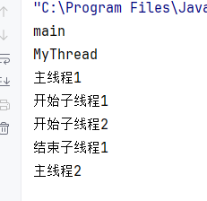

### 线程安全

线程安全问题是指，多个线程在操作同一个共享资源的时候，可能会出现的业务安全问题

**示例**

假设有两个人同时在`ATM`机取钱，`ATM`中剩余1000元，两人分别都取1000元

```java
package com.eiousee;

public class Test {
    public static void main(String[] args) {
        ATM atm = new ATM(1000);
        new DrawThread(atm, "甲").start();
        new DrawThread(atm, "乙").start();
    }
}

class ATM {
    private Integer money;

    public ATM(Integer money) {
        this.money = money;
    }

    public void drawMoney(Integer money) {
        if (this.money >= money) {
            System.out.println(Thread.currentThread().getName() + "取钱成功，取钱数为：" + money);
            this.money -= money;
            System.out.println("余额为：" + this.money);
        } else {
            System.out.println(Thread.currentThread().getName() + "取钱失败，余额不足");
        }
    }
}

class DrawThread extends Thread {
    private ATM atm;

    public DrawThread(ATM atm, String name) {
        super(name);
        this.atm = atm;
    }

    @Override
    public void run() {
        atm.drawMoney(1000);
    }
}
```

> 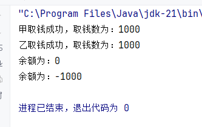

这里就可以发现，两个线程单独运行，每个线程执行`this.money >= money`均成功，因此最后余额为负数

#### 线程同步

为了解决以上的线程安全问题，可以使用线程同步方案。线程同步是指让多个线程先后依次访问资源，这样就可以避免出现线程安全问题

#### 线程同步方案

- `同步代码块`：每次只允许一个线程加锁，加锁后才能访问，访问完毕后自动解锁，然后其他线程才能进入

**标准语法**

指定一个唯一的对象作为同步锁，将访问共享资源的核心代码用同步锁包裹起来

```java
synchronized(synchrolock) {
    // core code
}
```

**示例**

这里使用`this`作为同步锁，因为对于每个共享资源，其自身对于相同请求的不同线程来说就是唯一的，而对不同请求的线程来说不同，也就避免了同步锁范围过大的问题

```java
public void drawMoney(Integer money) {
    synchronized (this) {
        if (this.money >= money) {
            System.out.println(Thread.currentThread().getName() + "取钱成功，取钱数为：" + money);
            this.money -= money;
            System.out.println("余额为：" + this.money);
        } else {
            System.out.println(Thread.currentThread().getName() + "取钱失败，余额不足");
        }
    }
}
```

> 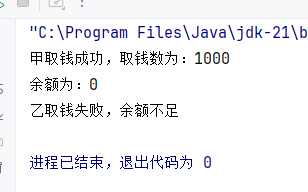

*注：对于静态方法，可以使用字节码文件`className.class`对象作为同步锁*

- `同步方法`：将访问共享资源的方法上锁，保证线程安全

**标准语法**

```java
Accessibility synchronized returnedValueType methodName(params...) {
    // method body
}
```

**示例**

```java
public synchronized void drawMoney(Integer money) {
    if (this.money >= money) {
        System.out.println(Thread.currentThread().getName() + "取钱成功，取钱数为：" + money);
        this.money -= money;
        System.out.println("余额为：" + this.money);
    } else {
        System.out.println(Thread.currentThread().getName() + "取钱失败，余额不足");
    }
}
```

- `Lock锁`：`Lock`锁是`JDK5`开始提供的一个新的锁定操作，通过它可以创建出锁对象进行加锁和解锁，更灵活方便

`Lock`锁是接口，不能实例化，可以采用实现类`ReentrantLock`来构建`Lock`锁对象

**示例**

在`ATM`类中添加`Lock`锁。这里不能使用`static`关键字，因为必须保证`Lock`锁只能锁定同一请求的不同线程。这里建议添加`final`关键字，以避免业务逻辑中`lock`的值被更改

```java
class ATM {
    private final Lock lock = new ReentrantLock();
}
```

然后在核心代码中加锁，为了避免死锁，应该使用`try-finally`包含核心代码，并在`finally`中使用`unlock()`方法

```java
public void drawMoney(Integer money) {
    lock.lock();
    try {
        if (this.money >= money) {
            System.out.println(Thread.currentThread().getName() + "取钱成功，取钱数为：" + money);
            this.money -= money;
            System.out.println("余额为：" + this.money);
        } else {
            System.out.println(Thread.currentThread().getName() + "取钱失败，余额不足");
        }
    } finally {
        lock.unlock();
    }
}
```

### 线程池

线程池就是一个可以复用线程的技术。线程池由工作线程`WorkThread`和任务队列`WorkQueue`构成，任务队列中只能包含`Runnable`和`Callable`实例

#### 创建线程池

`JDK 5.0`起提供了代表线程池的接口`ExecutorService`，然后创建`ThreadPoolExecutor`实例，或者使用`Executors`工具类的方法返回不同的线程池

##### ThreadPoolExecutor

```java
public ThreadPoolExecutor(
	int corePoolSize,
    int maximumPoolSize,
    long keepAliveTime,
    TimeUnit unit,
    BlockingQueue<Runnable> workQueue,
    ThreadFactory threadFactory,
    RejectedExecutionHandler handler
);
```

- `corePoolSize`：指定线程池的核心线程数量，也就是常用线程数量
- `maximumPoolSize`：指定线程池的最大线程数量
- `keepAliveTime`：指定核心线程以外的临时线程的存活时间
- `TimeUnit`：临时线程存活时间的单位，如`秒`、`分`、`时`等
- `workQueue`：指定线程池的任务队列
- `threadFactory`：指定线程池的线程工厂
- `handler`：指定线程池满时，任务拒绝策略

**示例**

```java
ExecutorService es = new ThreadPoolExecutor(
        3,
        5,
        10,
        TimeUnit.SECONDS,
        new ArrayBlockingQueue<Runnable>(5),
        Executors.defaultThreadFactory(),
        new ThreadPoolExecutor.DiscardOldestPolicy()
);
```

**常用方法**

| 方法                                 | 说明                                                         |
| ------------------------------------ | ------------------------------------------------------------ |
| `void execute(Runnable command)`     | 执行`Runnable`任务                                           |
| `Future<T> submit(Callable<T> task)` | 执行`Callable`任务，并返回`Future`对象，`Future`对象可以获取返回值 |
| `void shutdown()`                    | 等全部任务执行完成后，关闭线程池                             |
| `List<Runnable> shutdownNow()`       | 立刻关闭线程池，并返回未完成的任务                           |

**示例**

```java
package com.eiousee;

import java.util.concurrent.*;

public class Test {
    public static void main(String[] args) {
        ExecutorService es = new ThreadPoolExecutor(
                3,
                5,
                10,
                TimeUnit.SECONDS,
                new ArrayBlockingQueue<Runnable>(5),
                Executors.defaultThreadFactory(),
                new ThreadPoolExecutor.DiscardOldestPolicy()
        );

        Runnable task = new Task();
        for (int i = 0; i < 10; i++) {
            es.submit(task);
        }
    }
}

class Task implements Runnable {
    @Override
    public void run() {
        System.out.println(Thread.currentThread().getName() + " is running");
    }
}
```

> 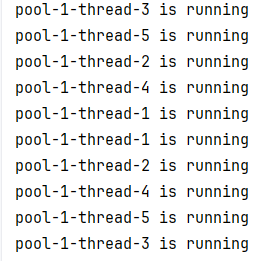

*注：临时线程创建的条件有四点，第一，核心线程都在忙；第二，任务队列已满；第三，有足够的临时线程名额；第四，有新任务尝试加入任务队列*

**任务拒绝策略**

| 策略                                      | 说明                                               |
| ----------------------------------------- | -------------------------------------------------- |
| `ThreadPoolExecutor.AbortPolicy()`        | 丢弃任务并抛出`RejectedExecutionException`异常     |
| `ThreadPoolExecutor.DiscardPolicy()`      | 丢弃任务但不抛出异常                               |
| `ThreadPoolExecutor.DiscardOldesPolicy()` | 抛弃队列中等待最久的任务，然后把当前任务加入队列中 |
| `ThreadPoolExecutor.CallerRunsPolicy()`   | 由主线程负责调用任务的`run()`方法，绕过线程池执行  |

##### Executors

| 方法名称                                                     | 说明                                                         |
| ------------------------------------------------------------ | ------------------------------------------------------------ |
| `public static ExecutorService newFixedThreadPool(int nThreads)` | 创建固定数量的线程池，如果某个线程因为执行异常而结束，那么线程池会补充一个新线程替代它 |
| `public static ExecutorService newSingleThreadExecutor()`    | 创建只有一个线程的线程池对象，如果该线程出现异常而结束，那么线程池会补充一个新线程 |
| `public static ExecutorService newCachedThreadPool()`        | 创建一个动态线程池，线程数量随着任务增加而增加，如果线程任务执行完毕且空闲了60秒，最会被回收 |
| `public static ScheduledExecutorService newScheduledThreadPool(int corePoolSize)` | 创建一个线程池，可以实现在给定的延迟后运行任务，或者定期执行任务 |

*注：在`《阿里巴巴JAVA开发手册》`中，强制要求线程池使用`ThreadPoolExecutor`类实现，因为`Executors`下的方法对任务长度或线程数量没有限制，容易造成`OOM`*

### 综合练习-抢红包

**需求**

红包雨游戏，某企业有100名员工，员工的工号依次是`1, 2, 3, 4...`，现在公司举办了年会活动，活动中有一个红包雨环节，要求共计发出200个红包雨。其中小红包在`1-30`元之间，占比80%，大红包`31-100`元之间，占比20%

**具体功能如下**

1. 系统模拟上述要求产生200个红包
2. 模拟100个员工抢红包雨
3. 活动结束后，请对100名员工按照所抢红包的总金额进行降序排序

#### 实现

1. 建立需要的实体类`User`、`RedPacket`和`SnatchCallable`

`User.java`

对于每个员工，其中的属性至少应包括员工编号和抢到的红包

```java
package com.eiousee;

import lombok.AllArgsConstructor;
import lombok.Data;
import lombok.NoArgsConstructor;

import java.util.List;
import java.util.Queue;

@Data
@AllArgsConstructor
@NoArgsConstructor
public class User {
    private Integer id;
    private RedPacket redPacket;
}

```

`RedPacket.java`

红包只有面额这一个属性

```java
package com.eiousee;

import lombok.AllArgsConstructor;
import lombok.Data;
import lombok.NoArgsConstructor;

@Data
@AllArgsConstructor
@NoArgsConstructor
public class RedPacket {
    private Integer money;
}

```

`SnatchCallable.java`

并发操作的`Callable`实体类，每个线程都应该持有共享的红包整体资源，并持有一个需要执行抢红包动作的用户实体

这里需要注意，红包资源类的数据类型需要使用保证线程安全，因此我们使用`Queue`队列，类似于`List`，同样继承自`Collection`，其下的子类`ConcurrentLinkedDeque`或者`BlockingQueue`是线程安全的

```java
package com.eiousee;

import java.util.Queue;
import java.util.concurrent.Callable;

public class SnatchCallable implements Callable<User> {
    private User user;
    private Queue<RedPacket> redPackets;

    public SnatchCallable(User user, Queue<RedPacket> redPackets) {
        this.user = user;
        this.redPackets = redPackets;
    }
}
```

2. 为实体类`SnatchCallable`和`User`添加相应方法

`User`

用户类中需要一个抢红包方法`snatch`，根据外部传来的红包整体资源，从所有红包中取出一份，然后赋值给自己的属性`redPacket`

`poll()`方法可以保证在并发操作中，每个子线程都只能独立获取唯一资源，如果`redPackets`中没有可用资源，那么`poll()`返回`null`，从而根据`redPacket`来判断用户是否抢到了红包。避免先判断后赋值时，可能出现多线程判断均通过，但是只有一个线程能够获取资源的问题

```java
public class User {
    private Integer id;
    private RedPacket redPacket;

    public void snatch(Queue<RedPacket> redPackets) {
        RedPacket redPacket = redPackets.poll();
        if (redPacket != null) {
            this.redPacket = redPacket;
        }
    }
}
```

`SnatchCallable`

`SnatchCallable`类用于实现调用用户抢红包的行为，将每个接收到的用户对象，调用其抢红包方法，方法参数即是接收到的红包整体资源，最后返回该用户即可

```java
public class SnatchCallable implements Callable<User> {
    private User user;
    private Queue<RedPacket> redPackets;

    public SnatchCallable(User user, Queue<RedPacket> redPackets) {
        this.user = user;
        this.redPackets = redPackets;
    }

    @Override
    public User call() {
        this.user.snatch(this.redPackets);

        return this.user;
    }
}
```

3. 实现主逻辑

首先生成所有红包，我们使用`ConcurrentLinkedDeque`来存储总共的200个红包对象，然后调用`for`循环，在其中添加指定数量的红包对象，使用随机数作为红包金额

```java
Queue<RedPacket> redPackets = new ConcurrentLinkedDeque<>();
for (int i = 0; i < (int) (200 * 0.8); i++) {
    // 1-30的随机数
    redPackets.add(new RedPacket((int) (Math.random() * 30 + 1)));
}
for (int i = 0; i < (int) (200 * 0.2); i++) {
    // 31-100的随机数
    redPackets.add(new RedPacket((int) (Math.random() * 70 + 31)));
}
```

然后打乱所有红包，并创建用户整体，用户存储100和用户实例

```java
// 打乱
List<RedPacket> redPackets2 = new ArrayList<>(redPackets);
Collections.shuffle(redPackets2);
redPackets.clear();
redPackets.addAll(redPackets2);

List<User> users = new ArrayList<>();
for (int i = 0; i < 100; i++) {
    users.add(new User(i + 1, null));
}
```

然后创建线程池，核心线程数量根据自己的电脑配置而定，比如我使用的CPU是`AMD Ryzen 7 7840H`，共计8核心16线程，那么核心线程数量即是16个，最大线程数量一般为核心线程数量的两倍；队列长度必须大于任务总量，如果小于，则可能导致任务被拒绝

```java
// 创建线程池
ThreadPoolExecutor executor = new ThreadPoolExecutor(
        16,
        32,
        60,
        TimeUnit.SECONDS,
        new ArrayBlockingQueue<>(1000),
        Executors.defaultThreadFactory()
);
```

然后创建并发任务，定义一个`Future future`数组接收返回的用户实例，然后遍历`users`数组，将每个用户提交到线程池中进行抢红包任务，将得到的结果添加到`future`数组中，并在任务结束后关闭线程池

```java
// 创建并发任务
List<Future<User>> futures = new ArrayList<>();
for (User user : users) {
    Future<User> future = executor.submit(new SnatchCallable(user, redPackets));
    futures.add(future);
}
// 关闭线程池
executor.shutdown();
```

然后将`future`数组的内容返还`users`，使用`stream()`流对`users`进行排序，最后打印`users`数组

```java
users = new ArrayList<>();
for (Future<User> future : futures) {
    users.add(future.get());
}
users = users.stream()
        .sorted(Comparator.comparing((User user) -> user.getRedPacket().getMoney()).reversed())
        .toList();
System.out.println(users);
```

> 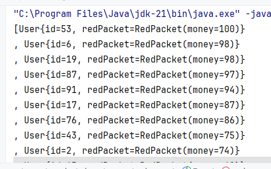

## 网络编程

网络编程是指可以让设备中的程序与网络上其他设备中的程序进行数据交互的技术。目前网络通信架构有两种形式：`Client/Server`的CS架构与`Browser/Server`的BS架构

### InetAddress API

| 常用                                                         | 说明                                      |
| ------------------------------------------------------------ | ----------------------------------------- |
| `public static InetAddress getLocalHost() throws UnknownHostException` | 获取本地`IP`，返回`InetAddress`对象       |
| `public String getHostName()`                                | 获取该`IP`地址对象对应的主机名            |
| `public String getHostAddress()`                             | 获取该`IP`地址对象中的`IP`信息            |
| `public static InetAddress getByName(String host) throws UnknownHostException` | 根据`IP`地址或者域名返回`InetAddress`对象 |
| `public boolean isReachable(int timeout) throws IOException` | 测试网络连通性                            |

**示例**

```java
package com.eiousee;

import java.net.InetAddress;

public class Test {
    public static void main(String[] args) throws Exception {
        // 获取本机IP
        InetAddress inetAddress = InetAddress.getLocalHost();
        System.out.println("本机主机：" + inetAddress);

        // 访问必应
        if (inetAddress.isReachable(5000)) {
            System.out.println("可以访问必应");
        } else {
            System.out.println("不可以访问必应");
        }
        InetAddress inetAddress1 = InetAddress.getByName("www.bing.com");
        System.out.println("必应主机名：" + inetAddress1.getHostName());
        System.out.println("必应主机IP：" + inetAddress1.getHostAddress());
    }
}
```

> 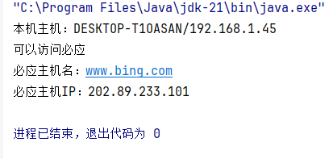

### UDP

`Java`提供了`java.net.DatagramSocket`类来实现`UDP`通信

| 构造器                                                       | 说明                                             |
| ------------------------------------------------------------ | ------------------------------------------------ |
| `public DatagramSocket()`                                    | 创建客户端`Socket`对象，系统会随机分配一个端口号 |
| `public DatagramSocket(int port)`                            | 创建服务端的`Socket`对象，并指定端口号           |
| `public DatagramPacket(byte[] buf, int length, InetAddress address, int port)` | 创建发送的数据包对象                             |
| `public DatagramPacket(byte[] buf, int length)`              | 创建用于接收的数据包对象                         |

| 方法                                    | 说明               |
| --------------------------------------- | ------------------ |
| `public void send(DatagramPacket dp)`   | 发送数据包         |
| `public void receive(DatagramPacket p)` | 使用数据包接收数据 |

**示例**

`Server.java`

```java
package com.eiousee;

import java.net.DatagramPacket;
import java.net.DatagramSocket;
import java.net.InetAddress;
import java.net.SocketException;

public class Server {
    public static void main(String[] args) throws Exception {
        // 创建服务端
        DatagramSocket socket = new DatagramSocket(30000);
        // 接收数据
        byte[] bytes = new byte[1024 * 64];
        DatagramPacket packet = new DatagramPacket(bytes, bytes.length);
        socket.receive(packet);
        String content = new String(bytes, 0, packet.getLength());
        System.out.println("接收数据：" + content);
    }
}

```

`Client.java`

```java
package com.eiousee;

import java.net.DatagramPacket;
import java.net.DatagramSocket;
import java.net.InetAddress;
import java.net.SocketException;

public class Client {
    public static void main(String[] args) throws Exception {
        // 创建客户端
        DatagramSocket socket = new DatagramSocket();
        // 发送数据
        byte[] bytes = "Hello, World".getBytes();
        DatagramPacket packet = new DatagramPacket(bytes, bytes.length, InetAddress.getLocalHost(), 30000);
        socket.send(packet);
    }
}
```

> 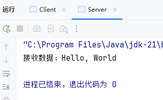

*`DatagramPacket`对象还有一些可以获取发送方`IP`、端口的`API`，如`public String getHostAddress()`、`public synchronized int getPort()`等等*

### TCP

`Java`提供了`java.net.Socket`类实现`TCP`通信

| 构造器或方法                            | 说明                                                         |
| --------------------------------------- | ------------------------------------------------------------ |
| `public Socket(String host, int port)`  | 根据指定的服务器`ip`了，端口号，请求与服务器建立连接，连接通过则获得客户端`socket`对象 |
| `public OutputStream getOutputStream()` | 获得字节输出流对象                                           |
| `public InputStream getInputStream()`   | 获得字节输入流对象                                           |
| `public ServerSocket(int port)`         | 为服务端程序注册端口                                         |
| `public Socket accept()`                | 等待客户端连接，一旦与客户端连接成功，则返回服务端`Socket`对象 |

**示例**

`Client.java`

```java
package com.eiousee;

import java.io.DataOutputStream;
import java.io.OutputStream;
import java.net.Socket;

public class Client {
    public static void main(String[] args) throws Exception {
        // 创建客户端
        Socket socket = new Socket("127.0.0.1", 30000);
        // 创建发送数据流
        OutputStream out = socket.getOutputStream();
        // 封装数据流
        DataOutputStream dos = new DataOutputStream(out);
        // 发送数据
        dos.writeInt(0);
        dos.writeUTF("hello world");
    }
}
```

`Server,java`

```java
package com.eiousee;

import java.io.DataInputStream;
import java.io.InputStream;
import java.net.*;

public class Server {
    public static void main(String[] args) throws Exception {
        // 创建服务端
        Socket socket = new ServerSocket(30000).accept();
        // 读取数据
        DataInputStream dis = new DataInputStream(socket.getInputStream());
        System.out.println(dis.readInt());
        System.out.println(dis.readUTF());
        // 获取客户端信息
        System.out.println("IP：" + socket.getInetAddress().getHostAddress());
        System.out.println("Port: " + socket.getPort());
    }
}
```

### 多线程通信

在上述的`TCP`通信中，客户端与服务端是一对一的关系，无法做到服务端同时接收多个客户端的信息。这里可以利用多线程技术，让每个线程独立接管一个连接请求

`client`

我们先对客户端进行改造，让用户能够自由发送数据

```java
package com.eiousee;

import java.io.DataOutputStream;
import java.io.OutputStream;
import java.net.Socket;
import java.util.Scanner;

public class Client {
    public static void main(String[] args) throws Exception {
        // 创建客户端
        Socket socket = new Socket("127.0.0.1", 30000);
        // 创建发送数据流
        OutputStream out = socket.getOutputStream();
        // 封装数据流
        DataOutputStream dos = new DataOutputStream(out);
        Scanner sc = new Scanner(System.in);
        // 发送数据
        while (true) {
            System.out.print("请输入：");
            String line = sc.nextLine();
            dos.writeUTF(line);
            dos.flush();
            if ("exit".equals(line)) {
                return;
            }
        }
    }
}
```

`server`

然后改造服务端，我们让主线程负责接收所有连接请求，然后将`socket`对象分发至各个子线程，在子线程的`run()`方法中实现业务逻辑

```java
package com.eiousee;

import java.io.DataInputStream;
import java.io.InputStream;
import java.net.*;

public class Server {
    public static void main(String[] args) throws Exception {
        // 创建服务端
        ServerSocket ss = new ServerSocket(30000);

        while(true) {
            new ServerThread(ss.accept()).start();
        }
    }
}

class ServerThread extends Thread {
    private Socket socket;
    public ServerThread(Socket socket) {
        this.socket = socket;
    }

    @Override
    public void run() {
        try {
            InputStream in = socket.getInputStream();
            DataInputStream dis = new DataInputStream(in);
            System.out.println("有客户端" + socket.getInetAddress().getHostName() + "连接了");

            while (true) {
                String content = dis.readUTF();

                System.out.println("IP: " + socket.getInetAddress().getHostAddress());
                System.out.println("Port: " + socket.getPort());
                System.out.println("Message: " + content);
                System.out.println("-------------------");
                if ("exit".equals(content)) {
                    socket.close();
                }
            }
        } catch (Exception e) {
            System.out.println(socket.getInetAddress().getHostName() + "断开了连接");
        }
    }
}
```

> 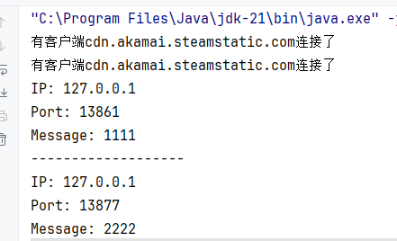

### BS架构的TCP通信

`BS`架构，也就是常见的`浏览器-服务器`架构，最常见的通信协议是就是基于`TCP`协议的`HTTP`协议。因此，只要我们在服务端将响应包装为`HTTP`协议格式，就能实现`Java`与浏览器进行通信

`Server.java`

我们将端口改为浏览器常用的`8080`端口，并封装一些`HTML`数据，使用`HTTP`协议返回给浏览器。因为`HTTP`协议是单次连接，请求结束即断开，所以需要在最后关闭输出流与`Socket`管道

```java
package com.eiousee;

import java.io.InputStream;
import java.io.OutputStream;
import java.io.PrintStream;
import java.net.*;

public class Server {
    public static void main(String[] args) throws Exception {
        // 创建服务端
        ServerSocket ss = new ServerSocket(8080);

        while(true) {
            new ServerThread(ss.accept()).start();
        }
    }
}

class ServerThread extends Thread {
    private final Socket socket;
    public ServerThread(Socket socket) {
        this.socket = socket;
    }

    @Override
    public void run() {
        try {
            OutputStream os = socket.getOutputStream();
            System.out.println("有客户端" + socket.getInetAddress().getHostName() + "连接了");

            // 使用PrintStream封装
            PrintStream ps = new PrintStream(os);
            // 封装HTTP响应报文
            ps.println("HTTP/1.1 200 OK");
            ps.println("Content-Type: text/html;charset=utf-8");
            ps.println();
            // 封装HTML内容
            ps.println("<html>");
            ps.println("<head><title>Hello</title></head>");
            ps.println("<body>");
            ps.println("<h1>Hello World</h1>");
            ps.println("</body>");
            ps.println("</html>");

            // 关闭输出流与管道
            ps.close();
            socket.close();
        } catch (Exception e) {
            System.out.println(socket.getInetAddress().getHostName() + "断开了连接");
        }
    }
}
```

> 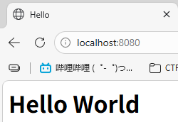

### 综合练习-网络聊天室

**需求**

编写一个网络聊天室程序，要求可以让局域网内的用户进行自由聊天

**具体功能如下**

1. 用户友好型设计，使用`GUI`编程
2. 用户可以自定义自己的用户名，聊天室中不允许出现同样的用户名
3. 可以看到在线用户列表，用户下线也需要同步在列表中删除该用户
4. 用户的发言应有明显的标注信息，如用户名、时间等

#### 实现

1. 首先进行`GUI`开发，创建需要的登陆页面和聊天室页面，并添加相应的监听与`API`备用

`LoginFrame.java`

```java
package com.eiousee;

import javax.swing.*;
import java.awt.*;
import java.io.DataInputStream;
import java.io.DataOutputStream;
import java.io.IOException;
import java.net.Socket;

public class LoginFrame extends JFrame {

    private JTextField usernameField;
    private JButton loginButton;
    private JButton exitButton;
    private DataOutputStream dos;
    private DataInputStream dis;

    public LoginFrame() {
        // 1. 窗口基本设置
        setTitle("用户登录");
        setSize(300, 130); // 高度稍微调小一点以适应单行输入
        setDefaultCloseOperation(JFrame.EXIT_ON_CLOSE);
        setLocationRelativeTo(null); // 居中显示

        // 2. 初始化组件
        usernameField = new JTextField(15); // 设置列数为15，控制宽度
        loginButton = new JButton("登录");
        exitButton = new JButton("退出");

        // 3. 布局设计
        
        // --- 顶部面板：放置用户名输入 ---
        // 使用 BorderLayout 可以让 TextField 高度自动适应文字高度
        JPanel topPanel = new JPanel(new BorderLayout(10, 0)); 
        topPanel.setBorder(BorderFactory.createEmptyBorder(10, 10, 5, 10)); // 添加外边距
        topPanel.add(new JLabel("用户名:"), BorderLayout.WEST); // 标签靠左
        topPanel.add(usernameField, BorderLayout.CENTER);     // 输入框填满剩余空间

        // --- 底部面板：放置按钮 ---
        // FlowLayout 默认就是居中对齐的
        JPanel bottomPanel = new JPanel(); 
        bottomPanel.setBorder(BorderFactory.createEmptyBorder(0, 10, 10, 10)); // 底部留白
        bottomPanel.add(loginButton);
        bottomPanel.add(exitButton);

        // 4. 将面板添加到主窗口
        add(topPanel, BorderLayout.CENTER); // 输入区域在中间
        add(bottomPanel, BorderLayout.SOUTH); // 按钮区域在底部

        // 5. 事件监听

        exitButton.addActionListener(e -> System.exit(0));
    }
}
```

`ChatInterface.java`

```java
package com.eiousee;

import javax.swing.*;
import javax.swing.border.EmptyBorder;
import java.awt.*;
import java.io.DataOutputStream;
import java.net.Socket;
import java.time.LocalDateTime;
import java.time.format.DateTimeFormatter;

public class ChatInterface extends JFrame {

    private JTextArea messageArea;      // 聊天记录显示区
    private JTextArea inputField;       // 消息输入框
    private JButton sendButton;
    private JList<String> userList;     // 成员列表
    private DefaultListModel<String> userListModel;
    private Socket socket;
    private String username;

    public ChatInterface() {
        setSize(800, 600);
        setDefaultCloseOperation(JFrame.EXIT_ON_CLOSE);
        setLocationRelativeTo(null);
        initComponents();
        setupListeners();
    }

    private void initComponents() {
        messageArea = new JTextArea();
        messageArea.setEditable(false); 
        messageArea.setFont(new Font("微软雅黑", Font.PLAIN, 14));
        messageArea.setMargin(new Insets(5, 5, 5, 5));
        JScrollPane messageScrollPane = new JScrollPane(messageArea);

        inputField = new JTextArea();
        inputField.setFont(new Font("微软雅黑", Font.PLAIN, 14));
        inputField.setLineWrap(true); 
        JScrollPane inputScrollPane = new JScrollPane(inputField);

        sendButton = new JButton("发送");
        sendButton.setPreferredSize(new Dimension(80, 30));

        JPanel inputPanel = new JPanel(new BorderLayout());
        inputPanel.add(inputScrollPane, BorderLayout.CENTER);
        inputPanel.add(sendButton, BorderLayout.EAST);

        userListModel = new DefaultListModel<>();
        userList = new JList<>(userListModel);
        userList.setFont(new Font("微软雅黑", Font.PLAIN, 14));
        userList.setSelectionMode(ListSelectionModel.SINGLE_SELECTION);
        JScrollPane userListScrollPane = new JScrollPane(userList);
        userListScrollPane.setBorder(BorderFactory.createTitledBorder("在线成员"));

        JPanel leftPanel = new JPanel(new BorderLayout());
        leftPanel.add(messageScrollPane, BorderLayout.CENTER);
        leftPanel.add(inputPanel, BorderLayout.SOUTH);

        JPanel rightPanel = new JPanel(new BorderLayout());
        rightPanel.setPreferredSize(new Dimension(150, 0)); 
        rightPanel.add(userListScrollPane, BorderLayout.CENTER);

        JPanel mainPanel = new JPanel(new BorderLayout());
        mainPanel.setBorder(new EmptyBorder(5, 5, 5, 5));
        mainPanel.add(leftPanel, BorderLayout.CENTER);
        mainPanel.add(rightPanel, BorderLayout.EAST);

        add(mainPanel);
    }

    private void setupListeners() {
        sendButton.addActionListener(e -> {
            String text = inputField.getText().trim();
            if (!text.isEmpty()) {
                onSendMessage(text);
                inputField.setText("");
            }
        });

        userList.addListSelectionListener(e -> {
            if (!e.getValueIsAdjusting()) {
                String selectedUser = userList.getSelectedValue();
                if (selectedUser != null) {
                    onUserSelected(selectedUser);
                }
            }
        });
    }

}
```

2. 创建服务端程序

在服务端中，我们需要根据指定的端口开启`Socket`服务端通道，然后通过多线程技术，为每个连接请求分配一个独立的线程进行执行

`Server.java`

```java
package com.eiousee;

import java.net.ServerSocket;
import java.net.Socket;
import java.util.Map;
import java.util.concurrent.ConcurrentHashMap;

public class Server {

    public static void main(String[] args) throws Exception {
        ServerSocket serverSocket = new ServerSocket(Config.SERVER_PORT);

        while(true) {
            Socket socket = serverSocket.accept();
            System.out.println("用户" + socket.getInetAddress().getHostAddress() + "已连接");
            new ServerThread(socket).start();
        }
    }
}

```

3. 创建服务端线程

在服务端线程中，主要负责业务逻辑的实现，即收到用户请求后，返回正确的服务端响应。因此我们需要自定义一个简单的网络协议，用于区分不同的用户请求，比如先发送一个数字代表操作类型，`0`表示用户登录请求，需要服务器检查用户名并返回检查结果，`1`表示群聊消息请求，需要服务器转发到其他线程中。

`ServerThread.java`

```java
package com.eiousee;

import java.io.DataInputStream;
import java.io.DataOutputStream;
import java.net.Socket;
import java.util.Map;
import java.util.Queue;

public class ServerThread extends Thread{
    private Socket socket;
    private DataInputStream dis;
    private DataOutputStream dos;
    private String username;

    public ServerThread(Socket socket) {
        this.socket = socket;
    }

    @Override
    public void run() {
        try {
            dis = new DataInputStream(socket.getInputStream());
            dos = new DataOutputStream(socket.getOutputStream());

            while(true) {
                int type = dis.readInt();
                switch (type) {
                    // 用户名检查
                    case 0:
                        
                        break;
                    // 接收群聊消息
                    case 1:
                       
                        break;
                }
            }
        } catch (Exception e) {
            if (username != null) {
                System.out.println("用户" + username + "已下线");
            }
        }
    }
}

```

4. 实现登录逻辑

根据用户思维，假设我们打开了程序，输入用户名，点击了登录，下一步就是客户端向服务端发送连接请求，然后发送一个数字`0`表示登录请求

`LoginFrame.java`

因此我们补充登录页面中的事件监听器，向服务端发送`Socket`连接请求，然后再发送一个数字`0`表示登录请求，然后发送用户名，接着接收服务器响应。这里我们再自定义一个协议，当客户端发送登录请求后，接收一个服务端发来的数字，`1`表示用户名已存在，禁止登录，`0`表示用户名可用

```java
// 5. 事件监听
loginButton.addActionListener(e -> {
    String username = usernameField.getText().trim();
    if (username.isEmpty() || username.length() > 20 || username.contains(" ")) {
        JOptionPane.showMessageDialog(this, "非法用户名", "提示", JOptionPane.WARNING_MESSAGE);
    } else {
        try {
            // 建立与服务器的连接
            Socket socket = new Socket(Config.SERVER_IP, Config.SERVER_PORT);
            // 用户名验证
            dos = new DataOutputStream(socket.getOutputStream());
            dis = new DataInputStream(socket.getInputStream());
            dos.writeInt(0);
            dos.writeUTF(username);
            dos.flush();

            int result = dis.readInt();
            if (result == 1) {
                JOptionPane.showMessageDialog(this, "用户名已存在", "提示", JOptionPane.WARNING_MESSAGE);
            }
            else if (result == 0){
                // 登录成功，进入聊天界面
                ChatInterface chatInterface = new ChatInterface(socket, username);
                chatInterface.setVisible(true);
                this.dispose(); // 关闭当前窗口
            } else {
                JOptionPane.showMessageDialog(this, "未知错误", "提示", JOptionPane.WARNING_MESSAGE);
            }

        } catch (Exception ex) {
            JOptionPane.showMessageDialog(this, "服务器连接失败", "提示", JOptionPane.WARNING_MESSAGE);
        }
    }
});
```

`ServerThread.java`

现在客户端已经给我们发来了数字`0`登录请求，因此我们需要完善用户名检查的验证逻辑，并向客户端返回正确的验证结果信息。首先我们应该接收用户名，然后判断用户名是否存在。而这里就需要一个容器来存储用户名，我们暂且先使用`Queue`队列，每次检查，我们判断队列中是否存在这个用户名，如果不存在，则加入队列，并返回数字`0`，允许用户登录，如果队列中已经存在该用户名，则返回数字`1`，禁止用户登录

```java
package com.eiousee;

import java.io.DataInputStream;
import java.io.DataOutputStream;
import java.net.Socket;
import java.util.Map;
import java.util.Queue;

public class ServerThread extends Thread{
    private Socket socket;
    private DataInputStream dis;
    private DataOutputStream dos;
    private String username;
    private Queue<String> userList;

    public ServerThread1(Socket socket) {
        this.socket = socket;
    }

    @Override
    public void run() {
        try {
            dis = new DataInputStream(socket.getInputStream());
            dos = new DataOutputStream(socket.getOutputStream());

            while(true) {
                int type = dis.readInt();
                switch (type) {
                    // 用户名检查
                    case 0:
                        String username = dis.readUTF();
                        isUsernameExist(username);
                        break;
                    // 接收群聊消息
                    case 1:

                        break;
                }
            }
        } catch (Exception e) {
            if (username != null) {
                System.out.println("用户" + username + "已下线");
            }
        }
    }

    private void isUsernameExist(String username) throws Exception {
        if (userList.contains(username)) {
            dos.writeInt(1);
        } else {
            dos.writeInt(0);
            this.username = username;
            userList.add(username);
            System.out.println("用户" + username + "已上线");
        }
    }
}

```

5. 实现在线人数更新逻辑

`Server.java`

登录通过后，服务端应该主动向所有客户端发送一个更新在线人数的请求，然后再发送当前的在线人数。因此在`Server.java`主程序中，还需要一个属性来存储所有的`socket`实例，为了能够区分所有的`socket`实例，并为后面可能出现的私聊功能做准备，这里我们使用`Map<socket, username>`来保存所有的`socket`，用`socket`作为键的原因是用户名可能会重复~~（虽然这里不允许）~~，但是`socket`实例一定是唯一的。

```java
package com.eiousee;

import java.net.ServerSocket;
import java.net.Socket;
import java.util.Map;
import java.util.concurrent.ConcurrentHashMap;

public class Server {
    private static Map<Socket, String> socketMap = new ConcurrentHashMap<>();

    public static void main(String[] args) throws Exception {
        ServerSocket serverSocket = new ServerSocket(Config.SERVER_PORT);

        while(true) {
            Socket socket = serverSocket.accept();
            System.out.println("用户" + socket.getInetAddress().getHostAddress() + "已连接");
            new ServerThread(socket, socketMap).start();
        }
    }
}
```

`ServerThread.java`

在`Server.java`中创建`socketMap`后，也要同步更新到所有线程实例中，这样才能让所有线程都有将数据转发到所有`socket`的能力。然后是完善在线人数更新的逻辑，在登录完成后，然后遍历`socketMap`的键，也就是所有的`socket`实例，发送数字`1`，表示服务端发送的更新在线人数请求，然后再发送需要接收的在线人数的个数，最后遍历`socketMap`的值，将所有的在线用户的用户名发送到客户端。同时，如果有用户断开`socket`连接，随即将其从`socketMap`中删除，并再次更新在线人数

```java
package com.eiousee;

import java.io.DataInputStream;
import java.io.DataOutputStream;
import java.net.Socket;
import java.util.Map;
import java.util.Queue;

public class ServerThread extends Thread{
    private Socket socket;
    private DataInputStream dis;
    private DataOutputStream dos;
    private String username;
    private Map<Socket, String> socketMap;

    public ServerThread(Socket socket, Map<Socket, String> socketMap) {
        this.socket = socket;
        this.socketMap = socketMap;
    }

    @Override
    public void run() {
        try {
            dis = new DataInputStream(socket.getInputStream());
            dos = new DataOutputStream(socket.getOutputStream());

            while(true) {
                int type = dis.readInt();
                switch (type) {
                    // 用户名检查
                    case 0:
                        String username = dis.readUTF();
                        isUsernameExist(username);
                        break;
                    // 接收群聊消息
                    case 1:
                        break;
                }
            }
        } catch (Exception e) {
            socketMap.remove(socket);
            if (username != null) {
                System.out.println("用户" + username + "已下线");
                try {
                    getAllOnlineUsers();
                } catch (Exception ex) {
                    ex.printStackTrace();
                }
            }
        }
    }

    private void isUsernameExist(String username) throws Exception {
        if (socketMap.containsValue(username)) {
            dos.writeInt(1);
        } else {
            dos.writeInt(0);
            this.username = username;
            System.out.println("用户" + username + "已上线");
            socketMap.put(socket, username);
            getAllOnlineUsers();
        }
    }

    private void getAllOnlineUsers() throws Exception {
        for (Socket socket : socketMap.keySet()) {
            DataOutputStream dos = new DataOutputStream(socket.getOutputStream());
            dos.writeInt(1);
            dos.writeInt(socketMap.size());
            for (String username : socketMap.values()) {
                dos.writeUTF(username);
            }
            dos.flush();
        }
    }
}
```

`ChatInterface.java`

客户端需要同时拥有收发功能，因此在创建`Frame`时，也必须将`socket`实例一并传递给聊天窗口实例。这里我们不考虑`MVC`，也不考虑`IOC`和`DI`

```java
private Socket socket;
private String username;

public ChatInterface(Socket socket, String username) {
    this();
    this.socket = socket;
    this.username = username;
    this.setTitle(username + " - 聊天室");
}
```

`ClientReaderThread.java`

如果客户端需要随时能够接收来自服务端的数据，就需要写一个死循环，通过`readInt`来监听请求代码

```java
public ChatInterface(Socket socket, String username) {
    this();
    this.socket = socket;
    this.username = username;
    this.setTitle(username + " - 聊天室");

    while(true) {
        try {
            DataInputStream dis = new DataInputStream(socket.getInputStream());
            System.out.println("等待服务器请求");
            int type = dis.readInt();
            System.out.println("请求类型：" + type);
            switch (type) {
                case 1:
                    System.out.println("收到用户列表更新");
                    int count = dis.readInt();
                    System.out.println("用户数量：" + count);
                    String[] users = new String[count];
                    for (int i = 0; i < count; i++) {
                        users[i] = dis.readUTF();
                        System.out.println("用户：" + users[i]);
                    }
                    setUserList(users);
                    break;
                case 2:
                    break;
            }
        } catch (Exception e) {
            e.printStackTrace();
        }
    }
}

protected void setUserList(String[] users) {
    userList.setListData(users);
```

但这里又有一个问题，如果程序开始循环监听服务端的数据，那么其他的代码就无法正常运行，如上的代码中，在用户点击登陆后，客户端的控制台结果如下

> 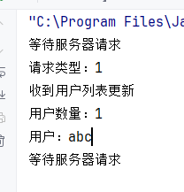

在正确接收服务端请求后，客户端会立即再次尝试接收，甚至连聊天界面都无法创建

> 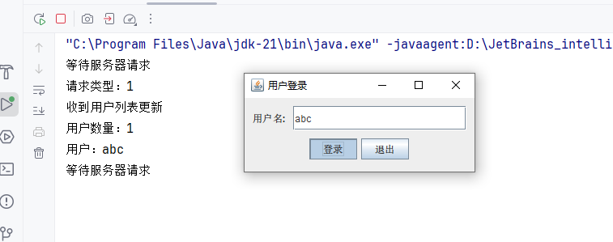

`ClientReaderThread.java`

因此，客户端接收数据的工作不能靠主线程来完成，而是需要额外创建一个专门用于接收服务端请求的线程。在这个线程中，随时监听服务端请求，并根据请求号的不同执行不用的数据处理流程，同时，子线程也需要持有用户界面`chatInterface`的实例，让`chatInterface`随时能够更新用户界面

```java
package com.eiousee;

import java.io.DataInputStream;
import java.io.DataOutputStream;
import java.io.IOException;
import java.net.Socket;
import java.util.Queue;

public class ClientReaderThread extends Thread{
    private final ChatInterface chatInterface;
    private final Socket socket;
    private final String username;
    private DataInputStream dis;
    private DataOutputStream dos;

    public ClientReaderThread(Socket socket, String username, ChatInterface chatInterface) {
        this.socket = socket;
        this.username = username;
        this.chatInterface = chatInterface;
    }

    @Override
    public void run() {
        try {
            dis = new DataInputStream(socket.getInputStream());
            dos = new DataOutputStream(socket.getOutputStream());

            while (true) {
                int type = dis.readInt();
                switch (type) {
                    // 用户列表更新
                    case 1:
                        System.out.println("收到用户列表更新");
                        updateUserList();
                        break;
                    // 群聊消息
                    case 2:
                        break;
                }
            }
        } catch (Exception e) {
            e.printStackTrace();
        }
    }

    private void updateUserList() {
        try {
            System.out.println("开始更新用户列表");
            int count = dis.readInt();
            System.out.println("用户数量：" + count);
            String[] users = new String[count];
            for (int i = 0; i < count; i++) {
                users[i] = dis.readUTF();
            }
            chatInterface.setUserList(users);
        } catch (Exception e) {
            e.printStackTrace();
        }
    }
}
```

6. 实现群聊逻辑

现在用户已经登录了系统，并且正确更新了在线人数，于是在输入框输入了想要发送的聊天数据，并点击了发送按钮

`ChatInterface.java`

我们为`ChatInterface`中的按钮绑定事件

```java
private void setupListeners() {
    sendButton.addActionListener(e -> {
        String text = inputField.getText().trim();
        if (!text.isEmpty()) {
            onSendMessage(text);
            inputField.setText("");
        }
    });
}
```

然后实现发送逻辑，通过当前`socket`向服务端发送群聊请求，请求号`1`，后面紧跟聊天数据

```java
protected void onSendMessage(String message) {
    try {
        DataOutputStream dos = new DataOutputStream(socket.getOutputStream());
        dos.writeInt(1);

        LocalDateTime now = LocalDateTime.now();
        DateTimeFormatter formatter = DateTimeFormatter.ofPattern("yyyy-MM-dd   HH:mm:ss");
        String content = username + "   " + now.format(formatter) + "\r\n     " + message + "\r\n\n";
        System.out.println(username + "发送了一条群聊消息");
        dos.writeUTF(content);
        dos.flush();
    } catch (Exception e) {
        e.printStackTrace();
    }
}
```

`ServerThread.java`

现在客户端发来了群聊请求，需要服务端转发到其他`socket`中，服务端首先接收请求号`1`，表示群聊消息转发请求，然后遍历当前所有的`socket`实例，用每个`socket`实例向客户端发送请求号`2`，再发送聊天内容

```java
@Override
public void run() {
    try {
        dis = new DataInputStream(socket.getInputStream());
        dos = new DataOutputStream(socket.getOutputStream());

        while(true) {
            int type = dis.readInt();
            switch (type) {
                // 用户名检查
                case 0:
                    String username = dis.readUTF();
                    isUsernameExist(username);
                    break;
                // 接收群聊消息
                case 1:
                    String message = dis.readUTF();
                    System.out.println("收到群聊消息：" + message);
                    sendMessageToAll(message);
                    break;
            }
        }
    } catch (Exception e) {
        socketMap.remove(socket);
        if (username != null) {
            System.out.println("用户" + username + "已下线");
            try {
                getAllOnlineUsers();
            } catch (Exception ex) {
                ex.printStackTrace();
            }
        }
    }
}

private void sendMessageToAll(String message) throws Exception {
    for (Socket socket : socketMap.keySet()) {
        DataOutputStream dos = new DataOutputStream(socket.getOutputStream());
        dos.writeInt(2);
        dos.writeUTF(message);
        dos.flush();
    }
}
```

`ClientReaderThread.java`

现在服务端完成了转发，客户端随即接收请求号，并接收聊天内容，调用`ChatInterface`实例，将聊天内容添加到用户界面上

```java
package com.eiousee;

import java.io.DataInputStream;
import java.io.DataOutputStream;
import java.io.IOException;
import java.net.Socket;
import java.util.Queue;

public class ClientReaderThread extends Thread{
    private final ChatInterface chatInterface;
    private final Socket socket;
    private final String username;
    private DataInputStream dis;
    private DataOutputStream dos;

    public ClientReaderThread(Socket socket, String username, ChatInterface chatInterface) {
        this.socket = socket;
        this.username = username;
        this.chatInterface = chatInterface;
    }

    @Override
    public void run() {
        try {
            dis = new DataInputStream(socket.getInputStream());
            dos = new DataOutputStream(socket.getOutputStream());

            while (true) {
                int type = dis.readInt();
                switch (type) {
                    // 用户列表更新
                    case 1:
                        System.out.println("收到用户列表更新");
                        updateUserList();
                        break;
                    // 群聊消息
                    case 2:
                        System.out.println("收到群聊消息");
                        updateMessageQueue();
                        break;
                }
            }
        } catch (Exception e) {
            e.printStackTrace();
        }
    }

    private void updateMessageQueue() {
        try {
            System.out.println("开始更新消息队列");
            String message = dis.readUTF();
            chatInterface.appendMessage(message);
        } catch (Exception e) {
            e.printStackTrace();
        }
    }
}
```

`ChatInterface.java`

在用户界面中，将所有聊天记录添加到`messageArea`中

```java
public void appendMessage(String message) {
    messageArea.append(message);
}
```

> 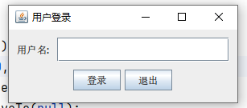

> 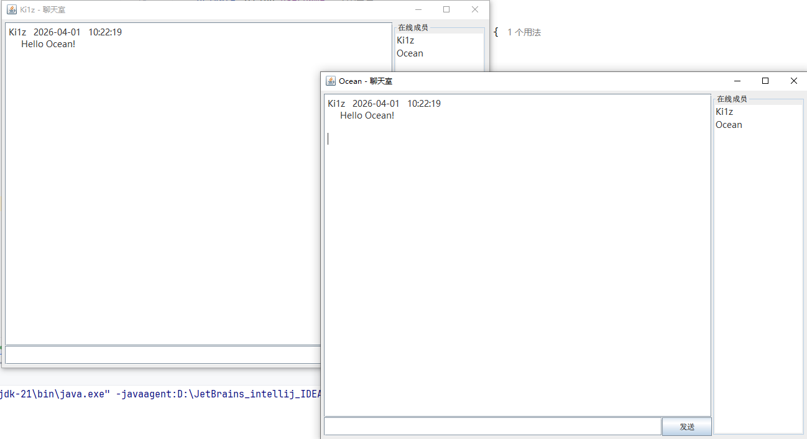

> 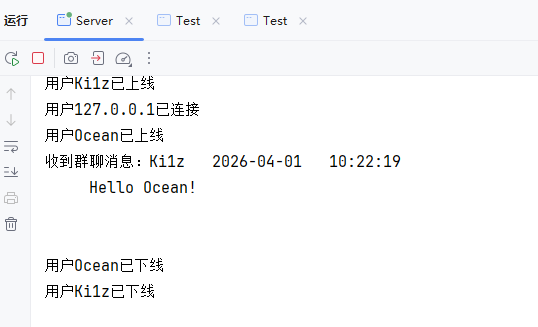
