# Java Advance

`更新时间：2026-3-19`

注释解释：

- `<>`必填项，必须在当前位置填写相应数据

- `{}`必选项，必须在当前位置选择一个给出的选项

- `[]`可选项，可以选择填写或忽略

*注：该笔记内的可选项和参数均不完整，如有需要，请查询相关手册*

---

## 异常

Java中的异常分为编译时异常和运行时异常两种，对于编译时异常，一般的IDE会直接使用醒目标识报错，而运行时异常是需要程序运行后才会触发的异常

### RuntimeException

RuntimeException是Java中所有运行时异常的父类，所有的运行时异常都需要继承该类

### 常见的运行时异常

- NullPointerException 空指针异常

使用引用数据类型的变量时，如果变量内没有存储任何数据，即等于null时，调用该变量的方法容易导致空指针异常

```java
public class Test {
    public static void main(String[] args) {
        // 常见的运行时异常
        // 空指针异常
        String str = null;
        System.out.println(str.length());
    }
}
```

> 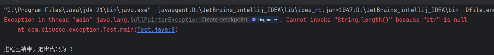

- IndexOutOfBoundsException 下标越界异常

为数组赋值时，如果忘记了数组的长度，或者认为数组的首下标为1，就容易导致下表越界异常

```java
public class Test {
    public static void main(String[] args) {
        // 常见的运行时异常
        // 数组越界
        int[] arr = new int[5];
        arr[5] = 1;
    }
}
```

> 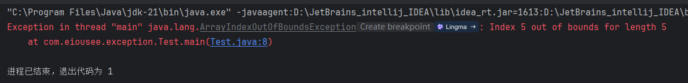

*注：这里的ArrayIndexOutOfBoundsException继承自IndexOutOfBoundsException*

- 数值异常

在计算除法时，除数可能为0，导致数值异常

```java
public class Test {
    public static void main(String[] args) {
        // 常见的运行时异常
        // 除数为0
        int a = 10;
        int b = 0;
        System.out.println(a / b);
    }
}
```

> 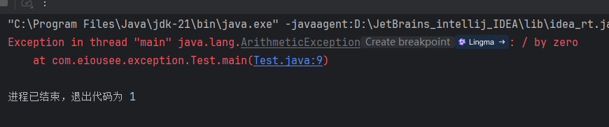

### 异常的作用

对于Java的异常来说，通过使用异常处理，开发者可以编写更加健壮、易于维护的代码。同时，异常可以用来定位程序出错的关键信息，也可以作为方法内部的一种特殊返回值，告知上层调用者方法的执行情况

- 普通异常处理

```java
public class Test {
    public static void main(String[] args) {
        int a = 10;
        int b = 0;
        System.out.println(div(10, 0));
    }
    
    public static double div(int dividend, int divisor) {
        if (divisor == 0) {
            System.out.println("除数不能为0");
            return -1;
        }
        return (double) dividend / divisor;
    }
}
```

在上面的程序中，考虑到除数可能为0，因此在`div()`中使用了一个`if`来判断除数是否为0，如果为0则返回-1。但是，如果遇到商本来就为-1，或者用户把-1当作正确结果时，这种处理方法就不再适用

- throw处理

```java
public class Test {
    public static void main(String[] args) {
        int a = 10;
        int b = 0;
        try {
        	System.out.println(div(10, 0));
        } catch (Exception e) {
            e.printStackTrace();
        }
    }
    
    public static double div(int dividend, int divisor) throws RuntimeException{
        if (divisor == 0) {
            throw new RuntimeException("除数不能为0");
        }
        return (double) dividend / divisor;
    }
}
```

在改进的程序中，将返回-1改为了使用`throw`关键字抛出一个`RuntimeException`异常，主函数捕获这个异常，然后输出该异常的信息

### 自定义异常

Java无法为世界上的所有问题提供异常类来代表，如果程序员遇到了某种该类问题，就可以使用自定义异常

根据继承父类的不同，自定义异常可以分为自定义运行时异常和自定义编译时异常

#### 自定义编译时异常

- CustomCompiletimeException类

```java
public class CustomCompiletimeException {
    public static void main(String[] args) {
        // 假设编写一个保存年龄的程序，首先需要判断年龄是否合法
        saveAge(10);
    }

    private static void saveAge(int age) throws AgeIllegalException{
        if (age <= 0) {
            throw new AgeIllegalException("年龄不合法");
        }
        System.out.println("保存成功！");
    }
}
```

- AgeIllegalException异常类

```java
public class AgeIllegalException extends Exception {

    public AgeIllegalException() {}

    public AgeIllegalException(String string) {
        super(string);
    }
}
```

> 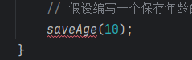

*对于编译时异常，必须向上抛出或者进行异常捕获*

#### 自定义运行时异常

- CustomRuntimeException

```java
public class CustomRuntimeException {
    public static void main(String[] args) {
        // 假设编写一个保存年龄的程序，首先需要判断年龄是否合法
        saveAge(0);
    }

    private static void saveAge(int age) {
        if (age <= 0) {
            throw new AgeIllegalRuntimeException("年龄不合法");
        }
        System.out.println("保存成功！");
    }
}
```

- AgeIllegalRuntimeException

```java
public class AgeIllegalRuntimeException extends RuntimeException {

    public AgeIllegalRuntimeException() {}

    public AgeIllegalRuntimeException(String string) {
        super(string);
    }
}
```

> 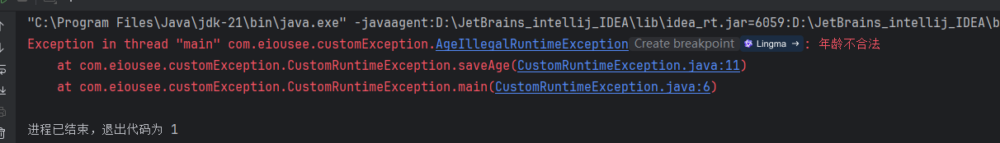

*运行时异常不需要抛出，但并不代表没有抛出，所有的方法默认都会抛出一个`RuntimeException`*

### 异常处理

目前常见的异常处理方案有两种，一种是将异常层层向上抛，用户层捕获异常，响应适合用户的内容；第二种是最外层捕获异常后，尝试修复该异常

- 响应合适内容

```java
public class ResponseSuitableContent {
    public static void main(String[] args) {
        try {
            System.out.println(calc(2, 0));
        } catch (ArithmeticException e) {
            System.out.println("除数不能为0");
        }
    }

    public static double calc(double a, double b) throws ArithmeticException{
        return Math.pow(a, div(a, b));
    }

    public static double div(double a, double b) throws ArithmeticException{
        if (b == 0) {
            throw new ArithmeticException();
        }
        return a / b;
    }
}
```

> 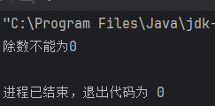

- 尝试修复

```java
import java.util.Scanner;

public class TryToFix {
    public static void main(String[] args) {
        while (true) {
            try {
                int num = getUserInput();
                break;
            } catch (Exception e) {
                System.out.println("输入有误，请重新输入");
            }
        }
        System.out.println("输入正确");
    }

    public static int getUserInput() {
        Scanner scanner = new Scanner(System.in);
        System.out.println("请输入一个整数：");

        return scanner.nextInt();
    }
}
```

> 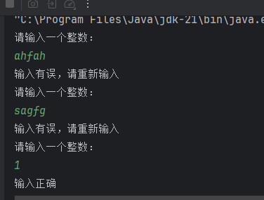

## 泛型

泛型是指，在定义类、接口、方法时，同时声明了一个或多个类型变量。泛型提供了在编译阶段约束所能操作的数据类型，并自动进行检查的能力，这样可以避免强制类型转换，以及可能出现的异常和数据丢失

### 泛型类

**基本语法**

```java
[accessibility] class className<typeVariable, typeVariable, ...> {
    classBody;
}
```

*一般的类型变量用`E`，`T`，`K`，`V`代替，其分别表示元素`element`，返回值`returned value`，键`Key`，值`value`*

自定义泛型类可以让程序员自定义一个需要约束的容器，类似于`ArrayList`，以便更好地管理数据

```java
public class CustomArrayList<E> {
    public boolean add(E e) {
        // 添加操作
    }
    
    public E get() {
        // 获取操作
    }
}
```


### 泛型接口

**基本语法**

```java
[accessibility] interface interfaceName<typeVariable, TypeVariable, ...> {
    interfaceBody;
}
```

在设计接口时，如果该接口内部的方法需要接收一个对象，但是该对象的数据类型可能有多种，则可以使用泛型接口

```java
public interface InfoManager<E> {
    void add(E e);
    
    void delete(E e);
    
    void update(E e);
    
    E query(int id);
}
```

在实现接口时，指定泛型的数据类型，就可以为实现类指定约束类型

```java
public class StuManager implements InfoManager<Student> {
    // 方法重写...
}
```

### 泛型方法

**基本语法**

```java
[accessibility] [modifier] <typeVariable, typeVariable, ...> returnedValueType methodName(argumentType argument) {
    methodBody;
}
```

如果一个方法需要接收多个数据类型的参数，在以往的写法中，只能使用多态或者方法重载

- 多态

```java
public class Test {
    public static void main(String[] args) {
        int[] intArray = {1, 2, 3, 4};
        printArray(intArray);

        String[] stringArray = {"Hello", "World"};
        printArray(stringArray);
    }
    
    public static void printArray(Object array) {
        if (array instanceof int[] intArray) {
            for (int i : intArray) {
                System.out.println(i);
            }
        } else if (array instanceof String[] stringArray) {
            for (String s : stringArray) {
                System.out.println(s);
            }
        }
    }
}
```

- 方法重载

```java
public class Test {
    public static void main(String[] args) {
        int[] intArray = {1, 2, 3, 4};
        printArray(intArray);

        String[] stringArray = {"Hello", "World"};
        printArray(stringArray);
    }
    
    public static void printArray(int[] intArray) {
        for (int i : intArray) {
            System.out.println(i);
        }
    }

    public static void printArray(String[] stringArray) {
        for (String s : stringArray) {
            System.out.println(s);
        }
    }
}
```

在泛型方法中，我们可以直接对方法指定一个泛型变量，用来接收不同数据类型的数据

```java
public class Test {
    public static void main(String[] args) {
        Integer[] intArray = {1, 2, 3, 4};
        printArray(intArray);

        String[] stringArray = {"Hello", "World"};
        printArray(stringArray);
    }
    
    public static <E> void printArray(E[] inputArray) {
        for (E element : inputArray) {
            System.out.println(element);
        }
    }
}
```

*注：泛型方法无法约束基本数据类型，如上面的例子中，必须将`int`转换为`Integer`*

### 通配符与上下限

在泛型数据类型变量中，如果需要指定未知个数的数据类型，可以使用`?`通配符来代表所有数据类型。但是，如果`?`能代表所有的数据类型，那么所有使用通配符的方法都有可能接收到预期之外的数据类型，造成程序异常，因此可以使用`super`和`extends`来指定通配符的上下限

**基本语法**

```java
// 假设一个赛车的方法，需要接收赛车集合对象
public static void run(ArrayList<? {extends Car | super Car}> car) {
    // 方法体
}
```

- `super` ：指定通配符的上限，即接收的数据类型必须是指定类型或其父类
- `extends` ：指定通配符的下限，接收的数据类型必须是指定类型或其子类

### 包装类

泛型不支持基本数据类型，只支持引用数据类型

**泛型擦除**

泛型工作在编译阶段，编译完成之后，泛型会被自动擦除，所有类型会自动恢复成`Object`，如果此时调用基本数据类型集合中的某个元素的方法，那么`Object`就会指向一个基本数据类型的数据，因此泛型不支持基本数据类型

**包装类**

为了解决这个问题，Java设计了包装类，将基本数据类型包装为引用数据类型

| 基本数据类型 | 包装类    |
| :----------- | :-------- |
| byte         | Byte      |
| short        | Short     |
| int          | Integer   |
| long         | Long      |
| char         | Character |
| float        | Float     |
| double       | Double    |
| boolean      | Boolean   |

## 集合体系结构

### Collection集合

#### 特点

**List系列集合**

- `ArrayList` ：有序、可重复、有索引
- `LinkedList` ：有序、可重复、有索引

**Set系列集合**

- `HashSet` ：无序、不重复、无索引
- `LinkedHashSet` ：有序、不重复、无索引
- `TreeSet` ：按照大小默认升序排列、不重复、无索引

#### 常用API

| API                                 | 说明                             |
| ----------------------------------- | -------------------------------- |
| public boolean add(E e)             | 把给定的对象添加到当前集合中     |
| public void clear()                 | 清空集合中的所有元素             |
| public boolean remove(E e)          | 把给定的对象在当前集合中移除     |
| public boolean contains(Object obj) | 判断当前集合中是否包含给定的对象 |
| public boolean isEmpty()            | 判断当前集合是否为空             |
| public int size()                   | 返回集合中元素的个数             |
| public Object[] toArray()           | 把集合中的元素存储到数组中       |

*注：`toArray()`*方法返回的是一个Object数组，如果需要转换为指定数据类型，需要在方法中添加参数

```java
import java.util.ArrayList;

public class Test {
    public static void main(String[] args) {
        ArrayList<String> list = new ArrayList<>();
        list.add("Tom");
        list.add("Jim");
        list.add("John");
        list.add("Lucy");

        // 转换为String数组
        String[] strs = list.toArray(String[]::new);
        for (String str : strs) {
            System.out.println(str);
        }
    }
}
```

#### 迭代器

迭代器是专门用来遍历集合的专用方式，在Java中迭代器的代表是`iterator`

在Java中，可以通过Collection集合的`iterator()`方法来获取一个该集合的迭代器，然后调用该迭代器对数组进行操作

**迭代器中的常用API**

| API               | 说明                                                      |
| ----------------- | --------------------------------------------------------- |
| boolean hasNext() | 询问当前位置是否有元素存在，存在返回true，不存在返回false |
| E next()          | 获取当前位置的元素，同时将迭代器对象指向下一个元素        |

#### 增强for(foreach)

**基本语法**

```java
for (dataType variableName : {arrayName | CollectionName}) {
    for body;
}
```

增强for可以看作迭代器遍历的简化版

#### Lambda表达式遍历

在JDK8之后，新增了Lambda表达式遍历集合的方式

**基本语法**

```java
CollectionName.forEach(s -> {
    methodBody;
});
```

如果方法体只有一行，还可以继续简化为方法引用

```java
CollectionName.forEach({Object | Class}::method);
```

#### 并发修改异常 ConcurrentModificationException

在遍历集合的同时又进行增删集合元素的行为时可能出现业务异常，这种现象被称为并发修改异常

**示例**

删除集合中特定元素

```java
import java.util.ArrayList;
import java.util.Iterator;

public class CME {
    public static void main(String[] args) {
        ArrayList<String> list = new ArrayList<>();
        list.add("微星显卡");
        list.add("惠普鼠标");
        list.add("微星主板");
        list.add("雷蛇键盘");
        list.add("微星耳机");
        list.add("华硕显示器");

        // 删除所有包含“微星”的元素
        list.forEach(s -> {
            if (s.contains("微星")) {
                list.remove(s);
            }
        });
        System.out.println(list);
    }
}
```

> 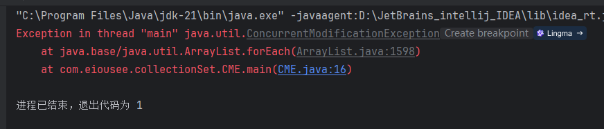

**原因**

在进行遍历操作时，删除了当前元素，后面的元素会自动向前填充，而指针的位置不变，也就意味着被删除元素的后面一个元素一定会被跳过

**解决方法**

1. 调用迭代器的`remove()`方法

```java
import java.util.ArrayList;
import java.util.Iterator;

public class CME {
    public static void main(String[] args) {
        ArrayList<String> list = new ArrayList<>();
        list.add("微星显卡");
        list.add("惠普鼠标");
        list.add("微星主板");
        list.add("雷蛇键盘");
        list.add("微星耳机");
        list.add("华硕显示器");

        // 删除所有包含“微星”的元素
        Iterator<String> iterator = list.iterator();
        while (iterator.hasNext()) {
            String item = iterator.next();
            if (item.contains("微星")) {
                iterator.remove();
            }
        }
        System.out.println(list);
    }
}
```

2. 调用Collection集合的`removeIf()`方法

```java
import java.util.ArrayList;
import java.util.Iterator;

public class CME {
    public static void main(String[] args) {
        ArrayList<String> list = new ArrayList<>();
        list.add("微星显卡");
        list.add("惠普鼠标");
        list.add("微星主板");
        list.add("雷蛇键盘");
        list.add("微星耳机");
        list.add("华硕显示器");

        // 删除所有包含“微星”的元素
        list.removeIf(item -> item.contains("微星"));
        System.out.println(list);
    }
}
```

3. 倒序遍历

```java
import java.util.ArrayList;
import java.util.Iterator;

public class CME {
    public static void main(String[] args) {
        ArrayList<String> list = new ArrayList<>();
        list.add("微星显卡");
        list.add("惠普鼠标");
        list.add("微星主板");
        list.add("雷蛇键盘");
        list.add("微星耳机");
        list.add("华硕显示器");

        // 删除所有包含“微星”的元素
        for (int i = list.size() - 1; i >= 0; i--) {
            String item = list.get(i);
            if (item.contains("微星")) {
                list.remove(i);
            }
        }
        System.out.println(list);
    }
}
```

### List集合

#### List独有API

| API                            | 说明                                   |
| ------------------------------ | -------------------------------------- |
| void add(int index, E element) | 在此集合中的指定位置插入指定的元素     |
| E remove(int index)            | 删除指定索引处的元素，返回被删除的元素 |
| E set(int index)               | 修改索引处的元素，返回被修改的元素     |
| E get(int index)               | 返回指定索引处的元素                   |

#### LinkedList独有API

| API                       | 说明                             |
| ------------------------- | -------------------------------- |
| public void addFirst(E e) | 在列表开头插入指定的元素         |
| public void addLast(E e)  | 将指定的元素追加到此列表的末尾   |
| public E getFirst()       | 返回此列表中的第一个元素         |
| public E getLast()        | 返回此列表中的最后一个元素       |
| public E removeFirst()    | 从此列表中删除并返回第一个元素   |
| public E removeLast()     | 从此列表中删除并返回最后一个元素 |

## Stream

`Stream`流是从`jdk8`开始新增的一套`API`，位于`java.util.stream.*`，可以用于操作集合或者数组的数据；`Stream`的主要优势是大量结合了`Lambda`的语法风格来编程，功能强大，代码简洁，可读性好

**示例**

假设我们准备一个数组，里面存储了一些人名，要求过滤出所有姓张的，名字字数为3的人的人名

```java
List<String> nameList = new ArrayList<>();
nameList.add("张三");
nameList.add("李四");
nameList.add("张三丰");
nameList.add("张无忌");
nameList.add("张先万");
List<String> newNameList = new ArrayList<>();
```

- 传统过滤方式

```java
for (String name : nameList) {
    if (name.startsWith("张") && name.length() == 3) {
        newNameList.add(name);
    }
}
```

- `Stream`流方式

```java
newNameList = nameList.stream()
        .filter(name -> name.startsWith("张"))
        .filter(name -> name.length() == 3)
        .toList();
```

### Stream流的获取

- `Collection`

在`Collection`集合中，为每个集合对象提供了`.stream()`方法来获取对应的`Stream`流数据

**标准语法**

```java
Collection<E> collection;
Stream<E> stream = collection.stream()
```

- `Map`

`Map`集合并没有提供直接获取`Stream`流的`API`，但是可以将其转换为`Collection`集合，间接地获取`Stream`流

**标准语法**

```java
Map<Key, Value> map;

// 获取键流
Stream<E> keyStream = map.keySet().stream();

// 获取值流
Stream<E> valueStream = map.values().stream();

// 获取键值对流
Stream<Map.Entry<E, E>> entryStream = map.entrySet().stream();
```

- 数组

数组的`Stream`流通过`Arrays.stream()`方法或者`Stream.of()`方法来获取

```java
Array[] arr = {};

Stream<E> stream = Arrays.stream(arr);

Stream<E> stream = Stream.of(arr);
```

### 中间方法

`Stream`提供了多个中间方法，搭配不同的中间方法进行链式编程，就可以达到不同的业务目的

| API                                                          | 说明                                                         |
| ------------------------------------------------------------ | ------------------------------------------------------------ |
| `Stream<T> filter(Predicate<? super T> predicate)`           | 用于对流中的数据进行过滤，过滤参数是一个匿名函数             |
| `Stream<T> sorted()`                                         | 对流元素进行升序排序                                         |
| `Stream<T> sorted(Comparator<? super T> comparator)`         | 对流元素继续指定规则的排序，排序规则是一个匿名函数           |
| `Stream<T> limit(long maxSize)`                              | 获取从头开始，`maxSize`个数的元素                            |
| `Stream<T> skip(long n)`                                     | 跳过`n`个数的元素                                            |
| `Stream<T> distinct()`                                       | 去除流中的重复元素                                           |
| `<R> Stream<R> map(Function<? super T, ? extends R> mapper)` | 加工方法，能将原来的流数据映射为一份新数据，进行操作后再返回流 |
| `static <T> Stream<T> concat(Stream a, Stream b)`            | 将`a`与`b`流拼接起来                                         |

**示例**

```java
List<Integer> scores = new ArrayList<>();
scores.add(85);
scores.add(90);
scores.add(75);
scores.add(60);
scores.add(80);
scores.add(90);
scores.add(60);
scores.add(95);
scores.add(55);

scores.stream()
        // 去掉分数小于60的
        .filter(score -> score >= 60)
        // 将分数降序处理
        .sorted((s1, s2) -> Integer.compare(s2, s1))
        // 去重
        .distinct()
        // 获取前5名
        .limit(5)
        // 跳过前3名
        .skip(3)
        // 将每人分数加10
        .map(score -> score + 10)
        .forEach(System.out::println);
```

> 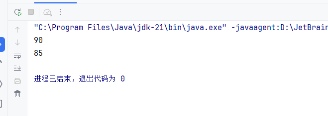

### 终结方法

在`Stream`流处理完成后，也提供了一系列的终结方法用于获取流数据

| API                                                 | 说明                                       |
| --------------------------------------------------- | ------------------------------------------ |
| `void forEach(Consumer action)`                     | 遍历流中的每个数据                         |
| `long count()`                                      | 统计流长度                                 |
| `Optional<T> max(Comparator<? super T> comparator)` | 获取流中的最大值，并存储在`Optional`容器中 |
| `Optional<T> min(Comparator<? super T> comparator)` | 获取流中的最小值，并存储在`Optional`容器中 |

对于`max()`和`min()`，为了避免空指针异常，因此将获取的结果暂时存储在容器中，需要取用数据时，调用容器的`get()`方法获取

```java
List<Integer> scores = new ArrayList<>();
scores.add(85);
scores.add(90);
scores.add(75);
scores.add(60);
scores.add(80);
scores.add(90);
scores.add(60);
scores.add(95);
scores.add(55);

// 获取最高分
Optional<Integer> maxScore = scores.stream().max(Integer::compareTo);
System.out.println("最高分：" + maxScore.get());
// 获取最低分
Optional<Integer> minScore = scores.stream().min(Integer::compareTo);
System.out.println("最低分：" + minScore.get());
```

> 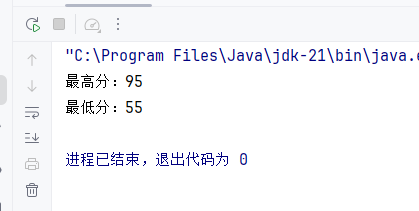

#### 收集集合

在实际业务操作中，流只负责操作数据，不负责存储与传递数据，因此需要将流中的数据再次保存为新的集合或者数组

| API                | 说明             |
| ------------------ | ---------------- |
| `List<E> toList()` | 收集为`List`集合 |
| `Set<E> toSet()`   | 收集为`Set`集合  |

以上的两个`API`是`JDK16`后新增的简化`API`，而对于`JDK16`之前的`Java`项目，可以使用`collect()`方法来实现，`collect()`接收一个`Collector`对象，调用`Collector`对象不同的方法即可收集为不同的集合

| API                                                         | 说明                                                         |
| ----------------------------------------------------------- | ------------------------------------------------------------ |
| `Collector.toList()`                                        | 收集为`List`集合                                             |
| `Collector.toSet()`                                         | 收集为`Set`集合                                              |
| `Collector.toMap(Function keyMapper, Function valueMapper)` | 收集为`Map`集合，其中键由`keyMapper`匿名函数决定，值由`valueMapper`决定 |

**示例**

```java
List<User> list = new ArrayList<>();
list.add(new User("张三", 18));
list.add(new User("李四", 27));
list.add(new User("王五", 19));

// 获取年龄小于20的，并收集为一个Map
Map<String, Integer> userMap = list.stream()
        .filter(user -> user.getAge() < 20)
        .collect(Collectors.toMap(User::getName, User::getAge));

System.out.println(userMap);
```

> 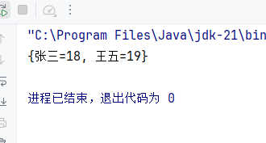

#### 收集数组

将`Stream`收集为集合使用`toArray()`方法

**标准语法**

```java
Object[] toArray(Function<A[]> generator)
```

**示例**

```java
List<User> list = new ArrayList<>();
list.add(new User("张三", 18));
list.add(new User("李四", 27));
list.add(new User("王五", 19));

// 获取年龄小于20的，并收集为一个数组
User[] users = list.stream()
        .filter(user -> user.getAge() < 20)
        .toArray(User[]::new);

System.out.println(Arrays.toString(users));
```

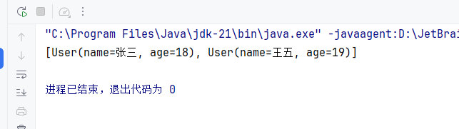

## 多线程

线程是一个程序内部执行的一条执行流程，如果程序中只有一条流程，那么这个程序就是单线程程序，在以往的学习中，我们进行的编程都是单线程。多线程是指从软硬件上实现多条执行流程的技术

`main`方法实际也是在一个主线程中进行的

### 创建线程

在`Java`中，提供了多种创建线程的方式

#### 继承Thread类

 将类声明为`Thread`类的子类，并重写`Thread`类的`run`方法

```java
package com.eiousee;

public class Test {
    public static void main(String[] args) {
        Thread t = new MyThread();
        t.start();

        for (int i = 0; i < 5; i++) {
            System.out.println("主线程" + i);
        }
    }
}

class MyThread extends Thread {
    @Override
    public void run() {
        for (int i = 0; i < 5; i++) {
            System.out.println("子线程" + i);
        }
    }
}
```

> 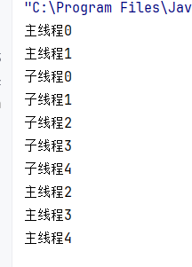

*注：在注册线程时。必须调用子线程实例的`start()`方法而不是`run()`方法；在实际业务逻辑中，启动子线程的代码应位于主线程逻辑的上方，先注册子线程，再完成主线程业务*

#### 实现Runnable接口

声明一个类，实现`Runnable`接口的`run()`方法，然后将此实例交给`Thread()`对象，调用`start()`方法

```java
package com.eiousee;

public class Test {
    public static void main(String[] args) {
        Runnable t = new MyThread();
        new Thread(t).start();

        for (int i = 0; i < 5; i++) {
            System.out.println("主线程" + i);
        }
    }
}

class MyThread implements Runnable {
    @Override
    public void run() {
        for (int i = 0; i < 5; i++) {
            System.out.println("子线程" + i);
        }
    }
}
```

由于`Thread()`接收的参数`Runnable`类是一个函数式接口，因此可以使用`lambda`表达式的方式来简化以上代码

```java
package com.eiousee;

public class Test {
    public static void main(String[] args) {
        new Thread(() -> {
            for (int i = 0; i < 5; i++) {
                System.out.println("子线程" + i);
            }
        }).start();

        for (int i = 0; i < 5; i++) {
            System.out.println("主线程" + i);
        }
    }
}
```

#### 实现Callable接口

上面两种线程创建方式都存在一个很大的问题，我们重写的方法`public void run()`的返回值类型永远是`void`，因此不能通过这两种类型获取任何的返回值

在`JDK5.0`后，提供了`Callable`接口和`FutureTask`类来实现有返回值的子线程

**创建步骤**

1. 定义一个类，实现`Callable`接口，重写`call`方法，封装需要执行的逻辑和需要返回的数据
2. 将`Callable`实例封装为`FutureTask`实例
3. 将线程任务交给`Thread`实例，调用`Thread`实例的`start()`方法启动线程
4. 线程结束后，通过`FutureTask`实例的`get()`方法获取线程执行的结果

```java
package com.eiousee;

import java.util.concurrent.Callable;
import java.util.concurrent.ExecutionException;
import java.util.concurrent.FutureTask;

public class Test {
    public static void main(String[] args) throws ExecutionException, InterruptedException {
        FutureTask<String> task = new FutureTask<>(new myCallable());
        new Thread(task).start();
        System.out.println(task.get());
        System.out.println("这是主线程的结果");
    }
}

class myCallable implements Callable<String> {
    @Override
    public String call() throws Exception {
        return "这是子线程的结果";
    }
}
```

如果子线程想要传递参数，也可以在`Callable`类中定义私有属性，并通过有参构造器来传递参数

```java
package com.eiousee;

import java.util.concurrent.Callable;
import java.util.concurrent.ExecutionException;
import java.util.concurrent.FutureTask;

public class Test {
    public static void main(String[] args) throws ExecutionException, InterruptedException {
        FutureTask<String> task = new FutureTask<>(new myCallable(123));
        new Thread(task).start();
        System.out.println(task.get());
        System.out.println("这是主线程的结果");
    }
}

class myCallable implements Callable<String> {
    private Integer i;

    public myCallable(Integer i) {
        this.i = i;
    }

    @Override
    public String call() {
        return "这是子线程的结果" + i;
    }
}
```

> 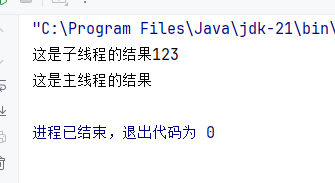

*注：需要注意的是，如果子线程没有完成，则主线程会阻塞在`get()`方法处，直到子线程完成并返回数据，因此`get()`方法后方的代码一定会晚于子线程执行*
