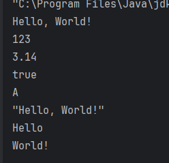
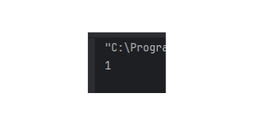
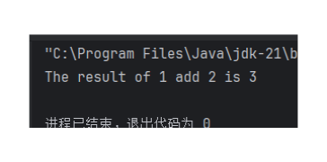
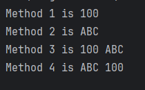

# Java Basic

`更新时间：2024-9-2`

注释解释：

- `<>`必填项，必须在当前位置填写相应数据

- `{}`必选项，必须在当前位置选择一个给出的选项

- `[]`可选项，可以选择填写或忽略

*注：该笔记内的可选项和参数均不完整，如有需要，请查询相关手册*

---

# Java基本语法

## 类

类是Java程序中用来封装数据的代码块，类可以包含属性、方法、构造函数等。

**类声明**

```java
Accessibility class className {
    classBody;
}
```

- `Accessibility`：可访问性，表示类的访问权限，如`public`、`private`、`protected`等。

    - `public`：表示类是公开的，可以在任何地方访问。

    - `private`：表示类是私有的，只能在类的内部访问。

    - `protected`：表示类是受保护的，只能在当前包和子类中访问。

- `class`：关键字，表示类。

- `className`：类名，类名必须以字母开头，可以包含数字、下划线、字母等，不能以数字开头。

- `classBody`：类体，类体中可以包含属性、方法、构造函数等。

## 注释

在Java中，有两种注释方式：单行注释和块注释。

**行注释**

```java
//这是行注释
这是代码块
```

**块注释**

```java
/*
这是块注释
*/
这是代码块
```

## 字面量

字面量是Java程序中用来表示常量或值的特殊语法，字面量可以包括数字、字符串、布尔值等。

**字面量类型**

- 数字：包括整数、浮点数，如`1`、`2.5`、`3L`等。

- 字符串：由双引号括起来的字符序列，如`"Hello World"`、`'A'`等。

- 布尔值：`true`和`false`。

- 空指针：`null`。

- 特殊字符字面量：如`\n`、`\t`、`\r`等。

```java
public class Hello {
    public static void main(String[] args) {
        literal();
    }

    public static void literal() {
        // 打印常见字面量
        System.out.println("Hello, World!");
        System.out.println(123);
        System.out.println(3.14);
        System.out.println(true);
        System.out.println('A');
        System.out.println("\"Hello, World!\"");
        System.out.println("Hello\nWorld!");
    }
}
```

> 

## 变量

变量是Java程序中用来存储数据的内存单元，变量可以存储各种类型的数据，如整数、浮点数、字符、布尔值等。

**变量声明**

```java
dataType variableName = value;
```

- `dataType`：数据类型，表示变量可以存储的数据类型，如`int`、`float`、`char`、`boolean`等。

- `variableName`：变量名，变量名必须以字母开头，可以包含数字、下划线、字母等，不能以数字开头。

- `value`：变量值，表示变量可以存储的值，如`1`、`2.5`、`'A'`、`true`等。

```java
public class Hello {
    public static void main(String[] args) {
        variable();
    }

    public static void variable() {
        // 定义变量
        int a = 1;
        System.out.println(a);
    }
}
```

> 

## 数据类型

Java中提供了丰富的数据类型，包括基本类型和引用类型。

**基本数据类型**

整型：

- `byte`：1字节，-128~127

- `short`：2字节，-32768~32767

- `int`：4字节，-2147483648~2147483647

- `long`：8字节，-9223372036854775808~9223372036854775807，在定义时需要添加`L`后缀

浮点型：

- `float`：单精度浮点数，4字节，-3.4E38~3.4E38，精度为6-7位，在定义时需要添加`F`后缀

- `double`：双精度浮点数，8字节，-1.7976931348623157E308~1.7976931348623157E308，精度为15-16位

字符型：

- `char`：2字节，Unicode字符，如`'A'`、`'中'`等

布尔型：

- `boolean`：1字节，true或false

**引用数据类型**

- `class`：用户自定义的类，允许创建对象实例

- `interface`：接口，定义了类的行为规范

- `enum`：枚举，定义了一组常量

- `String`：字符串，由字符数组组成，不可变

- `Array`：数组，可以存储多个相同类型的数据

- `Generic`：泛型，允许使用类型参数

## 关键字

在Java中，关键字是指被编程语言本身预留的，具有特殊意义的单词，它们用于声明变量、方法、类等，不能作为变量名、方法名、类名等使用，Java大约有250个关键字。

## 标识符

标识符是Java程序中用来唯一标识变量、方法、类等名称的元素，它必须满足以下要求：

1. 首字符必须是字母、下划线或美元符

2. 后续字符可以是字母、数字、下划线或美元符

3. 不能是Java关键字

4. 应遵循驼峰命名法，如`myVariable`、`myMethod`等

*驼峰命名法不是必须的命名规范，只是一种常见的命名方式*

## 方法

方法是Java程序中用来完成特定任务的代码块，方法可以返回一个值，也可以不返回值，也就是面向过程编程中的函数。

**方法声明**

```java
Accessibility behaviorCharacteristic returnedValueType methodName(parameterType parameterName) {
    methodBody;
}
```

- `behaviorCharacteristic`：行为特征，用于区分方法的作用，如`static`、`final`等。

    - `static`：表示方法为静态方法，不需要创建对象就可以调用。

    - `final`：表示方法为最终方法，不能被继承。

- `returnedValueType`：返回值类型，表示方法返回的值的类型，如`int`、`String`等。

- `methodName`：方法名，方法名必须以字母开头，可以包含数字、下划线、字母等，不能以数字开头。

- `parameterType`：参数类型，表示方法参数的类型，如`int`、`String`等。

- `parameterName`：参数名，参数名必须以字母开头，可以包含数字、下划线、字母等，不能以数字开头。

- `methodBody`：方法体，方法体中包含具体的代码，如变量声明、运算符、控制语句等。

**示例**

编写一个简单的方法，计算两个数的和。

```java
public class Hello {
    public static void main(String[] args) {
        int result = sum(1, 2);
        System.out.println("The result of 1 add 2 is " + result);
    }

    public static int sum(int a, int b) {
        return a + b;
    }
}
```

> 

### 主函数

主函数是Java程序中用来启动程序的入口函数，主函数必须为静态方法，且必须为public。

**主函数声明**

```java
public class Hello{
    public static void main(String[] args) {
        // 程序代码
    }
}
```

### 重载

在Java中，同一个类中可以定义多个同名的方法，只要方法的参数列表不同，即参数个数、类型、顺序不同，就称为重载。

**示例**

```java
public class Hello {
    public static void main(String[] args) {
        print(100);
        print("ABC");
        print(100, "ABC");
    }

    public static void print(int a) {
        System.out.println("Method 1 is " + a);
    }

    public static void print(String a) {
        System.out.println("Method 2 is " + a);
    }

    public static void print(int a, String b) {
        System.out.println("Method 3 is " + a + " " + b);
    }
}
```

> 

方法的重载只关注方法的方法名、参数个数和参数顺序，不关注方法的修饰符和返回值类型

**示例**

```java
public class Hello {
    public static void main(String[] args) {
        print(100);
        print("ABC");
        print(100, "ABC");
        print("ABC", 100);
    }

    public static void print(int a) {
        System.out.println("Method 1 is " + a);
    }

    // 修饰符不同
    static void print(String a) {
        System.out.println("Method 2 is " + a);
    }

    // 返回值类型不同
    public static int print(int a, String b) {
        System.out.println("Method 3 is " + a + " " + b);
        return 0;
    }

    // 参数顺序不同
    public static int print(String b, int a) {
        System.out.println("Method 4 is " + b + " " + a);
        return 0;
    }
}
```

> 