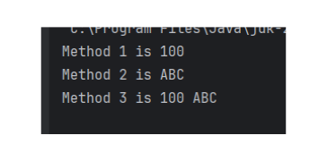
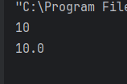

# Java Basic

`更新时间：2024-9-2`

注释解释：

- `<>`必填项，必须在当前位置填写相应数据

- `{}`必选项，必须在当前位置选择一个给出的选项

- `[]`可选项，可以选择填写或忽略

*注：该笔记内的可选项和参数均不完整，如有需要，请查询相关手册*

---

# Java基本语法

## 类

类是Java程序中用来封装数据的代码块，类可以包含属性、方法、构造函数等。

**类声明**

```java
Accessibility class className {
    classBody;
}
```

- `Accessibility`：可访问性，表示类的访问权限，如`public`、`private`、`protected`等。

    - `public`：表示类是公开的，可以在任何地方访问。

    - `private`：表示类是私有的，只能在类的内部访问。

    - `protected`：表示类是受保护的，只能在当前包和子类中访问。

- `class`：关键字，表示类。

- `className`：类名，类名必须以字母开头，可以包含数字、下划线、字母等，不能以数字开头。

- `classBody`：类体，类体中可以包含属性、方法、构造函数等。

## 注释

在Java中，有两种注释方式：单行注释和块注释。

**行注释**

```java
//这是行注释
这是代码块
```

**块注释**

```java
/*
这是块注释
*/
这是代码块
```

## 字面量

字面量是Java程序中用来表示常量或值的特殊语法，字面量可以包括数字、字符串、布尔值等。

**字面量类型**

- 数字：包括整数、浮点数，如`1`、`2.5`、`3L`等。

- 字符串：由双引号括起来的字符序列，如`"Hello World"`、`'A'`等。

- 布尔值：`true`和`false`。

- 空指针：`null`。

- 特殊字符字面量：如`\n`、`\t`、`\r`等。

```java
public class Hello {
    public static void main(String[] args) {
        literal();
    }

    public static void literal() {
        // 打印常见字面量
        System.out.println("Hello, World!");
        System.out.println(123);
        System.out.println(3.14);
        System.out.println(true);
        System.out.println('A');
        System.out.println("\"Hello, World!\"");
        System.out.println("Hello\nWorld!");
    }
}
```

> 

## 变量

变量是Java程序中用来存储数据的内存单元，变量可以存储各种类型的数据，如整数、浮点数、字符、布尔值等。

**变量声明**

```java
dataType variableName = value;
```

- `dataType`：数据类型，表示变量可以存储的数据类型，如`int`、`float`、`char`、`boolean`等。

- `variableName`：变量名，变量名必须以字母开头，可以包含数字、下划线、字母等，不能以数字开头。

- `value`：变量值，表示变量可以存储的值，如`1`、`2.5`、`'A'`、`true`等。

```java
public class Hello {
    public static void main(String[] args) {
        variable();
    }

    public static void variable() {
        // 定义变量
        int a = 1;
        System.out.println(a);
    }
}
```

> 

## 数据类型

Java中提供了丰富的数据类型，包括基本类型和引用类型。

**基本数据类型**

整型：

- `byte`：1字节，-128~127

- `short`：2字节，-32768~32767

- `int`：4字节，-2147483648~2147483647

- `long`：8字节，-9223372036854775808~9223372036854775807，在定义时需要添加`L`后缀

浮点型：

- `float`：单精度浮点数，4字节，-3.4E38~3.4E38，精度为6-7位，在定义时需要添加`F`后缀

- `double`：双精度浮点数，8字节，-1.7976931348623157E308~1.7976931348623157E308，精度为15-16位

字符型：

- `char`：2字节，Unicode字符，如`'A'`、`'中'`等

布尔型：

- `boolean`：1字节，true或false

**引用数据类型**

- `class`：用户自定义的类，允许创建对象实例

- `interface`：接口，定义了类的行为规范

- `enum`：枚举，定义了一组常量

- `String`：字符串，由字符数组组成，不可变

- `Array`：数组，可以存储多个相同类型的数据

- `Generic`：泛型，允许使用类型参数

## 关键字

在Java中，关键字是指被编程语言本身预留的，具有特殊意义的单词，它们用于声明变量、方法、类等，不能作为变量名、方法名、类名等使用，Java大约有250个关键字。

## 标识符

标识符是Java程序中用来唯一标识变量、方法、类等名称的元素，它必须满足以下要求：

1. 首字符必须是字母、下划线或美元符

2. 后续字符可以是字母、数字、下划线或美元符

3. 不能是Java关键字

4. 应遵循驼峰命名法，如`myVariable`、`myMethod`等

*驼峰命名法不是必须的命名规范，只是一种常见的命名方式*

## 方法

方法是Java程序中用来完成特定任务的代码块，方法可以返回一个值，也可以不返回值，也就是面向过程编程中的函数。

**方法声明**

```java
Accessibility behaviorCharacteristic returnedValueType methodName(parameterType parameterName) {
    methodBody;
}
```

- `behaviorCharacteristic`：行为特征，用于区分方法的作用，如`static`、`final`等。

    - `static`：表示方法为静态方法，不需要创建对象就可以调用。

    - `final`：表示方法为最终方法，不能被继承。

- `returnedValueType`：返回值类型，表示方法返回的值的类型，如`int`、`String`等。

*无返回值的方法可以使用return关键字立即终止方法*

- `methodName`：方法名，方法名必须以字母开头，可以包含数字、下划线、字母等，不能以数字开头。

- `parameterType`：参数类型，表示方法参数的类型，如`int`、`String`等。

- `parameterName`：参数名，参数名必须以字母开头，可以包含数字、下划线、字母等，不能以数字开头。

- `methodBody`：方法体，方法体中包含具体的代码，如变量声明、运算符、控制语句等。

**示例**

编写一个简单的方法，计算两个数的和。

```java
public class Hello {
    public static void main(String[] args) {
        int result = sum(1, 2);
        System.out.println("The result of 1 add 2 is " + result);
    }

    public static int sum(int a, int b) {
        return a + b;
    }
}
```

> 

### 主函数

主函数是Java程序中用来启动程序的入口函数，主函数必须为静态方法，且必须为public。

**主函数声明**

```java
public class Hello{
    public static void main(String[] args) {
        // 程序代码
    }
}
```

### 重载

在Java中，同一个类中可以定义多个同名的方法，只要方法的参数列表不同，即参数个数、类型、顺序不同，就称为重载。

**示例**

```java
public class Hello {
    public static void main(String[] args) {
        print(100);
        print("ABC");
        print(100, "ABC");
    }

    public static void print(int a) {
        System.out.println("Method 1 is " + a);
    }

    public static void print(String a) {
        System.out.println("Method 2 is " + a);
    }

    public static void print(int a, String b) {
        System.out.println("Method 3 is " + a + " " + b);
    }
}
```

> 

方法的重载只关注方法的方法名、参数个数和参数顺序，不关注方法的修饰符和返回值类型

**示例**

```java
public class Hello {
    public static void main(String[] args) {
        print(100);
        print("ABC");
        print(100, "ABC");
        print("ABC", 100);
    }

    public static void print(int a) {
        System.out.println("Method 1 is " + a);
    }

    // 修饰符不同
    static void print(String a) {
        System.out.println("Method 2 is " + a);
    }

    // 返回值类型不同
    public static int print(int a, String b) {
        System.out.println("Method 3 is " + a + " " + b);
        return 0;
    }

    // 参数顺序不同
    public static int print(String b, int a) {
        System.out.println("Method 4 is " + b + " " + a);
        return 0;
    }
}
```

> 

## 类型转换

### 自动类型转换

在Java中，如果一个变量的值可以转换为另一个变量的类型，那么Java编译器会自动将变量转换为另一个类型。例如，如果一个变量的值为`int`类型，而另一个变量的值为`double`类型，那么Java编译器会将`int`类型的变量转换为`double`类型。

```java
public class Type {
    public static void main(String[] args) {
        int a = 10;
        automaticTypeConversion(a);
    }

    // 自动类型转换
    public static void automaticTypeConversion(double a) {
        System.out.println(a);
    }
}
```

> 

### 强制类型转换

在Java中，可以使用强制类型转换将一个变量转换为另一种类型。

```java
public class Type {
    public static void main(String[] args) {
        int a = 10;
        coerceTypeConversion(a);
    }

    // 强制类型转换
    public static void coerceTypeConversion(int a) {
        System.out.println(a);
        System.out.println((double)a);
    }
}
```

> 

但是，强制类型转换可能会导致数据丢失或错误，因此需要谨慎使用。

```java
public class Type {
    public static void main(String[] args) {
        double a = 10.2754;
        coerceTypeConversion(a);
    }

    // 损失精度的强制类型转换
    public static void coerceTypeConversion(double a) {
        System.out.println(a);
        System.out.println((int)a);
    }
}
```

> 

### 表达式自动类型提升

在Java中，如果一个表达式中的两个操作数类型不同，那么Java编译器会自动将较小的类型转换为较大的类型。例如，如果一个表达式中的两个操作数都是`int`类型，那么Java编译器会将`int`类型的操作数转换为`long`类型。

```java
public class Type {
    public static void main(String[] args) {
        calculator(10, 5L, 'a', 3.14);
    }

    // 参数列表中double为最高级类型，因此结果数据类型为double
    public static void calculator(int a, long b, char c, double d) {
        System.out.println(a + b + c + d);
    }
}
```

> 

*在表达式中，`byte`、`short`、`char`会被提升为`int`，而`int`会被提升为`long`*

## 基础输入输出

在Java中，可以使用`Scanner`类来读取键盘输入，使用`System.out.println()`来输出到控制台。

```java
// 导包
import java.util.Scanner;

public class InOut {
    public static void main(String[] args) {
        getInput();
    }

    public static void getInput() {
        // 定义接受用户输入的变量
        String input = "";

        // 创建Scanner对象
        Scanner scanner = new Scanner(System.in);

        // 获取用户输入
        input = scanner.nextLine();

        // 打印用户输入
        System.out.println("用户输入：" + input);
    }
}
```

> 

## 运算符

在Java中，运算符包括算术运算符、自增减运算符、赋值运算符、关系运算符、逻辑运算符、位运算符、三元运算符等。

**算术运算符**

- `+`：加法运算符，用于将两个操作数相加

- `-`：减法运算符，用于将两个操作数相减

- `*`：乘法运算符，用于将两个操作数相乘

- `/`：除法运算符，用于将两个操作数相除

- `%`：取余运算符，用于计算两个操作数的余数

```java
public class Operator {
    public static void main(String[] args) {
        arithmeticOperator();
    }

    public static void arithmeticOperator() {
        int a = 10;
        int b = 7;

        // 加法
        System.out.println("a + b = " + (a + b));

        // 减法
        System.out.println("a - b = " + (a - b));

        // 乘法
        System.out.println("a * b = " + (a * b));

        // 除法
        System.out.println("a / b = " + (a / b));

        // 取余
        System.out.println("a % b = " + (a % b));
    }
}
```

> 

**自增减运算符**

- `++`：自增运算符，将操作数的值加1，并返回操作数的新值

- `--`：自减运算符，将操作数的值减1，并返回操作数的新值

```java
public static void selfIncrementAndSubtractionOperator() {
    int a = 10;

    // 自增
    System.out.println("++a = " + ++a);

    // 自减
    System.out.println("--a = " + --a);
    System.out.println("====================");

    // 运算后自减
    System.out.println(a);
    a--;
    System.out.println("a-- = " + a);
    System.out.println("====================");

    // 运算后自增
    System.out.println(a);
    a++;
    System.out.println("a++ = " + a);
}
```

> 

**赋值运算符**

- `=`：赋值运算符，将右侧操作数的值赋给左侧操作数

- `+=`：自增赋值运算符，将右侧操作数的值加到左侧操作数的值上，并赋给左侧操作数

- `-=`：自减赋值运算符，将右侧操作数的值减到左侧操作数的值上，并赋给左侧操作数

```java
public static void assignmentOperator() {
    int a;

    // 赋值运算
    a = 10;
    System.out.println(a);

    // 自增赋值运算符
    a += 5;
    System.out.println(a);

    // 自减赋值运算符
    a -= 5;
    System.out.println(a);
}
```

> 

**关系运算符**

- `==`：等于运算符，判断两个操作数的值是否相等

- `!=`：不等于运算符，判断两个操作数的值是否不相等

- `>`：大于运算符，判断左侧操作数的值是否大于右侧操作数的值

- `>=`：大于等于运算符，判断左侧操作数的值是否大于等于右侧操作数的值

- `<`：小于运算符，判断左侧操作数的值是否小于右侧操作数的值

- `<=`：小于等于运算符，判断左侧操作数的值是否小于等于右侧操作数的值

```java
public static void comparisonOperator() {
    int a = 10;
    int b = 20;

    // 比较运算符
    System.out.println("a > b = " + (a > b));
    System.out.println("a < b = " + (a < b));
    System.out.println("a >= b = " + (a >= b));
    System.out.println("a <= b = " + (a <= b));
    System.out.println("a == b = " + (a == b));
    System.out.println("a != b = " + (a != b));
}
```

> 

**逻辑运算符**

- `&&`：逻辑与运算符，判断两个操作数的布尔值是否都为真，如果都为真，则返回true，否则返回false

- `||`：逻辑或运算符，判断两个操作数的布尔值是否至少有一个为真，如果至少有一个为真，则返回true，否则返回false

- `!`：逻辑非运算符，将操作数的布尔值取反，如果为真，则返回false，如果为假，则返回true

```java
public static void logicalOperator() {
    int a = 10;
    int b = 20;

    // 逻辑运算符
    System.out.println("a > 10 && b > 10 = " + (a > 10 && b > 10));
    System.out.println("a > 10 || b > 10 = " + (a > 10 || b > 10));
    System.out.println("! (a > 10) = " + !(a > 10));
}
```

> 

**位运算符**

- `&`：位与运算符，将两个操作数的对应位进行与运算，如果两个位都为1，则结果为1，否则为0

- `|`：位或运算符，将两个操作数的对应位进行或运算，如果两个位有一个为1，则结果为1，否则为0

- `^`：位异或运算符，将两个操作数的对应位进行异或运算，如果两个位相同，则结果为0，否则为1

- `~`：位取反运算符，将操作数的二进制表示取反，并返回取反后的值

- `<<`：左移运算符，将操作数的二进制表示向左移动指定位数，并返回移动后的值

- `>>`：有符号右移运算符，将操作数的二进制表示向右移动指定位数，并返回移动后的值

```java
public static void bitOperator() {
    int a = -3;
    // 原码 10000011
    // 反码 11111100
    // 补码 11111101

    // 按位与
    // -3 11111101
    //  5 00000101
    //  & 00000101(补码) = 5
    System.out.println("a & 5 = " + (a & 5));

    // 按位或
    // -3 11111101
    //  5 00000101
    //  | 11111101(补码) = -3
    System.out.println("a | 5 = " + (a | 5));

    // 按位异或
    // -3 11111101
    //  5 00000101
    //  ^ 11111000(补码) = -8
    System.out.println("a ^ 5 = " + (a ^ 5));

    // 按位取反
    // -3 11111101
    //  ~ 00000010(补码) = 2
    System.out.println("~ a = " + (~a));

    // 按位左移
    //  -3  11111101
    // << 2 11110100(补码) = -12
    System.out.println("a << 2 = " + (a << 2));

    // 按位右移
    //  -3  11111101
    // >> 2 11111111(补码) = -1
    System.out.println("a >> 2 = " + (a >> 2));
}
```

> 

**三元运算符**

`expression1 ? expression2 : expression3`

- `expression1`：条件表达式

- `expression2`：当条件表达式为真时返回的值

- `expression3`：当条件表达式为假时返回的值

```java
public static void ternaryOperator() {
    int a = 10;
    int b = 20;

    // 三元运算符
    System.out.println(a > b ? "a > b" : "a <= b");
}
```

> 

---

## 综合案例1：健康计算器

开发一个简单的健康计算器应用程序，它可以接受用户输入，如年龄、性别、体重、身高等，并计算出用户的BMI值和BMR值

```java
import java.util.Scanner;

public class HealthCalculator {
    public static void main(String[] args) {
        String[] userInfo = getInput();
        healthIndex(userInfo);
    }

    // 接收输入方法
    // 接收年龄、性别、身高、体重四个指标
    public static String[] getInput() {
        String[] userInfo = new String[4];
        Scanner scanner = new Scanner(System.in);

        System.out.println("请输入年龄：");
        userInfo[0] = scanner.nextLine().trim();
        System.out.println("请输入性别（male/female）：");
        userInfo[1] = scanner.nextLine().trim();
        System.out.println("请输入身高（单位：cm）：");
        userInfo[2] = scanner.nextLine().trim();
        System.out.println("请输入体重（单位：kg）：");
        userInfo[3] = scanner.nextLine().trim();

        return userInfo;
    }

    // 健康指数计算方法
    public static void healthIndex(String[] userInfo) {
        // bmi = result[0]
        // bmr = result[1]
        double[] result = new double[2];
        int age = Integer.parseInt(userInfo[0]);
        String gender = userInfo[1];
        double height = Double.parseDouble(userInfo[2]);
        double weight = Double.parseDouble(userInfo[3]);

        result[0] = weight / Math.pow(height / 100, 2);
        if (gender.equals("male")) {
            result[1] = 66 + (13.7 * weight) + (5 * height) - (6.8 * age);
        } else {
            result[1] = 655 + (9.6 * weight) + (1.8 * height) - (4.7 * age);
        }
        String BMI = String.format("%.1f", result[0]);

        System.out.println("BMI：" + BMI);
        System.out.println("BMR：" + result[1]);
    }
}
```

> 

---

## 程序流程控制

程序流程控制是指程序在运行时按照一定的顺序执行，以实现特定的功能。在Java中，程序流程控制有以下几种方式：

- `顺序执行`：程序按照代码的顺序依次执行，直到遇到return、break、continue、throw等关键字为止

- `分支执行`：程序根据条件判断，执行不同的代码块，如if、switch等

- `循环执行`：程序根据循环条件，重复执行一段代码，如for、while、do-while等

### 分支结构

分支结构是程序流程控制中的重要概念，它允许程序根据条件判断，执行不同的代码块。Java中分支结构有以下几种：

- `if`：判断一个条件是否为真，如果为真，则执行if语句块中的代码，否则不执行。

- `switch`：判断一个变量的值，根据不同的值，执行不同的代码块。

#### if语句

**基本语法**

```java
if (condition1) {
    // if condition1 is true
    code block;
}else if (condition2) {
    // if condition1 is false and condition2 is true
    code block;
}else {
    // if all conditions are false
    code block;
}
```

**示例**

```java
import java.util.Scanner;

public class IfBranch {
    public static void main(String[] args) {
        Scanner scanner = new Scanner(System.in);
        System.out.println("请输入一个整数：");
        int a = scanner.nextInt();

        if (a % 2 == 0) {
            System.out.println("输入的整数是偶数");
        } else {
            System.out.println("输入的整数是奇数");
        }
    }
}
```

> 

#### switch语句

**基本语法**

```java
switch (expression) {
    case value1:
        // if expression equals value1
        code block;
        break;
    case value2:
        // if expression equals value2
        code block;
        break;
        ...
    default:
        // if none of the above conditions are true
        code block;
        break;
}
```

**示例**

```java
public class branchStatement {
    public static void main(String[] args) {
        Scanner scanner = new Scanner(System.in);
        System.out.println("请输入一个整数：");
        int a = scanner.nextInt();

        switch (a % 2) {
            case 1:
                System.out.println("奇数");
                break;
            case 0:
                System.out.println("偶数");
                break;
            default:
                System.out.println("这是数字？");
        }
    }
}
```

> 

**switch语句的注意点**

1. `switch`语句中的表达式只能是`byte`、`short`、`char`、`int`、`enum`、`String`等类型

2. `case`中的值只能是常量，不能是变量

3. 每条`case`语句后面必须跟一个`break`，否则会继续执行下一条`case`

4. `default`语句是可选的，如果没有`default`语句，当没有匹配的`case`时，程序将不会执行任何操作

**错误案例**

```java
import java.util.Scanner;

public class branchStatement {
    public static void main(String[] args) {
        Scanner scanner = new Scanner(System.in);
        System.out.println("请输入一个整数：");
        int a = scanner.nextInt();

        switch (a % 2) {
            case 1:
                System.out.println("奇数");
                // 此处注释break;
            case 0:
                System.out.println("偶数");
                break;
            default:
                System.out.println("这是数字？");
        }
    }
}
```

> 

### 循环结构

循环结构是程序流程控制的重要概念，它允许程序重复执行一段代码，直到满足条件为止。Java中循环结构有以下几种：

- `for`：循环从初始化表达式开始，然后判断循环条件是否为真，如果是，则执行循环体，然后更新循环变量，重复执行直到循环条件为假。

- `while`：循环从循环条件开始，判断循环条件是否为真，如果是，则执行循环体，然后更新循环变量，重复执行直到循环条件为假。

- `do-while`：循环从循环体开始，执行循环体，然后判断循环条件是否为真，如果是，则重复执行循环体，直到循环条件为假。

#### for循环

**基本语法**

```java
for (initialization; condition; update) {
    code block;
}
```

**示例**

```java
public static void main(String[] args) {
    forLoop();
}

public static void forLoop() {
    for (int i = 0; i < 10; i++) {
        System.out.println(i);
    }
}
```

> 

#### while循环

**基本语法**

```java
while (condition) {
    code block;
}
```

**示例**

```java
public static void whileLoop() {
    int i = 0;

    while (i < 5) {
        System.out.println(i);
        i++;
    }
}
```

> 

#### do-while循环

**基本语法**

```java
do {
    code block;
}while (condition);
```

**示例**

```java
public static void doWhileLoop() {
    int i = 0;

    do {
        System.out.println(i);
        i++;
    } while (i < 7);
}
```

> 
