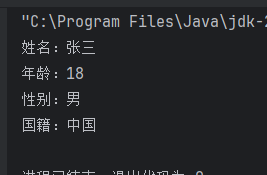
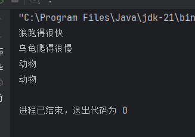

# Java Medium

`更新时间：2024-9-9`

注释解释：

- `<>`必填项，必须在当前位置填写相应数据

- `{}`必选项，必须在当前位置选择一个给出的选项

- `[]`可选项，可以选择填写或忽略

*注：该笔记内的可选项和参数均不完整，如有需要，请查询相关手册*

---

## 面向对象编程

面向对象编程是指在编程中，将问题分解为多个对象，对象之间通过消息传递来完成

### 对象

对象是现实世界或抽象概念的抽象表示，对象具有属性和行为，对象之间可以相互通信，对象之间可以相互交互。比如可以把人看作是一个对象，人的属性有名字、年龄、性别等，而人的行为有说话、吃饭、睡觉等

### 类

类就是对象的抽象模板，类定义了对象的属性和行为，类可以创建出多个对象，每个对象都是类的实例。比如人类是一个类，而张三、李四、王五都是人类的实例，即对象

## 对象

### 创建类

```java
[Accessibility] class className {
    // 属性
    [Accessibility] dataType attributeName;

    // 方法
    [Accessibility behaviorCharacteristic] returnedValueType methodName([parameterType parameterName]) {
    methodBody;
    }
}
```

**示例**

```java
public class Object {
    public static void main(String[] args) {

    }
}

// 定义类
class Human{
    // 定义属性
    String name;
    int age;
    String gender;
    String country;

    // 定义方法
    void eat(){
        System.out.println("吃东西");
    }
    void sleep(){
        System.out.println("睡觉");
    }
}
```

### 创建对象与使用

```java
// 创建对象
ClassName objectName = new ClassName();
// 为对象属性赋值
objectName.attributeName = "value";
// 调用对象方法
objectName.methodName();
```

**示例**

```java
public class Object {
    public static void main(String[] args) {
        Human ZhangSan = new Human();
        ZhangSan.name = "张三";
        ZhangSan.age = 18;
        ZhangSan.gender = "男";
        ZhangSan.country = "中国";
        
        ZhangSan.info();
    }
}

// 定义类
class Human{
    // 定义属性
    String name;
    int age;
    String gender;
    String country;

    // 定义方法
    void info() {
        System.out.println("姓名：" + name);
        System.out.println("年龄：" + age);
        System.out.println("性别：" + gender);
        System.out.println("国籍：" + country);
    }
}
```

> 

## 构造器

构造器是类的一个特殊方法，用于创建和初始化对象，构造器与类名相同，并且没有返回值，构造器在创建对象时自动调用，如果没有显示调用，则默认调用无参构造器

**声明构造器**

```java
class ClassName{
    // 构造器
    ClassName(){
    }
}
```

**示例**

```java
public class Constructor {
    public static void main(String[] args) {
        newConstructor constructor = new newConstructor();
    }
}

class newConstructor{
    newConstructor(){
        System.out.println("构造器在对象被创建时会自动调用");
    }
}
```

> 

### 构造器重载

构造器和方法一样可以通过不同的参数来达到重载的效果，即当创建对象时传入的参数不同，对象本身调用的构造器也不同

**示例**

```java
public class Constructor {
    public static void main(String[] args) {
        newConstructor constructor0 = new newConstructor();
        newConstructor constructor1 = new newConstructor(1);
        newConstructor constructor2 = new newConstructor("hello");
    }
}

class newConstructor{
    newConstructor(){
        System.out.println("无参构造器");
    }

    newConstructor(int a){
        System.out.println("int类型参构造器");
    }

    newConstructor(String a){
        System.out.println("String类型参构造器");
    }
}
```

> 

## this关键字

this关键字是当前对象的引用，通过this关键字可以访问当前对象的属性、方法、构造器等，this关键字可以省略，但建议使用

**示例**

```java
class Human{
    String name;

    Human() {
        // this关键字
        // 等价于 name = "张三";
        this.name = "张三";
    }
}
```

this的用法之一是解决类中的属性与参数重名问题

**错误示例**

```java
public class ThisKeyword {
    public static void main(String[] args) {
        HumanBeing humanbeing = new HumanBeing("小明");
        humanbeing.info("王老师");
    }
}

class HumanBeing {
    HumanBeing(String name) {
        name = name;
    }
    void info(String name) {
        System.out.printf("我是%s，我的老师是%s", name, name);
    }
}
```

> 

在上面的程序中，由于参数与属性重名，导致程序运行出错

**正确示例**

```java
public class ThisKeyword {
    public static void main(String[] args) {
        HumanBeing humanbeing = new HumanBeing("小明");
        humanbeing.info("王老师");
    }
}

class HumanBeing {
    String name;

    HumanBeing(String name) {
        this.name = name;
    }
    void info(String name) {
        System.out.printf("我是%s，我的老师是%s", this.name, name);
    }
}
```

> 

## 封装

封装是面向对象编程的基本概念，封装是把数据（属性）和操作数据的方法（行为）封装到一起，形成一个完整的对象，封装是面向对象的三大特性之一，封装是隐藏对象的细节，只对外暴露对象对外的行为

### private关键字

封装的一大特性就是需要隐藏对象中的细节，在Java中，通过private关键字可以做到对属性的封装，private关键字修饰的属性只能在本类中访问，外部类无法访问

```java
public class PrivateKeyword {
    public static void main(String[] args) {
        Human0 ZhangSan = new Human0();
        ZhangSan.name = "张三";
        ZhangSan.age = 18;
        
        ZhangSan.info();
    }
}

class Human0 {
    String name;
    private int age;

    public void info() {
        System.out.println("我是" + name + "，今年" + age + "岁");
    }
}
```

> 

上面的程序中，Human0类的属性age被设置为private，外部类无法访问，达到了隐藏的目的，如果需要赋值，可以自定义一个public方法

```java
public class PrivateKeyword {
    public static void main(String[] args) {
        Human0 ZhangSan = new Human0();
        ZhangSan.name = "张三";

        ZhangSan.setAge(18);
        ZhangSan.info();
    }
}

class Human0 {
    String name;
    private int age;

    public void info() {
        System.out.println("我是" + this.name + "，今年" + this.age + "岁");
    }

    public void setAge(int age) {
        this.age = age;
    }
}
```

> 

*注：对于拥有private的属性，外部类无法访问，但可以通过自定义方法读取，如上面程序中的info()方法，使用参数访问了age属性*

## Javabean （实体）

Javabean是Java中一个重要的概念，它指的是一个类，该类封装了属性和行为，并且这些属性是私有的，只有getter和setter方法可以访问，Javabean是Java中实现封装的方式，通过封装，可以保护对象的数据安全，同时，Javabean还可以被其他类继承，实现复用

实际开发中，实体对象一般只负责封装数据，不包含任何业务逻辑，只提供getter和setter方法，业务处理交给其他的类的方法来实现

**示例**

Student类
```java
public class Student {
    private String name;
    private int age;
    private int Chinese;
    private int Math;

    public Student() {}

    public Student(String name, int age, int chinese, int math) {
        this.name = name;
        this.age = age;
        this.Chinese = chinese;
        this.Math = math;
    }

    public String getName() {
        return this.name;
    }

    public void setName(String name) {
        this.name = name;
    }

    public int getAge() {
        return this.age;
    }

    public void setAge(int age) {
        this.age = age;
    }

    public int getChinese() {
        return this.Chinese;
    }

    public void setChinese(int chinese) {
        this.Chinese = chinese;
    }

    public int getMath() {
        return this.Math;
    }

    public void setMath(int math) {
        this.Math = math;
    }
}
```

Service类
```java
public class Service {
    private Student stu;

    public Service() {}

    public Service(Student stu) {
        this.stu = stu;
    }

    public void totalGrades() {
        System.out.printf("学生 %s 的总成绩为 %d\n", this.stu.getName(), this.stu.getChinese() + this.stu.getMath());
    }

    public void totalGrades(Student stu) {
        System.out.printf("学生 %s 的总成绩为 %d\n", stu.getName(), stu.getChinese() + stu.getMath());
    }

    public void averageGrades() {
        System.out.printf("学生 %s 的平均成绩为 %d\n", this.stu.getName(), (this.stu.getChinese() + this.stu.getMath()) / 2);
    }

    public void averageGrades(Student stu) {
        System.out.printf("学生 %s 的平均成绩为 %d\n", stu.getName(), (stu.getChinese() + stu.getMath()) / 2);
    }
}
```

Main类
```java
public class Main {
    public static void main(String[] args) {
        Student stu_1 = new Student("张三", 18, 88, 74);
        Student stu_2 = new Student();

        stu_2.setName("李四");
        stu_2.setAge(19);
        stu_2.setChinese(67);
        stu_2.setMath(92);

        Service service_1 = new Service(stu_1);
        Service service_2 = new Service();

        service_1.averageGrades();
        service_1.totalGrades();
        service_2.averageGrades(stu_2);
        service_2.totalGrades(stu_2);
    }
}
```

> 

*注：在上面的程序中，我使用了方法的重载，例如Service类中的averageGrades()方法，用户可以选择是否在创建Service对象时传入Student对象，如果传入，在调用averageGrades()方法时，就不需要再传入Student对象；如果在创建Service对象时没有传入Student对象，则可以直接调用averageGrades()方法，然后在该方法中传入指定的Student对象*

## static关键字

static关键字可以修饰变量和函数，static变量和static方法可以直接通过类名访问，而不需要创建对象。对于有static关键字修饰的变量，如果修改了其值，其他对象也会被修改，因为static变量由类所有，类在每次运行时只创建一次，所有由该类创建的对象共享类的属性和方法

### static变量

**示例**

```java
public class StaticKeyword {
    public static void main(String[] args) {
        Car ford = new Car();
        ford.brand = "Ford";
        ford.price = 200000;
        System.out.println(ford.brand + " 花费 " + ford.price);

        Car.price = 300000;
        System.out.println(ford.brand + " 花费 " + ford.price);

        Boat.purchase();
    }
}

class Car {
    static int price;
    String brand;
}

class Boat {
    static void purchase() {
        System.out.println("我又买了艘船");
    }
}
```

> 

*在上面的程序中，先对ford对象的price属性进行了赋值，而后又对Car类的price属性进行了赋值，此时，因为ford对象是Car类的对象，所以在调用ford.price时的值也发生了改变。程序中没有创建Boat类的对象，但是因为Boat类中的purchase()方法被static修饰，所以可以直接通过类名Boat调用该方法*

### static方法

**示例**

```java
public class StaticKeyword {
    public static void main(String[] args) {
        // 调用printOne
        Printer.printOne();

        // 调用printTwo
        Printer printer = new Printer();
        printer.printTwo();
    }
}

class Printer {
    static void printOne() {
        System.out.println(1);
    }

    void printTwo() {
        System.out.println(2);
    }
}
```

> 

### 定义工具类

工具类一般只包含静态方法，不包含实例方法，工具类的方法都是公共的，可以直接通过类名调用，而不需要创建对象，工具类的构造器是私有的，不能被实例化

Menu类
```java
public class Menu {
    public static void main(String[] args) {
        int a = 20;
        int b = 10;

        System.out.println(Calculator.sum(a, b));
        System.out.println(Calculator.sub(a, b));
    }
}
```

Calculator类
```java
public class Calculator {
    // 私有化构造器
    private Calculator() {};

    public static int sum(int a, int b) {
        return a + b;
    }

    public static int sub(int a, int b) {
        return a - b;
    }
}
```

> 

### static关键字注意事项

1. 静态方法中可以访问静态成员，不能直接访问实例成员

2. 实例方法中即可以访问静态成员，也可以访问实例成员

3. 静态方法中不能使用this关键字，因为静态方法属于类，而不是对象，所以不能通过this关键字访问对象

## 综合案例：电影信息展示

设计一个电影信息展示的小程序，程序默认展示目前所有的电影信息，用户可以输入id查询指定电影信息

Menu类
```java
import java.util.Scanner;

public class Menu {
    public static void main(String[] args) {
        Movie[] movies = new Movie[]{
                new Movie(1, "《罗小黑战记》", "山新", "2019"),
                new Movie(2, "《让子弹飞》", "姜文", "2010"),
                new Movie(3, "《坏蛋联盟》", "马克·马龙", "2022"),
                new Movie(4, "《天气之子》", "醍醐虎汰朗", "2019"),
                new Movie(5, "《海王》", "杰西卡·罗素", "2013")
        };

        MovieOperator mo = new MovieOperator(movies);

        while (true) {
            System.out.println("当前电影列表：");
            mo.showInfo();
            System.out.println("-------------------------------");
            System.out.println("请输入您接下来的操作：");
            System.out.println("1.查询电影");
            System.out.println("2.退出");
            System.out.println("-------------------------------");

            Scanner sc = new Scanner(System.in);
            int option = sc.nextInt();

            switch (option) {
                case 1:
                    System.out.println("请输入您要查询的电影ID：");
                    int id = sc.nextInt();
                    mo.queryById(id);
                    System.out.println("-------------------------------");
                    break;
                case 2:
                    System.out.println("感谢您的使用！");
                    System.exit(0);
                    break;
                default:
                    System.out.println("输入有误，请重新输入！");
            }
        }
    }
}
```

Movie类
```java
public class Movie {
    private int id;
    private String name;
    private String actor;
    private String year;

    public Movie() {}

    public Movie(int id, String name, String actor, String year) {
        this.id = id;
        this.name = name;
        this.actor = actor;
        this.year = year;
    }

    public String getYear() {
        return year;
    }

    public void setYear(String year) {
        this.year = year;
    }

    public String getActor() {
        return actor;
    }

    public void setActor(String actor) {
        this.actor = actor;
    }

    public String getName() {
        return name;
    }

    public void setName(String name) {
        this.name = name;
    }

    public int getId() {
        return id;
    }

    public void setId(int id) {
        this.id = id;
    }
}
```

MovieOperator类
```java
public class MovieOperator {

    private Movie[] movie;

    public MovieOperator() {}

    public MovieOperator(Movie[] movie) {
        this.movie = movie;
    }

    public void showInfo() {
        for (Movie m : this.movie) {
            System.out.println(m.getId() + " " + m.getName() + " " + m.getActor() + " " + m.getYear());
        }
    }
    public void showInfo(Movie[] movie) {
        for (Movie m : movie) {
            System.out.println(m.getId() + " " + m.getName() + " " + m.getActor() + " " + m.getYear());
        }
    }

    public void queryById(int id) {
        for (Movie m : this.movie) {
            if (m.getId() == id) {
                System.out.println(m.getId() + " " + m.getName() + " " + m.getActor() + " " + m.getYear());
                return;
            }
        }
    }

    public void queryById(Movie[] movie, int id) {
        for (Movie m : movie) {
            if (m.getId() == id) {
                System.out.println(m.getId() + " " + m.getName() + " " + m.getActor() + " " + m.getYear());
                return;
            }
        }
    }
}
```

> 

## 继承

继承是面向对象编程中一个重要的概念，它允许子类继承父类的属性和方法，并添加新的属性和方法，从而实现代码的重用和扩展。

**基本语法**

`class A extends B`

**示例**

人类都有的属性姓名、年龄、性别，老师和学生属于人类，而老师拥有自己的属性教学科目，学生拥有自己的属性学号、班级等

Human类
```java
public class Human {
    private String name;
    private int age;
    private String gender;
}
```

Teacher类
```java
public class Teacher extends Human{
    private String subject;
}
```

Student类
```java
public class Student extends Human{
    private int id;
    private int scores;
}
```

**继承的注意点**

1. 子类可以继承父类的非私有成员

2. 子类可以访问父类的私有成员，但是不能修改

### 案例

定义一个父类Animal，包含属性：名字，颜色，年龄，性别，还有两个方法：eat()和sleep()。然后派生出子类Dog和Cat，重写父类的方法，使得子类可以输出不同的信息。

Main类
```java
public class Main {
    public static void main(String[] args) {
        Dog dog = new Dog("旺财", "黄色", 3, "雄性", 9);
        dog.showInfo();
        dog.eat();
        dog.sleep();
        dog.showLoyalty();

        System.out.println("=======================");

        Cat cat = new Cat("小花", "白色", 2, "雌性", 8);
        cat.showInfo();
        cat.eat();
        cat.sleep();
        cat.showLikability();
    }
}
```

Animal类
```java
public class Animal {
    private String name;
    private String color;
    private int age;
    private String gender;

    public Animal() {}

    public Animal(String name, String color, int age, String gender) {
        this.name = name;
        this.color = color;
        this.age = age;
        this.gender = gender;
    }

    public String getName() {
        return name;
    }
    public void eat() {}

    public void sleep() {}

    public void showInfo() {
        System.out.printf("%s is %s, %s, %d years old, %s", name, color, gender, age, "");
        System.out.println();
    }
}
```

Dog类
```java
public class Dog extends Animal{

    public Dog() {
        super();
    }

    public Dog(String name, String color, int age, String gender, int loyalty) {
        super(name, color, age, gender);
        this.loyalty = loyalty;
    }

    private int loyalty;

    public void eat(){
        System.out.printf("Dog %s is eating!\n", getName());
    }

    public void sleep(){
        System.out.printf("Dog %s is sleeping!\n", getName());
    }

    public void showLoyalty(){
        System.out.printf("Dog %s's loyalty is %d\n", getName(), loyalty);
    }
}
```

Cat类
```java
public class Cat extends Animal{

    public Cat() {
        super();
    }

    public Cat(String name, String color, int age, String gender, int likability) {
        super(name, color, age, gender);
        this.likability = likability;
    }

    private int likability;
    
    public void eat(){
        System.out.printf("Cat %s is eating!\n", getName());
    }

    public void sleep(){
        System.out.printf("Cat %s is sleeping!\n", getName());
    }

    public void showLikability(){
        System.out.printf("Cat %s's likability is %d\n", getName(), likability);
    }
}
```

> 

### 继承的特点

- `单继承`：一个类只能有一个父类，但可以有多个子类

- `多层继承`：子类可以继续被继承

- `祖宗类`：Java中所有类都继承于`Object`类，所以所有类都有一个共同的父类

- `就近原则`：继承关系中，如果子类和父类中存在同名的成员变量或方法，则子类中的成员变量或方法优先访问

### 方法重写

方法重写指的是子类重写父类的方法，使得子类的方法具有和父类方法不同的功能

**注意事项**

1. 在子类中进行方法重写时，应该在方法的声明中添加`@Override`注解，以提醒编译器进行方法重写检查

2. 方法重写时，子类的方法必须与父类中的方法具有相同的返回类型、参数列表和访问权限修饰符

3. 方法重写时，子类的访问权限应该不低于父类的访问权限

4. 重写方法的返回值类型必须小于等于父类

5. 私有方法、静态方法不能被重写

### 方法重写应用场景

- 打印对象：

如果直接打印一个对象，获得的只是对象的地址，如果想要获得对象的详细信息，需要重写`toString()`方法

**未重写**

Main类
```java
public class Main {
    public static void main(String[] args) {
        Student sc = new Student("小王", 18, "男");

        System.out.println(sc);
    }
}
```

Student类
```java
public class Student {
    private String name;
    private int age;

    public String getName() {
        return name;
    }

    public void setName(String name) {
        this.name = name;
    }

    public int getAge() {
        return age;
    }

    public void setAge(int age) {
        this.age = age;
    }

    public String getGender() {
        return gender;
    }

    public void setGender(String gender) {
        this.gender = gender;
    }

    private String gender;

    public Student() {}

    public Student(String name, int age, String gender) {
        this.name = name;
        this.age = age;
        this.gender = gender;
    }
}
```

> 

**重写后**

Main类
```java
public class Main {
    public static void main(String[] args) {
        Student sc = new Student("小王", 18, "男");

        System.out.println(sc);
    }
}
```

Student类
```java
public class Student {
    private String name;
    private int age;

    public String getName() {
        return name;
    }

    public void setName(String name) {
        this.name = name;
    }

    public int getAge() {
        return age;
    }

    public void setAge(int age) {
        this.age = age;
    }

    public String getGender() {
        return gender;
    }

    public void setGender(String gender) {
        this.gender = gender;
    }

    private String gender;

    public Student() {}

    public Student(String name, int age, String gender) {
        this.name = name;
        this.age = age;
        this.gender = gender;
    }

    @Override
    public String toString() {
        return "姓名：" + name + "，年龄：" + age + "，性别：" + gender;
    }
}
```

> 

### 子类构造器的注意事项

1. 子类构造器必须调用父类构造器，否则编译器会报错

2. 子类构造器必须先调用父类构造器，再调用子类构造器

### this()调用兄弟构造器

在创建多个对象时，如果有一个或多个构造器参数一致，可以重载构造器，使用this关键字调用兄弟构造器

Main类
```java
public class Main {
    public static void main(String[] args) {
        Student sc = new Student("小王", 18, "男");
        Student sc1 = new Student("小张", 21);
        Student sc2 = new Student("小李", 19);

        System.out.println(sc);
        System.out.println(sc1);
        System.out.println(sc2);
    }
}
```

Student类
```java
public class Student {
    private String name;
    private int age;

    public String getName() {
        return name;
    }

    public void setName(String name) {
        this.name = name;
    }

    public int getAge() {
        return age;
    }

    public void setAge(int age) {
        this.age = age;
    }

    public String getGender() {
        return gender;
    }

    public void setGender(String gender) {
        this.gender = gender;
    }

    private String gender;

    public Student() {}

    public Student(String name, int age) {
        this(name, age, "男");
    }

    public Student(String name, int age, String gender) {
        this.name = name;
        this.age = age;
        this.gender = gender;
    }

    @Override
    public String toString() {
        return "姓名：" + name + "，年龄：" + age + "，性别：" + gender;
    }
}
```

> 

## 权限修饰符

Java中有四种权限修饰符，分别是public、private、protected和default。

- `public`：公开，表示可以在任意位置访问

- `private`：私有，表示只能在当前类中访问

- `protected`：受保护，表示只能在当前类、子类和同一个包中访问

- `default`：默认，或无，表示只能在当前包中访问

## 多态

多态是面向对象编程中一个很重要的概念，它指的是同一个方法可以有不同的实现，根据不同的对象，调用不同的方法。在Java中，多态有对象多态和行为多态

Main类
```java
public class Main {
    public static void main(String[] args) {
        // 对象多态
        Animal wolf = new Wolf();
        Animal turtle = new Turtle();

        // 行为多态
        wolf.run();
        turtle.run();

        // 注意：属性没有多态
        System.out.println(wolf.name);
        System.out.println(turtle.name);
    }
}
```

Animal类
```java
public class Animal {
    public String name = "动物";

    public void run() {
        System.out.println("动物跑");
    }
}
```

Wolf类
```java
public class Wolf extends Animal{
    public String name = "狼";

    @Override
    public void run() {
        System.out.println("狼跑得很快");
    }
}
```

Turtle类
```java
public class Turtle extends Animal{
    public String name = "乌龟";

    @Override
    public void run() {
        System.out.println("乌龟爬得很慢");
    }
}
```

> 

### 多态的特点

1. 多态可以解耦合，方便维护和修改

2. 在定义一个方法时，参数可以使用父类的数据类型，这样在调用时，可以传入所有子类对象

3. 多态下不能直接访问子类特有的方法或属性

### 多态下的类型转换

为了解决多态下无法直接访问子类特有的方法或属性的问题，可以使用强制类型转换，将父类转化为子类

Main类
```java
public class Main {
    public static void main(String[] args) {
        // 多态下的类型转换
        Animal wolf = new Wolf();
        System.out.println(wolf.name);

        Wolf wolf2 = (Wolf) wolf;
        wolf2.eat();
        System.out.println(wolf2.name);
    }
}
```

Animal类
```java
public class Animal {
    public String name = "动物";
}
```

Wolf类
```java
public class Wolf extends Animal{
    public String name = "狼";
    public void eat() {
        System.out.println("狼吃肉");
    }
}
```

> 

### instanceof 运算符

instanceof运算符用于判断一个对象是否是某个类的实例，或者该对象是否是某个类的子类的实例，Java建议，在对一个对象进行强制转换前，应该进行一次instanceof运算符的判断

Main类
```java
public class Main {
    public static void main(String[] args) {
        // instanceof 运算符
        Animal wolf = new Wolf();
        Animal turtle = new Turtle();

        behavior(wolf);
        behavior(turtle);
    }

    public static void behavior(Animal animal) {
        if (animal instanceof Wolf) {
            Wolf wolf = (Wolf) animal;
            wolf.eat();
        } else if (animal instanceof Turtle) {
            Turtle turtle = (Turtle) animal;
            turtle.crawl();
        }
    }
}
```

Animal类
```java
public class Animal {
    public String name = "动物";
}
```

Wolf类
```java
public class Wolf extends Animal{
    public String name = "狼";
    public void eat() {
        System.out.println("狼吃肉");
    }
}
```

Turtle类
```java
public class Turtle extends Animal{
    public String name = "乌龟";

    public void crawl() {
        System.out.println("乌龟爬行");
    }
}
```

> 

---

## 综合案例：支付模块