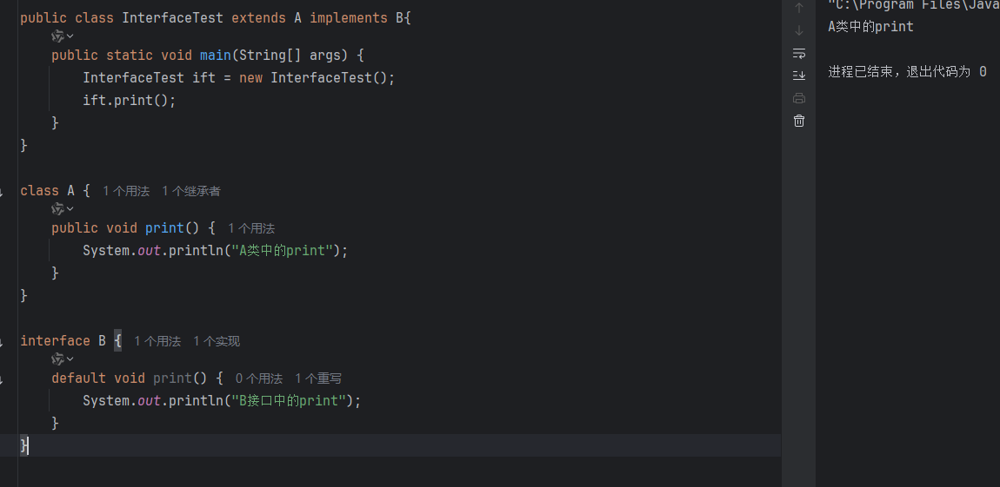
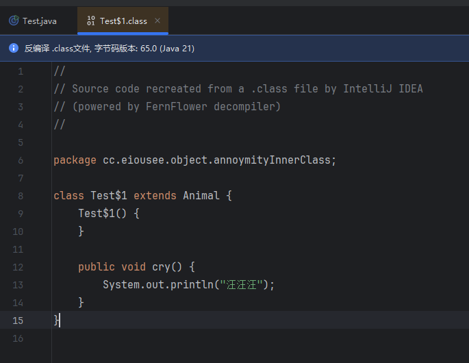

# Java Medium

`更新时间：2024-10-14`

注释解释：

- `<>`必填项，必须在当前位置填写相应数据

- `{}`必选项，必须在当前位置选择一个给出的选项

- `[]`可选项，可以选择填写或忽略

*注：该笔记内的可选项和参数均不完整，如有需要，请查询相关手册*

---

## 面向对象编程

面向对象编程是指在编程中，将问题分解为多个对象，对象之间通过消息传递来完成

### 对象

对象是现实世界或抽象概念的抽象表示，对象具有属性和行为，对象之间可以相互通信，对象之间可以相互交互。比如可以把人看作是一个对象，人的属性有名字、年龄、性别等，而人的行为有说话、吃饭、睡觉等

### 类

类就是对象的抽象模板，类定义了对象的属性和行为，类可以创建出多个对象，每个对象都是类的实例。比如人类是一个类，而张三、李四、王五都是人类的实例，即对象

## 对象

### 创建类

```java
[Accessibility] class className {
    // 属性
    [Accessibility] dataType attributeName;

    // 方法
    [Accessibility behaviorCharacteristic] returnedValueType methodName([parameterType parameterName]) {
    methodBody;
    }
}
```

**示例**

```java
public class Object {
    public static void main(String[] args) {

    }
}

// 定义类
class Human{
    // 定义属性
    String name;
    int age;
    String gender;
    String country;

    // 定义方法
    void eat(){
        System.out.println("吃东西");
    }
    void sleep(){
        System.out.println("睡觉");
    }
}
```

### 创建对象与使用

```java
// 创建对象
ClassName objectName = new ClassName();
// 为对象属性赋值
objectName.attributeName = "value";
// 调用对象方法
objectName.methodName();
```

**示例**

```java
public class Object {
    public static void main(String[] args) {
        Human ZhangSan = new Human();
        ZhangSan.name = "张三";
        ZhangSan.age = 18;
        ZhangSan.gender = "男";
        ZhangSan.country = "中国";
        
        ZhangSan.info();
    }
}

// 定义类
class Human{
    // 定义属性
    String name;
    int age;
    String gender;
    String country;

    // 定义方法
    void info() {
        System.out.println("姓名：" + name);
        System.out.println("年龄：" + age);
        System.out.println("性别：" + gender);
        System.out.println("国籍：" + country);
    }
}
```

> 

## 构造器

构造器是类的一个特殊方法，用于创建和初始化对象，构造器与类名相同，并且没有返回值，构造器在创建对象时自动调用，如果没有显示调用，则默认调用无参构造器

**声明构造器**

```java
class ClassName{
    // 构造器
    ClassName(){
    }
}
```

**示例**

```java
public class Constructor {
    public static void main(String[] args) {
        newConstructor constructor = new newConstructor();
    }
}

class newConstructor{
    newConstructor(){
        System.out.println("构造器在对象被创建时会自动调用");
    }
}
```

> 

### 构造器重载

构造器和方法一样可以通过不同的参数来达到重载的效果，即当创建对象时传入的参数不同，对象本身调用的构造器也不同

**示例**

```java
public class Constructor {
    public static void main(String[] args) {
        newConstructor constructor0 = new newConstructor();
        newConstructor constructor1 = new newConstructor(1);
        newConstructor constructor2 = new newConstructor("hello");
    }
}

class newConstructor{
    newConstructor(){
        System.out.println("无参构造器");
    }

    newConstructor(int a){
        System.out.println("int类型参构造器");
    }

    newConstructor(String a){
        System.out.println("String类型参构造器");
    }
}
```

> 

## this关键字

this关键字是当前对象的引用，通过this关键字可以访问当前对象的属性、方法、构造器等，this关键字可以省略，但建议使用

**示例**

```java
class Human{
    String name;

    Human() {
        // this关键字
        // 等价于 name = "张三";
        this.name = "张三";
    }
}
```

this的用法之一是解决类中的属性与参数重名问题

**错误示例**

```java
public class ThisKeyword {
    public static void main(String[] args) {
        HumanBeing humanbeing = new HumanBeing("小明");
        humanbeing.info("王老师");
    }
}

class HumanBeing {
    HumanBeing(String name) {
        name = name;
    }
    void info(String name) {
        System.out.printf("我是%s，我的老师是%s", name, name);
    }
}
```

> 

在上面的程序中，由于参数与属性重名，导致程序运行出错

**正确示例**

```java
public class ThisKeyword {
    public static void main(String[] args) {
        HumanBeing humanbeing = new HumanBeing("小明");
        humanbeing.info("王老师");
    }
}

class HumanBeing {
    String name;

    HumanBeing(String name) {
        this.name = name;
    }
    void info(String name) {
        System.out.printf("我是%s，我的老师是%s", this.name, name);
    }
}
```

> 

## 封装

封装是面向对象编程的基本概念，封装是把数据（属性）和操作数据的方法（行为）封装到一起，形成一个完整的对象，封装是面向对象的三大特性之一，封装是隐藏对象的细节，只对外暴露对象对外的行为

### private关键字

封装的一大特性就是需要隐藏对象中的细节，在Java中，通过private关键字可以做到对属性的封装，private关键字修饰的属性只能在本类中访问，外部类无法访问

```java
public class PrivateKeyword {
    public static void main(String[] args) {
        Human0 ZhangSan = new Human0();
        ZhangSan.name = "张三";
        ZhangSan.age = 18;
        
        ZhangSan.info();
    }
}

class Human0 {
    String name;
    private int age;

    public void info() {
        System.out.println("我是" + name + "，今年" + age + "岁");
    }
}
```

> 

上面的程序中，Human0类的属性age被设置为private，外部类无法访问，达到了隐藏的目的，如果需要赋值，可以自定义一个public方法

```java
public class PrivateKeyword {
    public static void main(String[] args) {
        Human0 ZhangSan = new Human0();
        ZhangSan.name = "张三";

        ZhangSan.setAge(18);
        ZhangSan.info();
    }
}

class Human0 {
    String name;
    private int age;

    public void info() {
        System.out.println("我是" + this.name + "，今年" + this.age + "岁");
    }

    public void setAge(int age) {
        this.age = age;
    }
}
```

> 

*注：对于拥有private的属性，外部类无法访问，但可以通过自定义方法读取，如上面程序中的info()方法，使用参数访问了age属性*

## Javabean （实体）

Javabean是Java中一个重要的概念，它指的是一个类，该类封装了属性和行为，并且这些属性是私有的，只有getter和setter方法可以访问，Javabean是Java中实现封装的方式，通过封装，可以保护对象的数据安全，同时，Javabean还可以被其他类继承，实现复用

实际开发中，实体对象一般只负责封装数据，不包含任何业务逻辑，只提供getter和setter方法，业务处理交给其他的类的方法来实现

**示例**

Student类
```java
public class Student {
    private String name;
    private int age;
    private int Chinese;
    private int Math;

    public Student() {}

    public Student(String name, int age, int chinese, int math) {
        this.name = name;
        this.age = age;
        this.Chinese = chinese;
        this.Math = math;
    }

    public String getName() {
        return this.name;
    }

    public void setName(String name) {
        this.name = name;
    }

    public int getAge() {
        return this.age;
    }

    public void setAge(int age) {
        this.age = age;
    }

    public int getChinese() {
        return this.Chinese;
    }

    public void setChinese(int chinese) {
        this.Chinese = chinese;
    }

    public int getMath() {
        return this.Math;
    }

    public void setMath(int math) {
        this.Math = math;
    }
}
```

Service类
```java
public class Service {
    private Student stu;

    public Service() {}

    public Service(Student stu) {
        this.stu = stu;
    }

    public void totalGrades() {
        System.out.printf("学生 %s 的总成绩为 %d\n", this.stu.getName(), this.stu.getChinese() + this.stu.getMath());
    }

    public void totalGrades(Student stu) {
        System.out.printf("学生 %s 的总成绩为 %d\n", stu.getName(), stu.getChinese() + stu.getMath());
    }

    public void averageGrades() {
        System.out.printf("学生 %s 的平均成绩为 %d\n", this.stu.getName(), (this.stu.getChinese() + this.stu.getMath()) / 2);
    }

    public void averageGrades(Student stu) {
        System.out.printf("学生 %s 的平均成绩为 %d\n", stu.getName(), (stu.getChinese() + stu.getMath()) / 2);
    }
}
```

Main类
```java
public class Main {
    public static void main(String[] args) {
        Student stu_1 = new Student("张三", 18, 88, 74);
        Student stu_2 = new Student();

        stu_2.setName("李四");
        stu_2.setAge(19);
        stu_2.setChinese(67);
        stu_2.setMath(92);

        Service service_1 = new Service(stu_1);
        Service service_2 = new Service();

        service_1.averageGrades();
        service_1.totalGrades();
        service_2.averageGrades(stu_2);
        service_2.totalGrades(stu_2);
    }
}
```

> 

*注：在上面的程序中，我使用了方法的重载，例如Service类中的averageGrades()方法，用户可以选择是否在创建Service对象时传入Student对象，如果传入，在调用averageGrades()方法时，就不需要再传入Student对象；如果在创建Service对象时没有传入Student对象，则可以直接调用averageGrades()方法，然后在该方法中传入指定的Student对象*

## static关键字

static关键字可以修饰变量和函数，static变量和static方法可以直接通过类名访问，而不需要创建对象。对于有static关键字修饰的变量，如果修改了其值，其他对象也会被修改，因为static变量由类所有，类在每次运行时只创建一次，所有由该类创建的对象共享类的属性和方法

### static变量

**示例**

```java
public class StaticKeyword {
    public static void main(String[] args) {
        Car ford = new Car();
        ford.brand = "Ford";
        ford.price = 200000;
        System.out.println(ford.brand + " 花费 " + ford.price);

        Car.price = 300000;
        System.out.println(ford.brand + " 花费 " + ford.price);

        Boat.purchase();
    }
}

class Car {
    static int price;
    String brand;
}

class Boat {
    static void purchase() {
        System.out.println("我又买了艘船");
    }
}
```

> 

*在上面的程序中，先对ford对象的price属性进行了赋值，而后又对Car类的price属性进行了赋值，此时，因为ford对象是Car类的对象，所以在调用ford.price时的值也发生了改变。程序中没有创建Boat类的对象，但是因为Boat类中的purchase()方法被static修饰，所以可以直接通过类名Boat调用该方法*

### static方法

**示例**

```java
public class StaticKeyword {
    public static void main(String[] args) {
        // 调用printOne
        Printer.printOne();

        // 调用printTwo
        Printer printer = new Printer();
        printer.printTwo();
    }
}

class Printer {
    static void printOne() {
        System.out.println(1);
    }

    void printTwo() {
        System.out.println(2);
    }
}
```

> 

### 定义工具类

工具类一般只包含静态方法，不包含实例方法，工具类的方法都是公共的，可以直接通过类名调用，而不需要创建对象，工具类的构造器是私有的，不能被实例化

Menu类
```java
public class Menu {
    public static void main(String[] args) {
        int a = 20;
        int b = 10;

        System.out.println(Calculator.sum(a, b));
        System.out.println(Calculator.sub(a, b));
    }
}
```

Calculator类
```java
public class Calculator {
    // 私有化构造器
    private Calculator() {};

    public static int sum(int a, int b) {
        return a + b;
    }

    public static int sub(int a, int b) {
        return a - b;
    }
}
```

> 

### static关键字注意事项

1. 静态方法中可以访问静态成员，不能直接访问实例成员

2. 实例方法中即可以访问静态成员，也可以访问实例成员

3. 静态方法中不能使用this关键字，因为静态方法属于类，而不是对象，所以不能通过this关键字访问对象

## 综合案例：电影信息展示

设计一个电影信息展示的小程序，程序默认展示目前所有的电影信息，用户可以输入id查询指定电影信息

Menu类
```java
import java.util.Scanner;

public class Menu {
    public static void main(String[] args) {
        Movie[] movies = new Movie[]{
                new Movie(1, "《罗小黑战记》", "山新", "2019"),
                new Movie(2, "《让子弹飞》", "姜文", "2010"),
                new Movie(3, "《坏蛋联盟》", "马克·马龙", "2022"),
                new Movie(4, "《天气之子》", "醍醐虎汰朗", "2019"),
                new Movie(5, "《海王》", "杰西卡·罗素", "2013")
        };

        MovieOperator mo = new MovieOperator(movies);

        while (true) {
            System.out.println("当前电影列表：");
            mo.showInfo();
            System.out.println("-------------------------------");
            System.out.println("请输入您接下来的操作：");
            System.out.println("1.查询电影");
            System.out.println("2.退出");
            System.out.println("-------------------------------");

            Scanner sc = new Scanner(System.in);
            int option = sc.nextInt();

            switch (option) {
                case 1:
                    System.out.println("请输入您要查询的电影ID：");
                    int id = sc.nextInt();
                    mo.queryById(id);
                    System.out.println("-------------------------------");
                    break;
                case 2:
                    System.out.println("感谢您的使用！");
                    System.exit(0);
                    break;
                default:
                    System.out.println("输入有误，请重新输入！");
            }
        }
    }
}
```

Movie类
```java
public class Movie {
    private int id;
    private String name;
    private String actor;
    private String year;

    public Movie() {}

    public Movie(int id, String name, String actor, String year) {
        this.id = id;
        this.name = name;
        this.actor = actor;
        this.year = year;
    }

    public String getYear() {
        return year;
    }

    public void setYear(String year) {
        this.year = year;
    }

    public String getActor() {
        return actor;
    }

    public void setActor(String actor) {
        this.actor = actor;
    }

    public String getName() {
        return name;
    }

    public void setName(String name) {
        this.name = name;
    }

    public int getId() {
        return id;
    }

    public void setId(int id) {
        this.id = id;
    }
}
```

MovieOperator类
```java
public class MovieOperator {

    private Movie[] movie;

    public MovieOperator() {}

    public MovieOperator(Movie[] movie) {
        this.movie = movie;
    }

    public void showInfo() {
        for (Movie m : this.movie) {
            System.out.println(m.getId() + " " + m.getName() + " " + m.getActor() + " " + m.getYear());
        }
    }
    public void showInfo(Movie[] movie) {
        for (Movie m : movie) {
            System.out.println(m.getId() + " " + m.getName() + " " + m.getActor() + " " + m.getYear());
        }
    }

    public void queryById(int id) {
        for (Movie m : this.movie) {
            if (m.getId() == id) {
                System.out.println(m.getId() + " " + m.getName() + " " + m.getActor() + " " + m.getYear());
                return;
            }
        }
    }

    public void queryById(Movie[] movie, int id) {
        for (Movie m : movie) {
            if (m.getId() == id) {
                System.out.println(m.getId() + " " + m.getName() + " " + m.getActor() + " " + m.getYear());
                return;
            }
        }
    }
}
```

> 

## 继承

继承是面向对象编程中一个重要的概念，它允许子类继承父类的属性和方法，并添加新的属性和方法，从而实现代码的重用和扩展。

**基本语法**

`class A extends B`

**示例**

人类都有的属性姓名、年龄、性别，老师和学生属于人类，而老师拥有自己的属性教学科目，学生拥有自己的属性学号、班级等

Human类
```java
public class Human {
    private String name;
    private int age;
    private String gender;
}
```

Teacher类
```java
public class Teacher extends Human{
    private String subject;
}
```

Student类
```java
public class Student extends Human{
    private int id;
    private int scores;
}
```

**继承的注意点**

1. 子类可以继承父类的非私有成员

2. 子类可以访问父类的私有成员，但是不能修改

### 案例

定义一个父类Animal，包含属性：名字，颜色，年龄，性别，还有两个方法：eat()和sleep()。然后派生出子类Dog和Cat，重写父类的方法，使得子类可以输出不同的信息。

Main类
```java
public class Main {
    public static void main(String[] args) {
        Dog dog = new Dog("旺财", "黄色", 3, "雄性", 9);
        dog.showInfo();
        dog.eat();
        dog.sleep();
        dog.showLoyalty();

        System.out.println("=======================");

        Cat cat = new Cat("小花", "白色", 2, "雌性", 8);
        cat.showInfo();
        cat.eat();
        cat.sleep();
        cat.showLikability();
    }
}
```

Animal类
```java
public class Animal {
    private String name;
    private String color;
    private int age;
    private String gender;

    public Animal() {}

    public Animal(String name, String color, int age, String gender) {
        this.name = name;
        this.color = color;
        this.age = age;
        this.gender = gender;
    }

    public String getName() {
        return name;
    }
    public void eat() {}

    public void sleep() {}

    public void showInfo() {
        System.out.printf("%s is %s, %s, %d years old, %s", name, color, gender, age, "");
        System.out.println();
    }
}
```

Dog类
```java
public class Dog extends Animal{

    public Dog() {
        super();
    }

    public Dog(String name, String color, int age, String gender, int loyalty) {
        super(name, color, age, gender);
        this.loyalty = loyalty;
    }

    private int loyalty;

    public void eat(){
        System.out.printf("Dog %s is eating!\n", getName());
    }

    public void sleep(){
        System.out.printf("Dog %s is sleeping!\n", getName());
    }

    public void showLoyalty(){
        System.out.printf("Dog %s's loyalty is %d\n", getName(), loyalty);
    }
}
```

Cat类
```java
public class Cat extends Animal{

    public Cat() {
        super();
    }

    public Cat(String name, String color, int age, String gender, int likability) {
        super(name, color, age, gender);
        this.likability = likability;
    }

    private int likability;
    
    public void eat(){
        System.out.printf("Cat %s is eating!\n", getName());
    }

    public void sleep(){
        System.out.printf("Cat %s is sleeping!\n", getName());
    }

    public void showLikability(){
        System.out.printf("Cat %s's likability is %d\n", getName(), likability);
    }
}
```

> 

### 继承的特点

- `单继承`：一个类只能有一个父类，但可以有多个子类

- `多层继承`：子类可以继续被继承

- `祖宗类`：Java中所有类都继承于`Object`类，所以所有类都有一个共同的父类

- `就近原则`：继承关系中，如果子类和父类中存在同名的成员变量或方法，则子类中的成员变量或方法优先访问

### 方法重写

方法重写指的是子类重写父类的方法，使得子类的方法具有和父类方法不同的功能

**注意事项**

1. 在子类中进行方法重写时，应该在方法的声明中添加`@Override`注解，以提醒编译器进行方法重写检查

2. 方法重写时，子类的方法必须与父类中的方法具有相同的返回类型、参数列表和访问权限修饰符

3. 方法重写时，子类的访问权限应该不低于父类的访问权限

4. 重写方法的返回值类型必须小于等于父类

5. 私有方法、静态方法不能被重写

### 方法重写应用场景

- 打印对象：

如果直接打印一个对象，获得的只是对象的地址，如果想要获得对象的详细信息，需要重写`toString()`方法

**未重写**

Main类
```java
public class Main {
    public static void main(String[] args) {
        Student sc = new Student("小王", 18, "男");

        System.out.println(sc);
    }
}
```

Student类
```java
public class Student {
    private String name;
    private int age;

    public String getName() {
        return name;
    }

    public void setName(String name) {
        this.name = name;
    }

    public int getAge() {
        return age;
    }

    public void setAge(int age) {
        this.age = age;
    }

    public String getGender() {
        return gender;
    }

    public void setGender(String gender) {
        this.gender = gender;
    }

    private String gender;

    public Student() {}

    public Student(String name, int age, String gender) {
        this.name = name;
        this.age = age;
        this.gender = gender;
    }
}
```

> 

**重写后**

Main类
```java
public class Main {
    public static void main(String[] args) {
        Student sc = new Student("小王", 18, "男");

        System.out.println(sc);
    }
}
```

Student类
```java
public class Student {
    private String name;
    private int age;

    public String getName() {
        return name;
    }

    public void setName(String name) {
        this.name = name;
    }

    public int getAge() {
        return age;
    }

    public void setAge(int age) {
        this.age = age;
    }

    public String getGender() {
        return gender;
    }

    public void setGender(String gender) {
        this.gender = gender;
    }

    private String gender;

    public Student() {}

    public Student(String name, int age, String gender) {
        this.name = name;
        this.age = age;
        this.gender = gender;
    }

    @Override
    public String toString() {
        return "姓名：" + name + "，年龄：" + age + "，性别：" + gender;
    }
}
```

> 

### 子类构造器的注意事项

1. 子类构造器必须调用父类构造器，否则编译器会报错

2. 子类构造器必须先调用父类构造器，再调用子类构造器

### this()调用兄弟构造器

在创建多个对象时，如果有一个或多个构造器参数一致，可以重载构造器，使用this关键字调用兄弟构造器

Main类
```java
public class Main {
    public static void main(String[] args) {
        Student sc = new Student("小王", 18, "男");
        Student sc1 = new Student("小张", 21);
        Student sc2 = new Student("小李", 19);

        System.out.println(sc);
        System.out.println(sc1);
        System.out.println(sc2);
    }
}
```

Student类
```java
public class Student {
    private String name;
    private int age;

    public String getName() {
        return name;
    }

    public void setName(String name) {
        this.name = name;
    }

    public int getAge() {
        return age;
    }

    public void setAge(int age) {
        this.age = age;
    }

    public String getGender() {
        return gender;
    }

    public void setGender(String gender) {
        this.gender = gender;
    }

    private String gender;

    public Student() {}

    public Student(String name, int age) {
        this(name, age, "男");
    }

    public Student(String name, int age, String gender) {
        this.name = name;
        this.age = age;
        this.gender = gender;
    }

    @Override
    public String toString() {
        return "姓名：" + name + "，年龄：" + age + "，性别：" + gender;
    }
}
```

> 

## 权限修饰符

Java中有四种权限修饰符，分别是public、private、protected和default。

- `public`：公开，表示可以在任意位置访问

- `private`：私有，表示只能在当前类中访问

- `protected`：受保护，表示只能在当前类、子类和同一个包中访问

- `default`：默认，或无，表示只能在当前包中访问

## 多态

多态是面向对象编程中一个很重要的概念，它指的是同一个方法可以有不同的实现，根据不同的对象，调用不同的方法。在Java中，多态有对象多态和行为多态

Main类
```java
public class Main {
    public static void main(String[] args) {
        // 对象多态
        Animal wolf = new Wolf();
        Animal turtle = new Turtle();

        // 行为多态
        wolf.run();
        turtle.run();

        // 注意：属性没有多态
        System.out.println(wolf.name);
        System.out.println(turtle.name);
    }
}
```

Animal类
```java
public class Animal {
    public String name = "动物";

    public void run() {
        System.out.println("动物跑");
    }
}
```

Wolf类
```java
public class Wolf extends Animal{
    public String name = "狼";

    @Override
    public void run() {
        System.out.println("狼跑得很快");
    }
}
```

Turtle类
```java
public class Turtle extends Animal{
    public String name = "乌龟";

    @Override
    public void run() {
        System.out.println("乌龟爬得很慢");
    }
}
```

> 

### 多态的特点

1. 多态可以解耦合，方便维护和修改

2. 在定义一个方法时，参数可以使用父类的数据类型，这样在调用时，可以传入所有子类对象

3. 多态下不能直接访问子类特有的方法或属性

### 多态下的类型转换

为了解决多态下无法直接访问子类特有的方法或属性的问题，可以使用强制类型转换，将父类转化为子类

Main类
```java
public class Main {
    public static void main(String[] args) {
        // 多态下的类型转换
        Animal wolf = new Wolf();
        System.out.println(wolf.name);

        Wolf wolf2 = (Wolf) wolf;
        wolf2.eat();
        System.out.println(wolf2.name);
    }
}
```

Animal类
```java
public class Animal {
    public String name = "动物";
}
```

Wolf类
```java
public class Wolf extends Animal{
    public String name = "狼";
    public void eat() {
        System.out.println("狼吃肉");
    }
}
```

> 

### instanceof 运算符

instanceof运算符用于判断一个对象是否是某个类的实例，或者该对象是否是某个类的子类的实例，Java建议，在对一个对象进行强制转换前，应该进行一次instanceof运算符的判断

Main类
```java
public class Main {
    public static void main(String[] args) {
        // instanceof 运算符
        Animal wolf = new Wolf();
        Animal turtle = new Turtle();

        behavior(wolf);
        behavior(turtle);
    }

    public static void behavior(Animal animal) {
        if (animal instanceof Wolf) {
            Wolf wolf = (Wolf) animal;
            wolf.eat();
        } else if (animal instanceof Turtle) {
            Turtle turtle = (Turtle) animal;
            turtle.crawl();
        }
    }
}
```

Animal类
```java
public class Animal {
    public String name = "动物";
}
```

Wolf类
```java
public class Wolf extends Animal{
    public String name = "狼";
    public void eat() {
        System.out.println("狼吃肉");
    }
}
```

Turtle类
```java
public class Turtle extends Animal{
    public String name = "乌龟";

    public void crawl() {
        System.out.println("乌龟爬行");
    }
}
```

> 

---

## 综合案例：加油站支付模块

某加油站为了吸引更过的车主，推出了如下活动，车主可以办理金卡或是银卡，卡片的信息包括车牌号码、车主姓名、电话号码、卡片余额。金卡办理时必须存入5000元及以上，银卡办理时必须存入2000元及以上，金卡支付时享受8折优惠，银卡支付时享受9折优惠，金卡消费满200元可以提供打印免费洗车票服务

Pay类
```java
import java.util.Scanner;

public class Pay {
    public static void main(String[] args) {
        Scanner sc = new Scanner(System.in);
        // 创建银卡
        Card card1 = new SilveryCard("川X·CE530", "张三", "13888888888", 2622);
        // 创建金卡
        Card card2 = new GoldenCard("川X·EB238", "李四", "13888888889", 9440);

        while (true) {
            System.out.println("请输入你要操作的业务：");
            System.out.println("1. 加油");
            System.out.println("2. 充值");
            System.out.println("3. 退出");
            int choice = sc.nextInt();

            switch (choice) {
                case 1:
                    pay(card1);
                    break;
                case 2:
                    deposit(card1);
                    break;
                case 3:
                    System.out.println("谢谢使用！");
                    return;
                default:
                    System.out.println("输入有误，请重新输入！");
            }
        }
    }

    public static void pay(Card card) {
        Scanner sc = new Scanner(System.in);
        System.out.println("请输入你要消费的金额：");
        double amount = sc.nextDouble();

        card.consume(amount);
    }

    public static void deposit(Card card) {
        Scanner sc = new Scanner(System.in);
        System.out.println("请输入你要充值的金额：");
        double amount = sc.nextDouble();

        card.deposit(amount);
        System.out.println("充值成功，当前余额" + card.getBalance());
    }
}
```

Card类
```java
import lombok.AllArgsConstructor;
import lombok.Data;
import lombok.NoArgsConstructor;

@Data
@NoArgsConstructor
@AllArgsConstructor
public class Card {
    // 车牌号码
    private String vehicleLicence;
    // 车主姓名
    private String hostName;
    //电话号码
    private String phoneNumber;
    // 余额
    private double balance;

    // 预存金额
    public void deposit(double amount) {
        this.balance += amount;
    }

    // 消费金额
    public void consume(double amount) {
        this.balance -= amount;
    }
}
```

GoldenCard类
```java
public class GoldenCard extends Card{

    public GoldenCard(String vehicleLicence, String hostName, String phoneNumber, double balance) {
        super(vehicleLicence, hostName, phoneNumber, balance);
    }

    @Override
    public void consume(double amount) {
        double discount = 0.8;

        if (getBalance() < amount * discount) {
            System.out.println("余额不足，请充值！");
            return;
        }

        setBalance(getBalance() - amount * discount);
        System.out.println("您消费 " + amount + " 元，实际支付 " + amount * discount + " 元");
        System.out.println("剩余余额 " + getBalance());

        if (amount * discount >= 200) {
            printTicket();
        } else System.out.println("您消费未满200元。");
    }

    private void printTicket() {
        System.out.println("您消费满200元，获得一张洗车票！");
    }
}
```

SilveryCard类
```java
public class SilveryCard extends Card{

    public SilveryCard(String vehicleLicence, String hostName, String phoneNumber, double balance) {
        super(vehicleLicence, hostName, phoneNumber, balance);
    }

    @Override
    public void consume(double amount) {
        double discount = 0.9;

        if (getBalance() < amount * discount) {
            System.out.println("余额不足，请充值！");
            return;
        }

        setBalance(getBalance() - amount * discount);
        System.out.println("您消费 " + amount + " 元，实际支付 " + amount * discount + " 元");
        System.out.println("剩余余额 " + getBalance());
    }
}
```

银卡
> 

金卡
> 

---

## final关键字

在Java中，final关键字可以用于修饰类、方法、变量等，其含义如下：

1. 修饰类：表示该类不能被继承，即该类是抽象类

2. 修饰方法：表示该方法不能被重写，即该方法是抽象方法

3. 修饰变量：表示该变量不能被修改，即该变量是常量

### final关键字的注意事项

1. final关键字修饰的变量必须在定义的时候赋值

2. 在方法的参数列表中使用final关键字修饰的参数，该参数的值不能被方法修改

3. final关键字修饰引用类型变量时，记录的是其地址值，其内容仍然可以被修改

**示例**

```java
public class FinalKeyword {
    public static void main(String[] args) {
        final int[] array = {1, 2, 3};
        // array = new int[]{4, 5, 6}; 报错
        array[0] = 4;
    }
}
```

## 设计模式

设计模式是指一个问题通常有多种解决方案，但只有一种最高效的解决方案，这种解决方案就称为设计模式，在程序设计语言中，一共有大约20多种设计模式

## 单例类设计模式

单例类指的是一个类只能创建一个实例的对象，并且该类只能有一个实例

**具体实现**

- 饿汉式单例：

1. 私有化构造函数，防止外部创建实例

2. 定义一个私有静态属性，存储一个类对象

3. 定义一个静态方法，返回私有静态属性

```java
public class Singleton{
    private static final Singleton instance = new Singleton();

    private Singleton() {}

    public static Singleton getInstance() {
        return instance;
    }
}
```

- 懒汉式单例：

1. 私有化构造函数，防止外部创建实例

2. 定义一个私有静态属性

3. 定义一个静态方法，保证返回的是同一个对象

```java
public class Singleton{
    private static Singleton instance;

    private Singleton() {}

    public static Singleton getInstance() {
        if (instance == null) {
            instance = new Singleton();
        }
        return instance;
    }
}
```

## 枚举类

枚举类是特殊的单例类，它不能被继承，并且枚举类中的每个常量都是枚举类的实例

```java
Modifiers enum class Name {
    // 枚举常量
    Constants;
    // 其他成员
    Others;
}
```

在枚举常量中，每个常量实际上都是一个枚举对象，并且每个枚举对象只能被实例化一次，如果只存在一个枚举常量，该枚举类可以被认为是一个单例类

原始类
```java
public enum Enum1 {
    X, Y, Z;
}
```

反编译
```java
public final class Enum1 extends java.lang.Enum<Enum1> {
  public static final Enum1 X; // = new Enum1();
  public static final Enum1 Y; // = new Enum1();
  public static final Enum1 Z; // = new Enum1();
  public static Enum1[] values();
  public static Enum1 valueOf(java.lang.String);
  static {};
}
```

从反编译文件可以看出，每个定义的枚举常量，实际上都是枚举类的一个实例，并且每个枚举常量都是静态的，并且每个枚举常量都有final关键字。同时，在编译枚举类的同时，编译器自动生成了两个静态方法，`values()`返回所有的枚举常量，`valueOf(String)`可以将传入的字符串转换为对应的枚举常量

```java
public enum Enum1 {
    X, Y, Z;
}

class Test {
    public static void main(String[] args) {
        Enum1[] values = Enum1.values();

        for (Enum1 e : values) {
            System.out.println(e);
        }
    }
}
```

> 

### 枚举类的常见应用场景

1. 枚举类适合做信息的分类和标志

Test类
```java
public class Test {
    public static void main(String[] args) {
        // 常量无法限制参数
        move1(ConstDirection.LEFT);
        move1(3);

        // 枚举可以限制参数
        move2(Direction.UP);
        // move2(3); 报错
    }

    public static void move1 (int direction) {
        switch (direction) {
            case ConstDirection.UP -> System.out.println("UP");
            case ConstDirection.DOWN -> System.out.println("DOWN");
            case ConstDirection.LEFT -> System.out.println("LEFT");
            case ConstDirection.RIGHT -> System.out.println("RIGHT");
            default -> System.out.println("ERROR");
        }
    }

    public static void move2 (Direction direction) {
        switch (direction) {
            case UP -> System.out.println("UP");
            case DOWN -> System.out.println("DOWN");
            case LEFT -> System.out.println("LEFT");
            case RIGHT -> System.out.println("RIGHT");
            default -> System.out.println("ERROR");
        }
    }
}
```

ConstDirection类
```java
public class ConstDirection {
    public static final int UP = 0;
    public static final int DOWN = 1;
    public static final int LEFT = 2;
    public static final int RIGHT = 3;
}
```

Direction类
```java
public enum Direction {
    UP, DOWN, LEFT, RIGHT;
}
```

## 抽象类

抽象类是定义抽象方法的类，抽象类不能被实例化，但可以继承抽象类，并且可以定义非抽象方法
### 抽象方法

抽象方法没有方法体，它只能定义在抽象类中，并且必须被重写，重写时必须使用`@Override`注解，否则编译器会报错

### 抽象类的注意事项

1. 抽象类不能被实例化，但可以继承抽象类

2. 抽象类中可以没有抽象方法，但有抽象方法的类必须是抽象类

3. 抽象类中可以有所有类中的成员

4. 子类继承抽象类时，必须重写抽象类中的所有抽象方法，否则子类必须声明为抽象类

5. 抽象类和方法使用`abstract`关键字修饰

**示例**

Main类
```java
public class Main {
    public static void main(String[] args) {
        Animal animal0 = new Dog();
        Animal animal1 = new Cat();

        animal0.eat();
        animal1.eat();
    }
}
```

Animal类
```java
public abstract class Animal {
    public abstract void eat();
}
```

Dog类
```java
public class Dog extends Animal{

    @Override
    public void eat() {
        System.out.println("Dog is eating");
    }
}
```

Cat类
```java
public class Cat extends Animal{
    @Override
    public void eat() {
        System.out.println("Cat is eating");
    }
}
```

### 模板方法设计模式

模板方法设计模式是一种软件设计模式，它定义了一个算法的骨架，而将一些步骤延迟到子类中，模板方法使得子类可以不改变一个算法的结构即可重定义该算法的某些特定步骤

**示例**

老师和学生都需要写作一篇作文，作文都有三段，第一段和第三段一样，而第二段不同，所以可以定义一个模板方法，让老师和学生继承该模板方法，重写第二段的内容

Main类
```java
public class Main {
    public static void main(String[] args) {
        Write teacher = new Teacher();
        teacher.write();

        System.out.println();

        Write student = new Student();
        student.write();
    }
}
```

Write类
```java
public abstract class Write {

    public final void write() {
        System.out.println("\t\t\tMy Favorite Pet");
        System.out.println("My favorite pet is my dog.");
        writeParagraphTwo();
        System.out.println("My dog is very friendly.");
    }

    public abstract void writeParagraphTwo();
}
```

Teacher类
```java
public class Teacher extends Write{
    @Override
    public void writeParagraphTwo() {
        System.out.println("He's called Captain, also my family.");
    }
}
```

Student类
```java
public class Student extends Write{
    @Override
    public void writeParagraphTwo() {
        System.out.println("His name is Pudding, he likes playing balls with me.");
    }
}
```

> 

*注：模板方法一般使用final关键字修饰，防止子类重写*

## 接口

在Java中，接口使用`interface`关键字来声明，接口类中只能有常量和抽象方法，接口中的常量默认存在 `public static final` 关键字，接口中的方法也默认存在 `public abstract` 关键字。接口类似于抽象类，接口无法实例化，但可以由多个类实现，实现用 `implements` 关键字

**基本语法**

接口类
```java
interface InterfaceName {
    // 常量和抽象方法
    ConstantName = value;
    void methodName();
}
```

实现类
```java
class ClassName implements InterfaceName, InterfaceName2, ... {
    @Override
    public void methodName() {}
}
```

### 接口的好处

1. 弥足了单继承的不足，一个类可以实现多个接口，使类的角色更多，功能更强大

**示例**

一个学生继承People类，同时可以实现Driver、Son接口

People类
```java
public class People {
    private String name;
    private int age;
    private String gender;

    public void eat() {}

    public void sleep() {}
}
```

Driver接口
```java
interface Driver {
    int drivingYears = 0;
    String drivingLicense = "";

    void drive();
}
```

Son接口
```java
interface Son {
    String father = "";
    String mother = "";

    void callFather();
}
```

Student类
```java
public class Student extends People implements Driver, Son {
    @Override
    public void drive() {}

    @Override
    public void callFather() {}
}
```

2. 让程序可以面向接口编程，程序员可以灵活方便地切换各种业务实现

## 综合案例：学生信息打印

请设计一个班级学生的信息管理模块，学生的数据有：姓名、性别、成绩，该模块有两个功能，其一是打印全班所有人的信息，其二是打印全班所有人的平均成绩。注意，以上两个功能需要两套不同的方案完成，请各自做成一个接口供实现

Test类
```java
public class Test {
    public static void main(String[] args) {
        Student[] students = {
                new Student("张三", "男", 88),
                new Student("李四", "男", 81),
                new Student("王五", "女", 92),
                new Student("赵六", "女", 80),
                new Student("钱七", "男", 77)
        };

        // 调用A方案的方法
        Scheme sc = new MethodA();
        sc.printInfo(students);
        sc.printScore(students);

        // 调用B方案的方法
        sc = new MethodB();
        sc.printInfo(students);
        sc.printScore(students);
    }
}
```

Student类
```java
import lombok.AllArgsConstructor;
import lombok.Data;
import lombok.NoArgsConstructor;

@Data
@AllArgsConstructor
@NoArgsConstructor
public class Student {
    private String name;
    private String gender;
    private int score;
}
```

Scheme接口
```java
public interface Scheme {
    void printInfo(Student[] students);

    void printScore(Student[] students);
}
```

MethodA类
```java
public class MethodA implements Scheme{

    /***
     * 打印学生信息方法
     * 打印所有学生的基本信息
     * Student[] students 待打印学生信息数组
     */
    @Override
    public void printInfo(Student[] students) {
        for (Student student : students) {
            System.out.println(student.toString());
        }
    }

    /***
     * 打印学生成绩方法
     * 打印所有学生的平均成绩
     * Student[] students 待打印学生成绩数组
     */
    @Override
    public void printScore(Student[] students) {
        double sum = 0;

        for (Student student : students) {
            sum += student.getScore();
        }
        System.out.println("平均成绩为：" + sum / students.length);
    }
}
```

MethodB类
```java
public class MethodB implements Scheme{

    /***
     * 打印学生信息方法
     * 打印所有学生的基本信息，并输出男生和女生的个数
     * Student[] students 待打印学生信息数组
     */
    @Override
    public void printInfo(Student[] students) {
        int male = 0;
        int female = 0;

        for (Student student : students) {
            System.out.println(student.toString());
            if (student.getGender().equals("男")) {
                male++;
            } else {
                female++;
            }
        }
        System.out.println("男生个数：" + male);
        System.out.println("女生个数：" + female);
    }

    /***
     * 打印学生成绩方法
     * 打印所有学生的平均成绩，并输出最高分和最低分
     * Student[] students 待打印学生成绩数组
     */
    @Override
    public void printScore(Student[] students) {
        double sum = 0;
        double max = students[0].getScore();
        double min = students[0].getScore();

        for (Student student : students) {
            sum += student.getScore();
            if (student.getScore() > max) {
                max = student.getScore();
            }
            if (student.getScore() < min) {
                min = student.getScore();
            }
        }
        System.out.println("平均成绩：" + sum / students.length);
        System.out.println("最高分：" + max);
        System.out.println("最低分：" + min);
    }
}
```

> 

*注：接口的命名规则一般为：接口需求 + Inter，实现类的命名规则一般为：接口名+Impl，如上文中的学生信息打印接口，应该命名为`StudentDataInter`，而实现类则命名为`StudentDataInterImpl`*

## JDK8之后的接口

在JDK8之后，接口定义方法时允许使用关键字`default`、`private`和`static`定义实例方法

- `default`：普通实例方法，调用需要实现类对象

- `private`：私有实例方法，调用需要接口类中其他的实例方法

- `static`：静态实例方法，可以直接通过接口调用

**接口和抽象类区别**

1. 接口和接口之间可以多继承

    - 类与类：单继承，一个类只能继承一个父类

    - 类与接口：多实现，一个类可以同时实现多个接口

    - 接口与接口：多继承，一个接口可以继承多个接口

2. 在多继承的接口中，如果出现方法签名冲突，则此时既不支持多继承，也不支持多实现

    - 方法签名冲突：方法名相同，返回值类型不同

    > 

3. 一个类继承了父类，又实现了接口，如果父类中的接口有同名的默认方法，实现类会优先用父类的

    > 

4. 一个类实现了多个接口，如果多个接口中存在同名的默认方法，可以不冲突，这个类重写该方法即可

*注：多个接口中存在同名的默认方法，如果要指定一个调用，可以使用`接口名.super.方法名`的形式*

## 智能家居控制系统

设计一个智能家居控制系统，可以让用户选择要控制的家用设备，并可以对它们进行打开或关闭操作

Test类
```java
import java.util.Scanner;

public class Test {
    public static void main(String[] args) {
        Furniture[] furnitures = {
                new AirConditioner("美的空调", false),
                new Television("TCL电视", false),
                new WashingMachine("海尔洗衣机", false),
                new Lamp("长虹灯", false)
        };

        Controller controller = Controller.getInstance();
        controller.showAll(furnitures);

        Scanner sc = new Scanner(System.in);
        while (true) {
            System.out.println("请输入要操作的设备序号：");
            int index = sc.nextInt() - 1;
            controller.press(furnitures[index]);
            controller.showAll(furnitures);
            System.out.println("是否继续？(y/n)");
            String input = sc.next();
            if (input.equals("n")) {
                break;
            }
        }
    }
}
```

Furniture类
```java
import lombok.AllArgsConstructor;
import lombok.Data;
import lombok.NoArgsConstructor;

@Data
@NoArgsConstructor
@AllArgsConstructor
public abstract class Furniture implements Operator{
    private String name;
    private boolean isOn = false;

    public void press() {
        isOn = !isOn;
        System.out.println(name + " is " + (isOn ? "on" : "off"));
        System.out.println("==========================");
    }
}
```

AirConditioner类
```java
public class AirConditioner extends Furniture{

    public AirConditioner(String name, boolean isOn) {
        super(name, isOn);
    }
}
```

Television类
```java
public class Television extends Furniture{

    public Television(String name, boolean isOn) {
        super(name, isOn);
    }
}
```

WashingMachine类
```java
public class WashingMachine extends Furniture{

    public WashingMachine(String name, boolean isOn) {
        super(name, isOn);
    }
}
```

Lamp类
```java
public class Lamp extends Furniture{

    public Lamp(String name, boolean isOn) {
        super(name, isOn);
    }
}
```

Operator接口
```java
public interface Operator {
    void press();
}
```

Controller类
```java
public class Controller {
    private static Controller instance;

    private Controller() {}

    public static Controller getInstance() {
        if (instance == null) {
            instance = new Controller();
        }
        return instance;
    }

    public void press(Furniture furniture) {
        furniture.press();
    }

    public void showAll(Furniture[] furnitures) {
        int i = 1;
        for (Furniture furniture : furnitures) {
            System.out.println(i++ + ". " + furniture.getName() + " is " + (furniture.isOn() ? "on" : "off"));
        }
    }
}
```

---

## 代码块

代码块分为两种，实例代码块和静态代码块

### 静态代码块

- 格式：`static {}`

- 特点：类加载时自动执行，由于类只会加载一次，所以静态代码块也只会加载一次

- 作用：完成类的初始化，例如静态成员变量的赋值，创建静态成员对象等

**示例**

```java
public class StaticCodeBlock {

    static {
        System.out.println("静态代码块");
    }

    public static void main(String[] args) {
        
    }
}
```

> 

### 实例代码块

- 格式：`{}`

- 特点：对象创建时自动执行，由于对象只会创建一次，所以实例代码块也只会执行一次

- 作用：完成对象的初始化，例如成员变量的赋值，创建成员对象等

## 内部类

内部类是定义在类内部的类，当一个事物包含了另一个事物，且不需要单独设计的时候，就可以将其设计为内部类

**示例**

```java
class human {
    class heart {}
    class brain {}
    class eye {}
    ...
}
```

在Java中，内部类有成员内部类、静态内部类、局部内部类和匿名内部类四种

### 成员内部类

定义在类中的类，外部类可以直接访问成员内部类的成员，包括私有成员

Test类
```java
public class Test {
    public static void main(String[] args) {
        Human.Brain brain = new Human().new Brain();

        brain.think();
    }
}
```

Human类
```java
import lombok.AllArgsConstructor;
import lombok.Data;
import lombok.NoArgsConstructor;

public class Human {

    @Data
    @NoArgsConstructor
    @AllArgsConstructor
    public class Brain {
        private int capacity;
        private int size;

        public void think() {
            System.out.println("我在思考！");
        }
    }
}
```

**成员内部类访问外部类成员的特点**

1. 成员内部类中可以直接访问外部类的静态成员

2. 成员内部类中也可以直接访问外部类的实例成员

3. 成员内部类中的实例方法中，可以直接获取外部类对象，使用`外部类名.this`

### 静态内部类

定义在类中的静态类，属于外部类自己持有

**基本语法**

`外部类名.静态内部类名 对象名 = new 外部类名().new 静态内部类名();`

**静态内部类访问外部类成员的特点**

1. 静态内部类中可以直接访问外部类的静态成员

2. 静态内部类中不可以直接访问外部类的实例成员

### 局部内部类

定义在方法中的类，属于方法自己持有

*~~很鸡肋，一般没用~~*

## 匿名内部类

匿名内部类，指的是程序员不需要为这个类声明类名，默认有个隐藏名字

**基本语法**

```java
new {class | interface}(params) {
    body;
};
```

匿名内部类本质是一个子类，并且会立即创建出一个子类对象

**示例**

假设需要创建一个动物类，其下有方法`cry()`，在以往的写法中，我们将Animal类作为父类，然后创建子类Dog，重写`cry()`方法，但是现在我们可以直接使用匿名内部类作为子类

```java
public class Test {
    public static void main(String[] args) {
        Animal dog = new Animal() {
            @Override
            public void cry() {
                System.out.println("汪汪汪");
            }
        };

        dog.cry();
    }
}

abstract class Animal {
    public abstract void cry();
}
```

> 

对于匿名内部类，在编译时会自动生成一个类文件，文件名是`外部类名$内部类名.class`

> 

查看反编译的文件，可以看到自动创建了一个子类

> 

### 匿名内部类的应用场景

1. 给按钮绑定单击事件监听器对象时，可以将监听器作为匿名内部类传入按钮类

```java
import javax.swing.*;
import java.awt.event.ActionEvent;
import java.awt.event.ActionListener;

public class Test {
    public static void main(String[] args) {
        // 创建一个GUI对象
        JFrame gui = new JFrame("登录窗口");
        // 设置窗口大小
        gui.setSize(400, 300);
        // 居中显示
        gui.setLocationRelativeTo(null);
        // 退出程序
        gui.setDefaultCloseOperation(JFrame.EXIT_ON_CLOSE);

        // 创建画布
        JPanel panel = new JPanel();
        // 将画布添加到窗口中
        gui.add(panel);

        // 创建按钮
        JButton button = new JButton("登录");
        // 将按钮添加到画布中
        panel.add(button);
        // 为按钮添加点击事件监听器
        button.addActionListener(new ActionListener() {
            @Override
            public void actionPerformed(ActionEvent e) {
                System.out.println("点击了登录按钮");
            }
        });

        // 显示窗口
        gui.setVisible(true);
    }
}
```

> 

2. 调用Arrays类的sort()为对象进行排序时，需要传入比较器对象，此时的比较器对象就可以设计为匿名内部类

Test类
```java
import java.util.Arrays;
import java.util.Comparator;

public class Test {
    public static void main(String[] args) {
        Student[] students = {
                new Student("小王", 150),
                new Student("小张", 149),
                new Student("小李", 144),
                new Student("小强", 151),
                new Student("小卢", 145),
        };

        for (Student student : students) {
            System.out.println(student);
        }

        // 调用Arrays类对数组排序
        Arrays.sort(students, new Comparator<Student>() {
            @Override
            public int compare(Student o1, Student o2) {
                // 左边大于右边，返回正整数
                // 左边小于右边，返回负整数
                // 左边等于右边，返回0
                return (int) (o1.getScore() - o2.getScore());
            }
        });

        System.out.println("排序后：");
        for (Student student : students) {
            System.out.println(student);
        }
    }
}
```

Student类
```java
import lombok.AllArgsConstructor;
import lombok.Data;
import lombok.NoArgsConstructor;

@Data
@AllArgsConstructor
@NoArgsConstructor
public class Student {
    private String name;
    private double score;
}
```

## 函数式编程（Lambda表达式）

函数式编程，类似于数学中的函数，只要输入的数据一致，返回的结果也应该是一致的。在Java中，函数式编程使用lambda表达式来表示函数

**基本语法**

```java
(params) -> { 
    body; 
}
```

lambda表达式并不能表示所有的匿名内部类，只能替代函数式编程接口的匿名内部类，函数式编程接口指的是有且仅有一个抽象方法的接口

**示例**

```java
public class LambdaDemo1 {
    public static void main(String[] args) {
        Animal dog = new Animal() {
            @Override
            public void eat() {
                System.out.println("狗吃肉");
            }
        };
        dog.eat();

        Animal cat = () -> System.out.println("猫吃鱼");
        cat.eat();
    }
}

@FunctionalInterface
interface Animal{
    void eat();
}
```

*注：函数式编程接口一般使用`@FunctionalInterface`注解来确保安全性*

> 

### 进一步省略Lambda表达式

1. 参数类型可以省略不写

2. 如果有且只有只有一个形参，括号可以省略

3. 如果表达式中只有一行代码，大括号可以省略，同时省略分号，如果这条语句是`return`，则`return`必须省略

**示例**

```java
public class LambdaOmit {
    public static void main(String[] args) {
        eatThings(s -> System.out.println(s));
    }

    public static void eatThings(Animals animal) {
        animal.eat("吃东西");
    }
}

@FunctionalInterface
interface Animals {
    abstract void eat(String s);
}
```

## 方法引用

### 静态方法引用

如果Lambda表达式调用的是一个静态方法，并且`->`前后形参的形式一致，就可以用静态方法引用

`ClassName::staticMethodName`

**示例**

```java
public class LambdaOmit {
    public static void main(String[] args) {
        eatThings(System.out::println);
    }

    public static void eatThings(Animals animal) {
        animal.eat("吃东西");
    }
}

@FunctionalInterface
interface Animals {
    abstract void eat(String s);
}
```

### 实例方法引用

如果Lambda表达式调用的是一个实例方法，并且`->`前后形参的形式一致，就可以用实例方法引用

`ObjectName::methodName`

**示例**

```java
import lombok.AllArgsConstructor;
import lombok.Data;
import lombok.NoArgsConstructor;

import java.util.Arrays;

public class InstanceMethodReference {
    public static void main(String[] args) {
        Student[] students = {
                new Student("小明", 18, "男", "90"),
                new Student("小红", 19, "女", "85"),
                new Student("小刚", 20, "男", "95"),
                new Student("小李", 21, "男", "85"),
                new Student("小王", 22, "男", "90")
        };
        Student compareInstance = new Student();

        Arrays.sort(students, compareInstance::compareByAge);
        for (Student student : students) {
            System.out.println(student);
        }
    }
}

@Data
@NoArgsConstructor
@AllArgsConstructor
class Student {
    private String name;
    private int age;
    private String gender;
    private String scores;

    public int compareByAge(Student s1, Student s2) {
        return Double.compare(s1.getAge(), s2.getAge());
    }
}
```

> 

### 特定类的方法引用

如果某个Lambda方法里调用的是一个特定类型的实例方法，并且前面参数列表中的第一个参数是方法的主调，后面所有参数都是作为该实例方法的入参的，此时可以使用特定类型的方法引用

`specificTypeClass::methodName`

**示例**

```java
import java.util.Arrays;
import java.util.Comparator;

public class SpecificTypeReference {
    public static void main(String[] args) {
        // 创建一个人名数组，按照首字母升序排序
        String[] names = {"Jack", "tom", "Kiiz", "小王", "jerry", "lucy", "Charly", "Mery", "Lily", "Andy", "bravo", "Jovi"};
        // 一般情况，使用Arrays.sort()方法
        Arrays.sort(names);
        System.out.println(Arrays.toString(names));
        // 无视大小写，按照首字母升序排序
        Arrays.sort(names, new Comparator<String>() {
            @Override
            public int compare(String o1, String o2) {
                return o1.compareToIgnoreCase(o2);
            }
        });
        System.out.println(Arrays.toString(names));
        // 特定类型方法引用
        Arrays.sort(names, String::compareToIgnoreCase);
        System.out.println(Arrays.toString(names));
    }
}
```

> 

### 构造器引用

如果某个Lambda表达式调用的是一个构造器，并且`->`前后形参的形式一致，就可以用构造器引用

`ClassName::new`

**示例**

```java
import lombok.AllArgsConstructor;
import lombok.Data;
import lombok.NoArgsConstructor;

public class ConstructorReference {
    public static void main(String[] args) {
        // 匿名内部类写法
        CarFactory cf = new CarFactory() {
            @Override
            public Car getCar(String name) {
                return new Car(name);
            }
        };
        Car car = cf.getCar("奔驰");
        System.out.println(car);
        // 构造器引用写法
        CarFactory cf1 = Car::new;
        Car car1 = cf1.getCar("福特");
        System.out.println(car1);
    }
}

@FunctionalInterface
interface CarFactory {
    Car getCar(String name);
}

@Data
@AllArgsConstructor
@NoArgsConstructor
class Car {
    private String name;
}
```

> 

## 常用API

### String

一般创建String对象时，都省略new关键字，直接使用构造方法，但是Java中String其实存在几种创建对象的方式


```java
// 一般创建
String s1 = "hello";
// 调用构造方法
String s2 = new String("hello");
// 构建字符数组
Char[] chars = {'h', 'e', 'l', 'l', 'o'};
String s3 = new String(chars);
// 构建字节数组
byte[] bytes = {104, 101, 108, 108, 111};
String s4 = new String(bytes);
```

*注：如果是以`String str = "";`的方式创建的字符串对象，其值实际是储存在一个常量池中，如果两个字符串值相同，那么这两个字符串对象是同一个对象*