# 天机学堂

`更新时间：2026-7-27`

注释解释：

- `<>`必填项，必须在当前位置填写相应数据

- `{}`必选项，必须在当前位置选择一个给出的选项

- `[]`可选项，可以选择填写或忽略

*注：该笔记内的可选项和参数均不完整，如有需要，请查询相关手册*

---

根据黑马程序员Java实战项目《天机学堂》，我们开始尝试搭建一套完整的微服务项目

## 项目介绍

### 初步认识

天机学堂是一款基于微服务架构的生产级在线教育项目。天机学堂致力于构建一个专业的职业教育网络在线学习平台，提供了如IT互联网、视觉设计、语言留学、考试考证等学习内容

> 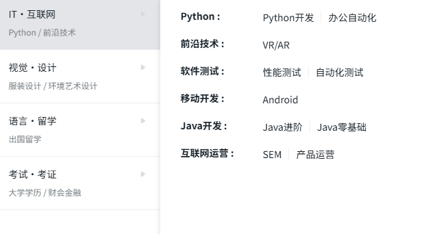

同时项目也提供了课程购买、优惠券、在线视频观看、视频留言与回复、创建学习计划等等功能，力求一个尽量真实的微服务项目

### 项目特色

从2021年国务院颁布《关于进一步减轻义务教育阶段学生作业负担和校外培训负担的意见》，即“双减政策”开始，多年来占据我国教育培训半壁江山的课外辅导培训机构遭到毁灭性打击，而相对地，职业教育培训的市场规模逐步增长

> 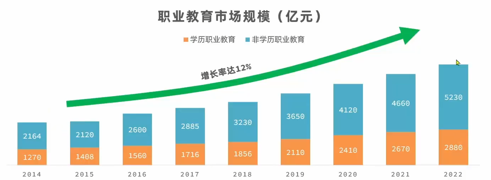

而随着互联网发展，传统汗液也逐渐网络化，加之曾经的疫情影响，很多职业技能培训企业，以及高校课程都开始发展在线教育。相比于传统线下培训，在线教育成本更低，学习时间碎片化，教育资源能够充分利用，在岗人员也可能利用空间时间学习新知识新技能。因此，在线教育市场不断扩大，我们选择了天机学堂作为学习项目

> 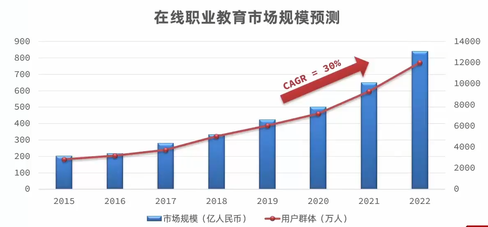

而天机学堂不仅仅涵盖在线职业教育方面，而是同时包含电商、在线教育、社交互动的核心业务，如对接多种支付接口，优惠券系统设计方案、库存超卖问题方案、秒杀抢购解决方案、超时订单处理方案，以及视频点播方案、学习辅助系统、考试测评系统、视频发布、审核、加密方案、视频断点续传方案，还有互动问答系统、课程评价系统、通用点赞实现方案、积分系统实现方案、排行榜实现方案等等

而在项目技术栈中，可以分为纵向四层

- 展现层：安全防护技术XSS-CSRF、VUE、WebPack、Axios、Pinia、Vue-Router、Element-UI、Echarts、Sass
- 接入层：NGINX、CDN、身份认证、请求路由、负载均衡
- 服务层：SpringCloud、LoadBalancer、OpenFeign、Nacos、Seata、Sentinel、RabbitMQ、XXL-JOB、Redisson
- 数据层：MySQL、MongoDB、Redis、Elasticsearch

此外，还有第三方云服务如阿里云、腾讯云，以及DevOps组件YAPI、GOGS、Jenkins、Docker、GrayLog、SW

## 项目环境搭建

### 企业开发模式

微服务项目相比传统项目，包含的项目模块非常多，每个模块都需要独立部署，因此在开发模式上有很大差别，开发人员数量成倍增多，分组分别开发不同的微服务模块，微服务模块间有业务关联，需要相互协作

而我们当前的天机学堂项目开发情况如下

> 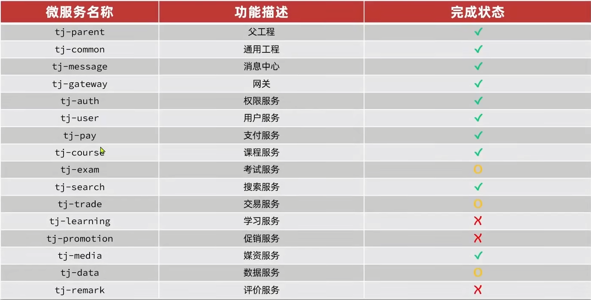

其中绿色勾表示已经开发完成，黄色圆圈表示正在开发中，红色叉表示暂未开发

而我们在企业中开发时，不同的服务代码一般位于不同的仓库中，作为某一个微服务的开发人员，我们是没有权限拉取和推送代码到其他仓库的。而且微服务的运行环境非常复杂，比如先前的黑马商城项目，我们需要同时启动Nacos、Sentinel、Seata、Redis、MySQL、RabbitMQ等等，因此本地部署的难度也较高

但是如何进行远程调用测试呢？在企业开发中，针对测试有不同的测试阶段：

- 单元测试：测试最小的可测试单元
- 集成测试：验证某个功能接口
- 组件测试：验证微服务组件
- 端对端联调：验证整个系统

单元测试和集成测试是在本地完成的，如果需要测试远程调用，一般企业会准备一套远程公共Mock服务来测试远程调用接口，也就不需要其他尚未开发完成的实际接口

因此本次项目的很多通用环境已经配置到了虚拟机中，只需要启动虚拟机，就可以一键启动并配置各种环境

> 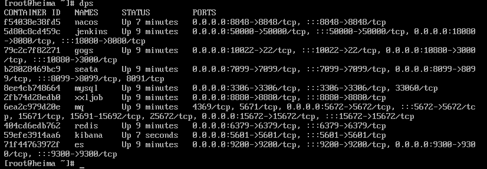

然后我们访问虚拟机IP，192.168.150.101，这个IP尽量不要修改，因为Nacos中可能已经设置了这个IP

> 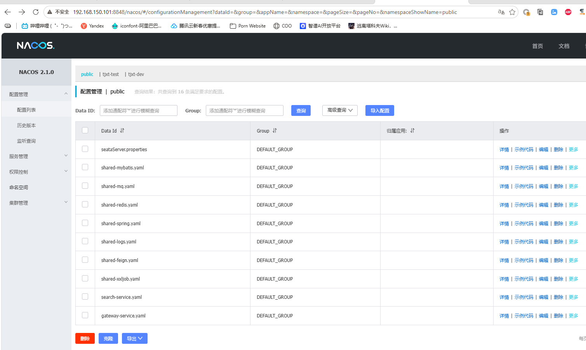

### 持续集成环境

不难发现，在上文的虚拟机中，并没有启动已经开发完成的微服务，这里就需要引出持续集成环境。持续集成是一种DevOps软件开发实践，DevOps中Dev为Develop，Ops为Operation，即开发与运维，也就是让开发与运维间更加流畅，打破开发与运维间的隔阂。例如我们在开发完成后，需要将代码进行打包、发布、编译、构建、部署等等，如果人为操作就非常麻烦，而且也及其容易出错

而持续集成可以自动构建、发布、测试，同时防止主干和分支存在较大差异，快速发现错误，并解决错误。而天机学堂项目中，也引入了持续集成环境，分别是Jenkins，负责编译，构建，测试代码；Gogs，负责代码托管，也就是Git私服；以及Docker，负责部署，Docker可以利用dockerfile和docker-compose快速部署。在这套持续集成环境中，只需要程序员在IDE中点击提交按钮，代码由Gogs接管，然后通知Jenkins拉取并编译、构建，然后打包为Docker镜像，最后Docker自动部署，程序员只需要关注中间步骤是否出错，以及访问最后运行的容器

我们可以手动来测试一下，访问Jenkins，可以看到已经提前准备好的一些微服务

> 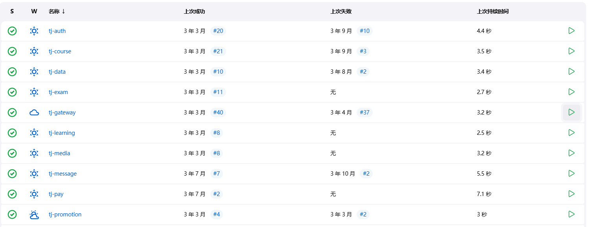

点击右侧的按钮就可以直接编译并一键部署，我们尝试启动tj-gateway，然后观察Docker

> 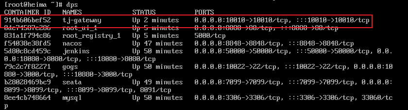

可以看到，网关服务直接编译成功并自动部署在Docker中了，而在实际企业开发中，也不需要我们手动按下这个按钮，只需要在IDE中提交代码即可。同时，我们可以访问后端swagger接口文档

> 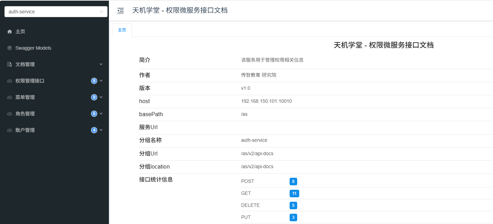

 可以看到，也能够正确读取到接口内容。所以后面的学习中，我们将会利用这一套持续集成环境来进行开发，提升我们的开发效率

### 本地开发部署

先前我们将代码保存到了Git私服中，现在就需要将代码从仓库中拉取到本地，然后进行开发。首先进入Gogs，查看项目地址。注意选择lesson-init分支，不要选择master分支，master分支是全部开发完成的分支

> 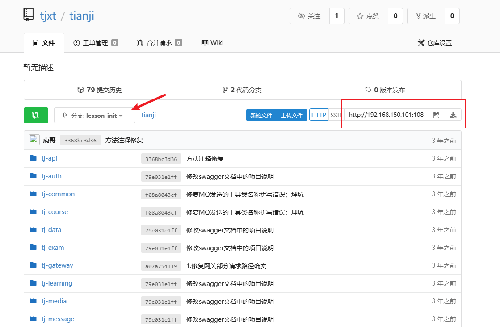

然后通过Git拉取代码，使用-b lesson-init选择课程分支

```bash
git clone http://192.168.150.101:10880/tjxt/tianji.git -b lesson-init
```

> 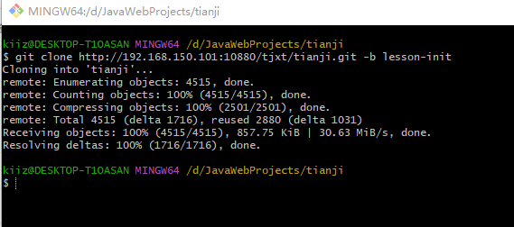

然后以lesson-init为起点，创建一个dev分支

```bash
cd tianji
git checkout -b dev
```

> 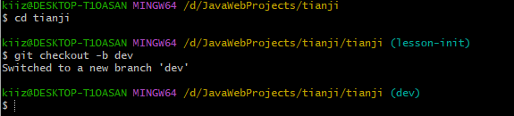

用IDEA打开项目，确认分支为Dev分支

> 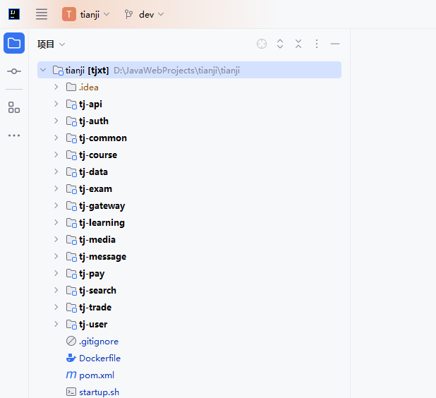

## BUG修复

### BUG复现

修复BUG是熟悉一个项目的最佳方式，想要修复好一个BUG，就必须清楚了解一个项目的整体架构，实现细节，业务流程，因此我们也从修复一个BUG开始了解天机学堂项目

现在已知一个业务BUG，我们登录jack的账号，删除其中一个订单

> 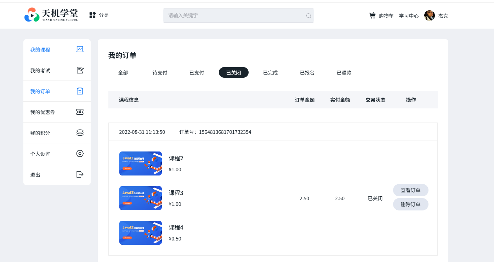

然后登录rose的账号，也尝试删除一个订单，却提示不能删除他人的订单

> 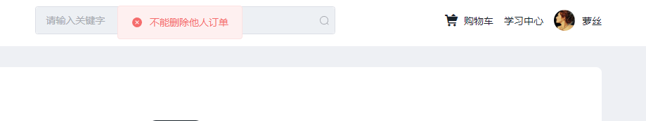

### BUG修复

很明显这里存在一个业务BUG，可能的原因有两点，第一，删除订单时真的获取到了别人的订单id，所以导致鉴权失败；第二，鉴权出现问题，获取订单id正确，但是在判断订单归属时出现错误，导致后台认为该订单属于其他用户

不过，解决BUG并不是目的，解决这个BUG的最终目的是学会阅读项目代码、学会定位问题、分析问题，学会发布代码到开发环境，以及熟悉项目结构

#### 熟悉项目

对于项目结构，目前企业微服务开发项目结构有两种模式

- 每个项目下的每一个微服务都需要创建一个Project，尽可能降低耦合
- 每个项目创建一个Project，项目下的微服务是Project下的Module，方便管理与开发

而天机学堂采用第二种模式

#### 配置文件规范

SpringBoot配置文件支持多环境配置，在天机学堂中也基于不同环境有不同的配置文件

| 文件                | 说明                                                     |
| ------------------- | -------------------------------------------------------- |
| bootstrap.yml       | 通用配置属性，包含服务名称、端口、日志等等各环境通用信息 |
| bootstrap-dev.yml   | 线上开发环境配置属性，在虚拟机中部署使用                 |
| bootstrap-local.yml | 本地开发环境配置属性，本地开发、测试、部署使用           |

除此之外，其余的配置都放在了Nacos中共享，包括共享的配置及其微服务中可能会根据业务变化的配置

#### 阅读源码

阅读他们的代码，一般有一个统一流程，找到请求入口、理清请求链路、紧跟主线、步步深入。从前端的请求入口开始，然后开始通过入口接口的代码，分析代码的执行流程，很多业务通常会执行多个分支业务，所以需要寻找业务主线，最后找到BUG发生点

现在我们来模拟最麻烦的一种情况，即原代码开发人员已经不参与该项目开发，我们只能通过自己来解决BUG问题

首先访问前端，在前端发送一次请求，查看请求路径

> 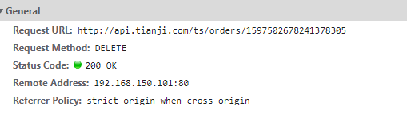

可以看到，请求路径为api.tianji.com/ts/orders/1597502678241378305，已知api.tianji.com为服务网关入口，Nginx可能也会通过api.tianji.com来进行转发，所以最重要的请求路径并不是api.tianji.com，而是/ts/orders/1597502678241378305

因此第二步，观察网关中/ts前缀的请求会转发到哪个微服务

```yml
gateway:
  routes:
    - id: ms
      uri: lb://media-service
      predicates:
        - Path=/ms/**
    - id: as
      uri: lb://auth-service
      predicates:
        - Path=/as/**
      filters:
        - PreserveHostHeader
    - id: ds
      uri: lb://data-service
      predicates:
        - Path=/ds/**
    - id: sms
      uri: lb://message-service
      predicates:
        - Path=/sms/**
    - id: us
      uri: lb://user-service
      predicates:
        - Path=/us/**
    - id: cs
      uri: lb://course-service
      predicates:
        - Path=/cs/**
    - id: os
      uri: lb://order-service
      predicates:
        - Path=/os/**
    - id: ss
      uri: lb://search-service
      predicates:
        - Path=/ss/**
    - id: ls
      uri: lb://learning-service
      predicates:
        - Path=/ls/**
    - id: ps
      uri: lb://pay-service
      predicates:
        - Path=/ps/**
    - id: ts
      uri: lb://trade-service
      predicates:
        - Path=/ts/**
    - id: es
      uri: lb://exam-service
      predicates:
        - Path=/es/**
    - id: rs
      uri: lb://remark-service
      predicates:
        - Path=/rs/**
    - id: prs
      uri: lb://promotion-service
      predicates:
        - Path=/prs/**
```

从配置文件中得知，/ts/\*\*对应的微服务为trade-service交易微服务，因此移步到交易微服务，原始请求为/ts/orders/1597502678241378305，/ts/用于网关转发，所以在交易微服务中，我们只需要寻找DELETE方式，请求路径为/orders/的方法即可

```java
@ApiOperation("删除订单接口")
@DeleteMapping("/{id}")
public void deleteOrder(@ApiParam("要删除的订单id") @PathVariable("id") Long id) {
    orderService.deleteOrder(id);
}
```

跟踪进入orderService.deleteOrder(id)

```java
@Override
public void deleteOrder(Long id) {
    // 1.获取登录用户
    Long userId = UserContext.getUser();
    // 2.查询订单
    Order order = getById(id);
    if (order == null) {
        return;
    }
    // 3.判断订单所属用户与当前登录用户是否一致
    if(userId != order.getUserId()){
        // 不一致，说明不是当前用户的订单，结束
        throw new BadRequestException("不能删除他人订单");
    }
    // 4.删除订单
    boolean success = removeById(id);
    if (!success) {
        throw new DbException(OPERATE_FAILED);
    }
}
```

从上往下看，首先获取登录用户，然后查询订单，再判断订单所属用户与当前登录用户是否一致。这里就出现了我们在测试时遇到的报错throw new BadRequestException("不能删除他人订单")。所以问题一定出现在if(userId != order.getUserId())，这也与我们最初的推测一致，要么删除订单时真的获取到了别人的订单id，所以导致鉴权失败；要么获取订单id正确，但是在判断订单归属时出现错误，导致后台认为该订单属于其他用户。这里只要userId或者order.getUserId()任意一个获取错误，都会导致报错

但仔细思考一下，哪一个出错的概率更大呢？order.getUserId()来源于我们用订单id获取到的订单实体中的用户id，理论上来说，这里出错的概率应该比较小才对，如果order.getUserId()都出错了，则说明数据库在保存订单数据时就出错了，订单id无法正确对应用户id。但从另一个角度上来说，我们登录不用的用户，却又能获取到不同的订单数据，这与前面的推测矛盾。所以我们将目光着重于userId，userId来自于Long userId = UserContext.getUser()，我们进行跟踪

```java
package com.tianji.common.utils;

public class UserContext {
    private static final ThreadLocal<Long> TL = new ThreadLocal<>();

    /**
     * 保存用户信息
     * @param userId 用户id
     */
    public static void setUser(Long userId){
        TL.set(userId);
    }

    /**
     * 获取用户
     * @return 用户id
     */
    public static Long getUser(){
        return TL.get();
    }

    /**
     * 移除用户信息
     */
    public static void removeUser(){
        TL.remove();
    }
}
```

可以看到UserContext仅仅是利用ThreadLocal保存了用户信息，UserContext.getUser()本身也不存在什么问题。那么问题出在哪儿呢？重新模拟一下BUG出现的过程。首先jack进行登录，然后由UserContext.getUser()获取到jack的id，再使用订单id获取订单实体，用订单实体中的用户id与jack的Id进行比较，比较通过，因此删除成功；然后rose进行删除，UserContext.getUser()先获取用户id。这里就不难发现，UserContext.getUser()获取的到底是jack的id，还是rose的Id呢？接下来不再进行推测，而是直接进行测试验证

将虚拟机中的trade停止，使用我们本地的trade服务，并检查Nacos是否检测成功

> 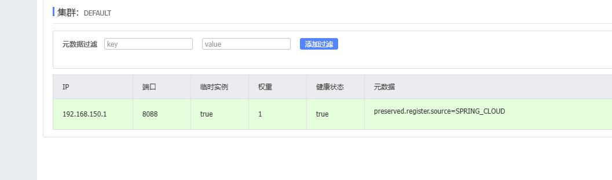

然后进行调试，在if(userId != order.getUserId())处断点，先使用jack删除订单

> 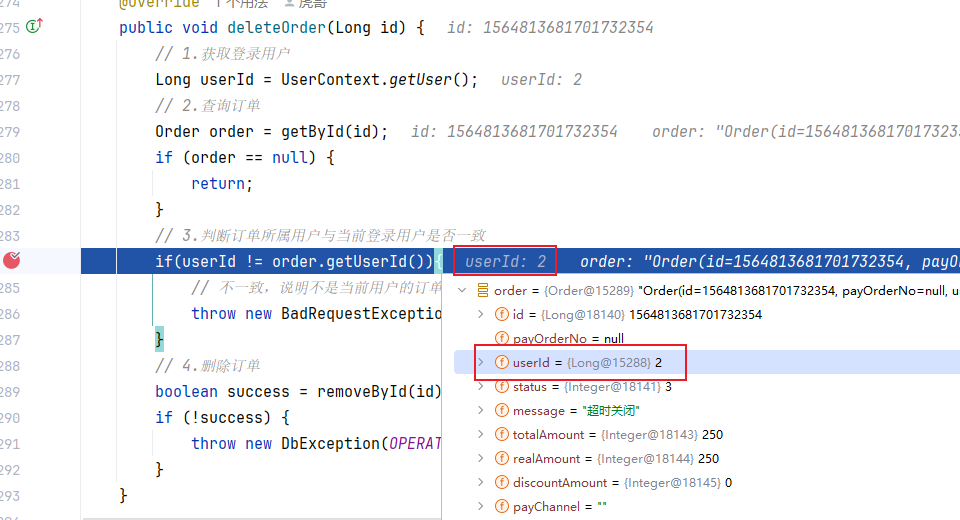

userId为2，order.getUserId()也为2，因此jack可以删除成功。然后测试rose

> 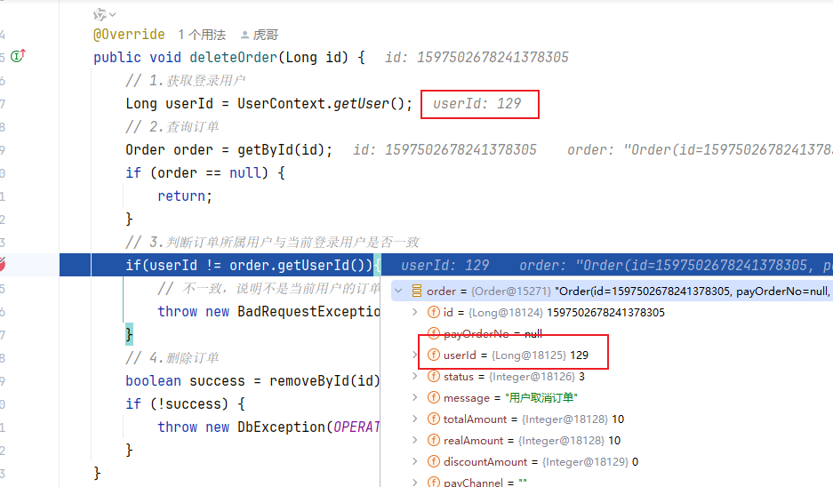

奇怪的现象出现了，这里获取的userId为129，order.getUserId()也是129，理论上来说应该等于才对，但是程序给出的结果是不等于。难道是!=符号的问题吗？我们来测试一下，定义两个Long，都设置为2L

```java
@Test
public void test() {
    Long a = 2L;
    Long b = 2L;
    System.out.println(a == b);
}
```

> 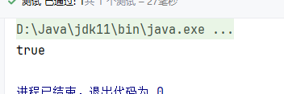

然后将Long都设置为129L

```java
@Test
public void test() {
    Long a = 129L;
    Long b = 129L;
    System.out.println(a == b);
}
```

> 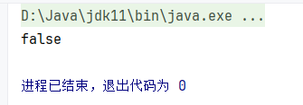

#### 解决问题

结果显而易见，正是因为使用了基本比较符!=，所以导致比较出错。而出错的根本是Java对于数值包装类的设定。Java对整数包装类设计了缓存机制，默认缓存-128到127的整数包装类型，而\=\=或者!=比较符并不是数值比较，而是引用比较，在内存中，缓存外的包装类数值占用不同的内存空间，因此\=\=或者!\=比较的结果为false，导致程序出现BUG

我们可以跟踪到Long的valueOf方法

```java
@HotSpotIntrinsicCandidate
public static Long valueOf(long l) {
    final int offset = 128;
    if (l >= -128 && l <= 127) { // will cache
        return LongCache.cache[(int)l + offset];
    }
    return new Long(l);
}
```

这里执行了一个判断，当传入的long l在-128到127之间时，会直接返回LongCache.cache数组中的值，否则返回一个新对象

```java
private static class LongCache {
    private LongCache(){}

    static final Long cache[] = new Long[-(-128) + 127 + 1];

    static {
        for(int i = 0; i < cache.length; i++)
            cache[i] = new Long(i - 128);
    }
}
```

问题已经溯源，解决方法也很简单，使用Objects类中的equals方法，它首先会进行==比较，然后还会调用对象自身的equals方法来比较，而Long的equals方法如下

```java
public boolean equals(Object obj) {
    if (obj instanceof Long) {
        return value == ((Long)obj).longValue();
    }
    return false;
}
```

调用了longValue()方法，longValue()返回的是一个long基本类型，因此可以保证比较结果正确。所以，我们将源代码进行更正

```java
// 3.判断订单所属用户与当前登录用户是否一致
if(!Objects.equals(userId, order.getUserId())){
    // 不一致，说明不是当前用户的订单，结束
    throw new BadRequestException("不能删除他人订单");
}
```

### 测试部署

代码开发完成的测试流程一般为本地单元测试、本地接口测试、组件测试以及开发环境联调。但是这里我们只修改了一行代码，因此就不进行本地单元测试，而直接进行接口测试

**本地接口测试**

从数据库中选择一个rose的订单进行删除，这里选择订单号1597502678241378305

> 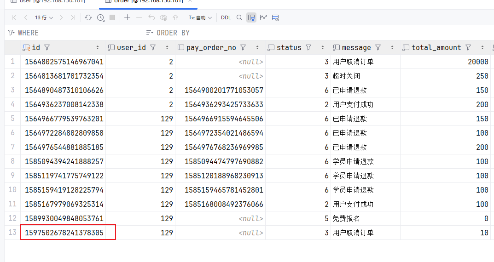

然后在请求头中添加user-info头，设置为rose的用户id129

> 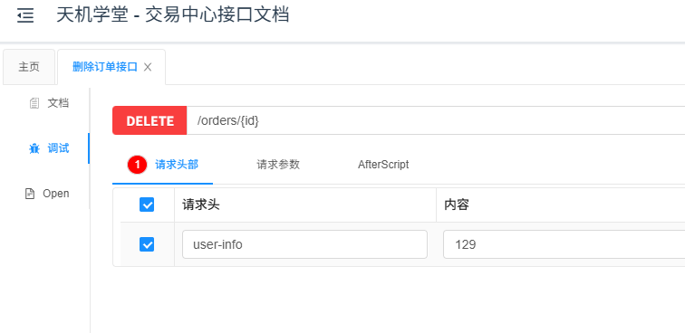

发送请求，返回200，并且没有返回任何结果，说明删除成功

> 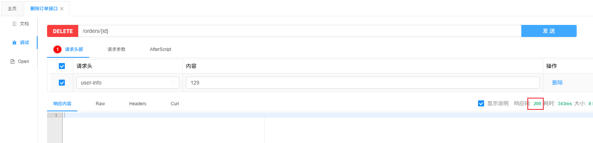

刷新数据库，可以看到id为1597502678241378305的订单已经被成功删除了

> 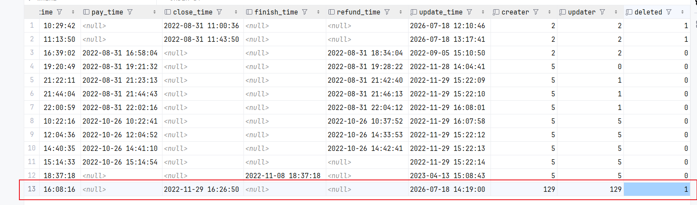

**组件测试**

我们在本地启动修复好的服务，停用远程服务，然后访问前端再次进行删除测试

> 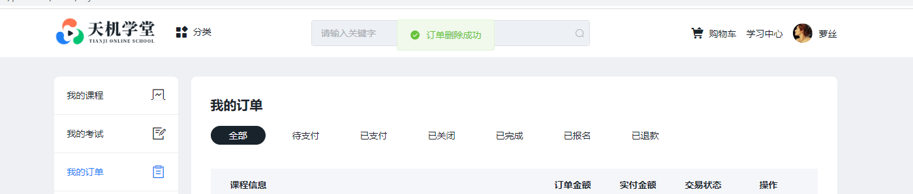

可以看到，订单已经删除成功了，说明在组件测试中，BUG已经被彻底修复了，最后我们再尝试提交到仓库中进行部署

**部署测试**

在push代码之前，我们先修改Jenkins中有关构建部署的脚本，在Jenkins的tjxt-dev-build脚本中，默认的Branches to build为lesson-init分支，但是我们将分支修改为了dev分支，所以Jenkins中也需要修改分支

> 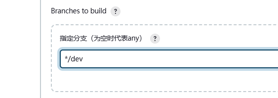

然后修改构建条件，添加分支过滤器，只有当dev分支提交时才进行构建

> 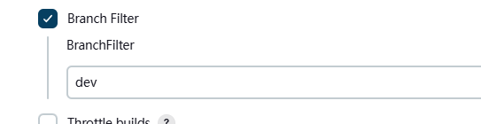

保存完成，然后我们在idea中提交代码

> 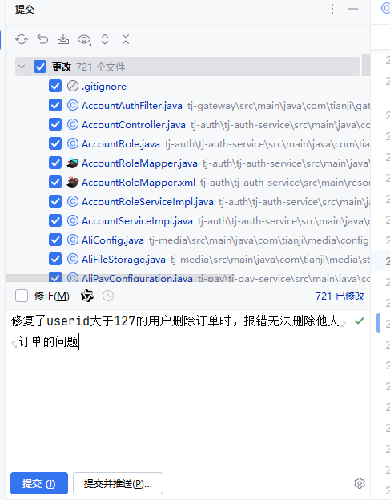

提交完成后进行推送，这里的警告是安全性警告，可以忽略

> 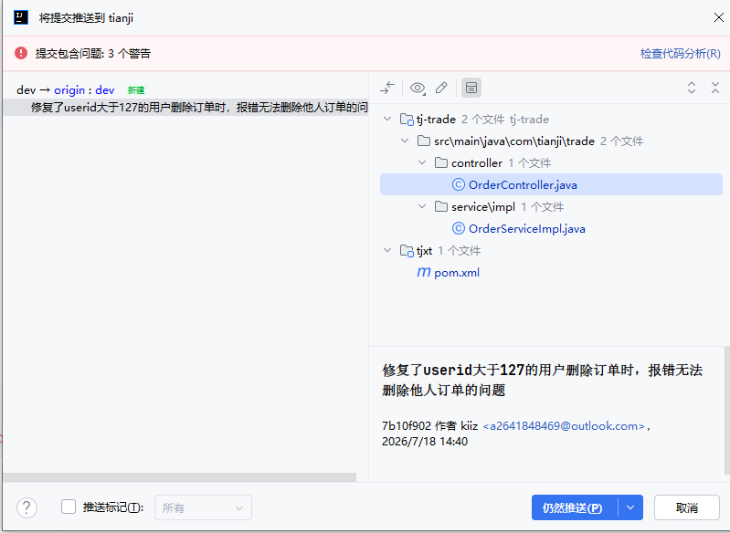

推送完成，在Jenkins可以看到构建进度条，第一次构建比较久，需要下载各项依赖，耐心等待即可

> 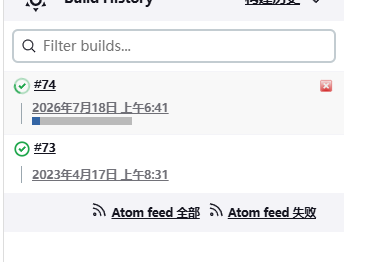

构建完成，我们关闭本地的服务，然后测试开发环境的服务是否存在问题

> 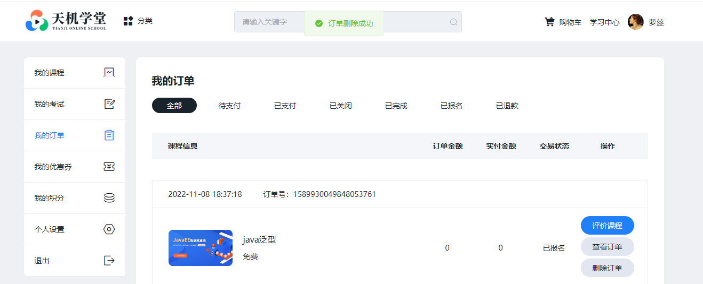

可以看到，在开发环境也没有任何问题，因此可以认为，BUG已经被修复

## 业务开发

### 一般流程

现在我们对天机学堂项目已经有了一定的掌握，所以可以进行初步的开发工作。但在代码编写之前，我们还需要做一些准备工作

- 分析产品原型

基于产品原型和需求，分析业务流程，抽取业务实体，设计业务接口

- 设计数据结构

根据业务实体和接口，设计数据库表以及接口关联的相关实体

- 实现功能接口

基于之前定义的接口用代码实现相关功能，如有必要，也可以对接口进行调整

- 测试

接口开发完成后先做本地测试，确保每一个接口基本可用且满足业务需求

- 联调

接口开发完毕后与其他微服务及前端联调，修复BUG

### 我的课程

#### 分析产品原型

目前“我的课程”页面为空，tj-learning服务也只有项目框架，没有任何代码

> 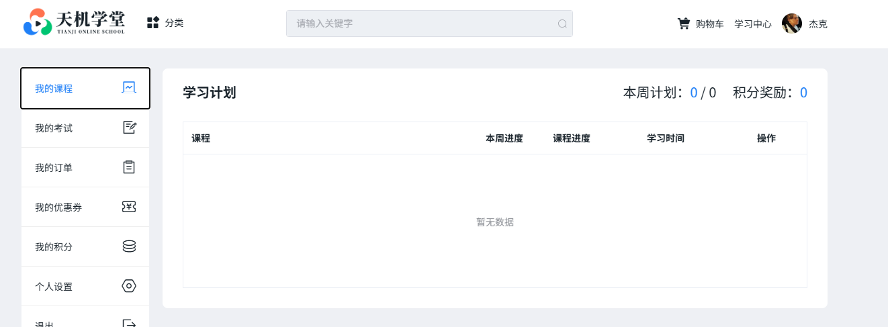
>
> 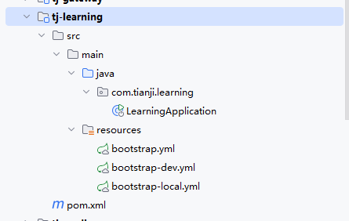

所以我们从“我的课程”页面出发，开始逐步进行项目开发作业。首先观察网页产品原型，分析页面内容

> 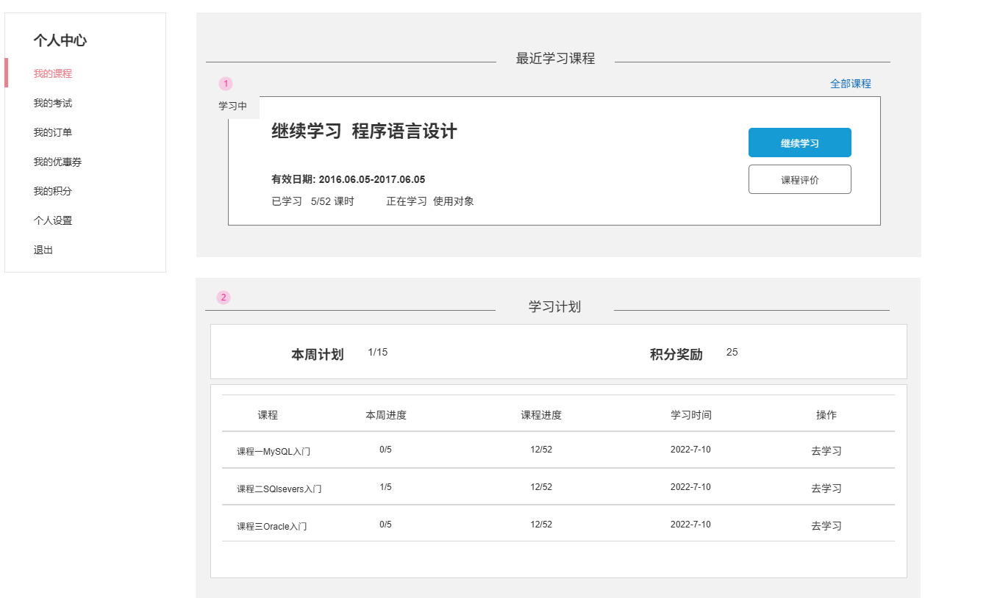

在产品原型中，页面被分为上下两部分，上半部分是一个正在学习的课程，右侧提供了一个“全部课程”的按钮，对于正在学习的课程，提供了正在学习和课程评价两个按钮，下半部分是学习计划，学习计划为一个表格，展示本周的学习的计划。在这个页面中，从上到下需要获取的数据有，当前正在学习的课程及其课程数据、已经学习课时、正在学习对象、本周学习计划及其详细内容、本周积分奖励等等

点击全部课程后显示全部已购课程，可以按照学习时间和购买时间进行排序，这里还可以创建学习计划，继续学习、重新学习

> 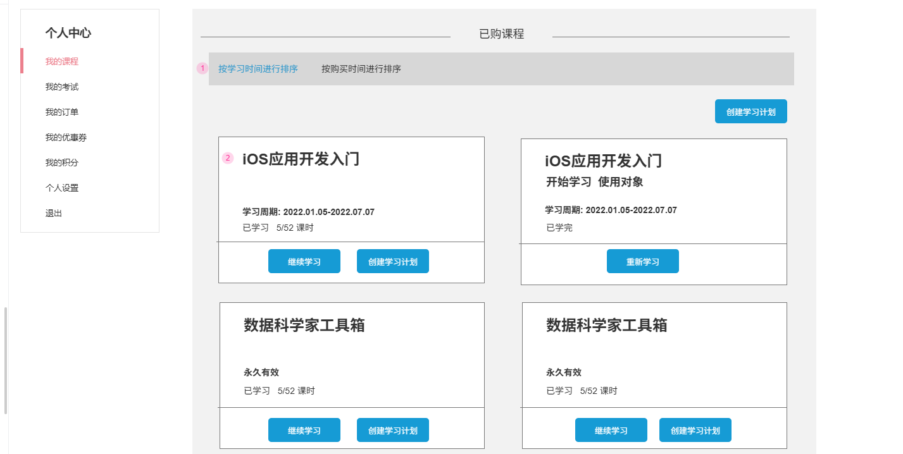

课程存在过期时间，对于已经过期的课程，仅提供删除课程选项

> 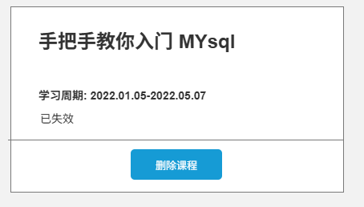

对于右上角的创建学习计划按钮，点击后弹出创建学习计划窗口，然后选择已购买课程，输入每周学习章节数，自动计算预计完成时间

> 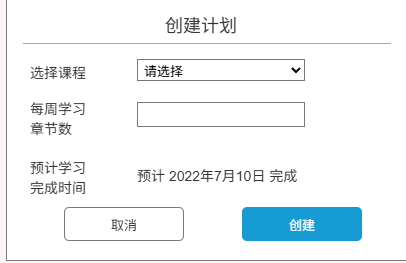

对于课程自身的创建学习计划或者修改学习计划按钮，无法选择课程名称，其他与之前相同

> 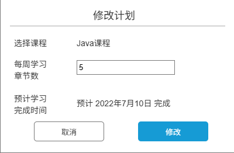

#### 设计业务接口

在分析了产品原型后，我们对“我的课程”页面有了基本了解，下一步就是设计业务接口。前端需要通过业务接口来请求数据，后端也需要根据接口来实现业务逻辑，并将数据封转后发送给前端

这里我们使用Apifox来设计并维护接口，例如我们设计一个分页查询课程接口，首先创建项目，命名为天机学堂

> 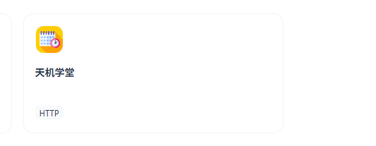

然后创建分组，命名为 课程相关接口

> 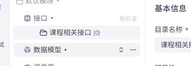

##### 分页查询课程

接着就开始定义接口，查询接口，请求方式肯定为GET，请求路径暂且设定为/lessons/，因为是分页查询，所以使用page作为标注，组合起来就是/lessons/page。而请求参数中，页码、每页大小必不可少，其他的参数根据页面原型确定

> 

在页面原型中，没有其他过滤字段，但是有根据学习时间和购买时间进行排序的功能，因此在请求参数中，还需要加入排序字段，同时需要设置排序方式。因此我们设计四个请求参数page、pageSize、sortBy和isAsc

> 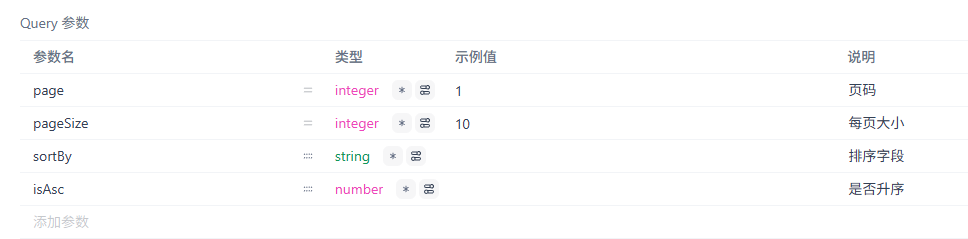

然后设计返回值，首先是分页查询必须的总条数和总页数，然后根据页面原型分析其他必要数据。首先是课程名，然后是一个过期时间，过期时间可以由创建时间和过期时间两部分来确定，如果过期时间为空，则认为永久有效；接着是学习状态，页面原型中定义了四个学习状态

> 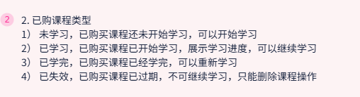

然后还需要学习进度，包含已经学习课时和总学习课时。以上是页面中显示的字段，但是我们还需要考虑关联信息需要包含关联字段，例如课程信息，我们需要提供课程id，这样前端可以通过课程id直接访问对应的课程；以及在实际前端中，课程可能对应了课程封面，所以还需要准备一个课程封面字段。同时仔细观察可以发现，针对每个课程还有一个学习计划按钮，而且按钮分为“创建学习计划”和“修改学习计划”两种状态，因此还需要一个字段记录学习计划状态

> 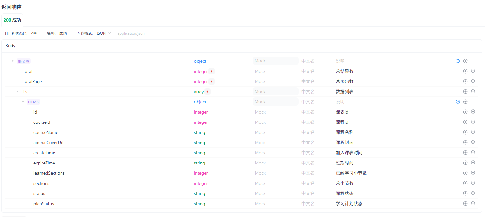

除此之外，“我的课程”页面其实还有很多接口需要我们去分析，这些接口不仅限于http请求接口，还包括微服务调用的接口，如下

| 接口描述                           | 请求方式 | 请求路径                  |
| ---------------------------------- | -------- | ------------------------- |
| 支付或报名成功后，立即加入课表     | MQ通知   |                           |
| 分页查询我的课表                   | GET      | /lessons/page             |
| 查询我最近正在学习的课程           | GET      | /lessons/now              |
| 根据id查询指定课程的学习状态       | GET      | /lessons/{courseId}       |
| 删除课表中的某课程                 | DELETE   | /lessons/{courseId}       |
| 退款后，立即移除课表中的课程       | MQ通知   |                           |
| 校验指定课程是否是课表中的有效课程 | GET      | /lessons/{courseId}/valid |
| 统计课程学习人数                   | GET      | /lessons/{courseId}/count |

##### 添加课程到课程表

用户购买课程后，交易服务会通过MQ通知学习服务，学习服务将课程加入用户课表中

由于是通过MQ发送的消息通知，所以这个接口没有http请求方式，也没有请求路径，我们想要获取其通知必须参考MQ的RoutingKey，在一般企业中可以直接询问支付服务开发者，而我们模拟最坏情况，通过查看源代码来获取。这里就不需要再通过前端来判断，因为课程的购买一定在tj-trade服务中，我们观察其Controller

```java
@ApiOperation("免费课立刻报名接口")
@PostMapping("/freeCourse/{courseId}")
public PlaceOrderResultVO enrolledFreeCourse(@ApiParam("免费课程id") @PathVariable("courseId") Long courseId) {
    return orderService.enrolledFreeCourse(courseId);
}
```

在Controller中我们找到一个免费课立刻报名接口，这里肯定会完成整个下单流程，并且发送支付成功的消息，因此我们深入orderService.enrolledFreeCourse(courseId)

```java
@Override
@Transactional
public PlaceOrderResultVO enrolledFreeCourse(Long courseId) {
    Long userId = UserContext.getUser();
    // 1.查询课程信息
    List<Long> cIds = CollUtils.singletonList(courseId);
    List<CourseSimpleInfoDTO> courseInfos = getOnShelfCourse(cIds);
    if (CollUtils.isEmpty(courseInfos)) {
        // 课程不存在
        throw new BizIllegalException(TradeErrorInfo.COURSE_NOT_EXISTS);
    }
    CourseSimpleInfoDTO courseInfo = courseInfos.get(0);
    if(!courseInfo.getFree()){
        // 非免费课程，直接报错
        throw new BizIllegalException(TradeErrorInfo.COURSE_NOT_FREE);
    }
    // 2.创建订单
    Order order = new Order();
    // 2.1.基本信息
    order.setUserId(userId);
    order.setTotalAmount(0);
    order.setDiscountAmount(0);
    order.setRealAmount(0);
    order.setStatus(OrderStatus.ENROLLED.getValue());
    order.setFinishTime(LocalDateTime.now());
    order.setMessage(OrderStatus.ENROLLED.getProgressName());
    // 2.2.订单id
    Long orderId = IdWorker.getId(order);
    order.setId(orderId);

    // 3.订单详情
    OrderDetail detail = packageOrderDetail(courseInfo, order);

    // 4.写入数据库
    saveOrderAndDetails(order, CollUtils.singletonList(detail));

    // 5.发送MQ消息，通知报名成功
    rabbitMqHelper.send(
            MqConstants.Exchange.ORDER_EXCHANGE,
            MqConstants.Key.ORDER_PAY_KEY,
            OrderBasicDTO.builder()
                    .orderId(orderId)
                    .userId(userId)
                    .courseIds(cIds)
                    .finishTime(order.getFinishTime())
                    .build()
    );
    // 6.返回vo
    return PlaceOrderResultVO.builder()
            .orderId(orderId)
            .payAmount(0)
            .status(order.getStatus())
            .build();
}
```

其中最重要的便是第五步，发送MQ消息，通知报名成功，这里使用的交换机为order.topic，路由Key为order.pay，发送的数据体是一个OrderBasicDTO对象，深入对象

```java
package com.tianji.api.dto.trade;

import lombok.Builder;
import lombok.Data;

import java.time.LocalDateTime;
import java.util.List;

@Data
@Builder
public class OrderBasicDTO {
    /**
     * 订单id
     */
    private Long orderId;
    /**
     * 下单用户id
     */
    private Long userId;
    /**
     * 下单的课程id集合
     */
    private List<Long> courseIds;
    /**
     * 订单完成时间
     */
    private LocalDateTime finishTime;
}
```

可以看到，只要获取了消息中的下单用户Id和下单课程id，就可以将对应的课程添加到用户课表中。同时需要注意MQ可能会发布多条消息，需要保证业务幂等性

##### 查询正在学习接口

在首页、个人中心-课程页都需要查询并展示当前用于最近一次学习的课程，因此需要专门设计一个接口

> 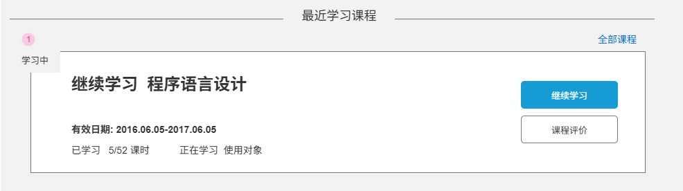
>
> 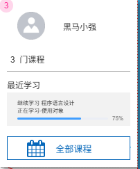

查询请求，请求方式一定为GET，请求路径按照Restful API，暂定为/lessons/now，不需要请求参数，因为查询的是当前登录用户，而登录用户id通过context来获取。接着是返回的数据格式，这里可以将之前分页查询的返回体进行修改，剔除不需要的字段

```JSON
{
    "courseId": 0, // 课程id
    "courseName": "", // 课程名称
    "courseCoverUrl": "", // 课程封面
    "createTime": "", // 加入课表时间
    "expireTime": "", // 过期时间
    "learnedSections": 0, // 已经学习小节数
    "sections": 0 // 总小节数
}
```

这里去除了课表id、课程状态、学习计划状态字段，但是这还不能满足我们的接口需求。从页面原型来看，这个接口还需要返回正在学习的小节名称、课程总数以及小节序号。不过实际业务开发中，课程总数计数应该设计为一个专门的接口，因为这与当前正在学习课程不相关

> 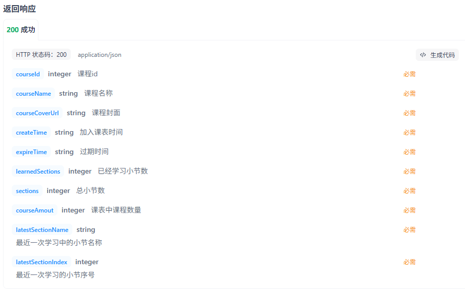

#### 抽取业务实体

根据接口顺序，我们来设计对应的业务实体类，包括PO、VO、DTO等等。首先是分页查询实体，其中至少包含四个属性，页码、每页大小、是否升序以及排序字段。不过由于分页查询比较常用，因此在common中已经定义好了

```java
@Data
@ApiModel(description = "分页请求参数")
@Accessors(chain = true)
public class PageQuery {
    public static final Integer DEFAULT_PAGE_SIZE = 20;
    public static final Integer DEFAULT_PAGE_NUM = 1;

    @ApiModelProperty(value = "页码", example = "1")
    @Min(value = 1, message = "页码不能小于1")
    private Integer pageNo = DEFAULT_PAGE_NUM;

    @ApiModelProperty(value = "每页大小", example = "5")
    @Min(value = 1, message = "每页查询数量不能小于1")
    private Integer pageSize = DEFAULT_PAGE_SIZE;

    @ApiModelProperty(value = "是否升序", example = "true")
    private Boolean isAsc = true;

    @ApiModelProperty(value = "排序字段", example = "id")
    private String sortBy;
}
```

已经对应的分页结果实体也已经定义好了，这里定义为DTO而不是VO是考虑到微服务之间可能也会进行调用

```java
@Data
@NoArgsConstructor
@AllArgsConstructor
@ApiModel(description = "分页结果")
public class PageDTO<T> {
    @ApiModelProperty("总条数")
    protected Long total;
    @ApiModelProperty("总页码数")
    protected Long pages;
    @ApiModelProperty("当前页数据")
    protected List<T> list;
}
```

定义业务实体，从上文中需要的三个接口来看，其实返回的内容基本相差不大，所以我们可以定义一个VO对象，返回所有内容，前端按需提取相关字段即可。在编写代码之前，根据开发规范，我们不能在Dev分支上编写代码，因此需要额外创建一个分支，这里我们使用feature-lessons分支名

> 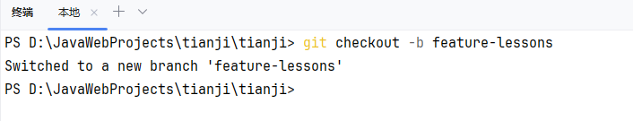

然后开始编写VO类

```java
package com.tianji.learning.domain.vo;

import com.tianji.learning.enums.PlanStatus;
import com.tianji.learning.enums.Status;
import io.swagger.annotations.ApiModel;
import io.swagger.annotations.ApiModelProperty;
import lombok.AllArgsConstructor;
import lombok.Builder;
import lombok.Data;
import lombok.NoArgsConstructor;

import java.time.LocalDate;

@Data
@AllArgsConstructor
@NoArgsConstructor
@Builder
@ApiModel(description = "课程表信息")
public class LearningLessonVO {
    @ApiModelProperty("课程表id")
    private Long id;

    @ApiModelProperty("课程id")
    private Long courseId;

    @ApiModelProperty("课程名称")
    private String courseName;

    @ApiModelProperty("课程封面")
    private String courseCoverUrl;

    @ApiModelProperty("课程章节数")
    private Integer sections;

    @ApiModelProperty("课程状态，0-未学习，1-学习中，2-已学完，3-已失效")
    private Status status;

    @ApiModelProperty("已学章节数")
    private Integer learnedSections;

    @ApiModelProperty("计划状态，0-没有计划，1-计划进行中")
    private PlanStatus planStatus;

    @ApiModelProperty("计划的学习频率")
    private Integer weekFreq;

    @ApiModelProperty("创建时间")
    private LocalDate createTime;

    @ApiModelProperty("过期时间，如果为null代表课程永久有效")
    private LocalDate expireTime;

    @ApiModelProperty("课程总数")
    private Long courseAmount;

    @ApiModelProperty("最近学习章节名称")
    private String latestSectionName;

    @ApiModelProperty("最近学习章节索引")
    private Integer latestSectionIndex;
}
```

在VO类中，我们又定义了枚举类Status和PlanStatus来避免出错

```java
package com.tianji.learning.enums;

import lombok.AllArgsConstructor;
import lombok.Getter;

@AllArgsConstructor
@Getter
public enum Status {

    NOT_STARTED(0, "未学习"),
    STUDYING(1, "学习中"),
    FINISHED(2, "已学完"),
    EXPIRED(3, "已失效");

    @JsonValue
    private final Integer value;
    private final String desc;

    public static Status of(Integer value) {
        for (Status status : values()) {
            if (status.value.equals(value)) {
                return status;
            }
        }
        return null;
    }
}
```

```java
package com.tianji.learning.enums;

import lombok.AllArgsConstructor;
import lombok.Getter;

@AllArgsConstructor
@Getter
public enum PlanStatus {

    NO_PLAN(0, "没有计划"),
    PLAN_IN_PROGRESS(1, "计划进行中");

    @JsonValue
    private final Integer value;
    private final String desc;

    public static PlanStatus of(Integer value) {
        for (PlanStatus status : values()) {
            if (status.value.equals(value)) {
                return status;
            }
        }
        return null;
    }
}
```

*注：不要忘记在value字段添加@JsonValue注解，这可以让Jackson在将数据返回前端时自动选择注解有@JsonValue字段的值*

#### 数据库接口以及PO实体

根据业务逻辑，会涉及到四个数据表，分别是课程表course、用户表user、订单表order和课表lesson，课程表记录课程信息，包括课程名称、开课时间、课程节数、课程内容、课程价格等等；用户表存储用户信息，而订单表是用户表与课程表的中间表，订单表是关系表，不存储任何实体，存储的是用户与课程表的购买关系，因此订单表中需要记录课程Id以及用户id，其次是订单信息；而课表表也是一张中间表，不存储任何实体，而是存储用户与课程表的学习关系，课表表中应当存储学习进度、学习状态等等信息

因此课表PO实体可以根据VO实体来进行转换，而PO实体，或者说对应的数据表设计应当遵循职责最小原则，尽量解耦，所以如课程名称、课程封面、课程总课时课表中课程数量、正在学习的小节名称等等字段就不在需要。同时我们还需要加入一些字段，如最近学习时间，每周计划学习频率，数据表更新时间，用户id等等

```java
package com.tianji.learning.domain.po;

import com.tianji.learning.enums.PlanStatus;
import com.tianji.learning.enums.Status;
import lombok.AllArgsConstructor;
import lombok.Builder;
import lombok.Data;
import lombok.NoArgsConstructor;

import java.io.Serializable;
import java.time.LocalDateTime;

@Data
@AllArgsConstructor
@NoArgsConstructor
@Builder
public class LearningLessonPO implements Serializable {

    private static final long serialVersionUID = 1L;

    // 主键id
    private Long id;

    // 用户id
    private Long userId;

    // 课程id
    private Long courseId;

    // 课程状态
    private Status status;

    // 每周学习频率
    private Integer weekFreq;

    // 学习计划状态
    private PlanStatus planStatus;

    // 已学习小节数量
    private Integer learnedSections;

    // 最近学习小节id
    private Long latestSectionId;

    // 最近学习时间
    private LocalDateTime latestLearnTime;

    // 创建时间
    private LocalDateTime createTime;

    // 过期时间
    private LocalDateTime expireTime;

    // 更新时间
    private LocalDateTime updateTime;
}
```

数据表更新时间字段通过SQL自己的ON UPDATE来设置，就不需要我们在后端单独设置

```mysql
DROP TABLE IF EXISTS `learning_lesson`;
CREATE TABLE IF NOT EXISTS `learning_lesson` (
  `id` bigint NOT NULL COMMENT '主键',
  `user_id` bigint NOT NULL COMMENT '学员id',
  `course_id` bigint NOT NULL COMMENT '课程id',
  `status` tinyint DEFAULT '0' COMMENT '课程状态，0-未学习，1-学习中，2-已学完，3-已失效',
  `week_freq` tinyint DEFAULT NULL COMMENT '每周学习频率，例如每周学习6小节，则频率为6',
  `plan_status` tinyint NOT NULL DEFAULT '0' COMMENT '学习计划状态，0-没有计划，1-计划进行中',
  `learned_sections` int NOT NULL DEFAULT '0' COMMENT '已学习小节数量',
  `latest_section_id` bigint DEFAULT NULL COMMENT '最近一次学习的小节id',
  `latest_learn_time` datetime DEFAULT NULL COMMENT '最近一次学习的时间',
  `create_time` datetime NOT NULL DEFAULT CURRENT_TIMESTAMP COMMENT '创建时间',
  `expire_time` datetime DEFAULT NULL COMMENT '过期时间',
  `update_time` datetime NOT NULL DEFAULT CURRENT_TIMESTAMP ON UPDATE CURRENT_TIMESTAMP COMMENT '更新时间',
  PRIMARY KEY (`id`) USING BTREE,
  UNIQUE KEY `idx_user_id` (`user_id`,`course_id`) USING BTREE
) ENGINE=InnoDB DEFAULT CHARSET=utf8mb4 COLLATE=utf8mb4_0900_ai_ci ROW_FORMAT=DYNAMIC COMMENT='学生课程表';
```

然后插入测试数据

```mysql
DELETE FROM `learning_lesson`;
INSERT INTO `learning_lesson` (`id`, `user_id`, `course_id`, `status`, `week_freq`, `plan_status`, `learned_sections`, `latest_section_id`, `latest_learn_time`, `create_time`, `expire_time`, `update_time`) VALUES
	(1, 2, 2, 2, 6, 1, 12, 16, '2023-04-11 22:34:45', '2022-08-05 20:02:50', '2023-08-05 20:02:29', '2023-04-19 10:29:29'),
	(2, 2, 3, 1, 4, 1, 3, 31, '2023-04-19 11:42:50', '2022-08-06 15:16:48', '2023-08-06 15:16:37', '2023-04-19 11:42:50'),
	(1585170299127607297, 129, 2, 0, NULL, 0, 0, 16, '2023-04-11 22:37:05', '2022-12-05 23:00:29', '2023-10-26 15:14:54', '2023-04-11 22:37:05'),
	(1601061367207464961, 2, 1549025085494521857, 1, 3, 1, 4, 1550383240983875589, '2023-04-11 16:34:44', '2022-12-09 11:49:11', '2023-12-09 11:49:11', '2023-04-11 16:34:43');
```

### 开发接口功能 I

#### 添加课程到课表

上文提到，添加课程到课表的接口调用并不是HTTP ，而是通过RabbitMQ发送的消息通知，然后由课程服务自己添加到课表中。因此我们首先定义消费者

```java
package com.tianji.learning.mq.comsumer;

import com.tianji.api.dto.trade.OrderBasicDTO;
import com.tianji.common.constants.MqConstants;
import com.tianji.learning.service.LessonService;
import lombok.RequiredArgsConstructor;
import lombok.extern.slf4j.Slf4j;
import org.springframework.amqp.core.ExchangeTypes;
import org.springframework.amqp.rabbit.annotation.Exchange;
import org.springframework.amqp.rabbit.annotation.Queue;
import org.springframework.amqp.rabbit.annotation.QueueBinding;
import org.springframework.amqp.rabbit.annotation.RabbitListener;
import org.springframework.stereotype.Component;

@Component
@Slf4j
@RequiredArgsConstructor
public class LessonComsumer {

    private final LessonService lessonService;

    @RabbitListener(bindings = @QueueBinding(
            value = @Queue(value = "learning.lesson.pay.queue", durable = "true"),
            exchange = @Exchange(value = MqConstants.Exchange.ORDER_EXCHANGE, type = ExchangeTypes.TOPIC),
            key = MqConstants.Key.ORDER_PAY_KEY
    ))
    public void handleCoursePay(OrderBasicDTO order) {
        // 判断消息是否为空
        if (order == null) {
            log.error("订单信息为空");
            return;
        }
        // 判断消息字段是否为空
        if (order.getUserId() == null || order.getCourseIds() == null || order.getCourseIds().isEmpty()) {
            log.error("订单信息不完整");
            return;
        }

        // 添加课程到课表中
        lessonService.addLessonsInBatch(order.getCourseIds(), order.getUserId());
    }
}
```

在LessonComsumer中，创建handleCoursePay方法，使用@RabbitListener注解监听消息队列，交换机与路由Key是MqConstants中的常量，直接使用即可，队列名我们自定义。在方法体中，先进行健壮性判断，判断消息是否为空，消息内容是否为空，确认无误后，再调用Service方法执行业务逻辑

```java
package com.tianji.learning.service.impl;

import com.baomidou.mybatisplus.core.toolkit.IdWorker;
import com.tianji.api.client.course.CourseClient;
import com.tianji.api.constants.CourseStatus;
import com.tianji.api.dto.course.CourseSimpleInfoDTO;
import com.tianji.common.exceptions.BadRequestException;
import com.tianji.common.exceptions.DbException;
import com.tianji.learning.domain.po.LearningLesson;
import com.tianji.learning.mapper.LessonMapper;
import com.tianji.learning.service.LessonService;
import lombok.RequiredArgsConstructor;
import lombok.extern.slf4j.Slf4j;
import org.springframework.stereotype.Service;
import org.springframework.transaction.annotation.Transactional;

import java.time.LocalDateTime;
import java.util.ArrayList;
import java.util.List;

@Service
@Slf4j
@RequiredArgsConstructor
public class LessonServiceImpl implements LessonService {

    private final LessonMapper lessonMapper;
    private final CourseClient courseClient;

    @Override
    @Transactional
    public void addLessonsInBatch(List<Long> courseIds, Long userId) {
        log.info("用户{}添加课程{}的课表", userId, courseIds);
        // 1.获取课程信息
        List<CourseSimpleInfoDTO> courseInfos = courseClient.getSimpleInfoList(courseIds);
        // 验证课程信息
        if (courseInfos == null || courseInfos.isEmpty())
            throw new BadRequestException("课程不存在");

        List<LearningLesson> lessons = new ArrayList<>(courseInfos.size());
        // 2.遍历课程信息
        for (CourseSimpleInfoDTO courseInfo : courseInfos) {
            // 3.计算过期时间
            Integer validDuration = courseInfo.getValidDuration();
            // 如果课程没有有效期，则过期时间为null
            // validDuration单位为月
            LocalDateTime expireTime = validDuration == null ? null : LocalDateTime.now().plusMonths(validDuration);
            // 4.向lessons插入实体
            lessons.add(LearningLesson.builder()
                    .id(IdWorker.getId())
                    .courseId(courseInfo.getId())
                    .userId(userId)
                    .expireTime(expireTime)
                    .build()
            );
        }
        // 5. 批量插入
        Integer columns = lessonMapper.addLessonsInBatch(lessons);
        // 6. 判断插入是否成功
        if (columns == 0 || columns != courseIds.size())
            throw new DbException("添加课程失败");
    }
}
```

在Service中，注入LessonMapper和CourseClient以供调用，然后定义方法addLessonsInBatch。首先课程服务中获取课程id对应的课程数据，调用已经准备好的courseClient.getSimpleInfoList(courseIds)，再进行健壮性判断，必须保证courseInfos存在数据，否则抛出异常throw new BadRequestException("课程不存在")。然后定义一个List\<LearningLesson\> lessons用于存储查询参数，开始遍历courseInfos；在每次遍历中，计算课程的过期时间，然后通过builder构建实体，并插入lessons中。最后调用Mapper的addLessonsInBatch方法，并判断插入是否成功

```java
package com.tianji.learning.mapper;

import com.tianji.learning.domain.po.LearningLesson;
import org.apache.ibatis.annotations.Mapper;

import java.util.List;

@Mapper
public interface LessonMapper {
    /**
     * 批量插入课程到课表
     * @param lessons 课程
     * @return 插入的行数
     */
    Integer addLessonsInBatch(List<LearningLesson> lessons);
}
```

```xml
<?xml version="1.0" encoding="UTF-8" ?>
<!DOCTYPE mapper
        PUBLIC "-//mybatis.org//DTD Mapper 3.0//EN"
        "http://mybatis.org/dtd/mybatis-3-mapper.dtd">
<mapper namespace="com.tianji.learning.mapper.LessonMapper">
    <!-- 批量插入课程到课表-->
    <insert id="addLessonsInBatch" parameterType="java.util.List">
        INSERT INTO learning_lesson
        <trim prefix="(" suffix=")" suffixOverrides=",">
            <if test="lessons[0].id != null">id,</if>
            <if test="lessons[0].userId != null">user_id,</if>
            <if test="lessons[0].courseId != null">course_id,</if>
            <if test="lessons[0].status != null">status,</if>
            <if test="lessons[0].weekFreq != null">week_freq,</if>
            <if test="lessons[0].planStatus != null">plan_status,</if>
            <if test="lessons[0].learnedSections != null">learned_sections,</if>
            <if test="lessons[0].latestSectionId != null">latest_section_id,</if>
            <if test="lessons[0].latestLearnTime != null">latest_learn_time,</if>
            <if test="lessons[0].createTime != null">create_time,</if>
            <if test="lessons[0].expireTime != null">expire_time,</if>
            <if test="lessons[0].updateTime != null">update_time,</if>
        </trim>
        VALUES
        <foreach collection="lessons" item="item" separator=",">
            (
            <trim suffixOverrides=",">
                <if test="item.id != null">#{item.id},</if>
                <if test="item.userId != null">#{item.userId},</if>
                <if test="item.courseId != null">#{item.courseId},</if>
                <if test="item.status != null">#{item.status},</if>
                <if test="item.weekFreq != null">#{item.weekFreq},</if>
                <if test="item.planStatus != null">#{item.planStatus},</if>
                <if test="item.learnedSections != null">#{item.learnedSections},</if>
                <if test="item.latestSectionId != null">#{item.latestSectionId},</if>
                <if test="item.latestLearnTime != null">#{item.latestLearnTime},</if>
                <if test="item.createTime != null">#{item.createTime},</if>
                <if test="item.expireTime != null">#{item.expireTime},</if>
                <if test="item.updateTime != null">#{item.updateTime},</if>
            </trim>
            )
        </foreach>
    </insert>
</mapper>
```

在Mapper中，定义方法addLessonsInBatch，然后编写动态SQL，动态SQL需要判断所有字段是否存在，如果不存在，则不应该向其字段插入数据，以免插入的数据与默认数据格式不一致；这一步的动态SQL比较麻烦，可以使用AI生成

最后我们来测试一下调用效果

> 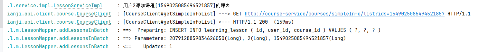

可以看到，消息发送后，LessonComsumer正确接收到消息，并调用lessonService，lessonService输出日志，并发起Feign同步请求，请求成功，然后执行插入，最后插入成功

> 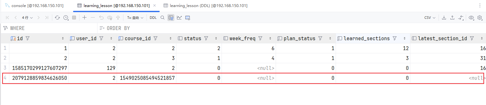

#### 分页查询我的课表

在开发接口之前，我们需要知道，当前登录用户的信息从何而来，所以我们模拟一下用户登录过程

天机学堂是一个微服务项目，所以用户的请求首先发往网关，再由网关路由到各个微服务，而用户登录凭证也会随之进行路由。在黑马商城项目中，我们便使用了以JWT令牌为基础的用户身份认证技术，用户在登录成功后，由后端下发一个JWT令牌，而后用户请求其他页面内容时，需要携带这个JWT的Token，这个Token通过网关进行认证，然后将用户凭证下发到各个微服务，微服务就能知道用户信息

所以接下来我们追踪一下源码，来研究一下天机学堂的用户登录过程是如何完成的。首先定位到网管微服务中的自定义拦截器

```java
package com.tianji.gateway.filter;

import com.tianji.authsdk.gateway.util.AuthUtil;
import com.tianji.common.domain.R;
import com.tianji.common.domain.dto.LoginUserDTO;
import com.tianji.gateway.config.AuthProperties;
import org.springframework.cloud.gateway.filter.GatewayFilterChain;
import org.springframework.cloud.gateway.filter.GlobalFilter;
import org.springframework.core.Ordered;
import org.springframework.http.server.reactive.ServerHttpRequest;
import org.springframework.stereotype.Component;
import org.springframework.util.AntPathMatcher;
import org.springframework.web.server.ServerWebExchange;
import reactor.core.publisher.Mono;

import java.util.List;

import static com.tianji.auth.common.constants.JwtConstants.AUTHORIZATION_HEADER;
import static com.tianji.auth.common.constants.JwtConstants.USER_HEADER;

@Component
public class AccountAuthFilter implements GlobalFilter, Ordered {

    private final AuthUtil authUtil;
    private final AuthProperties authProperties;
    private final AntPathMatcher antPathMatcher = new AntPathMatcher();

    public AccountAuthFilter(AuthUtil authUtil, AuthProperties authProperties) {
        this.authUtil = authUtil;
        this.authProperties = authProperties;
    }

    @Override
    public Mono<Void> filter(ServerWebExchange exchange, GatewayFilterChain chain) {
        // 1.获取请求request信息
        ServerHttpRequest request = exchange.getRequest();
        String method = request.getMethodValue();
        String path = request.getPath().toString();
        String antPath = method + ":" + path;

        // 2.判断是否是无需登录的路径
        if(isExcludePath(antPath)){
            // 直接放行
            return chain.filter(exchange);
        }

        // 3.尝试获取用户信息
        List<String> authHeaders = exchange.getRequest().getHeaders().get(AUTHORIZATION_HEADER);
        String token = authHeaders == null ? "" : authHeaders.get(0);
        R<LoginUserDTO> r = authUtil.parseToken(token);

        // 4.如果用户是登录状态，尝试更新请求头，传递用户信息
        if(r.success()){
            exchange.mutate()
                    .request(builder -> builder.header(USER_HEADER, r.getData().getUserId().toString()))
                    .build();
        }

        // 5.校验权限
        authUtil.checkAuth(antPath, r);

        // 6.放行
        return chain.filter(exchange);
    }

    private boolean isExcludePath(String antPath) {
        for (String pathPattern : authProperties.getExcludePath()) {
            if(antPathMatcher.match(pathPattern, antPath)){
                return true;
            }
        }
        return false;
    }

    @Override
    public int getOrder() {
        return 1000;
    }
}
```

在天机学堂项目中，定义了一个AccountAuthFilter，实现了GlobalFilter和Ordered，GlobalFilter用于实现拦截，Ordered用于排序。在filter方法中，首先通过exchange.getRequest()获取原始请求，然后获取请求方法和请求路径，拼接为`请求方法:请求路径`的形式，并传入isExcludePath方法，与排除路径进行匹配，如果该路径为排除路径，则直接放行。接着从请求头中获取权限字段，天机学堂中使用的字段为public static final String AUTHORIZATION_HEADER = "authorization"，然后传入AuthUtil的parseToken方法进行验证。parseToken返回一个自定义通用响应类R，通过调用R的success方法来判断解析是否正确，如果解析正确，则更新请求头字段，将用户信息保存在请求头中。此时再进行权限验证

```java
public void checkAuth(String antPath, R<LoginUserDTO> r){
    // 1.判断是否是需要权限的路径
    String matchPath = findMatchPath(antPath);
    if(matchPath == null){
        // 没有权限限制，直接放行
        return;
    }
    // 2.判断是否登录成功
    if(!r.success()){
        // 未登录，直接报错
        throw new UnauthorizedException(r.getCode(), r.getMsg());
    }
    // 3.获取当前路径所需权限
    PrivilegeRoleDTO pathPrivilege = findPathPrivilege(matchPath);

    // 4.权限判断
    Set<Long> requiredRoles = pathPrivilege.getRoles();
    if (!CollectionUtil.contains(requiredRoles, r.getData().getRoleId())) {
        // 没有访问权限
        throw new ForbiddenException(FORBIDDEN);
    }
}
```

这里可能产生一些疑问，为什么先传递用户信息，再进行权限验证？实际上，我们可以大致理解为，天机学堂希望用户信息的传递不受权限验证的约束，因为用户登录与用户拥有指定权限是两件事，在严格的权限管理项目中，用户拥有不同的身份，而先传递用户信息，是先告诉微服务，用户已经登录了，然后才是验证用户的身份能否访问指定的路径。但实际上，这种设计方式并不符合快速失败原则，因为checkAuth一旦失败，上文的exchange.mutate()就毫无意义，这会导致不必要的业务操作，虽然对性能影响微乎其微，但不符合设计规范

现在对网关验证有了初步认识，接下来我们研究一下其他的微服务是如何获取并验证用户信息的。在黑马商城项目中，我们为每个业务微服务定义了一套基于拦截器Interceptor的身份验证方式，即通过拦截器获取请求投中的用户信息，然后通过ThreadLocal添加到线程变量中，供下游调用。而由于所有的业务微服务都需要这个拦截器，因此我们直接将拦截器定义到了公共模块中，每个微服务只需要引入公共模块，然后依赖SpringBoot的自动装配，就可以在不写任何额外代码的情况下获取用户信息

```java
package com.tianji.authsdk.resource.interceptors;

import com.tianji.auth.common.constants.JwtConstants;
import com.tianji.common.utils.UserContext;
import lombok.extern.slf4j.Slf4j;
import org.springframework.web.servlet.HandlerInterceptor;

import javax.servlet.http.HttpServletRequest;
import javax.servlet.http.HttpServletResponse;

@Slf4j
public class UserInfoInterceptor implements HandlerInterceptor {

    @Override
    public boolean preHandle(HttpServletRequest request, HttpServletResponse response, Object handler) throws Exception {
        // 1.尝试获取头信息中的用户信息
        String authorization = request.getHeader(JwtConstants.USER_HEADER);
        // 2.判断是否为空
        if (authorization == null) {
            return true;
        }
        // 3.转为用户id并保存
        try {
            Long userId = Long.valueOf(authorization);
            UserContext.setUser(userId);
            return true;
        } catch (NumberFormatException e) {
            log.error("用户身份信息格式不正确，{}, 原因：{}", authorization, e.getMessage());
            return true;
        }
    }

    @Override
    public void afterCompletion(HttpServletRequest request, HttpServletResponse response, Object handler, Exception ex) throws Exception {
        // 清理用户信息
        UserContext.removeUser();
    }
}
```

定位到UserInfoInterceptor，先获取请求头中的用户信息，然后判断信息是否正确，最后按解析结果选择放行，这套流程与先前我们学习的基本相同。

下面我们就来开发分页查询我的课表接口

```java
@Override
//    @Transactional(isolation = Isolation.REPEATABLE_READ)
public PageDTO<LearningLessonVO> pageQuery(PageQuery pageQuery) {
    // 健壮性判断
    if (pageQuery == null)
        throw new BadRequestException("分页参数不能为空");
    // 获取用户信息
    Long userId = UserContext.getUser();
    if (userId == null)
        throw new UnauthorizedException("无法获取到用户信息");

    // 执行第一次查询，查询所有课程数量
    Long count = lessonMapper.countByUserId(userId);
    // 如果课程数量为0，则直接返回
    if (count == 0)
        return new PageDTO<>(0L, 1L, List.of());
    // 计算OFFSET
    Long offset = (long)(pageQuery.getPageNo() - 1) * (long)pageQuery.getPageSize();
    // 计算可能的最大页码
    int maxPageNo = (int) (count % pageQuery.getPageSize() == 0 ?
            count / pageQuery.getPageSize() :
            count / pageQuery.getPageSize() + 1);

    // 执行第二次查询，分页查询课表
    List<LearningLesson> lessons = lessonMapper.pageQuery(pageQuery, userId, offset);
    if (lessons == null || lessons.isEmpty())
        return new PageDTO<>(0L, 1L, List.of());

    // 获取各个课程的id
    Set<Long> courseIds = lessons.stream().map(LearningLesson::getCourseId).collect(Collectors.toSet());
    // 使用课程id查询课程信息
    List<CourseSimpleInfoDTO> courseInfos = courseClient.getSimpleInfoList(courseIds);
    if (courseInfos == null || courseInfos.isEmpty()) {
        log.error("课程信息不存在，请检查课程id");
        throw new BizIllegalException("课程信息不存在");
    }
    // 将courseInfos转换为Map<id, CourseSimpleInfoDTO>
    Map<Long, CourseSimpleInfoDTO> courseInfoMap = courseInfos.stream().collect(Collectors.toMap(CourseSimpleInfoDTO::getId, c -> c));
    // 创建List<LearningLessonVO>
    List<LearningLessonVO> list = new ArrayList<>(lessons.size());
    // 遍历lessons，插入数据
    for (LearningLesson lesson : lessons) {
        // 插入课表数据
        LearningLessonVO learningLessonVO = BeanUtils.copyBean(lesson, LearningLessonVO.class);
        // 获取课程信息
        CourseSimpleInfoDTO courseInfo = courseInfoMap.get(lesson.getCourseId());
        // 插入课程信息
        learningLessonVO.setCourseName(courseInfo.getName());
        learningLessonVO.setCourseCoverUrl(courseInfo.getCoverUrl());
        learningLessonVO.setSections(courseInfo.getSectionNum());
        // 插入list
        list.add(learningLessonVO);
    }
    // 返回结果
    return new PageDTO<>(count, (long) maxPageNo, list);
}
```

业务逻辑较长，我们来仔细分析一下。首先判断查询参数是否为空，然后获取用户信息。如果无法获取到用户信息，则说明网关没有传递，或者网关权限验证被绕过，因此需要立即阻拦。然后进行两次查询，第一次查询负责计算总条数，第二次再查询实际的数据体。如果第一次查询获取到的最大数量为0，则直接返回；然后计算SQL需要的OFFSET，这里没有使用PageHelper分页插件，因此需要我们自定义分页逻辑。然后计算可能的最大页码，因为前端需要最大页码来渲染分页条。一切无误后，开始进行第二次查询，第二次查询获取课表数据，如果课表数据为空，则直接返回。然后从课表数据中获取每个课程id，根据课程id获取其详细信息，获取到详细信息后，转换为一个Map，再遍历先前获取的课表信息，将课程信息与课表信息整合，最后返回即可

### 代码提交与分支合并

因为黑马没有提供相关接口文档，所以对于其他接口的开发暂不实现。现在假设我们已经完成了所有接口的开发，需要提交代码

在idea中找到feature-lessons分支，然后提交

> 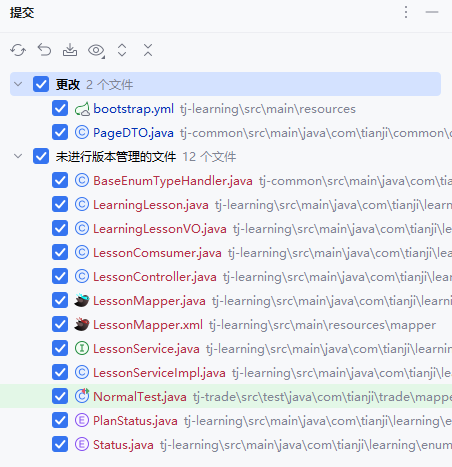

切换到dev分支

> 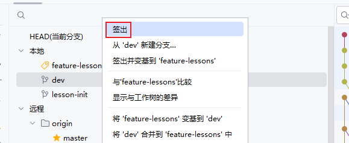

选中feature-lessons，然后合并到dev中

> 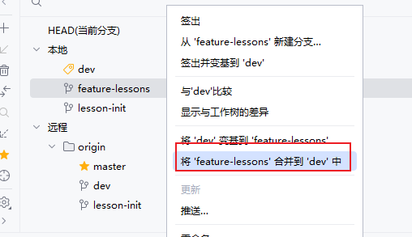

选择推送，就可以将代码提交到仓库中

> 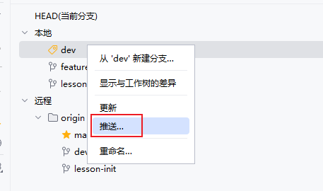

构建完成之后就可以在Jenkins启动learning服务了

> 

### 开发接口功能 II

#### 提交学习记录接口

在提交学习记录接口开发之前，我们还得开发一个校验当前用户是否可以学习当前课程的接口，在播放视频时需要调用这个接口，如果缺少这个接口，media-service会认为用户没有购买课程，从而导致视频播放失败

学习服务的Feign客户端接口如下

```java
/**
 * 校验当前用户是否可以学习当前课程
 * @param courseId 课程id
 * @return lessonId，如果是报名了则返回lessonId，否则返回空
 */
@GetMapping("/lessons/{courseId}/valid")
Long isLessonValid(@PathVariable("courseId") Long courseId);
```

按照Feign客户端的要求，我们定义相应的Controller即可

```java
@GetMapping("/{id}/valid")
@ApiOperation("查询课程是否有效")
public Long isLessonValid(@ApiParam("课程id") @PathVariable Long id) {
    log.debug("查询课程{}有效性", id);
    return lessonService.isLessonValid(id);
}
```

Service仅调用Mapper，所以直接省略，Mapper也很简单

```java
/**
 * 判断课程是否有效
 * @param id 课程id
 * @return 课程是否有效
 */
@Select("select course_id from learning_lesson where course_id = #{id}")
Long isLessonValid(Long id);
```

然后就可以着手开发提交学习记录接口。首先需要对这个接口有初步的认识，数据库中定义了一张学习记录表，表DDL如下

```mysql
-- auto-generated definition
create table learning_record
(
    id          bigint                             not null comment '学习记录的id'
        primary key,
    lesson_id   bigint                             not null comment '对应课表的id',
    section_id  bigint                             not null comment '对应小节的id',
    user_id     bigint                             not null comment '用户id',
    moment      int      default 0                 null comment '视频的当前观看时间点，单位秒',
    finished    bit      default b'0'              not null comment '是否完成学习，默认false',
    create_time datetime default CURRENT_TIMESTAMP not null comment '第一次观看时间',
    finish_time datetime                           null comment '完成学习的时间',
    update_time datetime default CURRENT_TIMESTAMP not null on update CURRENT_TIMESTAMP comment '更新时间（最近一次观看时间）'
)
    comment '学习记录表' charset = utf8mb4
                         row_format = DYNAMIC;

create index idx_lesson_id
    on learning_record (lesson_id, section_id);

create index idx_update_time
    on learning_record (update_time);

create index idx_user_id
    on learning_record (user_id);
```

在观看视频时，前段会定期向后端发送一条请求，以存储学习记录，请求如下

> 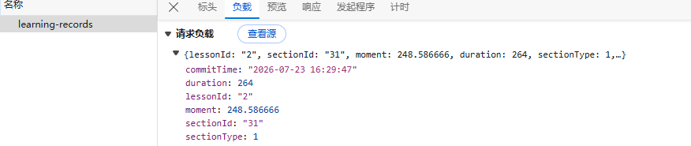

所以当请求到来时，我们就需要获取请求中的数据，并添加到数据库中。首先定义数据库po实体

```java
package com.tianji.learning.domain.po;

import lombok.AllArgsConstructor;
import lombok.Builder;
import lombok.Data;
import lombok.NoArgsConstructor;

import java.time.LocalDateTime;

@Data
@AllArgsConstructor
@NoArgsConstructor
@Builder
public class LearningRecord {
    // 学习记录id
    private Long id;

    // 课表id
    private Long lessonId;

    // 正在学习小节id
    private Long sectionId;

    // 用户id
    private Long userId;

    // 当前播放时间，单位秒
    private Integer moment;

    // 是否学习完成
    private Boolean finished;

    // 完成时间
    private LocalDateTime finishTime;

    // 创建时间，第一次观看时间
    private LocalDateTime createTime;

    // 更新时间，最近一次观看时间
    private LocalDateTime updateTime;
}
```

然后定义请求参数DTO

```java
package com.tianji.api.dto.leanring;

import io.swagger.annotations.ApiModel;
import io.swagger.annotations.ApiModelProperty;
import lombok.Data;

import java.time.LocalDateTime;

@Data
@ApiModel(description = "学习记录表单数据")
public class LearningRecordFormDTO {

    @ApiModelProperty("小节类型：1-视频，2-考试")
    private Integer sectionType;

    @ApiModelProperty("课表id")
    private Long lessonId;

    @ApiModelProperty("对应节的id")
    private Long sectionId;

    @ApiModelProperty("视频总时长，单位秒")
    private Integer duration;

    @ApiModelProperty("视频的当前观看时长，单位秒，第一次提交填0")
    private Integer moment;

    @ApiModelProperty("提交时间")
    private LocalDateTime commitTime;
}
```

可以看到，LearningRecordFormDTO并不直接对应LearningRecord，我们先理清提交学习记录的逻辑。在后端接收请求后，需要先判断数据库中是否存在该章节的记录，如果已经存在记录，则应该更新而不是新增。对于更新，先判断章节类型，天机学堂的课程章节设置为了考试和视频两个类型，如果是考试，则不需要记录播放时间等等，直接记录章节完成即可，因为考试的学习记录是在试卷提交时发送的，所以不需要考虑设置为完成后，考试由于某些原因退出后，从而导致数据库中已完成，但实际未完成的现象。而视频就是根据提交的视频总时长duration与moment进行计算，我们设置为当moment大于duration的二分之一时，则认为章节已经完成，数据库中应更新finished和finish_time字段；如果该视频已经是完成状态，则只更新学习记录表中的视频进度即可。最后再更新课表

对于新增数据，同样先判断是否符合是否是考试，如果为考试，则直接完成，设置视频进度为0。然后计算视频类型的学习记录是否达标，再插入数据库中，最后更新课表

```java
@Override
@Transactional
public void commitLearningRecord(LearningRecordFormDTO form) {
    // 判断提交数据为空
    if (form == null)
        throw new BadRequestException("提交数据不能为空");
    // 获取请求参数
    Long lessonId = form.getLessonId();
    if (lessonId == null)
        throw new BadRequestException("课表id不能为空");
    Long sectionId = form.getSectionId();
    if (sectionId == null)
        throw new BadRequestException("小节id不能为空");
    Integer sectionType = form.getSectionType();
    if (sectionType == null)
        throw new BadRequestException("小节类型不能为空");
    if (!Objects.equals(sectionType, 1) && !Objects.equals(sectionType, 2))
        throw new BadRequestException("小节类型错误");
    LocalDateTime commitTime = form.getCommitTime();
    Integer duration = form.getDuration();
    if (duration == null)
        throw new BadRequestException("视频时长不能为空");
    Integer moment = form.getMoment();
    if (moment == null)
        throw new BadRequestException("视频播放位置不能为空");
    // 获取用户信息
    Long userId = UserContext.getUser();
    if (userId == null)
        throw new UnauthorizedException("无法获取用户信息");

    // 尝试从数据库中查询该记录
    LearningRecord record = learningRecordMapper.queryLearningRecord(lessonId, sectionId, userId);
    // 记录是否有章节完成
    int finished = 0;
    // 如果有记录，则更新该记录
    if (record != null) {
        // 如果是考试，直接返回
        if (Objects.equals(sectionType, 2))
            return;
        // 设置新的播放时间
        record.setMoment(moment);
        // 如果没有完成
        if (!record.getFinished()) {
            // 如果播放时间已经超过总时长的50%，则认为章节已完成
            record.setFinished(duration - moment < moment);
            // 如果第一次完成，则设置完成时间
            if (record.getFinished()) {
                // 设置完成时间
                record.setFinishTime(commitTime);
                finished = 1;
            }
        }
        // 更新记录
        learningRecordMapper.updateById(record);
    } else {
        // 如果没有记录，则插入一条新的记录
        record = LearningRecord.builder()
                .id(IdWorker.getId())
                .lessonId(lessonId)
                .sectionId(sectionId)
                .userId(userId)
                .build();
        // 如果是考试，则立即完成
        if (Objects.equals(sectionType, 2)) {
            record.setMoment(0);
            record.setFinished(true);
            record.setFinishTime(commitTime);
            finished = 1;
        } else {
            // 不是考试，则按照播放位置判断完成
            record.setMoment(moment);
            record.setFinished(duration - moment < moment);
            record.setFinishTime(record.getFinished() ? commitTime : null);
            finished = record.getFinished() ? 1 : 0;
        }
        // 插入记录
        learningRecordMapper.insert(record);
    }
    // 更新课表
    LearningLesson lesson = lessonService.getById(lessonId);
    LearningLesson newLesson = LearningLesson.builder()
            .id(lessonId)
            .latestSectionId(sectionId)
            .latestLearnTime(commitTime)
            .learnedSections(lesson.getLearnedSections() + finished)
            .build();
    Integer update = lessonService.updateById(newLesson);
    if (!Objects.equals(update, 1))
        throw new DbException("更新课表失败");
}
```

对于这个方法，有一些需要注意的点。首先是需要使用一个finished来记录是否有完成事件，因为课表中需要维护一个learnedSections字段，只有当完成事件发生时才允许learnedSections自增，而完成事件不能通过record本身的getFinished来判断，因为在更新时，有些record的getFinished字段可能已经为true，而如果按照getFinished来判断，则会导致每一个已经完成的视频进度提交时，都会让课表中的learnedSections自增。因此我们设计了int finished = 0来维护完成事件，只有当第一次完成时才加一，让课表更新时能够自增

同时，这里对于完成度的计算并不直接基于浮点数，计算机浮点运算永远存在误差，所以我们直接基于整型运算，通过duration - moment < moment来判断播放是否达标，只有当剩下的视频进度小于已经播放的进度时，才认为学习已经达标

不过这个接口的远程调用相当多，数据库调用也很多，而且这还是一个常用接口，视频在播放时就会大量自动提交，因此在后续的学习中，我们可以考虑对这个接口进行性能优化

#### 创建学习计划

下面我们来开发创建学习计划的接口，创建学习计划与更新学习计划属于同一个接口，操作的数据库为课表表中的week_freq字段

首先来定义DTO实体类，不过相较于之前的DTO实体，这次我们引入Spring Validation框架，在Controller层优先判断数据格式与数据为空问题。在Spring Validation中， 使用@NotNull显式声明一个不能为空的字段，一般为数值类型；使用@NotBlank声明一个不能为空的字符串，@NotBlank出了判断null，还会判断空字符串、空格、换行符等等

```java
package com.tianji.learning.domain.dto;

import io.swagger.annotations.ApiModel;
import io.swagger.annotations.ApiModelProperty;
import lombok.AllArgsConstructor;
import lombok.Builder;
import lombok.Data;
import lombok.NoArgsConstructor;
import lombok.experimental.Accessors;
import org.hibernate.validator.constraints.Range;

import javax.validation.constraints.Min;
import javax.validation.constraints.NotNull;

@Data
@NoArgsConstructor
@AllArgsConstructor
@ApiModel(description = "学习计划信息")
@Builder
@Accessors(chain = true)
public class LeaningPlanDTO {

    @NotNull
    @ApiModelProperty("课程id")
    @Min(1L)
    private Long courseId;

    @NotNull
    @ApiModelProperty("每周学习频率")
    @Range(min = 1, max = 20)
    private Integer freq;
}
```

在LeaningPlanDTO中，我们使用了@Min和@Range注解，这是针对数值类型的特殊约束注解，部分由Hibernate提供。在DTO定义完成后，就可以开发业务逻辑了。对于已经添加参数校验的DTO，需要在其Controller参数上添加@Valid注解，告诉SpringMVC该参数需要根据其自身的注解进行参数校验

```java
@PostMapping("/plans")
@ApiOperation("添加或更新学习计划")
public void pushLearningPlans(@Valid @RequestBody @ApiParam("学习计划DTO") LeaningPlanDTO plan) {
    log.debug("添加或更新学习计划：{}", plan);
    lessonService.pushLearningPlans(plan);
}
```

然后定义Service，在Service中，我们使用了自定义断言类AssertUtils来帮助我们判断数据格式，但是用户字段的判断不能用AssertUtils，因为AssertUtils默认只会抛出BadRequestException，而无法获取到用户信息属于UnauthorizedException，需要返回401。然后由课表中的计划状态来判断是否需要更新计划状态，最后设置新的周频率

```java
@Override
@Transactional
public void pushLearningPlans(LeaningPlanDTO plan) {
    // 获取用户信息
    Long userId = UserContext.getUser();
    if (userId == null)
        throw new UnauthorizedException("无法获取用户信息");
    // 获取课表信息
    LearningLesson lesson = lessonMapper.queryLessonByUserIdAndCourseId(userId, plan.getCourseId());
    AssertUtils.isNotNull(lesson, "未查询到当前用户课表");

    LearningLesson newLesson = new LearningLesson()
            .setId(lesson.getId());
    // 判断计划状态，如果是未开始，则将计划状态更改为进行中
    if (Objects.equals(lesson.getPlanStatus(), PlanStatus.NO_PLAN)) {
        newLesson.setPlanStatus(PlanStatus.PLAN_IN_PROGRESS);
    }
    // 设置新的周频率
    newLesson.setWeekFreq(plan.getFreq());
    // 更新课表信息
    Integer update = lessonMapper.updateById(newLesson);
    AssertUtils.isTrue(update > 0, "更新课表信息失败");
}
```

> 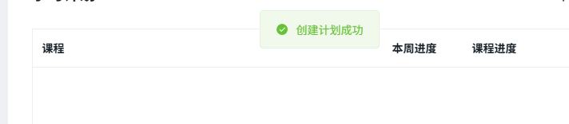

#### 查询学习计划

查询学习计划接口不仅仅是查询某个课程的学习计划，而是需要查询统计用户本周的学习计划及其进度，数据相对较多，还需要分页查询。同样地，首先定义DTO实体，由于是分页查询，我们需要定义LearningPlanVO和LearningPlanPageVO

```java
package com.tianji.learning.domain.vo;

import lombok.AllArgsConstructor;
import lombok.Builder;
import lombok.Data;
import lombok.NoArgsConstructor;
import lombok.experimental.Accessors;

import java.time.LocalDate;
import java.time.LocalDateTime;

@Data
@AllArgsConstructor
@NoArgsConstructor
@Builder
@Accessors(chain = true)
public class LearningPlanVO {

    // 课程id
    private Long courseId;

    // 课程名称
    private String courseName;

    // 本周已学节数
    private Integer weekLearnedSections;

    // 本周频率
    private Integer weekFreq;

    // 总计已学节数
    private Integer learnedSections;

    // 总计节数
    private Integer sections;

    // 最新学习时间
    private LocalDateTime latestLearnTime;
}
```

```java
package com.tianji.learning.domain.vo;

import com.tianji.common.domain.dto.PageDTO;
import lombok.*;
import lombok.experimental.Accessors;
import lombok.experimental.SuperBuilder;

@EqualsAndHashCode(callSuper = true)
@Data
@AllArgsConstructor
@NoArgsConstructor
@SuperBuilder
@Accessors(chain = true)
public class LearningPlanPageVO extends PageDTO<LearningPlanVO> {

    // 周积分
    private Integer weekPoints;

    // 周完成数
    private Integer weekFinished;

    // 周计划数
    private Integer weekTotalPlan;
}
```

对于LearningPlanPageVO，需要继承PageDTO来确保LearningPlanPageVO也是一个分页实体，同时能够继承PageDTO中的方法；而Lombok默认不会生成父类构造器，因此需要显式声明@SuperBuilder来调用super，同时，父类PageDTO中也需要显式声明@SuperBuilder

```java
@Data
@NoArgsConstructor
@AllArgsConstructor
@ApiModel(description = "分页结果")
@SuperBuilder
public class PageDTO<T> {
    @ApiModelProperty("总条数")
    protected Long total;
    @ApiModelProperty("总页码数")
    protected Long pages;
    @ApiModelProperty("当前页数据")
    protected List<T> list;
}
```

接着来完成查询学习计划的逻辑实现，查询学习计划是一个非常复杂的逻辑，我们逐一详细讲解。由于逻辑较长，我们将分段进行

```java
// 获取用户信息
Long userId = UserContext.getUser();
if (userId == null)
    throw new UnauthorizedException("无法获取用户信息");
// 从课表中获取有学习计划的课程
List<LearningLesson> lesson = lessonMapper.queryLessonsByUserIdAndHavingPlan(userId);
// 如果课表中没有学习计划，则直接返回
if (lesson.isEmpty()) {
    LearningPlanPageVO learningPlanPageVO = new LearningPlanPageVO()
            .setWeekFinished(0)
            .setWeekTotalPlan(0)
            .setWeekPoints(0);
    learningPlanPageVO.setList(List.of());
    learningPlanPageVO.setPages(0L);
    learningPlanPageVO.setTotal(0L);
    return learningPlanPageVO;
}
// 将lesson转换为Map<courseId, LearningLesson>
Map<Long, LearningLesson> lessonMap = lesson.stream().collect(Collectors.toMap(LearningLesson::getCourseId, l -> l));
// 获取所有课程id
Set<Long> courseIds = lesson.stream().map(LearningLesson::getCourseId).collect(Collectors.toSet());
// 通过课程id获取课程信息
List<CourseSimpleInfoDTO> courseInfo = courseClient.getSimpleInfoList(courseIds);
AssertUtils.isNotEmpty(courseInfo, "无法获取课程信息");
```

首当其冲的当然是获取用户信息，因为查询学习计划是针对用户本人的学习计划，然后从课表表中获取已经规划了学习计划的课程，如果课表中没有课程，或者有课程没有学习计划，直接返回。然后获取所有课程的id，这里使用Set避免id重复，再利用课程id查询对应的课程详细信息。如果无法查询到课程对应的课程详细信息，则直接报错，因为后续的数据如课程名称、课程章节数依赖于课程详细信息，如果没有这些内容，程序无法继续进行；而 将lesson转换为Map<courseId, LearningLesson> 这一步是方便后续调用

```java
// 获取课用户所有学习记录
List<LearningRecord> learningRecords = learningRecordService.queryLearningRecordsByUserId(userId);
// 如果没有学习记录，直接返回
if (learningRecords.isEmpty()) {
    List<LearningPlanVO> list = new ArrayList<>(lesson.size());
    // 遍历课程信息，将课程信息、课表信息封装成LearningPlanVO
    for (CourseSimpleInfoDTO course : courseInfo) {
        list.add(LearningPlanVO.builder()
                .courseId(course.getId())
                .courseName(course.getName())
                .weekLearnedSections(0)
                .weekFreq(lessonMap.get(course.getId()).getWeekFreq())
                .learnedSections(0)
                .sections(course.getSectionNum())
                .latestLearnTime(null)
                .build()
        );
    }
    // 创建LearningPlanPageVO
    LearningPlanPageVO learningPlanPageVO = new LearningPlanPageVO()
            .setWeekFinished(0)
            .setWeekTotalPlan(lesson.stream().mapToInt(LearningLesson::getWeekFreq).sum())
            .setWeekPoints(0);
    // 计算总页数
    Long maxPage = Math.max(1, (long) Math.ceil(list.size() / (double) pageQuery.getPageSize()));
    learningPlanPageVO.setPages(maxPage);
    learningPlanPageVO.setTotal((long) list.size());
    // 计算当前分页的数据
    if (pageQuery.getPageNo() > maxPage) {
        learningPlanPageVO.setList(List.of());
    } else {
        int from = pageQuery.from();
        int to = Math.min(from + pageQuery.getPageSize(), list.size());
        learningPlanPageVO.setList(list.subList(from, to));
    }
    // 返回
    return learningPlanPageVO;
}
```

在确认课程信息无误后，检查用户的学习记录，如果学习记录为空，则直接返回。这里的学习记录为空表示用户已经购买了课程，并且添加了学习计划，但是还未开始学习，因此需要将所有有学习计划的课程信息返回，同时将课程对应的学习计划也封装到LearningPlanVO中，仅仅将学习进度设置为0即可。这里的分页使用了内存分页而非数据库分页，主要是方便获取学习计划总数，而且学习计划理论上数据不会太多

```java
// 获取当前周期
LocalDate today = LocalDate.now();
LocalDateTime weekStart = today
        .with(TemporalAdjusters.previousOrSame(DayOfWeek.MONDAY))
        .atStartOfDay();
LocalDateTime weekEnd = today
        .with(TemporalAdjusters.nextOrSame(DayOfWeek.SUNDAY))
        .atTime(LocalTime.MAX);

// 将learningRecords转换为Map<sectionId, LearningRecord>
Map<Long, LearningRecord> learningRecordMap = learningRecords.stream()
        .collect(Collectors.toMap(LearningRecord::getSectionId, lr -> lr));

// 拼接所有数据
LearningPlanPageVO learningPlanPageVO = new LearningPlanPageVO();
List<LearningPlanVO> list = new ArrayList<>(lesson.size());
// TODO：学习积分计算
learningPlanPageVO.setWeekPoints(0);
// 本周计划总数
learningPlanPageVO.setWeekTotalPlan(lesson.stream().mapToInt(LearningLesson::getWeekFreq).sum());
```

下面就是这个方法的核心与难点，当存在用户学习进度时的学习计划查询与计算。我们首先计算本周的起始与结束时间，再将获取到的学习记录转换为以章节id为键的Map集合，方便后续调用。然后开始拼接数据，先创建一个长度为已经规划了学习计划的课程的数组，避免后续扩容。然后设置学习积分，由于积分系统暂未实现，暂且设置为0，然后获取课表中已经规划了学习计划的课程的学习计划，统计为每周学习计划总数

```java
// 本周完成总数
    Integer weekFinished = 0;
    // 查询课程包含的小节id
    for (Long courseId : courseIds) {
        // 本周已学节数
        int weekLearnedSections = 0;
        // 总已学习节数
        int learnedSections = 0;
        // 获取课程详细信息
        CourseFullInfoDTO courseFullInfo = courseClient.getCourseInfoById(courseId, true, false);
        if (courseFullInfo == null || courseFullInfo.getChapters().isEmpty()) {
            throw new BadRequestException("无法获取课程详细信息");
        }
        // 获取课程包含的节信息
        List<CatalogueDTO> chapters = courseFullInfo.getChapters();
        // 从章信息中获取节信息
        List<CatalogueDTO> sections = chapters.stream()
                .map(CatalogueDTO::getSections)
                .filter(Objects::nonNull)
                .flatMap(Collection::stream)
                .collect(Collectors.toList());
        // 遍历节，获取学习记录
        for (CatalogueDTO section : sections) {
            LearningRecord learningRecord = learningRecordMap.get(section.getId());
            // 如果没有学习记录，则跳过
            if (learningRecord == null) continue;
            // 如果未完成，则跳过
            if (!learningRecord.getFinished()) continue;
            // 判断完成时间，如果在当前周期内，则计数
            if (learningRecord.getFinishTime().isAfter(weekStart) && learningRecord.getFinishTime().isBefore(weekEnd)) {
                weekLearnedSections++;
                weekFinished++;
            }
            learnedSections++;
        }
        // 构建LearningPlanVO
        list.add(LearningPlanVO.builder()
                .courseId(courseId)
                .courseName(courseFullInfo.getName())
                .weekLearnedSections(weekLearnedSections)
                .weekFreq(lessonMap.get(courseId).getWeekFreq())
                .learnedSections(learnedSections)
                .sections(courseFullInfo.getSectionNum())
                .latestLearnTime(lessonMap.get(courseId).getLatestLearnTime())
                .build()
        );
    }
    // 计算总页数
    Long maxPage = Math.max(1, (long) Math.ceil(list.size() / (double) pageQuery.getPageSize()));
    learningPlanPageVO.setPages(maxPage);
    learningPlanPageVO.setTotal((long) list.size());
    // 计算当前分页的数据
    if (pageQuery.getPageNo() > maxPage) {
        learningPlanPageVO.setList(List.of());
    } else {
        int from = pageQuery.from();
        int to = Math.min(from + pageQuery.getPageSize(), list.size());
        learningPlanPageVO.setList(list.subList(from, to));
    }
    // 返回
    learningPlanPageVO.setWeekFinished(weekFinished);
    return learningPlanPageVO;
}
```

本周完成总数是最难计算的，我们先声明一个外部变量weekFinished，然后遍历所有课程，这里最麻烦的其实是黑马并没有提供课程id与章节id的直接映射，有这张表，但是没有这个接口。如果想要获取一个课程的全部章节id，则只能通过课程id获取课程的全部信息实体，从实体中获取章实体，最后再获取节实体，并获取节id，黑马也没有提供批量查询接口，导致这里必须进行RPC调用，严重影响查询性能。

回到代码中，我们定义了本周已学节数和总已学节数。通过判断学习计划中的每个完成时间，如果在本周，则两个都自增，如果不在本周，则只有总已学节数自增。然后获取课程详细信息，这里只能调用一个单次查询接口，所以必须事先遍历课程id。如果无法获取课程详细信息，则直接抛出异常。然后从课程实体中利用stream流获取节信息，再遍历节，获取节id，通过节id从学习记录表中获取每个节的学习情况，根据完成时间判断是否为本周学完的，如果是，则自增weekFinished和weekLearnedSections，需要注意weekFinished是用户本周完成的节总数，而weekLearnedSections是每个课程的周完成节计数。全部计算完成后，构建每个课程的LearningPlanVO

最后的逻辑与之前相同，进行内存分页，然后封装数据并返回。这里不使用数据库分页是因为数据库分页无法实现我们需要的逻辑，课表表中并没有记录每个章节的完成状况，如果使用数据库分页，则无法得知哪些课程在本周存在学习记录。这里不能通过最近学习时间来判断，因为已经完成的章节再次学习后，同样会记录最近学习时间；而且返回的数据中需要记录学习的总进度，要么按照课程查询每个课程的所有学习记录，要么查询所有学习记录，再按照课程id进行分组。在给妈商城项目中，课程记录相对较少，因此我们选择后者

根本原因就是缺乏课程id与章节id的直接映射接口，导致我们只能通过
$$
课表 \Rightarrow 课程id \Rightarrow 课程详细信息 \Rightarrow 章 \Rightarrow 节 \Rightarrow节id
$$
这样的方式来间接获取节id，增加了大量的中间过程

### 高并发优化

在黑马商城项目中，学习进度的记录是由前端每15秒发送一个POST请求到后端，或者当用户手动点击播放进度时，也会提交一个POST请求到后端，来存储提交的视频播放进度。而在相应的提交学习记录接口中，存在大量的数据库操作，如learningRecordMapper.queryLearningRecord(lessonId, sectionId, userId)、learningRecordMapper.updateById(record)、learningRecordMapper.insert(record)，以及远程调用操作lessonService.getById(lessonId)。在高并发情况下，这会造成大量的性能损失，假设有十万用户同时播放视频，默认每15秒记录一次播放进度，那么理论上单个用户每秒产生的请求数为$1 \div 15 \approx 0.0666667$，十万用户总计QPS大约为6667。一般来说，一台4C8G的服务器部署Spring项目，能够承载的常规后端服务QPS为500，最大800，如果需要承载6667QPS，则至少需要14台服务器。对于常规企业而言，这完全是不可接受的，因此需要进行优化

一般来说，高并发优化分为三个方向。第一，提高单机并发，尽可能减小业务接口的RT（响应时间 ResponseTime），提升单机性能和并发能力；第二，水平扩展，将热点服务水平扩展，做好负载均衡，提高集群并发能力；第三，服务保护，做好服务熔断、服务降级保护措施，提高服务的高可用性。水平扩展和服务保护一般是基于业务架构进行操作，而作为代码开发人员，我们能实施的目前只有提高单机并发

而提高单机并发，也就是提升单机的读写性能，读性能可以通过优化代码、SQL以及设置缓存来提升，而写性能除了优化代码、SQL外，还可以将同步写改为异步写，以及合并写请求

**异步写**

异步写是指将原本的同步写操作基于消息队列改为异步执行。假设接口A需要调用三个数据库写操作，每个写操作耗时100ms，那么接口总耗时就是300ms，属于较慢的RT。而如果我们不直接调用每个数据库写操作，而是发送一条MQ消息，然后由三个数据库写接口自己接收消息并消费，那么对于用户端来说，RT就可以缩短为接口调用到消息发送的总时长，远远小于300ms

对于异步写，优点是无需等待，大大减少RT；而且可以利用MQ暂存消息，进行流量削峰整型；同时降低写频率，减轻数据库并发压力。而缺点也很明显，需要依赖MQ可靠性，没有减少数据库写次数，仅仅是降低频率

**合并写**

合并写是指利用缓存的高性能，在进行数据库写操作时不直接写进数据库，而是写进数据库缓存中，再定义一个定时任务，从数据库缓存中提取写数据，再将数据一并写入数据库中。继续使用上文的例子，这次不再发送MQ消息，而是将数据写入Redis等缓存数据库中，然后额外定义一个定时任务，从Redis中获取需要写入的数据，再一次性写入数据库中，减少数据库写操作

合并写的优点是写缓存速度快，可以大大减少响应时间；同时降低了数据库写频率和写次数，减轻数据库并发压力。而缺点是实现相对复杂，而且强依赖缓存系统可靠性，并且不支持事务和复杂业务

#### 提交学习记录接口优化

首先对播放进度提交的代码进行一些复习，这里就只粘贴核心片段

```java
// 尝试从数据库中查询该记录
LearningRecord record = learningRecordMapper.queryLearningRecord(lessonId, sectionId, userId);
// 记录是否有章节完成
int finished = 0;
// 如果有记录，则更新该记录
if (record != null) {
    // 如果是考试，直接返回
    if (Objects.equals(sectionType, 2))
        return;
    // 设置新的播放时间
    record.setMoment(moment);
    // 如果没有完成
    if (!record.getFinished()) {
        // 如果播放时间已经超过总时长的50%，则认为章节已完成
        record.setFinished(duration - moment < moment);
        // 如果第一次完成，则设置完成时间
        if (record.getFinished()) {
            // 设置完成时间
            record.setFinishTime(commitTime);
            finished = 1;
        }
    }
    // 更新记录
    learningRecordMapper.updateById(record);
} else {
    // 如果没有记录，则插入一条新的记录
    record = LearningRecord.builder()
            .id(IdWorker.getId())
            .lessonId(lessonId)
            .sectionId(sectionId)
            .userId(userId)
            .build();
    // 如果是考试，则立即完成
    if (Objects.equals(sectionType, 2)) {
        record.setMoment(0);
        record.setFinished(true);
        record.setFinishTime(commitTime);
        finished = 1;
    } else {
        // 不是考试，则按照播放位置判断完成
        record.setMoment(moment);
        record.setFinished(duration - moment < moment);
        record.setFinishTime(record.getFinished() ? commitTime : null);
        finished = record.getFinished() ? 1 : 0;
    }
    // 插入记录
    learningRecordMapper.insert(record);
}
// 更新课表
LearningLesson lesson = lessonService.getById(lessonId);
LearningLesson newLesson = LearningLesson.builder()
        .id(lessonId)
        .latestSectionId(sectionId)
        .latestLearnTime(commitTime)
        .learnedSections(lesson.getLearnedSections() + finished)
        .build();
Integer update = lessonService.updateById(newLesson);
if (!Objects.equals(update, 1))
    throw new DbException("更新课表失败");
```

首先尝试从数据库中查询该记录，如果存在记录，则应当更新记录，而不是插入新记录。注意这里维护了一个int finished来记录本次提交是否有学习状态变更，因为针对课表的更新是统一进行的，课表在更新时需要得知当前提交记录是否需要将已学节数进行自增。进入更新逻辑，首先判断是否为考试，如果是考试，则应当直接返回，其实理论上来说并不存在考试进度二次提交的问题，因为考试记录的提交只会在考试交卷时进行，而天机学堂中每个考试只能进行一次，用户对于每个考试仅有一次考试记录提交的机会，这一次一定是新增记录。但后端同样需要进行过滤，以避免恶意请求导致的存在多个考试记录的问题。

然后设置新的播放时间，再判断该记录是否已经完成过，如果没有完成过，则需要根据播放时长计算是否完成。如果是第一次完成，则应该设置完成时间，并设置已完成加一，最后更新记录

而高并发优化的目标正是这个更新操作，插入操作每个用户只会完成一次，所以不需要额外优化。对于这个更新接口，我们可以利用合并写来进行优化，合并写相较于异步写性能更加优越，而且在更新逻辑中，更新操作与业务强相关，不应使用MQ强行解耦

**Redis数据结构**

确定了合并写方案，还需要确定Redis中存取哪些数据，我们可以根据业务需求来进行分析。最重要的就是用户的播放进度moment，而播放进度需要对应一个课程小节，所以还需要sectionId，而学习记录表中可能存在不同用户的相同课程的学习进度，因此我们还需要一个字段来区分不同的用户，这里就不使用userId，而是lessonId。详细数据结构如下

| KEY      | HashKey   | HashValue                           |
| -------- | --------- | ----------------------------------- |
| lessonId | sectionId | {id: 1, moment: 1, finished: false} |

设置这样的数据结构，是为了在进行查询时也可以直接查询缓存中的数据，而不需要向数据库发送请求。首先用户提交学习记录，然后后端从缓存中查询当前用户的学习记录，如果不存在，则向数据库申请，如果数据库中也不存在，则认为用户第一次提交记录，直接请求数据库即可。如果数据库中存在，则使用数据库中的数据继续；然后判断是否是第一次学完，如果已经学过，则直接将进度更新到缓存中，然后返回。如果还没学完，则根据视频进度判断是否第一次学完，没学完的，与已经学过的相同路径，更新视频进度，然后返回；对于第一次学完的，立即更新数据库中的学习状态，并删除对应缓存，保证数据一致性

而合并写就是针对于已经完成的和第一次没有完成的，一般的合并写操作是定义一个定时任务，周期性地从缓存中获取数据，并执行数据库更新操作。但在我们的接口这会存在一个问题，假设一个视频长度300秒，用户每观看15秒就会发送一个记录请求，假设用户从第151秒断开，目前已经提交了10次请求，却只有最后一次请求属于有效请求，这会白白浪费9次数据库更新操作。因此，数据库更新的时期不应该是定期的，而是用户离开的时刻，而用户离开后最明显的特征就是时长不再发生变化，或者不再有请求提交到后端。我们设置的每15秒提交一个请求，假设用户已经20秒没有再提交新的请求，那么我们就可以认为，用户已经没有再播放视频，就可以执行数据库插入操作了。而这里就需要利用延迟任务来实现了

#### 延迟任务

延迟任务是指任务发起者申请的一个需要延迟执行的任务，延迟任务的执行相对于任务发起者是异步的，不应阻塞发起者的任务执行。目前主流的延迟任务方案有四类，如下：

- DelayQueue：JDK自带的延迟队列功能，存入队列的元素可以指定延迟执行的时间
- Redisson：基于Redis数据结构模拟的JDK的DelayQueue，相较于JDK原生DelayQueue可以减轻内存负担
- MQ：基于消息队列的延迟消息实现延迟任务，一些MQ本身就支持延迟消息，如RocketMQ
- 时间轮：基于时间轮算法实现的延迟任务或者定时任务，但是需要开发者自己实现，或者利用现成的如Netty中，有开源的实现

针对天机学堂的提交学习记录接口，我们直接利用最简单的DelayQueue来实现

**示例**

创建一个DelayedTask，实现Delayed接口，需要实现getDelay和compareTo两个方法

```java
package com.tianji.learning.task;

import java.util.concurrent.Delayed;
import java.util.concurrent.TimeUnit;

public class DelayedTask implements Delayed {
    @Override
    public long getDelay(TimeUnit unit) {
        return 0;
    }

    @Override
    public int compareTo(Delayed o) {
        return 0;
    }
}
```

getDelay用于获取剩余时间计数，compareTo用于比较哪个任务剩余时间更多

```
package com.tianji.learning.task;

import lombok.AllArgsConstructor;
import lombok.Data;

import java.util.concurrent.Delayed;
import java.util.concurrent.TimeUnit;

@Data
@AllArgsConstructor
public class DelayedTask<D> implements Delayed {

    private D data;

    private final long startTime = System.nanoTime();
    private final long delay;

    @Override
    public long getDelay(TimeUnit unit) {
        return unit.convert(startTime +  delay - System.nanoTime(), TimeUnit.NANOSECONDS);
    }

    @Override
    public int compareTo(Delayed o) {
        return (int) (this.getDelay(TimeUnit.MILLISECONDS) - o.getDelay(TimeUnit.MILLISECONDS));
    }
}
```

对于getDelay，我们通过在构建对象时，使用System.nanoTime()获取当前系统时间，也就是开始时间，然后传入参数delay，计算startTime + delay就可以获取任务结束时间。调用getDelay时，只需要通过结束时间减去当前时间即可得到剩余时间

现在我们定义一个测试类，编写三个测试任务，设置任务延迟时间分别为5s、3s、1s

```java
package com.tianji.learning.task;

import lombok.extern.slf4j.Slf4j;
import org.junit.jupiter.api.Test;

import java.util.concurrent.DelayQueue;

@Slf4j
class DelayedTaskTest {
    @Test
    void test() throws InterruptedException {
        // 声明一个延迟任务队列
        DelayQueue<DelayedTask<String>> queue = new DelayQueue<>();
        // 向队列中添加任务
        queue.add(new DelayedTask<>("task1", secToNano(5)));
        queue.add(new DelayedTask<>("task2", secToNano(3)));
        queue.add(new DelayedTask<>("task3", secToNano(1)));
        // 获取任务
        log.info("开始获取任务");
        while (!queue.isEmpty()) {
            log.info("获取任务：{}", queue.take().getData());
        }
    }

    private static long secToNano(int seconds) {
        return seconds * 1000 * 1000 * 1000L;
    }
}
```

执行，观察任务执行时间

> 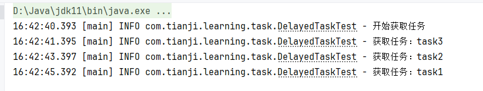

可以看到，任务以非常精准的时间执行了。这里不难发现，延迟队列的任务并不是自动执行的，而是需要手动调用队列take方法来获取任务。简单来说，延迟队列只负责存储任务，当任务到期前，无法从队列中获取任何任务，只有当任务到期后才能获取。而任务的执行必须由开发人员自己定义线程实现

#### 提交学习记录接口优化开发

现在需要Redis操作类，用于添加、查询、删除Redis缓存，同时需要添加一个延迟任务到延迟队列中，那么这个类最好声明为一个单独的Service，由Service层来独立控制延迟任务，以及注入RedisTemplate，或者也可以进一步将RedisTemplate提升为RedisRepository，避免Service过于复杂

