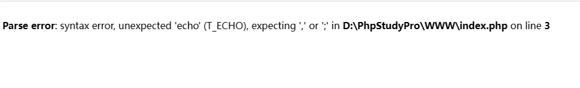
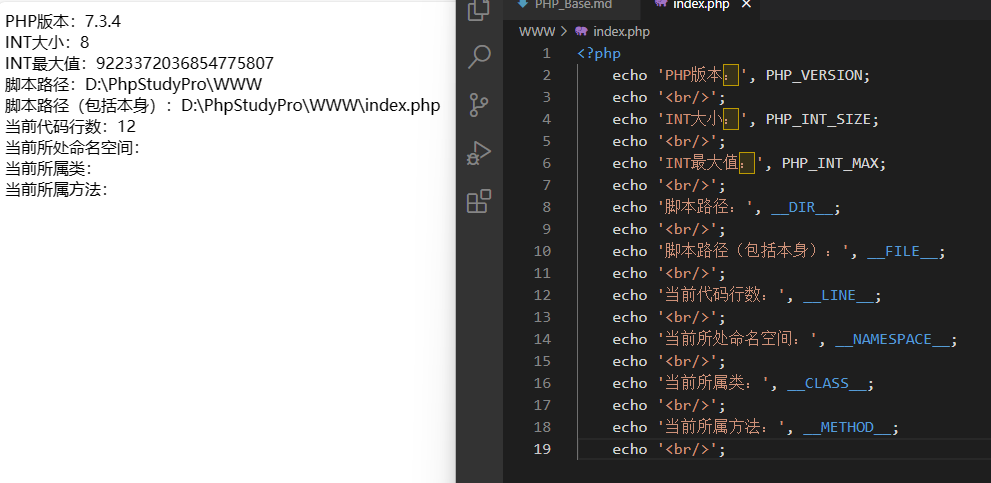
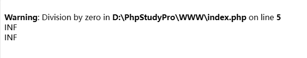
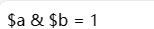
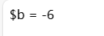
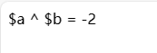
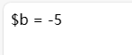
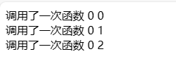

# PHP Basic

`更新时间：2024-3-17`

注释解释：

- `<>`必填项，必须在当前位置填写相应数据

- `{}`必选项，必须在当前位置选择一个给出的选项

- `[]`可选项，可以选择填写或忽略

# PHP语法初步

PHP是运行在服务器端的一种脚本语言，可以嵌入到HTML中

## PHP代码标记

在PHP的发展历史中，可以使用多种标记来区分PHP脚本

- ASP标记： `<% PHP代码 %>`

- 短标记： `<? PHP代码 ?>`

- 脚本标记： `<script language="php"> PHP代码 </script>`

- 标准标记： `<?php PHP代码 ?>`

*注：ASP标记与短标记基本已经弃用，如需使用，需自行在配置文件中开启*

## PHP注释

PHP中注释分为两种，一种为行注释，另一种为块注释
- 行注释 `// 代码` 或者 `# 代码`

```php
<?php
    //这里是行注释
    #一次只能注释一行
```

- 块注释 `/* 代码 */`

```php
<?php
    /*这是块注释
    一次能注释多行*/
```

*注：所有的代码在写的过程中都需要进行注释，对于初学者而言，注释就是个人学习和写代码的的一个思路说明*

## PHP语句分隔符

在PHP中，代码以行为单位，系统需要通过判断行的结束，该结束通常是一个符号，即分号 `;`

```php
<?php
    echo 'hello, world';    //第一行代码
    $a = 0;                 //第二行代码
```

如果缺少分隔符，将会进行报错

> 

*注：最后一行PHP代码可以没有分隔符，`?>` 自带分隔符效果。代码编写过程中，如果只存在php代码，一般情况下末尾的 `?>` 省略*

---

# 变量

PHP是一种动态网站开发的脚本语言，动态语言的特点是交互性，会有数据的传递，传递的前提就是PHP能临时存储数据

## 变量基本概念

变量来源于数学，是计算机语言中能存储计算结果或能表示值抽象概念。变量可以通过变量名访问。在指令式语言中，变量通常是可变的

## 变量的使用

- 定义：在系统中添加对应的变量名。PHP中所有的变量名前都需要 `$` 来作为变量名标识符

```php
<?php
    var0;        //这不是一个变量
    $var1;       //这是一个变量
```

- 赋值：将数据赋值给变量名

```php
<?php
    $var0;          //定义一个变量
    $var0 = 0;      //对变量进行赋值
    $var1 = 'A';    //在定义的同时进行赋值
```

- 使用：通过变量名访问存储的数据

```php
<?php
    $var0 = 'A';    //定义一个变量并赋值
    echo $var0;     //将变量进行输出
```

- 丢弃：将变量从内存中删除

```php
<?php
    $var0 = 0;      //定义并赋值一个变量
    unset($var0);   //删除变量
```

## 变量命名规则

- 变量名前必须存在 `$` 标识符

- 变量名由字母、数字、下划线构成，但是不能以数字开头

```php
<?php
    $var0       //合法变量名
    $0var       //非法变量名
    $_var0      //合法变量名
    $var_0      //合法变量名
```

- 允许使用中文变量名，但是一般不建议使用

```php
<?php
    $变量名     //合法变量名
```

## 预定义变量

提前定义的变量，系统定义的变量，存储许多需要使用的数据

- `$_GET` ：所有以GET方式提交的表单数据

- `$_POST` ：所有以POST方式提交的表单数据

- `$_REQUEST` ：所有以GET和POST方式提交的数据

- `$GLOBALS` ：PHP中所有的全局变量

- `$_SERVER` ：服务器信息

- `$_SESSION` ：Session会话数据

- `$_COOKIE` ：Cookie会话数据

- `$_ENV` ：环境信息

- `$_FILES` ：用户上传的文件信息

*注：预定义变量都是数组类型*

## 可变变量

如果一个变量保存的是另一个变量的名字，那么可以直接通过这个变量访问另一个变量，需要在变量前多加个 `$`

```php
<?php
    $a = 'b';               //定义变量a，为变量a赋值字符b
    $b = 'bb';              //定义变量b，为变量b赋值字符串bb
    echo $a, '</br>';       //输出变量a的值和一个换行符
    echo $$a;               //输出变量a所存储字符对应变量名的值，即$b
```

> 

*注：PHP的可变变量与C语言的指针有所区别*

## 变量传值

将一个变量赋值给另一个变量称为变量传值，变量传值有两种方式： `值传递` 和 `引用传递`

- `值传递` ：将变量保存的值复制一份，然后将新的值给另一个变量保存，两个变量之间没有关系

```php
<?php
    $i = 1;
    $j = $i;            //值传递
    $j = 2;
    echo $i, $j;        //结果为1 2
```

- `引用传递` ：将变量保存的值所在的内存地址传递给另一个变量，两个变量指向同一块内存空间

```php
<?php
    $i = 1;
    $j = &$i;           //引用传值，&为引用标识符
    $j = 2;
    echo $i, $j;        //结果为2 2
```

---

# 常量

## 常量基本概念

一种在程序运行当中，不可改变的量。常量一旦定义，数据通常不可改变

## 常量定义形式

在PHP中有两种常量定义方式

- 使用常量定义函数： `define('常量名', 常量值);`

- 使用关键字（PHP5.3之后可用）： `const 常量名 = 常量值;`

```php
<?php
    define('PI', 3.1415926535897);      //定义常量PI
    const KUN = 2.5;                    //定义常量KUN
```

## 常量命名规则

1. 常量名不需要 `$` 变量标识符，一旦使用会被当作变量

2. 常量的名字由字母、数字、下划线组成，但不能由数字开头

3. 为表示与变量的区别，通常使用大写字母

4. 常量在定义的同时必须赋值

```php
<?php
    const name_ = 0;        //合法常量名，但是不推荐这么写
    const NAME_0 = 1;       //合法变量名
    const $NAME_1 = 2;      //非法变量名
    const 2_NAME = 3;       //非法变量名
    const NAME_3;           //未赋值
```

5. 使用define定义方式可以使用一些特殊字符

```php
<?php
    define('-_-','smile');      //合法变量名
    const -_- = 'smile';        //非法变量名
```

## 常量使用形式

- 普通常量访问形式与变量相同，直接使用常量名

```php
<?php
    echo NAME_0;
    $area = PI * 2 * 2;
```

- 特殊字符常量需要使用 `constant()` 函数访问

```php
<?php
    echo constant('-_-');
```

## 系统常量

系统帮助用户定义的常量，用户可以直接使用

- `PHP_VERSION` ：PHP版本号

- `PHP_INT_SIZE` ：整型大小

- `PHP_INT_MAX` ：整型能表示的最大值

在PHP中还有一些特殊的常量，由双下划线+常量名+双下划线命名。这些常量的值会随着环境变化，用户无法更改

- `__DIR__` ：当前脚本所在的绝对路径

- `__FILE__` ：当前脚本所在的绝对路径，包括文件本身

- `__LINE__` ：当前代码所处行数

- `__NAMESPACE__` ：当前所属命名空间

- `__CLASS__` ：当前所属类

- `__METHOD__` ：当前所属方法

> 

---

# 数据类型

数据类型在PHP中指的是存储的数据本身的类型，而不是变量的类型。PHP是一种弱类型语言，变量本身没有数据类型

PHP中数据分为三大类八小类

- 基本数据类型

    - `int / integer` ：整型，系统分配4个字节存储，表示整数类型

    - `float / double` ：浮点型，系统分配8个字节存储，表示小数或者整型无法存储的整数

    - `string` ：系统根据实际需要分配大小，表示字符串

    - `bool / boolean` 布尔型，只有两个值， `true` 和 `false`

- 复合数据类型

    - `object` ：对象类型，系统根据实际需要分配大小

    - `array` ：数组类型，一次性存放多个数据，系统根据实际需要分配大小

- 特殊数据类型

    - `resource` ：资源类型，用于存放PHP外部数据，系统根据实际需要分配大小

    - `NULL` ：空类型，只有一个值 `NULL` ，不能参与运算，不占用内存空间

*注：int类型在32位系统中默认为4字节，在64位系统中可能为8字节*

## 类型转换

在PHP中有两种类型转换方式

- 自动转换：系统根据需求自己判定，自己判断

- 强制转换：根据用户指定的数据类型进行转换。强制转换规则是在需要转换的变量前添加 `(目标数据类型)`

```php
<?php
    $i = 'abc123';              
    $j = '123abc';
    echo $m = $i + $j;               //自动转换
    echo $n = (int)$i + (int)$j;     //强制转换
```

*注：若自动类型转换被禁用，请将 `implicit-conversion = on` 添加到php.ini中*

## 类型判断

通过一组类型判断函数 `is_{int/float/...}(变量名)` 来判断变量类型，返回值为 `true` 和 `false` ，数据类型为bool。布尔类型不能使用 `echo` 直接查看值，应该使用 `var_dump()` 函数，该函数可以打印出变量的数据类型和值，无返回值

```php
<?php
    $a = 'abc';
    echo var_dump(is_string($a));
```

> 

还有一组函数可以用来获取以及设定数据的类型

- `Gettype()` ：获取变量的数据类型，返回值类型 `string`

- `Settype()` ：设置变量的数据类型，返回值类型 `bool` ，与强制转换有差别

```php
<?php
    $a = 'abc123';
    $b = 'abc456';
    (int)$a;                                 //对$a进行强制转换
    settype($b, 'int');                      //对$b设置数据类型
    echo gettype($a), ' ', gettype($b);      //获取$a和$b的数据类型
```

> 

## 整数类型

保存整数数值的类型，默认4个字节存储，最大32位，约42亿。但是在PHP中默认是有符号类型。PHP中提供了四种整型定义方式

- `$a = 110;` ：十进制定义

- `$b = 0b110` ：二进制定义，以 `0b` 开头

- `$c = 0110` ：八进制定义，以 `0` 开头

- `$d = 0x110` ：十六进制定义，以 `0x` 开头

## 浮点类型

小数类型以及超过整型所能存储范围的整数，但不保证精度，精度范围大概在15个有效数字左右。浮点类型有两种定义方式

- `$a = 1.23` ：小数定义

- `$a = 1.23e7` ：科学计数法定义，计算方法为 1.23 * 10 ^ 7

## 布尔类型

只有两个值 `true` 和 `false` ，通常用于判断比较

---

# 运算符

## 比较运算符

- `===` ：全等于，要求两边的数据的值和数据类型都相同

- `!==` ：不全等于，与全等于相对

```php
<?php
    $a = 123000;
    $b = 123e3;
    echo var_dump($a === $b), '<br/>';   //判断$a是否全等于$b
    echo var_dump($a == $b);             //判断$a的值是否等于$b
```

> 

## 连接运算符

连接运算是PHP中将多个字符串拼接的一种运算

- `.` ：连接运算符，将两个字符串连接在一起；

- `.=` ：拼接运算符，将两个字符串连接在一起，并赋值给左边的变量，类似 `+=`

```php
<?php
    $a = 'Hello,';
    $b = ' World!';
    echo $a . $b, '<br/>';          //使用连接运算符
    $a .= $b;                       //使用拼接运算符
    echo $a;
```

> 

## 错误抑制符

在PHP中有一些错误可以提前预知，而这些错误可能无法避免，但又希望报错给用户看，可以使用错误抑制符

- `@` ：在可能出错的表达式前使用，可以屏蔽报错信息

```php
1    <?php
2       $a = 10;
3       $b = 0;
4       $c = @($a / $b);
5       $d = $a / $b;
6       echo $c, '<br/>', $d;
```

> 

*注：此处报错信息提示错误在第5行，即未使用错误抑制符的一行*

## 位运算符

使用计算机中最小单位bit进行运算的运算符

- `&` ：按位与，两个都为1，则为1，否则为0

```php
<?php
    $a = 5;
    $b = -5;
    //假设该计算机只有8位，下面我们来模拟位运算
    //$a的原码、反码、补码全部相同，都是00000101
    //$b的原码为10000101，反码11111010，补码11111011
    //按位与运算
    //$a 00000101
    //$b 11111011
    //&  00000001
    //得到的结果是补码，符号位为0，原反补码相同，最终结果即为1
    echo '$a & $b = ', $a & $b;
```

> 

- `|` ：按位或，其中一个为1，则为1，两个都为0才为0

```php
<?php
    $a = 5;
    $b = -5;
    //按位或运算
    //$a 00000101
    //$b 11111011
    //|  11111111
    //符号位为1，反码11111110，原码10000001，最终结果为-1
    echo '$a | $b = ', $a | $b;
```

> 

- `~` ：按位非，一个位若为1，则为0，否则反之

```php
<?php
    $a = 5;
    $b = ~$a;
    //按位非运算
    //$a 00000101
    //~  11111010
    //符号位为1，反码11111001，原码10000110，最终结果为-6
    echo '$b = ', $b;
```

> 

- `^` ：按位异或，两个相同，则为0，不同则为1

```php
<?php
    $a = 5;
    $b = -5;
    //按位异或运算
    //$a 00000101
    //$b 11111011
    //^  11111110
    //符号位为1，反码11111101，原码10000010，最终结果为-2
    echo '$a ^ $b = ', $a ^ $b;
```

> 

- `<<` ：按位左移，向左移动相应位数，右边补0

```php
<?php
    $a = 5;
    $b = $a << 3;
    //按位左移运算
    //$a 00000101
    //<< 00101000
    //符号位为0，原反补相同，最终结果为40
    echo '$b = ', $b;
```

> 

- `>>` ：按位右移，向右移动相应位数，左边补符号位数，正数补0，负数补1

```php
<?php
    $a = -40;
    $b = $a >> 3;
    //按位右移运算
    //$a 11011000
    //>> 11111011
    //符号位为1，反码11111010，原码10000101，最终结果为-5
    echo '$b = ', $b;
```

> 

*注：位运算符同样存在按位与等 `&=` 、按位或等 `|=` 、按位异或等 `^=` 、按位左移等 `<<=` 等写法*

---

# 函数

## 静态变量

是在函数内部定义得变量，使用 `static` 关键词修饰，用来实现跨函数共享数据的变量。函数运行结束之后所有的局部变量都会被清空，如果重新运行函数，所有的局部变量都会被初始化

**基本语法**

```php
<?php
    function FuncName() {
        static $var = value;
    }
```

**示例**

```php
<?php
    function func() {
        $a = '调用了一次函数';
        $count_0 = 0;
        static $count_1 = 0;
        echo $a, ' ', $count_0++, ' ', $count_1++, '<br/>';
    }
    func();         //第一次调用函数，count_0为0，count_1为0
    func();         //第二次调用函数，count_0初始化为0，count_1为静态变量，沿用上次计算结果1
    func();         //第三次调用函数，count_0初始化为0，count_1沿用上次计算结果2，此时count_1实际为3
```

> 

静态变量的使用

1. 统计函数被调用的次数

2. 统筹函数多次计算得到的不同结果

## 可变函数

当有一个变量的值刚好是一个函数的名字，就可以使用变量名加括号来充当函数名使用

```php
<?php
    function func() {               //定义函数
        echo 'Hello, World!';
    }
    $a = 'func';                    //定义变量
    $a();                           //调用函数
```

> 

## 匿名函数

没有名字的函数

**基本语法**

```php
<?php
    $var = function() {
        函数体
    };
```

**示例**

```php
<?php
    $a = function() {               //定义匿名函数
        echo 'Hello, World!';
    };
    $a();                           //调用函数
```

> 

---

# 错误处理

## 错误分类

1. 语法错误：用户书写的PHP代码不符合语法规范，导致代码在编译过程中不通过

2. 运行错误：代码编译通过，但是代码在执行过程中会出现一些条件不满足导致的错误

3. 逻辑错误：代码编译通过，正常执行，但是计算结果不符合预期

## 错误代号

所有可以看到的错误代码都在PHP中被设置为了系统常量，可以直接使用

- 系统错误

    - `E_PARSE` ：编译错误，代码不会运行

    - `E_ERROR` ：致命错误，编译正常，代码运行，但是会在错误位置中断

    - `E_WARNING` ：警告错误，编译正常，代码运行，但是结果可能不符合预期

    - `E_NOTICE` ：通知错误，编译正常，代码运行，但是结果可能不符合预期

- 用户错误： `E_USER_ERROR` 、 `E_USER_WARNING` 、 `E_USER_NOTICE` ，用户在使用自定义错误触发的时候会用到的错误代号

- 其他错误： `E_ALL` 代表所有错误，建议在开发过程中使用