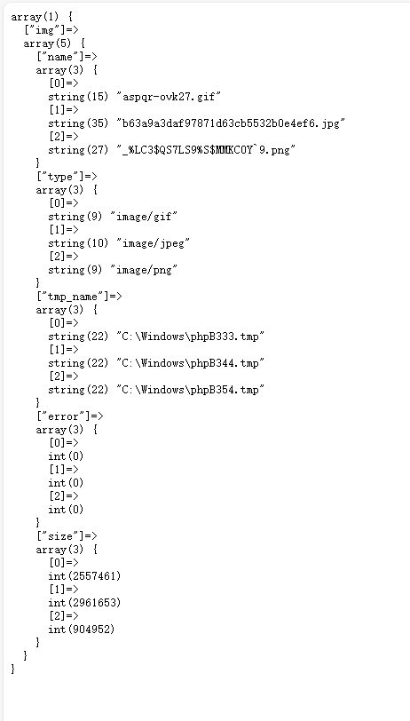

# PHP Medium

`更新时间：2024-3-31`

*注：该笔记记录的某些函数的参数并不完整，如有必要，请自行查阅php手册*

# 表单传值

## 概念

表单传值即是浏览器通过表单元素将用户的选择或者输入的数据提交给后台服务器语言

## 表单传值方式

### GET传值

- form表单：使用form标签， `<form method="GET">表单元素</form>`

- a标签：使用a标签， `<a href="www.test.com/index.php?subject=php">`

- location对象的href属性： `<script>location.href="www.test.com/index.php?data=php"</script>`

- location对象的assign()方法： `<script>location.assign("www.test.com/index.php?data=php")</script>`

### POST传值

POST传值只能使用form表单， `<form method="POST">表单元素</form>`

## GET与POST的区别

1. GET传输的数据主要用来获取，不改变服务器上的资源

2. POST传输的数据主要用来增加数据，会改变服务器上的资源

3. 传输方式上POST只能通过form表单，而GET可以使用form表单和URL

4. GET传输的数据可以在URL中对外可见，而POST不可见

## PHP接收数据的方式

- `$_GET` ：接收所有以GET方式提交的数据

- `$_POST` ：接收所有以POST方式提交的数据

- `$_REQUEST` ：接收所有以GET和POST方式提交的数据

**示例**

先创建一个用于查看接收数据的PHP页面

```php
<?php
    //查询以GET方式接收到的数据
    echo var_dump($_GET), '<br/>';
    //查询以POST方式接收到的数据
    echo var_dump($_POST), '<br/>';
    //查询以GET和POST方式接收到的数据
    echo var_dump($_REQUEST), '<br/>';
```

创建一个以POST方式提交表单的HTML页面

```html
<!DOCTYPE HTML>
<html>
    <body>
        <form method="POST" action="index.php">
            <input type="username" name="username" value=""/>
            <input type="submit" value="submit"/>
        </form>
    </body>
</html>
```

使用URL栏以GET方式传值

> 

接收到的数据

> 

使用POST方式传值

> 

接收到的数据

> 

*注： `$_GET` 、 `$_POST` 和 `$_REQUEST` 是系统创建的超全局预定义数组，表单中的name属性作为数组下标，如果提交的表单中不存在name属性，则不会被接收。例如POST方式提交的表单中，submit实质也是一个表单元素，但因为缺少name属性，而被忽略。在 `$_REQUEST`中，可能会存在 `$_GET` 和 `$_POST` 接收元素中数组下标相同的情况，此时 `$_POST` 的数据会被保留，验证如下*

创建一个同时拥有GET和POST方式传值的页面

```html
<!DOCTYPE HTML>
<html>
    <body>
        <form method="POST" action="index.php?username=abc">
            <input type="username" name="username" value=""/>
            <input type="submit" value="submit"/>
        </form>
    </body>
</html>
```

> 

直接点击submit，可以看到 `$_REQUEST` 中的username下标对应的变量为空

> 

返回上一步，这一次在输入栏中输入efg并提交

> 

由此可知，第一次提交的表单中，PHP同时获取到了GET和POST方式提交的数据，下标均为username，而 `$_REQUEST` 只保留POST方式提交的数据，因此为空；第二次提交的表单中，POST提交的值为efg，则 `$_REQUEST` 所对应的值也为efg

## 复选框

通常是一类内容以同样的形式传输给后台，数据库通常使用一个字段存储

**示例**

```html
<!DOCTYPE HTML>
<html>
    <head>
        <meta content="text/html" charset="utf-8"/>
    </head>
    <body>
        <form method="POST" action="index.php">
            <input type="checkbox" name="hobby[]" value="football"/>足球
            <input type="checkbox" name="hobby[]" value="basketball"/>篮球
            <input type="checkbox" name="hobby[]" value="table tennis"/>乒乓球
            <input type="submit" value="提交"/>
        </form>
    </body>
</html>
```

> 

## 复选框命名方式

在浏览器端，checkbox的name属性的值都会被提交，而PHP中 `$_GET` 和 `$_POST` 会对同名name属性进行覆盖，因此需要在name属性的后面加上一个 `[]` ，PHP会将 `[]` 作为数组

> 

## 复选框数据的常见处理

- 单选按钮的数据处理

1. 表单中使用的name属性同名即可

2. 后台不需要额外处理

3. 数据库储存只需要一个字段

4. PHP可以直接组织SQL存储到数据表

`radio` ：可以出现多个选择项，但是只能选择其中一个

```html
<!DOCTYPE HTML>
<html>
    <head>
        <meta content="text/html" charset="utf-8"/>
    </head>
    <body>
        <form method="POST" action="index.php">
            <input type="radio" name="gender" value="male"/>男性
            <input type="radio" name="gender" value="female"/>女性
            <input type="radio" name="gender" value="helicopter"/>直升机
            <input type="submit" value="提交"/>
        </form>
    </body>
</html>
```

> 

- 多选按钮的数据处理

1. 表单中name属性同名，但是需要在后面添加 `[]`

2. 后台接收到的数据是一个数组，无法直接存储到数据库中

3. PHP需要将数组转换成指定格式的字符串，使用 `implode()` 函数

4. PHP组织SQL储存到数据库

`implode($arg1, $arg2)` 函数有两个参数， `$arg1` 是分隔符，作为数组元素拼接之后的分隔作用， `$arg2` 是需要转换的数组。使用刚才的多选表单，新建一个PHP页面用于转换数组为字符串

```php
<?php
    $hobby = $_POST['hobby'];       //将$_POST中下标为hobby的值赋值给$hobby
    echo implode(',', $hobby);      //打印结果
```

> 

如果需要把字符串转换为数组，可以使用 `explode()` 函数。 `explode($arg1, $arg2)` 函数有两个参数， `$arg1` 是字符串分隔符， `$arg2` 是需要转换的字符串，主要作用是将 `$arg2` 以 `$arg1` 的形式分开，并合并为一个数组

```php
<?php
    $hobby_string = implode(',', $_POST['hobby']);      //将表单以字符串形式赋值给$hobby_string
    $hobby = explode(',', $hobby_string);               //将$hobby_string转换为数组  
    echo '<pre>';
    print_r($hobby);                                    //打印数组
```

> 

*注：如果表单没有设置默认选项，可能会造成空表单被提交而出现报错，可以在获取表单元素时使用三目运算符判断表单元素是否存在*

```php
<?php
    $value = isset($_POST['sub']) ? $_POST['sub'] : array();
```

--- 

# 文件上传

文件从用户电脑通过传输方式（Web表单）保存到服务器电脑指定目录下

步骤：

1. 服务器提供文件上传的表单

2. 用户选择需要上传的文件

3. 用户提交表单

4. 服务器将文件保存到临时目录，以文件格式保存（windows默认 `.tmp` 后缀）

5. 服务器脚本判断文件是否有效

6. 服务器脚本将有效文件从临时目录移动到指定目录

## 表单创建

**前提**

- `Method属性` ：必须为POST方式提交表单

- `Enctype属性` ：form表单的属性，主要是规范表单数据的编码方式，有三个值

    - `application/x-www-form-urlencoded` ：编码所有字符

    - `multipart/form-data` ：不对字符进行编码，在文件上传表单中必须使用该值

    - `text/plain` ：将空格转换为加号，其他字符不进行编码

- `file值` ：在创建文件上传表单时，form内的表单类型应该为file

**示例**

创建一个上传文件的表单

```html
<!DOCTYPE HTML>
<html>
    <head>
        <meta content="text/html" charset="utf-8"/>
    </head>
    <body>
        <form method="POST" enctype="multipart/form-data" action="index.php">
            <input type="file" name="img"/>
            <input type="submit" value="上传文件"/>
        </form>
    </body>
</html>
```

> 

## $_FILES变量

在PHP中， `$_FILES` 是专门用来保存用户上传文件的超全局变量。下面使用 `var_dump()` 来查看 `$_FILES` 接收到的数据

> 

- `name` ：文件在用户电脑上的名字

- `type` ：MIME（Multipurpose Internet Mail Extensions）类型，用于计算中识别文件类型

- `tmp_name` ：文件上传到服务器后临时保存的路径

- `error` ：文件上传错误代码，用来告知PHP文件上传过程中出现的问题

- `size` ：文件大小

## 移动临时文件到指定位置

- 判断是否为上传的文件 `is_uploaded_file($arg)` ，该函数只有一个参数，即是需要验证的文件名

```php
<?php
    $file = $_FILES['img'];                         //取出$_FILES中下标为img的元素，并赋值给$file
    if (is_uploaded_file($file['tmp_name'])) {      //校验上传文件
        echo '文件上传成功';
    }else{
        echo '文件上传失败';
    }
```

- 移动文件 `move_uploaded_file($arg1, $arg2)` ，该函数有两个参数， `$arg1` 是需要移动的文件名， `$arg2` 是指定的存放路径，同时需要指定文件名，故使用连接符将路径与文件名拼接

```php
<?php
    //取出$_FILES中下标为img的元素，并赋值给$file
    $file = $_FILES['img'];
    //校验上传文件
    if (is_uploaded_file($file['tmp_name'])) {
        //移动文件到uploads文件夹下，命名为源文件名
        if(move_uploaded_file($file['tmp_name'], 'uploads/' . $file['name'])) {
            echo '文件上传成功';
        }
    }else{
        echo '文件上传失败';
    }
```

## 多文件上传

- 同名表单

将form的name值后加上中括号

```html
<!DOCTYPE HTML>
<html>
    <head>
        <meta content="text/html" charset="utf-8"/>
    </head>
    <body>
        <form method="POST" enctype="multipart/form-data" action="index.php">
            <input type="file" name="img[]"/>
            <input type="file" name="img[]"/>
            <input type="file" name="img[]"/>
            <input type="submit" value="上传文件"/>
        </form>
    </body>
</html>
```

> 

- 异名表单

设置不同的name值

```html
<!DOCTYPE HTML>
<html>
    <head>
        <meta content="text/html" charset="utf-8"/>
    </head>
    <body>
        <form method="POST" enctype="multipart/form-data" action="index.php">
            <input type="file" name="head"/>
            <input type="file" name="body"/>
            <input type="file" name="foot"/>
            <input type="submit" value="上传文件"/>
        </form>
    </body>
</html>
```

### 多文件上传的 $_FILES 数据结构

- 同名表单

> 

从上图可以看出，同名表单会将表单名形成一个数组，同时将文件对应的五个要素都形成对应数量的数组。每个文件上传对应的数组元素的下标是一致的

- 异名表单

> 

从上图可以看出，每个文件都会形成独立的五个数组元素

### 多文件信息的遍历读取和处理

- 异名表单

遍历数组，依次取出数组中的元素进行上传

```php
<?php
    //遍历$_FILES数组
    foreach($_FILES as $file) {
        //校验上传文件
        if(is_uploaded_file($file['tmp_name'])) {
            //移动上传文件到uploads文件夹下，命名为源文件名
            move_uploaded_file($file['tmp_name'], 'uploads/' . $file['name']);
        }
    }
```

- 同名表单

从$_FILES中取出对应五个元素，然后存放到不同的数组中。

```php
<?php
    //判断上传文件存在且是一个数组，即是多文件上传
    if(isset($_FILES['img']['name']) && is_array($_FILES['img']['name'])) {
        //创建临时数组用于构建文件
        $tmp = array();
        //遍历$_FILES['img']['name']，即是遍历所有上传文件。这里的$sub是遍历到的下标，$name是$_FILES['img']['name']的下标$sub所对应的值
        foreach($_FILES['img']['name'] as $sub => $name) {
            //将获取到的元素储存到临时数组
            $tmp[] = array(
                'name' => $name,
                'type' => $_FILES['img']['type'][$sub],
                'tmp_name' => $_FILES['img']['tmp_name'][$sub],
                'error' => $_FILES['img']['error'][$sub],
                'size' => $_FILES['img']['size'][$sub]
            );
        }
    }
    //遍历临时数组
    foreach($tmp as $file) {
        //校验上传文件
        if(is_uploaded_file($file['tmp_name'])) {
            //移动上传文件到uploads文件夹下，命名为源文件名
            move_uploaded_file($file['tmp_name'], 'uploads/' . $file['name']);
        }
    }
```

## 文件上传后续问题

实现上传代码的重复利用，也就是封装文件上传函数

执行步骤：

1. 封装一个上传函数

2. 判断文件是否有效

3. 判断保存路径是否有效

4. 判断文件上传过程中是否存在错误

5. 判断文件类型

6. 判断文件格式

7. 构建文件名

8. 移动文件到指定目录

```php
<?php
    //PHP单文件上传函数封装
    //作用：实现单个文件上传
    //需要的参数：
    //@param0 array $file 需要上传的文件信息
    //@param1 array $allow_type 允许上传的MIME类型
    //@param2 string $path 文件上传的路径
    //@param3 string &$error 文件上传的错误信息
    //@param4 array $allow_format = array() 允许上传的文件格式
    //@param5 int $max_size 允许上传文件的最大值
    function upload_single($file, $allow_type, $path, &$error, $allow_format = array(), $max_size) {
        //判断文件是否有效，这里使用逻辑非方便书写
        if(!is_array($file) || !isset($file['error'])) {
            //文件无效
            $error = 'Not a valid file!';
            return false;
        }
        //判断路径是否有效
        if(!is_dir($path)) {
            //路径不存在
            $error = 'Path does not exist!';
            return false;
        }
        //判断文件上传过程中是否存在错误
        switch($file['error']) {
            //文件超出服务器指定大小
            case 1:
            case 2:
                $error = 'File oversize!';
                return false;
            //文件没有被完全上传
            case 3:
                $error = 'File was not fully uploaded!';
                return false;
            //用户没有选择文件
            case 4:
                $error = 'File was empty!';
                return false;
            //服务器路径，权限异常
            case 6:
            case 7:
                $error = 'File was not saved successfully!';
                return false;
        }
        //判断MIME文件类型
        if(!in_array($file['type'], $allow_type)) {
            //文件类型不支持
            $error = 'File type is not supported!';
            return false;
        }
        //判断文件格式，先取出文件名后缀，并去除后缀名前面的点
        $ext = ltrim(strrchr($file['name'], '.'), '.');
        //判断文件格式是否被允许
        if(!empty($allow_format) && !in_array($ext, $allow_format)) {
            $error = 'File format is not supported!';
            return false;
        }
        //判断文件大小
        if($file['size'] > $max_size) {
            //文件超出大小
            $error = 'File oversize! Please less than ' . $max_size . ' byte' ;
            return false;
        }
        //验证上传文件
        if(!is_uploaded_file($file['tmp_name'])) {
            //不是上传的文件
            $error = 'Not uploaded file!';
            return false;
        }
        //构建文件名
        $filename = strstr($file['type'], '/', TRUE) . date('YYYYmmdd');
        //产生随机字符串
        for($i = 0; $i < 4; $i++) {
            $filename .= chr(mt_rand(65, 90));
        }
        //拼凑完整文件名
        $filename .= '.' . $ext;
        //移动文件到指定目录
        if(move_uploaded_file($file['tmp_name'], $path . '/' . $filename)) {
            //文件上传成功
            return $filename;
        }else{
            //移动失败
            $error = 'File moving failed!';
            return false;
        }
    }
```

下面来验证代码可用性，创建一个单文件上传表单

```html
<!DOCTYPE HTML>
<html>
    <head>
        <meta content="text/html" charset="utf-8"/>
    </head>
    <body>
        <form method="POST" enctype="multipart/form-data" action="index.php">
            <input type="file" name="img"/>
            <input type="submit" value="上传文件"/>
        </form>
    </body>
</html>
```

提供数据

```php
<?php
    //上传的文件
    $file = $_FILES['img'];
    //上传路径
    $path = 'uploads/';
    //允许的文件类型
    $allow_type = array('image/jpeg', 'image/png', 'image/gif', 'image/jpg', 'image/webp');
    //允许的文件格式
    $allow_format = array('jpg', 'png', 'gif', 'webp');
    //限制文件大小
    $max_size = 200000000;

    //调用文件上传函数
    if($filename = upload_single($file, $allow_type, $path, $error, $allow_format, $max_size)) {
        echo $filename;
    }else{
        echo $error;
    }
```

**测试**

- 上传成功

> 

- 未选择文件

> 

- 文件类型错误

> 

---

# MySQL扩展

## 连库基本操作

- 连接数据库服务器

`mysqli_connect($address, $username, $password, $new_link)` ：连接数据库的函数，返回值类型为object，有四个参数， `$address` 是服务器地址， `$username` 是数据库用户名， `$password` 是对应密码，三个参数的数据类型都是string， `new_link` 是是否启用新的连接，数据类型为bool，如果在一次连接关闭后再次连接数据库，连接的资源实际上为同一个，如果 `$new_link` 为 `TRUE` ，那么会建立一个新的连接

```php
<?php
//连接到mysql服务器
$link = mysqli_connect('localhost:3306', 'root', 'root');
```

连接资源默认超全局，任何地方都可以使用该资源进行数据库的其他操作

*注：在PHP5之后mysql_系列函数被mysqli_替代，该笔记使用的PHP版本为7.3.4*

- 设置连接编码

保证客户端与数据库之间的沟通顺畅，有两个函数可以使用，这里的 `CHARSET` 是需要设置的字符集

`mysqli_query($mysql, 'set names CHARSET')` ：使用sql查询语句， `$mysql` 是连接的数据库资源

`mysqli_set_charset($mysql, 'CHARSET')` ：使用封装函数 `$mysql` 是连接的数据库资源

```php
<?php
//连接到mysql服务器
$link = mysqli_connect('localhost:3306', 'root', 'root');
//设置连接编码
mysqli_query($link, 'set names utf8');
```

- 选定要使用的数据库

与设置编码类似，有两种方式，这里的 `DB` 是需要选定的数据库

`mysqli_query($mysql, 'use DB')` ：使用sql查询语句，`$mysql` 是连接的数据库资源

`mysqli_select_db($mysql, 'DB')` ：使用封装函数 `$mysql` 是连接的数据库资源

```php
<?php
//连接到mysql服务器
$link = mysqli_connect('localhost:3306', 'root', 'root');
//设置连接编码
mysqli_query($link, 'set names utf8');
//选择数据库
mysqli_query($link, 'use php');
```

- 关闭连接

MySQL服务器连接资源有限，需要主动释放连接

`mysqli_close($mysql)` ：主动关闭MySQL连接， `$mysql` 是连接的数据库资源

```php
<?php
//连接到mysql服务器
$link = mysqli_connect('localhost:3306', 'root', 'root');
//设置连接编码
mysqli_query($link, 'set names utf8');
//选择数据库
mysqli_query($link, 'use php');    
//关闭连接
mysqli_close($link);
```

*一般来说，php在脚本执行完成后会自动关闭连接，不需要手动关闭*

## 执行增删改操作

实质上就是使用 `mysqli_query()` 函数执行相关sql语句，我们先创建一个接收数据的数据库和表

```sql
-- 创建数据库
create database New charset utf8;
-- 创建数据表
create table news(
    id int primary key auto_increment,
    title varchar(50) not null comment '新闻标题',
    content text comment '内容',
    isTop enum('Y', 'N') comment '是否置顶',
    publisher varchar(20) not null comment '发布人',
    pub_time int not null comment '发布时间'
)charset utf8;
```

- 插入数据

```php
<?php
//引入连接数据库文件
include_once('link.php');
//组织sql语句
$sql = "insert into news values(null,'学习资料','这里都是学习资料','Y','Ki1z',2024)";
//执行sql语句
if(mysqli_query($link, $sql)) {
    echo '插入成功';
}else{
    echo '插入失败';
}
```

> 

> 

- 更新数据

```php
<?php
//引入连接数据库文件
include_once('link.php');
//组织sql语句
$sql = "update news set content = '这里没有学习资料:(' where id = 1";
//执行sql语句
if(mysqli_query($link, $sql)) {
    echo '更新成功';
}else{
    echo '更新失败';
}
```

> 

> 

- 删除操作

```php
<?php
//引入连接数据库文件
include_once('link.php');
//组织sql语句
$sql = "delete from news where id = 1";
//执行sql语句
if(mysqli_query($link, $sql)) {
    echo '删除成功';
}else{
    echo '删除失败';
}
```

> 

> 

## 执行查询操作

sql语句执行后，返回给php的是一个结果集，除非sql语句本身无法执行，则返回值永远不为false，因此需要对结果集进行解析

- 查看结果集结构

```php
<?php
//引入连接数据库文件
include_once('link.php');
//组织sql语句
$sql = "select * from news";
//执行sql语句
$res = mysqli_query($link, $sql);
//查看数据集结构
var_dump($res);
```

> 

- 获取结果集行数

`mysqli_num_rows($res)` ：获取指定结果集的行数， `$res` 为指定结果集

```php
<?php
//引入连接数据库文件
include_once('link.php');
//组织sql语句
$sql = "select * from news";
//执行sql语句
$res = mysqli_query($link, $sql);
//查询结果行数
echo mysqli_num_rows($res);
```

**解析结果集**

解析结果集有三种方式，即对应三个函数

- `mysqli_fetch_assoc($res)` ：获取关联数组，字段名作为数组下标，字段值作为数组值

```php
<?php
//引入连接数据库文件
include_once('link.php');
//组织sql语句
$sql = "select * from news";
//执行sql语句
$res = mysqli_query($link, $sql);
//解析结果集
$row = mysqli_fetch_assoc($res);
echo '<pre>';
print_r($row);
```

> 

- `mysqli_fetch_row($res)` ：获取索引数组，只获取字段的值，数组下标从0开始

```php
<?php
//引入连接数据库文件
include_once('link.php');
//组织sql语句
$sql = "select * from news";
//执行sql语句
$res = mysqli_query($link, $sql);
//解析结果集
$row = mysqli_fetch_row($res);
echo '<pre>';
print_r($row);
```

> 

- `mysqli_fetch_array($res, TYPE)` ：同时获取关联数组和索引数组，但是可以通过第二个参数 `TYPE` 指定获取方式，有三个值，`MYSQLI_ASSOC` 获取关联数组，等同于 `mysqli_fetch_assoc()` ， `MYSQLI_NUM` 获取索引数组，等同于 `mysqli_fetch_row()` ， `MYSQLI_BOTH` 同时获取，默认值

```php
<?php
//引入连接数据库文件
include_once('link.php');
//组织sql语句
$sql = "select * from news";
//执行sql语句
$res = mysqli_query($link, $sql);
//解析结果集
$row = mysqli_fetch_array($res, MYSQLI_BOTH);
echo '<pre>';
print_r($row);
```

> 

## 错误函数

- `mysqli_error($mysql)` ：获取错误信息， `$mysql` 为指定的数据库资源

- `mysqli_errno($mysql)` ：获取错误代码， `$mysql` 为指定的数据库资源

```php
<?php
//引入连接数据库文件
include_once('link.php');
//组织sql语句
$sql = "select * from new";
//执行sql语句
$res = mysqli_query($link, $sql);
//判断sql语句是否出现错误
if(!$res) {
    echo '错误代码：' . mysqli_errno($link) . '<br/>';
    echo '错误信息：' . mysqli_error($link) . '<br/>';
    //终止脚本
    exit();
}
```

> 

## 综合实践

假设需要创建一个新闻网站，可以实现新闻的增删改查操作

### 1. 创建公共文件，该文件内包括mysql数据库的连接

- 连接数据库

```php
<?php
$link = mysqli_connect('localhost', 'root', 'root') or die('数据库连接失败！');
```

- 封装检查sql语句的函数，该函数需要两个参数，一个提供sql语句，另一个提供数据库资源，返回sql语句执行结果；若sql语句执行失败，则打印相关信息

```php
<?php
function sql_check($sql, $link) {
    //执行sql语句
    $res = mysqli_query($link, $sql);
    //sql语句错误提示
    if(!$res) {
        echo '错误代码：'. mysqli_errno($link) . '<br/>';
        echo '错误信息：'. mysqli_error($link) . '<br/>';
        exit();
    }
    //返回结果
    return $res;
}
```

- 指定字符集和数据库

```php
<?php
//指定字符集
sql_check('set names utf8', $link);
//指定数据库
sql_check('use New', $link);
```

### 2. 添加新闻表单

- 新建一个可以添加新闻的HTML表单

这里为了方便，我制作了一个简单的HTML页面

```html
<!DOCTYPE HTML>
<html>
    <head>
        <meta content="text/html" charset="utf-8"/>
        <style>
            #back{
                margin-top: -23px;
                margin-left: 50px;
            }
        </style>
    </head>
    <body>
        <form method="POST" action="add.php" id="form">
            标题：<input type="text" name="title" value=""/>
            <br/>
            内容：<input type="text" name="content" value=""/>
            <br/>
            发布人：<input type="text" name="pulisher" value=""/>
            <br/>
            是否置顶 <input type="radio" name="isTop"/>是
            <input type="radio" name="isTop" checked/>否
            <br/><br/>
            <input type="submit" value="保存"/>
        </form>
        <form action="./index.html" id="back">
            <input type="submit" value="返回"/>
        </form>
    </body>
</html>
```

> 

- 提交数据到后台指定的php脚本

```php
<?php
//接收用户文件
//先判断数据是否存在，再使用trim()函数去除空格
$title = isset($_POST['title']) ? trim($_POST['title']) : '';
$content = isset($_POST['content']) ? trim($_POST['content']) : '';
$isTop = isset($_POST['isTop']) ? $_POST['isTop'] : 'N';
$publisher = !empty($_POST['publisher']) ? trim($_POST['publisher']) : '佚名';
```

- 后台脚本处理数据，插入数据库

    - 数据合法性验证，标题，内容不能为空

    ```php
    //数据合法性验证
    if(empty($title) || empty($content)) {
        //刷新页面
        header("Refresh:2; url=insert.html");
        //打印提示并终止脚本
        exit('标题或内容不能为空！');
    }
    ```
    - 数据入库操作，并跳转回主页

    ```php
    //引入公共文件
    include_once('link.php');
    //构建sql语句
    $sql = "insert into news values(null, '{$title}', '{$content}', '{$isTop}', '{$publisher}', 2024)";
    //执行sql语句，并获取自增长ID
    $insert_id = sql_check($sql, $link);
    //操作成功，刷新页面并返回
    header("Refresh:2; url=index.html");
    exit('保存成功！');
    ```

下面来简单测试一下，写一点内容

> 

提交，提示保存成功

> 

在mysql中进行查询

> 

### 3. 主页列表显示

将数据库中所有的数据查询出来 ，并按照HTML模板把所有数据按指定的格式显示输出

- 从数据库查询所有数据

    - 查询方式一：使用for循环遍历数组

    ```php
    <?php
    //引入公共文件
    include_once('link.php');
    //构建sql语句
    $sql = 'select * from news';
    //执行sql语句
    $res = sql_check($sql, $link);
    //获取结果
    //新建一个数组用于存放结果数组
    $res_array = array();
    //遍历数组
    $num = mysqli_num_rows($res);
    for($i = 0; $i < $num; $i++) {
        $res_array[] = mysqli_fetch_assoc($res);
    }
    ```

    - 查询方式二：使用while循环，如果 `mysqli_fetch_assoc()` 的返回值不为false，持续循环

    ```php
    //获取结果
    //新建一个数组用于存放结果数组
    $res_array = array();
    //遍历数组
    while($row = mysqli_fetch_assoc($res)) {
        $res_array[] = $row;
    };
    ```

- 构建HTML显示模板

代码过长，这里只展示效果

> 

- 将查询到的内容插入到模板中

    - 创建对应数量的表格，使用 `foreach()` 遍历 `$res_array` 数组，数组中有几个元素，就遍历几次

    ```html
    <tbody>
        <?php foreach($res_array as $sub => $value): ?>
        <tr>
            <td id="id">0</td>
            <td id="title">测试标题</td>
            <td id="content">测试内容</td>
            <td id="isTop">否</td>
            <td id="publisher">未知</td>
            <td id="pub_time">2024</td>
            <td id="button">
                <a href="edit.html">修改</a>
                <a href="">删除</a>
            </td>
        </tr>
        <?php endforeach; ?>
    </tbody>
    ```

    - 插入对应数据，即是将表格对应的单元格内的数据改为PHP输出

    ```html
    <tbody>
        <?php foreach($res_array as $sub => $value): ?>
        <tr>
            <td id="id"><?php echo $sub + 1 ?></td>
            <td id="title"><?php echo $value['title'] ?></td>
            <td id="content"><?php echo $value['content'] ?></td>
            <td id="isTop"><?php echo $value['isTop'] ?></td>
            <td id="publisher"><?php echo $value['publisher'] ?></td>
            <td id="pub_time"><?php echo $value['pub_time'] ?></td>
            <td id="button">
                <a href="edit.html">修改</a>
                <a href="">删除</a>
            </td>
        </tr>
        <?php endforeach; ?>
    </tbody>
    ```

内容插入完成

> 

### 4.删除新闻

- 传入需要删除新闻的id到删除页面

```html
<td id="button">
    <a href="edit.html">修改</a>
        |
    <a href="delete.php?id=<?php echo $value['id'];?>" onclick="return confirm('是否删除该新闻？')">删除</a>
</td>
```

- 构建删除页面

```php
<?php
//引入公共文件
include_once 'link.php';
//接收id
$id = isset($_GET['id']) ? $_GET['id'] : 0;
//id存在性判断
if($id == 0) {
    header('Refresh: 2; url=index.php');
    exit('新闻不存在！');
}
//构建sql语句
$sql = 'delete from news where id = ' . $id;
//执行sql语句
sql_check($sql, $link);
//刷新页面
header('Refresh: 2; url=index.php');
exit('删除成功！');
```

删除id为6的新闻

> 

> 

### 5.修改新闻

- 传入需要修改的新闻id到指定页面

```html
<td id="button">
    <a href="edit.php?id=<?php echo $value['id'];?>">修改</a>
        |
    <a href="delete.php?id=<?php echo $value['id'];?>" onclick="return confirm('是否删除该新闻？')">删除</a>
</td>
```

- 构建编辑脚本

    - 接收新闻id

    ```php
    <?php
    //引入公共文件
    include_once 'link.php';
    //接收id
    $id = isset($_GET['id']) ? $_GET['id'] : 0;
    //id存在性判断
    if($id == 0) {
        header('Refresh: 2; url=index.php');
        exit('新闻不存在！');
    }
    ```

    - 获取当前id对应的新闻信息

    ```php
    //构建sql语句
    $sql = 'select * from news where id = ' . $id;
    //执行sql语句
    $res = mysqli_fetch_assoc(sql_check($sql, $link));
    //包含HTML模板
    include_once 'edit.html';
    ```

- 构建HTML编辑模板

```html
<body>
    <form method="POST" action="update.php" id="form">
        <input type="hidden" name="id" value="<?php echo $res['id']; ?>"/>
        标题：<input type="text" name="title" value="<?php echo $res['title']; ?>"/>
         <br/>
         内容：<input type="text" name="content" value="<?php echo $res['content']; ?>"/>
        <br/>
        发布人：<input type="text" name="publisher" value="<?php echo $res['publisher']; ?>"/>
        <br/>
        是否置顶 <input type="radio" name="isTop" value="Y" <?php echo $res['isTop'] == 'Y' ? 'checked' : ''; ?>/>是
        <input type="radio" name="isTop" value="N" <?php echo $res['isTop'] == 'N' ? 'checked' : ''; ?>/>否
        <br/><br/>
        <input type="submit" value="保存"/>
    </form>
    <a href="index.php" id="back">
        <input type="submit" value="返回"/>
    </a>
</body>
```

*注：在构建模板时需要添加一个表单，用于提交需要修改新闻的id，这里使用隐藏表单*

- 构建更新脚本

    - 验证数据合法性

    ```php
    <?php
    //接收id并验证
    $id = isset($_POST['id']) ? intval($_POST['id']) : 0;
    if($id == 0) {
        header("Refresh:2; url=insert.php");
        exit('新闻不存在！');
    }
    //对其他信息进行验证
    $title = isset($_POST['title']) ? trim($_POST['title']) : '';
    $content = isset($_POST['content']) ? trim($_POST['content']) : '';
    $isTop = isset($_POST['isTop']) ? $_POST['isTop'] : 'N';
    $publisher = !empty($_POST['publisher']) ? trim($_POST['publisher']) : '佚名';
    if(empty($title) || empty($content)) {
        header("Refresh:2; url=index.php");
        exit('标题或内容不能为空！');
    }
    ```

    - 更新数据到数据库

    ```php
    //引入公共文件
    include_once('link.php');
    //构建sql语句
    $sql = "update news set title = '{$title}', content = '{$content}', isTop = '{$isTop}', publisher = '{$publisher}' where id = " . $id;
    //执行sql语句
    sql_check($sql, $link);
    header("Refresh:2; url=index.php");
    exit('保存成功！');
    ```

修改id为4的新闻

> 

将发布人留空，则默认为佚名，同时取消置顶

> 

---

# HTTP协议

## HTTP协议概念

HTTP，即超文本传输协议，Hypertext transfer protocol，是一种详细规定了浏览器和万维网服务器之间互相通信的规则，通过因特网传送万维网文档的数据传送协议

## HTTP特点

- C/S模式，即客户端/服务器模式

- 简单快速：客户向服务器请求服务时，只需传送请求方法和路径。由于HTTP协议简单，使得HTTP服务器的程序规模小，通信速度快

- 灵活：HTTP允许传输任意类型的数据对象

- 无连接：无连接的含义是限制每次链接只处理一个请求。服务器处理完客户的请求，并收到客户的应答后，立即断开连接。采用这种方式可以节省传输时间

- 无状态：无状态是指协议对于事务处理没有记忆能力。缺少状态意味着如果后续需要处理前面的信息必须重新传输，这可能导致每次连接传输的数据增大，但是服务器在不需要先前信息时的应答更快

## HTTP请求

### 请求行

请求的第一行内容，包含基础请求信息，形式： `请求方式` `资源路径` `协议版本号`

如图中第一行 `GET / HTTP/1.1`

> 

### 请求头

请求头就是各项协议内容，但是不会每次都全部使用

- `Host` ：请求的主机地址

- `Accept` ：当前请求能够接收的返回类型，一般是MIME类型

- `Accept-Language` ：接收的语言

- `User-Agent` ：用于代理，一般是客户信息，如操作系统，浏览器内核等

### 请求体

请求的数据，只有POST方式才有请求体，GET请求的数据会跟在url之后，在请求行的资源路径中体现，基本格式： `资源名=资源值&资源名=资源值&...`

如图中第22行，请求体与请求头之间隔开一行

> 

## HTTP响应

### 响应行

响应的第一行，格式： `协议版本号` `状态码` `状态消息`

> 

### 响应头

具体响应内容

- `Date` ：响应时间

- `Server` ：响应服务器

- `Content-Length` ：响应体长度

- `Content-Type` ：响应数据格式

### 响应体

实际服务器响应给浏览器的内容

### HTTP常见状态码

- `200` ：ok，成功

- `403` ：Forbidden，拒绝访问

- `404` ：Not Found，文件不存在

- `500` ：Internal Server Error，服务器内部错误

### 常见HTTP响应设置

PHP中针对HTTP协议进行了底层设计，可以使用 `header()` 函数来对响应头进行修改。在使用header函数时，需要保证函数前无输出，任何一个在header前的输出都会导致header函数内的内容被识别为响应体，从而使函数失效

- `Location:{url}` ：立即重定向，服务器不再向下解析响应体

- `Refresh:{delay};url={url}` ：延时重新向，服务器会继续解析响应体

- `Content-Type:{file_type}` ：设置解析的文件MIME格式

- `Content-disposition:attachment;filename={file_name}` ：阻止浏览器解析，当作下载内容

## PHP模拟HTTP请求

PHP可以使用Curl扩展库来发送HTTP请求，Curl不仅支持HTTP，还支持HTTPS，FTP，TELNET等协议，Curl可以根据前缀时HTTP还是HTTPS自动选择是否加密发送内容

### Curl扩展

- `curl_init()` ：初始化一个连接，返回值类型为resource

> 

- `curl_setopt($res, $opt, $value)` ：设置请求选项，有三个参数， `$res` 是指定的连接资源， `$opt` 是指定的选项， `$value` 是选项对应的值，返回值类型为bool

    - `CURLOPT_URL` ：连接对象

    - `CURLOPT_RETURNTRANSFER` ：将响应以文件流的方式返回给请求脚本

    - `CURLOPT_POST` ：以POST方式发送请求，默认GET

    - `CURLOPT_POSTFIELDS` ：传递POST提交的数据，有两种形式，一种是字符串形式 `name=value&name=value&...` 和数组形式 `array('name' => 'value', 'name' => 'value',...)`

    - `CURLOPT_HEADER` ：获取响应header信息，默认丢弃

- `curl_exec($res)` ：执行请求，有一个参数，指定需要执行的连接，返回值类型为string

- `curl_close()` ：关闭连接

```php
<?php
//初始化连接
$res = curl_init();
//设置连接选项
curl_setopt($res, CURLOPT_URL, 'localhost/index.php');
curl_setopt($res, CURLOPT_RETURNTRANSFER,1);
curl_setopt($res, CURLOPT_HEADER,1);
//执行
$content = curl_exec($res);
echo $content;
//关闭连接
curl_close($res);
```

---

# 文件编程

## 文件编程初步认识

文件编程是指利用PHP代码对文件或文件夹进行增删改查操作

## 文件编程的分类

- 目录操作：对文件夹进行操作，文件夹本身其实是一种特殊格式的文件

- 文件操作：对内容文件进行操作

## 目录操作

**常用函数**

- `mkdir($path)` ：创建一个目录， `$path` 为目录路径，返回值类型为bool

- `rmdir($path)` ：删除一个目录， `$path` 为目录路径，返回值类型为bool

- `opendir($path)` ：打开一个目录， `$path` 为目录路径，返回一个resource类型的数据，包含目录下所有文件

- `readdir($res)` ：读取一个资源， `$res` 为指定资源，返回指针在该资源中所指文件的文件名，失败则为false。在文件夹中，第一个文件名和第二个文件名一定为 `.` 和 `..` ，代表当前目录和上级目录

```php
<?php
//打开sqli-labs目录
$res = opendir('sqli-labs');
//读取sqli-labs目录中的文件名
echo readdir($res), '<br/>';    //第一个文件
echo readdir($res), '<br/>';    //第二个文件
echo readdir($res), '<br/>';    //第三个文件
echo readdir($res), '<br/>';    //第四个文件
```

> 

一般来说，在使用readdir函数的时候会使用while循环遍历输出，来得到所有文件名

```php
<?php
//打开sqli-labs目录
$res = opendir('sqli-labs');
//遍历输出sqli-labs目录下的文件名
while($filename = readdir($res)) {
    echo $filename, '<br/>';
}
```

- `closedir($res)` ：关闭一个资源， `$res`是指定资源，无返回值

**其他函数**

- `dirname($path)` ：返回上一级目录名，返回值类型为string

- `realpath($path)` ：返回指定路径的绝对路径，返回值类型为string

- `is_dir($path)` ：判断指定路径是否合法，返回值类型为bool

- `scandir($path)` ：返回指定路径下所有文件名，返回值类型为array，相当于 `opendir()` 和 `readdir()` 的封装函数

```php
<?php
//上级目录
var_dump(dirname('./DVWA'));
echo '<br/>';
//绝对路径
var_dump(realpath('./DVWA'));
echo '<br/>';
//路径合法性
var_dump(is_dir('./DVWA'));
echo '<br/>', '<pre>';
//目录信息
var_dump(scandir('./DVWA'));
```

> 

## 递归遍历目录

递归遍历目录，将目录下所有文件和子目录下的所有文件输出

```php
<?php
//递归遍历目录函数
//@param1 string $dir 目录
//@param2 int $level = 0 目录层级
function recursion($dir, $level = 0) {
    //检查目录合法性
    if(!is_dir($dir))
        die($dir);
    //输出当前目录下所有文件名
    $filename = scandir($dir);
    foreach($filename as $file) {
        //排除'.'和'..'
        if($file == '.' || $file == '..')
            continue;
        //输出文件名
        echo str_repeat('&nbsp;&nbsp;', $level) . $dir . '/' . $file . '<br/>';
        //构建递归目录
        $sondir = $dir .'/'. $file;
        //递归
        if(is_dir($sondir))
            recursion($sondir, $level + 1);
    }   
}

//定义目录
$dir = './uploads';
//调用函数
recursion($dir);
```

> 

## 文件操作

### 常见文件操作函数

- `file_get_contents($file)` ：获取指定文件的所有内容，有一个常见参数， `$file` 是指定的文件，数据类型为string，返回值类型为int

- `file_put_contents($file, $content)` ：将指定内容写入指定文件内，有两个常见参数， `$file` 是指定的文件，数据类型为string， `$content` 是指定的内容，数据类型为mixed，返回值类型为string

```php
<?php
//文件操作函数
//创建文件
$text = 'hello, world!';
$file = './uploads/text.txt';
$write = file_put_contents($file,$text);
var_dump($write);
echo '<br/>';
//获取文件内容
$read = file_get_contents($file);
var_dump($read);
```

> 

### 其他文件操作函数

- `is_file($file)` ：判断文件是否存在，仅针对文件，不包含目录，有一个参数， `$file` 是指定的文件，数据类型为string，返回值类型为bool

- `filesize($file)` ：获取文件大小，有一个参数， `$file` 是指定的文件，数据类型为string，返回值类型为int或bool

- `file_exists($file)` ：判断文件是否存在，包含目录，有一个参数， `$file` 是指定的文件，数据类型为string，返回值类型为bool

- `unlink($file)` ：取消文件名与磁盘地址的连接，即删除文件，有一个常用参数， `$file` 是指定的文件，数据类型为string，返回值类型为bool

- `filemtime($file)` ：获取文件上次修改的时间，，有一个参数， `$file` 是指定的文件，数据类型为string，返回值类型为int或bool

```php
<?php
//其他文件操作函数
//文件验证
$file = './uploads/text.txt';
$catalog = './uploads';
var_dump(is_file($file));
var_dump(is_file($catalog));
echo '<br/>';
var_dump(file_exists($file));
var_dump(file_exists($catalog));
echo '<br/>';
//获取文件大小
var_dump(filesize($file));
echo '<br/>';
//获取文件上次修改的时间
$time = filemtime($file);
echo date('Y年m月d日', $time);
echo '<br/>';
//删除文件
var_dump(@unlink('./uploads/1.txt'));
```

> 

## 文件下载

HTML的a标签可以提供下载，但是只有浏览器无法解析的内容才会触发下载，而且a标签下载的文件路径会暴露文件在服务器中存储的位置

1. 指定字符集

```php
<?php
//设定字符集
header("Content-type:text/html;charset=utf-8");
```

2. 设定响应头

```php
<?php
//设定响应头
//设定文件类型
header("Content-type:application/octem-stream");
//设定文件计算方式
header("Accept-ranges:bytes");
//触发下载
$file = './uploads/text.txt';
header("Content-disposition:attachment;filename=" . $file);
header("Accept-length:" . filesize($file));
```

3. 读取输出文件

```php
//读取输出文件
//判断文件大小，选择输出方式
if(filesize($file) <= 8388608) {
    //文件小于等于8Mib，直接读取文件
    echo file_get_contents($file);
}else {
    //文件大于8Mib，分批读取文件，缓解服务器压力
    //打开文件，使用只读模式
    $res = @fopen($file,"r") or die();
    //输出文件，每次只读取1024字节
    while($row = fread($res, 1024)) {
        echo $row;
    }
}
```

---

# 会话技术

当用户访问某个web站点，在站点内访问多个web资源，然后断开连接，关闭浏览器，这个过程称为会话。会话技术是通过http协议让服务器能识别来自同一个浏览器的多次请求，从而方便用户在访问同一个网站的多次操作中，不需要进行额外的身份验证

## 会话技术分类

- Cookie：Cookie是Web服务器保存在用户浏览器上的小文本文件，包含了用户信息，当用户访问服务器时，Web站点可以通过Cookie识别用户，Cookie一般保存在http协议的请求头中

- Session：Session是将数据存储在服务器中，当用户访问Web站点时，Web站点通过访问Session来读取用户信息，Session的实现依赖Cookie。简单来说，Cookie作为用户的身份凭证，只有当站点确认用户身份后才会读取Session

## Cookie和Session的区别

1. 安全性：Session数据存储在服务器，安全性更高，Cookie存储在浏览器，安全性更低。CSRF跨站请求伪造攻击就是利用Cookie实施的

2. 数据大小：Session数据存储空间不限，而每个Cookie文件大小限制为4Kib，不同的浏览器对Cookie数量有不同的限制

3. 数据类型：Session可以存储复杂的数据类型，而Cookie只能存储数值和字符串类型的数据

4. 存储位置：Session存储在服务器中，Cookie存储在浏览器中

## Cookie

### Cookie原理

当用户访问Web站点时，站点检查用户的请求头中是否携带Cookie信息，若没有，则执行服务器中创建Cookie的脚本，并将Cookie结果添加到响应头中返回给浏览器，浏览器随即保存该Cookie，以备下次访问时使用。用户再次访问Web站点，站点检查用户的请求头，头中携带Cookie信息，则使用Cookie与服务器验证，确认用户身份

### Cookie简单使用

使用 `setcookie($name, $value)` 函数来设置Cookie，有两个常用参数， `$name`是该cookie的名字， `value`是cookie名对应的值。下面通过一个示例简单使用一下cookie

**示例**

设置一个网页，新用户访问时，显示“欢迎第一次访问”，老用户访问时，显示“欢迎回来”

```php
<?php
//读取Cookie信息
$cookie = $_COOKIE;
if($cookie['viewed'] == 1) {
    //老用户访问
    echo '欢迎回来';
}else {
    //新用户访问
    echo '欢迎第一次访问';
}
```

新用户访问

> 

设置Cookie

```php
<?php
//读取Cookie信息
$cookie = $_COOKIE;
if($cookie['viewed'] == 1) {
    //老用户访问
    echo '欢迎回来';
}else {
    //新用户访问
    echo '欢迎第一次访问';
    //为新用户设置cookie
    setcookie('viewed', 1);
}
```

查看浏览器Cookie

> 

### Cookie生命周期

在不设置Cookie生命周期或者设置为0的情况下，每次结束会话，浏览器会删除Cookie。 `setcookie()` 函数的第三个参数就是对应的生命周期，数据类型为int，使用时间戳，从格林威治时间开始

```php
<?php
//Cookie生命周期
//不设置生命周期
setcookie("age1", 1);
//设置生命周期为当前时间7天后
setcookie("age2", 1, time() + 7 * 24 * 60 * 60);
```

> 

### 删除Cookie

理论上来说，服务器没有权限删除浏览器保存的数据，但是可以通过将Cookie值设置为空或者将生命周期设置为 `time()` 当前时间戳来间接删除Cookie

```php
<?php
//创建Cookie
setcookie('age1', 1, time() + 7 * 24 * 60 * 60);
setcookie('age2', 1, time() + 7 * 24 * 60 * 60);
//删除Cookie
//将Cookie值设置为空
setcookie('age1', '');
//将Cookie生命周期设置为time()
setcookie('age2', 1, time());
```

> 

*注：Response Cookies是服务器向浏览器返回所有Cookie操作的结果，下一次浏览器访问服务器时，浏览器将会携带该Cookie结果*

### Cookie作用路径

在不同的文件夹层级中，Cookie有不同的访问权限，默认父文件夹中的Cookie可以在子文件夹中访问，反之则不能访问

- 父文件夹

```php
<?php
//创建Cookie
setcookie('father', 1);
//查看cookie
echo 'Father: ';
var_dump($_COOKIE);
```

> 

- 子文件夹

```php
<?php
//创建Cookie
setcookie('son', 1);
//查看cookie
echo 'Son: ';
var_dump($_COOKIE);
```

> 

`setcookie()` 的第四个参数就是作用路径，数据类型为string，表示Cookie作用路径，一般使用 `/` 来表示根目录

```php
<?php
//设置Son的Cookie作用路径为根目录
setcookie('son', 1, 0, '/');
```

> 

### Cookie跨子域

在同一级别的域名下，可以有多个子域名，实质上是DNS解析不同的主机地址，例如我有一个一级域名 `kiiz.com` ，其下有两个搭建在不同服务器的网站 `www.kiiz.com` 和 `blog.kiiz.com` ，一般来说，Cookie默认不允许跨子域共享

`setcookie()` 的第五个参数就是作用域，数据类型为string，表示Cookie可以共享的域名。当作用域设置为一级域名的时候，所有的二级域名都可以共享该Cookie。即当作用域设置为 `kiiz.com` 的时候， `www.kiiz.com` 和 `blog.kiiz.com` 都可以使用该Cookie

### Cookie存放数组数据

Cookie本身无法保存数组数据，但是可以通过某些手段来使Cookie保存数组数据

类似于复选框的情形，Cookie无法识别中括号，但是PHP会把中括号识别为数组，因此可以通过在Cookie名后面添加中括号来让Cookie保存数组数据

```php
<?php
//Cookie存放数组
setcookie('array[0]', 1);
setcookie('array[1]', 1);
setcookie('array[2]', 1);
setcookie('array[3]', 1);
setcookie('array[4]', 1);
//查看Cookie
echo '<pre>';
print_r($_COOKIE);
```

> 

*注：浏览器对Cookie的数量有限制，如非必要，尽量不要使用Cookie存放数组数据*

## Session

### Session原理

Session与浏览器无关，但是与Cookie有关。用户访问Web站点，PHP执行脚本代码，在碰到 `session_start()` 函数时开启Session会话，在Cookie中检测SessionID，如果ID存在，则使用该ID，若ID不存在，创建一个SessionID，并以Response Cookies形式返回给浏览器。开启Session会话后，PHP会初始化超全局变量 `$_SESSION` 一个空数组，然后使用SessionID来匹配对应配置文件，若不存在该文件，则创建一个SessionID的文件，若存在，则将该文件反序列化，然后存储到 `$_SESSION` 中。脚本执行结束时， `$_SESSION` 中的数据会序列化，然后存储到SessionID配置文件中

### Session简单使用

如果想要使用Session，必须先使用 `session_start()` 函数来开启session会话，只有开启了session会话后， `$_SESSION` 才会被初始化

使用Session实现跨脚本会话

脚本一 `session1.php` ：

```php
<?php
//开启Session会话
session_start();
//创建Session数据
$_SESSION['name'] = 'hello, world';
```

脚本二 `session2.php` ：

```php
<?php
//开启Session会话
session_start();
//输出session1.php的数据
echo $_SESSION['name'];
```

> 

观察Cookie，发现在Cookie中，自动添加了SessionID的值

> 

### 删除Session

- 删除指定Session

使用 `unset($arg)` 函数清除指定变量，有个一可重复参数， `$arg` 是指定的变量，数据类型为mixed，无返回值

```php
<?php
//开启Session会话
session_start();
//创建Session
$_SESSION['name'] = 'Mike';
$_SESSION['age'] = 24;
$_SESSION['gender'] = 'male';
//删除Session
unset($_SESSION['name'], $_SESSION['age'], $_SESSION['gender']);
```

- 删除全部Session

删除全部Session实质上就是将 `$_SESSION` 设置为空数组

```php
<?php
//开启Session会话
session_start();
//创建Session
$_SESSION['name'] = 'Mike';
$_SESSION['age'] = 24;
$_SESSION['gender'] = 'male';
//删除Session
$_SESSION = array();
```

### Session相关配置

有关Session的配置可以在php.ini中编辑，也可以在脚本内进行编辑

- `session.name` ：Session名，也就是Cookie中的PHPSESSID

- `session.auto_start` ：是否自动启动Session，默认关闭

- `session.save_handler` ：Session数据的保存方式，默认是文件形式

- `session.save_path` ：Session数据的保存路径

- `session.cookie_lifetime` ：SessionID对应Cookie的生命周期，默认是0，即会话结束

- `session.cookie_path` ：SessionID对应Cookie的作用路径，默认是/

- `session.cookie_domain` ：SessionID对应Cookie的作用域，默认为空

- `ini_set($option, $value)` ：修改该脚本中的php配置，有两个参数， `$option` 是需要修改的配置，数据类型为string， `$value` 是对应的值，数据类型为mixed，返回值类型为string或bool

### 销毁Session

Session删除只是将 `$_SESSION` 数组对应下标的元素删除，并没有删除对应的Session文件。 `session_destroy()` 函数提供了销毁Session的功能，没有参数，函数会自动销毁当前会话中的Session文件，返回值类型为bool

### 禁用Cookie使用Session

Session的跨脚本会话需要使用Cookie传输SessionID，如果禁用SessionID，那么理论上Session的跨脚本功能将无法实现

方案一：PHP提供了两个有关Session的函数， `session_id()` 和 `session_name()` 来获取SessionID和SessionName

- 获取SessionID和SessionName（脚本一）

```php
<?php
//开启Session会话
session_start();
//获取id和name
$name = session_name();
$id = session_id();
```

- 使用表单传值传递给其他脚本（脚本一）

```php
//设置Session内容
$_SESSION['value'] = 'hello, world';
//使用GET传值
echo "<a href='session2.php?{$name}={$id}'>click</a>";
```

- 接收Session（脚本二）

```php
//接收SessionID
$name = session_name();
$id = $_GET[$name];
```

- 获取Session内容（脚本二）

```php
//指定SessionID
session_id($id);
//开启Session会话
session_start();
//读取Session内容
echo $_SESSION['value'];
```

> 

方案二：Session机制中提供了自行解决方案

在PHP配置文件中，默认只允许Cookie传输SessionID，可以手动将其他传输方式开启，并关闭只允许Cookie传输SessionID功能关闭

- 设置配置文件

`session.use_only_cookies` = 0;

`session.use_trans_sid` = 1;

- 使用表单传值（脚本一）

```php
<?php
//开启Session会话
session_start();
//设置Session内容
$_SESSION['value'] = 'hello, world';
//使用GET传值
echo "<a href='session2.php'>click</a>";
```

- 获取Session内容（脚本二）

```php
<?php
//开启Session会话
session_start();
//读取Session内容
echo $_SESSION['value'];
```

> 